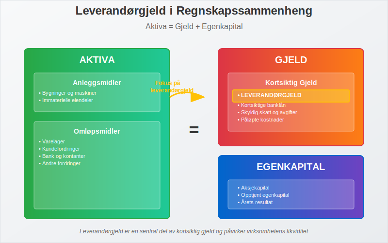
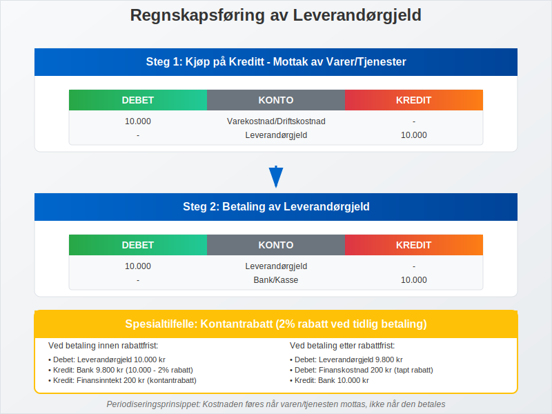
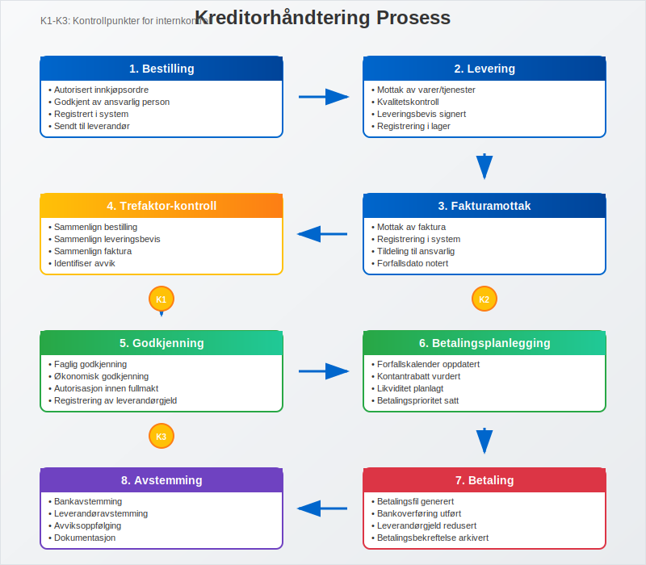

---
title: "Hva er Leverandørgjeld i Regnskap?"
meta_title: "Hva er Leverandørgjeld i Regnskap?"
meta_description: '**Leverandørgjeld** er en av de mest sentrale komponentene i [kortsiktig gjeld](/blogs/regnskap/kortsiktig-gjeld "Hva er Kortsiktig Gjeld? Komplett Guide til K...'
slug: hva-er-leverandorgjeld
type: blog
layout: pages/single
---

**Leverandørgjeld** er en av de mest sentrale komponentene i [kortsiktig gjeld](/blogs/regnskap/kortsiktig-gjeld "Hva er Kortsiktig Gjeld? Komplett Guide til Kortsiktige Forpliktelser") og representerer virksomhetens forpliktelser overfor leverandører av varer og tjenester. Som en kritisk del av [balansen](/blogs/regnskap/hva-er-balanse "Hva er Balanse i Regnskap? Komplett Guide til Balansens Oppbygging og Funksjon"), påvirker leverandørgjeld både virksomhetens [likviditet](/blogs/regnskap/hva-er-betalingsevne "Hva er Betalingsevne? Analyse av Likviditet og Finansiell Stabilitet") og leverandørforhold. Denne artikkelen gir en omfattende gjennomgang av leverandørgjeld, regnskapsføring, håndtering og optimalisering.

## Seksjon 1: Grunnleggende om Leverandørgjeld

**Leverandørgjeld** defineres som virksomhetens forpliktelser overfor leverandører for varer og tjenester som er mottatt, men ennå ikke betalt. Dette er en naturlig del av normal forretningsdrift og oppstår når virksomheten kjøper på **kreditt** i stedet for å betale kontant ved levering. For handelsbedrifter oppstår leverandørgjeld primært gjennom [varekjøp](/blogs/regnskap/hva-er-varekjop "Hva er Varekjøp? Komplett Guide til Regnskapsføring og Innkjøpsstyring") som skal selges videre til kunder.



### 1.1 Kjennetegn ved Leverandørgjeld

Leverandørgjeld har følgende karakteristiske egenskaper:

* **Kortsiktig natur:** Vanligvis forfaller innen 30-90 dager
* **Handelskreditt:** Oppstår fra normale handelstransaksjoner
* **Rentefri periode:** Ofte ingen rentekostnad ved betaling innen avtalt frist
* **Dokumentert:** Støttet av [fakturaer](/blogs/regnskap/hva-er-en-faktura "Hva er en Faktura? En Guide til Norske Fakturakrav") og leveringsbevis
* **Prioritert gjeld:** Viktig for opprettholdelse av leverandørforhold

I **[B2B-handel](/blogs/regnskap/hva-er-b2b "Hva er B2B? Komplett Guide til Business-to-Business i Norsk Regnskap")** er leverandørgjeld en kritisk komponent for kontantstrømstyring, med typiske betalingsbetingelser på 30-90 dager som krever systematisk oppfølging og leverandørrelasjonsstyring.

### 1.2 Leverandørgjeld vs. Andre Gjeldstyper

Det er viktig å skille leverandørgjeld fra andre former for [gjeld](/blogs/regnskap/hva-er-gjeld "Hva er Gjeld i Regnskap? Komplett Guide til Forpliktelser og Gjeldstyper"):

| **Gjeldstype** | **Karakteristikk** | **Forfallstid** | **Rentekostnad** |
|----------------|-------------------|-----------------|------------------|
| Leverandørgjeld | Handelskreditt | 30-90 dager | Vanligvis ingen |
| Banklån | Finansiell kreditt | Variabel | Ja, løpende |
| Påløpte kostnader | Opptjente utgifter | Kort sikt | Ingen |
| Skattegjeld | Offentlige avgifter | Fastsatt | Forsinkelsesrente |

## Seksjon 2: Regnskapsføring av Leverandørgjeld

Regnskapsføring av leverandørgjeld følger **periodiseringsprinsippet** og krever nøyaktig dokumentasjon og timing.



### 2.1 Grunnleggende Bokføring

#### Ved Mottak av Varer/Tjenester:

| **Konto** | **Debet** | **Kredit** |
|-----------|-----------|------------|
| Varekostnad/Driftskostnad | X | |
| Leverandørgjeld | | X |

#### Ved Betaling:

| **Konto** | **Debet** | **Kredit** |
|-----------|-----------|------------|
| Leverandørgjeld | X | |
| Bank/Kasse | | X |

### 2.2 Spesielle Situasjoner

#### Kontantrabatt:

Når leverandør tilbyr kontantrabatt for tidlig betaling:

**Ved kjøp med 2% kontantrabatt:**

| **Konto** | **Debet** | **Kredit** |
|-----------|-----------|------------|
| Varekostnad | 98 | |
| Leverandørgjeld | | 98 |

**Ved betaling innen rabattfrist:**

| **Konto** | **Debet** | **Kredit** |
|-----------|-----------|------------|
| Leverandørgjeld | 98 | |
| Bank | | 98 |

**Ved betaling etter rabattfrist:**

| **Konto** | **Debet** | **Kredit** |
|-----------|-----------|------------|
| Leverandørgjeld | 98 | |
| Finanskostnad | 2 | |
| Bank | | 100 |

### 2.3 Merverdiavgift og Leverandørgjeld

Ved kjøp med [merverdiavgift](/blogs/regnskap/hva-er-avgiftsplikt-mva "Hva er Avgiftsplikt MVA? Komplett Guide til Merverdiavgift"):

| **Konto** | **Debet** | **Kredit** |
|-----------|-----------|------------|
| Varekostnad | 1.000 | |
| Inngående MVA | 250 | |
| Leverandørgjeld | | 1.250 |

## Seksjon 3: Kreditorhåndtering og Oppfølging

Effektiv **kreditorhåndtering** er avgjørende for å opprettholde gode leverandørforhold og optimalisere [kontantstrøm](/blogs/regnskap/hva-er-kontantstrom "Hva er Kontantstrøm? Analyse og Styring av Likviditet").



### 3.1 Leverandørregister og Stamdata

Et effektivt leverandørregister bør inneholde:

* **Grunnleggende informasjon:**
  * Leverandørnavn og [virksomhetsnummer](/blogs/regnskap/hva-er-virksomhetsnummer "Hva er Virksomhetsnummer? Komplett Guide til Norsk Virksomhetsidentifikasjon")
  * Kontaktinformasjon og adresse
  * Bankkontoinformasjon
  * [IBAN-nummer](/blogs/regnskap/hva-er-iban-nummer "Hva er IBAN-nummer? Guide til Internasjonale Bankkontonummer") for internasjonale betalinger

* **Handelsbetingelser:**
  * Betalingsbetingelser (netto 30, 2/10 netto 30, etc.)
  * Kontantrabattvilkår
  * Kredittgrense
  * Valuta for transaksjoner

* **Kategorisering:**
  * Leverandørtype (varer, tjenester, anleggsmidler)
  * Geografisk lokasjon
  * Strategisk viktighet
  * Risikovurdering

### 3.2 Fakturabehandling og Godkjenning

#### Trefaktor-kontroll:

Før registrering av leverandørgjeld bør følgende dokumenter sammenlignes:

1. **Bestilling:** Autorisert innkjøpsordre
2. **Leveringsbevis:** Bekreftelse på mottatt vare/tjeneste
3. **Faktura:** Leverandørens krav om betaling

#### Godkjenningsprosess:

* **Faglig godkjenning:** Bekreftelse på at vare/tjeneste er mottatt
* **Økonomisk godkjenning:** Kontroll av priser og beregninger
* **Autorisasjon:** Godkjenning innenfor fullmaktsgrenser

### 3.3 Betalingsplanlegging

#### Forfallskalender:

Systematisk oppfølging av forfallsdatoer for å:

* **Utnytte kontantrabatter:** Betale innen rabattfrist
* **Unngå forsinkelsesgebyrer:** Betale før forfallsdato
* **Optimalisere likviditet:** Planlegge betalinger strategisk
* **Opprettholde leverandørforhold:** Vise pålitelighet i betalinger

#### Betalingsprioriteringer:

1. **Høy prioritet:**
   * Kritiske leverandører
   * Fakturaer med kontantrabatt
   * Små beløp med høy administrativ kostnad

2. **Normal prioritet:**
   * Ordinære handelsleverandører
   * Standardbetalingsbetingelser

3. **Lav prioritet:**
   * Ikke-kritiske leverandører
   * Lange betalingsfrister
   * Leverandører med fleksible betalingsvilkår

## Seksjon 4: Analyse og Nøkkeltall

### 4.1 Leverandørgjeld Omløpshastighet

**Omløpshastighet** måler hvor raskt virksomheten betaler sine leverandører:

**Formel:**
```
Leverandørgjeld Omløpshastighet = Varekostnad / Gjennomsnittlig Leverandørgjeld
```

**Omløpstid i dager:**
```
Omløpstid = 365 / Omløpshastighet
```

#### Tolkning:

* **Høy omløpshastighet:** Rask betaling, kan miste kontantrabatter
* **Lav omløpshastighet:** Langsom betaling, kan skade leverandørforhold
* **Optimal hastighet:** Balanse mellom kontantstrøm og leverandørforhold

### 4.2 Leverandørgjeld Analyse

#### Aldersfordeling:

| **Aldersgruppe** | **Beløp** | **Andel** | **Status** |
|------------------|-----------|-----------|------------|
| 0-30 dager | 500.000 | 60% | Normal |
| 31-60 dager | 200.000 | 24% | Akseptabel |
| 61-90 dager | 100.000 | 12% | Oppmerksomhet |
| Over 90 dager | 33.000 | 4% | Kritisk |
| **Totalt** | **833.000** | **100%** | |

### 4.3 Leverandørkonsentrasjon

Analyse av avhengighet til store leverandører:

* **Top 5 leverandører:** Andel av total leverandørgjeld
* **Kritiske leverandører:** Leverandører som er vanskelige å erstatte
* **Geografisk fordeling:** Risiko knyttet til geografisk konsentrasjon
* **Valutaeksponering:** Risiko ved utenlandske leverandører

## Seksjon 5: Kontantstrømstyring og Optimalisering

### 5.1 Betalingsstrategier

#### Kontantrabatt-analyse:

**Eksempel:** 2/10 netto 30 (2% rabatt ved betaling innen 10 dager, ellers netto 30 dager)

**Ã…rlig rentesats ved ikke-utnyttelse:**
```
Årlig rente = (Rabatt% / (100% - Rabatt%)) × (365 / (Netto dager - Rabatt dager))
Årlig rente = (2% / 98%) × (365 / 20) = 37,2%
```

Dette viser at det er lønnsomt å utnytte kontantrabatter selv om det krever kortsiktig finansiering.

### 5.2 Leverandørfinansiering

#### Supply Chain Finance:

* **Faktoring:** Salg av kundefordringer for å finansiere leverandørbetalinger
* **Reverse factoring:** Leverandører selger sine fordringer til finansinstitusjon
* **Dynamisk diskontering:** Fleksible kontantrabatter basert på tidlig betaling

### 5.3 Teknologi og Automatisering

#### Digitale løsninger:

* **[ERP-systemer](/blogs/regnskap/hva-er-erp-system "Hva er ERP-system? Guide til Enterprise Resource Planning"):** Integrert håndtering av innkjøp til betaling
* **[E-fakturering](/blogs/regnskap/hva-er-efaktura "Hva er E-faktura? Guide til Elektronisk Fakturering"):** Automatisk mottak og behandling
* **Betalingsautomatisering:** Automatiske betalinger basert på forhåndsdefinerte regler
* **AI og maskinlæring:** Prediktiv analyse av betalingsmønstre

## Seksjon 6: Risikostyring og Internkontroll

### 6.1 Risikoer knyttet til Leverandørgjeld

#### Operasjonelle risikoer:

* **Dobbeltbetalinger:** Betaling av samme faktura flere ganger
* **Fiktive leverandører:** Betalinger til ikke-eksisterende leverandører
* **Uautoriserte kjøp:** Kjøp uten proper godkjenning
* **Feilaktige beløp:** Betalinger av feil beløp

#### Finansielle risikoer:

* **Likviditetsrisiko:** Manglende evne til å betale ved forfall
* **Valutarisiko:** Svingninger i valutakurser
* **Renterisiko:** Endringer i finansieringskostnader
* **Kredittrisiko:** Leverandørers finansielle stabilitet
* **[Betalingsanmerkning](/blogs/regnskap/betalingsanmerkning "Betalingsanmerkning - Hva betyr det for kredittverdighet og regnskap?")-risiko:** Registrering ved manglende betaling som påvirker kredittverdighet

### 6.2 Internkontroll og Prosedyrer

#### Kontrollaktiviteter:

* **Funksjonsadskillelse:** Separasjon av bestilling, mottak og betaling
* **Autorisasjonsmatrise:** Klare fullmakter for ulike beløpsgrenser
* **Periodisk avstemming:** Regelmessig avstemming mot leverandørkontoutskrifter
* **Stikkprøvekontroller:** Tilfeldig kontroll av transaksjoner

#### [Avstemming](/blogs/regnskap/hva-er-avstemming "Hva er Avstemming i Regnskap? Komplett Guide til Regnskapsavstemming") av leverandørgjeld:

**MÃ¥nedlig avstemmingsprosess:**

1. **Utskrift av leverandørreskontro** fra regnskapssystem
2. **Innhenting av kontoutskrifter** fra leverandører
3. **Sammenligning** av saldi og transaksjoner
4. **Identifisering av avvik** og oppfølging
5. **Dokumentasjon** av avstemmingen

## Seksjon 7: Rapportering og Analyse

### 7.1 Periodisk Rapportering

#### MÃ¥nedlige rapporter:

* **Leverandørgjeld per leverandør:** Detaljert oversikt
* **Aldersfordeling:** Analyse av forfallsstruktur
* **Betalingsstatistikk:** Gjennomsnittlig betalingstid
* **Kontantrabatt-utnyttelse:** Andel rabatter som utnyttes

#### Kvartalsvis analyse:

* **Trendanalyse:** Utvikling over tid
* **Benchmarking:** Sammenligning med bransje
* **Leverandørevaluering:** Vurdering av leverandørforhold
* **Prosessforbedring:** Identifisering av forbedringsområder

### 7.2 Nøkkeltall og KPI-er

#### Operasjonelle nøkkeltall:

* **Gjennomsnittlig betalingstid:** Dager fra fakturamottak til betaling
* **Kontantrabatt-utnyttelse:** Prosent av tilgjengelige rabatter som utnyttes
* **Fakturabehandlingstid:** Tid fra mottak til godkjenning
* **Feilrate:** Andel fakturaer med feil eller avvik

#### Finansielle nøkkeltall:

* **Leverandørgjeld/Omsetning:** Relative størrelse på leverandørgjeld
* **Leverandørgjeld/Totale eiendeler:** Andel av balansen
* **Working Capital:** Påvirkning på arbeidskapital
* **Cash Conversion Cycle:** Tid fra investering til kontantinngang

## Seksjon 8: Beste Praksis og Anbefalinger

### 8.1 Strategiske Anbefalinger

#### Leverandørstrategi:

* **Diversifisering:** Unngå overdreven avhengighet til få leverandører
* **Partnerskap:** Utvikle strategiske partnerskap med nøkkelleverandører
* **Lokale vs. globale:** Balanse mellom kostnad og leveringssikkerhet
* **Bærekraft:** Inkluder ESG-kriterier i leverandørvurdering

#### Prosessoptimalisering:

* **Standardisering:** Ensartede prosesser og prosedyrer
* **Automatisering:** Reduser manuelt arbeid og feilrisiko
* **Kontinuerlig forbedring:** Regelmessig evaluering og forbedring
* **Kompetanseutvikling:** Opplæring av personale

### 8.2 Teknologi og Fremtid

#### Emerging Technologies:

* **Blockchain:** Transparent og sikker transaksjonshåndtering
* **Kunstig intelligens:** Prediktiv analyse og automatisering
* **IoT:** Sanntidsovervåking av leveranser
* **Cloud-løsninger:** Skalerbare og fleksible systemer

#### Fremtidige trender:

* **Økt automatisering:** Mindre manuell behandling
* **Real-time rapportering:** Sanntidsinnsikt i leverandørgjeld
* **Integrerte plattformer:** Sømløs integrasjon mellom systemer
* **Bærekraftsrapportering:** Fokus på miljø og samfunnsansvar

## Konklusjon

**Leverandørgjeld** er en kritisk komponent i virksomhetens finansielle styring som krever systematisk tilnærming og kontinuerlig oppfølging. Effektiv håndtering av leverandørgjeld påvirker ikke bare [kontantstrøm](/blogs/regnskap/hva-er-kontantstrom "Hva er Kontantstrøm? Analyse og Styring av Likviditet") og [likviditet](/blogs/regnskap/hva-er-betalingsevne "Hva er Betalingsevne? Analyse av Likviditet og Finansiell Stabilitet"), men også leverandørforhold og operasjonell effektivitet.

Nøkkelen til suksess ligger i å balansere **kontantstrømoptimalisering** med opprettholdelse av gode leverandørforhold. Dette oppnås gjennom:

* **Systematisk prosesser** for fakturabehandling og betaling
* **Teknologiske løsninger** som automatiserer rutineoppgaver
* **Strategisk tilnærming** til leverandørforhold og betalingsbetingelser
* **Kontinuerlig overvåking** og analyse av nøkkeltall

Ved å implementere beste praksis for leverandørgjeld-håndtering kan virksomheter oppnå betydelige fordeler i form av reduserte kostnader, forbedret kontantstrøm og sterkere leverandørpartnerskap.


