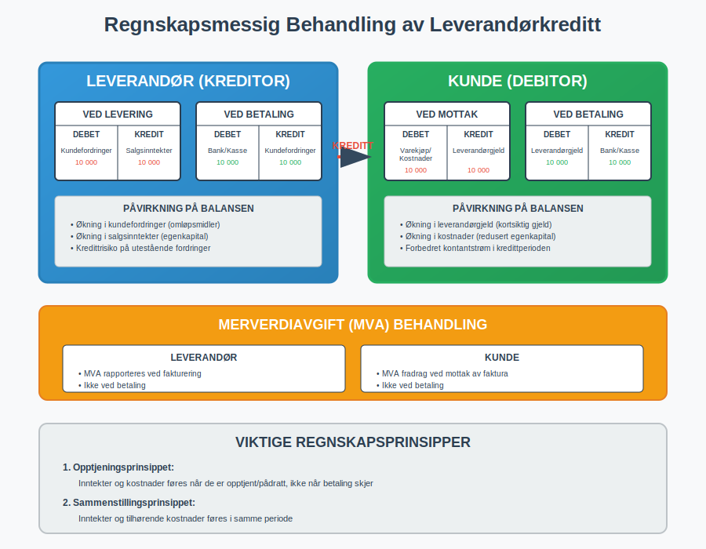

**Leverandørkreditt** er en finansieringsform hvor leverandører gir sine kunder utsatt betalingsfrist for varer eller tjenester. Dette er en av de mest utbredte formene for kortsiktig finansiering i næringslivet, og representerer en kritisk komponent i bedrifters [arbeidskapital](/blogs/regnskap/hva-er-arbeidskapital "Hva er Arbeidskapital? Komplett Guide til Driftskapital og Likviditetsstyring") og [kontantstrøm](/blogs/regnskap/hva-er-kontantstrom "Hva er Kontantstrøm? Komplett Guide til Kontantstrømanalyse og Likviditetsstyring"). Leverandørkreditt oppstår automatisk når en [faktura](/blogs/regnskap/hva-er-en-faktura "Hva er en Faktura? En Guide til Norske Fakturakrav") utstedes med en betalingsfrist, og utgjør en sentral del av moderne forretningspraksis.

## Seksjon 1: Hvordan Leverandørkreditt Fungerer

Leverandørkreditt oppstår når en leverandør leverer varer eller tjenester til en kunde og gir kunden tid til å betale. Dette skaper en **kreditorrelasjon** hvor leverandøren blir [kreditor](/blogs/regnskap/hva-er-kreditor "Hva er Kreditor? Komplett Guide til Leverandørgjeld og Kreditorhåndtering") og kunden blir [debitor](/blogs/regnskap/hva-er-debitor "Hva er Debitor? Komplett Guide til Kundefordringer og Debitorhåndtering"). Prosessen integreres naturlig med bedriftens [bokføringssystem](/blogs/regnskap/hva-er-bokforing "Hva er Bokføring? Komplett Guide til Regnskapsføring og Bokføringsregler") og påvirker både [balansen](/blogs/regnskap/hva-er-balanse "Hva er Balanse? Komplett Guide til Balanseregnskap og Finansiell Stilling") og [kontantstrømoppstillingen](/blogs/regnskap/hva-er-kontantstromoppstilling "Hva er Kontantstrømoppstilling? Komplett Guide til Likviditetsanalyse").

### Typisk Leverandørkreditt-prosess

1. **Leveranse:** Varer eller tjenester leveres til kunden
2. **Fakturering:** [Faktura](/blogs/regnskap/hva-er-en-faktura "Hva er en Faktura? En Guide til Norske Fakturakrav") sendes med spesifisert betalingsfrist
3. **Kredittperiode:** Kunden har tid til å betale (vanligvis 14-60 dager)
4. **Betaling:** Kunden betaler innen forfallsdato
5. **Oppfølging:** Ved forsinket betaling iverksettes [inkassoprosess](/blogs/regnskap/hva-er-inkasso "Hva er Inkasso? Komplett Guide til Inkassoprosessen i Norge")

## Seksjon 2: Typer Leverandørkreditt

Leverandørkreditt kan struktureres på ulike måter avhengig av bransje, kundeforhold og risikoprofil. Valg av kreditttype påvirker både [likviditet](/blogs/regnskap/hva-er-betalingsevne "Hva er Betalingsevne? Analyse av Likviditet og Finansiell Stabilitet") og [finansieringsstrategien](/blogs/regnskap/hva-er-finansiering "Hva er Finansiering? Komplett Guide til Bedriftsfinansiering og Kapitalkilder") til bedriften.

### 2.1 Handelskreditt (Trade Credit)

Den vanligste formen for leverandørkreditt hvor betalingsfristen vanligvis er mellom 14-60 dager. Dette er standardpraksisen i de fleste bransjer og reguleres gjennom [handelsbetingelser](/blogs/regnskap/hva-er-en-faktura "Hva er en Faktura? En Guide til Norske Fakturakrav") som avtales mellom partene.

### 2.2 Kontantrabatt-ordninger

Mange leverandører tilbyr **kontantrabatt** for tidlig betaling, for eksempel "2/10 netto 30" som betyr 2% rabatt ved betaling innen 10 dager, ellers forfaller hele beløpet etter 30 dager. Dette incentiverer rask betaling og forbedrer leverandørens [kontantstrøm](/blogs/regnskap/hva-er-kontantstrom "Hva er Kontantstrøm? Komplett Guide til Kontantstrømanalyse og Likviditetsstyring").

### 2.3 Rullerende Kredittlinjer

For kunder med høy omsetning kan leverandører etablere **rullerende kredittlinjer** med månedlige oppgjør. Dette ligner på en kredittkontoordning hvor kunden kan handle opp til en fastsatt kredittgrense.

### 2.4 Konsignasjonslager

En spesiell form hvor leverandøren eier varene frem til de selges av kunden. Dette reduserer kundens [lagerbeholdning](/blogs/regnskap/hva-er-lagerbeholdning "Hva er Lagerbeholdning? Komplett Guide til Lagerstyring og Verdivurdering") og [arbeidskapitalbehov](/blogs/regnskap/hva-er-arbeidskapital "Hva er Arbeidskapital? Komplett Guide til Driftskapital og Likviditetsstyring") betydelig.

## Seksjon 3: Regnskapsmessig Behandling

Leverandørkreditt påvirker flere områder av regnskapet og krever korrekt [kontering](/blogs/regnskap/hva-er-kontering "Hva er Kontering? Komplett Guide til Regnskapskontering og Bilagsbehandling") og oppfølging. Både leverandør og kunde må håndtere de regnskapsmessige konsekvensene korrekt.

### For Leverandøren (Kreditor)

Når leverandøren gir kreditt, oppstår følgende regnskapsposter:

| Tidspunkt | Debet | Kredit | Beskrivelse |
|-----------|--------|---------|-------------|
| Ved levering | [Kundefordringer](/blogs/regnskap/hva-er-kundefordring "Hva er Kundefordring? Komplett Guide til Debitorhåndtering og Fordringsstyring") | [Salgsinntekter](/blogs/regnskap/hva-er-inntekter "Hva er Inntekter? Komplett Guide til Inntektsføring og Regnskapsregler") | Registrering av salg |
| Ved betaling | Bank/Kasse | Kundefordringer | Innbetaling fra kunde |
| Ved tap | [Tap på fordringer](/blogs/regnskap/hva-er-avskrivning "Hva er Avskrivning? Komplett Guide til Avskrivningsmetoder og Regnskapsregler") | Kundefordringer | Nedskrivning av uinnkrevelig fordring |

### For Kunden (Debitor)

Kunden registrerer følgende:

| Tidspunkt | Debet | Kredit | Beskrivelse |
|-----------|--------|---------|-------------|
| Ved mottak | Varekjøp/[Kostnader](/blogs/regnskap/hva-er-kostnader "Hva er Kostnader? Komplett Guide til Kostnadstyper og Regnskapsføring") | [Leverandørgjeld](/blogs/regnskap/hva-er-gjeld "Hva er Gjeld? Komplett Guide til Gjeldstyper og Regnskapsføring") | Registrering av kjøp |
| Ved betaling | Leverandørgjeld | Bank/Kasse | Betaling til leverandør |

### Merverdiavgift (MVA)

Leverandørkreditt påvirker også [MVA-behandlingen](/blogs/regnskap/hva-er-avgiftsplikt-mva "Hva er Avgiftsplikt (MVA)? Komplett Guide til Merverdiavgift i Norge"). MVA skal normalt rapporteres når fakturaen utstedes, ikke når betalingen mottas, noe som kan skape likviditetsutfordringer for leverandøren.

## Seksjon 4: Fordeler og Ulemper

Leverandørkreditt har både fordeler og ulemper for begge parter i transaksjonen. Forståelse av disse aspektene er kritisk for optimal [finansiell styring](/blogs/regnskap/hva-er-finansregnskap "Hva er Finansregnskap? Komplett Guide til Eksternregnskap og Rapportering").

### Fordeler for Kunden

* **Forbedret likviditet:** Utsatt betaling forbedrer [kontantstrømmen](/blogs/regnskap/hva-er-kontantstrom "Hva er Kontantstrøm? Komplett Guide til Kontantstrømanalyse og Likviditetsstyring")
* **Redusert finansieringsbehov:** Mindre behov for banklån eller annen [ekstern finansiering](/blogs/regnskap/hva-er-finansiering "Hva er Finansiering? Komplett Guide til Bedriftsfinansiering og Kapitalkilder")
* **Fleksibilitet:** Mulighet til å selge varer før betaling forfaller
* **Kostnadseffektivt:** Ofte gratis finansiering sammenlignet med banklån
* **Forhandlingsmakt:** Kan brukes som forhandlingskort i leverandørforhold

### Ulemper for Kunden

* **Avhengighet:** Kan skape avhengighet av leverandørens kredittvillighet
* **Begrenset fleksibilitet:** Kredittvilkår kan være mindre fleksible enn banklån
* **Leverandørrisiko:** Risiko ved leverandørens finansielle problemer
* **Tapte kontantrabatter:** Går glipp av rabatter for tidlig betaling

### Fordeler for Leverandøren

* **Økt salg:** Kan øke salget ved å tilby attraktive betalingsvilkår
* **Kundelojalitet:** Styrker kundeforholdet og skaper binding
* **Konkurransefortrinn:** Kan differensiere seg fra konkurrenter
* **Høyere marginer:** Kan kompensere for kredittrisiko med høyere priser

### Ulemper for Leverandøren

* **Kredittrisiko:** Risiko for tap ved kundens betalingsudyktighet
* **Likviditetsbelastning:** Binder opp [arbeidskapital](/blogs/regnskap/hva-er-arbeidskapital "Hva er Arbeidskapital? Komplett Guide til Driftskapital og Likviditetsstyring")
* **Administrative kostnader:** Økte kostnader for oppfølging og [inkasso](/blogs/regnskap/hva-er-inkasso "Hva er Inkasso? Komplett Guide til Inkassoprosessen i Norge")
* **Finansieringskostnader:** Må selv finansiere den utestående fordringen

## Seksjon 5: Risikostyring og Kredittvurdering

Effektiv risikostyring er essensielt for å minimere tap på leverandørkreditt. Dette krever systematisk [kredittvurdering](/blogs/regnskap/hva-er-betalingsevne "Hva er Betalingsevne? Analyse av Likviditet og Finansiell Stabilitet") og oppfølging av kundeforhold.

### Kredittvurderingskriterier

Før kreditt innvilges, bør følgende faktorer vurderes:

* **Finansiell stilling:** Analyse av kundens [balanse](/blogs/regnskap/hva-er-balanse "Hva er Balanse? Komplett Guide til Balanseregnskap og Finansiell Stilling") og [resultatregnskap](/blogs/regnskap/hva-er-driftsregnskap "Hva er Driftsregnskap? Komplett Guide til Driftsresultat og Lønnsomhetsanalyse")
* **Betalingshistorikk:** Tidligere betalingsadferd og pålitelighet
* **Bransjerisiko:** Konjunkturmessige og strukturelle risikofaktorer
* **Geografisk risiko:** Politisk og økonomisk stabilitet i kundens marked
* **Kredittrapporter:** Informasjon fra kredittbyråer og offentlige registre

### Kredittgrenser og Overvåking

Etablering av **kredittgrenser** basert på kundens finansielle kapasitet og risikoprofil:

| Risikoklasse | Kredittgrense | Betalingsfrist | Oppfølging |
|--------------|---------------|----------------|------------|
| Lav risiko | Høy | 60 dager | Kvartalsvis |
| Middels risiko | Moderat | 30 dager | Månedlig |
| Høy risiko | Lav | 14 dager | Ukentlig |
| Ny kunde | Begrenset | 14 dager | Kontinuerlig |

### Sikringsmekanismer

For å redusere kredittrisiko kan følgende sikringsmekanismer benyttes:

* **Kreditforsikring:** Forsikring mot tap på kundefordringer
* **Factoring:** Salg av fordringer til [factoringselskap](/blogs/regnskap/hva-er-factoring "Hva er Factoring? Komplett Guide til Factoring og Fordringssalg")
* **[Bankgarantier](/blogs/regnskap/bankgaranti "Hva er Bankgaranti? En komplett guide til bankgarantier i Norge"):** Sikkerhet fra kundens bank
* **Eiendomspant:** Pant i kundens eiendeler
* **Personlig kausjon:** Personlig ansvar fra kundens eiere

## Seksjon 6: Leverandørkreditt vs. Andre Finansieringsformer

Leverandørkreditt må vurderes i sammenheng med andre tilgjengelige [finansieringsalternativer](/blogs/regnskap/hva-er-finansiering "Hva er Finansiering? Komplett Guide til Bedriftsfinansiering og Kapitalkilder"). Hver finansieringsform har sine unike karakteristika og kostnadsstrukturer.

### Sammenligning av Finansieringsalternativer

| Finansieringstype | Kostnad | Fleksibilitet | Tilgjengelighet | Sikkerhetskrav |
|-------------------|---------|---------------|-----------------|----------------|
| Leverandørkreditt | Lav-Middels | Middels | Høy | Lav |
| Banklån | Middels | Høy | Middels | Høy |
| [Factoring](/blogs/regnskap/hva-er-factoring "Hva er Factoring? Komplett Guide til Factoring og Fordringssalg") | Høy | Høy | Middels | Lav |
| Kontokredit | Høy | Høy | Middels | Middels |
| [Egenkapital](/blogs/regnskap/hva-er-egenkapital "Hva er Egenkapital? Komplett Guide til Egenkapitalfinansiering") | Lav | Lav | Lav | Ingen |

### Når Leverandørkreditt er Optimalt

Leverandørkreditt er særlig fordelaktig når:

* Bedriften har stabile kundeforhold med lav kredittrisiko
* Bransjen har etablerte kreditttradisjoner
* Konkurransesituasjonen krever fleksible betalingsvilkår
* Bedriften har god [likviditet](/blogs/regnskap/hva-er-betalingsevne "Hva er Betalingsevne? Analyse av Likviditet og Finansiell Stabilitet") til å finansiere utestående fordringer
* Administrative systemer for kredittstyring er på plass

## Seksjon 7: Digitalisering og Automatisering

Moderne teknologi har revolusjonert håndteringen av leverandørkreditt gjennom automatisering og digitale løsninger. Dette påvirker både effektivitet og risikostyring betydelig.

### Teknologiske Løsninger

* **[ERP-systemer](/blogs/regnskap/hva-er-erp-system "Hva er ERP-system? Komplett Guide til Enterprise Resource Planning"):** Integrert håndtering av salg, fakturering og kredittstyring
* **[Elektronisk fakturering](/blogs/regnskap/hva-er-elektronisk-fakturering "Hva er Elektronisk Fakturering? Komplett Guide til Digitale Fakturaløsninger"):** Raskere fakturabehandling og reduserte kostnader
* **Automatisk kredittvurdering:** AI-baserte systemer for risikovurdering
* **Sanntids overvåking:** Kontinuerlig oppfølging av kunders finansielle stilling
* **Automatisk purring:** Systematisk oppfølging av forfalte fordringer

### Fordeler ved Digitalisering

* **Reduserte administrative kostnader:** Automatisering av rutineoppgaver
* **Forbedret risikostyring:** Bedre datagrunnlag for beslutninger
* **Raskere prosesser:** Kortere behandlingstid fra salg til betaling
* **Bedre kundeopplevelse:** Smidigere og mer transparent prosess
* **Integrerte arbeidsflyter:** Sømløs integrasjon med andre forretningsprosesser

## Seksjon 8: Juridiske Aspekter og Regelverk

Leverandørkreditt er regulert av flere lover og forskrifter som påvirker både rettigheter og plikter for begge parter. Forståelse av det juridiske rammeverket er kritisk for å unngå konflikter og sikre rettmessig behandling.

### Relevant Lovgivning

* **[Bokføringsloven](/blogs/regnskap/hva-er-bokforingsloven "Hva er Bokføringsloven? Komplett Guide til Norsk Bokføringslovgivning"):** Krav til dokumentasjon og regnskapsføring
* **[Inkassoloven](/blogs/regnskap/hva-er-inkassoloven "Hva er Inkassoloven? Komplett Guide til Inkassorett og Purregebyr"):** Regulerer oppfølging av forfalte fordringer
* **Forsinkelsesrenteloven:** Fastsetter renter ved forsinket betaling
* **Avtaleloven:** Generelle kontraktsrettslige prinsipper
* **Konkursloven:** Behandling av fordringer ved konkurs

### Rettigheter og Plikter

**Leverandørens rettigheter:**
* Krav på betaling innen avtalt frist
* [Forsinkelsesrente](/blogs/regnskap/hva-er-forsinkelsesrente "Hva er Forsinkelsesrente? Komplett Guide til Morarenter og Beregning") ved forsinket betaling
* Rett til å kreve inn fordringen gjennom [inkasso](/blogs/regnskap/hva-er-inkasso "Hva er Inkasso? Komplett Guide til Inkassoprosessen i Norge")
* Eiendomsforbehold i leverte varer (hvis avtalt)

**Kundens rettigheter:**
* Rett til korrekt fakturering og dokumentasjon
* Beskyttelse mot urimelige inkassokrav
* Rett til å bestride feil på fakturaer
* Rett til rimelig behandling ved betalingsproblemer

## Seksjon 9: Internasjonale Aspekter

Ved internasjonal handel kompliseres leverandørkreditt av valutarisiko, kulturelle forskjeller og ulike juridiske systemer. Dette krever spesialisert kunnskap og tilpassede løsninger.

### Spesielle Utfordringer

* **Valutarisiko:** Svingninger i valutakurser påvirker verdien av fordringer
* **Politisk risiko:** Ustabilitet i kundens land kan påvirke betalingsevne
* **Kulturelle forskjeller:** Ulike betalingstradisjoner og forretningspraksis
* **Juridiske forskjeller:** Varierende lovgivning og rettssystemer
* **Lengre kredittperioder:** Ofte lengre betalingsfrister i internasjonal handel

### Risikohåndtering

* **Eksportkredittforsikring:** Spesialisert forsikring for eksportfordringer
* **Remburs:** Bankgaranterte betalingsløsninger
* **Valutasikring:** Terminkontrakter for å eliminere valutarisiko
* **Lokale partnere:** Samarbeid med lokale aktører for bedre markedskunnskap

## Seksjon 10: Fremtidige Trender

Leverandørkreditt utvikler seg kontinuerlig påvirket av teknologiske fremskritt, regulatoriske endringer og endrede markedsforhold.

### Teknologiske Trender

* **Blockchain-teknologi:** Økt transparens og sikkerhet i transaksjoner
* **Kunstig intelligens:** Forbedret kredittvurdering og risikoprediksjoner
* **Open Banking:** Bedre tilgang til kunders finansielle data
* **Supply Chain Finance:** Integrerte finansieringsløsninger for hele verdikjeden
* **Sanntidsbetalinger:** Raskere oppgjør og redusert kredittbehov

### Regulatoriske Utviklinger

* **Økt fokus på bærekraft:** [ESG-krav](/blogs/regnskap/hva-er-esg "Hva er ESG? Komplett Guide til Miljø, Sosial og Styring i Regnskap") påvirker kredittbeslutninger
* **Databeskyttelse:** Strengere krav til håndtering av kundeinformasjon
* **Konkurranseregulering:** Fokus på rettferdig konkurranse i kredittmarkedet

Leverandørkreditt vil fortsette å være en sentral del av moderne forretningsdrift, men vil utvikle seg mot mer sofistikerte, teknologidrevne løsninger som balanserer effektivitet med risikostyring. Bedrifter som mestrer denne utviklingen vil ha betydelige konkurransefortrinn i fremtidens marked.

