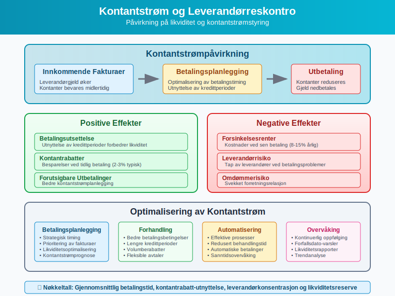

**Leverandørreskontro** er et detaljert register som viser alle økonomiske transaksjoner mellom bedriften og hver enkelt leverandør. Dette er en **underreskontro** til [hovedboken](/blogs/regnskap/hva-er-hovedbok "Hva er Hovedbok i Regnskap? Komplett Guide til Regnskapsføring") som gir en komplett oversikt over [leverandørgjeld](/blogs/regnskap/hva-er-gjeld "Hva er Gjeld? Komplett Guide til Gjeldshåndtering i Regnskap") og betalingshistorikk for hver leverandør individuelt.

I motsetning til [kundereskontro](/blogs/regnskap/hva-er-kundereskontro "Hva er Kundereskontro? Komplett Guide til Kundeledger og Fordringsstyring") som håndterer kundefordringer, fokuserer leverandørreskontro på å spore alle innkjøps- og betalingstransaksjoner med leverandører og fungerer som grunnlag for effektiv [kreditoroppfølging](/blogs/regnskap/hva-er-kreditor "Hva er Kreditor? Komplett Guide til Leverandørgjeld og Betalingsoppfølging").

For en generell oversikt over reskontro, se [Hva er Reskontro?](/blogs/regnskap/hva-er-reskontro "Hva er Reskontro? En Guide til Underreskontro og Hovedbok").

## Hva inneholder en leverandørreskontro?

En leverandørreskontro fungerer som en individuell konto for hver leverandør og inneholder detaljert informasjon om alle økonomiske forhold mellom bedriften og leverandøren.

### Hovedkomponenter i leverandørreskontro:

* **Leverandøridentifikasjon:** Navn, adresse, organisasjonsnummer og kontaktinformasjon
* **Fakturainformasjon:** Alle mottatte [fakturaer](/blogs/regnskap/hva-er-en-faktura "Hva er en Faktura? En Guide til Norske Fakturakrav") med beløp og forfallsdatoer
* **Betalingsregistrering:** Utbetalinger med dato og beløp
* **Utestående saldo:** Aktuell gjeld bedriften har til leverandøren
* **Kredittgrense:** Maksimalt kredittbeløp fra leverandøren
* **Betalingshistorikk:** Historisk oversikt over betalingsmønstre
* **Betalingsbetingelser:** Avtalt betalingsfrist og eventuelle rabatter
* **Kontaktpersoner:** Relevante kontaktpersoner hos leverandøren

## Forskjellen mellom Leverandørreskontro og Hovedbok

Mange forveksler leverandørreskontro med hovedbokføring, men det er viktige forskjeller mellom disse systemene.

### Hovedforskjeller:

| Aspekt | Leverandørreskontro | Hovedbok |
|--------|---------------------|----------|
| **Detaljnivå** | Individuell leverandør | Samlede kontoer |
| **Formål** | Leverandørspesifikk oppfølging | Overordnet regnskapsføring |
| **Informasjon** | Detaljerte transaksjoner | Sammendrag og totaler |
| **Bruksområde** | Betalingsoppfølging, innkjøp | Årsregnskap, rapportering |
| **Oppdateringsfrekvens** | Daglig/kontinuerlig | Periodisk |
| **Avstemming** | Mot hovedbok | Mot underreskontraer |

## Leverandørreskontro i praksis

Leverandørreskontro oppdateres kontinuerlig når transaksjoner med leverandører finner sted og danner grunnlaget for effektiv [kreditorhåndtering](/blogs/regnskap/hva-er-kreditor "Hva er Kreditor? Komplett Guide til Leverandørgjeld og Betalingsoppfølging").

### Typisk arbeidsflyt:

1. **Innkjøp registreres:** Leverandørfaktura mottas og registreres i leverandørreskontro
2. **Forfallsdato noteres:** Betalingsfrist etableres basert på betalingsbetingelser
3. **Betalingsplanlegging:** Kontinuerlig oppfølging av forfallende fakturaer
4. **Utbetaling registreres:** Leverandørbetalinger bokføres mot riktig faktura
5. **Saldooppdatering:** Leverandørens utestående saldo oppdateres automatisk
6. **Oppfølging:** Kontakt med leverandør ved avvik eller spørsmål

## Praktisk eksempel på leverandørreskontro

Her er et detaljert eksempel på hvordan en leverandørreskontro kan se ut for en leverandør over en tremånedersperiode:

### Leverandør: Elektro Nord AS

| Dato | Beskrivelse | Fakturanr | Debet | Kredit | Saldo |
|------|-------------|-----------|-------|--------|-------|
| 01.01 | Ã…pningssaldo | - | - | - | 15 000 |
| 08.01 | Faktura materialer | EN-2024-001 | - | 35 000 | 50 000 |
| 15.01 | Utbetaling | - | 15 000 | - | 35 000 |
| 22.01 | Faktura utstyr | EN-2024-002 | - | 65 000 | 100 000 |
| 05.02 | Utbetaling | - | 35 000 | - | 65 000 |
| 12.02 | [Kreditnota](/blogs/regnskap/hva-er-kreditnota "Hva er en Kreditnota? Komplett Guide til Kreditnotaer i Norge") retur | KN-EN-001 | 3 000 | - | 62 000 |
| 28.02 | Faktura service | EN-2024-003 | - | 25 000 | 87 000 |
| 15.03 | Utbetaling | - | 62 000 | - | 25 000 |

### Analyse av leverandørforholdet:

* **Gjennomsnittlig betalingstid:** 12-15 dager
* **Betalingsmønster:** Punktlig og regelmessig
* **Leverandørrisiko:** Lav basert på leveringshistorikk
* **Anbefalt kredittramme:** 120 000 kr
* **Betalingsbetingelser:** Netto 14 dager

## Typer leverandørreskontro-systemer

Moderne bedrifter kan velge mellom ulike tilnærminger til leverandørreskontro avhengig av størrelse og kompleksitet.

### 1. Manuell leverandørreskontro

**Egnet for:** Små bedrifter med få leverandører

**Fordeler:**
* Lav kostnad
* Full kontroll
* Enkel å forstå

**Ulemper:**
* Tidkrevende
* Feilrisiko
* Begrenset rapportering

### 2. Regneark-basert system

**Egnet for:** Små til mellomstore bedrifter

**Fordeler:**
* Fleksibel tilpasning
* Automatiserte beregninger
* Kostnadseffektiv

**Ulemper:**
* Begrenset skalerbarhet
* Manglende integrasjon
* Versjonskontroll-utfordringer

### 3. Integrert ERP-system

**Egnet for:** Mellomstore til store bedrifter

**Fordeler:**
* Fullstendig integrasjon
* Automatiserte prosesser
* Omfattende rapportering
* Skalerbarhet

**Ulemper:**
* Høy kostnad
* Kompleks implementering
* Opplæringsbehov

## Regnskapsføring av leverandørreskontro

Leverandørreskontro må stemmes mot [hovedboken](/blogs/regnskap/hva-er-hovedbok "Hva er Hovedbok i Regnskap? Komplett Guide til Regnskapsføring") for å sikre korrekt regnskapsføring og [internkontroll](/blogs/regnskap/hva-er-internkontroll "Hva er Internkontroll? Komplett Guide til Internkontrollsystemer").

### Regnskapsføringsprosess:

1. **Fakturamottak:** Leverandørfaktura registreres
   - Debet: Relevant kostnadskonto/varekonto
   - Kredit: Leverandørgjeld

2. **Betaling:** Utbetaling til leverandør
   - Debet: Leverandørgjeld
   - Kredit: Bank/kasse

3. **Avstemming:** MÃ¥nedlig avstemming mot hovedbok
   - Kontroll av saldoer
   - Identifisering av avvik
   - Korrigering av feil

### Viktige regnskapsprinsipper:

* **Periodisering:** Kostnader bokføres når de påløper
* **Forsiktighet:** Usikre poster behandles konservativt
* **Sammenlignbarhet:** Konsistent behandling over tid
* **Vesentlighet:** Fokus på betydningsfulle beløp

## Aldersanalyse av leverandørgjeld

En **aldersanalyse** av leverandørreskontro gir oversikt over hvor lenge fakturaer har vært ubetalt og hjelper med [kontantstrømstyring](/blogs/regnskap/hva-er-kontantstrom "Hva er Kontantstrøm? Komplett Guide til Kontantstrømanalyse").

### Aldersanalyse-kategorier:

| Aldersgruppe | Beløp | Andel | Risiko |
|--------------|-------|-------|--------|
| **0-30 dager** | 450 000 | 60% | Lav |
| **31-60 dager** | 225 000 | 30% | Moderat |
| **61-90 dager** | 52 500 | 7% | Høy |
| **Over 90 dager** | 22 500 | 3% | Kritisk |
| **Totalt** | **750 000** | **100%** | - |

### Fordeler med aldersanalyse:

* **Kontantstrømplanlegging:** Bedre oversikt over kommende betalinger
* **Leverandørforhandlinger:** Grunnlag for å forhandle betalingsbetingelser
* **Risikostyring:** Identifisering av potensielle betalingsproblemer
* **Budsjettplanlegging:** Mer nøyaktige kontantstrømprognoser

## Automatisering av leverandørreskontro

Moderne teknologi gjør det mulig å automatisere mange aspekter ved leverandørreskontro-håndtering.

### Automatiseringsmuligheter:

#### 1. Elektronisk fakturamottak
* **[E-faktura](/blogs/regnskap/hva-er-efaktura "Hva er E-faktura? Komplett Guide til Elektronisk Fakturering"):** Direkte integrasjon med leverandører
* **OCR-teknologi:** Automatisk lesing av papirfakturaer
* **API-integrasjoner:** Direkte dataoverføring fra leverandørsystemer

#### 2. Automatisk matching
* **Toveismatching:** Faktura mot bestilling
* **Treveismatching:** Faktura, bestilling og varemottak
* **Toleranseregler:** Automatisk godkjenning innenfor definerte grenser

#### 3. Betalingsautomatisering
* **Automatiske betalinger:** Basert på forhåndsdefinerte regler
* **Betalingsoptimalisering:** Utnyttelse av kontantrabatter
* **Bankintegrasjon:** Direkte overføring til banksystemer

### Fordeler med automatisering:

* **Tidsbesparelse:** Redusert manuelt arbeid
* **Feilreduksjon:** Mindre risiko for menneskelige feil
* **Bedre kontroll:** Konsistente prosesser og kontroller
* **Kostnadsbesparelse:** Lavere administrative kostnader
* **Forbedret rapportering:** Sanntidsdata og analyser

## Beste praksis for leverandørreskontro

For å oppnå optimal leverandørreskontro-håndtering bør bedrifter følge etablerte beste praksis-prinsipper.

### Organisatoriske tiltak:

#### 1. Klare prosedyrer
* **Dokumenterte rutiner:** Skriftlige prosedyrer for alle prosesser
* **Ansvarsfordeling:** Tydelig definerte roller og ansvar
* **Godkjenningsmatrise:** Klare fullmakter for ulike beløpsgrenser

#### 2. Regelmessig oppfølging
* **MÃ¥nedlig avstemming:** Kontroll mot hovedbok
* **Leverandørevaluering:** Periodisk vurdering av leverandørforhold
* **Kontraktoppfølging:** Overvåking av avtaler og betingelser

#### 3. Teknologiske løsninger
* **Integrerte systemer:** Sammenkoblede regnskaps- og innkjøpssystemer
* **Backup-rutiner:** Sikring av data og systemer
* **Tilgangskontroll:** Begrenset tilgang basert på roller

### Nøkkeltall for oppfølging:

| Nøkkeltall | Beregning | Målsetting |
|------------|-----------|------------|
| **Gjennomsnittlig betalingstid** | Sum betalingsdager / Antall fakturaer | < 25 dager |
| **Kontantrabatt-utnyttelse** | Rabatter oppnådd / Totale rabattmuligheter | > 95% |
| **Feilrate** | Feil fakturaer / Totale fakturaer | < 2% |
| **Behandlingstid** | Tid fra mottak til betaling | < 5 dager |

## Juridiske og regulatoriske krav

Leverandørreskontro må oppfylle ulike juridiske og regulatoriske krav i Norge.

### Viktige lovkrav:

#### 1. Bokføringsloven
* **Dokumentasjonskrav:** Alle transaksjoner må dokumenteres
* **Oppbevaringsplikt:** Minimum 5 års oppbevaring
* **Sporbarhet:** Klar sammenheng mellom bilag og bokføring

#### 2. Regnskapsloven
* **Periodisering:** Korrekt periodisering av kostnader
* **Forsiktighet:** Konservativ verdivurdering
* **Sammenlignbarhet:** Konsistent regnskapspraksis

#### 3. Merverdiavgiftsloven
* **Fradragsrett:** Dokumentasjon av fradragsberettiget MVA
* **Rapportering:** Korrekt MVA-rapportering
* **Oppbevaring:** Sikring av MVA-relevante dokumenter

### Internkontroll-krav:

* **Autorisasjon:** Godkjenning av alle transaksjoner
* **Registrering:** Komplett og nøyaktig registrering
* **Tilgang:** Begrenset tilgang til systemer og data
* **Dokumentasjon:** Sporbar dokumentasjon av alle prosesser

## Fremtidens leverandørreskontro

Teknologisk utvikling vil fortsette å påvirke hvordan leverandørreskontro håndteres i fremtiden.

### Teknologiske trender:

#### 1. Kunstig intelligens (AI)
* **Prediktiv analyse:** Forutsigelse av betalingsmønstre
* **Anomalideteksjon:** Automatisk identifisering av avvik
* **Intelligent matching:** Avansert faktura-matching

#### 2. Blockchain-teknologi
* **Transparent sporbarhet:** Uforanderlig transaksjonshistorikk
* **Smart contracts:** Automatiske betalingsutløsere
* **Redusert svindel:** Økt sikkerhet og tillit

#### 3. Sanntidsintegrasjon
* **Øyeblikkelig oppdatering:** Sanntids saldooppdateringer
* **Direkte bankintegrasjon:** Umiddelbar betalingsbekreftelse
* **Automatisk avstemming:** Kontinuerlig balansering

### Forventede fordeler:

* **Økt effektivitet:** Raskere og mer nøyaktige prosesser
* **Bedre innsikt:** Avanserte analyser og rapporter
* **Lavere kostnader:** Reduserte administrative utgifter
* **Forbedret compliance:** Automatisk overholdelse av regelverk

## Kontantstrøm og leverandørreskontro

Leverandørreskontro spiller en kritisk rolle i [kontantstrømstyring](/blogs/regnskap/hva-er-kontantstrom "Hva er Kontantstrøm? Komplett Guide til Kontantstrømanalyse") og likviditetshåndtering.

### Kontantstrømpåvirkning:

#### Positive effekter:
* **Betalingsutsettelse:** Utnyttelse av kredittperioder
* **Kontantrabatter:** Besparelser ved tidlig betaling
* **Planlegging:** Forutsigbare utbetalinger

#### Negative effekter:
* **Forsinkelsesrenter:** Kostnader ved sen betaling
* **Leverandørrisiko:** Tap av leverandører ved betalingsproblemer
* **Omdømmerisiko:** Svekket forretningsrelasjon

### Optimalisering av kontantstrøm:

1. **Betalingsplanlegging:** Strategisk timing av betalinger
2. **Forhandling:** Bedre betalingsbetingelser
3. **Automatisering:** Effektive betalingsprosesser
4. **Overvåking:** Kontinuerlig oppfølging av forfallsdatoer

## Leverandørreskontro og kredittoppfølging

Effektiv kredittoppfølging av leverandører krever systematisk bruk av leverandørreskontro-data.

### Kredittoppfølgingsprosess:

#### 1. Kredittvurdering
* **Finansiell analyse:** Vurdering av leverandørens økonomi
* **Referansesjekk:** Kontakt med andre kunder
* **Kredittrapporter:** Bruk av eksterne kredittopplysninger

#### 2. Kredittgrenser
* **Fastsettelse:** Basert på risikoprofil og behov
* **Overvåking:** Kontinuerlig oppfølging av utestående
* **Justering:** Regelmessig vurdering og tilpasning

#### 3. Oppfølgingsrutiner
* **Automatiske varsler:** Ved overskridelse av grenser
* **Eskaleringsmatrise:** Trinnvis oppfølging
* **Dokumentasjon:** Logging av alle kontakter

### Risikoindikatorer:

* **Forsinket levering:** Tegn på økonomiske problemer
* **Kvalitetsfall:** Mulig kostnadsreduksjon
* **Kommunikasjonsproblemer:** Potensielle vanskeligheter
* **Endrede betalingsbetingelser:** Økt risiko

## Konklusjon

**Leverandørreskontro** er et uunnværlig verktøy for moderne bedriftsdrift som gir detaljert oversikt over alle økonomiske forhold med leverandører. Gjennom systematisk registrering og oppfølging av leverandørtransaksjoner sikrer leverandørreskontro:

### Hovedfordeler:

* **Finansiell kontroll:** Komplett oversikt over leverandørgjeld
* **Kontantstrømstyring:** Bedre planlegging av utbetalinger
* **Leverandørrelasjoner:** Styrket samarbeid gjennom punktlige betalinger
* **Compliance:** Overholdelse av juridiske og regulatoriske krav
* **Effektivitet:** Automatiserte prosesser og reduserte kostnader

### Suksessfaktorer:

1. **Riktig systemvalg:** Tilpasset bedriftens størrelse og behov
2. **Klare prosedyrer:** Dokumenterte og konsistente rutiner
3. **Regelmessig oppfølging:** Kontinuerlig overvåking og avstemming
4. **Teknologiutnyttelse:** Automatisering der det er hensiktsmessig
5. **Kompetanseutvikling:** Opplæring av ansatte i beste praksis

Ved å implementere en robust leverandørreskontro-løsning kan bedrifter oppnå betydelige forbedringer i både økonomisk styring og operasjonell effektivitet, samtidig som de bygger sterke og bærekraftige leverandørrelasjoner.

For bedrifter som ønsker å optimalisere sin leverandørreskontro-håndtering, anbefales det å starte med en grundig evaluering av eksisterende prosesser og systemer, etterfulgt av en trinnvis implementering av forbedringer basert på beste praksis og moderne teknologiske løsninger.
