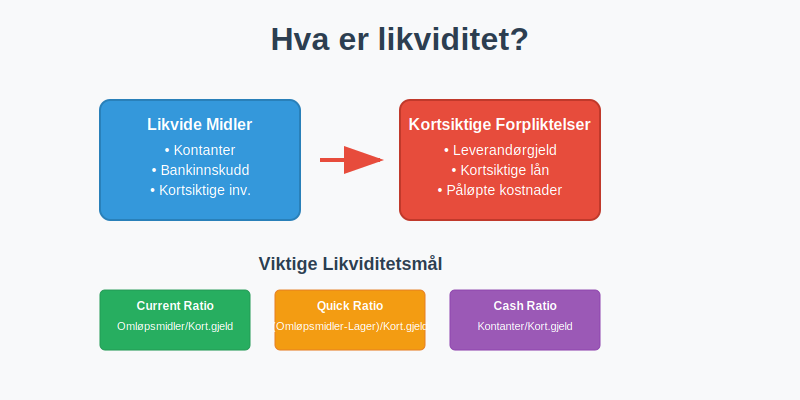
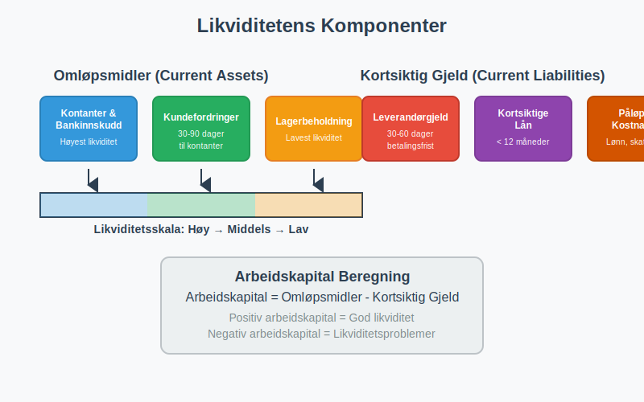
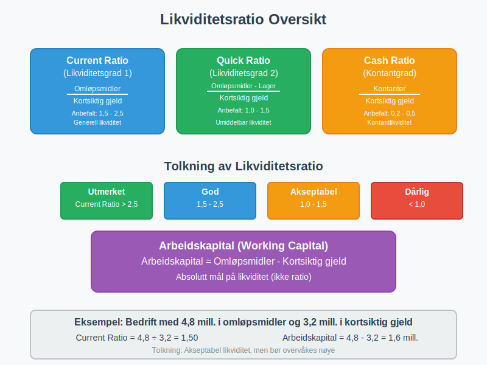
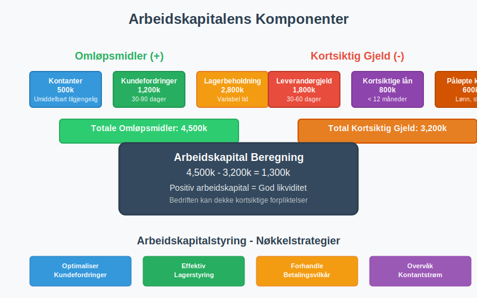
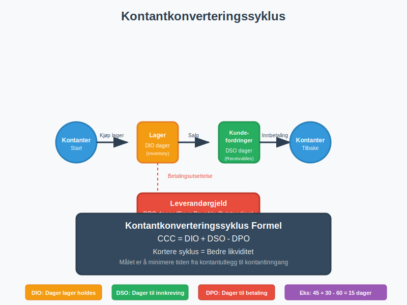
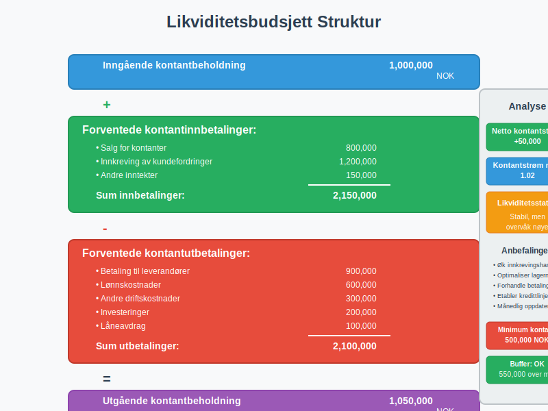
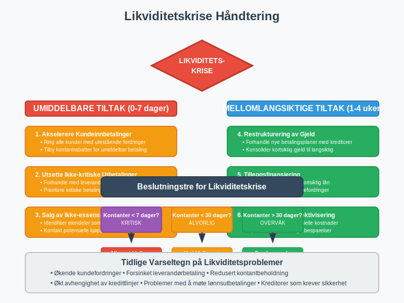
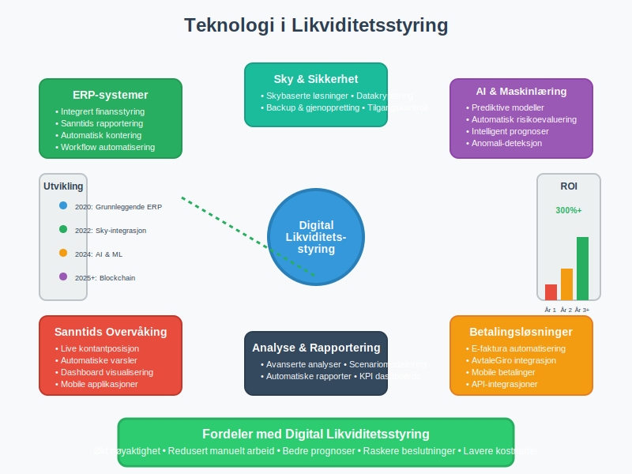
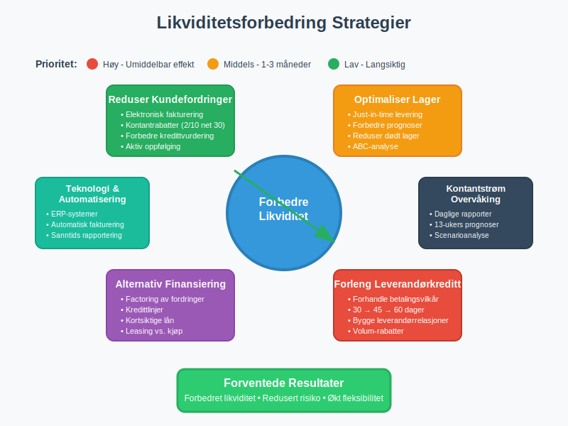

---
title: "Hva er likviditet?"
meta_title: "Hva er likviditet?"
meta_description: '**Likviditet** er et av de mest kritiske konseptene innen regnskap og finansstyring. Det refererer til en bedrifts evne til å møte sine kortsiktige finansiell...'
slug: hva-er-likviditet
type: blog
layout: pages/single
---

**Likviditet** er et av de mest kritiske konseptene innen regnskap og finansstyring. Det refererer til en bedrifts evne til å møte sine kortsiktige finansielle forpliktelser når de forfaller, uten å måtte selge langsiktige eiendeler eller skaffe ekstern finansiering på ugunstige vilkår. Likviditet er fundamentalt for enhver virksomhets overlevelse og vekst.

For å forstå likviditet fullt ut, er det essensielt å ha kunnskap om [kontantstrøm](/blogs/regnskap/hva-er-kontantstrom "Hva er Kontantstrøm? Komplett Guide til Cash Flow Analyse og Styring"), som danner grunnlaget for likviditetsstyring. Likviditet er også nært knyttet til [arbeidskapital](/blogs/regnskap/hva-er-arbeidskapital "Hva er Arbeidskapital? En Komplett Guide til Working Capital"), som representerer forskjellen mellom omløpsmidler og kortsiktig gjeld.



## Seksjon 1: Grunnleggende Likviditetsbegreper

### 1.1 Definisjon og Betydning

Likviditet måler hvor lett en eiendel kan konverteres til kontanter uten betydelig verditap. På bedriftsnivå handler det om å ha tilstrekkelig **[likvide midler](/blogs/regnskap/hva-er-likvide-midler "Hva er likvide midler? Definisjon, Eksempler og Regnskapsføring")** for å dekke løpende utgifter og uventede kostnader.

Likviditet kan kategoriseres i tre hovedtyper:

* **Kontantlikviditet:** Umiddelbart tilgjengelige kontanter og [bankinnskudd](/blogs/regnskap/hva-er-bankinnskudd "Hva er Bankinnskudd? Komplett Guide til Bankinnskudd i Regnskap")
* **Markedslikviditet:** Evnen til å kjøpe eller selge eiendeler raskt uten å påvirke prisen betydelig
* **Finansieringslikviditet:** Tilgang til ekstern finansiering når det trengs

### 1.2 Likviditetens Komponenter



Likviditet består av flere nøkkelkomponenter som sammen danner bedriftens finansielle fleksibilitet:

**Omløpsmidler (Current Assets):**
* [Kontantbeholdning](/blogs/regnskap/hva-er-kontantbeholdning "Hva er Kontantbeholdning? Guide til Kontanter og Kontantekvivalenter") og bankinnskudd
* [Kundefordringer](/blogs/regnskap/hva-er-kundefordring "Hva er Kundefordring? Komplett Guide til Fordringer og Kundereskontro")
* [Lagerbeholdning](/blogs/regnskap/hva-er-lagerbeholdning "Hva er Lagerbeholdning? Komplett Guide til Lagerregnskapet")
* Kortsiktige investeringer
* Forskuddsbetalte kostnader

**Kortsiktig Gjeld (Current Liabilities):**
* [Leverandørgjeld](/blogs/regnskap/hva-er-leverandor "Hva er Leverandør? Komplett Guide til Leverandørregnskap og Kreditorhåndtering")
* Kortsiktige lån
* Påløpte kostnader
* Forskudd fra kunder

## Seksjon 2: Likviditetsmåling og Nøkkeltall

### 2.1 Primære Likviditetsratio

Likviditetsanalyse baserer seg på flere kritiske nøkkeltall som gir innsikt i bedriftens finansielle helse:



| Ratio | Formel | Tolkning | Anbefalt Nivå |
|-------|--------|----------|---------------|
| **Current Ratio** | Omløpsmidler ÷ Kortsiktig gjeld | Generell likviditet | 1,5 - 2,5 |
| **Quick Ratio** | (Omløpsmidler - Lager) ÷ Kortsiktig gjeld | Umiddelbar likviditet | 1,0 - 1,5 |
| **Cash Ratio** | Kontanter ÷ Kortsiktig gjeld | Kontantlikviditet | 0,2 - 0,5 |
| **Working Capital** | Omløpsmidler - Kortsiktig gjeld | Absolutt likviditet | Positivt |

### 2.2 Current Ratio (Likviditetsgrad 1)

**Current Ratio** er det mest brukte likviditetsmålet og beregnes som:

```
Current Ratio = Omløpsmidler ÷ Kortsiktig gjeld
```

Dette forholdet viser bedriftens evne til å dekke kortsiktige forpliktelser med omløpsmidler. En ratio på 2,0 betyr at bedriften har dobbelt så mye i omløpsmidler som kortsiktig gjeld.

**Tolkning av Current Ratio:**
* **Under 1,0:** Potensielle likviditetsproblemer
* **1,0 - 1,5:** Akseptabel likviditet, men krever overvåking
* **1,5 - 2,5:** God likviditet
* **Over 3,0:** Mulig ineffektiv kapitalbruk

### 2.3 Quick Ratio (Likviditetsgrad 2)

Quick Ratio gir et mer konservativt mål på likviditet ved å ekskludere lager:

```
Quick Ratio = (Omløpsmidler - Lagerbeholdning) ÷ Kortsiktig gjeld
```

Dette målet er særlig relevant fordi lager kan være vanskelig å konvertere til kontanter raskt uten verditap.

### 2.4 Arbeidskapitalanalyse

[Arbeidskapital](/blogs/regnskap/hva-er-arbeidskapital "Hva er Arbeidskapital? En Komplett Guide til Working Capital") er forskjellen mellom omløpsmidler og kortsiktig gjeld og representerer den kapitalen som er tilgjengelig for daglig drift:

```
Arbeidskapital = Omløpsmidler - Kortsiktig gjeld
```



## Seksjon 3: Kontantstrømanalyse og Likviditet

### 3.1 Kontantstrømmens Rolle

[Kontantstrømoppstillingen](/blogs/regnskap/hva-er-kontantstromoppstilling "Hva er Kontantstrømoppstilling? Komplett Guide til Kontantstrømanalyse og Rapportering") er et kritisk verktøy for likviditetsanalyse. Den viser faktiske kontantbevegelser og gir innsikt i bedriftens evne til å generere kontanter fra drift.

**Kontantstrøm fra drift** er særlig viktig for likviditetsvurdering fordi den viser om bedriften kan generere tilstrekkelig kontanter fra kjernevirksomheten.

### 3.2 Kontantkonverteringssyklus

Kontantkonverteringssyklusen måler hvor lang tid det tar å konvertere investeringer i lager og kundefordringer tilbake til kontanter:



```
Kontantkonverteringssyklus = DIO + DSO - DPO
```

Hvor:
* **DIO (Days Inventory Outstanding):** Gjennomsnittlig antall dager lager holdes
* **DSO (Days Sales Outstanding):** Gjennomsnittlig antall dager for å innkreve kundefordringer
* **DPO (Days Payable Outstanding):** Gjennomsnittlig antall dager før leverandørgjeld betales

### 3.3 Beregning av Kontantkonverteringssyklus

| Komponent | Formel | Beskrivelse |
|-----------|--------|-------------|
| **DIO** | (Gjennomsnittlig lager ÷ Varekostnad) × 365 | Dager lager holdes |
| **DSO** | (Gjennomsnittlig kundefordringer ÷ Kreditsalg) × 365 | Dager til innkreving |
| **DPO** | (Gjennomsnittlig leverandørgjeld ÷ Innkjøp) × 365 | Dager til betaling |

## Seksjon 4: Likviditetsplanlegging og -styring

### 4.1 Likviditetsbudsjett

Et **likviditetsbudsjett** er et kritisk verktøy for å forutse fremtidige kontantbehov og sikre tilstrekkelig likviditet. Det inkluderer:



**Inngående kontantbeholdning**
+ Forventede kontantinnbetalinger
  * Salg for kontanter
  * Innkreving av kundefordringer
  * Andre inntekter
- Forventede kontantutbetalinger
  * Betaling til leverandører
  * Lønnskostnader
  * Andre driftskostnader
  * Investeringer
  * LÃ¥neavdrag
= **Utgående kontantbeholdning**

### 4.2 Likviditetsstyring Strategier

**Kortsiktige Strategier:**
* Optimalisering av [kundereskontro](/blogs/regnskap/hva-er-kundereskontro "Hva er Kundereskontro? Komplett Guide til Kundefordringer og Innkreving")
* Effektiv lagerstyring
* Forhandling av betalingsvilkår med leverandører
* Bruk av [factoring](/blogs/regnskap/hva-er-factoring "Hva er Factoring? Komplett Guide til Factoring og Fordringssalg") for rask kontantinngang

**Langsiktige Strategier:**
* Etablering av kredittlinjer
* Diversifisering av finansieringskilder
* Investering i likvide verdipapirer
* Implementering av kontantstyringssystemer

### 4.3 Likviditetskriser og HÃ¥ndtering



Når bedrifter møter likviditetsproblemer, finnes flere handlingsalternativer:

**Umiddelbare Tiltak:**
* Akselerering av kundeinnbetalinger
* Utsettelse av ikke-kritiske utbetalinger
* Salg av ikke-essensielle eiendeler
* Forhandling med kreditorer

**Mellomlangsiktige Tiltak:**
* Restrukturering av gjeld
* Tilleggsfinansiering
* Kostnadskutt
* Forbedring av driftskontantstrøm

## Seksjon 5: Bransjespesifikke Likviditetshensyn

### 5.1 Detaljhandel

I [detaljhandel](/blogs/regnskap/hva-er-detaljhandel "Hva er Detaljhandel? Komplett Guide til Detaljhandelsregnskap") er likviditetsstyring kritisk på grunn av:

* Sesongvariasjoner i salg
* Høy lageromsetning
* Kontantintensive transaksjoner
* Behov for [datakasse](/blogs/regnskap/hva-er-datakasse "Hva er Datakasse? Komplett Guide til Kassasystem, Krav og Regnskapsføring") og kontanthåndtering

### 5.2 Tjenesteyting

Tjenestebedrifter har ofte:
* Lavere lagerbehov
* Høyere andel kundefordringer
* Mer forutsigbare kontantstrømmer
* Behov for å håndtere [forskuddsbetaling](/blogs/regnskap/hva-er-forskuddsbetaling "Hva er Forskuddsbetaling? Komplett Guide til Forskudd og Periodisering")

### 5.3 Produksjon

Produksjonsbedrifter må håndtere:
* Komplekse lagersykluser
* Høye investeringer i [anleggsmidler](/blogs/regnskap/hva-er-anleggsmidler "Hva er Anleggsmidler? Komplett Guide til Anleggsmidler i Regnskap")
* Sesongvariasjoner
* Lange produksjonssykluser

## Seksjon 6: Teknologi og Likviditetsstyring

### 6.1 Moderne Likviditetsstyring

Dagens bedrifter benytter avanserte teknologier for likviditetsstyring:



**Digitale Verktøy:**
* [ERP-systemer](/blogs/regnskap/hva-er-erp-system "Hva er ERP-system? Komplett Guide til Enterprise Resource Planning") for integrert finansstyring
* Automatiserte kontantprognoser
* Sanntids kontantposisjon
* [API-integrasjoner](/blogs/regnskap/api-integrasjon-automatisering-regnskap "API-integrasjon og Automatisering i Regnskap - Komplett Guide") med banker

**Betalingsløsninger:**
* [Elektronisk fakturering](/blogs/regnskap/hva-er-elektronisk-fakturering "Hva er Elektronisk Fakturering? Komplett Guide til E-faktura og Digitale Betalinger")
* [Avtalegiro](/blogs/regnskap/hva-er-avtalegiro "Hva er AvtaleGiro? Komplett Guide til Automatiske Betalinger") for forutsigbare innbetalinger
* Mobile betalingsløsninger
* Automatiserte betalingspåminnelser

### 6.2 Kunstig Intelligens og Maskinlæring

AI og maskinlæring revolusjonerer likviditetsstyring gjennom:
* Prediktive kontantstrømmodeller
* Automatisk risikoevaluering
* Optimalisering av betalingstidspunkter
* Intelligent kredittstyring

## Seksjon 7: Regulatoriske Aspekter

### 7.1 Norske Regnskapsstandarder

I Norge må bedrifter følge [regnskapsloven](/blogs/regnskap/hva-er-bokforingsloven "Hva er Bokføringsloven? Komplett Guide til Norsk Bokføringslovgivning") og [god regnskapsskikk](/blogs/regnskap/god-regnskapsskikk "God Regnskapsskikk - Prinsipper, Standarder og Beste Praksis i Norge") når det gjelder likviditetsrapportering.

**Krav til Likviditetsrapportering:**
* [Kontantstrømoppstilling](/blogs/regnskap/hva-er-kontantstromoppstilling "Hva er Kontantstrømoppstilling? Komplett Guide til Kontantstrømanalyse og Rapportering") for store foretak
* Noter om likviditetsrisiko
* Segmentrapportering av kontantstrømmer
* Opplysninger om kredittfasiliteter

### 7.2 Internkontroll og Likviditet

[Internkontroll](/blogs/regnskap/hva-er-internkontroll "Hva er Internkontroll? Komplett Guide til Internkontrollsystemer") av likviditet inkluderer:

* Daglig kontantrapportering
* Autorisasjonsnivåer for utbetalinger
* [Bankavstemming](/blogs/regnskap/hva-er-bankavstemming "Hva er Bankavstemming? Komplett Guide til Bankavstemming og Kontroll")
* Segregering av oppgaver
* Regelmessig gjennomgang av kredittlinjer

## Seksjon 8: Praktiske Eksempler og Case Studies

### 8.1 Case: Likviditetsanalyse av Norsk Detaljhandel

La oss analysere likviditeten til en fiktiv norsk detaljhandelsbedrift:

**Bedrift A - Finansielle Data (i tusen NOK):**

| Post | Beløp |
|------|-------|
| Kontanter og bankinnskudd | 500 |
| Kundefordringer | 1,200 |
| Lagerbeholdning | 2,800 |
| Andre omløpsmidler | 300 |
| **Totale omløpsmidler** | **4,800** |
| Leverandørgjeld | 1,800 |
| Kortsiktige lån | 800 |
| Annen kortsiktig gjeld | 600 |
| **Total kortsiktig gjeld** | **3,200** |

**Likviditetsanalyse:**

```
Current Ratio = 4,800 ÷ 3,200 = 1,50
Quick Ratio = (4,800 - 2,800) ÷ 3,200 = 0,63
Cash Ratio = 500 ÷ 3,200 = 0,16
Arbeidskapital = 4,800 - 3,200 = 1,600
```

**Tolkning:**
* Current Ratio på 1,50 indikerer akseptabel likviditet
* Quick Ratio på 0,63 viser avhengighet av lageromsetning
* Lav Cash Ratio indikerer behov for bedre kontantstyring
* Positiv arbeidskapital gir finansiell fleksibilitet

### 8.2 Forbedring av Likviditet



**Konkrete Tiltak for Bedrift A:**

1. **Redusere kundefordringer:**
   * Implementere [elektronisk fakturering](/blogs/regnskap/hva-er-elektronisk-fakturering "Hva er Elektronisk Fakturering? Komplett Guide til E-faktura og Digitale Betalinger")
   * Tilby kontantrabatter
   * Forbedre kredittvurdering

2. **Optimalisere lager:**
   * Implementere just-in-time levering
   * Forbedre etterspørselsprognoser
   * Redusere dødt lager

3. **Forhandle betalingsvilkår:**
   * Forlenge leverandørkreditt
   * Etablere [avtalegiro](/blogs/regnskap/hva-er-avtalegiro "Hva er AvtaleGiro? Komplett Guide til Automatiske Betalinger") med kunder
   * Bruke [factoring](/blogs/regnskap/hva-er-factoring "Hva er Factoring? Komplett Guide til Factoring og Fordringssalg") ved behov

## Seksjon 9: Fremtidige Trender i Likviditetsstyring

### 9.1 Digitalisering og Automatisering

Fremtidens likviditetsstyring vil være preget av:

* **Sanntids kontantsynlighet** på tvers av alle kontoer og valutaer
* **Automatiserte kontantprognoser** basert på historiske data og AI
* **Integrerte betalingsplattformer** som optimaliserer kontantstrømmer
* **Blockchain-baserte betalinger** for raskere oppgjør

### 9.2 Bærekraftig Likviditetsstyring

**ESG-hensyn** påvirker også likviditetsstyring:
* Grønne finansieringsalternativer
* Bærekraftige leverandørkjeder
* Klimarisiko i likviditetsplanlegging
* Rapportering av bærekraftige kontantstrømmer

### 9.3 Regulatoriske Endringer

Kommende regulatoriske endringer som kan påvirke likviditetsstyring:
* Økte rapporteringskrav for [ESG](/blogs/regnskap/hva-er-esg "Hva er ESG? Komplett Guide til Environmental, Social og Governance Rapportering")
* Nye standarder for kontantstrømrapportering
* Strengere krav til likviditetsreserver
* Digitale valutaer og deres påvirkning

## Konklusjon

**Likviditet** er fundamentet for enhver vellykket bedrift. Det handler ikke bare om å overleve kortsiktige utfordringer, men om å skape finansiell fleksibilitet som muliggjør vekst og verdiskaping. Effektiv likviditetsstyring krever:

* **Kontinuerlig overvåking** av likviditetsnøkkeltall
* **Proaktiv planlegging** gjennom likviditetsbudsjetter
* **Diversifiserte finansieringskilder** for å redusere risiko
* **Teknologisk støtte** for sanntids innsikt og automatisering
* **Integrert tilnærming** som kobler likviditet til overordnet forretningsstrategi

Ved å mestre likviditetsstyring kan bedrifter ikke bare sikre sin finansielle stabilitet, men også posisjonere seg for langsiktig suksess i et stadig mer komplekst forretningslandskap.

For Ã¥ fÃ¥ en helhetlig forstÃ¥else av bedriftens finansielle helse, bør likviditetsanalyse alltid ses i sammenheng med [lønnsomhetsanalyse](/blogs/regnskap/hva-er-driftsresultat "Hva er Driftsresultat? Komplett Guide til Driftsresultat og Lønnsomhetsanalyse"), [soliditetsanalyse](/blogs/regnskap/soliditet "Soliditet “ ForstÃ¥else av egenkapitalandel og finansiell robusthet"), og overordnet [finansregnskap](/blogs/regnskap/hva-er-finansregnskap "Hva er Finansregnskap? En Komplett Guide til Ekstern Finansiell Rapportering").


