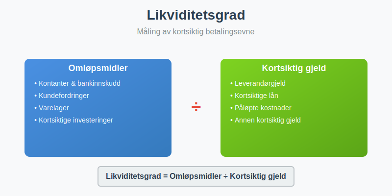
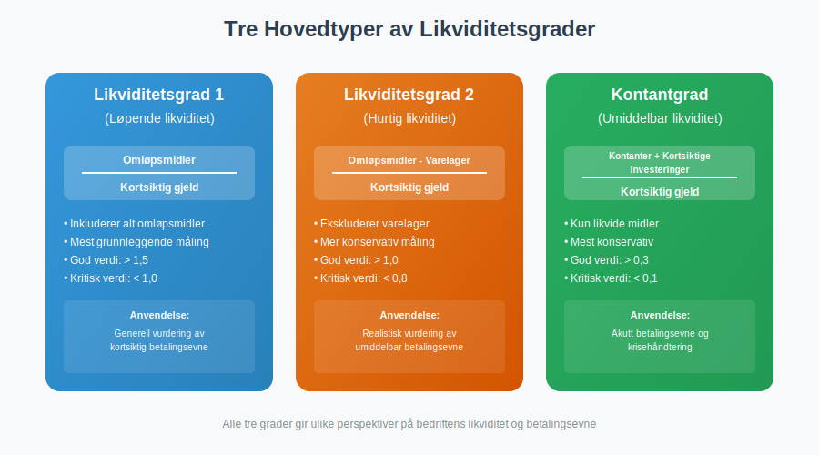
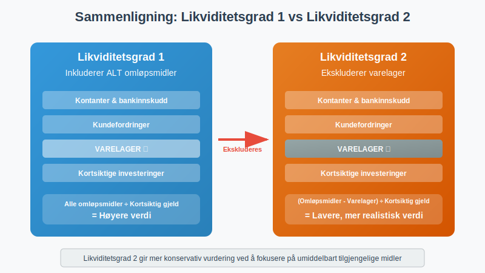
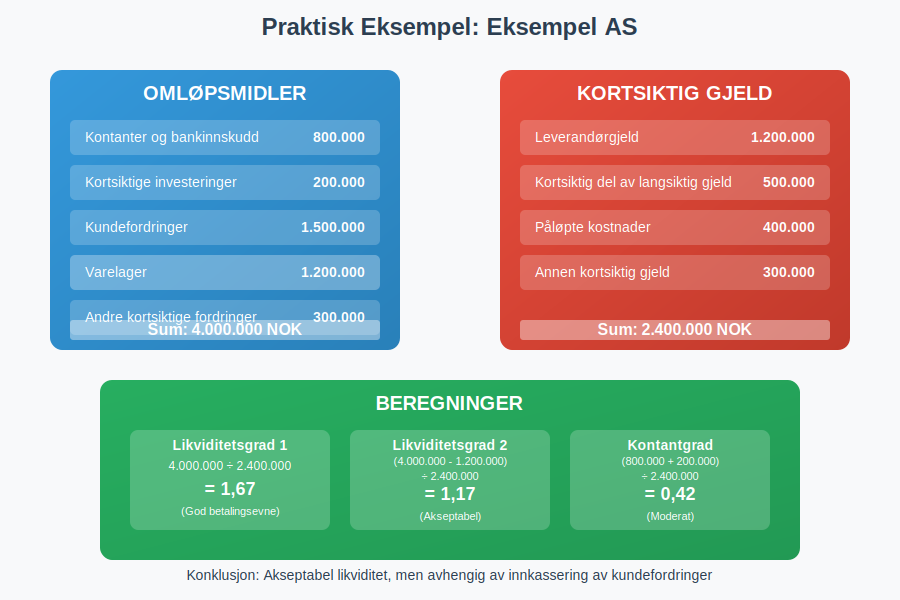
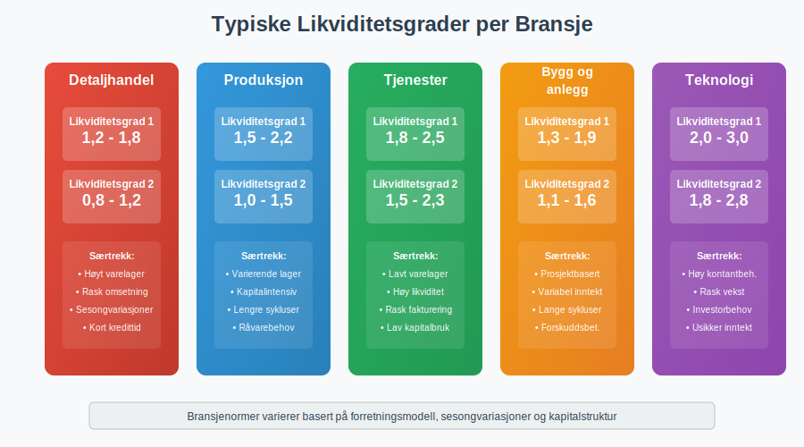
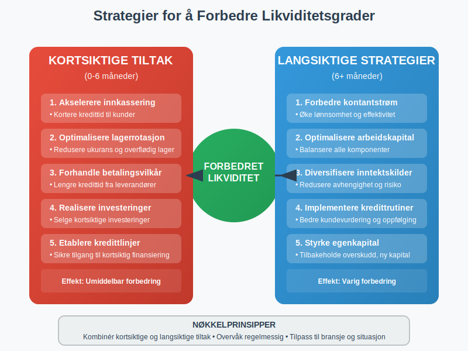
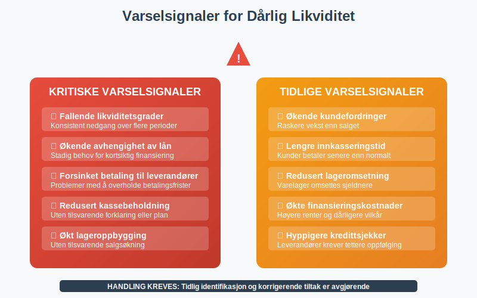
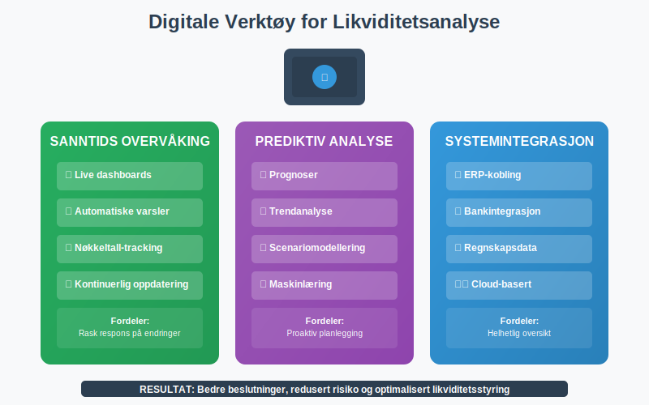
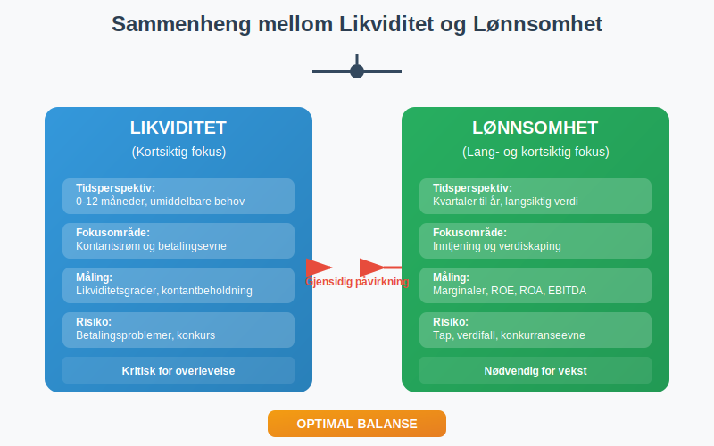

---
title: "Hva er Likviditetsgrad i Regnskap?"
meta_title: "Hva er Likviditetsgrad i Regnskap?"
meta_description: '**Likviditetsgrad** er et sentralt **[finansielt nøkkeltall](/blogs/regnskap/hva-er-nokkeltall "Hva er Nøkkeltall? Komplett Guide til Finansielle Nøkkeltall ...'
slug: hva-er-likviditetsgrad
type: blog
layout: pages/single
---

**Likviditetsgrad** er et sentralt **[finansielt nøkkeltall](/blogs/regnskap/hva-er-nokkeltall "Hva er Nøkkeltall? Komplett Guide til Finansielle Nøkkeltall i Regnskap")** som måler bedriftens evne til å dekke kortsiktige forpliktelser med tilgjengelige likvide midler. Dette er et kritisk verktøy for å vurdere [betalingsevne](/blogs/regnskap/hva-er-betalingsevne "Hva er Betalingsevne i Regnskap? Analyse, Nøkkeltall og Vurdering av Likviditet") og finansiell stabilitet.



## Hva er Likviditetsgrad?

**Likviditetsgrad** er et forholdstall som viser hvor godt en bedrift kan møte sine **kortsiktige finansielle forpliktelser** ved hjelp av sine mest likvide [aktiva](/blogs/regnskap/hva-er-aktiva "Hva er Aktiva? Komplett Guide til Eiendeler i Balansen"). Høyere likviditetsgrad indikerer bedre **finansiell fleksibilitet** og lavere risiko for betalingsproblemer.

### Betydningen av Likviditetsanalyse

Likviditetsgrader er essensielle for:

* **Kredittvurdering** fra banker og leverandører
* **Investeringsbeslutninger** fra potensielle investorer
* **Intern styring** av [arbeidskapital](/blogs/regnskap/hva-er-arbeidskapital "Hva er Arbeidskapital? Beregning og Betydning for Bedriftens Drift")
* **Risikohåndtering** og finansiell planlegging
* **Sammenligning** med konkurrenter og bransjestandard

## Typer Likviditetsgrader



### 1. Likviditetsgrad 1 (Løpende Likviditet)

**Likviditetsgrad 1** er den mest grunnleggende målingen av kortsiktig betalingsevne:

```
Likviditetsgrad 1 = Omløpsmidler ÷ Kortsiktig gjeld
```

**Komponenter:**
- **Omløpsmidler:** [Kassebeholdning](/blogs/regnskap/hva-er-kassebeholdning "Hva er Kassebeholdning? Komplett Guide til Kontanter og Likvide Midler"), [kundefordringer](/blogs/regnskap/hva-er-debitor "Hva er Debitor i Regnskap? Komplett Guide til Kundefordringer og Debitorhåndtering"), varelager, kortsiktige investeringer
- **[Kortsiktig gjeld](/blogs/regnskap/kortsiktig-gjeld "Kortsiktig Gjeld: Definisjon, Typer og Regnskapsføring"):** Leverandørgjeld, kortsiktige lån, påløpte kostnader

**Tolkning av Likviditetsgrad 1:**

| Verdi | Vurdering | Betydning |
|-------|-----------|-----------|
| **Over 2,5** | Meget høy | Mulig overlikviditet, ineffektiv kapitalbruk |
| **2,0-2,5** | Høy | Meget god betalingsevne, trygg margin |
| **1,5-2,0** | God | God betalingsevne, akseptabel risiko |
| **1,2-1,5** | Akseptabel | Tilfredsstillende, men krever oppmerksomhet |
| **1,0-1,2** | Lav | Risiko for betalingsproblemer |
| **Under 1,0** | Kritisk | Akutt risiko, umiddelbar handling nødvendig |

### 2. Likviditetsgrad 2 (Hurtig Likviditet)

**Likviditetsgrad 2** gir et mer konservativt mål ved å ekskludere varelager:

```
Likviditetsgrad 2 = (Omløpsmidler - Varelager) ÷ Kortsiktig gjeld
```

**Fordeler med Likviditetsgrad 2:**
- Ekskluderer **varelager** som kan være vanskelig å selge raskt
- Fokuserer på **umiddelbart tilgjengelige** likvide midler
- Mer **realistisk** vurdering av kortsiktig betalingsevne
- Mindre påvirket av **lagerverdsettelse** og [**ukurans**](/blogs/regnskap/ukurans "Ukurans i regnskap - nedskrivning av ukurante varer")



**Tolkning av Likviditetsgrad 2:**

| Verdi | Vurdering | Anbefaling |
|-------|-----------|------------|
| **Over 1,5** | Meget god | Sterk likviditetsposisjon |
| **1,0-1,5** | God | Tilfredsstillende hurtig likviditet |
| **0,8-1,0** | Akseptabel | Overvåk nøye, forbedring ønskelig |
| **Under 0,8** | Svak | Krever umiddelbare tiltak |

### 3. Kontantgrad (Umiddelbar Likviditet)

**Kontantgrad** måler den mest konservative formen for likviditet:

```
Kontantgrad = (Kontanter + Kortsiktige investeringer) ÷ Kortsiktig gjeld
```

Denne graden fokuserer kun på **umiddelbart tilgjengelige** kontanter og **høylikvide investeringer**.

## Praktisk Beregningseksempel

La oss analysere **Eksempel AS** sine likviditetsgrader:



### Balansedata for Eksempel AS

| Balansepost | Beløp (NOK) |
|-------------|-------------|
| **OMLØPSMIDLER** | |
| Kontanter og bankinnskudd | 800.000 |
| Kortsiktige investeringer | 200.000 |
| [Kundefordringer](/blogs/regnskap/hva-er-debitor "Hva er Debitor i Regnskap? Komplett Guide til Kundefordringer og Debitorhåndtering") | 1.500.000 |
| Varelager | 1.200.000 |
| Andre kortsiktige fordringer | 300.000 |
| **Sum omløpsmidler** | **4.000.000** |
| | |
| **KORTSIKTIG GJELD** | |
| Leverandørgjeld | 1.200.000 |
| Kortsiktig del av langsiktig gjeld | 500.000 |
| Påløpte kostnader | 400.000 |
| Annen kortsiktig gjeld | 300.000 |
| **Sum kortsiktig gjeld** | **2.400.000** |

### Beregninger

**Likviditetsgrad 1:**
```
4.000.000 ÷ 2.400.000 = 1,67
```

**Likviditetsgrad 2:**
```
(4.000.000 - 1.200.000) ÷ 2.400.000 = 1,17
```

**Kontantgrad:**
```
(800.000 + 200.000) ÷ 2.400.000 = 0,42
```

### Analyse av Resultatet

| Nøkkeltall | Verdi | Vurdering | Kommentar |
|------------|-------|-----------|-----------|
| **Likviditetsgrad 1** | 1,67 | God | Tilfredsstillende betalingsevne |
| **Likviditetsgrad 2** | 1,17 | Akseptabel | Avhengig av kundefordringer |
| **Kontantgrad** | 0,42 | Moderat | Begrenset umiddelbar likviditet |

**Konklusjon:** Bedriften har **akseptabel likviditet**, men er avhengig av å innkassere kundefordringer og eventuelt selge varelager for å møte alle kortsiktige forpliktelser.

## Bransjevariasjoner og Benchmarking



### Typiske Likviditetsgrader per Bransje

| Bransje | Likviditetsgrad 1 | Likviditetsgrad 2 | Særtrekk |
|---------|-------------------|-------------------|----------|
| **Detaljhandel** | 1,2-1,8 | 0,8-1,2 | Høyt varelager, rask omsetning |
| **Produksjon** | 1,5-2,2 | 1,0-1,5 | Varierende lagerbehov |
| **Tjenester** | 1,8-2,5 | 1,5-2,3 | Lavt varelager, høy likviditet |
| **Bygg og anlegg** | 1,3-1,9 | 1,1-1,6 | Prosjektbasert, variabel |
| **Teknologi** | 2,0-3,0 | 1,8-2,8 | Høy kontantbeholdning |

### Faktorer som PÃ¥virker Bransjenormer

* **Sesongvariasjoner** i salg og innkjøp
* **Kredittvilkår** til kunder og fra leverandører
* **Lageromsetningshastighet** og lagerstrategi
* **Investeringssyklus** og kapitalintensitet
* **Regulatoriske krav** og bransjestandard

## Forbedring av Likviditetsgrader

### Strategier for Økt Likviditet



#### Kortsiktige Tiltak

* **Akselerere innkassering** av [kundefordringer](/blogs/regnskap/hva-er-debitor "Hva er Debitor i Regnskap? Komplett Guide til Kundefordringer og Debitorhåndtering")
* **Optimalisere lagerrotasjon** og redusere [**ukurans**](/blogs/regnskap/ukurans "Ukurans i regnskap - nedskrivning av ukurante varer")
* **Forhandle bedre betalingsvilkår** med leverandører
* **Realisere kortsiktige investeringer** ved behov
* **Etablere kredittlinjer** for fleksibilitet

#### Langsiktige Strategier

* **Forbedre [kontantstrøm](/blogs/regnskap/hva-er-kontantstrom "Hva er Kontantstrøm? Komplett Guide til Cash Flow Analyse og Styring")** fra drift
* **Optimalisere [arbeidskapital](/blogs/regnskap/hva-er-arbeidskapital "Hva er Arbeidskapital? Beregning og Betydning for Bedriftens Drift")-styring**
* **Diversifisere inntektskilder** for stabilitet
* **Implementere effektive kredittrutiner**
* **Styrke [egenkapital](/blogs/regnskap/hva-er-egenkapital "Hva er Egenkapital? Beregning, Typer og Betydning i Regnskap")** gjennom tilbakeholdt overskudd

### Arbeidskapitalstyring

Effektiv **arbeidskapitalstyring** er nøkkelen til optimale likviditetsgrader:

| Komponent | Optimalisering | Effekt på likviditet |
|-----------|----------------|---------------------|
| **Kundefordringer** | Kortere kredittid, bedre oppfølging | Øker likviditet |
| **Varelager** | Just-in-time, ABC-analyse | Frigjør kapital |
| **Leverandørgjeld** | Utnytte kredittperioder | Bevarer likviditet |

## Risikofaktorer og Varselsignaler

### Kritiske Varselsignaler



* **Fallende likviditetsgrader** over tid
* **Økende avhengighet** av kortsiktig finansiering
* **Forsinket betaling** til leverandører
* **Redusert [kassebeholdning](/blogs/regnskap/hva-er-kassebeholdning "Hva er Kassebeholdning? Komplett Guide til Kontanter og Likvide Midler")** uten forklaring
* **Økt lageroppbygging** uten tilsvarende salgsøkning

### Konsekvenser av DÃ¥rlig Likviditet

* **Betalingsproblemer** og leverandørkonflikt
* **Høyere finansieringskostnader** og dårligere vilkår
* **Redusert kredittillit** og rating
* **Begrenset vekstmuligheter** og investeringskapasitet
* **Risiko for konkurs** i verste fall

## Digitale Verktøy og Overvåking

### Moderne Likviditetsanalyse



**Automatiserte systemer** kan gi:

* **Sanntids likviditetsovervåking** med dashboards
* **Prognoser** basert på historiske data og trender
* **Varsler** ved kritiske nivåer eller endringer
* **Integrering** med [ERP-systemer](/blogs/regnskap/hva-er-erp-system "Hva er ERP-system? Komplett Guide til Enterprise Resource Planning") og regnskapsdata
* **Benchmarking** mot bransje og konkurrenter

### Implementering av Overvåkingssystem

1. **Definere kritiske terskelverdier** for hver likviditetsgrad
2. **Etablere rapporteringsrutiner** (daglig, ukentlig, månedlig)
3. **Tildele ansvar** for oppfølging og tiltak
4. **Integrere med budsjett** og [kontantstrømprognose](/blogs/regnskap/hva-er-kontantstromanalyse "Hva er Kontantstrømanalyse? Komplett Guide til Cash Flow Analyse")
5. **Regelmessig evaluering** og justering av system

## Sammenheng med Andre Nøkkeltall

### Likviditet vs. Lønnsomhet



| Aspekt | Likviditet | Lønnsomhet |
|--------|------------|------------|
| **Tidsperspektiv** | Kortsiktig | Lang- og kortsiktig |
| **Fokus** | Kontantstrøm | Inntjening |
| **MÃ¥ling** | Likviditetsgrader | Marginaler, ROE, ROA |
| **Risiko** | Betalingsproblemer | Tap og verdifall |

### Integrert Finansiell Analyse

For helhetlig vurdering kombineres likviditetsanalyse med:

* **[Soliditetsanalyse](/blogs/regnskap/hva-er-egenkapital "Hva er Egenkapital? Beregning, Typer og Betydning i Regnskap")** - langsiktig finansiell styrke
* **Lønnsomhetsanalyse** - evne til verdiskaping
* **Aktivitetsanalyse** - effektivitet i ressursbruk
* **Markedsanalyse** - konkurranseposisjon og vekstpotensial

## Konklusjon

**Likviditetsgrader** er fundamentale verktøy for å vurdere bedriftens **kortsiktige finansielle helse** og [betalingsevne](/blogs/regnskap/hva-er-betalingsevne "Hva er Betalingsevne i Regnskap? Analyse, Nøkkeltall og Vurdering av Likviditet"). Ved å forstå og aktivt overvåke disse nøkkeltallene kan bedrifter:

* **Sikre kontinuerlig drift** uten betalingsproblemer
* **Optimalisere [arbeidskapital](/blogs/regnskap/hva-er-arbeidskapital "Hva er Arbeidskapital? Beregning og Betydning for Bedriftens Drift")** for maksimal effektivitet
* **Bygge tillit** hos investorer, kreditorer og leverandører
* **Identifisere risiko** tidlig og iverksette korrigerende tiltak
* **Støtte strategiske beslutninger** med solid finansiell analyse

Regelmessig overvåking og analyse av likviditetsgrader, kombinert med effektiv [kontantstrømstyring](/blogs/regnskap/hva-er-kontantstrom "Hva er Kontantstrøm? Komplett Guide til Cash Flow Analyse og Styring"), er essensielt for bærekraftig forretningsdrift og langsiktig suksess.
