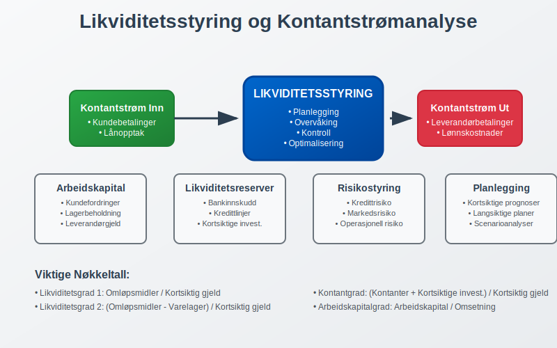

**Likviditetsstyring** er en kritisk del av finansiell ledelse som handler om å sikre at en bedrift har tilstrekkelig [kontantbeholdning](/blogs/regnskap/hva-er-kontantbeholdning "Hva er Kontantbeholdning? Komplett Guide til Kontanter og Bankinnskudd") og tilgang til likvide midler for å møte sine kortsiktige forpliktelser. Som en sentral komponent i [finansregnskap](/blogs/regnskap/hva-er-finansregnskap "Hva er Finansregnskap? Komplett Guide til Eksternregnskap og Finansiell Rapportering"), involverer likviditetsstyring planlegging, overvåking og kontroll av [kontantstrøm](/blogs/regnskap/hva-er-kontantstrom "Hva er Kontantstrøm? Komplett Guide til Kontantstrømanalyse og Likviditetsstyring") for å optimalisere bedriftens finansielle fleksibilitet. For norske bedrifter er effektiv likviditetsstyring essensielt for å opprettholde [betalingsevne](/blogs/regnskap/hva-er-betalingsevne "Hva er Betalingsevne? Analyse av Likviditet og Finansiell Stabilitet") og sikre kontinuerlig drift i henhold til [god regnskapsskikk](/blogs/regnskap/god-regnskapsskikk "God Regnskapsskikk - Prinsipper og Retningslinjer for Norsk Regnskap").

For å planlegge bedriftens finansieringsbehov er det viktig å beregne [kapitalbehov](/blogs/regnskap/kapitalbehov "Hva er Kapitalbehov? Guide til Kapitalbehov og Finansieringsplan for Norske Bedrifter"), som viser hvor mye kapital som kreves for drift og investeringer.

## Grunnleggende Prinsipper for Likviditetsstyring

Likviditetsstyring bygger på flere fundamentale prinsipper som sikrer at bedriften kan møte sine finansielle forpliktelser når de forfaller. Disse prinsippene er tett knyttet til [arbeidskapital](/blogs/regnskap/hva-er-arbeidskapital "Hva er Arbeidskapital? Komplett Guide til Arbeidskapitalstyring") og [balansestyring](/blogs/regnskap/hva-er-balanse "Hva er Balanse? Komplett Guide til Balanseregnskap og Finansiell Stilling").

### 1. Kontantstrømplanlegging

**Kontantstrømplanlegging** er kjernen i likviditetsstyring og innebærer systematisk prognostisering av inn- og utbetalinger over tid. Dette krever detaljert analyse av:

* **Driftsmessige kontantstrømmer:** Inntekter fra salg, betalinger til leverandører, lønnskostnader
* **Investeringsmessige kontantstrømmer:** Kjøp og salg av [anleggsmidler](/blogs/regnskap/hva-er-anleggsmidler "Hva er Anleggsmidler? Komplett Guide til Varige Driftsmidler")
* **Finansieringsmessige kontantstrømmer:** Lånopptak, tilbakebetaling av gjeld, utbytte

### 2. Arbeidskapitalstyring

Effektiv styring av [arbeidskapital](/blogs/regnskap/hva-er-arbeidskapital "Hva er Arbeidskapital?") er avgjørende for likviditetsstyring. Dette omfatter optimalisering av:

* **[Kundefordringer](/blogs/regnskap/hva-er-kundefordring "Hva er Kundefordring? Komplett Guide til Fordringer og Kredittstyring"):** Redusere kredittid og forbedre innkrevingsrutiner
* **[Lagerbeholdning](/blogs/regnskap/hva-er-lagerbeholdning "Hva er Lagerbeholdning? Komplett Guide til Lagerregnskapet"):** Minimere bundet kapital i varelager
* **[Leverandørgjeld](/blogs/regnskap/hva-er-leverandorgjeld "Hva er Leverandørgjeld? Komplett Guide til Kreditorhåndtering"):** Optimalisere betalingstidspunkter

### 3. Likviditetsreserver

Opprettholde tilstrekkelige likviditetsreserver gjennom:

* **[Bankinnskudd](/blogs/regnskap/hva-er-bankinnskudd "Hva er Bankinnskudd? Komplett Guide til Bankinnskudd i Regnskap"):** Kontanter på bankkontoer
* **Kredittfasiliteter:** Ubenyttede kredittlinjer og kassekreditt
* **Kortsiktige investeringer:** Likvide finansielle instrumenter

## Likviditetsanalyse og Nøkkeltall

Systematisk likviditetsanalyse er fundamental for effektiv likviditetsstyring. Tabellen nedenfor viser de viktigste likviditetsnøkkeltallene og deres tolkninger:

| Nøkkeltall | Formel | Tolkning | Anbefalt Nivå |
|------------|--------|----------|---------------|
| **Likviditetsgrad 1** | Omløpsmidler / Kortsiktig gjeld | Evne til å dekke kortsiktig gjeld | > 2,0 |
| **Likviditetsgrad 2** | (Omløpsmidler - Varelager) / Kortsiktig gjeld | Likviditet uten varelager | > 1,0 |
| **Kontantgrad** | (Kontanter + Kortsiktige investeringer) / Kortsiktig gjeld | Umiddelbar betalingsevne | > 0,2 |
| **Arbeidskapitalgrad** | Arbeidskapital / Omsetning | Arbeidskapitalens effektivitet | 10-20% |

### Praktisk Eksempel: Likviditetsanalyse

La oss se på et konkret eksempel hvor en bedrift analyserer sin likviditetssituasjon:

**Bedrift ABC - Balansetall (i tusen NOK):**
* Omløpsmidler: 2.500
* Varelager: 800
* Kontanter og bankinnskudd: 400
* Kortsiktige investeringer: 200
* [Kortsiktig gjeld](/blogs/regnskap/kortsiktig-gjeld "Kortsiktig Gjeld - Komplett Guide til Kortsiktige Forpliktelser"): 1.200

**Beregning av nøkkeltall:**
* Likviditetsgrad 1: 2.500 / 1.200 = 2,08 (Tilfredsstillende)
* Likviditetsgrad 2: (2.500 - 800) / 1.200 = 1,42 (God)
* Kontantgrad: (400 + 200) / 1.200 = 0,50 (Meget god)

## Kontantstrømoppstilling og Likviditetsstyring

[Kontantstrømoppstilling](/blogs/regnskap/hva-er-kontantstromoppstilling "Hva er Kontantstrømoppstilling? Komplett Guide til Kontantstrømanalyse") er et sentralt verktøy i likviditetsstyring som gir detaljert oversikt over bedriftens kontantbevegelser. Oppstillingen deles inn i tre hovedkategorier:

### Driftsmessige Kontantstrømmer

Kontantstrømmer fra den løpende driften er den viktigste kilden til likviditet for de fleste bedrifter:

* **Positive strømmer:** Innbetalinger fra kunder, renteinntekter
* **Negative strømmer:** Betalinger til leverandører, lønnskostnader, skatter

### Investeringsmessige Kontantstrømmer

Kontantstrømmer knyttet til investeringer i og salg av langsiktige eiendeler:

* **Negative strømmer:** Kjøp av maskiner, utstyr, bygninger
* **Positive strømmer:** Salg av anleggsmidler, utbytte fra investeringer

### Finansieringsmessige Kontantstrømmer

Kontantstrømmer fra finansieringsaktiviteter:

* **Positive strømmer:** Lånopptak, [egenkapitaltilførsel](/blogs/regnskap/hva-er-egenkapital "Hva er Egenkapital? Komplett Guide til Egenkapital i Norske Bedrifter")
* **Negative strømmer:** Tilbakebetaling av lån, utbetaling av utbytte

## Likviditetsplanlegging og Prognoser

Effektiv likviditetsplanlegging krever systematisk utarbeidelse av kontantstrømprognoser på kort og lang sikt. Dette innebærer detaljert planlegging av alle inn- og utbetalinger.

### Kortsiktig Likviditetsplanlegging (1-12 måneder)

Kortsiktig planlegging fokuserer på operasjonelle kontantstrømmer og omfatter:

* **Daglig likviditetsstyring:** Overvåking av banksaldoer og betalingsforfall
* **Ukentlige prognoser:** Detaljerte prognoser for kommende uker
* **Månedlige budsjetter:** Sammenligning av faktiske og budsjetterte kontantstrømmer

### Langsiktig Likviditetsplanlegging (1-5 år)

Langsiktig planlegging integreres med strategisk planlegging og omfatter:

* **Investeringsplaner:** Planlagte investeringer i anleggsmidler
* **Finansieringsstrategier:** Planlegging av fremtidig finansieringsbehov
* **Scenarioanalyser:** Analyse av ulike markedsscenarier og deres likviditetspåvirkning

## Arbeidskapitalstyring som Likviditetsverktøy

Arbeidskapitalstyring er en av de mest effektive metodene for å forbedre likviditetssituasjonen. Dette innebærer optimalisering av alle komponenter i arbeidskapitalen.

### Kundefordringsstyring

Effektiv styring av [kundefordringer](/blogs/regnskap/hva-er-kundefordring "Hva er Kundefordring?") kan betydelig forbedre kontantstrømmen:

**Strategier for forbedring:**
* **Kortere kredittider:** Redusere standard betalingsfrist fra 30 til 14 dager
* **Kontantrabatter:** Tilby rabatt for rask betaling
* **Effektiv [inkasso](/blogs/regnskap/hva-er-inkasso "Hva er Inkasso? Komplett Guide til Inkassoprosessen"):** Systematisk oppfølging av forfalte fordringer
* **Kredittvurdering:** Grundig vurdering av nye kunders kredittverdighet

### Lagerstyring

Optimalisering av [lagerbeholdning](/blogs/regnskap/hva-er-lagerbeholdning "Hva er Lagerbeholdning?") frigjør bundet kapital:

**Lageroptimaliseringsstrategier:**
* **Just-in-time levering:** Redusere lagernivåer gjennom tettere leverandørsamarbeid
* **ABC-analyse:** Prioritere styring av høyverdige lagervarer
* **Sesongplanlegging:** Tilpasse lagernivåer til sesongvariasjoner
* [**Ukurans-håndtering**](/blogs/regnskap/ukurans "Ukurans i regnskap - nedskrivning av ukurante varer"): Regelmessig gjennomgang og avhending av ukurans lager

### Leverandørgjeldsstyring

Strategisk styring av [leverandørgjeld](/blogs/regnskap/hva-er-leverandorgjeld "Hva er Leverandørgjeld?") kan forbedre kontantstrømmen:

**Optimaliseringsstrategier:**
* **Forhandling av betalingsbetingelser:** Oppnå lengre kredittider
* **Utnyttelse av kontantrabatter:** Vurdere lønnsomheten av tidlig betaling
* **Sentralisert betalingshåndtering:** Optimalisere betalingstidspunkter
* **Leverandørfinansiering:** Utnytte leverandørenes finansieringstilbud

## Likviditetsrisiko og Risikostyring

Likviditetsrisiko refererer til risikoen for at bedriften ikke kan møte sine kortsiktige forpliktelser når de forfaller. Effektiv risikostyring krever identifikasjon, måling og håndtering av ulike risikofaktorer.

### Typer Likviditetsrisiko

**1. Finansieringsrisiko**
* Risiko for ikke å kunne refinansiere gjeld ved forfall
* Endringer i kredittbetingelser fra banker og finansinstitusjoner

**2. Markedsrisiko**
* Svingninger i kontantstrøm på grunn av markedsendringer
* Sesongvariasjoner i salg og innbetalinger

**3. Operasjonell risiko**
* Forstyrrelser i driften som påvirker kontantstrømmen
* Tap av store kunder eller leverandører

**4. Kredittrisiko**
* Kunders manglende betalingsevne
* Økning i tap på fordringer

### Risikohåndteringsstrategier

Bedrifter kan implementere flere strategier for å håndtere likviditetsrisiko:

| Strategi | Beskrivelse | Fordeler | Ulemper |
|----------|-------------|----------|---------|
| **Likviditetsreserver** | Opprettholde høye kontantbeholdninger | Høy sikkerhet | Lav avkastning |
| **Kredittfasiliteter** | Etablere kredittlinjer | Fleksibilitet | Rentekostnader |
| **Diversifisering** | Spre risiko på flere områder | Redusert samlet risiko | Kompleksitet |
| **Forsikring** | Forsikre mot spesifikke risikoer | Beskyttelse | Premiekostnader |

## Teknologi og Digitalisering i Likviditetsstyring

Moderne teknologi har revolusjonert likviditetsstyring gjennom automatisering og sanntidsrapportering. [ERP-systemer](/blogs/regnskap/hva-er-erp-system "Hva er ERP-system? Komplett Guide til Enterprise Resource Planning") og spesialiserte likviditetsstyringsverktøy gir bedrifter kraftige verktøy for å optimalisere sin likviditetssituasjon.

### Digitale Verktøy for Likviditetsstyring

**1. Automatisert Kontantstrømprognose**
* Sanntidsoppdatering av prognoser basert på faktiske transaksjoner
* Integrasjon med [fakturasystemer](/blogs/regnskap/hva-er-en-faktura "Hva er en Faktura? En Guide til Norske Fakturakrav") og betalingsplattformer
* Maskinlæring for forbedret prognosenøyaktighet

**2. Elektronisk Betalingshåndtering**
* [Avtalegiro](/blogs/regnskap/hva-er-avtalegiro "Hva er Avtalegiro? Komplett Guide til Automatiske Betalinger") for regelmessige betalinger
* [Elektronisk fakturering](/blogs/regnskap/hva-er-elektronisk-fakturering "Hva er Elektronisk Fakturering? Guide til Digital Fakturahåndtering") for raskere innbetalinger
* Automatiserte betalingsrutiner

**3. Sanntids Rapportering**
* Dashboard med nøkkeltall og trender
* Varslingssystemer for kritiske likviditetsnivåer
* Integrerte rapporter for ledelsen

## Regulatoriske Krav og Compliance

Norske bedrifter må overholde flere regulatoriske krav knyttet til likviditetsstyring og finansiell rapportering. Dette inkluderer krav fra [bokføringsloven](/blogs/regnskap/hva-er-bokføringsloven "Hva er Bokføringsloven? Komplett Guide til Norske Bokføringsregler") og [regnskapsloven](/blogs/regnskap/hva-er-regnskap "Hva er Regnskap? En Komplett Guide til Norsk Regnskapsføring").

### Rapporteringskrav

**1. Kontantstrømoppstilling**
* Obligatorisk for store foretak
* Må følge godkjente regnskapsstandarder
* Kvartalsvise rapporter for børsnoterte selskaper

**2. Likviditetsrapportering**
* Interne rapporter til styret
* Rapporter til långivere ved låneavtaler
* Spesielle krav for finansinstitusjoner

**3. Dokumentasjon og Internkontroll**
* [Internkontroll](/blogs/regnskap/hva-er-internkontroll "Hva er Internkontroll? Komplett Guide til Internkontrollsystemer") for likviditetsstyring
* Dokumentasjon av prosedyrer og beslutninger
* Revisors gjennomgang av likviditetsstyring

## Bransjespesifikke Utfordringer

Ulike bransjer har spesifikke utfordringer knyttet til likviditetsstyring som krever tilpassede strategier og løsninger.

### Detaljhandel

[Detaljhandel](/blogs/regnskap/hva-er-detaljhandel "Hva er Detaljhandel? Komplett Guide til Detaljhandelsregnskap") har unike likviditetsutfordringer:

* **Sesongvariasjoner:** Store svingninger i kontantstrøm
* **Lagerstyring:** Høy kapitalbinding i varelager
* **Kontantsalg vs. kreditt:** Balansering av salgsformer

### Produksjonsbedrifter

Produksjonsbedrifter møter spesifikke utfordringer:

* **Lange produksjonssykluser:** Forsinket kontantstrøm
* **Råvarelager:** Stor kapitalbinding i råvarer og halvfabrikata
* **Investeringssykluser:** Store investeringer i maskiner og utstyr

### Tjenestebedrifter

Tjenestebedrifter har andre likviditetsutfordringer:

* **Prosjektbaserte inntekter:** Ujevn kontantstrøm
* **Personalkostnader:** Høye faste kostnader
* **Kredittid til kunder:** Lange innkrevingsperioder

## Beste Praksis for Likviditetsstyring

Implementering av beste praksis for likviditetsstyring sikrer optimal finansiell styring og reduserer risiko for likviditetsproblemer.

### 1. Etabler Robuste Systemer og Prosedyrer

**Systemkrav:**
* Integrerte regnskaps- og likviditetsstyringssystemer
* Automatiserte rapporteringsrutiner
* Backup-systemer og beredskapsplaner

**Prosedyrekrav:**
* Klare ansvarsforhold og myndighetslinjer
* Regelmessige gjennomganger og oppdateringer
* Dokumenterte prosedyrer for alle kritiske prosesser

### 2. Implementer Effektiv Overvåking og Kontroll

**Overvåkingselementer:**
* Daglig oppfølging av banksaldoer
* Ukentlige kontantstrømprognoser
* Månedlige analyser av nøkkeltall

**Kontrollmekanismer:**
* Grenseverdier for kritiske nøkkeltall
* Eskaleringsrutiner ved avvik
* Regelmessig testing av beredskapsplaner

### 3. Utvikle Beredskapsplaner

**Beredskapsplanlegging:**
* Identifikasjon av kritiske risikoscenarier
* Handlingsplaner for ulike krisesituasjoner
* Regelmessig testing og oppdatering av planer

**Finansieringsalternativer:**
* Etablerte kredittfasiliteter
* Kontakter med alternative finansieringskilder
* Planer for rask kapitaltilførsel

## Fremtidige Trender i Likviditetsstyring

Likviditetsstyring utvikler seg kontinuerlig med nye teknologier og endrede markedsforhold. Flere trender vil påvirke hvordan bedrifter styrer sin likviditet fremover.

### Teknologiske Innovasjoner

**Kunstig intelligens og maskinlæring:**
* Forbedrede prognoser basert på historiske data og markedstrender
* Automatisk identifikasjon av mønstre og anomalier
* Prediktiv analyse for risikohåndtering

**Blockchain og digitale valutaer:**
* Raskere og mer effektive betalingssystemer
* Reduserte transaksjonskostnader
* Nye former for kortsiktig finansiering

**Open Banking:**
* Bedre integrasjon mellom ulike finansielle tjenester
* Sanntids tilgang til kontoinformasjon
* Automatiserte likviditetsstyringsløsninger

### Regulatoriske Endringer

**Økt fokus på bærekraft:**
* ESG-rapportering påvirker finansieringstilgang
* Grønne finansieringsalternativer
* Bærekraftige likviditetsstrategier

**Digitalisering av regelverk:**
* Automatisert rapportering til myndigheter
* Sanntids compliance-overvåking
* Digitale revisjonsløp

## Konklusjon

Likviditetsstyring er en fundamental del av finansiell ledelse som krever systematisk tilnærming, robuste systemer og kontinuerlig overvåking. Effektiv likviditetsstyring sikrer ikke bare at bedriften kan møte sine kortsiktige forpliktelser, men optimaliserer også kapitalbruken og reduserer finansieringskostnadene.

For norske bedrifter er det essensielt å integrere likviditetsstyring med [internregnskap](/blogs/regnskap/hva-er-internregnskap "Hva er Internregnskap? Komplett Guide til Ledelsesregnskap") og strategisk planlegging. Dette sikrer at likviditetsbeslutninger støtter bedriftens langsiktige mål samtidig som kortsiktig finansiell stabilitet opprettholdes.

Bedrifter som implementerer beste praksis for likviditetsstyring vil være bedre posisjonert for å:

* **HÃ¥ndtere markedsvolatilitet:** Robust likviditetsstyring gir fleksibilitet i usikre tider
* **Utnytte vekstmuligheter:** Tilstrekkelig likviditet muliggjør rask respons på markedsmuligheter
* **Redusere finansieringskostnader:** Optimal likviditetsstyring minimerer behovet for dyr kortsiktig finansiering
* **Styrke forhandlingsposisjon:** God likviditetssituasjon forbedrer forhandlingsmakt med leverandører og finansinstitusjoner

Fremover vil teknologiske innovasjoner og regulatoriske endringer fortsette å forme likviditetsstyring. Bedrifter som investerer i moderne systemer og utvikler robuste prosedyrer vil ha betydelige konkurransefortrinn i det digitale økonomiske landskapet.
