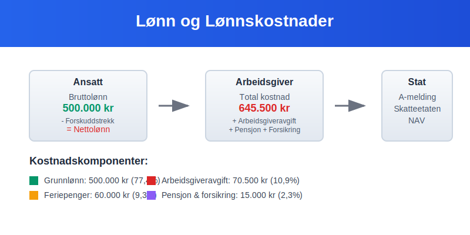
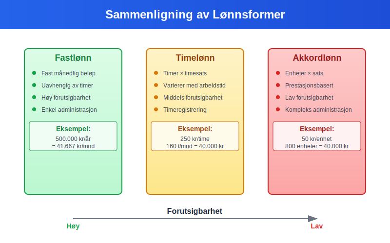
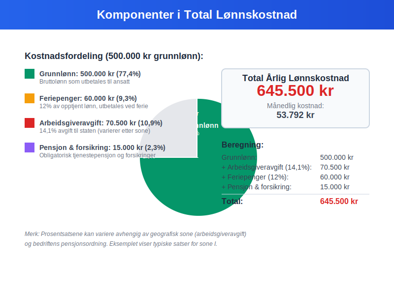
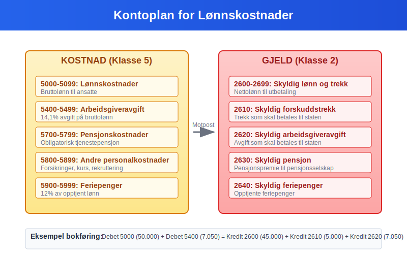
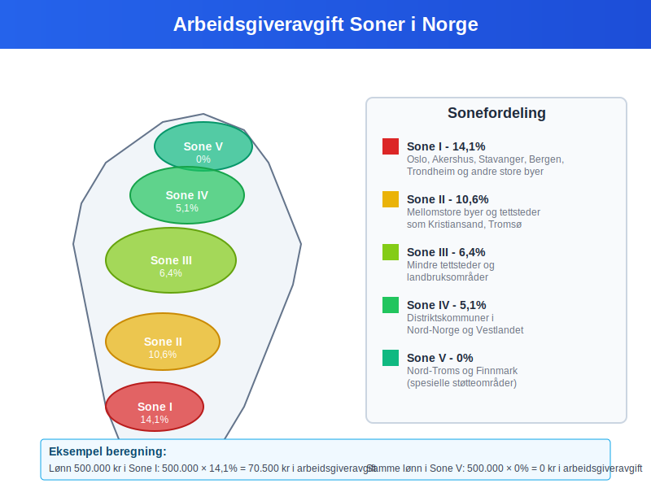
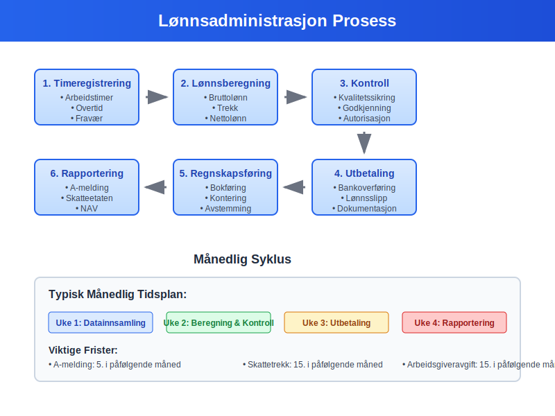
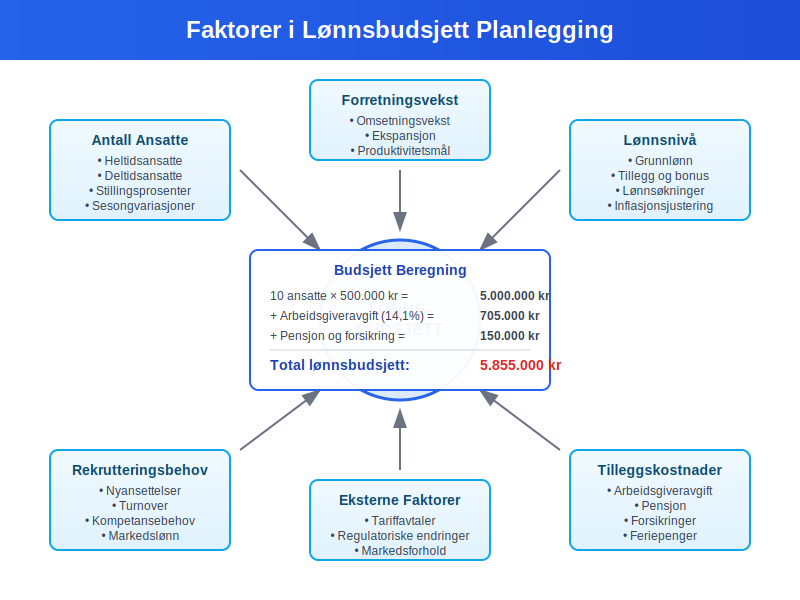

---
title: "Hva er Lønn i Regnskap?"
seoTitle: "Hva er Lønn i Regnskap?"
meta_description: '**Lønn** er kompensasjon som utbetales til ansatte for utført arbeid og representerer en av de største kostnadene for de fleste bedrifter. I regnskapssammenh...'
slug: hva-er-lonn
type: blog
layout: pages/single
---

**Lønn** er kompensasjon som utbetales til ansatte for utført arbeid og representerer en av de største kostnadene for de fleste bedrifter. I regnskapssammenheng omfatter lønn ikke bare grunnlønnen, men også alle tillegg, naturalytelser og arbeidsgiveravgift. Forståelse av ulike **lønnsformer** og deres regnskapsmessige behandling er avgjørende for korrekt [bokføring](/blogs/regnskap/hva-er-bokforing "Hva er Bokføring? Komplett Guide til Regnskapsføring") og [budsjettering](/blogs/regnskap/hva-er-budsjettering "Hva er Budsjettering? Komplett Guide til Budsjettplanlegging").

Se også [Hva er Lønnslipp?](/blogs/regnskap/hva-er-lonnslipp "Lønnslipp - Komplett Guide til Lønnsspecifikasjon og Regnskapsføring") for en full oversikt over lønnsspecifikasjon og regnskapsføring av lønn.



Se også [Lønnstyper](/blogs/regnskap/lonnstype "Hva er Lønnstype? Oversikt over ulike lønnstyper i Regnskap") for en fullstendig oversikt over **lønnstyper**.

## Ulike Lønnsformer

### Fastlønn

[**Fastlønn**](/blogs/regnskap/hva-er-fastlonn "Hva er Fastlønn i Regnskap?") er den vanligste lønnsformen i Norge og innebærer en fast månedlig eller årlig utbetaling uavhengig av arbeidstimer:

* **Forutsigbar** for både arbeidsgiver og arbeidstaker
* **Fast kostnad** i bedriftens [driftsregnskap](/blogs/regnskap/hva-er-driftsregnskap "Hva er Driftsregnskap? Komplett Guide til Driftsinntekter og Driftskostnader")
* **Grunnlag** for beregning av [feriepenger](/blogs/regnskap/hva-er-feriepenger "Hva er Feriepenger? Beregning, Opptjening og Regnskapsføring")
* **Stillingsprosent** bestemmer utbetalingsbeløpet
* **Lønnsprogresjon** basert på [ansiennitet](/blogs/regnskap/ansiennitet "Ansiennitet - Komplett Guide til Ansiennitet i Norsk Regnskap og Arbeidsrett") og erfaring

### Timelønn

**Timelønn** beregnes basert på antall arbeidstimer og en fast timesats:

* **Fleksibel** kostnad som varierer med aktivitetsnivået
* **Overtidstillegg** ved arbeid utover normalarbeidstid
* **Dokumentasjon** av arbeidstimer er påkrevet
* **Vanlig** i bransjer med varierende arbeidsmengde

### Akkordlønn

[**Akkordlønn**](/blogs/regnskap/hva-er-akkordlonn "Hva er Akkordlønn? En Guide til Prestasjonslønn") baseres på produserte enheter eller utført arbeidsmengde:

* **Prestasjonsbasert** kompensasjon
* **Motiverer** til høy produktivitet
* **Variabel kostnad** for bedriften
* **Krav** til [minstelønn](/blogs/regnskap/minstelonn "Minstelønn i Regnskap") må overholdes



| Lønnsform | Beregningsgrunnlag | Kostnadsprediktabilitet | Administrasjon |
|-----------|-------------------|------------------------|----------------|
| **[Fastlønn](/blogs/regnskap/hva-er-fastlonn "Hva er Fastlønn i Regnskap?")** | Fast måneds-/årsbeløp | Høy | Enkel |
| **Timelønn** | Timer × timesats | Middels | Middels |
| **[Akkordlønn](/blogs/regnskap/hva-er-akkordlonn "Hva er Akkordlønn? En Guide til Prestasjonslønn")** | Enheter × sats | Lav | Kompleks |
| **Provisjonslønn** | Salg × provisjonssats | Lav | Kompleks |

## Lønnskostnader for Arbeidsgiveren

### Totale Lønnskostnader

Arbeidsgiverens totale lønnskostnad består av flere komponenter utover [**grunnlønnen**](/blogs/regnskap/hva-er-grunnlonn "Hva er Grunnlønn i Regnskap?"):



| Kostnadselement | Beskrivelse | Prosentsats |
|----------------|-------------|-------------|
| **Grunnlønn** | Bruttolønn til ansatt | 100% |
| **Arbeidsgiveravgift** | [Trygdeavgift](/blogs/regnskap/hva-er-trygdeavgift "Hva er Trygdeavgift? Komplett Guide til Beregning og Regnskapsføring") til staten | 14,1% (varierer etter sone) |
| **Pensjon** | [Obligatorisk tjenestepensjon](/blogs/regnskap/hva-er-tjenestepensjon "Hva er Tjenestepensjon? Komplett Guide til Bedriftspensjon og Regnskapsføring") | Minimum 2% av lønn 1G-12G |
| **Forsikringer** | Yrkesskadeforsikring, gruppelivsforsikring | 0,5-2% |
| **Feriepenger** | 12% av opptjent lønn | 12% |

### Beregningseksempel

For en ansatt med 500.000 kr i årslønn:

```
Grunnlønn:              500.000 kr
Arbeidsgiveravgift:      70.500 kr (14,1%)
Pensjon:                 10.000 kr (2,0%)
Forsikringer:             5.000 kr (1,0%)
Feriepenger:             60.000 kr (12,0%)
─────────────────────────────────────
Total årlig kostnad:    645.500 kr
```

## Regnskapsføring av Lønn

### Månedlig Lønnsføring

Lønn føres månedlig som en [**driftskostnad**](/blogs/regnskap/hva-er-driftskostnader "Hva er Driftskostnader? Komplett Guide til Kostnadstyper og Regnskapsføring") i bedriftens [regnskap](/blogs/regnskap/hva-er-regnskap "Hva er regnskap?"):

```
Debet: Lønnskostnad                     50.000 kr
Debet: Arbeidsgiveravgift                7.050 kr
Debet: Pensjonskostnad                   1.000 kr
    Kredit: Skyldig lønn                        45.000 kr
    Kredit: Skyldig forskuddstrekk              5.000 kr
    Kredit: Skyldig arbeidsgiveravgift          7.050 kr
    Kredit: Skyldig pensjon                     1.000 kr
```

For mer om konto for forskuddstrekk, se [Konto 2600 - Skyldig forskuddstrekk](/blogs/kontoplan/2600-forskuddstrekk "Konto 2600 - Skyldig forskuddstrekk").

### Kontoplan for Lønn

Lønn registreres i følgende [**kontoklasser**](/blogs/regnskap/hva-er-kontoklasser "Hva er Kontoklasser? Komplett Guide til Kontoplanen"):



| Kontotype | Kontonummer | Beskrivelse |
|-----------|-------------|-------------|
| **Kostnad** | 5000-5099 | Lønnskostnader |
| **Kostnad** | 5400-5499 | Arbeidsgiveravgift |
| **Kostnad** | 5700-5799 | Pensjonskostnader |
| **Gjeld** | 2600-2699 | Skyldig lønn og trekk |

### Ansattreskontro

All lønn må registreres i den ansattes [**ansattreskontro**](/blogs/regnskap/hva-er-ansattreskontro "Hva er Ansattreskontro? En Guide til Ansattkontoer i Regnskap"):

* **Bruttolønn** per måned
* **Forskuddstrekk** og andre trekk (resulterer i [nettolønn](/blogs/regnskap/nettolonn "Hva er Nettolønn? Definisjon, Beregning og Praktisk Eksempler"))
* **Feriepenger** opptjening og utbetaling
* **Naturalytelser** og skattepliktige fordeler
* **Sykepenger** og andre refusjoner

## Skattemessige Forhold

### Skatteplikt for Ansatte

Lønn er **skattepliktig inntekt** som behandles som:

* **Lønnsinntekt** i selvangivelsen
* **Forskuddstrekk** trekkes månedlig av arbeidsgiver basert på [marginalskatt](/blogs/regnskap/hva-er-marginalskatt "Hva er Marginalskatt? Komplett Guide til Marginalskatt i Norge")
* **Grunnlag** for beregning av pensjon og trygd
* **Fradrag** kan gjøres for arbeidsrelaterte utgifter

### Minstefradrag for Lønnstakere

Alle lønnstakere får automatisk **[minstefradrag](/blogs/regnskap/hva-er-minstefradrag "Hva er Minstefradrag? Komplett Guide til Minstefradrag i Norge 2024")** i sin selvangivelse. Dette standardiserte fradraget dekker vanlige arbeidsrelaterte utgifter og utgjør:

* **46% av lønnsinntekt** (maksimalt kr 104 850 for 2024)
* **Automatisk utfylling** i selvangivelsen
* **Alternativ til faktiske utgifter** - velg det som gir høyest fradrag
* **Ingen dokumentasjonskrav** - forenkler skatteberegningen

Minstefradrag er en betydelig skattefordel som de fleste lønnstakere får uten å måtte dokumentere arbeidsrelaterte kostnader.

### Arbeidsgiveravgift

**Arbeidsgiveravgift** er en avgift arbeidsgiver betaler til staten:



| Sone | Prosentsats | Geografisk område |
|------|-------------|-------------------|
| **Sone I** | 14,1% | Oslo, Akershus, store byer |
| **Sone II** | 10,6% | Mellomstore byer og tettsteder |
| **Sone III** | 6,4% | Mindre tettsteder |
| **Sone IV** | 5,1% | Distriktskommuner |
| **Sone V** | 0% | Nord-Troms og Finnmark |

### Frikortgrense

Ansatte med lav lønn kan søke om **frikort** hvis årsinntekten er under [**frikortgrensen**](/blogs/regnskap/hva-er-frikortgrense "Hva er Frikortgrense i Norge? Skattefri Inntekt og Praktiske Eksempler"):

* **Ingen forskuddstrekk** ved lønn under grensen
* **Særlig aktuelt** for studenter og deltidsansatte
* **Må søkes** hvert år hos Skatteetaten

## Juridiske Krav og Regulering

### Arbeidsmiljøloven

**Arbeidsmiljøloven** regulerer viktige aspekter ved lønn:

* **Minstelønn** der tariffavtaler gjelder
* **Normalarbeidstid** maksimalt 40 timer per uke
* **Overtidsbetaling** ved arbeid utover normal tid
* **Likestilling** og forbud mot diskriminering

### Tariffavtaler
 [Tariffavtaler](/blogs/regnskap/tariff "Tariff i Norsk Regnskap") kan regulere:

* **Minstelønn** for ulike stillingsgrupper
* **Lønnstrinn** og karriereutvikling
* **Tillegg** for spesielle kvalifikasjoner
* **Arbeidstidsordninger** og fleksibilitet

### A-melding

All lønn må rapporteres månedlig via [**a-meldingen**](/blogs/regnskap/hva-er-a-melding "Hva er a-melding?"):

* **Bruttolønn** per måned
* **Forskuddstrekk** og andre trekk
* **Naturalytelser** og skattepliktige fordeler
* **Arbeidsgiveravgift** grunnlag

## Lønnsadministrasjon

### Lønnsrutiner

Effektiv lønnsadministrasjon krever:



* **Timeregistrering** og dokumentasjon
* **Månedlig lønnskjøring** med kontroll
* **Rapportering** til myndigheter
* **Arkivering** av lønnsbilag og dokumentasjon

### Digitale Løsninger

Moderne lønnsystemer tilbyr:

* **Automatisert beregning** av lønn og trekk
* **Integrering** med [regnskapssystem](/blogs/regnskap/hva-er-erp-system "Hva er ERP-system? Komplett Guide til Enterprise Resource Planning")
* **Selvbetjening** for ansatte
* **Automatisk rapportering** til myndigheter

### Internkontroll

God [**internkontroll**](/blogs/regnskap/hva-er-internkontroll "Hva er Internkontroll? Komplett Guide til Risikostyring og Kontrollsystemer") for lønn inkluderer:

* **Autorisasjon** av lønnsendringer
* **Kontroll** av timeregistrering
* **Avstemming** av lønnskontoer
* **Dokumentasjon** av alle transaksjoner

## Naturalytelser og Tillegg

### Vanlige Naturalytelser

**Naturalytelser** er skattepliktige fordeler utover kontantlønn:

| Naturalytelse | Verdsettelse | Skattemessig behandling |
|---------------|--------------|------------------------|
| **Firmabil** | Listepris × 30% | Skattepliktig tillegg |
| **Telefon** | Faktisk kostnad | Skattepliktig hvis privat bruk |
| **Internett** | Faktisk kostnad | Skattepliktig hvis hjemmebruk |
| **Forsikringer** | Premie betalt av arbeidsgiver | Skattepliktig fordel |

### Frynsegoder

**Frynsegoder** kan omfatte:

* **Subsidierte måltider** i bedriftskantine
* **Treningsfasiliteter** og helsestudio
* **Parkering** på arbeidsplassen
* **Rabatter** på bedriftens produkter
* **[Opsjonsavtaler](/blogs/regnskap/hva-er-opsjonsavtale "Hva er en Opsjonsavtale? Komplett Guide til Opsjoner i Regnskap")** som langsiktig incentivordning

## Lønnsbudsjett og Planlegging

### Budsjettplanlegging

Ved utarbeidelse av **lønnsbudsjett** må bedriften vurdere:



* **Antall ansatte** og stillingsprosenter
* **Lønnsnivå** og forventede økninger
* **Rekrutteringsbehov** og turnover
* **Sesongvariasjoner** i bemanning

### Lønnsomhetsanalyse

Lønn påvirker bedriftens lønnsomhet som:

* **Fast kostnad** ved [fastlønn](/blogs/regnskap/hva-er-fastlonn "Hva er Fastlønn i Regnskap?")
* **Variabel kostnad** ved time- eller akkordlønn
* **Viktig komponent** i [dekningsbidrag](/blogs/regnskap/hva-er-dekningsbidrag "Hva er Dekningsbidrag? Beregning, Analyse og Optimalisering") analyser
* **Påvirker** [nullpunkt](/blogs/regnskap/hva-er-nullpunkt "Hva er Nullpunkt (Break-Even) i Regnskap?") beregninger

### Kostnadsoptimalisering

Bedrifter kan optimalisere lønnskostnader gjennom:

* **Effektiv bemanning** og ressursplanlegging
* **Kompetanseutvikling** for økt produktivitet
* **Fleksible arbeidsordninger** som hjemmekontor
* **Automatisering** av rutineoppgaver

## Internasjonale Forhold

### Utenlandske Ansatte

Ved ansettelse av **utenlandske arbeidstakere** må bedriften vurdere:

* **Skatteplikt** i Norge vs. hjemland
* **Trygdeavtaler** og sosiale rettigheter
* **Arbeids- og oppholdstillatelser**
* **Rapportering** til norske myndigheter

### Utsendte Arbeidstakere

**Utsendte arbeidstakere** til utlandet krever spesiell behandling:

* **Skattemessig bosted** og skatteplikt
* **Sosiale ytelser** og trygderettigheter
* **Valutaomregning** av lønn og kostnader
* **Rapportering** til relevante myndigheter

## Fremtidige Trender

### Digitalisering

**Digitale løsninger** endrer lønnsadministrasjon:

* **Kunstig intelligens** i lønnsberegninger
* **Blockchain** for sikker lønnsutbetaling
* **Sanntidsrapportering** til myndigheter
* **Selvbetjening** og automatisering

### Fleksible Arbeidsformer

**Nye arbeidsformer** påvirker lønnsbegrepet:

* **Gig-økonomi** og frilansere
* **Hjemmekontor** og hybride løsninger
* **Kompetansebasert** lønn fremfor timebasert
* **Bærekraftige** lønnsordninger

### Regulatoriske Endringer

**Kommende endringer** kan påvirke lønn:

* **EU-direktiver** om lønnsåpenhet
* **Miljø- og bærekraftskrav** til lønnsordninger
* **Digitale** rapporteringskrav
* **Internasjonale** skatteregler

## Utfordringer og Risiko

### Compliance-risiko

**Regelverksbrudd** kan medføre:

* **Bøter** fra Arbeidstilsynet
* **Tilleggsskatt** og renter
* **Omdømmetap** og rekrutteringsutfordringer
* **Juridiske** konsekvenser

### Operasjonell Risiko

**Lønnsadministrasjon** kan ha risiko for:

* **Feilutbetalinger** og korreksjoner
* **Systemfeil** og datatap
* **Svindel** og misligheter
* **Personvernbrudd** og GDPR-sanksjoner

## Konklusjon

Lønn er en kompleks og kritisk del av bedriftsdriften som krever grundig forståelse av regnskapsmessige, skattemessige og juridiske forhold. Korrekt håndtering av **lønnskostnader** er avgjørende for bedriftens [økonomistyring](/blogs/regnskap/hva-er-regnskap "Hva er regnskap?") og overholdelse av regelverket. Med økende digitalisering og endrede arbeidsformer vil lønnsadministrasjon fortsette å utvikle seg, men grunnprinsippene for regnskapsføring og rapportering forblir fundamentale for alle bedrifter.

## Relaterte Begreper

* **Bruttolønn**
* **Nettolønn**
* **Lønnskostnad**
* **Personalutgifter**
* **Arbeidsgiveravgift**
* **Forskuddstrekk**
* **Feriepenger**
* **Naturalytelser**
* **Ansattreskontro**
* **A-melding**


