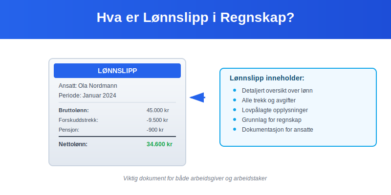
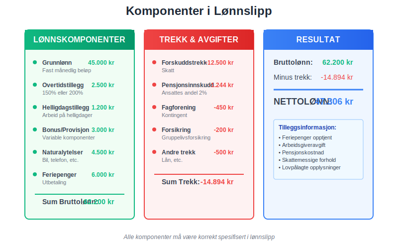
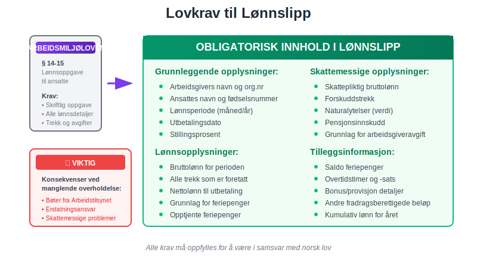
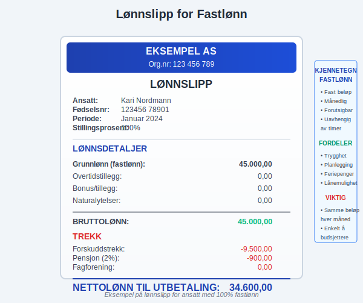
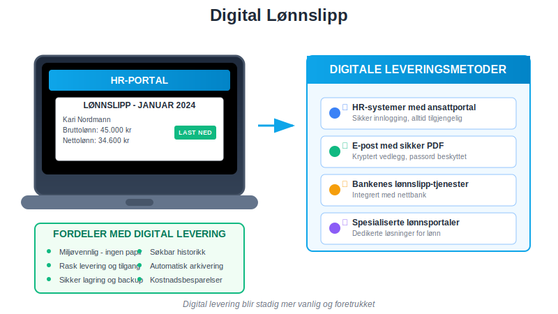
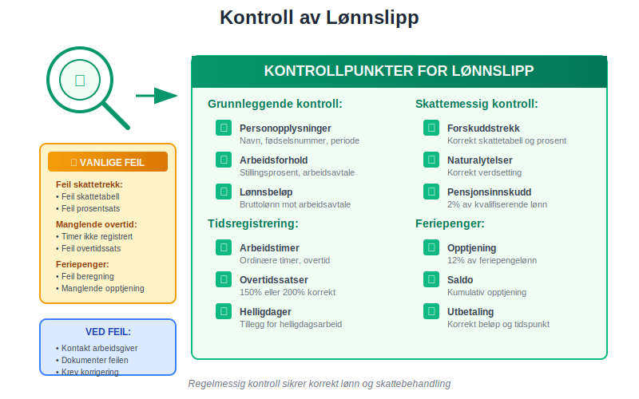
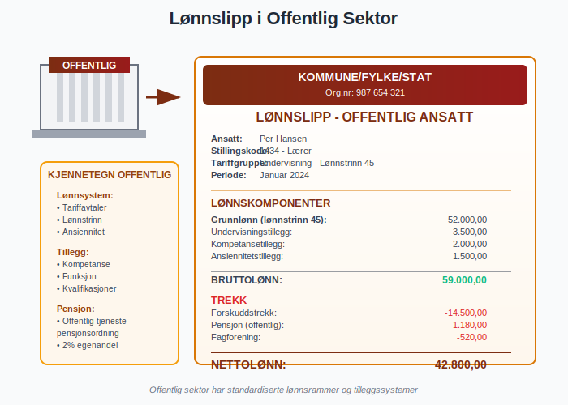
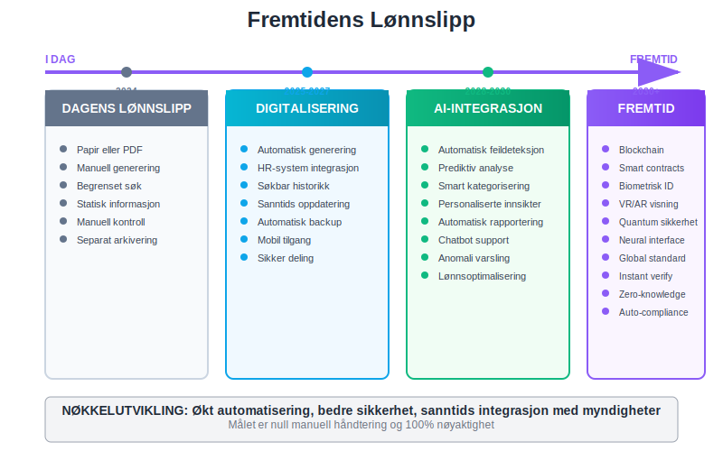

---
title: "Hva er Lønnslipp i Regnskap?"
meta_title: "Hva er Lønnslipp i Regnskap?"
meta_description: '**Lønnslipp** er en detaljert oversikt over lønn og trekk som alle arbeidsgivere i Norge er lovpålagt å gi til sine ansatte. Dette dokumentet, også kalt **...'
slug: hva-er-lonnslipp
type: blog
layout: pages/single
---

**Lønnslipp** er en detaljert oversikt over lønn og trekk som alle arbeidsgivere i Norge er lovpålagt å gi til sine ansatte. Dette dokumentet, også kalt **lønnsspecifikasjon**, viser en fullstendig oversikt over bruttolønn, forskuddstrekk, arbeidsgiveravgift og andre viktige lønnsopplysninger. Lønnslipp er et viktig dokument både for den ansatte og for regnskapsføringen i bedriften.
 
 Se [Hva er Lønn](/blogs/regnskap/hva-er-lonn "Hva er Lønn i Regnskap? Komplett Guide til Lønnsformer, Beregning og Regnskapsføring").



## Hva Inneholder et Lønnslipp?

Et lønnslipp må inneholde spesifikke opplysninger som er lovpålagt i henhold til **Arbeidsmiljøloven** og **Skatteloven**. Innholdet varierer avhengig av lønnsform, men følgende elementer er standard:

### Grunnleggende Opplysninger

* **Arbeidsgivers navn** og organisasjonsnummer
* **Ansattes navn** og fødselsnummer
* **Lønnsperiode** (måned/år)
* **Utbetalingsdato**
* **Stillingsprosent** og arbeidsforhold

### Lønnskomponenter



| Komponent | Beskrivelse | Eksempel |
|-----------|-------------|----------|
| **Grunnlønn** | [Fastlønn](/blogs/regnskap/hva-er-fastlonn "Hva er Fastlønn i Regnskap?") eller timelønn | 45.000 kr |
| **Overtidstillegg** | Betaling for overtidsarbeid | 2.500 kr |
| **Helligdagstillegg** | Tillegg for arbeid på [helligdager](/blogs/regnskap/helligdager-regnskap-bedriftseiere "Helligdager i Regnskap for Bedriftseiere") | 1.200 kr |
| **Bonus/Provisjon** | Variable lønnskomponenter, se [Skatt på bonus](/blogs/regnskap/skatt-pa-bonus "Skatt på bonus: Skatteregler for bonus i Norge") | 3.000 kr |
| **Naturalytelser** | Bil, telefon, etc. (skattepliktig verdi) | 4.500 kr |
| **Feriepenger** | [Feriepenger](/blogs/regnskap/hva-er-feriepenger "Hva er Feriepenger? Komplett Guide til Beregning og Utbetaling") utbetaling | 6.000 kr |

### Trekk og Avgifter

Lønnslipp viser også alle trekk som gjøres i lønnen:

* **Forskuddstrekk** - skatt som trekkes månedlig
* **Pensjonsinnskudd** - ansattes andel av pensjon
* **Fagforeningskontingent** - medlemskap i fagforening
* **Andre trekk** - lån, forsikringer, etc.

## Lovkrav til Lønnslipp

### Arbeidsmiljølovens Krav

I henhold til **Arbeidsmiljøloven § 14-15** skal arbeidsgiver gi den ansatte skriftlig oppgave over:



* **Bruttolønn** for lønnsperioden
* **Trekk** som er foretatt
* **Nettolønn** som utbetales
* **Grunnlag** for beregning av [feriepenger](/blogs/regnskap/hva-er-feriepenger "Hva er Feriepenger? Komplett Guide til Beregning og Utbetaling")
* **Opptjente feriepenger** i perioden
* **Saldo** for opptjente feriepenger

### Skattelovens Krav

Skatteloven stiller også krav til informasjon som må fremgå av lønnslipp:

* **Skattepliktig bruttolønn** inkludert naturalytelser
* **Forskuddstrekk** som er foretatt
* **Grunnlag** for arbeidsgiveravgift
* **Pensjonsinnskudd** og andre fradragsberettigede beløp

## Regnskapsmessig Behandling av Lønnslipp

### Bokføring av Lønnskostnader

Lønnslipp danner grunnlag for månedlig bokføring av lønnskostnader i bedriftens [regnskap](/blogs/regnskap/hva-er-regnskap "Hva er regnskap?"):

```
Debet: Lønnskostnad                    56.200 kr
Debet: Arbeidsgiveravgift               7.924 kr
Debet: Pensjonskostnad                  1.124 kr
    Kredit: Skyldig lønn                       50.000 kr
    Kredit: Skyldig forskuddstrekk             6.200 kr
    Kredit: Skyldig arbeidsgiveravgift         7.924 kr
    Kredit: Skyldig pensjon                    1.124 kr
```

### Ansattreskontro

All informasjon fra lønnslipp må registreres i den ansattes [ansattreskontro](/blogs/regnskap/hva-er-ansattreskontro "Hva er Ansattreskontro? En Guide til Ansattkontoer i Regnskap"):

* **Månedlig bruttolønn** og trekk
* **Kumulativ lønn** for året
* **Feriepenger** opptjening og saldo
* **Grunnlag** for årsoppgave og skattemelding

## Ulike Typer Lønnslipp

### Lønnslipp for Fastlønn

For ansatte med [fastlønn](/blogs/regnskap/hva-er-fastlonn "Hva er Fastlønn i Regnskap?") er lønnslipp relativt enkelt:



| Element | Beløp | Kommentar |
|---------|-------|-----------|
| **Grunnlønn** | 45.000 kr | Fast månedlig beløp |
| **Forskuddstrekk** | 9.500 kr | Basert på skattetabeller |
| **Pensjon (2%)** | 900 kr | Ansattes andel |
| **Nettolønn** | 34.600 kr | Til utbetaling |

### Lønnslipp for Timelønn

For timelønte vises detaljert oversikt over arbeidstimer:

* **Ordinære timer** × timesats
* **Overtidstimer** × overtidssats (150% eller 200%)
* **Helligdagstimer** × helligdagssats
* **Totalt antall timer** for perioden

### Lønnslipp for Akkordlønn

Ved [akkordlønn](/blogs/regnskap/hva-er-akkordlonn "Hva er Akkordlønn? En Guide til Prestasjonslønn") vises:

* **Produserte enheter** × enhetspris
* **Kvalitetstillegg** eller -fradrag
* **Garantilønn** hvis akkordsats ikke når minstenivå
* **Effektivitetsbonus** ved høy produksjon

## Digitale Lønnslipp

### Elektronisk Levering

Mange bedrifter leverer nå lønnslipp elektronisk gjennom:



* **HR-systemer** med ansattportal
* **E-post** med sikker PDF
* **Bankenes** lønnslipp-tjenester
* **Spesialiserte** lønnsportaler

### Krav til Digital Levering

Ved elektronisk levering må arbeidsgiver sikre:

* **Sikker** overføring og lagring
* **Tilgjengelighet** for den ansatte
* **Mulighet** til å skrive ut eller lagre
* **Samme informasjon** som papirbasert lønnslipp

## Lønnslipp og Skattemelding

### Grunnlag for Skattemelding

Lønnslipp danner grunnlag for:

* **Lønnsinntekt** i skattemeldingen
* **Forskuddstrekk** som er betalt
* **Pensjonsinnskudd** som fradrag
* **Reisefradrag** og andre kostnader

### Kontroll og Avstemming

Ansatte bør kontrollere lønnslipp mot:



* **Arbeidsavtale** og lønnsvilkår
* **Arbeidstimer** og overtid
* **Skattetrekk** og tabeller
* **Feriepenger** opptjening
* **Pensjonsgrunnlag** og innskudd

## Feil i Lønnslipp

### Vanlige Feil

De mest vanlige feilene i lønnslipp inkluderer:

| Feiltype | Beskrivelse | Konsekvens |
|----------|-------------|------------|
| **Feil skattetrekk** | Feil skattetabell eller prosent | Over-/underbetaling av skatt |
| **Manglende overtid** | Overtidstimer ikke registrert | Underbetaling av lønn |
| **Feil feriepenger** | Feil beregning av opptjening | Feil feriepengebeløp |
| **Naturalytelser** | Manglende eller feil verdsetting | Skattemessige konsekvenser |

### Håndtering av Feil

Ved oppdagelse av feil i lønnslipp:

* **Umiddelbar** korrigering i neste lønnslipp
* **Etterbetaling** eller tilbakebetaling
* **Korrigering** i [ansattreskontro](/blogs/regnskap/hva-er-ansattreskontro "Hva er Ansattreskontro? En Guide til Ansattkontoer i Regnskap")
* **Melding** til skattemyndighetene ved behov

## Oppbevaring av Lønnslipp

### For Arbeidsgiver

Arbeidsgivere må oppbevare lønnslipp og relaterte dokumenter:

* **Minimum 5 år** etter utløpet av regnskapsåret
* **Tilgjengelig** for kontroll av skattemyndighetene
* **Sikker lagring** med backup
* **Organisert** etter ansatt og periode

### For Arbeidstaker

Ansatte bør oppbevare lønnslipp for:

* **Skattemeldingen** og eventuelle endringer
* **Lånesøknader** og inntektsdokumentasjon
* **Pensjonsberegninger** og rettigheter
* **Arbeidsrettssaker** og tvister

## Lønnslipp i Ulike Bransjer

### Offentlig Sektor

I offentlig sektor har lønnslipp ofte:



* **Detaljert** stillingskoding
* **Tariffgruppe** og lønnstrinn
* **Pensjon** gjennom offentlige ordninger
* **Særskilte tillegg** for kvalifikasjoner

### Privat Sektor

Privat sektor kan ha mer variasjon:

* **Bonus** og provisjonsordninger
* **Aksjeopsjoner** og incentiver
* **Fleksible** goder og naturalytelser
* **Variabel** arbeidstime og overtid

## Internasjonale Forhold

### Utenlandske Arbeidstakere

For utenlandske ansatte må lønnslipp vise:

* **Skattetrekk** etter norske regler
* **Trygdeavgift** og medlemskap i [folketrygden](/blogs/regnskap/hva-er-folketrygden "Hva er Folketrygden? Komplett Guide til Norges Nasjonale Trygdesystem")
* **Særskilte fradrag** for utenlandske arbeidstakere
* **Valutaomregning** ved behov

### Norske Ansatte i Utlandet

Norske bedrifter med ansatte i utlandet må tilpasse lønnslipp til:

* **Lokale** skatteforhold
* **Dobbeltbeskatningsavtaler**
* **Valutasvingninger**
* **Sosiale ordninger** i arbeidsland

## Fremtidige Utviklinger

### Digitalisering

Lønnslipp blir stadig mer digitalisert:



* **Automatisert** generering fra HR-systemer
* **Integrert** med skattemyndighetenes systemer
* **Sanntids** oppdatering og tilgang
* **AI-basert** feildeteksjon og kvalitetssikring

### Regulatoriske Endringer

Kommende endringer kan påvirke lønnslipp:

* **Økt** digitalisering av rapportering
* **Nye** krav til transparens
* **Harmonisering** med EU-regelverk
* **Styrket** personvern og datasikkerhet

## Praktiske Tips

### For Arbeidsgivere

* **Implementer** gode rutiner for lønnslipp-generering
* **Kvalitetssikre** alle beregninger før utlevering
* **Opplær** ansatte i å lese og forstå lønnslipp
* **Ha** klare prosedyrer for feilhåndtering

### For Arbeidstakere

* **Les** lønnslipp nøye hver måned
* **Sammenlign** med arbeidsavtale og timeregistrering
* **Ta kontakt** ved uklarheter eller feil
* **Oppbevar** lønnslipp systematisk

## Konklusjon

Lønnslipp er et **fundamentalt dokument** i norsk arbeidsliv som sikrer transparens og korrekt behandling av lønn og trekk. For arbeidsgivere er det viktig å ha gode rutiner for generering og kvalitetssikring av lønnslipp, mens arbeidstakere bør være aktive i å kontrollere og forstå innholdet.

Korrekt håndtering av lønnslipp er essensielt for:

* **Overholdelse** av lovkrav
* **Korrekt** regnskapsføring og skatteinnbetaling
* **God** dialog mellom arbeidsgiver og arbeidstaker
* **Effektiv** administrasjon av lønns- og personalforhold

Ved å følge beste praksis for lønnslipp sikrer bedrifter både juridisk compliance og god personaladministrasjon, samtidig som ansatte får den transparens og dokumentasjon de har krav på.


