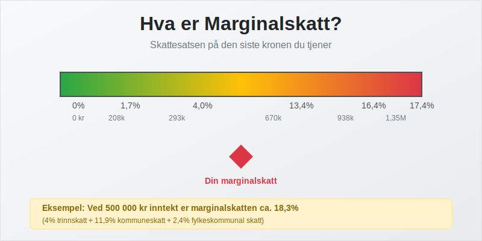
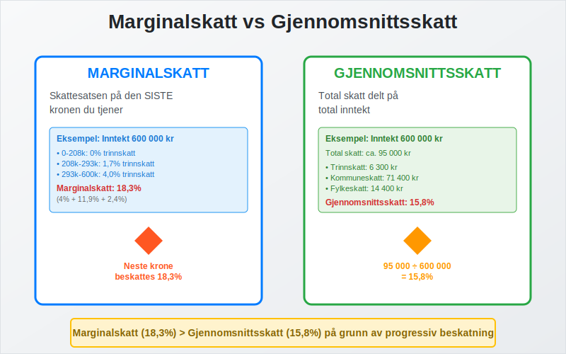
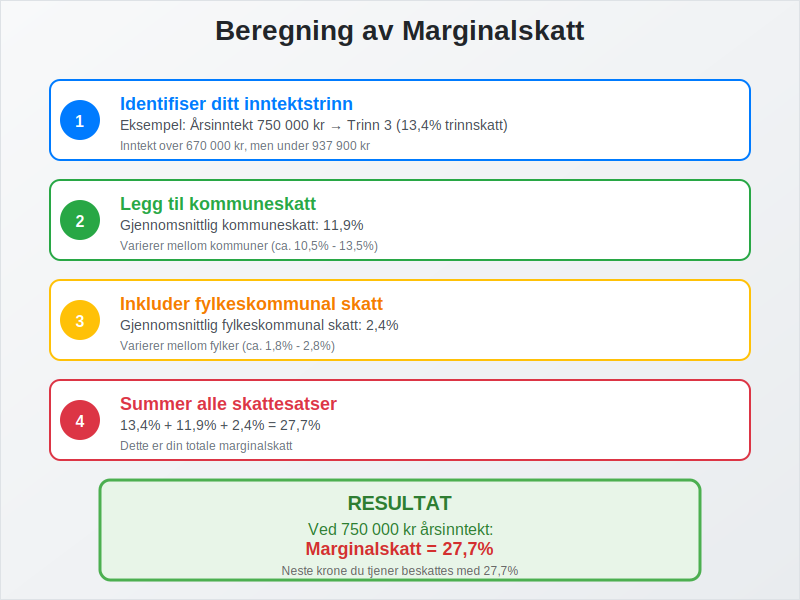
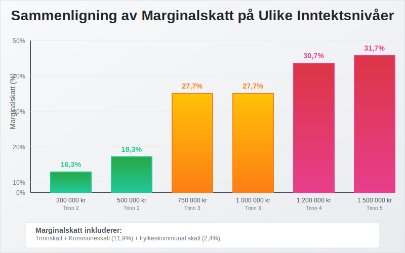
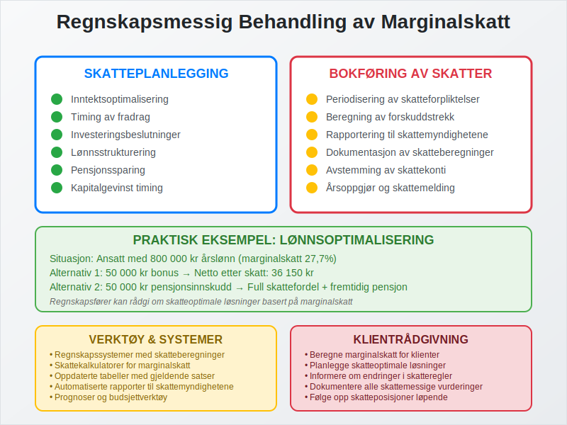
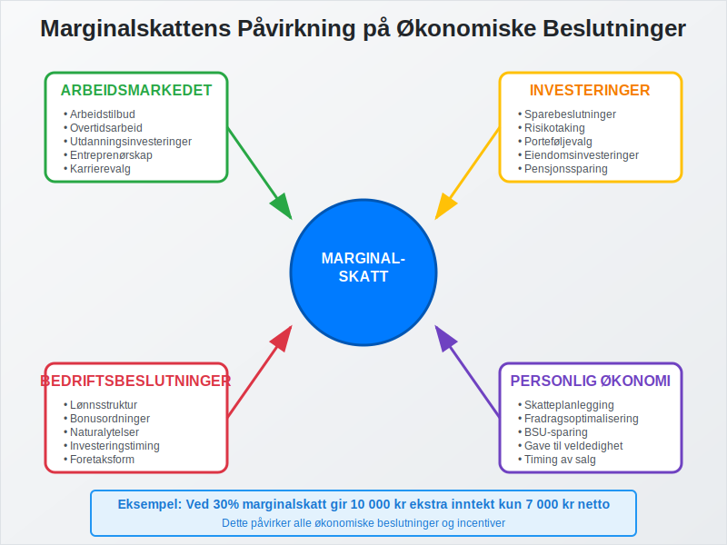
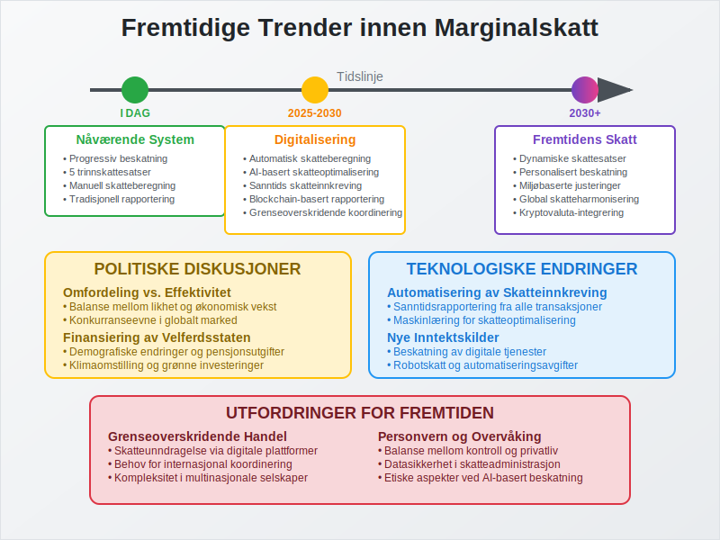
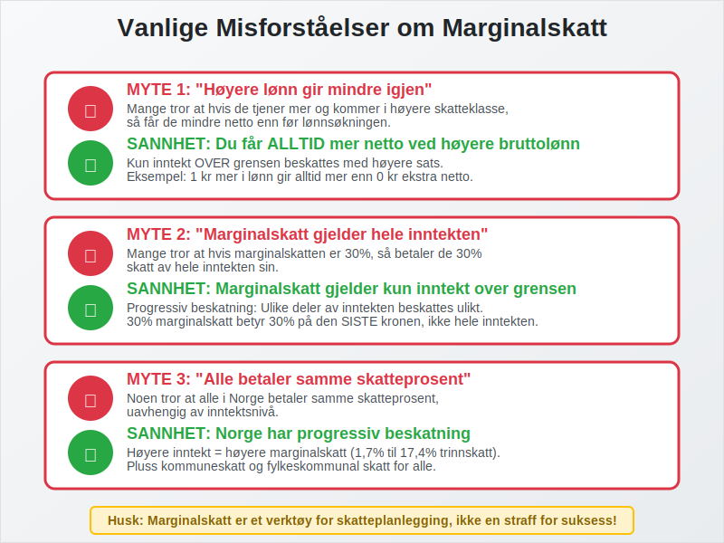

---
title: "Hva er Marginalskatt?"
seoTitle: "Hva er Marginalskatt?"
description: '**Marginalskatt** er den skattesatsen som gjelder for den siste kronen du tjener i inntekt. Dette er et sentralt begrep innen [regnskap](/blogs/regnskap/hva-er-...'
---

**Marginalskatt** er den skattesatsen som gjelder for den siste kronen du tjener i inntekt. Dette er et sentralt begrep innen [regnskap](/blogs/regnskap/hva-er-regnskap "Hva er Regnskap? Komplett Guide til Regnskapsføring") og skatteplanlegging som påvirker både privatpersoner og bedrifter i Norge.

Se også vår artikkel om [Toppskatt](/blogs/regnskap/toppskatt "Toppskatt “ Komplett guide til toppskatt i Norge") for mer om ekstra skattesatser på høye inntekter.

For en bredere oversikt over generelle skattesatser i Norge, se [Skattesats](/blogs/regnskap/skattesats "Skattesats: Oversikt over Norske Skattesatser").

## Definisjon av Marginalskatt

Marginalskatt refererer til den **prosentandelen** av den siste kronen du tjener som går til skatt. I Norge har vi et **progressivt skattesystem**, som betyr at skattesatsen øker med inntektsnivået.

### Forskjell mellom Marginalskatt og Gjennomsnittsskatt

Det er viktig å skille mellom:

* **Marginalskatt**: Skattesatsen på den siste kronen du tjener
* **Gjennomsnittsskatt**: Total skatt delt på total inntekt
* **Effektiv skattesats**: Den faktiske skatteprosenten du betaler

## Norges Skattesystem og Marginalskatt

Se også vår spesifikke artikkel om [Trinnskatt](/blogs/regnskap/trinnskatt "Trinnskatt “ Guide til trinnskatt i Norge") for en detaljert gjennomgang.

### Trinnvis Skattesystem

Norge opererer med et **trinnvis skattesystem** hvor ulike inntektsnivåer beskattes med forskjellige satser:

| Inntektstrinn | Skattesats | Gjelder for inntekt |
|---------------|------------|---------------------|
| **Trinn 1** | 1,7% | 208 051 - 292 850 kr |
| **Trinn 2** | 4,0% | 292 851 - 670 000 kr |
| **Trinn 3** | 13,4% | 670 001 - 937 900 kr |
| **Trinn 4** | 16,4% | 937 901 - 1 350 000 kr |
| **Trinn 5** | 17,4% | Over 1 350 000 kr |

*Satser for inntektsåret 2024*

### Beregning av Marginalskatt

For å beregne din marginalskatt må du:

1. **Identifisere** hvilket inntektstrinn du befinner deg på
2. **Legge til** kommuneskatt (gjennomsnitt 11,9%)
3. **Inkludere** fylkeskommunal skatt (gjennomsnitt 2,4%)
4. **Vurdere** andre skatter som [arbeidsgiveravgift](/blogs/regnskap/hva-er-arbeidsgiveravgift "Hva er Arbeidsgiveravgift? Komplett Guide til Beregning og Satser")

## Praktiske Eksempler på Marginalskatt

### Eksempel 1: Lønnsmottaker med 500 000 kr i årsinntekt

For en person med **500 000 kr** i årsinntekt:

* **Kommuneskatt**: 11,9% av hele inntekten
* **Fylkeskommunal skatt**: 2,4% av hele inntekten
* **Trinnskatt**: 4,0% (trinn 2) på inntekt over 292 850 kr
* **Total marginalskatt**: Cirka 18,3%

### Eksempel 2: Høyinntektstaker med 1 000 000 kr

For en person med **1 000 000 kr** i årsinntekt:

* **Kommuneskatt**: 11,9%
* **Fylkeskommunal skatt**: 2,4%
* **Trinnskatt**: 13,4% (trinn 3)
* **Total marginalskatt**: Cirka 27,7%

## Marginalskatt for Bedrifter

### Selskapsskatt

[Aksjeselskaper](/blogs/regnskap/hva-er-et-aksjeselskap "Hva er et Aksjeselskap (AS)? Komplett Guide til Selskapsformen") og andre [juridiske personer](/blogs/regnskap/hva-er-juridisk-person "Hva er en Juridisk Person? Komplett Guide til Juridiske Personer i Regnskap") betaler **flat selskapsskatt** på 22%.

### Personlige Foretak

[Enkeltpersonforetak](/blogs/regnskap/hva-er-enkeltpersonforetak "Hva er et Enkeltpersonforetak? Komplett Guide til Selskapsformen") beskattes som [personinntekt](/blogs/regnskap/personinntekt "Personinntekt “ Komplett guide til personinntekt i norsk regnskap") og følger samme marginalskattsystem som lønnsmottakere.

## Regnskapsmessige Konsekvenser

### Skatteplanlegging

Forståelse av marginalskatt er viktig for:

* **Inntektsoptimalisering**: Timing av inntekter og [fradrag](/blogs/regnskap/hva-er-fradrag "Hva er Fradrag? Komplett Guide til Skattefradrag i Norge")
* **Investeringsbeslutninger**: Vurdering av [avkastning](/blogs/regnskap/hva-er-avkastning "Hva er Avkastning? Komplett Guide til Avkastningsberegning") etter skatt
* **Lønnsstrukturering**: Optimalisering av [lønn](/blogs/regnskap/hva-er-lonn "Hva er Lønn? Komplett Guide til Lønnsbehandling i Regnskap") og naturalytelser

### Bokføring av Skatter

I regnskapet må bedrifter:

* **Periodisere** skatteforpliktelser
* **Beregne** [forskuddstrekk](/blogs/regnskap/hva-er-forskuddstrekk "Hva er Forskuddstrekk? Komplett Guide til Forskuddstrekk i Lønn")
* **Rapportere** korrekt til skattemyndighetene

## Strategier for Marginalskattoptimalisering

### For Privatpersoner

* **Pensjonssparing**: Reduserer skattbar inntekt
* **BSU-sparing**: Skattefradrag på innskudd
* **Gave til veldedighet**: Fradragsberettiget
* **Timing av salg**: Optimalisering av [kapitalgevinst](/blogs/regnskap/hva-er-kapitalgevinst "Hva er Kapitalgevinst? Komplett Guide til Beskatning av Kapitalgevinst")

### For Bedrifter

* **Investeringer**: Skattemessige [avskrivninger](/blogs/regnskap/hva-er-avskrivning "Hva er Avskrivning? Komplett Guide til Avskrivningsregler")
* **Kostnadsføring**: Timing av [kostnader](/blogs/regnskap/hva-er-kostnader "Hva er Kostnader? Komplett Guide til Kostnadstyper i Regnskap")
* **Strukturering**: Valg av [foretaksform](/blogs/regnskap/hva-er-foretak "Hva er et Foretak? Komplett Guide til Foretaksformer i Norge")

## Marginalskatt og Økonomiske Beslutninger

### Arbeidsmarkedet

Høy marginalskatt kan påvirke:

* **Arbeidstilbud**: Insentiver til å arbeide mer eller mindre
* **Utdanning**: Investeringer i kompetanse
* **Entreprenørskap**: Motivasjon for å starte egen virksomhet

### Investeringer

Marginalskatt påvirker:

* **Sparebeslutninger**: Avkastning etter skatt
* **Risikotaking**: Skattemessig behandling av tap og gevinst
* **Porteføljevalg**: Skatteeffektive investeringer

## Internasjonale Sammenligninger

### Nordiske Land

| Land | Høyeste marginalskatt | Terskel |
|------|----------------------|---------|
| **Norge** | ~47% | Høye inntekter |
| **Sverige** | ~57% | Høye inntekter |
| **Danmark** | ~56% | Høye inntekter |
| **Finland** | ~51% | Høye inntekter |

### Konkurranseevne

Norges marginalskattnivå påvirker:

* **Talentmobilitet**: Tiltrekking av høyt kvalifisert arbeidskraft
* **Investeringsklima**: Bedrifters lokaliseringsbeslutninger
* **Innovasjon**: Insentiver for forskning og utvikling

## Fremtidige Endringer og Reformer

### Politiske Diskusjoner

Marginalskatt er ofte tema i politiske debatter om:

* **Omfordeling**: Balanse mellom likhet og effektivitet
* **Vekst**: Skattenivåets påvirkning på økonomisk aktivitet
* **Velferd**: Finansiering av offentlige tjenester

### Teknologiske Endringer

Digitalisering påvirker:

* **Skatteinnkreving**: Automatisering og kontroll
* **Nye inntektskilder**: Beskatning av digitale tjenester
* **Grenseoverskridende handel**: Utfordringer for skattesystemet

## Praktiske Råd for Regnskapsførere

### Klientrådgivning

Som regnskapsfører bør du:

* **Beregne** marginalskatt for klienter
* **Planlegge** skatteoptimale løsninger
* **Informere** om endringer i skatteregler
* **Dokumentere** alle skattemessige vurderinger

### Verktøy og Systemer

Bruk av:

* **Regnskapssystemer** med skatteberegninger
* **Skattekalkulatorer** for marginalskattberegning
* **Oppdaterte tabeller** med gjeldende satser
* **Automatiserte rapporter** til skattemyndighetene

## Vanlige Misforståelser

### Myte 1: "Høyere lønn gir mindre igjen"

**Sannhet**: Du får alltid mer netto ved høyere bruttolønn, selv med høyere marginalskatt.

### Myte 2: "Marginalskatt gjelder hele inntekten"

**Sannhet**: Marginalskatt gjelder kun inntekt over grensen for hvert trinn.

### Myte 3: "Alle betaler samme skatteprosent"

**Sannhet**: Norge har progressiv beskatning med økende satser.

## Konklusjon

Marginalskatt er et **fundamentalt konsept** i norsk skatterett som påvirker både privatpersoner og bedrifter. Forståelse av marginalskatt er essensielt for:

* **Skatteplanlegging** og optimalisering
* **Økonomiske beslutninger** og investeringer  
* **Regnskapsmessig behandling** av skatter
* **Strategisk rådgivning** til klienter

Som regnskapsfører er det viktig å holde seg oppdatert på endringer i skattesatsene og hjelpe klienter med å forstå hvordan marginalskatt påvirker deres økonomi.

Ved å mestre marginalskattberegninger kan du gi verdifull rådgivning som optimaliserer klientenes skatteposisjon innenfor gjeldende regelverk.

