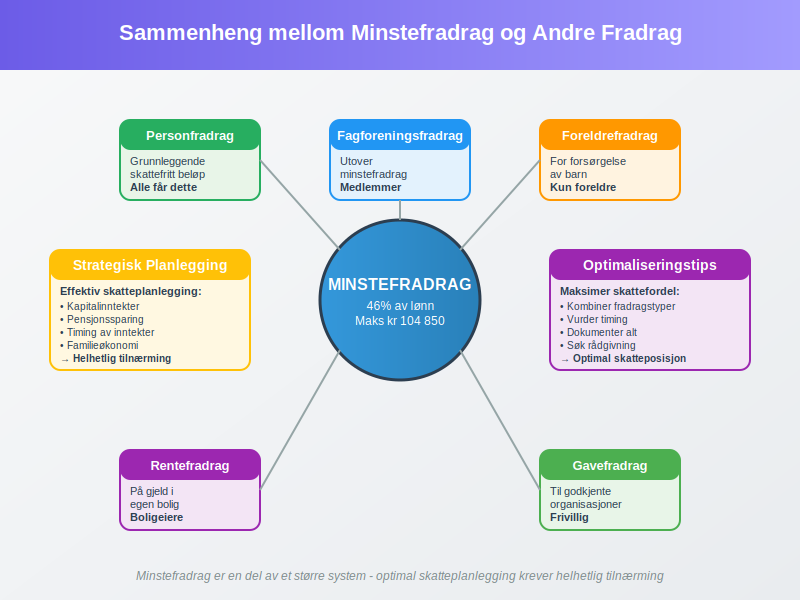

**Minstefradrag** er et standardisert [fradrag](/blogs/regnskap/hva-er-fradrag "Hva er Fradrag i Regnskap? Komplett Guide til Skattefradrag og Regnskapsføring") som alle lønnstakere og pensjonister i Norge automatisk får i sin [selvangivelse](/blogs/regnskap/hva-er-egenmelding "Hva er Egenmelding? Komplett Guide til Selvangivelse og Skattemelding"). Dette fradraget skal dekke de vanligste utgiftene knyttet til arbeid og inntektserverv, og utgjør en viktig del av det norske skattesystemet.

For en komplett gjennomgang av **personfradrag**, se [Personfradrag](/blogs/regnskap/personfradrag "Personfradrag i Norge: Alt du trenger å vite").
## Hva er Minstefradrag?

Minstefradrag er et **fast beløp** som trekkes fra bruttoinntekten før skatt beregnes. Det er innført for å forenkle skattesystemet og sikre at alle får dekket grunnleggende kostnader knyttet til arbeid uten å måtte dokumentere hver enkelt utgift.

### Formålet med Minstefradrag

Minstefradragets hovedformål er å:

* **Forenkle** skatteberegningen for vanlige lønnstakere
* **Dekke** standardkostnader knyttet til arbeid
* **Redusere** behovet for detaljert dokumentasjon av mindre arbeidsrelaterte utgifter
* **Sikre** rettferdig behandling av alle skattytere

## Gjeldende Satser for Minstefradrag 2024

Minstefradragssatsene justeres årlig og varierer basert på inntektstype og -nivå. Tabellen nedenfor viser gjeldende satser for 2024:

| Inntektstype | Minstefradrag | Maksimalt beløp | Merknad |
|--------------|---------------|-----------------|---------|
| **Lønnsinntekt** | 46% | kr 104 850 | Gjelder ordinær lønn |
| **Pensjonsinntekt** | 31% | kr 90 800 | Alderspensjon, uførepensjon |
| **Næringsinntekt** | 25% | kr 69 700 | Kun for visse typer næring |
| **Sjømannsfradrag** | 30% | kr 83 000 | Spesialordning for sjøfolk |

### Beregningseksempler

**Eksempel 1: Vanlig lønnstaker**
En person med årslønn på kr 500 000 får minstefradrag på:
- 46% av kr 500 000 = kr 230 000
- Begrenset til maksimalt kr 104 850
- **Faktisk minstefradrag: kr 104 850**

**Eksempel 2: Pensjonist**
En pensjonist med årlig pensjon på kr 300 000 får:
- 31% av kr 300 000 = kr 93 000
- Begrenset til maksimalt kr 90 800
- **Faktisk minstefradrag: kr 90 800**

## Hvem har Rett til Minstefradrag?

Minstefradrag gis automatisk til alle som har **skattepliktig inntekt** i Norge, men størrelsen varierer basert på inntektstype og personlige forhold.

### Kategorier som får Minstefradrag

* **Lønnstakere** - alle med [lønnsinntekt](/blogs/regnskap/hva-er-lonn "Hva er Lønn? Komplett Guide til Lønnsberegning og Lønnsadministrasjon")
* **Pensjonister** - mottakere av alderspensjon og uførepensjon
* **Selvstendig næringsdrivende** - med visse begrensninger
* **Frilansere** - som rapporterer inntekt som lønn
* **Studenter** - med deltids- eller feriejobb

### Spesielle Regler

Enkelte grupper har **spesielle regler** for minstefradrag:

* **Sjøfolk** får høyere satser gjennom sjømannsfradraget
* **Fiskere** har egne regler for næringsfradrag
* **Utenlandske arbeidstakere** kan ha begrensninger
* **Deltidsansatte** får forholdsmessig fradrag

## Minstefradrag vs. Faktiske Utgifter

En viktig beslutning mange skattytere må ta er om de skal benytte minstefradrag eller dokumentere **faktiske utgifter**. Dette valget kan ha betydelig økonomisk konsekvens.

### Når Lønner det seg med Faktiske Utgifter?

Det kan være lønnsomt å velge faktiske utgifter når:

* **Reisekostnader** til arbeid overstiger minstefradrag
* **Hjemmekontor**-utgifter er betydelige
* **Faglige kurs** og utdanning koster mye
* **Arbeidsklær** og verktøy er dyrt
* **Fagforeningskontingent** og yrkeslitteratur summerer seg

### Sammenligning av Alternativer

| Utgiftstype | Minstefradrag | Faktiske utgifter | Anbefaling |
|-------------|---------------|-------------------|------------|
| **Lav reiseavstand** | kr 104 850 | kr 30 000 | Bruk minstefradrag |
| **Lang reiseavstand** | kr 104 850 | kr 150 000 | Bruk faktiske utgifter |
| **Hjemmekontor** | kr 104 850 | kr 120 000 | Bruk faktiske utgifter |
| **Vanlig kontorjobb** | kr 104 850 | kr 80 000 | Bruk minstefradrag |

## Dokumentasjon og Rapportering

Selv om minstefradrag gis automatisk, er det viktig å forstå hvordan det rapporteres og dokumenteres i [selvangivelsen](/blogs/regnskap/hva-er-egenmelding "Hva er Egenmelding? Komplett Guide til Selvangivelse og Skattemelding").

### Automatisk Utfylling

Skatteetaten fyller automatisk ut minstefradrag basert på:

* **Opplysninger fra arbeidsgivere** via [a-meldingen](/blogs/regnskap/hva-er-a-melding "Hva er A-melding? Komplett Guide til Rapportering og Innlevering")
* **Pensjonsutbetalinger** fra NAV og private ordninger
* **Tidligere års oppgaver** og registrerte forhold

### Kontroll og Endringer

Skattytere bør alltid **kontrollere** at:

* Minstefradrag er korrekt beregnet
* Alle inntektskilder er inkludert
* Spesielle forhold er hensyntatt
* Valg mellom minstefradrag og faktiske utgifter er optimalt

## Minstefradrag for Ulike Inntektstyper

Forskjellige inntektstyper har ulike regler for minstefradrag, noe som gjenspeiler de forskjellige kostnadene knyttet til ulike former for inntektserverv.

### Lønnsinntekt

For [lønnsinntekt](/blogs/regnskap/hva-er-lonn "Hva er Lønn? Komplett Guide til Lønnsberegning og Lønnsadministrasjon") gjelder den høyeste satsen på **46%** opp til maksimalt kr 104 850. Dette skal dekke:

* Transport til og fra arbeid
* Arbeidsklær og verktøy
* Fagforeningskontingent
* Yrkeslitteratur og kurs
* Andre arbeidsrelaterte utgifter

### Pensjonsinntekt

Pensjonister får **31%** i minstefradrag, maksimalt kr 90 800. Den lavere satsen reflekterer at pensjonister har færre arbeidsrelaterte utgifter.

### Næringsinntekt

For [næringsinntekt](/blogs/regnskap/hva-er-enkeltpersonforetak "Hva er Enkeltpersonforetak? Komplett Guide til ENK og Selvstendig Næringsdrivende") er minstefradraget begrenset til **25%**, maksimalt kr 69 700. Dette gjelder kun visse typer næring og har strenge vilkår.

## Historisk Utvikling av Minstefradrag

Minstefradrag har gjennomgått betydelige endringer siden innføringen, både i satser og struktur.

### Viktige Milepæler

| År | Endring | Betydning |
|----|---------|-----------|
| **1975** | Innføring av minstefradrag | Forenkling av skattesystemet |
| **1992** | Økning til 40% for lønn | Bedre dekning av reelle kostnader |
| **2006** | Innføring av maksimalbeløp | Begrensning av fradrag for høye inntekter |
| **2019** | Økning til 46% for lønn | Kompensasjon for økte transportkostnader |
| **2024** | Justering av maksimalbeløp | Inflasjonsjustering |

## Internasjonale Sammenligninger

Norge har et relativt sjenerøst minstefradragssystem sammenlignet med andre land.

### Sammenligning med Naboland

| Land | Minstefradrag | Maksimalt beløp | Kommentar |
|------|---------------|-----------------|-----------|
| **Norge** | 46% (lønn) | kr 104 850 | Høyest i Norden |
| **Sverige** | Fast beløp | SEK 13 540 | Lavere nivå |
| **Danmark** | 5,1% | DKK 25 900 | Betydelig lavere |
| **Finland** | Fast beløp | EUR 750 | Svært begrenset |

## Praktiske Tips og Råd

For å optimalisere skattefordelen av minstefradrag, bør skattytere vurdere følgende:

### Optimalisering av Fradrag

* **Beregn** både minstefradrag og faktiske utgifter
* **Dokumenter** alle arbeidsrelaterte kostnader
* **Vurder** kombinasjoner av ulike fradragstyper
* **Planlegg** større utgifter strategisk
* **Søk** profesjonell rådgivning ved komplekse forhold

### Vanlige Feil å Unngå

* **Ikke kontrollere** automatisk utfylte opplysninger
* **Glemme** å vurdere faktiske utgifter
* **Manglende dokumentasjon** av spesielle forhold
* **Ikke oppdatere** endringer i arbeidsforhold
* **Overse** spesialordninger man har rett til

## Fremtidige Endringer og Utviklingstrekk

Minstefradragssystemet er under kontinuerlig vurdering og kan endres basert på samfunnsutvikling og politiske prioriteringer.

### Forventede Utviklingstrekk

* **Digitalisering** av dokumentasjon og rapportering
* **Automatisering** av fradragsberegninger
* **Tilpasning** til nye arbeidsformer som hjemmekontor
* **Miljøhensyn** i transportfradrag
* **Forenkling** av regelverk

## Sammenheng med Andre Fradrag

Minstefradrag må sees i sammenheng med andre [fradrag](/blogs/regnskap/hva-er-fradrag "Hva er Fradrag i Regnskap? Komplett Guide til Skattefradrag og Regnskapsføring") i skattesystemet for optimal skatteplanlegging.

### Komplementære Fradrag

* **[Personfradrag](/blogs/regnskap/hva-er-grunnbelop "Hva er Grunnbeløp? Komplett Guide til G-regulering og Beregning")** - grunnleggende skattefritt beløp
* **Foreldrefradrag** - for forsørgelse av barn
* **RenteFradrag** - på gjeld i egen bolig
* **Gavefradrag** - til godkjente organisasjoner
* **Fagforeningsfradrag** - utover minstefradrag

### Strategisk Planlegging

Effektiv skatteplanlegging krever forståelse av hvordan minstefradrag samvirker med:

* **[Kapitalinntekter](/blogs/regnskap/hva-er-kapital "Hva er Kapital? Komplett Guide til Kapitaltyper og Kapitalforvaltning")** og deres beskatning
* **[Pensjonssparing](/blogs/regnskap/hva-er-finanskapital "Hva er Finanskapital? Komplett Guide til Finansielle Eiendeler og Investeringer")** og skattefordeler
* **Timing** av inntekter og utgifter
* **Familieøkonomi** og inntektsfordeling

## Konklusjon

Minstefradrag er en **fundamental del** av det norske skattesystemet som sikrer at alle skattytere får dekket grunnleggende kostnader knyttet til inntektserverv. Med en sats på 46% for lønnsinntekt, opptil kr 104 850, representerer det en betydelig skattefordel for de fleste nordmenn.

For å maksimere skattefordelen er det viktig å:

* **Forstå** hvordan minstefradrag beregnes
* **Sammenligne** med faktiske utgifter
* **Dokumentere** alle relevante kostnader
* **Planlegge** strategisk for optimal skatteposisjon

Ved å ha god kunnskap om minstefradrag og dets sammenheng med andre deler av skattesystemet, kan skattytere sikre at de får maksimal nytte av de fradragene de har rett til.

