---
title: "Hva er Moms? Komplett Guide til Merverdiavgift (MVA) i Norge"
seoTitle: "Moms (MVA) | Satser, regler og rapportering i Norge"
description: "Merverdiavgift (MVA), også kalt moms, er en avgift på salg av varer og tjenester. Se satser, registrering, MVA-melding og praktiske rutiner for korrekt håndtering."
summary: "Hva moms (MVA) er, hvilke satser som gjelder og hvordan norske virksomheter registrerer, beregner og rapporterer merverdiavgift."
---

**Merverdiavgift (MVA)**, også kjent som **moms**, er en indirekte avgift som pålegges salg av varer og tjenester i Norge. MVA er en av de viktigste inntektskildene for staten og utgjør en betydelig del av de totale skatteinntektene.

For en mer utfyllende guide, se [Merverdiavgift: Komplett Guide til MVA i Norge](/blogs/regnskap/merverdiavgift "Merverdiavgift: Komplett Guide til MVA i Norge").

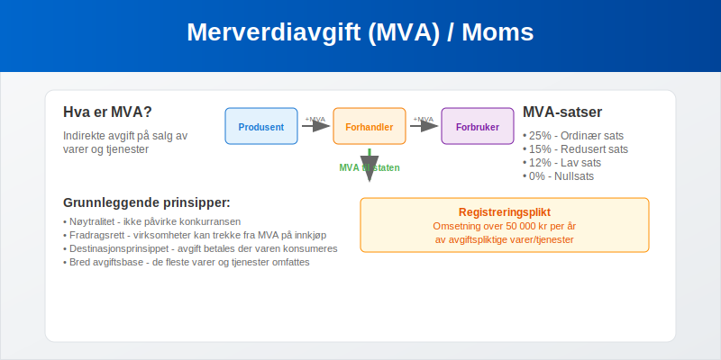

## Hva er Merverdiavgift?

**Merverdiavgift (MVA)** er en avgift som pålegges på hvert ledd i omsetningskjeden, fra produsent til sluttforbruker. Avgiften beregnes som en prosentandel av salgsprisen og betales av forbrukeren, men innkreves av virksomhetene som selger varene eller tjenestene.

For detaljert informasjon om **B2C-transaksjoner** og deres spesifikke MVA-behandling, se [Hva er B2C? Business-to-Consumer i Regnskap](/blogs/regnskap/hva-er-b2c "Hva er B2C? Business-to-Consumer i Regnskap") og for MVA-behandling i B2B-transaksjoner, se [Hva er B2B? Business-to-Business i Regnskap](/blogs/regnskap/hva-er-b2b "Hva er B2B? Business-to-Business i Regnskap").

### Grunnleggende Prinsipper

MVA-systemet bygger på følgende prinsipper:

* **Nøytralitet** - avgiften skal ikke påvirke konkurransen mellom virksomheter
* **Fradragsrett** - virksomheter kan trekke fra MVA de har betalt på innkjøp
* **Destinasjonsprinsippet** - avgiften betales der varen eller tjenesten konsumeres
* **Bred avgiftsbase** - de fleste varer og tjenester omfattes av avgiftsplikten

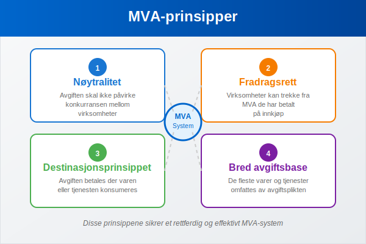

## MVA-satser i Norge

Norge har flere ulike MVA-satser avhengig av type vare eller tjeneste:

### Ordinær MVA-sats (25%)

Den **ordinære MVA-satsen** på 25% gjelder for de fleste varer og tjenester, inkludert:

* Klær og sko
* Elektronikk og hvitevarer
* Møbler og innredning
* Restauranttjenester
* Frisørtjenester
* Reparasjonstjenester

### Redusert MVA-sats (15%)

**Redusert sats** på 15% gjelder for:

* **Næringsmidler** (mat og drikke for mennesker) “ se [Moms på mat](/blogs/regnskap/moms-paa-mat "Moms på mat: Alt du trenger å vite om MVA på mat og drikke")
* **Overnatting** på hotell, pensjonat og lignende
* **Persontransport** med rutebil, båt, tog og fly
* **Kino** og andre kulturarrangementer

### Lav MVA-sats (12%)

**Lav sats** på 12% gjelder for:

* **Aviser, tidsskrifter og bøker**
* **Kringkasting** (TV- og radiolisenser)

### Nullsats (0%)

**Nullsats** gjelder for:

* **Eksport** av varer og tjenester
* **Skipsfart** i utenriksfart
* **Luftfart** i utenriksfart

| MVA-sats | Prosent | Eksempler |
|----------|---------|-----------|
| **Ordinær sats** | 25% | Klær, elektronikk, restauranter |
| **Redusert sats** | 15% | Mat, overnatting, transport |
| **Lav sats** | 12% | Bøker, aviser, kringkasting |
| **Nullsats** | 0% | Eksport, utenriksfart |

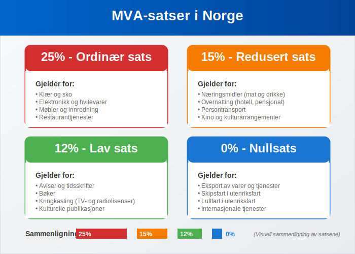

For en dyptgående forklaring av hvordan MVA-satser varierer mellom ulike næringer og bransjer, samt bransjespecifikke MVA-regler og rapporteringskrav, se vår omfattende guide til [næringsspesifikasjon](/blogs/regnskap/naringsspesifikasjon "Hva er Næringsspesifikasjon? Komplett Guide til Næringsklassifisering og Rapportering").

## MVA-fritak

Enkelte varer og tjenester er **fritatt for MVA**:

### Finansielle Tjenester
* Bank- og forsikringstjenester
* Verdipapirhandel
* Valutaveksling
* Kredittformidling

### Helse- og Sosialtjenester
* Legetjenester og tannlegetjenester
* Fysioterapi og kiropraktikk
* Sykehustjenester
* Pleie- og omsorgstjenester

### Undervisning
* Grunnskole og videregående skole
* Høyere utdanning
* Kursvirksomhet som leder til offentlig godkjent eksamen

### Eiendomsomsetning
* Salg av fast eiendom (med unntak for nye boliger)
* Utleie av fast eiendom til boligformål
* Utleie av lokaler til fritaksberettigede virksomheter

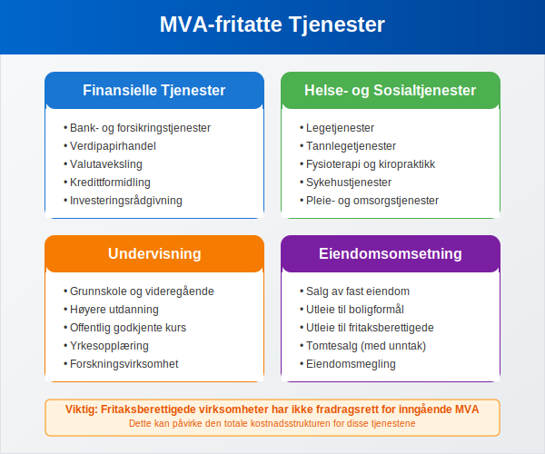

## Registreringsplikt for MVA

### Når må virksomheter registrere seg?

[Foretak](/blogs/regnskap/hva-er-foretak "Hva er et Foretak? Komplett Guide til Foretaksformer i Norge") må registrere seg i **MVA-registeret** når:

* **[Omsetning](/blogs/regnskap/hva-er-omsetning "Hva er Omsetning? Komplett Guide til Omsetning i Regnskap og Skatt")** av avgiftspliktige varer/tjenester overstiger **50 000 kr** per år
* Virksomheten driver med **avgiftspliktig aktivitet** uavhengig av omsetning
* **Import** av varer til Norge
* **Fjernsalg** til Norge fra utlandet overstiger 50 000 kr

### Frivillig Registrering

Virksomheter kan også **frivillig registrere seg** for MVA selv om de ikke når grensen på 50 000 kr. Dette kan være fordelaktig for:

* Å få **fradragsrett** for MVA på innkjøp
* Å fremstå som **profesjonell** overfor kunder
* Å **forenkle** regnskapsføringen

### Registreringsprosess

1. **Søknad** sendes til Skatteetaten via Altinn
2. **Dokumentasjon** av virksomhetens aktivitet
3. **Organisasjonsnummer** må være registrert først
4. **Godkjenning** gis normalt innen få dager

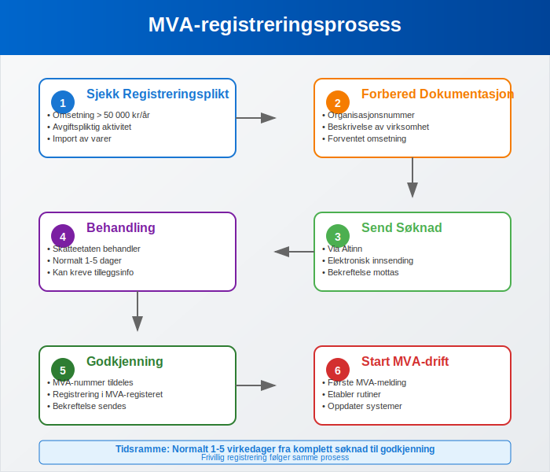

## MVA-oppgjør og Rapportering

For en komplett guide til alle aspekter ved [momsregnskap](/blogs/regnskap/momsregnskap "Momsregnskap - Komplett Guide til MVA-regnskapsføring"), inkludert bokføring, kontoplan, avstemming og praktiske rutiner, se vår detaljerte artikkel om MVA-regnskapsføring.

### Terminer for MVA-oppgjør

MVA-pliktige virksomheter må levere **MVA-melding** og betale MVA til fastsatte terminer:

#### Månedlige Terminer
For virksomheter med **årlig omsetning over 5 millioner kr**:

* Frist for innsending: **10. dag** i måneden etter terminen
* Frist for betaling: **15. dag** i måneden etter terminen

#### Tomånedlige Terminer
For virksomheter med **årlig omsetning mellom 1-5 millioner kr**:

* Terminer: januar-februar, mars-april, mai-juni, etc.
* Frist for innsending: **10. dag** i måneden etter terminen
* Frist for betaling: **15. dag** i måneden etter terminen

#### Seks-måneders Terminer
For virksomheter med **årlig omsetning under 1 million kr**:

* Terminer: januar-juni og juli-desember
* Frist for innsending: **10. dag** i måneden etter terminen
* Frist for betaling: **15. dag** i måneden etter terminen

| Omsetning per år | Terminlengde | Innleveringsfrist | Betalingsfrist |
|------------------|--------------|-------------------|----------------|
| **Over 5 mill. kr** | Månedlig | 10. dag | 15. dag |
| **1-5 mill. kr** | To måneder | 10. dag | 15. dag |
| **Under 1 mill. kr** | Seks måneder | 10. dag | 15. dag |

### MVA-melding

**MVA-meldingen** skal inneholde:

* **Utgående MVA** - MVA på salg til kunder
* **Inngående MVA** - MVA på innkjøp som kan trekkes fra (se [Konto 2710 - Inngående merverdiavgift](/blogs/kontoplan/2710-inngaaende-merverdiavgift "Konto 2710 - Inngående merverdiavgift"))
* **MVA til betaling** eller **til gode** - differansen mellom utgående og inngående MVA
* **Spesifikasjoner** av omsetning per MVA-sats

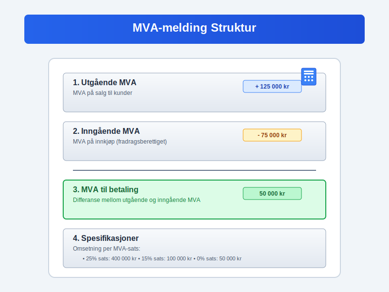

## Fradragsrett for MVA

### Generell Fradragsrett

Virksomheter som er registrert for MVA har **fradragsrett** for MVA betalt på:

* **Varer og tjenester** som brukes i den avgiftspliktige virksomheten
* **Driftsmidler** som maskiner, utstyr og inventar
* **Tjenester** som regnskap, juridisk bistand og markedsføring
* **Drivstoff** til firmabiler

### Begrensninger i Fradragsrett

**Ingen fradragsrett** for MVA på:

* **Representasjon** - underholdning av kunder og forretningsforbindelser
* **Gaver** over 500 kr per mottaker per år
* **Firmabiler** til privatbruk (50% fradrag ved blandet bruk)
* **Innkjøp til fritaksberettiget virksomhet**

### Delvis Fradragsrett

Virksomheter som driver både **avgiftspliktig** og **fritaksberettiget** virksomhet har **delvis fradragsrett**:

* Fradragsrett beregnes som **andel avgiftspliktig omsetning** av total omsetning
* **Sektorinndeling** kan brukes for å skille aktivitetene
* **Direkte henførbare kostnader** gir full fradragsrett

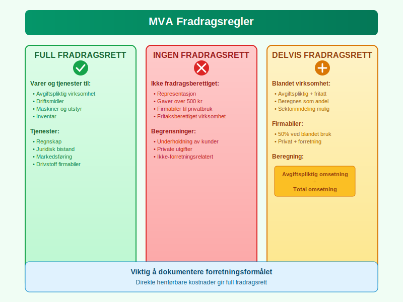

## MVA ved Import og Eksport

### Import til Norge

Ved **import av varer** til Norge:

* **Importmva** beregnes ved innførsel
* Avgiften betales til **Tolletaten**
* **Fradragsrett** for registrerte virksomheter
* **Særlige regler** for tjenester fra utlandet, inkludert [omvendt avgiftsplikt](/blogs/regnskap/omvendt-avgiftsplikt "Omvendt Avgiftsplikt - Komplett Guide til Reverse Charge MVA")

### Eksport fra Norge

Ved **eksport av varer** fra Norge:

* **Nullsats** (0% MVA) på eksporterte varer
* **Dokumentasjonskrav** for å dokumentere eksport
* **Fradragsrett** for kostnader knyttet til eksporten
* **Særlige regler** for tjenester til utlandet, se [omvendt avgiftsplikt](/blogs/regnskap/omvendt-avgiftsplikt "Omvendt Avgiftsplikt - Komplett Guide til Reverse Charge MVA")

### EU/EØS-handel

**Handel med EU/EØS-land** har særlige regler:

* **Erverv** fra EU/EØS behandles som import
* **Levering** til EU/EØS behandles som eksport
* **Registreringsplikt** i VOEC-registeret for fjernsalg
* **Terskelverdier** for registreringsplikt i andre land

I **[B2B-transaksjoner](/blogs/regnskap/hva-er-b2b "Hva er B2B? Komplett Guide til Business-to-Business i Norsk Regnskap")** med EU/EØS gjelder ofte omvendt avgiftsplikt, hvor kjøperen beregner og innbetaler MVA i sitt eget land, mens selgeren fakturerer uten MVA.

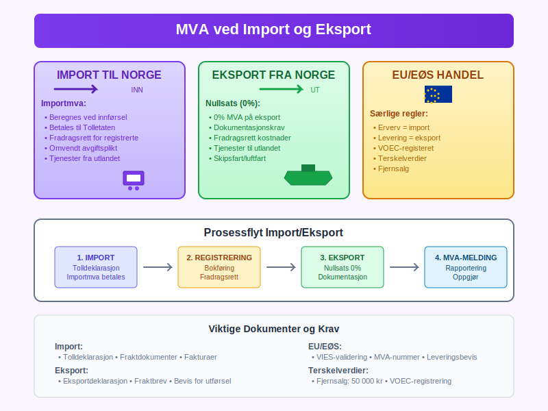

## Kontroll og Sanksjoner

### Skatteetatens Kontroll

**Skatteetaten** fører kontroll med MVA-pliktige virksomheter gjennom:

* **Bokettersyn** - gjennomgang av [regnskap](/blogs/regnskap/hva-er-regnskap "Hva er Regnskap? En komplett guide") og [bilag](/blogs/regnskap/hva-er-bilag "Hva er Bilag i Regnskap? Komplett Guide til Bilagstyper og Krav")
* **Stedlig kontroll** - besøk på virksomhetens lokaler
* **Tverrkontroll** - sammenligning med andre datakilder
* **Risikobasert utvelgelse** - fokus på høyrisikovirksomheter

### Sanksjoner ved Regelbrudd

**Brudd på MVA-reglene** kan medføre:

#### Tilleggsskatt
* **20%** ved uaktsom overtredelse
* **60%** ved grov uaktsom eller forsettlig overtredelse

#### Forsinkelsesrente
* **Månedlig rente** på forfalte beløp
* Beregnes fra **forfallsdato** til betaling skjer

#### Gebyr
* **Gebyr** for for sen innlevering av MVA-melding
* **Purregebyr** ved manglende betaling

#### Straff
* **Bøter** ved grove overtredelser
* **Fengsel** i særlig alvorlige tilfeller

| Type overtredelse | Sanksjon | Prosentsats |
|-------------------|----------|-------------|
| **Uaktsom** | Tilleggsskatt | 20% |
| **Grov uaktsom/forsettlig** | Tilleggsskatt | 60% |
| **For sen betaling** | Forsinkelsesrente | Månedlig |
| **For sen melding** | Gebyr | Fast beløp |

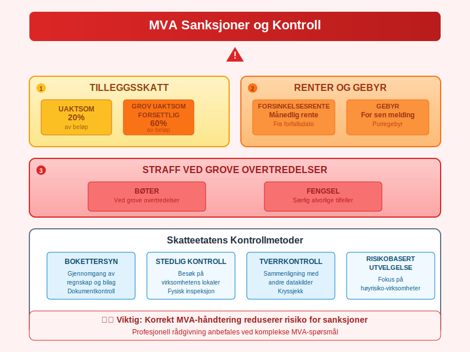

## MVA og Regnskapsføring

### Bokføring av MVA

**MVA skal bokføres** korrekt i virksomhetens [regnskap](/blogs/regnskap/hva-er-regnskap "Hva er Regnskap? En komplett guide"):

#### Utgående MVA (Salg)
* **Debet**: [Kundefordringer](/blogs/regnskap/hva-er-kundefordring "Hva er Kundefordring? Komplett Guide til Kundefordringer i Regnskap") (inkl. MVA)
* **Kredit**: Salgsinntekt (eks. MVA)
* **Kredit**: Utgående MVA (se [Konto 1600 - Utgående merverdiavgift](/blogs/kontoplan/1600-utgaende-merverdiavgift "Konto 1600 - Utgående merverdiavgift"))

#### Inngående MVA (Innkjøp)
* **Debet**: Innkjøp/kostnad (eks. MVA)
* **Debet**: Inngående MVA
* **Kredit**: [Leverandørgjeld](/blogs/regnskap/hva-er-leverandorgjeld "Hva er Leverandørgjeld? Komplett Guide til Leverandørgjeld i Regnskap") (inkl. MVA)

### Kontoplan for MVA

Standard **kontoplan** for MVA:

* **2700** - Utgående merverdiavgift
* **2701** - Utgående merverdiavgift høy sats (25%)
* **2702** - Utgående merverdiavgift middels sats (15%)
* **2703** - Utgående merverdiavgift lav sats (12%)
* [**2704 - Utgående merverdiavgift lav sats**](/blogs/kontoplan/2704-utgaende-merverdiavgift-lav-sats "Konto 2704 - Utgående merverdiavgift lav sats")
* **2710** - Inngående merverdiavgift
* [**2711 - Inngående merverdiavgift høy sats**](/blogs/kontoplan/2711-inngaaende-merverdiavgift-hoy-sats "Konto 2711 - Inngående merverdiavgift høy sats")
* **2740** - Merverdiavgift til betaling/til gode

### Avstemming av MVA

**Månedlig avstemming** av MVA-kontoer:

1. **Sammenlign** bokført MVA med MVA-melding
2. **Kontroller** at alle [fakturaer](/blogs/regnskap/hva-er-en-faktura "Hva er en Faktura? En Guide til Norske Fakturakrav") er registrert
3. **Sjekk** [fradragsberettigede kostnader](/blogs/regnskap/fradragsberettiget "Hva betyr Fradragsberettiget?")
4. **Korriger** eventuelle feil før innlevering

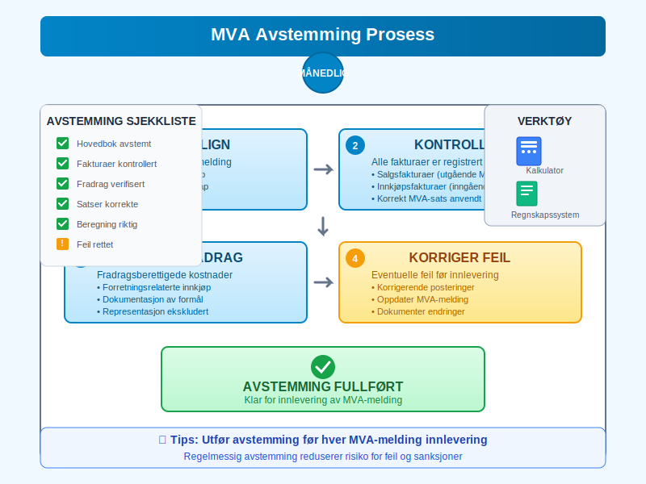

## Digitalisering av MVA

### Elektronisk MVA-melding

**Alle MVA-meldinger** må leveres elektronisk via:

* **Altinn** - for mindre virksomheter
* **API-løsninger** - for større virksomheter med [ERP-systemer](/blogs/regnskap/hva-er-erp-system "Hva er ERP-system? Komplett Guide til Enterprise Resource Planning")
* **Regnskapssystemer** - direkte integrasjon

### SAF-T (Standard Audit File for Tax)

**SAF-T** er et standardisert format for regnskapsdata:

* **Obligatorisk** for virksomheter med omsetning over 5 millioner kr
* **Detaljerte transaksjonsdata** må kunne leveres elektronisk
* **Økt kontrollmulighet** for Skatteetaten
* **Krav til regnskapssystemer** om SAF-T-støtte

### Fremtidige Utviklinger

**Digitale trender** innen MVA:

* **Sanntidsrapportering** - kontinuerlig dataoverføring
* **Automatisk kontroll** - AI-basert risikovurdering
* **Blockchain** - sikker og transparent registrering
* **Maskinlæring** - forbedret feildeteksjon

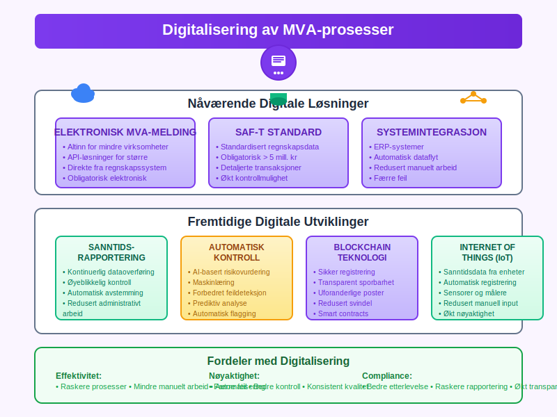

## Internasjonale Forhold

### EU/EØS MVA-samarbeid

Norge deltar i **EU/EØS MVA-samarbeidet**:

* **Felles regler** for grenseoverskridende handel
* **VIES-systemet** - validering av MVA-numre
* **Administrativt samarbeid** om kontroll
* **Informasjonsutveksling** mellom land

### VOEC-registeret

**VOEC** (VAT on E-Commerce) for elektronisk handel:

* **Registreringsplikt** for utenlandske selskaper
* **Forenklede prosedyrer** for MVA-oppgjør
* **Terskelverdier** for registrering i ulike land
* **Sentral registrering** i ett EU-land

### Transfer Pricing og MVA

**Transfer pricing** påvirker MVA ved:

* **Internprising** i [konsern](/blogs/regnskap/hva-er-konsern "Hva er et Konsern? Komplett Guide til Konsernstrukturer og Konsernregnskap")
* **Armlengdeprinsippet** må følges
* **Dokumentasjonskrav** for internasjonale transaksjoner
* **Koordinering** mellom skatte- og MVA-regler

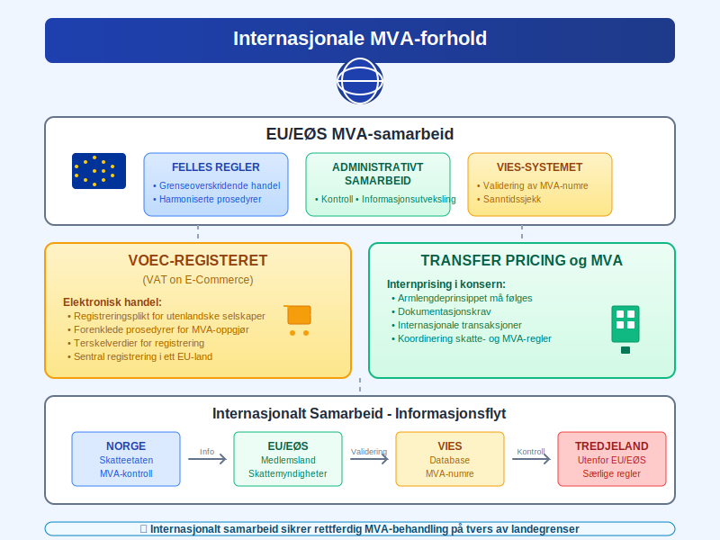

## Praktiske Råd for Virksomheter

### Implementering av MVA-rutiner

**Etabler gode rutiner** for MVA-håndtering:

#### Daglige Rutiner
* **Registrer** alle [fakturaer](/blogs/regnskap/hva-er-en-faktura "Hva er en Faktura? En Guide til Norske Fakturakrav") med korrekt MVA-sats
* **Kontroller** MVA-beregninger på innkjøp
* **Arkiver** [bilag](/blogs/regnskap/hva-er-bilag "Hva er Bilag i Regnskap? Komplett Guide til Bilagstyper og Krav") systematisk

#### Månedlige Rutiner
* **Avstem** MVA-kontoer mot hovedbok
* **Gjennomgå** [fradragsberettigede kostnader](/blogs/regnskap/fradragsberettiget "Hva betyr Fradragsberettiget?")
* **Forbered** MVA-melding i god tid

#### Årlige Rutiner
* **Vurder** terminlengde basert på omsetning
* **Oppdater** rutiner ved regelverksendringer
* **Gjennomgå** MVA-prosedyrer med [regnskapsfører](/blogs/regnskap/hva-er-en-regnskapsforer "Hva er en Regnskapsfører? Komplett Guide til Regnskapsføring")

### Vanlige Feil og Hvordan Unngå Dem

#### Feil MVA-sats
* **Sjekk** hvilken sats som gjelder for din type vare/tjeneste
* **Oppdater** regnskapssystem ved satsendringer
* **Få** profesjonell veiledning ved tvil

#### Manglende Fradragsrett
* **Forstå** reglene for fradragsrett
* **Dokumenter** forretningsformålet med innkjøp
* **Skill** mellom private og forretningsmessige utgifter

#### For Sen Innlevering
* **Sett opp** påminnelser i kalenderen
* **Automatiser** prosesser der det er mulig
* **Ha** backup-rutiner ved sykdom eller ferie

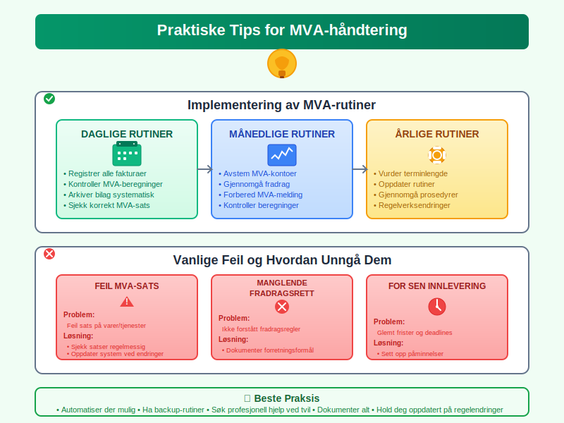

## Fremtidige Endringer og Utvikling

### Planlagte Regelverksendringer

**Kommende endringer** i MVA-regelverket:

#### Digitale Tjenester
* **Utvidet avgiftsplikt** for digitale tjenester
* **Nye registreringskrav** for plattformselskaper
* **Harmonisering** med EU-regler

#### Miljøavgifter
* **Grønn omstilling** påvirker MVA-regler
* **Karbonprising** kan integreres med MVA
* **Sirkulærøkonomi** får egne regler

### Teknologisk Utvikling

**Nye teknologier** vil påvirke MVA:

* **Kunstig intelligens** for automatisk klassifisering
* **Internet of Things** for sanntidsdata
* **Kryptovaluta** krever nye regler
* **Automatiserte transaksjoner** utfordrer tradisjonelle modeller

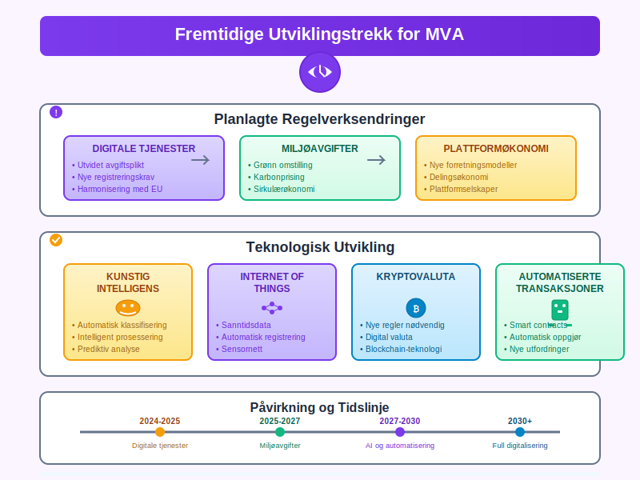

## Konklusjon

**Merverdiavgift (MVA)** er et komplekst, men viktig område for alle virksomheter i Norge. Korrekt håndtering av MVA krever:

* **Grundig forståelse** av regelverket og satser
* **Gode rutiner** for registrering og rapportering
* **Riktig [bokføring](/blogs/regnskap/hva-er-bokforing "Hva er Bokføring? Komplett Guide til Bokføringsprinsipper")** og dokumentasjon
* **Løpende oppdatering** på regelverksendringer

For [enkeltpersonforetak](/blogs/regnskap/hva-er-enkeltpersonforetak "Hva er et Enkeltpersonforetak? Komplett Guide til Selskapsformen"), [aksjeselskaper](/blogs/regnskap/hva-er-et-aksjeselskap "Hva er et Aksjeselskap (AS)? Komplett Guide til Selskapsformen") og andre [foretaksformer](/blogs/regnskap/hva-er-foretak "Hva er et Foretak? Komplett Guide til Foretaksformer i Norge") er MVA en sentral del av den økonomiske driften.

**Profesjonell rådgivning** fra regnskapsfører eller revisor anbefales, spesielt ved oppstart av virksomhet eller ved komplekse MVA-spørsmål. God MVA-håndtering bidrar til:

* **Lovlig drift** i henhold til norske regler
* **Optimal [likviditet](/blogs/regnskap/hva-er-likviditet "Hva er Likviditet? Komplett Guide til Likviditetsstyring")** gjennom riktig timing
* **Redusert risiko** for sanksjoner og tilleggsskatt
* **Effektiv drift** med gode rutiner og systemer

Uansett virksomhetens størrelse og kompleksitet er det viktig å prioritere MVA-compliance som en integrert del av den daglige driften og den overordnede [regnskapsføringen](/blogs/regnskap/hva-er-regnskap "Hva er Regnskap? En komplett guide").

