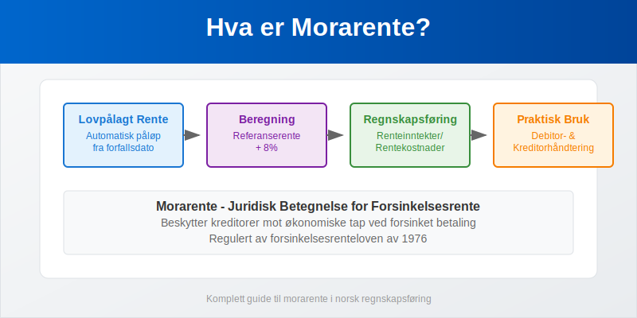
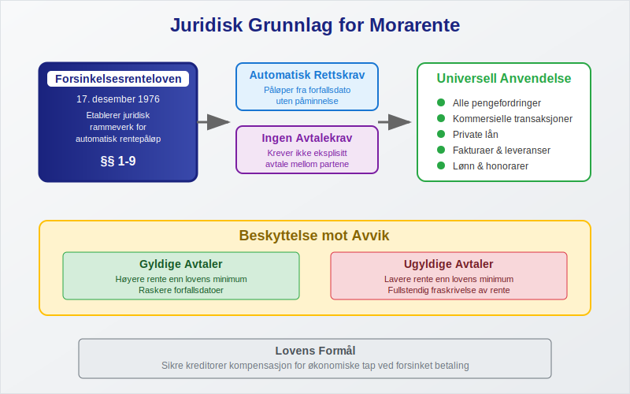
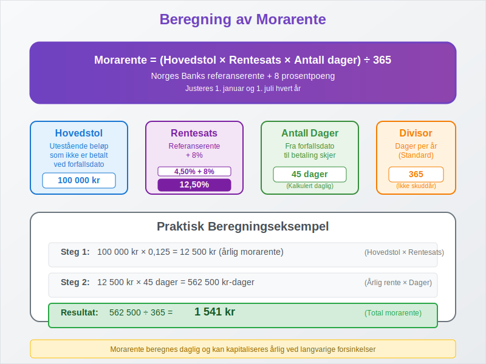
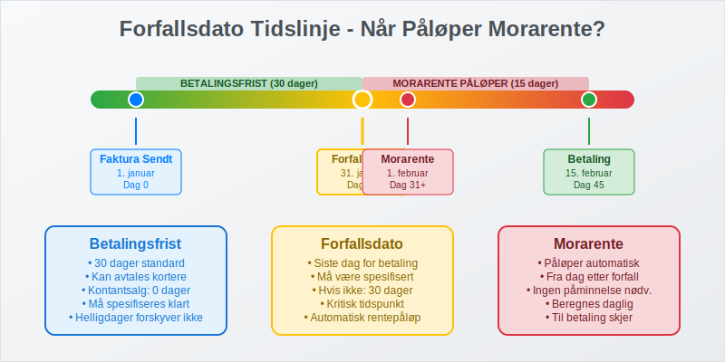
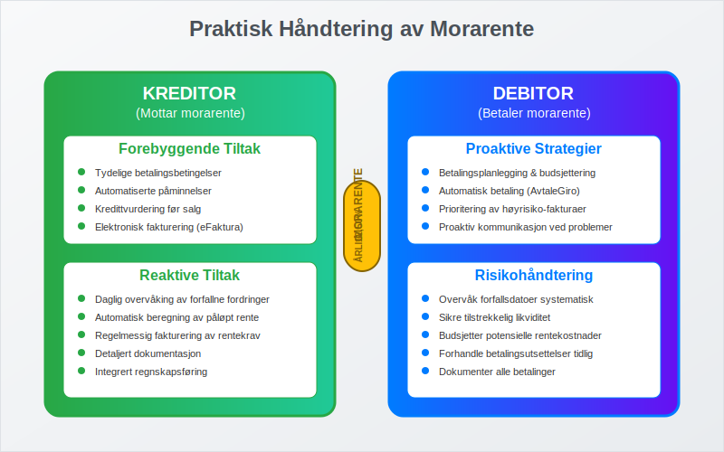
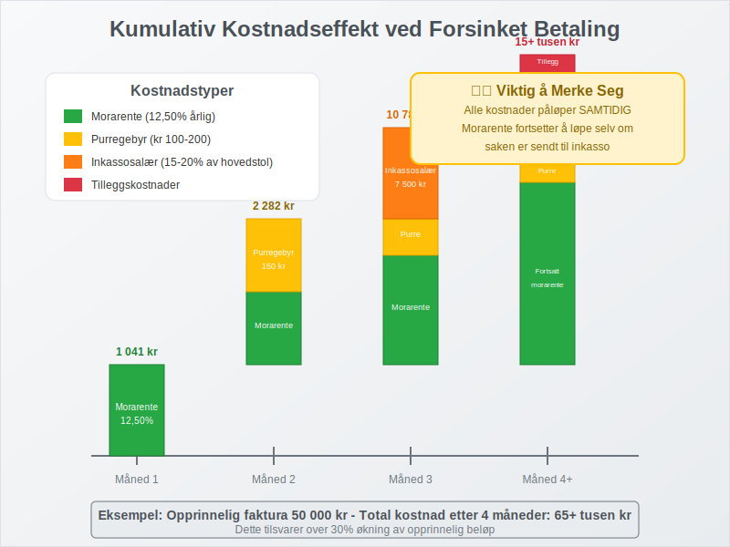
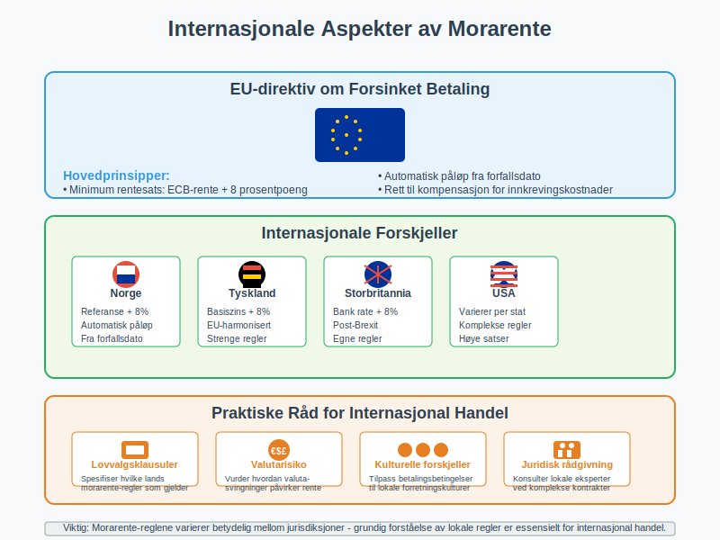
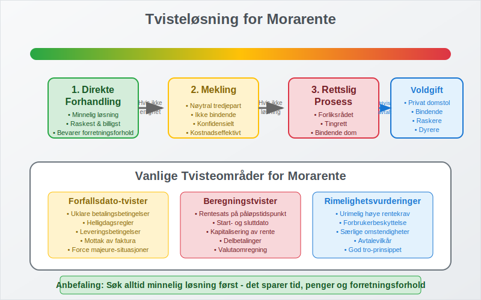

---
title: "Hva er morarente?"
meta_title: "Hva er morarente?"
meta_description: '**Morarente** er en type [rente](/blogs/regnskap/rente "Rente “ En komplett guide til rente i regnskap") og den juridiske betegnelsen for lovpålagt rente som...'
slug: hva-er-morarente
type: blog
layout: pages/single
---

**Morarente** er en type [rente](/blogs/regnskap/rente "Rente “ En komplett guide til rente i regnskap") og den juridiske betegnelsen for lovpålagt rente som automatisk påløper når en betaling ikke skjer innen avtalt forfallsdato. Begrepet stammer fra det latinske "mora" som betyr forsinkelse, og representerer en fundamental rettssikkerhet i norsk kontraktsrett. Morarente sikrer at [kreditorer](/blogs/regnskap/hva-er-kreditor "Hva er Kreditor? Komplett Guide til Leverandørgjeld og Kreditorhåndtering") kompenseres for økonomiske tap ved forsinket betaling, og gjelder for alle typer pengefordringer inkludert [fakturaer](/blogs/regnskap/hva-er-en-faktura "Hva er en Faktura? En Guide til Norske Fakturakrav"), lån og andre betalingsforpliktelser.



## Seksjon 1: Juridisk Grunnlag og Definisjon

Morarente er forankret i **forsinkelsesrenteloven** av 17. desember 1976, som etablerer det juridiske rammeverket for automatisk rentepåløp ved forsinket betaling. Loven sikrer at rente påløper uten krav om særskilt avtale eller påminnelse fra kreditor.

### Grunnleggende Prinsipper for Morarente

* **Automatisk rettskrav:** Morarente påløper automatisk fra forfallsdato
* **Ingen avtalekrav:** Krever ikke eksplisitt avtale mellom partene
* **Universell anvendelse:** Gjelder alle pengefordringer i norsk rett
* **Beskyttelse mot avvik:** Avtaler som reduserer morarente under lovens minimum er ugyldige



### Historisk Utvikling

Morarente-konseptet har dype røtter i norsk rett:

| Periode | Regulering | Hovedendringer |
|---------|------------|----------------|
| **Før 1976** | Alminnelig kontraktsrett | Krevde særskilt avtale |
| **1976-1999** | Forsinkelsesrenteloven | Automatisk påløp etablert |
| **2000-2024** | Moderniserte regler | Tilpasset moderne forretningspraksis |

## Seksjon 2: Beregning og Satser for Morarente

Morarente beregnes basert på **Norges Banks referanserente** pluss et lovfastsatt tillegg på 8 prosentpoeng for kommersielle transaksjoner. Satsen justeres halvårlig for å reflektere endringer i det generelle rentenivået.



### Gjeldende Morarente-satser (2024)

| Periode | Referanserente | Lovpålagt Tillegg | Total Morarente |
|---------|----------------|-------------------|-----------------|
| Januar-Juni 2024 | 4,50% | 8,00% | **12,50%** |
| Juli-Desember 2024 | 4,50% | 8,00% | **12,50%** |

### Detaljert Beregningsmetode

**Formel for morarente:**
```
Morarente = (Hovedstol × Årlig rentesats × Antall forsinkelsesdager) ÷ 365
```

**Praktisk eksempel:**
* Utestående beløp: 100 000 kr
* Forsinkelse: 45 dager
* Morarente-sats: 12,50%
* Beregnet morarente: (100 000 × 0,125 × 45) ÷ 365 = **1 541 kr**

### Sammensatt Rente og Kapitalisering

I enkelte tilfeller kan morarente **kapitaliseres** (legges til hovedstolen):

* **Årlig kapitalisering:** Standard praksis for langvarige forsinkelser
* **Sammensatt effekt:** Morarente beregnes på både opprinnelig gjeld og påløpt rente
* **Juridiske begrensninger:** Domstolene kan begrense urimelig kapitalisering

## Seksjon 3: Når Påløper Morarente?

Morarente påløper fra det øyeblikk **forfallsdato** passerer, uavhengig av om [debitor](/blogs/regnskap/hva-er-debitor "Hva er Debitor? Komplett Guide til Kundefordringer og Debitorhåndtering") er klar over forsinkelsen. Dette skiller morarente fra andre former for forsinkelseskostnader.

### Forfallsdato i Ulike Kontekster

**For kommersielle fakturaer:**
* **Avtalt betalingsfrist:** Som spesifisert på [fakturaen](/blogs/regnskap/hva-er-en-faktura "Hva er en Faktura? En Guide til Norske Fakturakrav")
* **Standard 30-dagers regel:** Når ingen frist er avtalt
* **Kontantsalg:** Umiddelbar forfallsdato



**For andre forpliktelser:**
* **Lønn:** Siste arbeidsdag i måneden
* **Husleie:** Vanligvis 1. i måneden (forskuddsbetaling)
* **Leverandørfakturaer:** I henhold til [betalingsbetingelser](/blogs/regnskap/hva-er-betalingsmidler "Hva er Betalingsmidler? Tvungne, Elektroniske og Tradisjonelle Metoder")

### Spesielle Forfallsregler

| Situasjon | Forfallsdato | Morarente fra |
|-----------|--------------|---------------|
| **Manglende forfallsdato** | 30 dager etter mottak | Dag 31 |
| **Helligdager** | Neste virkedag | Opprinnelig dato |
| **Kontantkjøp** | Ved levering | Umiddelbart |

## Seksjon 4: Regnskapsføring av Morarente

Korrekt regnskapsføring av morarente er avgjørende for både [driftsinntekter](/blogs/regnskap/hva-er-driftsinntekter "Hva er Driftsinntekter? Komplett Guide til Inntektsføring og Regnskapsregler") og [driftskostnader](/blogs/regnskap/hva-er-driftskostnader "Hva er Driftskostnader? Komplett Guide til Kostnadsføring og Regnskapsregler"). Behandlingen følger etablerte regnskapsprinsipper for periodisering og inntektsføring.

### Regnskapsføring for Kreditor

**Kontering av morarente som inntekt:**

| Konto | Kontobeskrivelse | Debet | Kredit |
|-------|------------------|-------|--------|
| 1500 | [Kundefordringer](/blogs/regnskap/hva-er-kundefordring "Hva er Kundefordring? Komplett Guide til Debitorhåndtering og Kredittstyring") | X |  |
| 8050 | Renteinntekter |  | X |

**Periodisering av påløpt morarente:**

| Konto | Kontobeskrivelse | Debet | Kredit |
|-------|------------------|-------|--------|
| 1590 | Påløpte inntekter | X |  |
| 8050 | Renteinntekter |  | X |

### Regnskapsføring for Debitor

**Kontering av morarente som kostnad:**

| Konto | Kontobeskrivelse | Debet | Kredit |
|-------|------------------|-------|--------|
| 8150 | Rentekostnader | X |  |
| 2400 | [Leverandørgjeld](/blogs/regnskap/hva-er-leverandorgjeld "Hva er Leverandørgjeld? Komplett Guide til Kreditorhåndtering og Betalingsstyring") |  | X |

### MVA-behandling av Morarente

**Viktig:** Morarente er **fritatt** for [merverdiavgift](/blogs/regnskap/hva-er-avgiftsplikt-mva "Hva er Avgiftsplikt (MVA)? Komplett Guide til Merverdiavgift i Norge"):

* **For kreditor:** Ingen utgående MVA på morarente-inntekter
* **For debitor:** Ingen inngående MVA-fradrag på morarente-kostnader
* **Dokumentasjon:** Morarente må faktureres separat fra MVA-pliktige tjenester

## Seksjon 5: Praktisk Håndtering av Morarente

Effektiv håndtering av morarente krever systematiske rutiner og proaktiv [debitoroppfølging](/blogs/regnskap/hva-er-debitor "Hva er Debitor? Komplett Guide til Kundefordringer og Debitorhåndtering"). Dette inkluderer både forebyggende tiltak og reaktive strategier.

### Rutiner for Kreditorer

**Forebyggende tiltak:**
1. **Tydelige betalingsbetingelser:** Spesifiser forfallsdato klart på alle fakturaer
2. **Automatiserte påminnelser:** Implementer systembaserte [betalingspåminnelser](/blogs/regnskap/hva-er-betalingspamminelse "Hva er Betalingspåminnelse? Komplett Guide til Purring og Inkasso")
3. **Kredittvurdering:** Vurder kunders [betalingsevne](/blogs/regnskap/hva-er-betalingsevne "Hva er Betalingsevne? Komplett Guide til Kredittvurdering og Finansiell Analyse") før salg
4. **Elektronisk fakturering:** Bruk [eFaktura](/blogs/regnskap/hva-er-efaktura "Hva er eFaktura? Komplett Guide til Elektronisk Fakturering i Norge") for raskere levering

**Reaktive tiltak:**
* **Daglig overvåking:** Følg opp forfallne fordringer systematisk
* **Automatisk beregning:** Implementer systemer som beregner påløpt morarente
* **Regelmessig fakturering:** Send morarente-krav månedlig eller kvartalsvis
* **Dokumentasjon:** Oppretthold detaljert dokumentasjon for alle rentekrav



### Rutiner for Debitorer

**Proaktive strategier:**
* **Betalingsplanlegging:** Bruk [budsjettering](/blogs/regnskap/hva-er-budsjettering "Hva er Budsjettering? Komplett Guide til Budsjettplanlegging og Økonomistyring") for å sikre tilstrekkelig [likviditet](/blogs/regnskap/hva-er-likviditet "Hva er Likviditet? Komplett Guide til Likviditetsstyring og Kontantstrøm")
* **Automatisk betaling:** Implementer [AvtaleGiro](/blogs/regnskap/hva-er-avtalegiro "Hva er AvtaleGiro? Komplett Guide til Automatisk Betaling") for kritiske betalinger
* **Prioritering:** Betal fakturaer med høyest morarente-risiko først
* **Kommunikasjon:** Kontakt kreditorer proaktivt ved betalingsproblemer

## Seksjon 6: Morarente vs. Andre Forsinkelseskostnader

Det er viktig å forstå forskjellen mellom morarente og andre kostnader som kan påløpe ved forsinket betaling, da disse kan akkumuleres samtidig.

### Sammenligning av Forsinkelseskostnader

| Type Kostnad | Juridisk Grunnlag | Beregningsgrunnlag | Maksimum |
|--------------|-------------------|-------------------|----------|
| **Morarente** | Forsinkelsesrenteloven | Referanserente + 8% | Ingen |
| **[Fakturagebyr](/blogs/regnskap/hva-er-fakturagebyr "Hva er Fakturagebyr? Komplett Guide til Faktureringsgebyrer i Norge")** | Avtalefrihet | Faktiske kostnader | Rimelighetsvurdering |
| **Purregebyr** | Inkassoloven | Fastsatte satser | Kr 100-200 |
| **[Inkassosalær](/blogs/regnskap/hva-er-inkassosalaer "Hva er Inkassosalær? Komplett Guide til Inkassokostnader og Innkrevingsgebyrer")** | Inkassoloven | Prosent av hovedstol | 15-20% |

### Kumulativ Kostnadseffekt

Alle forsinkelseskostnader kan påløpe **samtidig**, noe som gjør forsinket betaling ekstremt kostbart:

**Måned 1:** Morarente påløper automatisk
**Måned 2:** Purregebyr + fortsatt morarente
**Måned 3:** Inkassosalær + fortsatt morarente
**Måned 4+:** Alle kostnader fortsetter å akkumuleres



## Seksjon 7: Særregler for Forbrukerkjøp

For **forbrukerkjøp** (B2C-transaksjoner) gjelder spesielle beskyttelsesregler som reduserer morarente-byrden for private forbrukere.

### Forbrukerkjøpsloven og Morarente

**Redusert rentesats:**
* **Kommersielle transaksjoner (B2B):** Referanserente + 8%
* **Forbrukerkjøp (B2C):** Referanserente + 5%

**Krav om påminnelse:**
* **B2B:** Morarente påløper automatisk fra forfallsdato
* **B2C:** Morarente påløper først etter skriftlig påminnelse

### Sammenligning B2B vs. B2C Morarente

| Aspekt | B2B (Næringsdrivende) | B2C (Forbruker) |
|--------|----------------------|-----------------|
| **Rentesats** | Referanse + 8% | Referanse + 5% |
| **Påløpstidspunkt** | Fra forfallsdato | Etter påminnelse |
| **Beskyttelsesnivå** | Begrenset | Utvidet |
| **Rimelighetsvurdering** | Sjelden | Hyppigere |

## Seksjon 8: Internasjonale Aspekter av Morarente

Ved internasjonal handel må norske bedrifter være oppmerksomme på at morarente-reglene varierer betydelig mellom jurisdiksjoner.

### EU-direktiv om Forsinket Betaling

EU har harmonisert reglene for morarente i kommersielle transaksjoner:

**Hovedprinsipper:**
* **Minimum rentesats:** ECB-rente + 8 prosentpoeng
* **Automatisk påløp:** Fra forfallsdato uten påminnelse
* **Kompensasjonsrett:** Rett til kompensasjon for innkrevingskostnader

### Praktiske Råd for Internasjonal Handel

1. **Lovvalgsklausuler:** Spesifiser hvilke lands morarente-regler som gjelder
2. **Valutarisiko:** Vurder hvordan [valutasvingninger](/blogs/regnskap/hva-er-finansiering "Hva er Finansiering? Komplett Guide til Finansieringsformer og Kapitalstruktur") påvirker morarente
3. **Kulturelle forskjeller:** Tilpass betalingsbetingelser til lokale forretningskulturer
4. **Juridisk rådgivning:** Konsulter lokale eksperter ved komplekse internasjonale kontrakter



## Seksjon 9: Digitalisering og Automatisering

Moderne teknologi revolusjonerer håndteringen av morarente gjennom automatisering og sanntidsovervåking.

### ERP-systemer og Morarente-håndtering

Moderne [ERP-systemer](/blogs/regnskap/hva-er-erp-system "Hva er ERP-system? Komplett Guide til Enterprise Resource Planning") tilbyr omfattende morarente-funksjonalitet:

**Automatiserte prosesser:**
* **Daglig beregning:** Automatisk oppdatering av påløpt morarente
* **Automatisk fakturering:** Systemgenererte morarente-fakturaer
* **Integrert regnskapsføring:** Automatisk [bilagsføring](/blogs/regnskap/hva-er-bilagsforing "Hva er Bilagsføring? Komplett Guide til Regnskapsbilag og Dokumentasjon")
* **Rapportering:** Detaljerte analyser av morarente-inntekter og -kostnader

### Kunstig Intelligens og Prediktiv Analyse

**AI-drevne løsninger:**
* **Betalingsprediksjon:** Forutsi hvilke kunder som sannsynligvis vil betale for sent
* **Optimalisert oppfølging:** Automatisk prioritering av inkassoaktiviteter
* **Risikosegmentering:** Kategoriser kunder basert på betalingshistorikk

## Seksjon 10: Skattemessige Konsekvenser

Morarente har betydelige skattemessige implikasjoner som må håndteres korrekt for å unngå problemer med skattemyndighetene.

### For Kreditor (Mottaker av Morarente)

**Skattepliktig inntekt:**
* **Full skatteplikt:** Morarente er ordinær skattepliktig inntekt
* **Periodiseringsprinsippet:** Inntektsføres når den påløper, ikke når den mottas
* **Dokumentasjonskrav:** Detaljert dokumentasjon kreves for skattemyndighetene

**Regnskapsføring og skatt:**
* **Samsvar:** Regnskapsføring må samsvare med skattemessig behandling
* **Periodisering:** Påløpt morarente må periodiseres korrekt
* **Revisjonsrisiko:** Høy risiko for kontroll ved [skatterevisjoner](/blogs/regnskap/hva-er-arbeidspapirer-revisjon "Hva er Arbeidspapirer (Revisjon)? Komplett Guide til Revisjonsdokumentasjon")

### For Debitor (Betaler av Morarente)

**Fradragsberettigelse:**
* **Ordinært fradrag:** Morarente er normalt fullt fradragsberettiget
* **Periodisering:** Kostnadsføres når den påløper
* **Begrensninger:** Enkelte begrensninger for private gjeldsforhold

### Skatteplanlegging og Morarente

| Strategi | Kreditor | Debitor |
|----------|----------|---------|
| **Timing** | Utsett inntektsføring til neste år | Fremskynde kostnadsføring |
| **Dokumentasjon** | Detaljert rentekrav-dokumentasjon | Oppbevar alle betalingsbilag |
| **Periodisering** | Korrekt periodisering av påløpt rente | Periodiser påløpte rentekostnader |

## Seksjon 11: Juridiske Aspekter og Tvisteløsning

Morarente kan bli gjenstand for juridiske tvister, særlig når det gjelder beregning, rimelighetsvurderinger og kontraktstolkning.

### Vanlige Tvisteområder

**Forfallsdato-tvister:**
* **Uklare betalingsbetingelser:** Når forfallsdato ikke er entydig spesifisert
* **Helligdagsregler:** Uenighet om forfallsdato ved [helligdager](/blogs/regnskap/helligdager-regnskap-bedriftseiere "Helligdager i Regnskap for Bedriftseiere - Komplett Guide til Feriepenger og Regnskapsføring")
* **Leveringsbetingelser:** Når betaling er knyttet til levering eller godkjenning

**Beregningstvister:**
* **Rentesats:** Uenighet om gjeldende rentesats på påløpstidspunktet
* **Beregningsperiode:** Diskusjon om start- og sluttdato for renteberegning
* [**Kapitalisering**](/blogs/regnskap/renters-rente "Renters rente “ Rente på rente i regnskap"): Uenighet om sammensatt rente og kapitalisering

### Tvisteløsningsmekanismer

**Utenrettslige løsninger:**
1. **Direkte forhandling:** Forsøk på minnelig løsning mellom partene
2. **Mekling:** Bruk av nøytral tredjepart som mekler
3. **Voldgift:** Bindende avgjørelse fra voldgiftsdomstol

**Rettslige prosesser:**
* **Forliksrådet:** For mindre krav (under kr 125 000)
* **Tingrett:** For større kommersielle tvister
* **Høyere instanser:** Lagmannsrett og Høyesterett ved prinsipielle spørsmål



## Seksjon 12: Fremtidige Utviklingstrender

Morarente-området er i kontinuerlig utvikling, påvirket av teknologiske fremskritt, regulatoriske endringer og endrede forretningspraksis.

### Teknologiske Innovasjoner

**Blockchain og Smart Contracts:**
* **Automatisk utførelse:** Smart contracts som automatisk beregner og overfører morarente
* **Transparens:** Uforanderlig dokumentasjon av alle transaksjoner
* **Reduserte kostnader:** Eliminering av manuelle prosesser

**Sanntids-betalingssystemer:**
* **Øyeblikkelig oppgjør:** Reduserer risiko for forsinkelser
* **Automatisk morarente:** Systembasert beregning og påløp
* **Integrerte løsninger:** Sømløs integrasjon med regnskapssystemer

### Regulatoriske Endringer

**Forventede utviklinger:**
* **Digitalisering av lovverket:** Tilpasning til digitale betalingsløsninger
* **Harmonisering:** Økt samsvar med internasjonale standarder
* **Forbrukerbeskyttelse:** Styrket beskyttelse av private debitorer

### Bærekraft og ESG-hensyn

**Miljømessige aspekter:**
* **Papirløse prosesser:** Reduksjon av papirbasert dokumentasjon
* **Energieffektive systemer:** Optimalisering av IT-infrastruktur
* **Bærekraftig inkasso:** Miljøvennlige inkassoprosesser

**Sosiale hensyn:**
* **Ansvarlig utlån:** Vurdering av debitors betalingsevne
* **Fleksible betalingsløsninger:** Tilpassede løsninger for vanskeligstilte debitorer
* **Finansiell inkludering:** Sikre tilgang til kreditt for alle samfunnsgrupper

## Konklusjon

Morarente representerer en fundamental rettssikkerhet i norsk kontraktsrett som beskytter kreditorer mot økonomiske tap ved forsinket betaling. Som lovpålagt automatisk rente sikrer morarente at betalingsforpliktelser overholdes og bidrar til å opprettholde tilliten i det kommersielle systemet.

**Nøkkelpunkter for suksessfull morarente-håndtering:**

* **Juridisk forståelse:** Grundig kunnskap om forsinkelsesrenteloven og dens anvendelse
* **Systematisk tilnærming:** Implementering av automatiserte systemer for beregning og oppfølging
* **Korrekt regnskapsføring:** Sikre samsvar mellom regnskapsmessig og skattemessig behandling
* **Proaktiv kommunikasjon:** Tydelige betalingsbetingelser og tidlig oppfølging av forsinkelser
* **Teknologisk utnyttelse:** Bruk av moderne ERP-systemer og digitale betalingsløsninger

Ved å følge beste praksis for morarente-håndtering kan norske bedrifter både beskytte sine interesser som kreditorer og minimere kostnader som debitorer, samtidig som de bidrar til et velfungerende og tillitsbasert forretningsklima.

For ytterligere informasjon om relaterte emner, se våre artikler om [forsinkelsesrente](/blogs/regnskap/hva-er-forsinkelsesrente "Hva er Forsinkelsesrente? Komplett Guide til Morarenter og Beregning"), [inkassosalær](/blogs/regnskap/hva-er-inkassosalaer "Hva er Inkassosalær? Komplett Guide til Inkassokostnader og Innkrevingsgebyrer") og [debitorhåndtering](/blogs/regnskap/hva-er-debitor "Hva er Debitor? Komplett Guide til Kundefordringer og Debitorhåndtering").


