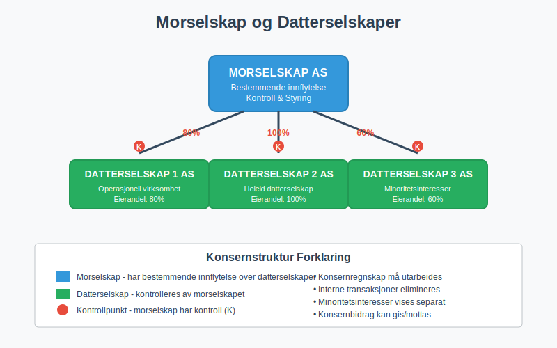
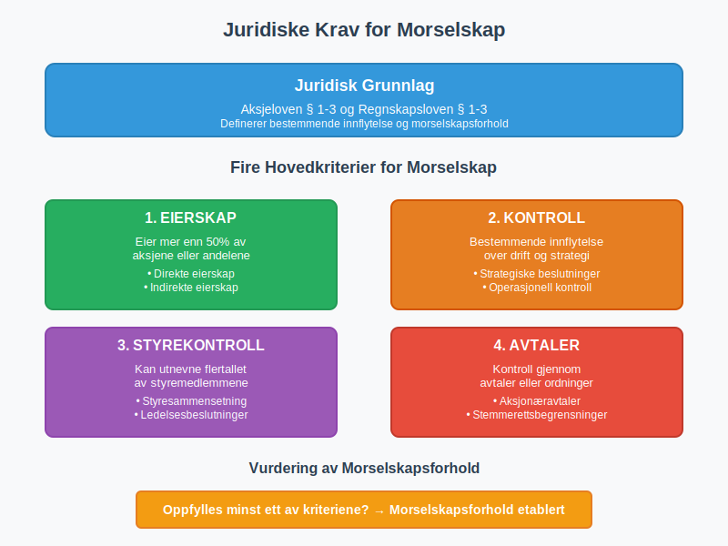
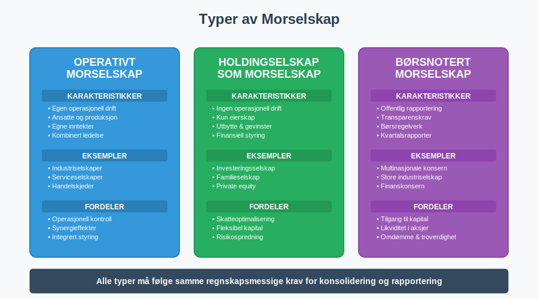
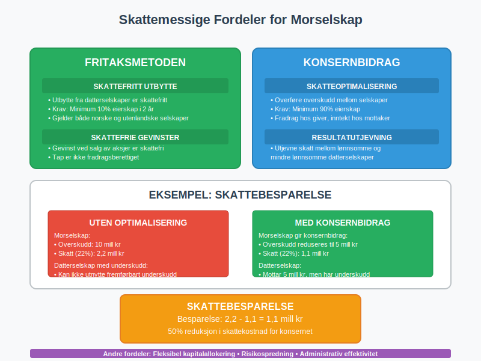
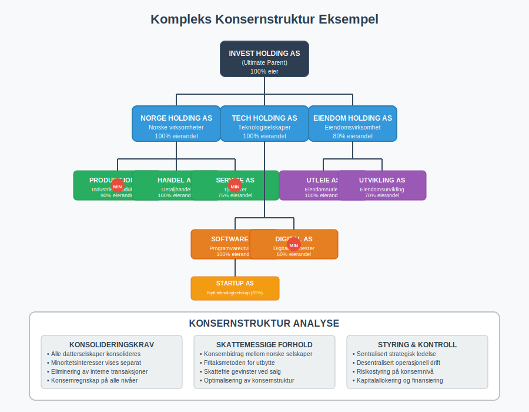
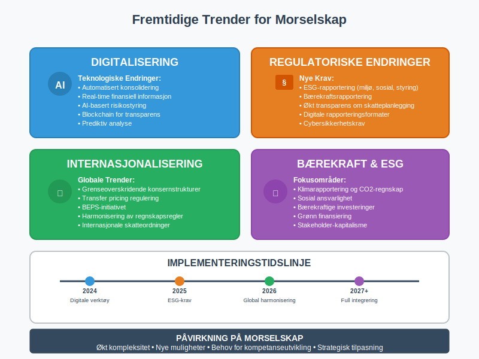

---
title: "hva-er-morselskap"
seoTitle: "hva-er-morselskap"
description: 'Et **morselskap** er et selskap som har bestemmende innflytelse over ett eller flere andre selskaper ([datterselskaper](/blogs/regnskap/datterselskap "Hva er Da...'
---

Et **morselskap** er et selskap som har bestemmende innflytelse over ett eller flere andre selskaper ([datterselskaper](/blogs/regnskap/datterselskap "Hva er Datterselskap? En Guide til Datterselskap og Konsernstruktur")) gjennom eierskap av aksjer eller andeler. Morselskapet står på toppen av en [konsernstruktur](/blogs/regnskap/hva-er-konsern "Hva er et Konsern? Komplett Guide til Konsernstrukturer og Konsolidering") og har kontroll over datterselskapenes strategiske beslutninger.

## Definisjon av Morselskap

Et **morselskap** defineres som et selskap som:

* Eier **mer enn 50%** av aksjene eller andelene i et annet selskap
* Har **bestemmende innflytelse** over et annet selskaps drift og strategi
* Kan **utnevne flertallet** av styremedlemmene i datterselskapet
* Har **kontroll** over datterselskapet gjennom avtaler eller andre ordninger

### Juridisk Grunnlag

Begrepet morselskap er definert i **aksjeloven § 1-3** og **regnskapsloven § 1-3**. Et selskap regnes som morselskap når det har bestemmende innflytelse over et annet selskap, uavhengig av eierandel.

## Typer av Morselskap

### Operativt Morselskap

Et **operativt morselskap** driver egen virksomhet i tillegg til å eie datterselskaper:

* Har **egen drift** og ansatte
* Genererer **egne inntekter** fra operasjonell virksomhet
* Kombinerer **operasjonell ledelse** med eierstyring
* Vanlig i industriselskaper og serviceselskaper

### Holdingselskap som Morselskap

Et [holdingselskap](/blogs/regnskap/hva-er-holdingselskap "Hva er et Holdingselskap? Komplett Guide til Holdingselskaper") fungerer som **rent morselskap**:

* **Ingen operasjonell drift** - kun eierskap
* Inntekter kommer fra **utbytte** og **kapitalgevinster**
* Fokus på **finansiell styring** og investeringer
* Ofte brukt for **skatteoptimalisering**

### Børsnotert Morselskap

Børsnoterte morselskaper har **særlige krav**:

* **Offentlig rapportering** av konsernresultater
* **Transparens** overfor aksjonærer og marked
* **Compliance** med børsregelverk
* **Kvartalsrapportering** og årsrapporter

## Eierskap og Kontroll

### Eierandeler og Stemmerett

| Eierandel | Kontrollnivå | Juridisk Status | Regnskapsmessig Behandling |
|-----------|--------------|-----------------|----------------------------|
| **0-20%** | Ingen kontroll | Finansiell investering | Kostmetoden |
| **20-50%** | Betydelig innflytelse | Tilknyttet selskap | Egenkapitalmetoden |
| **50%+** | Bestemmende innflytelse | **Morselskap/Datterselskap** | **Konsolidering** |
| **100%** | Full kontroll | Heleid datterselskap | Full konsolidering |

### Indirekte Eierskap

Et morselskap kan ha kontroll gjennom **indirekte eierskap**:

* **Direkte eierskap**: Morselskap A eier 60% av Datterselskap B
* **Indirekte eierskap**: Datterselskap B eier 70% av Datterselskap C
* **Resultat**: Morselskap A kontrollerer også Datterselskap C

## Regnskapsmessige Konsekvenser

### Konsolideringskrav

Morselskap må utarbeide **konsernregnskap** når:

* Selskapet har **datterselskaper**
* Konsernet overskrider **størrelsesgrensene**
* Det ikke foreligger **fritaksbestemmelser**

#### Størrelsesgrenser for Konsernregnskap

| Kriterium | Grense |
|-----------|--------|
| **Salgsinntekt** | 70 millioner kr |
| **Balansesum** | 35 millioner kr |
| **Antall ansatte** | 50 personer |

*Minst to av tre kriterier må overskrides*

### Konsolideringsprosess

Se også artikkelen [Konsolidering](/blogs/regnskap/konsolidering "Konsolidering i norsk konsernregnskap") for en dypere forklaring.

**Konsolideringsprosessen** innebærer:

1. **Sammenstilling** av morselskap og datterselskapers regnskaper
2. **Eliminering** av interne transaksjoner
3. **Justering** for minoritetsinteresser
4. **Presentasjon** som ett samlet konsernregnskap

### Eliminering av Interne Transaksjoner

Følgende **interne transaksjoner** må elimineres:

* **Interne salg** mellom konsernselskaper
* **Interne lån** og renteinntekter/-kostnader
* **Utbytte** fra datterselskaper til morselskap
* **Gevinster/tap** ved interne transaksjoner

## Skattemessige Forhold

### Konsernbidrag

Morselskap kan gi og motta [konsernbidrag](/blogs/regnskap/hva-er-konsernbidrag "Hva er Konsernbidrag? Guide til Skatteoptimalisering i Konsern"):

* **Krav**: Minimum **90% eierskap**
* **Formål**: **Skatteoptimalisering** og resultatutjevning
* **Tidsfrist**: Må vedtas innen **2 måneder** etter regnskapsårets slutt
* **Dokumentasjon**: Krever **styrevedtak** og **regnskapsføring**

### Fritaksmetoden

**Fritaksmetoden** gjelder for morselskaps investeringer:

* **Utbytte** fra datterselskaper er **skattefritt**
* **Gevinster** ved salg av datterselskaper er **skattefrie**
* **Tap** ved salg er **ikke fradragsberettiget**
* **Krav**: Minimum **10% eierskap** i minst **2 år**

## Styring og Ledelse

### Morselskapets Ansvar

Morselskapet har **overordnet ansvar** for:

* **Strategisk retning** for hele konsernet
* **Kapitalallokering** mellom datterselskaper
* **Risikostyring** på konsernnivå
* **Compliance** og regelverksetterlevelse

### Styresammensetning

**Morselskapets styre** bør ha:

* **Kompetanse** innen konsernledelse
* **Uavhengige medlemmer** for objektiv vurdering
* **Bransjekunnskap** relevant for datterselskapene
* **Finansiell ekspertise** for konsolidering og rapportering

### Corporate Governance

God **selskapsstyring** i morselskap innebærer:

* **Klare roller** mellom morselskap og datterselskaper
* **Transparente rapporteringslinjer**
* **Effektive kontrollsystemer**
* **Etiske retningslinjer** for hele konsernet

## Praktiske Eksempler

### Eksempel 1: Industrielt Morselskap

**Byggmester Holding AS** (morselskap):
* Eier **80%** av Byggmester Bygg AS
* Eier **100%** av Byggmester Eiendom AS
* Eier **60%** av Byggmester Maskin AS

**Konsekvenser**:

* Må utarbeide **konsernregnskap**
* Kan gi **konsernbidrag** til heleide datterselskap
* **Minoritetsinteresser** må vises i konsernregnskapet

### Eksempel 2: Finansielt Morselskap

**Invest Holding AS** (rent holdingselskap):
* Eier **100%** av Tech Solutions AS
* Eier **75%** av Property Management AS
* Eier **90%** av Consulting Services AS

**Fordeler**:

* **Skattefritt utbytte** fra datterselskaper
* **Fleksibel kapitalallokering**
* **Risikospredning** mellom ulike bransjer

## Utfordringer og Risiko

### Operasjonelle Utfordringer

* **Kompleks rapportering** og konsolidering
* **Koordinering** mellom datterselskaper
* **Kulturelle forskjeller** i store konsern
* **Kommunikasjonsutfordringer**

### Finansielle Risiko

* **Konsentrasjonsrisiko** ved få datterselskaper
* **Likviditetsrisiko** ved dårlig koordinering
* **Valutarisiko** ved internasjonale datterselskaper
* **Kredittrisiko** ved garantier for datterselskaper

### Regulatoriske Krav

* **Økte rapporteringskrav** for konsern
* **Compliance** på tvers av jurisdiksjoner
* **Transfer pricing** ved internasjonale konsern
* **Antimonopollovgivning**

## Opprettelse av Morselskap

### Planleggingsfase

Før opprettelse av morselskapsstruktur:

1. **Strategisk analyse** av forretningsmodell
2. **Skattemessig optimalisering**
3. **Juridisk struktur** og eierskap
4. **Finansieringsløsninger**

### Implementering

**Steg for å etablere morselskap**:

1. **Stifte** eller omorganisere eksisterende selskap
2. **Overføre aksjer** til morselskapet
3. **Etablere** styring og kontrollsystemer
4. **Implementere** rapporteringssystemer
5. **Sikre compliance** med regelverk

### Juridisk Bistand

**Anbefalt ekspertise**:

* **Selskapsrett** for strukturering
* **Skatterett** for optimalisering  
* **Regnskapsrett** for rapportering
* **Finansiell rådgivning** for finansiering

## Fremtidige Utviklingstrekk

### Digitalisering

**Teknologiske endringer** påvirker morselskap:

* **Automatisert konsolidering** og rapportering
* **Real-time** finansiell informasjon
* **AI-basert** risikostyring
* **Blockchain** for transparens

### Regulatoriske Endringer

**Nye krav** for morselskap:

* **ESG-rapportering** (miljø, sosial, styring)
* **Bærekraftsrapportering**
* **Økt transparens** om skatteplanlegging
* **Digitale rapporteringsformater**

### Internasjonalisering

**Globale trender**:

* **Grenseoverskridende** konsernstrukturer
* **Transfer pricing** regulering
* **BEPS-initiativet** (Base Erosion and Profit Shifting)
* **Harmonisering** av regnskapsregler

## Konklusjon

Et **morselskap** er en sentral aktør i moderne næringslivet som gir mulighet for **effektiv organisering** av komplekse virksomheter. Gjennom **strategisk eierskap** og **profesjonell styring** kan morselskap skape **synergieffekter** og **verdiskaping** på tvers av datterselskaper.

**Nøkkelfaktorer for suksess**:

* **Klar strategi** for konsernets utvikling
* **Effektive styringssystemer** og rapportering
* **Kompetent ledelse** med konsernerfaring
* **Proaktiv** tilnærming til regulatoriske endringer

For virksomheter som vurderer å etablere morselskapsstruktur, er det viktig å **søke profesjonell rådgivning** for å sikre optimal **juridisk**, **skattemessig** og **regnskapsmessig** løsning tilpasset virksomhetens behov og mål.

