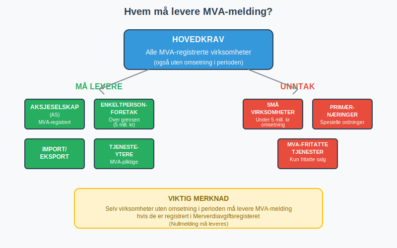
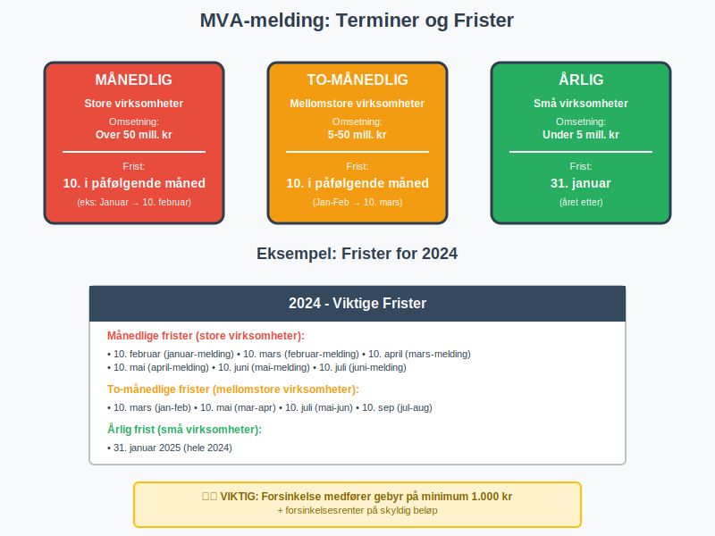
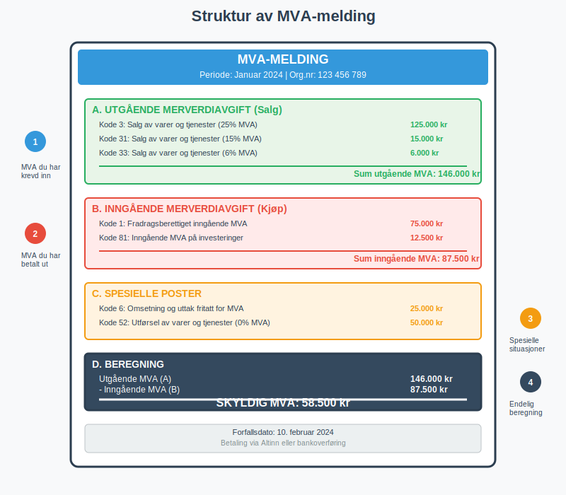
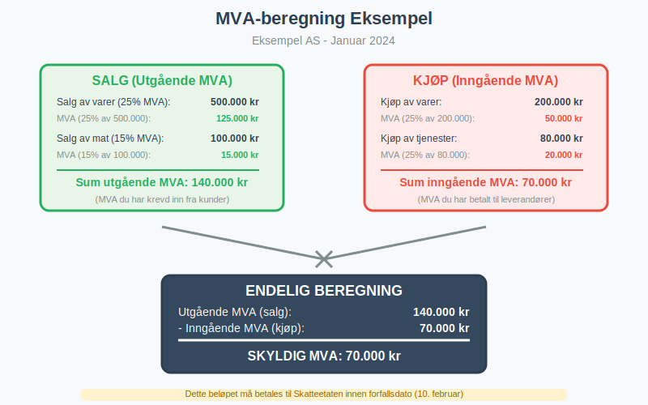
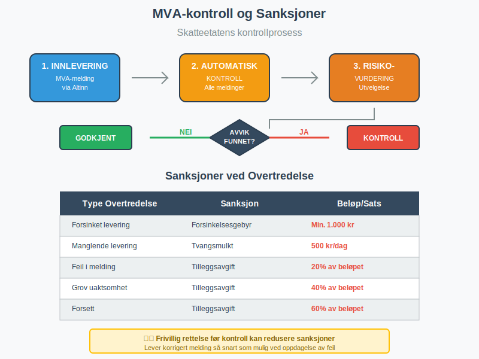
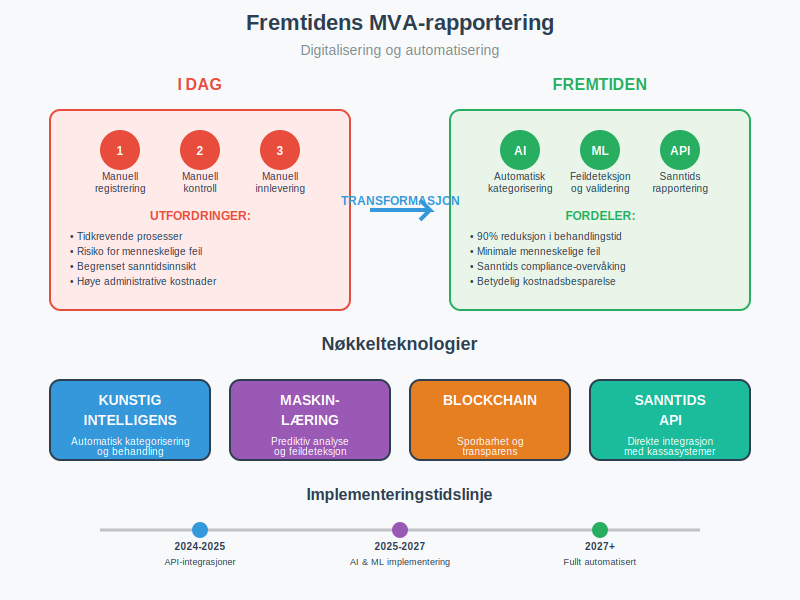

---
title: "Hva er MVA-melding?"
meta_title: "Hva er MVA-melding?"
meta_description: '**MVA-melding** er den obligatoriske rapporten som [MVA-registrerte virksomheter](/blogs/regnskap/hva-er-avgiftsplikt-mva "Hva er Avgiftsplikt (MVA)? Komplett G...'
slug: hva-er-mva-melding
type: blog
layout: pages/single
---

**MVA-melding** er den obligatoriske rapporten som [MVA-registrerte virksomheter](/blogs/regnskap/hva-er-avgiftsplikt-mva "Hva er Avgiftsplikt (MVA)? Komplett Guide til Merverdiavgift i Norge") må levere til Skatteetaten for å rapportere inn- og utgående merverdiavgift. Denne meldingen er grunnlaget for beregning av hvor mye MVA bedriften skylder staten eller har til gode, og er en sentral del av det norske skattesystemet. Som en viktig komponent i **[opplysningsplikten](/blogs/regnskap/hva-er-opplysningsplikt "Hva er opplysningsplikt? Komplett guide til rapporteringsplikt")**, representerer MVA-meldingen bedrifters lovpålagte ansvar for å rapportere avgiftsinformasjon til myndighetene. MVA-meldingen leveres elektronisk gjennom [Altinn](/blogs/regnskap/hva-er-altinn "Hva er Altinn? Norges Digitale Portal for Næringsliv og Privatpersoner") og er tett integrert med bedriftens [regnskapssystem](/blogs/regnskap/hva-er-regnskap "Hva er Regnskap? Komplett Guide til Regnskapsprinsipper og Praksis").

## Seksjon 1: Hvem MÃ¥ Levere MVA-melding?

Alle virksomheter som er registrert i [Merverdiavgiftsregisteret](/blogs/regnskap/hva-er-avgiftsplikt-mva "Hva er Avgiftsplikt (MVA)? Komplett Guide til Merverdiavgift i Norge") har plikt til å levere MVA-melding, uavhengig av om de har hatt omsetning i perioden eller ikke. Dette gjelder både **aktive** og **passive** MVA-registrerte virksomheter.

### 1.1 Virksomheter med Leveringsplikt

* **Alle MVA-registrerte virksomheter** - også de uten omsetning i perioden
* **[Aksjeselskaper](/blogs/regnskap/hva-er-et-aksjeselskap "Hva er et Aksjeselskap (AS)? Komplett Guide til Norske Aksjeselskaper")** og andre selskapsformer
* **[Enkeltpersonforetak](/blogs/regnskap/hva-er-enkeltpersonforetak "Hva er Enkeltpersonforetak? Komplett Guide til ENK i Norge")** over omsetningsgrensen
* **Importører** og eksportører
* **Tjenesteytere** med MVA-pliktige tjenester, inkludert [fjernleverbare tjenester](/blogs/regnskap/hva-er-fjernleverbare-tjenester "Fjernleverbare Tjenester - MVA-regler, Bokføring og Praktiske Eksempler")

### 1.2 Unntak fra Leveringsplikt

Enkelte virksomheter kan være fritatt fra MVA-melding:

* **Små virksomheter** under omsetningsgrensen (5 millioner kr)
* [**Primærnæringer**](/blogs/regnskap/primarnaring "Hva er primærnæring? Komplett Guide til Primærnæring i Regnskap") med spesielle ordninger
* **Virksomheter** som kun selger MVA-fritatte varer/tjenester

## Seksjon 2: Terminer og Frister

MVA-meldingen leveres på ulike terminer avhengig av virksomhetens størrelse og type. **Fristene er absolutte** og forsinkelse medfører gebyr og renter.

### 2.1 Terminoversikt

| **Termin** | **Virksomhetstype** | **Omsetningsgrense** | **Leveringsfrist** |
|------------|---------------------|---------------------|-------------------|
| **Månedlig** | Store virksomheter | Over 50 mill. kr | 10. i påfølgende måned |
| **To-månedlig** | Mellomstore virksomheter | 5-50 mill. kr | 10. i påfølgende måned |
| **Årlig** | Små virksomheter | Under 5 mill. kr | 31. januar året etter |

### 2.2 Spesielle Frister

* **Siste leveringsfrist i året:** 31. januar
* **Helligdager:** Fristen flyttes til neste [virkedag](/blogs/regnskap/virkedager "Virkedager")
* **Oppstart/nedleggelse:** Spesielle regler gjelder
* **Konkurs:** Særskilte frister og prosedyrer

**Viktig:** Manglende levering innen fristen utløser automatisk **forsinkelsesgebyr** på minimum 1.000 kr, samt [forsinkelsesrenter](/blogs/regnskap/hva-er-forsinkelsesrente "Hva er Forsinkelsesrente? Komplett Guide til Morarenter og Beregning") på det skyldige beløpet.

## Seksjon 3: Innhold og Utfylling av MVA-melding

MVA-meldingen består av flere seksjoner som må fylles ut korrekt basert på virksomhetens transaksjoner i perioden. Korrekt [kontering](/blogs/regnskap/hva-er-kontering "Hva er Kontering? Komplett Guide til Regnskapsføring og Bilagsbehandling") i regnskapet er avgjørende for riktig utfylling.

### 3.1 Hovedseksjoner i MVA-meldingen

#### A. Utgående Merverdiavgift (Salg)

Dette er MVA som virksomheten har krevd inn fra kunder:

* **Kode 3:** Salg av varer og tjenester (25% MVA)
* **Kode 31:** Salg av varer og tjenester (15% MVA)
* **Kode 32:** Salg av varer og tjenester (11,11% MVA)
* **Kode 33:** Salg av varer og tjenester (6% MVA)

#### B. Inngående Merverdiavgift (Kjøp)

Dette er MVA som virksomheten har betalt til leverandører:

* **Kode 1:** Fradragsberettiget inngående MVA
* **Kode 81:** Inngående MVA på investeringer
* **Kode 83:** Inngående MVA på driftsmidler

#### C. Spesielle Poster

* **Kode 6:** Omsetning og uttak fritatt for MVA
* **Kode 52:** Utførsel av varer og tjenester (0% MVA)
* **Kode 81:** Kjøp av tjenester fra utlandet (25% MVA) - [omvendt avgiftsplikt](/blogs/regnskap/omvendt-avgiftsplikt "Omvendt Avgiftsplikt - Komplett Guide til Reverse Charge MVA")
* **Kode 82:** Kjøp av tjenester fra utlandet (15% MVA) - omvendt avgiftsplikt
* **Kode 83:** Kjøp av tjenester fra utlandet (12% MVA) - omvendt avgiftsplikt
* **Kode 86:** Tap på krav

### 3.2 Beregning av Skyldig/Tilgodehavende MVA

Formelen for beregning er enkel:

**Skyldig MVA = Utgående MVA - Inngående MVA**

* **Positivt resultat:** Virksomheten skylder penger til staten
* **Negativt resultat:** Virksomheten har tilgodehavende fra staten

## Seksjon 4: Levering Gjennom Altinn

MVA-meldingen leveres utelukkende elektronisk gjennom [Altinn](/blogs/regnskap/hva-er-altinn "Hva er Altinn? Norges Digitale Portal for Næringsliv og Privatpersoner"). Dette krever riktige tilganger og fullmakter.

### 4.1 Nødvendige Tilganger

* **Altinn-bruker** med riktige rettigheter
* **Virksomhetssertifikat** for automatisk innlevering
* **Regnskapsfører-tilgang** hvis ekstern regnskapsfører leverer

### 4.2 Leveringsprosess

1. **Logg inn** på Altinn med virksomhetens brukertilgang
2. **Velg** "MVA-melding" fra tjenesteoversikten
3. **Fyll ut** meldingen basert på regnskapsdata
4. **Kontroller** alle tall og beregninger
5. **Send inn** meldingen elektronisk
6. **Motta** kvittering for mottatt melding

### 4.3 Automatisk Innlevering

Moderne [regnskapssystemer](/blogs/regnskap/hva-er-erp-system "Hva er ERP-system? Komplett Guide til Integrerte Forretningssystemer") kan integreres med Altinn for automatisk innlevering:

* **API-integrasjon** mellom regnskapssystem og Altinn
* **Automatisk** generering av MVA-melding fra regnskapsdata
* **Redusert** risiko for feil og forsinkelser
* **Tidsbesparelse** for regnskapsavdelingen

## Seksjon 5: Kontroll og Etterlevelse

Skatteetaten utfører systematisk kontroll av MVA-meldinger og kan iverksette tiltak ved avvik eller feil.

### 5.1 Skatteetatens Kontrollaktiviteter

* **Automatisk kontroll** av alle innleverte meldinger
* **Kryssjekk** mot andre rapporter og registre
* **Stikkprøvekontroller** av utvalgte virksomheter
* **Revisjon** av virksomheter med høy risiko

### 5.2 Sanksjoner ved Feil eller Forsinkelse

| **Type Overtredelse** | **Sanksjon** | **Beløp/Sats** |
|----------------------|--------------|----------------|
| **Forsinket levering** | Forsinkelsesgebyr | Min. 1.000 kr |
| **Manglende levering** | [Tvangsmulkt](/blogs/regnskap/tvangsmulkt "Hva er Tvangsmulkt? Guide til Tvangsmulkt og Beregning i Norsk Regnskap") | 500 kr per dag |
| **Feil i melding** | Tilleggsavgift | 20% av beløpet |
| **Grov uaktsomhet** | Tilleggsavgift | 40% av beløpet |
| **Forsett** | Tilleggsavgift | 60% av beløpet |

### 5.3 Rettelse av Feil

Hvis det oppdages feil i en innlevert MVA-melding:

* **Frivillig rettelse:** Lever korrigert melding så snart som mulig
* **Reduserte sanksjoner:** Ved frivillig rettelse før kontroll
* **Dokumentasjon:** Behold dokumentasjon som viser årsak til feilen

## Seksjon 6: Praktiske Tips og Beste Praksis

For å sikre korrekt og rettidig levering av MVA-melding, bør virksomheter følge etablerte rutiner og beste praksis.

### 6.1 MÃ¥nedlige Rutiner

* **MÃ¥nedlig avstemming** av MVA-konti i regnskapet
* **Kontroll** av alle [fakturaer](/blogs/regnskap/hva-er-en-faktura "Hva er en Faktura? En Guide til Norske Fakturakrav") og [bilag](/blogs/regnskap/hva-er-bilag "Hva er Bilag? Komplett Guide til Regnskapsbilag og Dokumentasjon")
* **Gjennomgang** av spesielle transaksjoner og MVA-behandling
* **Forberedelse** av underlag for MVA-melding

### 6.2 Kvalitetssikring

* **Dobbel kontroll** av alle tall før innlevering
* **Sammenligning** med tidligere perioder for å identifisere avvik
* **Dokumentasjon** av alle vurderinger og beslutninger
* **Arkivering** av alle relevante dokumenter

### 6.3 Tekniske Løsninger

Moderne virksomheter bør vurdere:

* **Integrerte regnskapssystemer** med MVA-funksjonalitet
* **Automatisk** [bilagsregistrering](/blogs/regnskap/hva-er-bilagsregistrere "Hva er Bilagsregistrere? Komplett Guide til Digital Bilagsbehandling") og kontering
* **API-integrasjon** med Altinn for sømløs innlevering
* **Varslingssystemer** for frister og deadlines

## Seksjon 7: Spesielle Situasjoner

Enkelte virksomheter og transaksjoner krever spesiell behandling i MVA-meldingen.

### 7.1 Import og Eksport

* **Importavgift:** Betales ved innførsel, kan trekkes fra som inngående MVA
* **Eksport:** 0% MVA-sats, men må rapporteres i meldingen
* **EU-handel:** Spesielle regler for handel innen EU/EØS

### 7.2 Bygg og Anlegg

* **Omvendt avgiftsplikt:** Kjøper beregner og betaler MVA
* **Spesielle koder** i MVA-meldingen
* **Dokumentasjonskrav** for riktig behandling

### 7.3 Finansielle Tjenester

* **MVA-fritatte tjenester:** Banker, forsikring, verdipapirhandel
* **Delvis fradragsrett:** Blandet virksomhet med både fritatte og avgiftspliktige tjenester
* **Spesielle beregningsregler** for fradrag

## Seksjon 8: Digitalisering og Fremtiden

MVA-rapporteringen blir stadig mer digitalisert og automatisert, noe som påvirker hvordan virksomheter håndterer sine MVA-forpliktelser.

### 8.1 Nye Teknologier

* **Kunstig intelligens** for automatisk kategorisering av transaksjoner
* **Maskinlæring** for å identifisere potensielle feil
* **Sanntidsrapportering** direkte fra kassasystemer
* **Blockchain** for sporbarhet og transparens

### 8.2 Regulatoriske Endringer

* **Økt digitalisering** av alle skatteprosesser
* **Strengere krav** til dokumentasjon og sporbarhet
* **Harmonisering** med EU-direktiver
* **Nye rapporteringsformater** og standarder

### 8.3 Konsekvenser for Virksomheter

* **Investeringer** i moderne regnskapssystemer
* **Opplæring** av personale i nye prosedyrer
* **Økt fokus** på datakvalitet og -integritet
* **Tettere samarbeid** med regnskapsførere og revisorer

MVA-meldingen er en kritisk komponent i norsk skatteadministrasjon og krever nøyaktig håndtering fra alle MVA-registrerte virksomheter. Ved å følge etablerte rutiner, investere i riktige teknologiske løsninger og holde seg oppdatert på regelverksendringer, kan virksomheter sikre korrekt og rettidig rapportering av merverdiavgift.

For virksomheter som sliter med MVA-rapportering, kan det være lurt å vurdere profesjonell hjelp fra [autoriserte regnskapsførere](/blogs/regnskap/hva-er-ars "Hva er ARS? Komplett Guide til Autoriserte Regnskapsførere i Norge") som har spesialkompetanse på området.

