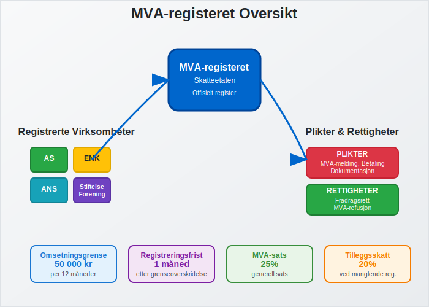
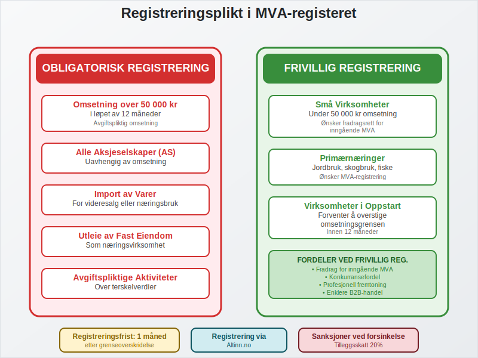
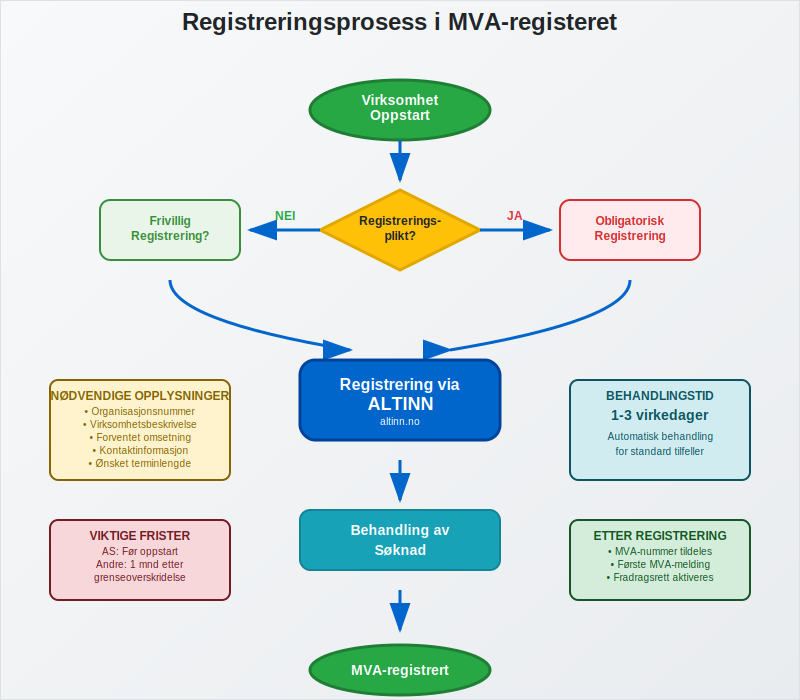
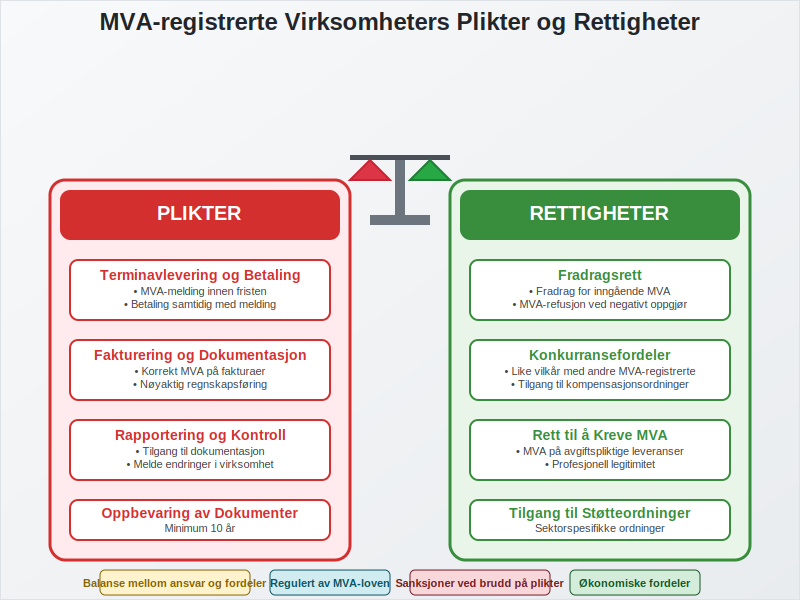
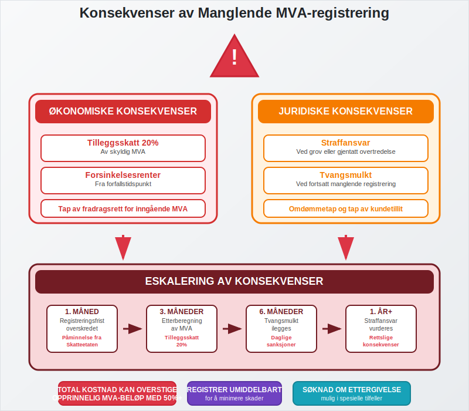
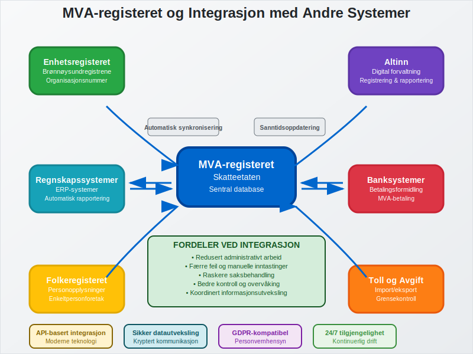

---
title: "Hva er MVA-registeret?"
meta_title: "Hva er MVA-registeret?"
meta_description: '**MVA-registeret** er Skatteetatens offisielle register over alle virksomheter som er registrert for [merverdiavgift](/blogs/regnskap/hva-er-avgiftsplikt-mva "H...'
slug: hva-er-mva-registeret
type: blog
layout: pages/single
---

**MVA-registeret** er Skatteetatens offisielle register over alle virksomheter som er registrert for [merverdiavgift](/blogs/regnskap/hva-er-avgiftsplikt-mva "Hva er Avgiftsplikt (MVA)? Komplett Guide til Merverdiavgift i Norge") i Norge. Registeret fungerer som grunnlaget for MVA-systemet og sikrer at alle avgiftspliktige virksomheter oppfyller sine forpliktelser overfor staten. For [aksjeselskaper](/blogs/regnskap/hva-er-et-aksjeselskap "Hva er et Aksjeselskap? Komplett Guide til AS i Norge") og andre selskapsformer er MVA-registrering ofte obligatorisk fra oppstart.

For en grundig innføring i [Merverdiavgift](/blogs/regnskap/merverdiavgift "Merverdiavgift: Komplett Guide til MVA i Norge"), se vår hovedartikkel om MVA.

## Hvem MÃ¥ Registrere Seg i MVA-registeret?

Registreringsplikt i MVA-registeret avhenger av flere faktorer, hvor **omsetningsgrensen** er den viktigste. Virksomheter må registrere seg når de oppfyller bestemte kriterier for avgiftspliktig omsetning.

### Obligatorisk Registrering

Følgende virksomheter **må** registrere seg i MVA-registeret:

* **Virksomheter med omsetning over 50 000 kr** i løpet av 12 måneder
* **Alle aksjeselskaper** uavhengig av omsetning
* **Virksomheter som driver med avgiftspliktige aktiviteter** som overstiger terskelverdiene
* **Import av varer** for videresalg eller bruk i **[næringsvirksomhet](/blogs/regnskap/naeringsvirksomhet "Hva er næringsvirksomhet? Definisjon og Regnskapsmessig Behandling")**
* **Utleie av fast eiendom** når dette utgjør **[næringsvirksomhet](/blogs/regnskap/naeringsvirksomhet "Hva er næringsvirksomhet? Definisjon og Regnskapsmessig Behandling")**

### Frivillig Registrering

Noen virksomheter kan velge å registrere seg frivillig:

* **Små virksomheter under 50 000 kr omsetning** som ønsker fradragsrett for inngående MVA
* [**Primærnæringer**](/blogs/regnskap/primarnaring "Hva er primærnæring? Komplett Guide til Primærnæring i Regnskap") som ønsker å være MVA-registrert
* **Virksomheter i oppstartsfase** som forventer å overstige omsetningsgrensen

## Registreringsprosessen

Registrering i MVA-registeret skjer gjennom [Altinn](/blogs/regnskap/hva-er-altinn "Hva er Altinn? Komplett Guide til Norges Digitale Forvaltningsplattform") og er en del av den generelle virksomhetsregistreringen. Prosessen varierer avhengig av virksomhetstype og tidspunkt for registrering.

### Registrering ved Oppstart

| Virksomhetstype | Registreringstidspunkt | Spesielle krav |
|-----------------|------------------------|----------------|
| Aksjeselskap | Før oppstart av virksomhet | Obligatorisk uavhengig av omsetning |
| Enkeltpersonforetak | Innen 1 måned etter oppstart | Kun hvis omsetning > 50 000 kr |
| Ansvarlig selskap | Før oppstart av virksomhet | Avhenger av planlagt omsetning |
| Stiftelse/Forening | Ved avgiftspliktig aktivitet | Kun for avgiftspliktige aktiviteter |

### Registrering Underveis i Drift

Virksomheter som ikke var registreringspliktige ved oppstart, men som senere overstiger omsetningsgrensen, må registrere seg **innen 1 måned** etter at grensen er overskredet.

## Plikter og Rettigheter

MVA-registrering medfører både **plikter** og **rettigheter** som virksomheten må forholde seg til. Disse er regulert i merverdiavgiftsloven og påvirker den daglige driften betydelig.

### Hovedplikter for MVA-registrerte Virksomheter

**Terminavlevering og Betaling:**
* Levere MVA-melding innen fristen (vanligvis den 10. i måneden etter terminen)
* Betale skyldig MVA samtidig med innlevering av melding
* Oppbevare dokumentasjon i minimum 10 år

**Fakturering og Dokumentasjon:**
* Utstede [fakturaer](/blogs/regnskap/hva-er-en-faktura "Hva er en Faktura? En Guide til Norske Fakturakrav") med korrekt MVA-behandling
* Føre nøyaktig [regnskap](/blogs/regnskap/hva-er-regnskap "Hva er Regnskap? Komplett Guide til Regnskapsføring i Norge") over alle transaksjoner
* Dokumentere alle inn- og utgående MVA-poster

**Rapportering og Kontroll:**
* Gi Skatteetaten tilgang til regnskaper og dokumentasjon ved kontroll
* Melde endringer i virksomheten som påvirker MVA-registreringen
* Følge gjeldende regnskapsregler og [bokføringsplikt](/blogs/regnskap/hva-er-bokforingsplikt "Hva er Bokføringsplikt? Komplett Guide til Lovpålagt Bokføring i Norge")

### Rettigheter for MVA-registrerte Virksomheter

**Fradragsrett:**
* **Fradrag for inngående MVA** på innkjøp til virksomheten
* Refusjon av MVA ved negativt MVA-oppgjør
* Fradrag for MVA på [anleggsmidler](/blogs/regnskap/hva-er-anleggsmidler "Hva er Anleggsmidler? Komplett Guide til Varige Driftsmidler") og driftskostnader

**Konkurransefordeler:**
* Mulighet til å konkurrere på like vilkår med andre MVA-registrerte virksomheter
* Tilgang til MVA-kompensasjonsordninger for enkelte sektorer
* Rett til å kreve MVA av kunder på avgiftspliktige leveranser

## MVA-Terminer og Rapportering

MVA-registrerte virksomheter må rapportere og betale MVA i henhold til fastsatte terminer. Terminlengden avhenger av virksomhetens størrelse og type.

### Terminoversikt

| Termintype | Omsetningsgrense | Rapporteringsfrekvens | Betalingsfrist |
|------------|------------------|----------------------|----------------|
| **Månedstermin** | Over 5 mill. kr | Hver måned | 10. i påfølgende måned |
| **Tomonederstermin** | 1-5 mill. kr | Annenhver måned | 10. i påfølgende måned |
| **Årstermin** | Under 1 mill. kr | Én gang per år | 10. mai påfølgende år |

### Spesielle Terminer

* **Sesongvirksomheter** kan få tilpassede terminer
* **Nyetablerte virksomheter** starter ofte med månedstermin
* **Virksomheter med variabel omsetning** kan søke om terminendring

## Konsekvenser av Manglende Registrering

Å unnlate å registrere seg i MVA-registeret når man er pliktig til det, kan få alvorlige konsekvenser både økonomisk og juridisk.

### Økonomiske Konsekvenser

**Tilleggsskatt og Renter:**
* **Tilleggsskatt** på 20% av skyldig MVA
* **Forsinkelsesrenter** fra forfallstidspunkt
* Tap av fradragsrett for inngående MVA i perioden før registrering

**Etterberegning:**
* Skatteetaten kan kreve MVA for hele perioden virksomheten skulle vært registrert
* Ingen fradrag for inngående MVA i ikke-registrert periode
* Mulige [forsinkelsesgebyrer](/blogs/regnskap/hva-er-forsinkelsesgebyr "Hva er Forsinkelsesgebyr? Komplett Guide til Gebyrer og Sanksjoner") på fakturaer

### Juridiske Konsekvenser

* **Straffansvar** ved grov eller gjentatt overtredelse
* Mulig **tvangsmulkt** ved fortsatt manglende registrering
* Problemer med [leverandørforhold](/blogs/regnskap/hva-er-leverandor "Hva er Leverandør? Komplett Guide til Leverandørstyring og Innkjøp") og kundetillit

## Avregistrering fra MVA-registeret

Virksomheter kan avregistrere seg fra MVA-registeret når de ikke lenger oppfyller registreringskravene eller ved opphør av virksomheten.

### NÃ¥r Kan Man Avregistrere Seg?

* **Omsetning under 50 000 kr** i 12 måneder og forventes å forbli under grensen
* **Opphør av virksomhet** eller avgiftspliktig aktivitet
* **Endring av virksomhetsform** som ikke krever MVA-registrering
* **Salg eller overdragelse** av virksomheten

### Avregistreringsprosess

1. **Søknad om avregistrering** via Altinn
2. **Innlevering av siste MVA-melding** med sluttoppgjør
3. **Dokumentasjon** av årsak til avregistrering
4. **Oppgjør av eventuell restskatt** eller krav på refusjon

## Sammenheng med Andre Registre

MVA-registeret er tett integrert med andre offentlige registre og påvirker virksomhetens forhold til flere myndigheter.

### Integrasjon med Enhetsregisteret

Se vår detaljerte artikkel om [Enhetsregisteret](/blogs/regnskap/hva-er-enhetsregisteret "Hva er Enhetsregisteret?") for full oversikt over registerets formål og innhold.

* **Automatisk kobling** til [organisasjonsnummer](/blogs/regnskap/hva-er-organisasjonsnummer "Hva er et Organisasjonsnummer? Komplett Guide til Norges Unike Identifikator") i Enhetsregisteret
* **Oppdatering av virksomhetsinformasjon** reflekteres i begge registre
* **Koordinert behandling** av endringer og avregistreringer

### Påvirkning på Regnskapsføring

MVA-registrering påvirker hvordan virksomheten må føre [regnskap](/blogs/regnskap/hva-er-regnskap "Hva er Regnskap? Komplett Guide til Regnskapsføring i Norge"):

* **Krav til MVA-spesifikasjon** i regnskapet
* **Separate konti** for utgående og inngående MVA
* **MÃ¥nedlig avstemming** av MVA-konti mot MVA-melding
* **Dokumentasjonskrav** for alle MVA-relaterte transaksjoner

## Digitalisering og Fremtidige Endringer

MVA-systemet gjennomgår kontinuerlig modernisering for å forenkle prosessene for både virksomheter og myndigheter.

### Pågående Digitaliseringstiltak

* **Automatisk rapportering** fra kassasystemer og regnskapssystemer
* **Sanntidsrapportering** for store virksomheter
* **Forbedret integrasjon** med [ERP-systemer](/blogs/regnskap/hva-er-erp-system "Hva er ERP-system? Komplett Guide til Enterprise Resource Planning")
* **Kunstig intelligens** for automatisk kontroll og validering

### Planlagte Endringer

* **Reduserte rapporteringsfrister** for enkelte virksomhetstyper
* **Utvidet bruk av elektronisk fakturering** og automatisk MVA-beregning
* **Strengere krav til dokumentasjon** og sporbarhet
* **Økt fokus på internasjonale transaksjoner** og grensehandel

## Praktiske Tips for MVA-registrerte Virksomheter

For å sikre korrekt håndtering av MVA-forpliktelser, bør virksomheter følge etablerte beste praksis.

### MÃ¥nedlige Rutiner

* **Avstem MVA-konti** mot [hovedbok](/blogs/regnskap/hva-er-hovedbok "Hva er Hovedbok? Komplett Guide til Regnskapets Hovedbok") hver måned
* **Kontroller fakturaer** for korrekt MVA-behandling
* **Forbered MVA-melding** i god tid før fristen
* **Sett av midler** til MVA-betaling

### Ã…rlige Kontroller

* **Gjennomgå registreringsstatus** og vurder behov for endringer
* **Kontroller fradragsrett** for større anskaffelser
* **Vurder terminlengde** basert på omsetningsutvikling
* **Oppdater rutiner** i henhold til regelverksendringer

### Dokumentasjon og Arkivering

* **Oppbevar alle MVA-relaterte dokumenter** i minimum 10 år
* **Organiser dokumentasjon** for enkel tilgang ved kontroller
* **Sikkerhetskopier** av elektroniske regnskapsdata
* **Regelmessig oppdatering** av regnskapssystemer og rutiner

MVA-registeret er en hjørnestein i det norske skattesystemet og krever nøye oppmerksomhet fra alle registrerte virksomheter. Ved å forstå kravene og følge etablerte rutiner, kan virksomheter sikre korrekt håndtering av sine MVA-forpliktelser og unngå kostbare feil og sanksjoner.

