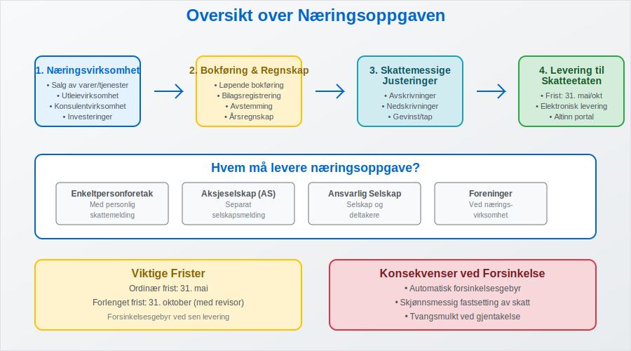
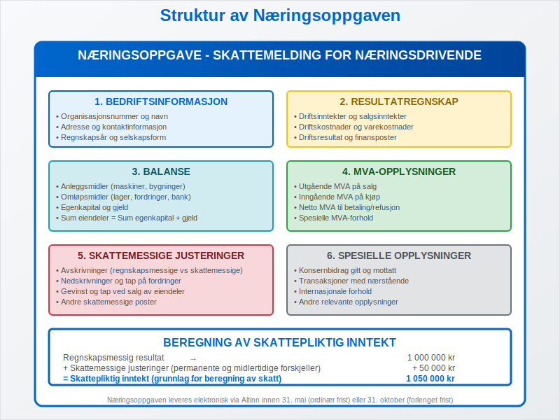
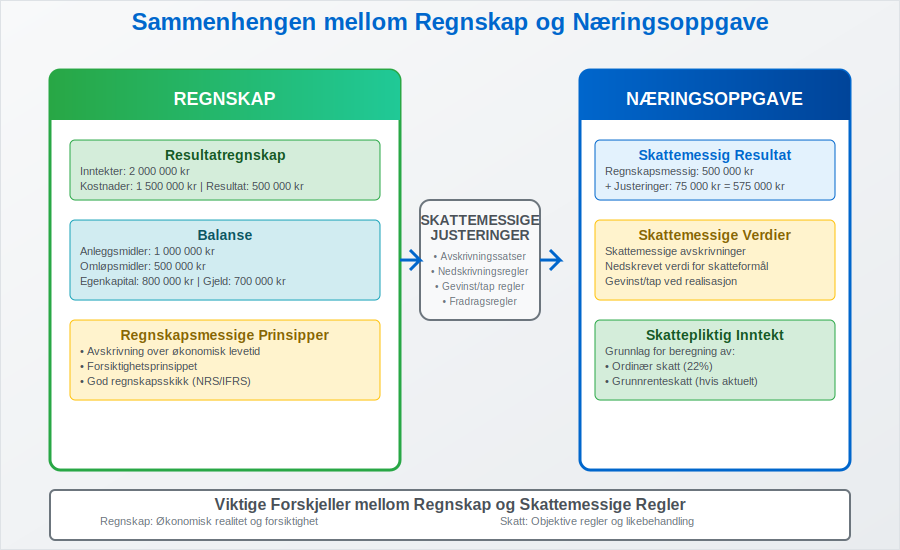

---
title: "Hva er næringsoppgave?"
seoTitle: "Næringsoppgave | Hvem må levere, frister og innhold"
description: "Næringsoppgaven er årlig rapportering til Skatteetaten for næringsdrivende. Lær hvem som må levere, frister, innhold og sammenhengen med regnskapet."
summary: "Kort guide til næringsoppgaven: hvem den gjelder for, hvilke opplysninger som kreves og hvordan du leverer korrekt og i tide."
---

**Næringsoppgaven** er en sentral del av det norske skattesystemet og representerer den årlige skattemeldingen som alle norske bedrifter må levere til Skatteetaten. Som en viktig komponent i **[opplysningsplikten](/blogs/regnskap/hva-er-opplysningsplikt "Hva er opplysningsplikt? Komplett guide til rapporteringsplikt")**, fungerer næringsoppgaven som grunnlaget for beregning av **skatt på næringsinntekt** og er tett knyttet til bedriftens [regnskap](/blogs/regnskap/hva-er-regnskap "Hva er Regnskap? Komplett Guide til Regnskapsføring i Norge") og [bokføring](/blogs/regnskap/hva-er-bokforing "Hva er Bokføring? En Komplett Guide til Norsk Bokføringspraksis").

Næringsoppgaven er ikke bare en skattemessig forpliktelse, men også et viktig verktøy for å dokumentere bedriftens økonomiske aktivitet og sikre korrekt skatteberegning. For bedrifter som driver med [fakturasalg](/blogs/regnskap/hva-er-fakturasalg "Hva er Fakturasalg? Komplett Guide til Kredittgivning og Debitorhåndtering") eller har komplekse [driftsinntekter](/blogs/regnskap/hva-er-driftsinntekter "Hva er Driftsinntekter? Komplett Guide til Inntektsføring i Regnskap"), er næringsoppgaven spesielt viktig for å sikre korrekt rapportering.

For detaljer om **Næringsoppgave 1**, se [Næringsoppgave 1](/blogs/regnskap/naeringsoppgave-1 "Hva er Næringsoppgave 1? Komplett Guide til Næringsoppgave 1").

Skattefunn-fradrag rapporteres som del av skattemeldingen og næringsoppgaven. Les mer i [Skattefunn](/blogs/regnskap/skattefunn "Skattefunn “ Skatteinsentiver for Forskning og Utvikling i Norge").

## Hvem Må Levere Næringsoppgave?

Alle som driver **[næringsvirksomhet](/blogs/regnskap/naeringsvirksomhet "Hva er næringsvirksomhet? Definisjon og Regnskapsmessig Behandling")** i Norge har plikt til å levere næringsoppgave, uavhengig av om virksomheten gir overskudd eller underskudd. Dette gjelder for:

### Selskapsformer som Må Levere Næringsoppgave

| Selskapsform | Leveringsplikt | Særlige Krav |
|--------------|----------------|--------------|
| **[Enkeltpersonforetak](/blogs/regnskap/hva-er-enkeltpersonforetak "Hva er Enkeltpersonforetak? Komplett Guide til ENK i Norge")** | Ja | Leveres sammen med personlig skattemelding |
| **[Aksjeselskap (AS)](/blogs/regnskap/hva-er-et-aksjeselskap "Hva er et Aksjeselskap? Komplett Guide til AS i Norge")** | Ja | Separat selskapsmelding |
| **[Ansvarlig selskap](/blogs/regnskap/ansvarlig-selskap "Ansvarlig Selskap (ANS): Komplett Guide til Norsk Regnskap og Ansvarsstruktur")** | Ja | Både selskap og deltakere |
| **[Foreninger](/blogs/regnskap/hva-er-forening "Hva er en Forening? Komplett Guide til Foreninger i Norge")** | Ja, hvis næringsdrift | Kun ved næringsvirksomhet |

### Aktiviteter som Utløser Leveringsplikt

* **Salg av varer eller tjenester** med fortjenesteformål
* **Utleievirksomhet** utover egen bolig
* **Konsulentvirksomhet** og frilansarbeid
* **Investeringsvirksomhet** med aktiv forvaltning
* **Landbruk og skogbruk**

Selv **[holdingselskaper](/blogs/regnskap/hva-er-holdingselskap "Hva er Holdingselskap? Komplett Guide til Holdingstrukturer i Norge")** som primært forvalter investeringer må levere næringsoppgave dersom de har aktiv forvaltning eller andre næringsinntekter.

## Innhold og Struktur i Næringsoppgaven

Næringsoppgaven bygger på bedriftens [årsregnskap](/blogs/regnskap/hva-er-regnskap "Hva er Regnskap? Komplett Guide til Regnskapsføring i Norge") og inneholder detaljert informasjon om bedriftens økonomiske aktivitet gjennom året.

### Hovedseksjoner i Næringsoppgaven

#### 1. Resultatregnskap og Driftsinntekter

Denne seksjonen dokumenterer alle bedriftens inntekter og kostnader:

* **[Driftsinntekter](/blogs/regnskap/hva-er-driftsinntekter "Hva er Driftsinntekter? Komplett Guide til Inntektsføring i Regnskap"):** Salg av varer og tjenester
* **[Driftskostnader](/blogs/regnskap/hva-er-driftskostnader "Hva er Driftskostnader? Komplett Guide til Kostnadsføring i Regnskap"):** Alle kostnader knyttet til drift
* **[Driftsresultat](/blogs/regnskap/hva-er-driftsresultat "Hva er Driftsresultat? Beregning og Analyse av Driftsresultat"):** Forskjellen mellom inntekter og kostnader

#### 2. Balanse og Eiendeler

* **[Anleggsmidler](/blogs/regnskap/hva-er-anleggsmidler "Hva er Anleggsmidler? Komplett Guide til Varige Driftsmidler"):** Maskiner, bygninger, immaterielle rettigheter
* **Omløpsmidler:** [Lagerbeholdning](/blogs/regnskap/hva-er-lagerbeholdning "Hva er Lagerbeholdning? Komplett Guide til Lagerføring og Verdivurdering"), [kundefordringer](/blogs/regnskap/hva-er-kundefordring "Hva er Kundefordring? Komplett Guide til Fordringshåndtering"), bankinnskudd
* **[Egenkapital](/blogs/regnskap/hva-er-egenkapital "Hva er Egenkapital? Komplett Guide til Egenkapital i Regnskap"):** Bedriftens nettoverdi
* **Gjeld:** [Leverandørgjeld](/blogs/regnskap/hva-er-leverandorgjeld "Hva er Leverandørgjeld? Komplett Guide til Kreditorhåndtering"), lån og andre forpliktelser

#### 3. MVA-opplysninger

For [MVA-registrerte](/blogs/regnskap/hva-er-avgiftsplikt-mva "Hva er Avgiftsplikt (MVA)? Komplett Guide til Merverdiavgift i Norge") bedrifter må næringsoppgaven inneholde:

* **Utgående MVA** på salg
* **Inngående MVA** på kjøp
* **Netto MVA** til betaling eller refusjon
* Spesielle MVA-forhold som [fritaksmetoden](/blogs/regnskap/hva-er-fritaksmetoden "Hva er Fritaksmetoden? Komplett Guide til MVA-fritak i Norge")

## Frister og Leveringsrutiner

**Leveringsfristen** for næringsoppgaven varierer avhengig av selskapsform og regnskapsår:

### Leveringsfrister 2024

| Selskapstype | Ordinær frist | Forlenget frist | Betingelser |
|--------------|---------------|-----------------|-------------|
| **Enkeltpersonforetak** | 31. mai | 31. oktober | Med revisor eller regnskapsfører |
| **Aksjeselskap** | 31. mai | 31. oktober | Med revisor |
| **Ansvarlig selskap** | 31. mai | 31. oktober | Med revisor |

### Konsekvenser ved Forsinket Levering

* **[Forsinkelsesgebyr](/blogs/regnskap/hva-er-forsinkelsesgebyr "Hva er Forsinkelsesgebyr? Komplett Guide til Gebyrer ved Forsinket Levering"):** Automatisk gebyr ved sen levering
* **Skjønnsmessig fastsetting:** Skatteetaten kan fastsette skatt skjønnsmessig
* **Tvangsmulkt:** Ved gjentatte forsinkelser

For å unngå forsinkelser er det viktig å ha god [internkontroll](/blogs/regnskap/hva-er-internkontroll "Hva er Internkontroll? Komplett Guide til Internkontrollsystemer") og systematisk oppfølging av regnskapsarbeidet gjennom året.

## Sammenheng Mellom Regnskap og Næringsoppgave

Næringsoppgaven bygger direkte på bedriftens [årsregnskap](/blogs/regnskap/hva-er-regnskap "Hva er Regnskap? Komplett Guide til Regnskapsføring i Norge"), men inneholder også skattemessige justeringer som kan avvike fra regnskapsmessige prinsipper.

### Viktige Forskjeller Mellom Regnskap og Skattemessige Regler

#### Avskrivninger

* **Regnskapsmessige avskrivninger:** Basert på [avskrivning](/blogs/regnskap/hva-er-avskrivning "Hva er Avskrivning? Komplett Guide til Avskrivninger i Regnskap") over økonomisk levetid
* **Skattemessige avskrivninger:** Følger Skatteetatens satser og regler
* **Maksimale avskrivningssatser** varierer per aktivatype

#### Nedskrivninger og Tap

* **[Nedskrivning](/blogs/regnskap/hva-er-nedskrivning "Hva er Nedskrivning? Komplett Guide til Nedskrivning av Eiendeler") av eiendeler:** Ulike regler for regnskap og skatt
* **Tap på fordringer:** Spesielle krav til dokumentasjon for skattemessig fradrag
* **Gevinst og tap ved salg:** Forskjellig behandling av [kapitalgevinst](/blogs/regnskap/hva-er-kapitalgevinst "Hva er Kapitalgevinst? Komplett Guide til Gevinst og Tap ved Salg")

### Praktisk Tilnærming til Regnskapsføring

For å sikre korrekt næringsoppgave er det viktig med:

* **Systematisk [bokføring](/blogs/regnskap/hva-er-bokforing "Hva er Bokføring? En Komplett Guide til Norsk Bokføringspraksis")** gjennom året
* **Korrekt [kontering](/blogs/regnskap/hva-er-kontering "Hva er Kontering? Komplett Guide til Kontering i Bokføring")** av alle transaksjoner
* **Regelmessig [avstemming](/blogs/regnskap/hva-er-avstemming "Hva er Avstemming? Komplett Guide til Regnskapsavstemming")** av kontoer
* **Dokumentasjon** av alle [bilag](/blogs/regnskap/hva-er-bilag "Hva er Bilag? Komplett Guide til Regnskapsbilag og Dokumentasjon")

## Spesielle Forhold i Næringsoppgaven

### Konsernforhold og Konsernbidrag

For bedrifter som er del av et [konsern](/blogs/regnskap/hva-er-konsern "Hva er Konsern? Komplett Guide til Konsernstrukturer i Norge"), må næringsoppgaven inneholde opplysninger om:

* **[Konsernbidrag](/blogs/regnskap/hva-er-konsernbidrag "Hva er Konsernbidrag? Komplett Guide til Konsernbidrag i Norge")** gitt og mottatt
* **[Transaksjoner med nærstående](/blogs/regnskap/naerstaende "Nærstående Parter i Regnskap")** selskaper
* **Konsolideringsopplysninger** for morselskaper

### Særlige Bransjer og Aktiviteter

#### Landbruk og [Primærnæringer](/blogs/regnskap/primarnaring "Hva er primærnæring? Komplett Guide til Primærnæring i Regnskap")

* **[Jordbruksfradrag](/blogs/regnskap/hva-er-jordbruksfradrag "Hva er Jordbruksfradrag? Komplett Guide til Skattefradrag i Landbruket"):** Spesielle fradragsregler
* **Produksjonstilskudd:** Særlig behandling av offentlige tilskudd
* **Biologiske eiendeler:** Spesiell verdivurdering av husdyr og avlinger

#### Finansielle Tjenester

* **Investeringsselskaper:** Spesielle regler for [investeringsselskap](/blogs/regnskap/hva-er-investeringsselskap "Hva er Investeringsselskap? Komplett Guide til Investeringsselskaper i Norge")
* **Forsikringsselskaper:** Særlige reservekrav og regnskapsregler
* **Banker:** Spesielle krav til tapsavsetninger

## Digitalisering og Fremtidige Utviklinger

Næringsoppgaven blir stadig mer digitalisert, med økt bruk av:

### Automatisering og Integrasjon

* **[API-integrasjon](/blogs/regnskap/api-integrasjon-automatisering-regnskap "API-integrasjon og Automatisering i Regnskap - Komplett Guide"):** Direkte overføring fra regnskapssystem
* **Automatisk datavalidering:** Reduserer feil og mangler
* **Sanntidsrapportering:** Raskere behandling og tilbakemelding

### Nye Rapporteringskrav

* **[ESG-rapportering](/blogs/regnskap/hva-er-esg "Hva er ESG? Komplett Guide til Miljø, Sosial og Styring i Regnskap"):** Økt fokus på bærekraft
* **[CSRD-direktivet](/blogs/regnskap/hva-er-csrd "Hva er CSRD? Komplett Guide til Corporate Sustainability Reporting Directive"):** Nye krav til bærekraftsrapportering
* **Digitale kvitteringer:** Redusert papirbruk og økt effektivitet ved bruk av digitale [kvitteringer](/blogs/regnskap/kvittering "Hva er Kvittering? En Guide til Kvitteringskrav i Norsk Regnskap")

## Praktiske Tips for Korrekt Næringsoppgave

### Forberedelser Gjennom Året

For å sikre en problemfri leveringsprosess:

* **Månedlig regnskapsavslutning:** Hold regnskapet oppdatert
* **Kvartalsvis gjennomgang:** Identifiser og korriger feil tidlig
* **Dokumentasjon:** Oppbevar alle [bilag](/blogs/regnskap/hva-er-bilag "Hva er Bilag? Komplett Guide til Regnskapsbilag og Dokumentasjon") systematisk
* **Backup:** Sikre regelmessig sikkerhetskopi av regnskapsdata

### Vanlige Feil og Hvordan Unngå Dem

#### Feil i Inntektsføring

* **Periodisering:** Sikre at inntekter føres i riktig periode
* **[Fakturasalg](/blogs/regnskap/hva-er-fakturasalg "Hva er Fakturasalg? Komplett Guide til Kredittgivning og Debitorhåndtering"):** Korrekt behandling av utestående fordringer
* **Forskuddsbetalinger:** Riktig håndtering av [forskuddsbetaling](/blogs/regnskap/hva-er-forskuddsbetaling "Hva er forskuddsbetaling? Komplett Guide til Forskuddsbetalinger i Regnskap")

#### MVA-relaterte Feil

* **Feil MVA-koder:** Bruk korrekte koder for ulike transaksjoner
* **Periodisering av MVA:** Sikre at MVA føres i riktig periode
* **Dokumentasjon:** Oppbevar alle [fakturaer](/blogs/regnskap/hva-er-en-faktura "Hva er en Faktura? En Guide til Norske Fakturakrav") og [kvitteringer](/blogs/regnskap/kvittering "Hva er Kvittering? En Guide til Kvitteringskrav i Norsk Regnskap")

### Bruk av Profesjonell Hjelp

Mange bedrifter velger å bruke:

* **Autoriserte regnskapsførere:** For løpende bokføring og regnskap
* **Revisorer:** For kvalitetssikring og attestering
* **Skatterådgivere:** For komplekse skattemessige spørsmål

## Kontroll og Oppfølging fra Skatteetaten

Skatteetaten har omfattende kontrollmyndighet over næringsoppgaver:

### Typer Kontroller

* **Automatisk kontroll:** Systembasert validering av innsendte data
* **Stikkprøvekontroller:** Tilfeldig utvalgte bedrifter
* **Risikobaserte kontroller:** Fokus på høyrisikobedrifter og -bransjer
* **Bokettersyn:** Detaljert gjennomgang av regnskap og dokumentasjon

### Konsekvenser ved Feil

* **Tilleggsskatt:** Ved forsettlige eller grovt uaktsomme feil
* **Renter:** På etterbetalt skatt
* **Gebyrer:** For manglende eller forsinket levering

## Konklusjon

Næringsoppgaven er en fundamental del av norsk næringslivs skattemessige forpliktelser og krever systematisk tilnærming og god forståelse av sammenhengen mellom [regnskap](/blogs/regnskap/hva-er-regnskap "Hva er Regnskap? Komplett Guide til Regnskapsføring i Norge") og skatteregler. Ved å opprettholde god [bokføringspraksis](/blogs/regnskap/hva-er-bokforing "Hva er Bokføring? En Komplett Guide til Norsk Bokføringspraksis") gjennom året, sikre korrekt dokumentasjon og holde seg oppdatert på regelverksendringer, kan bedrifter levere korrekte næringsoppgaver til rett tid.

For bedrifter som ønsker å optimalisere sin regnskapsprosess og sikre korrekt næringsoppgave, anbefales det å investere i moderne regnskapssystemer med [API-integrasjon](/blogs/regnskap/api-integrasjon-automatisering-regnskap "API-integrasjon og Automatisering i Regnskap - Komplett Guide") og å etablere gode rutiner for løpende regnskapsarbeid og kvalitetskontroll.
**Næringsoppgaven** er en sentral del av det norske skattesystemet og representerer den årlige skattemeldingen som alle norske bedrifter må levere til Skatteetaten. Som en viktig komponent i **[opplysningsplikten](/blogs/regnskap/hva-er-opplysningsplikt "Hva er opplysningsplikt? Komplett guide til rapporteringsplikt")**, fungerer næringsoppgaven som grunnlaget for beregning av **skatt på næringsinntekt** og er tett knyttet til bedriftens [regnskap](/blogs/regnskap/hva-er-regnskap "Hva er Regnskap? Komplett Guide til Regnskapsføring i Norge") og [bokføring](/blogs/regnskap/hva-er-bokforing "Hva er Bokføring? En Komplett Guide til Norsk Bokføringspraksis").

Næringskode er også påkrevd i næringsoppgaven for å spesifisere bransjetilhørighet, og påvirker hvordan Skatteetaten klassifiserer virksomheten. Se [Næringskode](/blogs/regnskap/naeringskode "Næringskode “ Guide til bransjeklassifisering og næringskoder").

