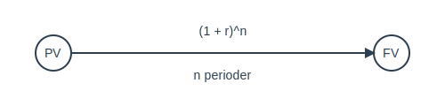

---
title: "Hva er Nåverdi?"
seoTitle: "Hva er Nåverdi?"
meta_description: '**Nåverdi** (_Present Value_) er dagens verdi av fremtidige kontantstrømmer diskontert med en gitt rente. Dette er et sentralt begrep i regnskap, finans og in...'
slug: hva-er-naverdi
type: blog
layout: pages/single
---

**Nåverdi** (_Present Value_) er dagens verdi av fremtidige kontantstrømmer diskontert med en gitt rente. Dette er et sentralt begrep i regnskap, finans og investeringsanalyse som reflekterer *tidsverdien av penger*.

## Hva er Nåverdi?

Nåverdi måler hvor mye et fremtidig beløp er verdt **innenfor dagens pengeverdi**, basert på en diskonteringsrente. Dette hjelper deg å sammenligne beløp som inntreffer på ulike tidspunkter.

### Hvorfor er Nåverdi viktig?

* **Investeringsevaluering:** Vurder lønnsomhet ved å sammenligne nåverdi med kostnad.
* **Beslutningsgrunnlag:** Understøtter valg mellom alternative prosjekter gjennom [alternativkostnad](/blogs/regnskap/alternativkostnad "Alternativkostnad - Verdien av det nest beste alternativet").
* **Risikoanalyse:** Tar hensyn til usikkerhet og tidsaspekt ved å bruke en passende diskonteringsrente.

## Formel for Nåverdi

Den grunnleggende formelen for **nåverdi** er:

**PV = FV / (1 + r)^n**

Hvor:

* **PV** = Nåverdi (Present Value)
* **FV** = Fremtidig verdi (Future Value)
* **r** = Diskonteringsrente
* **n** = Antall perioder

## Eksempel på Beregning av Nåverdi

Anta at du skal motta **100 000 kr** om **3 år**, og diskonteringsrenten er **8 %**.

| Parameter           | Verdi      |
|---------------------|------------|
| Fremtidig verdi     | 100 000 kr |
| Diskonteringsrente  | 8 %        |
| Periode (år)        | 3          |

| Beregning                       | Resultat   |
|---------------------------------|------------|
| PV = 100 000 / (1 + 0,08)^3    | 79 383 kr  |

## Bruksområder for Nåverdi

Nåverdi brukes i flere sammenhenger i regnskap og finans:

* [Diskontering](/blogs/regnskap/hva-er-diskontering "Hva er Diskontering? Komplett Guide til Nåverdi og Diskonterte Kontantstrømmer")
* [Netto nåverdi (NPV)](/blogs/regnskap/hva-er-npv "Hva er NPV? Netto Nåverdi Analyse og Beregning")
* [Avkastning](/blogs/regnskap/hva-er-avkastning "Hva er Avkastning? Komplett Guide til Investeringsavkastning og Beregning")
* [Internrente](/blogs/regnskap/internrente "Internrente (IRR) Forklaring og Beregning i Regnskap")

## Relaterte Begreper

- [Alternativkostnad](/blogs/regnskap/alternativkostnad "Alternativkostnad - Verdien av det nest beste alternativet")
- [Avkastning](/blogs/regnskap/hva-er-avkastning "Hva er Avkastning? Komplett Guide til Investeringsavkastning og Beregning")
- [Diskontering](/blogs/regnskap/hva-er-diskontering "Hva er Diskontering? Komplett Guide til Nåverdi og Diskonterte Kontantstrømmer")
- [NPV](/blogs/regnskap/hva-er-npv "Hva er NPV? Netto Nåverdi Analyse og Beregning")
- [Internrente](/blogs/regnskap/internrente "Internrente (IRR) Forklaring og Beregning i Regnskap")

