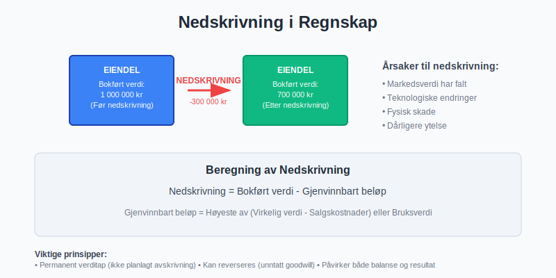
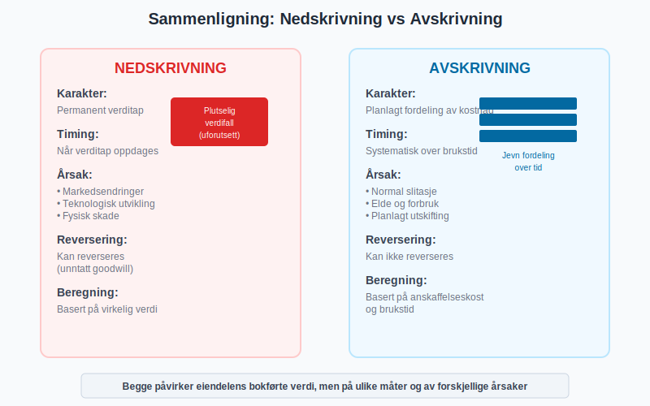
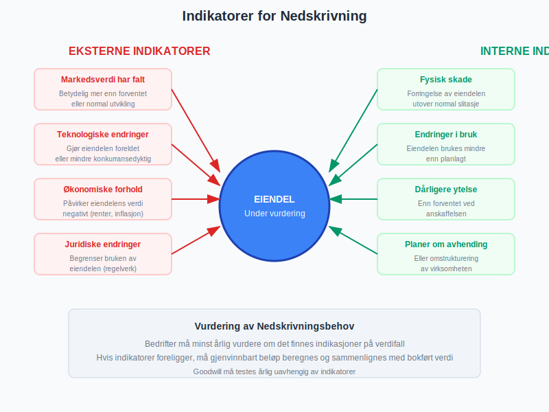
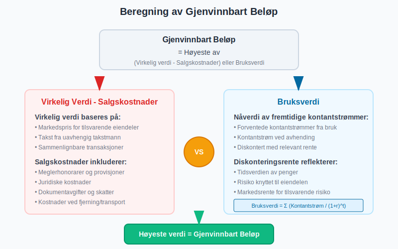
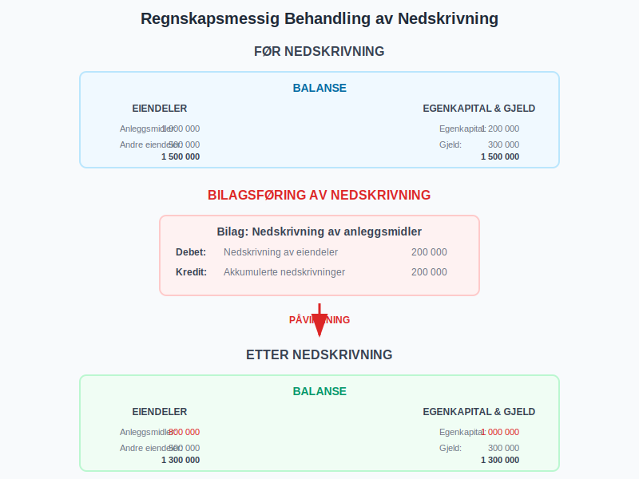
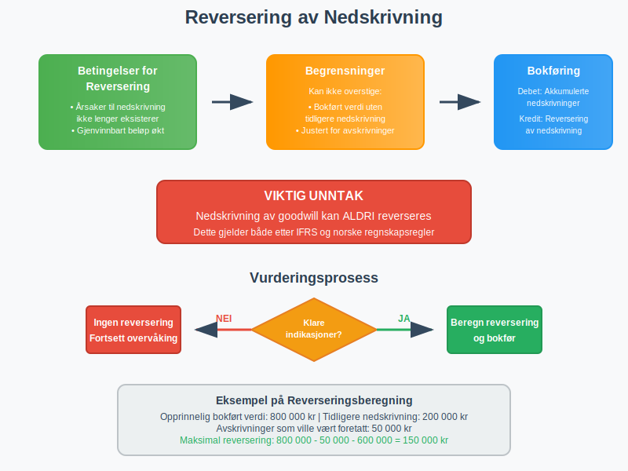
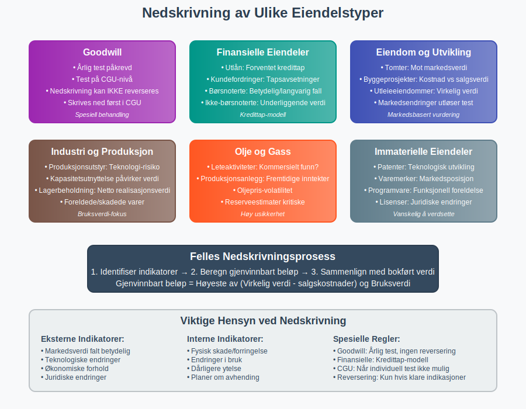
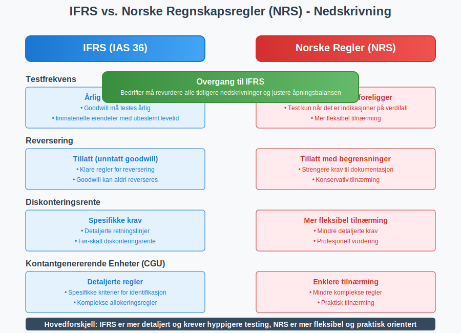
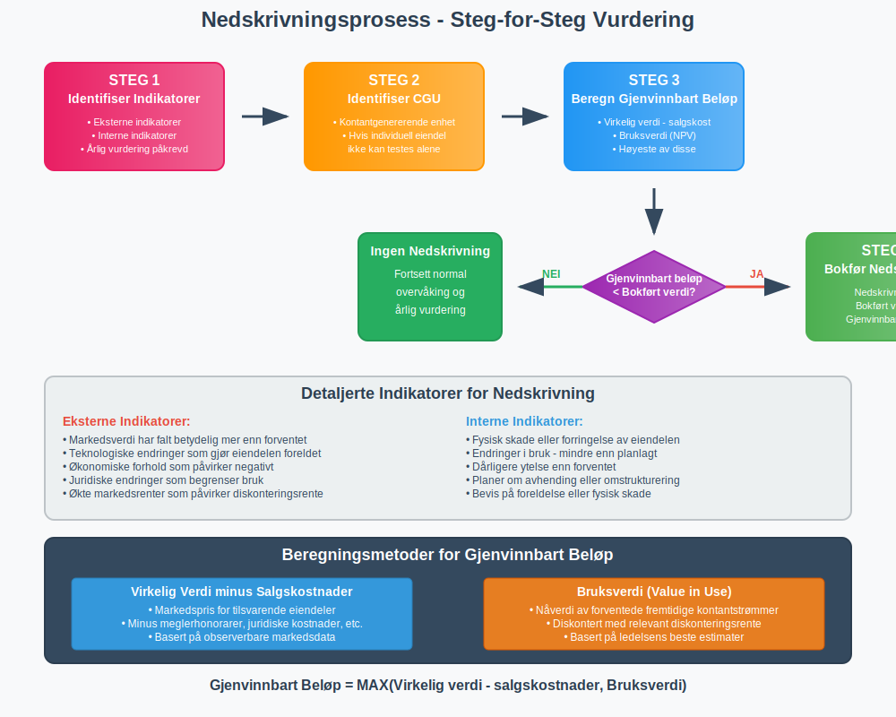
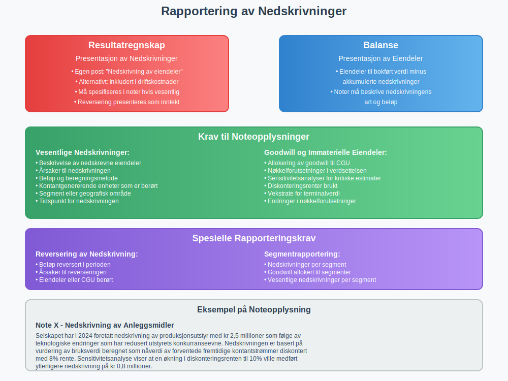

---
title: "Hva er Nedskrivning i Regnskap?"
meta_title: "Hva er Nedskrivning i Regnskap?"
meta_description: '**Nedskrivning** er en regnskapsmessig reduksjon av en [eiendels](/blogs/regnskap/hva-er-aktiva "Hva er Aktiva? Komplett Guide til Eiendeler i Regnskap") bokfø...'
slug: hva-er-nedskrivning
type: blog
layout: pages/single
---

**Nedskrivning** er en regnskapsmessig reduksjon av en [eiendels](/blogs/regnskap/hva-er-aktiva "Hva er Aktiva? Komplett Guide til Eiendeler i Regnskap") bokførte verdi når den virkelige verdien er lavere enn det som står i [balansen](/blogs/regnskap/hva-er-balanse "Hva er Balanse? Komplett Guide til Balanseregnskap"). Dette er en permanent verdireduksjon som skiller seg fra ordinære [avskrivninger](/blogs/regnskap/hva-er-avskrivning "Hva er Avskrivning i Regnskap? Metoder, Beregning og Regler").



## Definisjon og Grunnleggende Prinsipper

### Hva er Nedskrivning?

Nedskrivning oppstår når en eiendels **gjenvinnbare beløp** er lavere enn dens **bokførte verdi**. Det gjenvinnbare beløpet er det høyeste av:

* **Virkelig verdi** minus salgskostnader
* **Bruksverdi** (nåverdi av fremtidige kontantstrømmer)

### Forskjell mellom Nedskrivning og Avskrivning



| Aspekt | Nedskrivning | [Avskrivning](/blogs/regnskap/hva-er-avskrivning "Hva er Avskrivning i Regnskap? Metoder, Beregning og Regler") |
|--------|--------------|-------------|
| **Karakter** | Permanent verditap | Planlagt fordeling av kostnad |
| **Timing** | NÃ¥r verditap oppdages | Systematisk over brukstid |
| **Reversering** | Kan reverseres (unntatt goodwill) | Kan ikke reverseres |
| **Ã…rsak** | Markedsendringer, skade, teknologi | Normal slitasje og elde |
| **Beregning** | Basert på virkelig verdi | Basert på [anskaffelseskost](/blogs/regnskap/hva-er-anskaffelseskost "Hva er Anskaffelseskost? Komplett Guide til Beregning og Behandling") |

## Når Skal Nedskrivning Gjennomføres?

### Indikatorer på Verdifall

#### Eksterne Indikatorer
* **Markedsverdi** har falt betydelig mer enn forventet
* **Teknologiske endringer** som gjør eiendelen foreldet
* **Økonomiske forhold** som påvirker eiendelens verdi negativt
* **Juridiske endringer** som begrenser bruken av eiendelen

#### Interne Indikatorer
* **Fysisk skade** eller forringelse av eiendelen
* **Endringer i bruk** - eiendelen brukes mindre enn planlagt
* **DÃ¥rligere ytelse** enn forventet
* **Planer om avhending** eller omstrukturering



### Regelmessig Vurdering

Bedrifter må **minst årlig** vurdere om det finnes indikasjoner på verdifall for:

* [Anleggsmidler](/blogs/regnskap/hva-er-anleggsmidler "Hva er Anleggsmidler? Komplett Guide til Faste Eiendeler")
* [Immaterielle eiendeler](/blogs/regnskap/hva-er-imaterielle-eiendeler "Hva er Immaterielle Eiendeler? Komplett Guide til Immaterielle Rettigheter")
* [Goodwill](/blogs/regnskap/hva-er-goodwill "Hva er Goodwill? Komplett Guide til Goodwill i Regnskap")
* Investeringer i datterselskaper

## Beregning av Nedskrivning

### Grunnleggende Formel

**Nedskrivning = Bokført verdi - Gjenvinnbart beløp**

### Steg-for-Steg Prosess

#### Steg 1: Identifiser Kontantgenererende Enhet
Hvis en individuell eiendel ikke kan generere uavhengige kontantstrømmer, må nedskrivning vurderes på nivået av den **kontantgenererende enheten** (CGU).

#### Steg 2: Beregn Gjenvinnbart Beløp
Det gjenvinnbare beløpet er det høyeste av:

**Virkelig verdi minus salgskostnader:**
* Markedspris for tilsvarende eiendeler
* Minus kostnader ved salg (meglerhonorarer, juridiske kostnader, etc.)

**Bruksverdi:**
* Nåverdi av forventede fremtidige kontantstrømmer
* Diskontert med relevant diskonteringsrente



#### Steg 3: Sammenlign med Bokført Verdi
Hvis gjenvinnbart beløp < bokført verdi → Nedskrivning kreves

### Praktisk Eksempel

**Situasjon:** En produksjonsmaskin har følgende verdier:
* **Bokført verdi:** 800 000 kr
* **Virkelig verdi:** 650 000 kr
* **Salgskostnader:** 50 000 kr
* **Bruksverdi:** 580 000 kr

**Beregning:**
* Virkelig verdi minus salgskostnader: 650 000 - 50 000 = **600 000 kr**
* Bruksverdi: **580 000 kr**
* Gjenvinnbart beløp: max(600 000, 580 000) = **600 000 kr**
* Nedskrivning: 800 000 - 600 000 = **200 000 kr**

## Regnskapsmessig Behandling

### Bokføring av Nedskrivning

#### Ordinære Eiendeler
```
Debet: Nedskrivning av eiendeler    200 000
Kredit: Akkumulerte nedskrivninger  200 000
```

#### Oppskrevne Eiendeler
Hvis eiendelen tidligere er oppskrevet, reduseres først oppskrivningsreserven:

```
Debet: Oppskrivningsreserve         100 000
Debet: Nedskrivning av eiendeler    100 000
Kredit: Akkumulerte nedskrivninger  200 000
```



### Presentasjon i Regnskapet

#### Resultatregnskap
* **Nedskrivninger** presenteres som egen post eller inkludert i [driftskostnader](/blogs/regnskap/hva-er-driftskostnader "Hva er Driftskostnader? Komplett Guide til Driftskostnader i Regnskap")
* Må spesifiseres i noter hvis beløpet er vesentlig

#### Balanse
* **Eiendeler** vises til bokført verdi minus akkumulerte nedskrivninger
* **Noter** må beskrive nedskrivningens art og beløp

### Skattemessige Forhold

#### Fradragsrett
* **Regnskapsmessige nedskrivninger** gir ikke automatisk skattefradrag
* **Realiserte tap** ved salg gir fradrag
* **Midlertidige forskjeller** oppstår mellom regnskaps- og skattemessig verdi

#### Saldogrupper
For skattemessige formål følger nedskrivninger reglene for [avskrivninger](/blogs/regnskap/hva-er-avskrivning "Hva er Avskrivning i Regnskap? Metoder, Beregning og Regler") i relevante saldogrupper.

## Reversering av Nedskrivning

### NÃ¥r Kan Nedskrivning Reverseres?

Nedskrivning kan reverseres hvis det er **klare indikasjoner** på at:
* Ã…rsakene til nedskrivningen ikke lenger eksisterer
* Eiendelens gjenvinnbare beløp har økt

**Viktig unntak:** Nedskrivning av [goodwill](/blogs/regnskap/hva-er-goodwill "Hva er Goodwill? Komplett Guide til Goodwill i Regnskap") kan **aldri** reverseres.

### Begrensninger ved Reversering

Reversering kan ikke overstige:
* **Bokført verdi** eiendelen ville hatt uten tidligere nedskrivning
* Justert for [avskrivninger](/blogs/regnskap/hva-er-avskrivning "Hva er Avskrivning i Regnskap? Metoder, Beregning og Regler") som ville vært foretatt

### Bokføring av Reversering

```
Debet: Akkumulerte nedskrivninger   150 000
Kredit: Reversering av nedskrivning 150 000
```



## Spesielle Situasjoner

### Nedskrivning av Goodwill

#### Ã…rlig Test
* **Goodwill** må testes for verdifall minst årlig
* Testen gjøres på nivået av kontantgenererende enheter
* Nedskrivning kan **ikke** reverseres

#### Allokering av Nedskrivning
NÃ¥r en kontantgenererende enhet skal skrives ned:
1. **Goodwill** skrives ned først
2. **Andre eiendeler** skrives ned forholdsmessig

### Nedskrivning av Finansielle Eiendeler

#### Utlån og Fordringer
* Nedskrivning basert på **forventet kredittap**
* **Tapsavsetninger** bokføres mot [kundefordringer](/blogs/regnskap/hva-er-kundefordring "Hva er Kundefordring? Komplett Guide til Kundefordringer i Regnskap")

#### Investeringer
* **Børsnoterte aksjer:** Nedskrivning når verdifall er betydelig eller langvarig
* **Ikke-børsnoterte investeringer:** Basert på vurdering av underliggende verdier



## Bransjespesifikke Forhold

### Eiendom og Utvikling

#### Utviklingsprosjekter
* **Tomter og byggeprosjekter** vurderes mot markedsverdi
* **Nedskrivning** når prosjektkostnader overstiger forventet salgsverdi

#### Utleieeiendommer
* Vurderes mot **virkelig verdi** eller **gjenvinnbart beløp**
* Markedsendringer kan utløse nedskrivning

### Industri og Produksjon

#### Produksjonsutstyr
* **Teknologisk utvikling** kan gjøre utstyr foreldet
* **Kapasitetsutnyttelse** påvirker bruksverdi

#### Lagerbeholdning
* [Lagerbeholdning](/blogs/regnskap/hva-er-lagerbeholdning "Hva er Lagerbeholdning? Komplett Guide til Lagerføring") nedskrives til **netto realisasjonsverdi**
* Inkluderer foreldede eller skadede varer

### Olje og Gass

#### Leteaktiviteter
* **Letekostnader** nedskrives hvis ikke kommersielt funn
* **Produksjonsanlegg** vurderes mot fremtidige oljeinntekter

## Internasjonale Regnskapsregler

### IFRS vs. Norske Regler

| Aspekt | IFRS (IAS 36) | Norske Regler (NRS) |
|--------|---------------|---------------------|
| **Testfrekvens** | Ã…rlig for goodwill | NÃ¥r indikasjoner foreligger |
| **Reversering** | Tillatt (unntatt goodwill) | Tillatt med begrensninger |
| **Diskonteringsrente** | Spesifikke krav | Mer fleksibel tilnærming |
| **Kontantgenererende enheter** | Detaljerte regler | Enklere tilnærming |

### Overgang til IFRS

Bedrifter som går over til IFRS må:
* **Revurdere** alle tidligere nedskrivninger
* **Justere** åpningsbalansen
* **Dokumentere** endringer i regnskapsprinsipper



## Praktiske Utfordringer

### Verdsettelse og Estimater

#### Usikkerhet i Beregninger
* **Fremtidige kontantstrømmer** er usikre
* **Diskonteringsrenter** kan variere
* **Markedsverdier** kan være vanskelige å fastslå

#### Profesjonell Vurdering
* **Verdsettelsesspesialister** kan være nødvendig
* **Revisor** må vurdere estimatenes rimelighet
* **Sensitivitetsanalyser** anbefales

### Timing og Dokumentasjon

#### Når Skal Nedskrivning Bokføres?
* **SÃ¥ snart** verdifall er identifisert
* **Ikke vente** til årsslutt hvis verdifall er klart
* **Dokumentere** beslutningsgrunnlaget

#### Krav til Dokumentasjon
* **Beregninger** og forutsetninger
* **Markedsanalyser** og verdsettelser
* **Beslutningsprosess** og godkjenninger



## Kontroll og Revisjon

### Internkontroll

#### Rutiner for Identifikasjon
* **Regelmessige vurderinger** av eiendelers verdi
* **Overvåking** av markedsforhold og indikatorer
* **Rapportering** av potensielle verdifall

#### Godkjenningsprosess
* **Ledelsens vurdering** av nedskrivningsbehov
* **Styrets godkjenning** for vesentlige nedskrivninger
* **Dokumentasjon** av beslutningsgrunnlag

### Revisjon av Nedskrivninger

#### Revisorens Ansvar
* **Vurdere** ledelsens identifikasjon av nedskrivningsbehov
* **Teste** beregninger og forutsetninger
* **Evaluere** dokumentasjon og beslutningsprosess

#### Vanlige Revisjonshandlinger
* **Sensitivitetsanalyser** av nøkkelforutsetninger
* **Sammenligning** med markedsdata
* **Vurdering** av tidligere estimaters nøyaktighet

## Rapportering og Noteopplysninger

### Krav til Noteopplysninger

#### Vesentlige Nedskrivninger
Noter må inneholde:
* **Beskrivelse** av nedskrevne eiendeler
* **Ã…rsaker** til nedskrivningen
* **Beløp** og beregningsmetode
* **Kontantgenererende enheter** som er berørt

#### Goodwill og Immaterielle Eiendeler
Spesielle krav til:
* **Allokering** av goodwill til kontantgenererende enheter
* **Nøkkelforutsetninger** i verdsettelsen
* **Sensitivitetsanalyser** for kritiske estimater

### Eksempel på Noteopplysning

> **Note X - Nedskrivning av Anleggsmidler**
> 
> Selskapet har i 2024 foretatt nedskrivning av produksjonsutstyr med kr 2,5 millioner som følge av teknologiske endringer som har redusert utstyrets konkurranseevne. Nedskrivningen er basert på vurdering av bruksverdi beregnet som nåverdi av forventede fremtidige kontantstrømmer diskontert med 8% rente.



## Fremtidige Utviklingstrekk

### Digitalisering og Automatisering

#### AI og Maskinlæring
* **Automatisk identifikasjon** av nedskrivningsindikatorer
* **Prediktive modeller** for verdsettelse
* **Kontinuerlig overvåking** av eiendelers verdi

#### Sanntidsdata
* **Markedsdata** oppdateres kontinuerlig
* **Automatiske varsler** ved verdifall
* **Integrerte systemer** for raskere rapportering

### Regulatoriske Endringer

#### Bærekraftsrapportering
* **Klimarisiko** påvirker eiendelers verdi
* **ESG-faktorer** inkluderes i verdsettelser
* **Stranded assets** får økt oppmerksomhet

#### Harmonisering av Regler
* **Konvergens** mellom nasjonale og internasjonale regler
* **Forenkling** av komplekse bestemmelser
* **Økt fokus** på sammenlignbarhet

## Konklusjon

**Nedskrivning** er et viktig regnskapsprinsipp som sikrer at [eiendeler](/blogs/regnskap/hva-er-aktiva "Hva er Aktiva? Komplett Guide til Eiendeler i Regnskap") ikke er overvurdert i [balansen](/blogs/regnskap/hva-er-balanse "Hva er Balanse? Komplett Guide til Balanseregnskap"). Korrekt håndtering av nedskrivninger krever:

* **Systematisk overvåking** av indikatorer på verdifall
* **Grundige verdsettelser** basert på markedsdata og fremtidige kontantstrømmer
* **Korrekt regnskapsmessig behandling** i henhold til gjeldende regler
* **Tilstrekkelig dokumentasjon** og noteopplysninger

Forskjellen fra ordinære [avskrivninger](/blogs/regnskap/hva-er-avskrivning "Hva er Avskrivning i Regnskap? Metoder, Beregning og Regler") er at nedskrivning reflekterer **permanente verdifall** som ikke var forventet ved anskaffelsen. Dette gjør nedskrivning til et viktig verktøy for å opprettholde **regnskapets relevans** og **pålitelighet**.

**Profesjonell rådgivning** anbefales for komplekse nedskrivningsvurderinger, særlig når det gjelder verdsettelse av [goodwill](/blogs/regnskap/hva-er-goodwill "Hva er Goodwill? Komplett Guide til Goodwill i Regnskap") og andre [immaterielle eiendeler](/blogs/regnskap/hva-er-imaterielle-eiendeler "Hva er Immaterielle Eiendeler? Komplett Guide til Immaterielle Rettigheter"). God [internkontroll](/blogs/regnskap/hva-er-internkontroll "Hva er Internkontroll? Komplett Guide til Internkontrollsystemer") og regelmessige vurderinger sikrer at nedskrivninger identifiseres og behandles korrekt i henhold til [god regnskapsskikk](/blogs/regnskap/god-regnskapsskikk "God Regnskapsskikk - Prinsipper og Regler i Norsk Regnskap").


