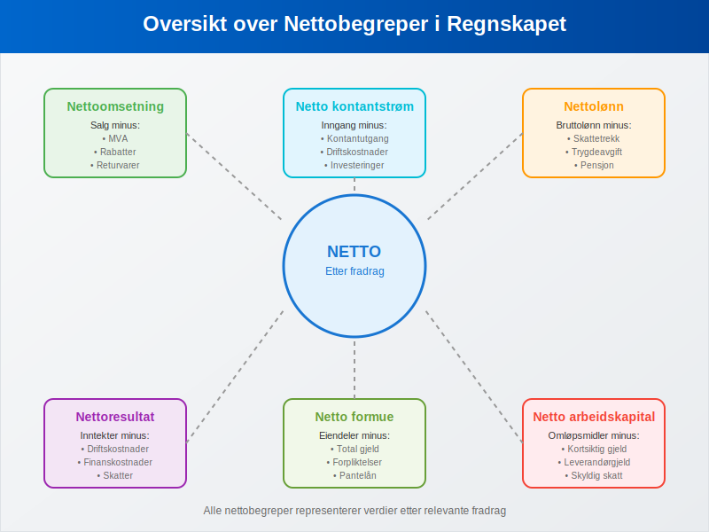
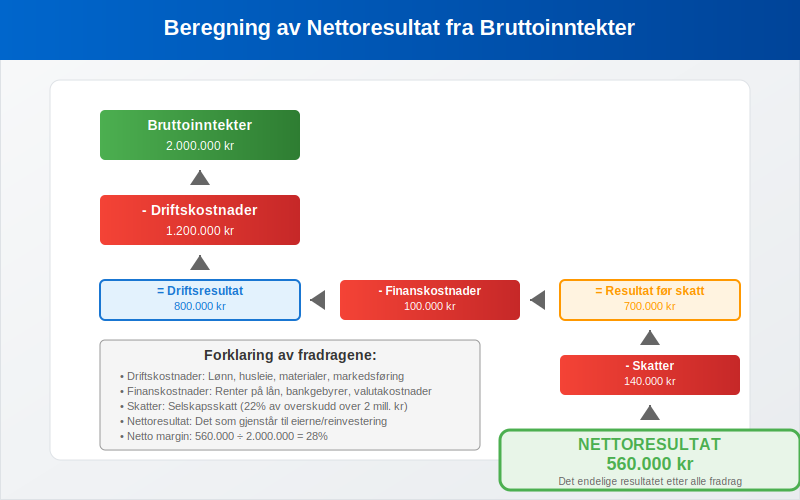
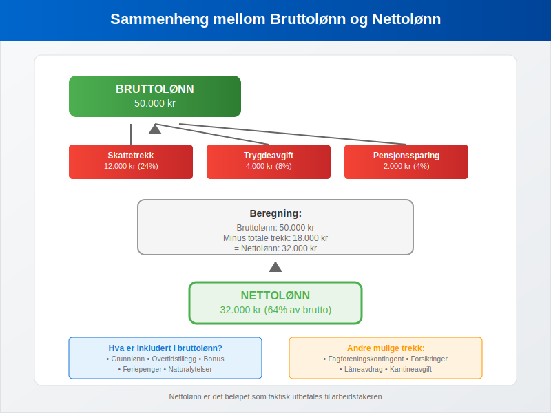
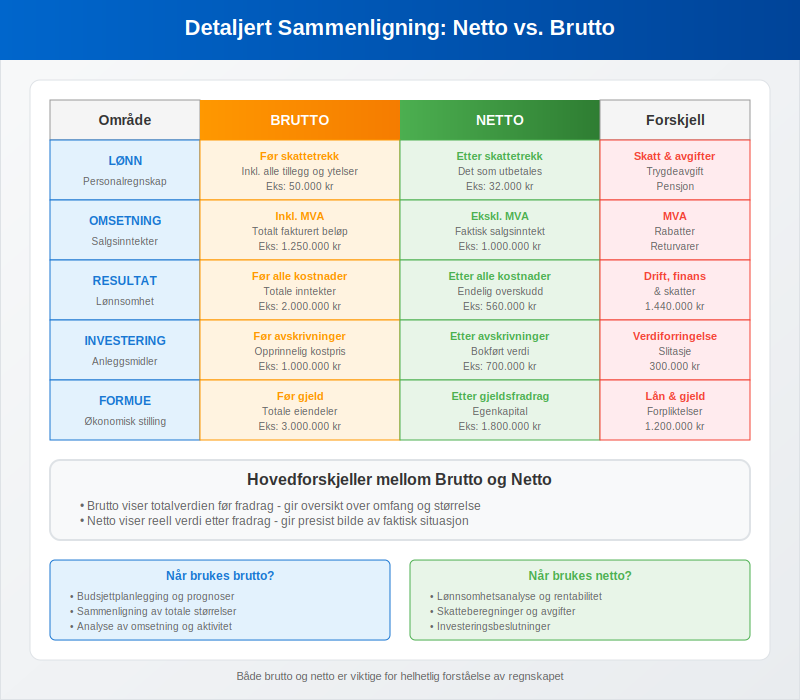
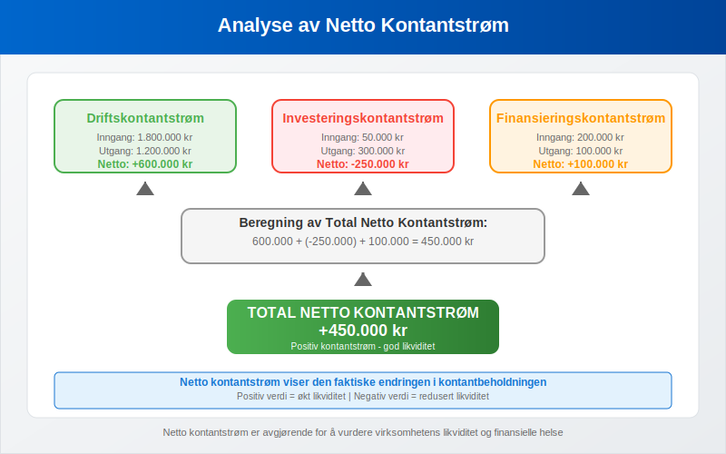
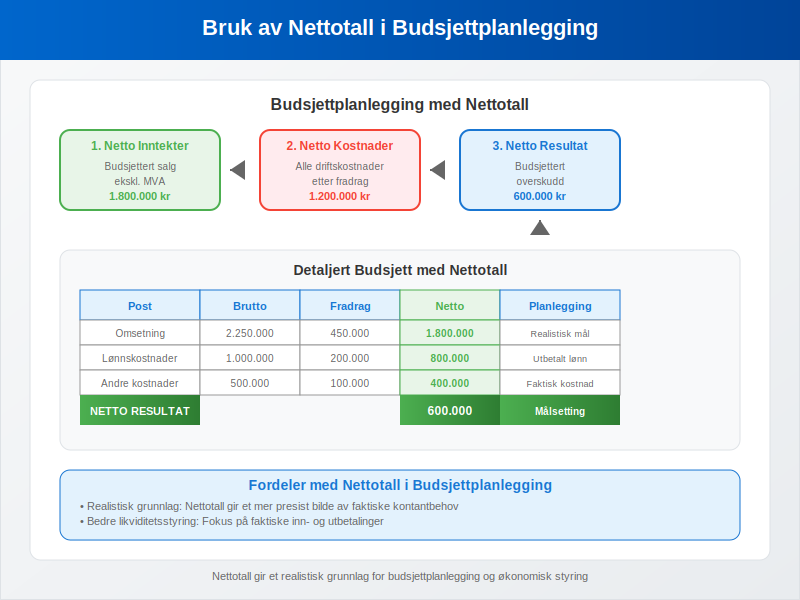
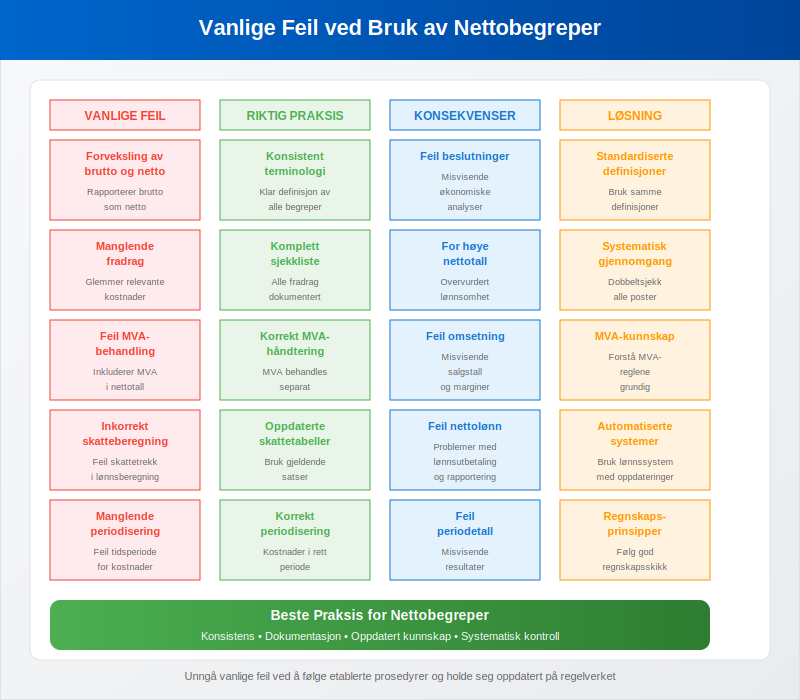

---
title: "Hva er Netto i Regnskap?"
seoTitle: "Netto i regnskap | Definisjon, eksempler og beregning"
description: "Netto er beløpet som gjenstår etter fradrag av kostnader, skatter og avgifter. Se definisjon, eksempler på nettoomsetning, nettolønn og nettoresultat."
summary: "Kort forklaring av netto-begrepet med praktiske eksempler fra lønn, omsetning og resultatberegning."
---

**Netto** er et fundamentalt begrep i [regnskapet](/blogs/regnskap/hva-er-regnskap "Hva er Regnskap? En komplett guide") som refererer til **beløpet som gjenstår etter fradrag** av skatter, avgifter, kostnader eller andre reduksjoner. Begrepet står i direkte motsetning til [brutto](/blogs/regnskap/hva-er-brutto "Hva er Brutto i Regnskap? Definisjon og Praktisk Anvendelse") og er avgjørende for å forstå den faktiske økonomiske verdien i regnskapssammenheng.


## Hva er Netto?

Netto representerer den **endelige eller reelle verdien** av et beløp etter at alle relevante fradrag er gjort. Dette gir et mer presist bilde av den faktiske økonomiske situasjonen enn bruttotall. Forståelsen av nettobegrepet er essensielt for:

* **Korrekt økonomisk analyse** og beslutningsgrunnlag
* **Skatteplanlegging** og avgiftsoptimalisering
* **Lønnsadministrasjon og personaløkonomi** “ se [Hva er Lønn](/blogs/regnskap/hva-er-lonn "Hva er Lønn i Regnskap? Komplett Guide til Lønnsformer, Beregning og Regnskapsføring") og [Hva er Nettolønn?](/blogs/regnskap/nettolonn "Hva er Nettolønn? Definisjon, Beregning og Praktisk Eksempler").
* **Investeringsvurderinger** og lønnsomhetsanalyse
* **Sammenligning** av reelle økonomiske resultater
* **Budsjettplanlegging** og prognoser

### Grunnleggende Prinsipper

Nettobegrepet bygger på flere viktige regnskapsprinsipper:

- **Realiseringsprinsippet:** Kun realiserte verdier skal regnskapsføres
- **Sammenstillingsprinsippet:** Alle tilhørende kostnader skal trekkes fra
- **Forsiktighetsprinsippet:** Usikre poster skal behandles konservativt
- **Substansprinsippet:** Det økonomiske innholdet skal reflekteres

## Nettobegreper i Regnskapet



### Nettoomsetning

**Nettoomsetning** er salgsinntektene etter fradrag av [merverdiavgift](/blogs/regnskap/hva-er-avgiftsplikt-mva "Avgiftsplikt MVA - Regler, Unntak og Praktisk Veiledning"), rabatter, returvarer og andre salgsreduksjoner.

#### Beregning av Nettoomsetning:
```
Nettoomsetning = Bruttoomsetning - MVA - Rabatter - Returvarer - Salgsreduksjoner
```

#### Eksempel: Nettoomsetning
Et selskap har følgende salgstall:

| Post | Beløp (kr) |
|------|------------|
| Bruttoomsetning (inkl. MVA) | 1.250.000 |
| MVA (25%) | 250.000 |
| Rabatter gitt | 50.000 |
| Returvarer | 30.000 |
| **Nettoomsetning** | **920.000** |

**Beregning:**
- Bruttoomsetning: 1.250.000 kr
- Minus MVA: -250.000 kr
- Minus rabatter: -50.000 kr
- Minus returvarer: -30.000 kr
- **Nettoomsetning: 920.000 kr**

### Nettoresultat

**Nettoresultat** er det endelige resultatet etter at alle [kostnader](/blogs/regnskap/hva-er-kostnader "Hva er Kostnader i Regnskap?"), skatter og avgifter er trukket fra inntektene.



#### Formel for Nettoresultat:
```
Nettoresultat = Bruttoinntekter - Driftskostnader - Finanskostnader - Skatter
```

#### Eksempel: Nettoresultat
| Post | Beløp (kr) |
|------|------------|
| Bruttoinntekter | 2.000.000 |
| [Driftskostnader](/blogs/regnskap/hva-er-driftskostnader "Hva er Driftskostnader? Komplett Oversikt") | 1.200.000 |
| Finanskostnader | 100.000 |
| Skatter | 140.000 |
| **Nettoresultat** | **560.000** |

### Nettolønn

**Nettolønn** er den lønnen arbeidstakeren faktisk mottar etter fradrag av skatt, [arbeidsgiveravgift](/blogs/regnskap/hva-er-arbeidsgiveravgift "Hva er Arbeidsgiveravgift? Satser, Beregning og Regnskapsføring") og andre trekk.



#### Komponenter som trekkes fra bruttolønn:
* **Skattetrekk:** Forskuddstrekk av skatt
* **Trygdeavgift:** Arbeidstakeravgift til folketrygden
* **Fagforeningskontingent:** Hvis aktuelt
* **Pensjonssparing:** Obligatorisk tjenestepensjon
* **Andre trekk:** Forsikringer, lån, etc.

#### Eksempel: Nettolønn
| Post | Beløp (kr) |
|------|------------|
| [Bruttolønn](/blogs/regnskap/hva-er-brutto "Hva er Brutto i Regnskap?") | 50.000 |
| Skattetrekk | 12.000 |
| Trygdeavgift | 4.000 |
| Pensjonssparing | 2.000 |
| **Nettolønn** | **32.000** |

### Netto vs. Brutto Sammenligning



| Område | Brutto | Netto | Viktige Fradrag |
|--------|--------|-------|-----------------|
| **Lønn** | Før alle trekk | Etter alle trekk | Skatt, trygdeavgift, pensjon |
| **Omsetning** | Inkl. MVA og rabatter | Ekskl. MVA og rabatter | MVA, rabatter, retur |
| **Resultat** | Før alle kostnader | Etter alle kostnader | Drift, finans, skatt |
| **Investering** | Før [avskrivninger](/blogs/regnskap/hva-er-avskrivning "Hva er Avskrivning? Metoder, Beregning og Regnskapsføring") | Etter avskrivninger | Verdiforringelse, slitasje |
| **Formue** | Før gjeld | Etter gjeldsfradrag | Lån, forpliktelser |

## Regnskapsføring av Nettoposter

### Nettoomsetning i Regnskapet

Nettoomsetning regnskapsføres som den faktiske inntekten virksomheten oppnår:

**Regnskapsføring ved salg:**
```
Debet: Kundefordringer          1.000.000 kr
Kredit: Nettoomsetning            800.000 kr
Kredit: Utgående MVA              200.000 kr
```

### Nettolønn i Lønnsregnskapet

Nettolønn er det som faktisk utbetales til arbeidstakeren:

**Regnskapsføring av nettolønn:**
```
Debet: Lønnskostnad (brutto)      500.000 kr
Kredit: Utbetalt lønn (netto)     350.000 kr
Kredit: Skyldig skattetrekk       120.000 kr
Kredit: Skyldig trygdeavgift       30.000 kr
```

## Nettobegreper i Økonomisk Analyse

### Netto Arbeidskapital

**Netto arbeidskapital** er differansen mellom omløpsmidler og kortsiktig gjeld:

```
Netto arbeidskapital = Omløpsmidler - Kortsiktig gjeld
```

#### Eksempel: Netto Arbeidskapital
| Post | Beløp (kr) |
|------|------------|
| [Kundefordringer](/blogs/regnskap/hva-er-kundefordring "Hva er Kundefordring i Regnskap?") | 800.000 |
| Varelager | 600.000 |
| [Bankinnskudd](/blogs/regnskap/hva-er-bankinnskudd "Hva er Bankinnskudd? Typer og Regnskapsføring") | 200.000 |
| **Omløpsmidler** | **1.600.000** |
| [Leverandørgjeld](/blogs/regnskap/hva-er-leverandorgjeld "Hva er Leverandørgjeld? Håndtering og Regnskapsføring") | 400.000 |
| Skyldig skatt | 200.000 |
| **Kortsiktig gjeld** | **600.000** |
| **Netto arbeidskapital** | **1.000.000** |

### Netto Kontantstrøm

**Netto kontantstrøm** viser den faktiske kontantbevegelsen i virksomheten:



```
Netto kontantstrøm = Kontantinngang - Kontantutgang
```

#### Komponenter i Netto Kontantstrøm:
* **Driftskontantstrøm:** Fra løpende drift
* **Investeringskontantstrøm:** Fra investeringsaktiviteter
* **Finansieringskontantstrøm:** Fra finansieringsaktiviteter

### Netto Nåverdi (NPV)

**Netto nåverdi** brukes i investeringsanalyse for å vurdere lønnsomhet:

```
NPV = Σ (Kontantstrøm / (1 + r)^t) - Investering
```

Der:
- r = diskonteringsrente
- t = tidsperiode

## Praktisk Anvendelse av Nettobegreper

### I Budsjettplanlegging



Nettotall gir et realistisk grunnlag for:

* **Likviditetsplanlegging:** Faktiske kontantbehov
* **Investeringsbeslutninger:** Reell avkastning
* **Lønnsomhetsanalyse:** Faktisk fortjeneste
* **Skatteplanlegging:** Skattepliktig resultat

### I Økonomisk Rapportering

Nettotall er essensielle i:

* **[Resultatregnskap](/blogs/regnskap/hva-er-driftsregnskap "Hva er Driftsregnskap? Oppbygging og Analyse"):** Nettoomsetning og nettoresultat
* **[Balanse](/blogs/regnskap/hva-er-balanse "Hva er Balanse i Regnskap? Oppbygging og Prinsipper"):** Netto egenkapital
* **Kontantstrømoppstilling:** Netto kontantstrøm
* **Nøkkeltallsanalyse:** Netto marginer og rentabilitet

## Nøkkeltall Basert på Netto

### Netto Fortjenestemargin

```
Netto fortjenestemargin (%) = (Nettoresultat ÷ Nettoomsetning) × 100
```

### Netto Egenkapitalrentabilitet

```
Netto egenkapitalrentabilitet (%) = (Nettoresultat ÷ Gjennomsnittlig egenkapital) × 100
```

### Netto Gjeldsgrad

```
Netto gjeldsgrad = (Total gjeld - Kontanter) ÷ Egenkapital
```

## Vanlige Feil ved Nettobegreper



### Typiske Misforståelser:

1. **Forveksling av brutto og netto** i rapportering
2. **Manglende fradrag** av alle relevante kostnader
3. **Feil MVA-behandling** i omsetningsberegninger
4. **Inkorrekt skatteberegning** i lønnssammenheng
5. **Manglende periodisering** av kostnader og inntekter

### Beste Praksis:

* **Dobbeltsjekk alle fradrag** før nettotall beregnes
* **Bruk konsistente definisjoner** av nettobegreper
* **Dokumenter beregningsmetoder** for etterprøvbarhet
* **Sammenlign med bransjestandarder** for validering
* **Oppdater beregninger** ved endringer i regelverk

## Netto i Ulike Bransjer

### Detaljhandel

I detaljhandel fokuseres det på:
* **Netto salgsmargin** etter rabatter og retur
* **Netto lagerverdier** etter nedskrivninger
* **Netto kontantstrøm** fra daglig drift

### Tjenesteyting

I tjenestebransjen er viktige nettotall:
* **Netto timepriser** etter alle kostnader
* **Netto prosjektresultat** per oppdrag
* **Netto kapasitetsutnyttelse** av ressurser

### Produksjon

I produksjonsbedrifter fokuseres det på:
* **Netto produksjonskostnader** per enhet
* **Netto materialforbruk** etter svinn
* **Netto kapasitetsutnyttelse** av maskiner

## Digitale Verktøy for Nettoberegninger

### Regnskapssystemer

Moderne [ERP-systemer](/blogs/regnskap/hva-er-erp-system "Hva er ERP-system? Fordeler og Implementering") beregner automatisk:

* **Nettoomsetning** fra bruttosalg
* **Nettolønn** fra bruttolønn
* **Nettoresultat** fra alle transaksjoner
* **Netto kontantstrøm** fra alle bevegelser

### Lønnsystemer

Spesialiserte lønnssystemer håndterer:
* **Automatisk skattetrekk** for nettolønn
* **Trygdeavgiftsberegning** og andre trekk
* **Feriepengeopptjening** på nettobasis
* **Rapportering til [A-melding](/blogs/regnskap/hva-er-a-melding "Hva er A-melding? Komplett Guide til Innlevering og Frister")**

## Juridiske Aspekter ved Nettobegreper

### Bokføringsloven

[Bokføringsloven](/blogs/regnskap/hva-er-bokforingsloven "Hva er Bokføringsloven? Krav og Bestemmelser") krever at:
* **Nettoomsetning** skal fremgå klart av regnskapet
* **Nettoresultat** skal beregnes korrekt
* **Alle fradrag** skal være dokumentert og lovlige

### Skatteloven

Skatteloven definerer hvordan:
* **Netto skattepliktig inntekt** beregnes
* **Fradragsrett** for ulike kostnader
* **Netto formue** skal verdsettes

### Regnskapsstandarder

Norske regnskapsstandarder (NGRS) og internasjonale standarder (IFRS) gir retningslinjer for:
* **Netto presentasjon** av regnskapsposter
* **Motregning** av eiendeler og gjeld
* **Netto rapportering** av kontantstrømmer

## Sammendrag

**Netto** er et grunnleggende begrep som representerer den faktiske eller reelle verdien etter alle relevante fradrag. Forståelse av nettobegreper er essensielt for:

* **Korrekt regnskapsføring** og økonomisk rapportering
* **Effektiv økonomisk analyse** og beslutningsgrunnlag
* **Riktig skatteberegning** og avgiftsbehandling
* **Realistisk budsjettplanlegging** og prognoser
* **Sammenligning** av økonomiske resultater

Ved å mestre nettobegrepet og dets anvendelser kan virksomheter ta bedre økonomiske beslutninger og sikre korrekt regnskapsføring i henhold til gjeldende regelverk og standarder.


