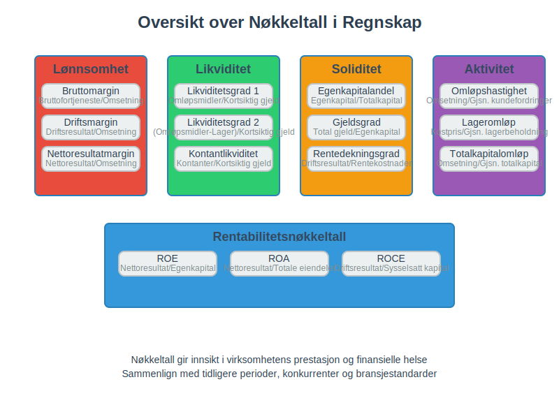
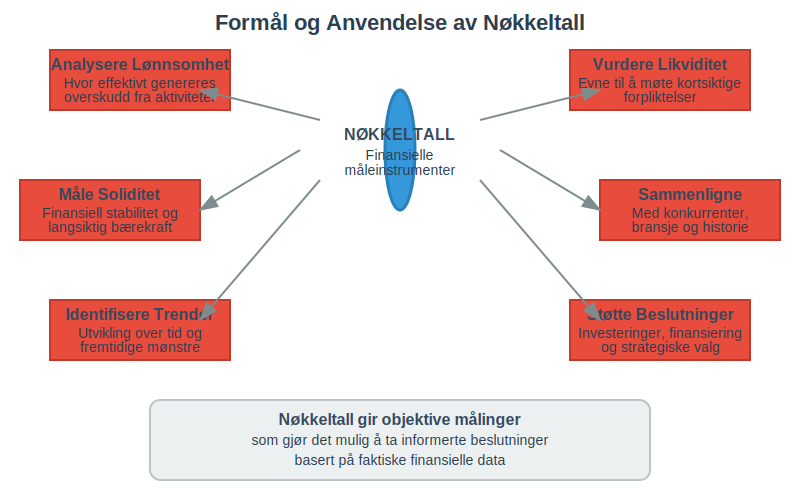
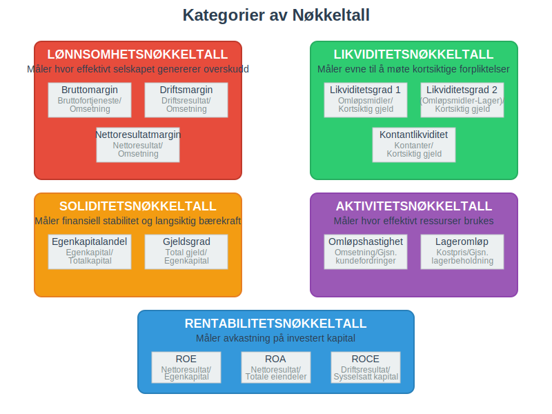
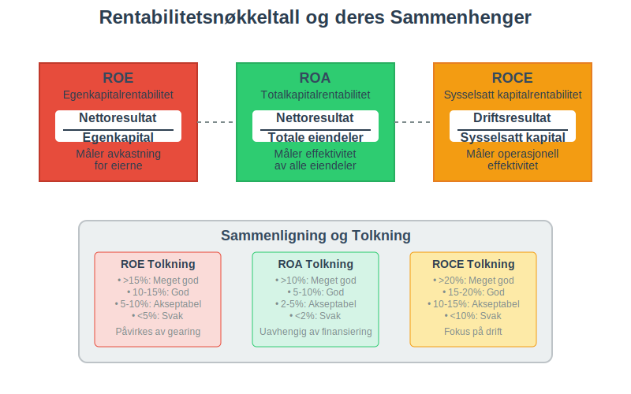
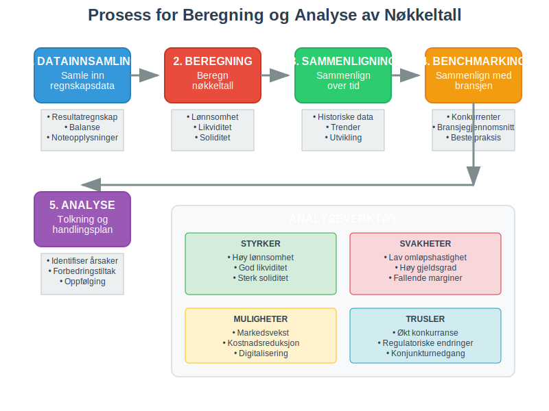
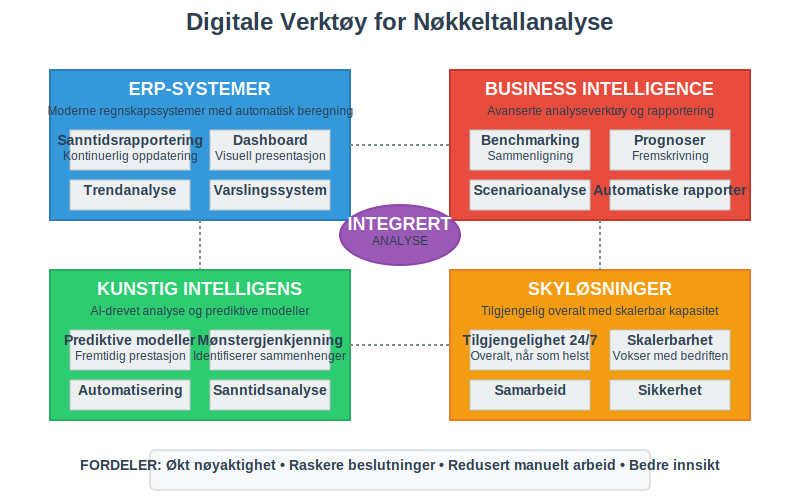
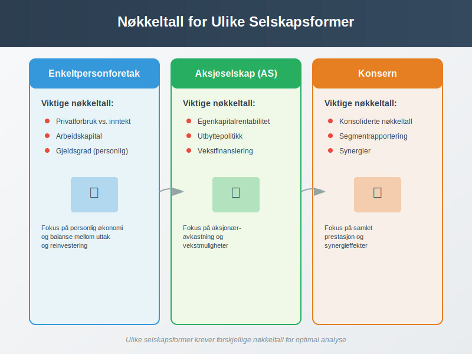
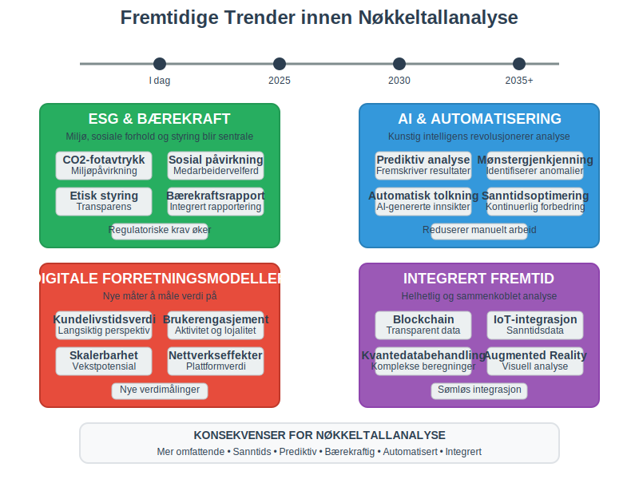

---
title: "Hva er Nøkkeltall?"
seoTitle: "Hva er Nøkkeltall?"
meta_description: '**Nøkkeltall** er finansielle måleinstrumenter som brukes til å analysere og vurdere en virksomhets økonomiske prestasjon, finansielle stilling og operasjon...'
slug: hva-er-nokkeltall
type: blog
layout: pages/single
---

**Nøkkeltall** er finansielle måleinstrumenter som brukes til å analysere og vurdere en virksomhets økonomiske prestasjon, finansielle stilling og operasjonelle effektivitet. Disse tallene gir verdifull innsikt i hvordan selskapet presterer sammenlignet med tidligere perioder, konkurrenter og bransjestandarder.



## Hva er Nøkkeltall?

Nøkkeltall, også kalt **finansielle nøkkeltall** eller **forholdstall**, er matematiske beregninger som uttrykker forholdet mellom ulike poster i [regnskapet](/blogs/regnskap/hva-er-regnskap "Hva er Regnskap? En komplett guide"). De gir en standardisert måte å måle og sammenligne virksomheters prestasjon på.

### Formål med Nøkkeltall

Nøkkeltall brukes til å:

* **Analysere lønnsomhet** og hvor effektivt selskapet genererer overskudd
* **Vurdere likviditet** og selskapets evne til å møte kortsiktige forpliktelser
* **Måle soliditet** og den finansielle stabiliteten
* **Sammenligne prestasjon** med konkurrenter og bransjen
* **Identifisere trender** over tid
* **Støtte beslutninger** om investeringer og finansiering



## Hovedkategorier av Nøkkeltall

### Lønnsomhetsnøkkeltall

Disse nøkkeltallene måler hvor effektivt selskapet genererer overskudd fra sine aktiviteter.

#### Bruttomargin
**Bruttomargin** viser hvor mye som blir igjen etter at [kostprisen](/blogs/regnskap/hva-er-kostpris "Hva er Kostpris? Komplett Guide til Kostprisberegning") er trukket fra omsetningen:

```
Bruttomargin (%) = (Bruttofortjeneste / Omsetning) × 100
```

* **Høy bruttomargin** indikerer god prissetting og kostnadskontrroll
* **Lav bruttomargin** kan tyde på prispress eller høye produksjonskostnader

#### Driftsmargin
**Driftsmargin** viser lønnsomheten fra kjernevirksomheten:

```
Driftsmargin (%) = (Driftsresultat / Omsetning) × 100
```

#### Nettoresultatmargin
**Nettoresultatmargin** viser den totale lønnsomheten etter alle kostnader:

```
Nettoresultatmargin (%) = (Nettoresultat / Omsetning) × 100
```

### Likviditetsnøkkeltall

Disse måler selskapets evne til å møte kortsiktige forpliktelser.

#### Likviditetsgrad 1 (Løpende likviditet)
**Likviditetsgrad 1** viser forholdet mellom omløpsmidler og kortsiktig gjeld:

```
Likviditetsgrad 1 = Omløpsmidler / Kortsiktig gjeld
```

* **Over 2,0**: Meget god likviditet
* **1,5-2,0**: God likviditet  
* **1,0-1,5**: Akseptabel likviditet
* **Under 1,0**: Svak likviditet

#### Likviditetsgrad 2 (Rask likviditet)
**Likviditetsgrad 2** ekskluderer [lagerbeholdning](/blogs/regnskap/hva-er-lagerbeholdning "Hva er Lagerbeholdning? Komplett Guide til Lagerføring") som kan være vanskelig å realisere raskt:

```
Likviditetsgrad 2 = (Omløpsmidler - Lagerbeholdning) / Kortsiktig gjeld
```

### Soliditetsnøkkeltall

Disse måler selskapets finansielle stabilitet og evne til å møte langsiktige forpliktelser.

#### Egenkapitalandel
**Egenkapitalandelen** viser hvor stor andel av totalkapitalen som er [egenkapital](/blogs/regnskap/hva-er-egenkapital "Hva er Egenkapital? Komplett Guide til Egenkapital i Regnskap"):

```
Egenkapitalandel (%) = (Egenkapital / Totalkapital) × 100
```

* **Over 40%**: Meget god soliditet
* **30-40%**: God soliditet
* **20-30%**: Akseptabel soliditet
* **Under 20%**: Svak soliditet

#### Gjeldsgrad
**Gjeldsgraden** viser forholdet mellom total gjeld og egenkapital:

```
Gjeldsgrad = Total gjeld / Egenkapital
```

### Aktivitetsnøkkeltall

Disse måler hvor effektivt selskapet bruker sine ressurser.

#### Omløpshastighet for kundefordringer
Viser hvor raskt selskapet innkrever sine [kundefordringer](/blogs/regnskap/hva-er-kundefordring "Hva er Kundefordring? Komplett Guide til Kundefordringer"):

```
Omløpshastighet kundefordringer = Omsetning / Gjennomsnittlige kundefordringer
```

#### Lageromløpshastighet
Viser hvor raskt lageret omsettes:

```
Lageromløpshastighet = Kostpris solgte varer / Gjennomsnittlig lagerbeholdning
```



## Sammenligning av Nøkkeltall

| Nøkkeltall | Formål | God verdi | Dårlig verdi |
|------------|--------|-----------|--------------|
| **Bruttomargin** | Lønnsomhet | >30% | <15% |
| **Driftsmargin** | Operasjonell effektivitet | >10% | <5% |
| **Likviditetsgrad 1** | Kortsiktig betalingsevne | >1,5 | <1,0 |
| **Egenkapitalandel** | Finansiell stabilitet | >30% | <20% |
| **Gjeldsgrad** | Gjeldsbelastning | <2,0 | >4,0 |
| **Omsetning per ansatt** | Produktivitet | Høy | Lav |

## Rentabilitetsnøkkeltall

### Egenkapitalrentabilitet (ROE)
**Egenkapitalrentabiliteten** måler [avkastningen](/blogs/regnskap/hva-er-avkastning "Hva er Avkastning? Komplett Guide til Avkastningsberegning") på egenkapitalen:

```
ROE (%) = (Nettoresultat / Gjennomsnittlig egenkapital) × 100
```

Dette nøkkeltallet viser hvor mye avkastning eierne får på sin investerte kapital.

### Totalkapitalrentabilitet (ROA)
**Totalkapitalrentabiliteten** måler hvor effektivt selskapet bruker alle sine eiendeler:

```
ROA (%) = (Nettoresultat / Gjennomsnittlige totale eiendeler) × 100
```

### Sysselsatt kapitalrentabilitet (ROCE)
**ROCE** måler avkastningen på den kapitalen som faktisk er i bruk:

```
ROCE (%) = (Driftsresultat / Sysselsatt kapital) × 100
```



## Bransjespesifikke Nøkkeltall

### Detaljhandel
For [detaljhandel](/blogs/regnskap/hva-er-detaljhandel "Hva er Detaljhandel? Komplett Guide til Detaljhandelsregnskap") er spesielt viktige nøkkeltall:

* **Salg per kvadratmeter**: Omsetning / Butikkareal
* **Lageromløpshastighet**: Hvor raskt varer selges
* **Bruttomargin**: Fortjeneste på solgte varer

### Produksjonsbedrifter
For produksjonsbedrifter fokuseres det på:

* **Kapasitetsutnyttelse**: Faktisk produksjon / Maksimal kapasitet
* **Produktivitet per ansatt**: Produksjon / Antall ansatte
* **Materialeffektivitet**: Svinn og kassasjon

### Tjenestebedrifter
For tjenestebedrifter er viktige nøkkeltall:

* **Faktureringsgrad**: Fakturerte timer / Totale timer
* **Omsetning per ansatt**: Produktivitet måling
* **Kundetilfredshet**: Kvalitetsmåling

## Beregning og Analyse

### Datakilder
Nøkkeltall beregnes primært fra:

* **[Resultatregnskap](/blogs/regnskap/hva-er-driftsregnskap "Hva er Driftsregnskap? Komplett Guide til Driftsregnskapet")**: For lønnsomhets- og aktivitetsnøkkeltall
* **[Balanse](/blogs/regnskap/hva-er-balanse "Hva er Balanse? Komplett Guide til Balanseregnskap")**: For soliditets- og likviditetsnøkkeltall
* **Noteopplysninger**: For tilleggsinformasjon og detaljer

### Tidsperioder
For å få et riktig bilde bør nøkkeltall analyseres over:

* **Flere år**: For å identifisere trender
* **Kvartalsvis**: For å følge utviklingen tett
* **Sammenligning**: Med konkurrenter og bransjen

### Tolkning av Resultater
Ved tolkning av nøkkeltall må man vurdere:

* **Bransjeforskjeller**: Ulike bransjer har ulike normale verdier
* **Sesongvariasjoner**: Mange virksomheter har sesongmessige svingninger
* **Konjunkturer**: Økonomiske sykler påvirker prestasjon
* **Selskapslivssyklus**: Oppstarts-, vekst-, modenhets- og nedgangsfaser



## Nøkkeltall for Ulike Interessenter

### For Ledelsen
Ledelsen bruker nøkkeltall til:

* **Strategisk planlegging** og målsetting
* **Operasjonell styring** og forbedring
* **Ressursallokering** og prioritering
* **Prestasjonsmåling** av avdelinger og ansatte

### For Investorer
Investorer fokuserer på:

* **Lønnsomhet** og vekstpotensial
* **Risiko** og finansiell stabilitet
* **Dividendepolitikk** og utbyttevekst
* **Markedsverdi** og aksjekurs

### For Kreditorer
[Leverandører](/blogs/regnskap/hva-er-leverandor "Hva er en Leverandør? Komplett Guide til Leverandørregnskap") og banker vurderer:

* **Betalingsevne** og likviditet
* **Soliditet** og gjeldskapasitet
* **Stabilitet** i inntjening
* **Sikkerhet** for utlån

### For Myndigheter
Skattemyndigheter og tilsynsorganer ser på:

* **Skatteevne** og inntektsnivå
* **Regelverksetterlevelse** og rapportering
* **Samfunnsansvar** og bærekraft

## Digitale Verktøy og Automatisering

### Moderne Regnskapssystemer
Dagens [ERP-systemer](/blogs/regnskap/hva-er-erp-system "Hva er ERP-system? Komplett Guide til Enterprise Resource Planning") kan automatisk beregne nøkkeltall:

* **Sanntidsrapportering**: Kontinuerlig oppdatering av nøkkeltall
* **Dashboard**: Visuell presentasjon av viktige nøkkeltall
* **Trendanalyse**: Automatisk identifisering av utviklingstrekk
* **Varsling**: Automatiske advarsler ved avvik

### Business Intelligence
**BI-verktøy** gir avanserte analysemuligheter:

* **Sammenligning**: Med konkurrenter og bransjen
* **Prognoser**: Fremskrivning basert på historiske data
* **Scenarioanalyse**: "Hva hvis"-beregninger
* **Rapportgenerering**: Automatiske rapporter til interessenter



## Begrensninger og Fallgruver

### Regnskapsmessige Begrensninger
Nøkkeltall basert på [regnskapsdata](/blogs/regnskap/hva-er-dokumentasjon-regnskap-bokforing "Hva er Dokumentasjon i Regnskap og Bokføring? Komplett Guide") har visse begrensninger:

* **Historiske data**: Reflekterer fortiden, ikke fremtiden
* **Regnskapsprinsipper**: Ulike prinsipper kan gi ulike resultater
* **Estimater**: Mange regnskapstall er basert på skjønn
* **Inflasjon**: Historiske kostnader reflekterer ikke dagens verdier

### Tolkningsfeil
Vanlige feil ved bruk av nøkkeltall:

* **Isolert vurdering**: Ser på enkeltall uten sammenheng
* **Manglende kontekst**: Ignorerer bransje- og markedsforhold
* **Kortsiktig fokus**: Overser langsiktige trender
* **Manipulasjon**: Bevisst påvirkning av nøkkeltall

### Kvalitative Faktorer
Nøkkeltall fanger ikke opp:

* **Ledelseskvalitet** og kompetanse
* **Markedsposisjon** og konkurransefortrinn
* **Innovasjonsevne** og fremtidspotensial
* **Omdømme** og merkevare

## Nøkkeltall i Ulike Selskapsformer

### Enkeltpersonforetak
For [enkeltpersonforetak](/blogs/regnskap/hva-er-enkeltpersonforetak "Hva er et Enkeltpersonforetak? Komplett Guide til Selskapsformen") er viktige nøkkeltall:

* **Privatforbruk vs. inntekt**: Balanse mellom uttak og inntjening
* **Arbeidskapital**: Evne til å finansiere drift
* **Gjeldsgrad**: Personlig gjeldsbelastning

### Aksjeselskap
For [aksjeselskap](/blogs/regnskap/hva-er-et-aksjeselskap "Hva er et Aksjeselskap (AS)? Komplett Guide til Selskapsformen") fokuseres det på:

* **Egenkapitalrentabilitet**: Avkastning til aksjonærene
* **Utbyttepolitikk**: Balanse mellom utbytte og reinvestering
* **Vekstfinansiering**: Evne til å finansiere ekspansjon

### Konsern
For [konsern](/blogs/regnskap/hva-er-konsern "Hva er et Konsern? Komplett Guide til Konsernstrukturer og Konsernregnskap") er det viktig å se på:

* **Konsoliderte nøkkeltall**: Samlet prestasjon
* **Segmentrapportering**: Prestasjon per forretningsområde
* **Synergier**: Gevinster fra samarbeid mellom selskaper



## Internasjonale Standarder

### IFRS og Nøkkeltall
Ved bruk av [IFRS](/blogs/regnskap/hva-er-ifrs "Hva er IFRS? Komplett Guide til International Financial Reporting Standards") må man være oppmerksom på:

* **Virkelig verdi**: Påvirker balanseposter og nøkkeltall
* **Valutaomregning**: Kompliserer sammenligning over tid
* **Segmentrapportering**: Krav til detaljert rapportering

### Sammenligning på Tvers av Land
Ved internasjonal sammenligning må man vurdere:

* **Regnskapsstandarder**: Ulike land har ulike regler
* **Skatteforhold**: Påvirker nettoresultat og egenkapital
* **Valutaforskjeller**: Må justeres for valutaendringer
* **Kulturelle faktorer**: Ulike forretningspraksiser

## Fremtidige Utviklingstrekk

### ESG og Bærekraft
**ESG-nøkkeltall** blir stadig viktigere:

* **Miljøpåvirkning**: CO2-utslipp, energiforbruk
* **Sosiale forhold**: Medarbeidertilfredshet, mangfold
* **Styring**: Etikk, transparens, risikostyring

### Digitalisering og AI
**Kunstig intelligens** endrer nøkkeltallanalyse:

* **Prediktive modeller**: Fremskriver fremtidig prestasjon
* **Mønstergjenkjenning**: Identifiserer sammenhenger
* **Automatisering**: Reduserer manuelt arbeid
* **Sanntidsanalyse**: Kontinuerlig overvåking

### Nye Forretningsmodeller
**Digitale forretningsmodeller** krever nye nøkkeltall:

* **Kundelivstidsverdi**: Langsiktig kundeverdi
* **Brukerengasjement**: Aktivitet og lojalitet
* **Skalerbarhet**: Evne til rask vekst
* **Nettverkseffekter**: Verdi av brukernettverket



## Praktiske Tips for Bruk av Nøkkeltall

### Etablering av Nøkkeltallsystem
For å etablere et effektivt nøkkeltallsystem:

1. **Identifiser kritiske suksessfaktorer** for virksomheten
2. **Velg relevante nøkkeltall** som måler disse faktorene
3. **Sett målverdier** basert på strategi og benchmarking
4. **Implementer rapporteringsrutiner** for regelmessig oppfølging
5. **Tren personalet** i tolkning og bruk av nøkkeltall

### Rapportering og Kommunikasjon
Effektiv rapportering av nøkkeltall:

* **Visuell presentasjon**: Bruk grafer og diagrammer
* **Trendanalyse**: Vis utvikling over tid
* **Kommentarer**: Forklar årsaker til endringer
* **Handlingsplaner**: Knytt nøkkeltall til konkrete tiltak

### Kontinuerlig Forbedring
For å sikre relevans og nytteverdi:

* **Regelmessig gjennomgang**: Vurder relevansen av nøkkeltall
* **Benchmarking**: Sammenlign med beste praksis
* **Tilbakemelding**: Innhent input fra brukere
* **Oppdatering**: Tilpass til endrede forhold

## Konklusjon

**Nøkkeltall** er uunnværlige verktøy for å forstå og styre en virksomhets økonomiske prestasjon. De gir objektive målinger som gjør det mulig å:

* **Vurdere lønnsomhet** og finansiell helse
* **Sammenligne prestasjon** over tid og mot konkurrenter
* **Identifisere styrker og svakheter** i virksomheten
* **Ta informerte beslutninger** om fremtidig strategi

For å få maksimal nytte av nøkkeltall er det viktig å:

* **Velge relevante nøkkeltall** for virksomheten og bransjen
* **Forstå begrensningene** og tolkningsfallgruver
* **Kombinere kvantitative og kvalitative vurderinger**
* **Bruke nøkkeltall som grunnlag for handling**, ikke bare rapportering

God [internkontroll](/blogs/regnskap/hva-er-internkontroll "Hva er Internkontroll? Komplett Guide til Internkontrollsystemer") og pålitelig [bokføring](/blogs/regnskap/hva-er-bokforing "Hva er Bokføring? Komplett Guide til Bokføringsprinsipper") er grunnlaget for troverdige nøkkeltall. Investering i gode systemer og kompetanse innen nøkkeltallanalyse vil gi betydelig avkastning gjennom bedre beslutninger og forbedret prestasjon.

Etter hvert som forretningsverden blir mer kompleks og digital, vil evnen til å analysere og tolke nøkkeltall bli enda viktigere for å lykkes i konkurranseutsatte markeder.


