---
title: "Hva er NUF (Norskregistrert Utenlandsk Foretak)?"
seoTitle: "Hva er NUF (Norskregistrert Utenlandsk Foretak)?"
meta_description: 'For en oversikt over ulike selskapsformer i Norge, se [Selskapsform](/blogs/regnskap/selskapsform "Selskapsform: Oversikt over selskapsformer i Norge").'
slug: hva-er-nuf-selskapsform
type: blog
layout: pages/single
---

For en oversikt over ulike selskapsformer i Norge, se [Selskapsform](/blogs/regnskap/selskapsform "Selskapsform: Oversikt over selskapsformer i Norge").

**NUF (Norskregistrert Utenlandsk Foretak)** er en spesiell registreringsform som gjør det mulig for utenlandske selskaper å drive virksomhet i Norge uten å etablere et eget norsk [aksjeselskap](/blogs/regnskap/hva-er-et-aksjeselskap "Hva er et Aksjeselskap (AS)? Komplett Guide til Selskapsformen") eller annen [foretaksform](/blogs/regnskap/hva-er-foretak "Hva er et Foretak? Komplett Guide til Foretaksformer i Norge"). Dette er en praktisk løsning for internasjonale virksomheter som ønsker å etablere seg på det norske markedet.

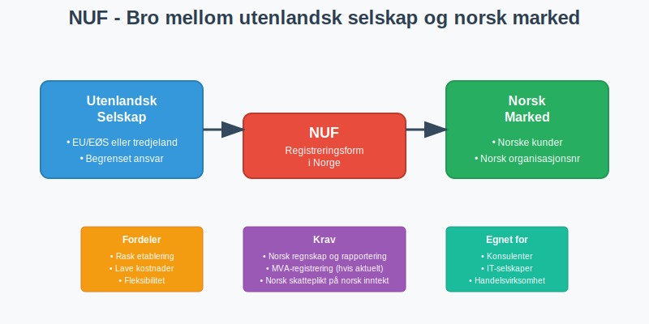

## Definisjon av NUF

**Norskregistrert Utenlandsk Foretak (NUF)** er en registreringsordning som lar utenlandske selskaper:

* Drive virksomhet i Norge under sitt opprinnelige navn
* Beholde sin utenlandske selskapsform og juridiske struktur
* Få norsk organisasjonsnummer for norsk virksomhet
* Oppfylle norske rapporterings- og regnskapskrav

NUF er **ikke en egen selskapsform**, men en måte å registrere utenlandsk virksomhet på i Norge. Det utenlandske selskapet beholder sin opprinnelige juridiske status og styring.

### Forskjell fra Filial

Mens en **filial** er en del av det utenlandske selskapet som driver virksomhet i Norge, er NUF en registreringsform som gjelder for hele det utenlandske selskapets virksomhet i Norge:

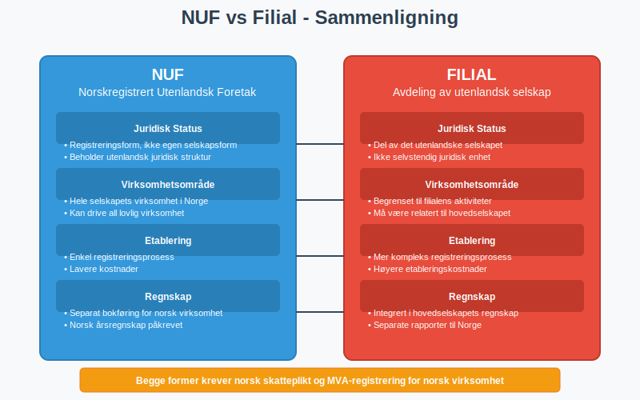

## Hvem Kan Registrere NUF?

### Kvalifiserte Selskaper

NUF-registrering er tilgjengelig for selskaper som:

* Er **etablert i utlandet** med gyldig registrering
* Har **begrenset ansvar** (tilsvarende norsk AS)
* Kommer fra land med **skatteavtale** med Norge
* Oppfyller krav til **selskapsstyring** og transparens

#### EU/EØS-selskaper
Selskaper fra **EU/EØS-området** har særlige fordeler:

* **Forenklet registreringsprosess**
* **Gjensidig anerkjennelse** av selskapsformer
* **Fri etableringsrett** innenfor EØS
* Mindre dokumentasjonskrav

#### Selskaper fra Tredjeland
Selskaper utenfor EU/EØS må oppfylle **strengere krav**:

* Detaljert dokumentasjon av selskapsstruktur
* Bekreftelse på lovlig etablering i hjemlandet
* Eventuelt krav om norsk representant

### Virksomhetstyper

NUF egner seg særlig godt for:

* **Konsulentvirksomhet** og profesjonelle tjenester
* **Teknologiselskaper** med norske kunder
* **Handelsvirksomhet** med import/eksport
* **Bygge- og anleggsvirksomhet** på norske prosjekter

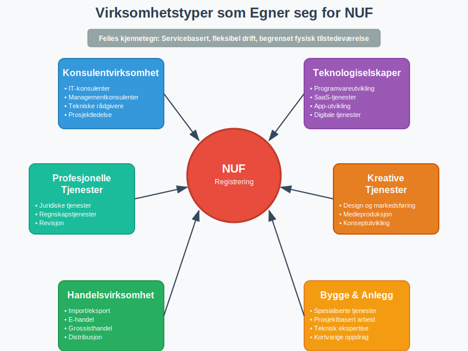

## Registreringsprosess

### Dokumentasjon som Kreves

For å registrere NUF må følgende dokumenter fremlegges:

#### Grunnleggende Dokumenter
* **Registreringsbevis** fra hjemland (ikke eldre enn 6 måneder)
* **Vedtekter** eller tilsvarende stiftelsesdokument
* **Oversettelse** til norsk av alle dokumenter
* **Apostille** eller annen bekreftelse på dokumentenes ekthet

#### Tilleggsdokumenter
* **Fullmakt** til norsk representant (hvis aktuelt)
* **Bekreftelse** på selskapets aktivitet og formål
* **Kontaktinformasjon** for ansvarlige personer
* **Bankreferanser** eller økonomisk dokumentasjon

### Registreringsprosedyre

| Steg | Beskrivelse | Tidsramme | Kostnad |
|------|-------------|-----------|---------|
| **1. Forberedelse** | Samle inn og oversette dokumenter | 2-4 uker | Varierer |
| **2. Søknad** | Innsending til Brønnøysundregistrene | 1 dag | 2 700 kr |
| **3. Behandling** | Saksbehandling og kontroll | 2-3 uker | - |
| **4. Registrering** | Tildeling av organisasjonsnummer | 1 dag | - |
| **5. Oppfølging** | MVA- og skatteregister | 1-2 uker | - |

### Digitale Løsninger

Registreringsprosessen kan gjennomføres **digitalt** gjennom:

* **Altinn** for norske representanter
* **Brønnøysundregistrenes** nettsider
* **Kvalifiserte rådgivere** med digital tilgang

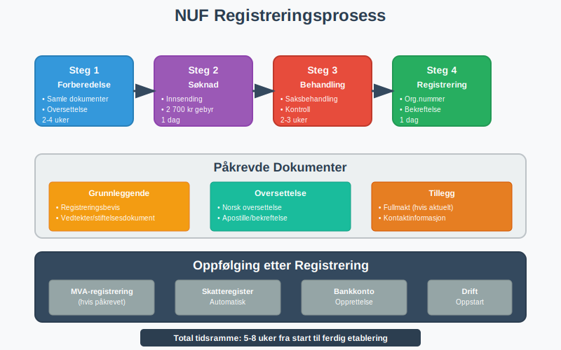

## Skattemessige Forhold

### Skatteplikt i Norge

NUF-registrerte selskaper blir **begrenset skattepliktige** til Norge for:

#### Skattepliktig Inntekt
* **Inntekt fra virksomhet** drevet i Norge
* **Inntekt fra fast eiendom** i Norge
* **Royalties og lisenser** knyttet til norsk virksomhet
* **Kapitalgevinster** fra norske eiendeler

#### Skattefritak
* Inntekt fra virksomhet i hjemlandet
* Utbytte fra utenlandske selskaper (med forbehold)
* Kapitalgevinster fra utenlandske investeringer

### Skattesatser og Beregning

**Selskapsskatt** for NUF følger samme satser som norske selskaper:

| Inntektstype | Skattesats | Merknad |
|--------------|------------|---------|
| **Alminnelig inntekt** | 22% | Standard selskapsskatt |
| **Petroleumsinntekt** | 78% | Spesiell petroleumsskatt |
| **Kraftproduksjon** | 37% | Grunnrenteskatt + alminnelig |
| **Finansinntekt** | 22% | Med eventuelle unntak |

#### Skatteavtaler
**Skatteavtaler** mellom Norge og hjemland kan:

* **Redusere skatten** på visse inntektstyper
* **Eliminere dobbeltbeskatning** 
* **Gi kreditt** for skatt betalt i Norge
* **Definere** hvor virksomheten anses drevet

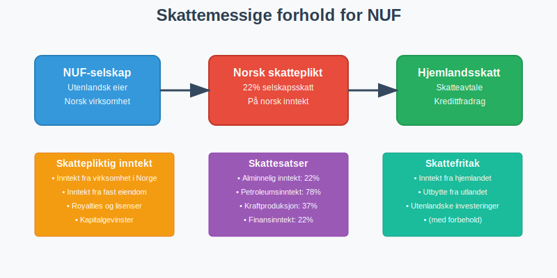

## Regnskapsmessige Krav

### Bokføringsplikt

NUF-registrerte selskaper har **[bokføringsplikt](/blogs/regnskap/hva-er-bokforingsplikt "Hva er Bokføringsplikt i Norge?")** for norsk virksomhet:

#### Omfattende Bokføring
* **Alle transaksjoner** knyttet til norsk virksomhet
* **Separate konti** for norsk og utenlandsk aktivitet
* **Dokumentasjon** av alle forretningshendelser
* **Oppbevaring** av bilag og dokumenter

#### Regnskapsstandard
NUF kan velge mellom:

* **Norsk regnskapsstandard** (forenklet eller god regnskapsskikk)
* **IFRS** (International Financial Reporting Standards)
* **Hjemlandets standard** (med tilpasninger til norske krav)

### Rapporteringsplikt

#### Årsregnskap
NUF må levere **årsregnskap** som viser:

* **Resultatregnskap** for norsk virksomhet
* **Balanseregnskap** per 31. desember
* **Noter** med tilleggsopplysninger
* **Årsberetning** (hvis påkrevet)

#### Frister og Innsending
* **Regnskapsåret** følger kalenderåret (1. januar - 31. desember)
* **Innleveringsfrist** er 31. mai året etter
* **Innsending** skjer elektronisk via [Altinn](/blogs/regnskap/hva-er-altinn "Hva er Altinn? Komplett Guide til Altinn for Bedrifter")

### Revisjonsplikt

NUF har **revisjonsplikt** når:

* Årsomsetning overstiger **70 millioner kr**
* Balansesum overstiger **35 millioner kr**  
* Gjennomsnittlig antall ansatte overstiger **50**

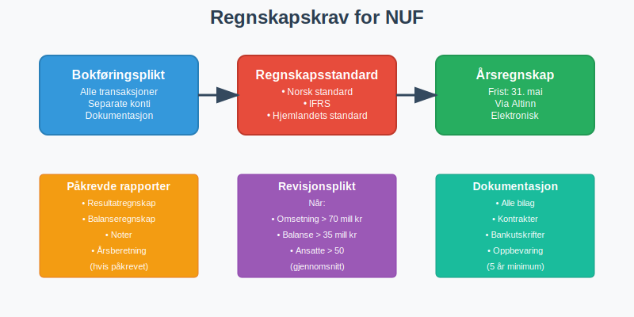

## MVA-forhold

### MVA-registrering

NUF må **registreres for merverdiavgift** når:

* **Omsetning** av avgiftspliktige varer/tjenester overstiger 50 000 kr per år
* **Import** av varer til Norge
* **Tjenester** leveres til norske kunder (avhengig av type)

#### Registreringsprosess
1. **Søknad** sendes samtidig med NUF-registrering
2. **Vurdering** av virksomhetens art og omfang
3. **Tildeling** av MVA-nummer
4. **Oppstart** av periodisk rapportering

### MVA-satser og Beregning

NUF følger **norske MVA-satser**:

| Vare/Tjeneste | MVA-sats | Eksempler |
|---------------|----------|-----------|
| **Alminnelig sats** | 25% | De fleste varer og tjenester |
| **Middels sats** | 15% | Næringsmidler |
| **Lav sats** | 11,11% | Persontransport, overnatting |
| **Nullsats** | 0% | Eksport, internasjonale tjenester |
| **Fritatt** | - | Finansielle tjenester, helse |

#### Fradragsrett
NUF har **fradragsrett** for inngående MVA på:

* **Anskaffelser** til norsk virksomhet
* **Tjenester** kjøpt i Norge
* **Import** av varer til virksomheten
* **Investeringer** i norsk virksomhet

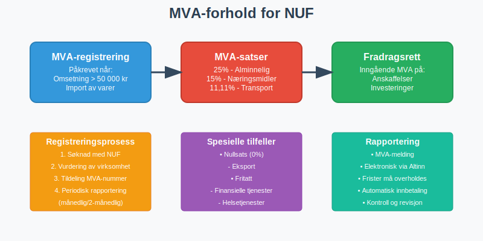

## Fordeler og Ulemper

### Fordeler med NUF

#### Økonomiske Fordeler
* **Lavere etableringskostnader** enn norsk selskap
* **Ingen aksjekapital** kreves
* **Fleksibel kapitalstruktur** beholdes
* **Skatteoptimalisering** gjennom skatteavtaler

#### Administrative Fordeler
* **Raskere etablering** enn stiftelse av norsk selskap
* **Beholder hjemlandets styring** og struktur
* **Enklere konsernrapportering** 
* **Kjent juridisk ramme** fra hjemlandet

#### Strategiske Fordeler
* **Testmarked** for norsk ekspansjon
* **Fleksibilitet** til å endre strategi
* **Internasjonalt omdømme** bevares
* **Enklere exit** hvis nødvendig

### Ulemper og Utfordringer

#### Regnskapsmessige Utfordringer
* **Dobbelt bokføring** (Norge og hjemland)
* **Kompleks skatteberegning** med skatteavtaler
* **Valutaomregning** og kursrisiko
* **Koordinering** mellom ulike regnskapsstandarder

#### Juridiske Begrensninger
* **Begrenset virksomhetsområde** til registrert aktivitet
* **Avhengighet** av skatteavtaler
* **Potensielle endringer** i regelverket
* **Kompleks oppløsning** ved avvikling

### Sammenligning med Alternativer

| Etableringsform | Kostnad | Tid | Fleksibilitet | Kompleksitet |
|-----------------|---------|-----|---------------|--------------|
| **NUF** | Lav | Kort | Høy | Middels |
| **Norsk AS** | Høy | Lang | Lav | Lav |
| **Filial** | Middels | Middels | Middels | Høy |
| **Fast driftssted** | Lav | Kort | Høy | Høy |

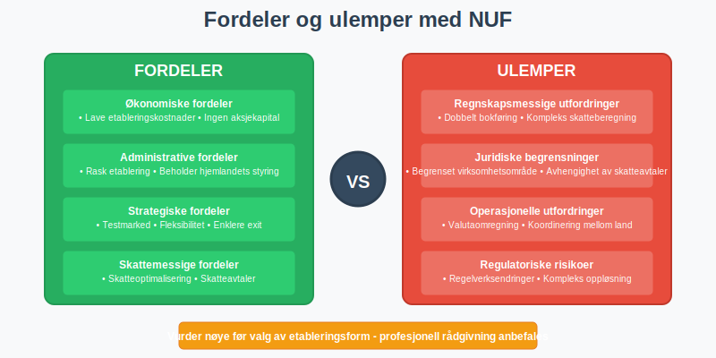

## Praktiske Eksempler

### Eksempel 1: Svensk Konsulentselskap

**Situasjon**: Et svensk konsulentselskap ønsker å levere IT-tjenester til norske kunder.

#### Løsning med NUF
* **Registrering**: NUF-registrering med svensk selskap som eier
* **Virksomhet**: Levering av konsulenttjenester fra Sverige til Norge
* **Regnskap**: Separat bokføring for norsk omsetning
* **Skatt**: 22% norsk selskapsskatt på norsk inntekt, kreditt i Sverige

#### Resultat
* **Rask etablering** på 4-6 uker
* **Lave etableringskostnader** (under 50 000 kr)
* **Fleksibel drift** med hjemmekontor i Sverige
* **Skatteeffektiv** løsning gjennom skatteavtale

### Eksempel 2: Dansk Handelsselskap

**Situasjon**: Et dansk selskap ønsker å importere og selge varer i Norge.

#### Utfordringer
* **MVA-registrering** påkrevet for import
* **Lagerhåndtering** og distribusjon i Norge
* **Kundeservice** på norsk
* **Garantiansvar** etter norsk lov

#### NUF-løsning
* **Import-MVA** håndteres gjennom NUF
* **Norsk representant** for kundeservice
* **Separate konti** for norsk handel
* **Koordinert rapportering** til begge land

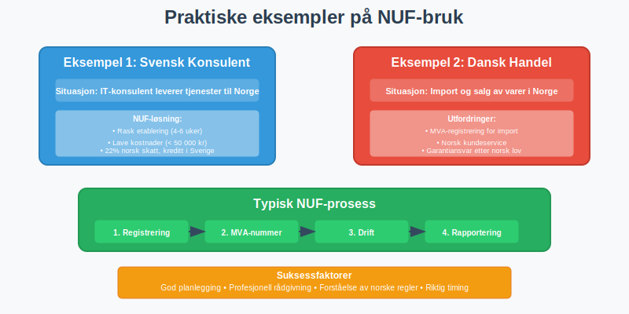

## Avvikling og Endringer

### Når Bør NUF Avvikles?

#### Strategiske Årsaker
* **Permanent etablering** ønskes i Norge
* **Økt virksomhet** gjør norsk AS mer hensiktsmessig
* **Endret forretningsmodell** krever annen struktur
* **Skattemessige forhold** endres

#### Praktiske Årsaker
* **Kompleksitet** blir for stor
* **Kostnader** overstiger fordelene
* **Regulatoriske endringer** påvirker virksomheten
* **Markedsforhold** endres

### Avviklingsprosess

#### Forberedelser
1. **Gjennomgang** av alle forpliktelser og eiendeler
2. **Avstemming** med skattemyndigheter
3. **Avslutning** av kundeforhold og kontrakter
4. **Dokumentasjon** av alle transaksjoner

#### Formell Avvikling
1. **Melding** til Brønnøysundregistrene
2. **Sluttoppgjør** for skatt og MVA
3. **Avslutning** av bankkonti og avtaler
4. **Sletting** fra registre

### Overgang til Norsk Selskap

Mange NUF-selskaper velger senere å etablere **norsk datterselskap**:

#### Prosess
* **Stiftelse** av norsk AS
* **Overdragelse** av norsk virksomhet
* **Skattemessig behandling** av overdragelsen
* **Avvikling** av NUF-registrering

#### Skattemessige Konsekvenser
* **Realisasjon** av eiendeler kan utløse skatt
* **Kontinuitetsregler** kan gi skattefrihet
* **Timing** er viktig for skatteoptimalisering

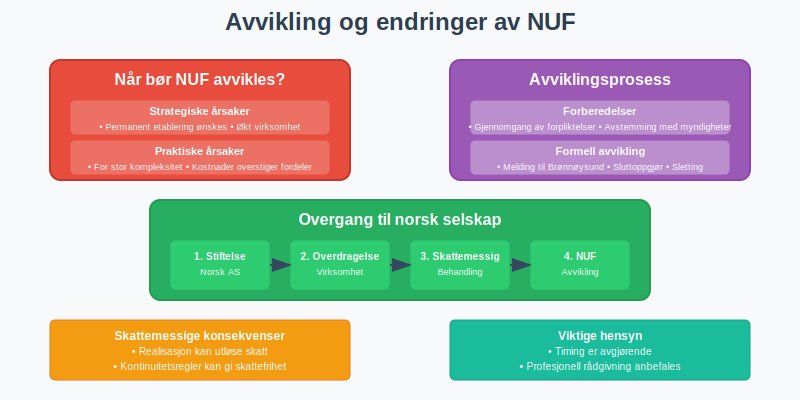

## Fremtidige Utviklingstrekk

### Digitalisering

#### Automatiserte Prosesser
* **Digital registrering** og rapportering
* **Sanntids-rapportering** til skattemyndigheter
* **Automatisk MVA-beregning** og innbetaling
* **AI-støttet** regnskapsføring og compliance

#### Internasjonale Standarder
* **Felles EU-standarder** for grenseoverskridende virksomhet
* **Blockchain-basert** dokumentasjon og verifikasjon
* **Harmoniserte** rapporteringskrav
* **Digital identitet** for internasjonale selskaper

### Regulatoriske Endringer

#### Skjerpede Krav
* **Økt transparens** om eierskap og kontroll
* **Strengere dokumentasjon** av virksomhet
* **Utvidet rapporteringsplikt** for store selskaper
* **Bærekraftsrapportering** også for NUF

#### Forenklinger
* **Digitale løsninger** reduserer administrativ byrde
* **Automatisk utveksling** av informasjon mellom land
* **Forenklet registrering** for EU/EØS-selskaper
* **Standardiserte prosesser** på tvers av land

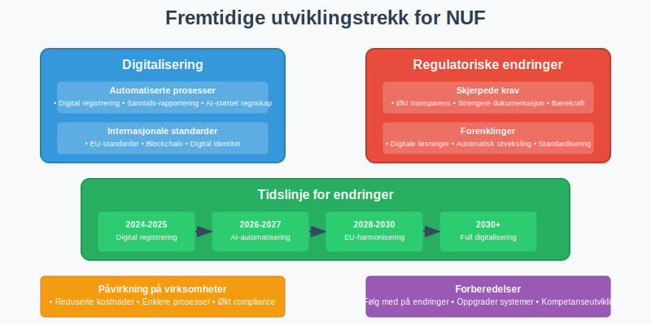

## Rådgivning og Støtte

### Profesjonell Hjelp

#### Når Trenger Man Rådgiver?
* **Kompleks selskapsstruktur** i hjemlandet
* **Usikkerhet** om skattemessige forhold
* **Store transaksjoner** eller investeringer
* **Spesielle bransjer** med særregler

#### Type Rådgivere
* **Regnskapsførere** med internasjonal erfaring
* **Skatterådgivere** med kunnskap om skatteavtaler
* **Advokater** med selskapsrettslig kompetanse
* **Konsulenter** med bransjespesifikk kunnskap

### Offentlige Ressurser

#### Brønnøysundregistrene
* **Veiledning** om registreringsprosess
* **Skjemaer** og dokumentasjon
* **Kontaktinformasjon** for spørsmål
* **Oppdateringer** om regelverksendringer

#### Skatteetaten
* **Informasjon** om skatteplikt og -beregning
* **Veiledning** om MVA-forhold
* **Skjemaer** for rapportering
* **Kontakt** for spesifikke spørsmål

#### Innovation Norway
* **Støtteordninger** for internasjonale selskaper
* **Nettverksbygging** og markedsinformasjon
* **Rådgivning** om etablering i Norge
* **Kontakter** til relevante aktører

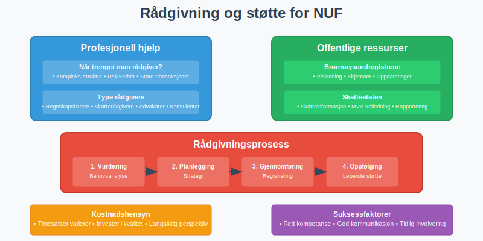

## Konklusjon

**NUF (Norskregistrert Utenlandsk Foretak)** er en **fleksibel og kostnadseffektiv** løsning for utenlandske selskaper som ønsker å etablere seg i Norge. Ordningen gir mulighet til å:

### Hovedfordeler
* **Rask etablering** uten å starte norsk selskap
* **Beholde utenlandsk selskapsstruktur** og styring
* **Skatteoptimalisering** gjennom skatteavtaler
* **Fleksibilitet** til å teste det norske markedet

### Viktige Hensyn
* **Regnskapsmessige krav** må oppfylles for norsk virksomhet
* **Skattemessige forhold** kan være komplekse
* **MVA-registrering** er ofte påkrevet
* **Profesjonell rådgivning** anbefales for komplekse situasjoner

### Egnet for
NUF passer særlig godt for **serviceselskaper**, **konsulentvirksomhet**, **teknologiselskaper** og **handelsvirksomhet** som ønsker å etablere seg gradvis i Norge.

For selskaper som vurderer **permanent etablering** eller har **omfattende norsk virksomhet**, kan det være mer hensiktsmessig å etablere et norsk [aksjeselskap](/blogs/regnskap/hva-er-et-aksjeselskap "Hva er et Aksjeselskap (AS)? Komplett Guide til Selskapsformen") eller annen [foretaksform](/blogs/regnskap/hva-er-foretak "Hva er et Foretak? Komplett Guide til Foretaksformer i Norge").

**God planlegging** og **profesjonell rådgivning** er avgjørende for å sikre at NUF-registrering er den optimale løsningen for den konkrete situasjonen. Det er viktig å vurdere både **kortsiktige** og **langsiktige** mål for virksomheten i Norge.

Uansett valg av etableringsform er det essensielt å følge norske krav til [regnskap](/blogs/regnskap/hva-er-regnskap "Hva er Regnskap? En komplett guide"), [bokføring](/blogs/regnskap/hva-er-bokforing "Hva er Bokføring? Komplett Guide til Bokføringsprinsipper") og rapportering for å sikre lovlig og vellykket drift i Norge.

