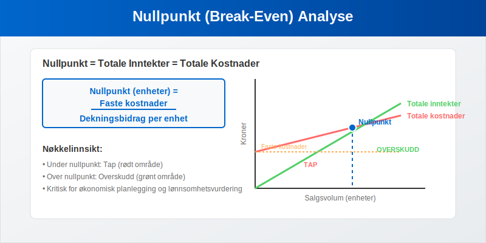
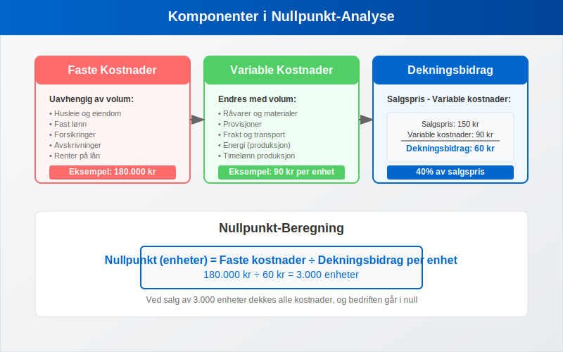
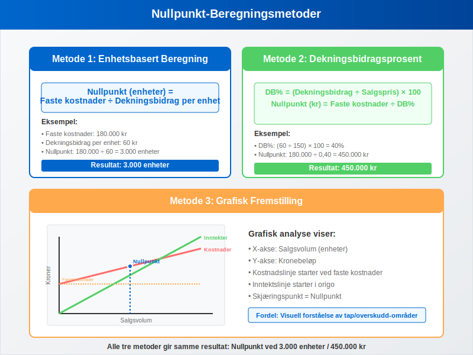
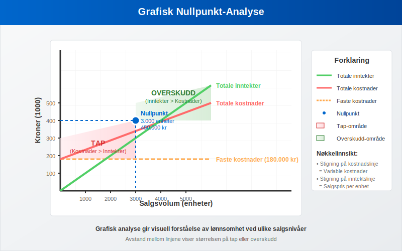
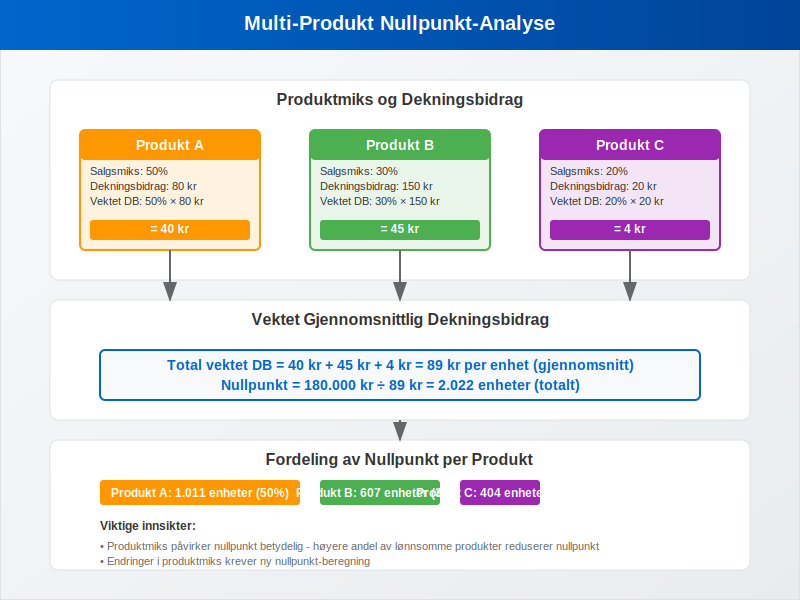

---
title: "Hva er Nullpunkt (Break-Even) i Regnskap?"
seoTitle: "Hva er Nullpunkt (Break-Even) i Regnskap?"
description: '**Nullpunkt** (break-even) er det kritiske punktet hvor en bedrifts totale inntekter er lik totale kostnader, og bedriften verken går med overskudd eller under...'
---

**Nullpunkt** (break-even) er det kritiske punktet hvor en bedrifts totale inntekter er lik totale kostnader, og bedriften verken går med overskudd eller underskudd. Nullpunkt-analyse (også kalt [dekningspunkt-analyse](/blogs/regnskap/hva-er-dekningspunkt "Hva er Dekningspunkt? Komplett Guide til Break-Even Analyse")) er et fundamentalt verktøy for **økonomisk planlegging** og lønnsomhetsvurdering som hjelper bedrifter med å forstå hvor mye de må selge for å dekke alle sine kostnader.

For en spesialisert analyse av [nullpunktsomsetning](/blogs/regnskap/hva-er-nullpunktsomsetning "Hva er Nullpunktsomsetning (Break-Even Omsetning)?") - det kritiske omsetningsnivået i kroner - se vår detaljerte guide som fokuserer spesifikt på beregning og optimalisering av break-even omsetning.



## Hva er Nullpunkt-Analyse?

Nullpunkt-analyse er en **regnskapsmessig metode** som beregner det eksakte punktet hvor:

* **Totale inntekter** = **Totale kostnader**
* **Resultat** = 0 (verken overskudd eller underskudd)
* Bedriften har dekket alle sine **faste** og **variable kostnader**
* Grunnlaget for **lønnsomhetsvurdering** er etablert

### Formål med Nullpunkt-Analyse

Nullpunkt-analyse brukes til å:

* **Planlegge salgsvolum** for å oppnå ønsket lønnsomhet
* **Vurdere nye produkter** eller tjenester
* **Analysere prisstrategier** og deres påvirkning på lønnsomhet
* **Forstå kostnadsstrukturen** i bedriften
* **Ta investeringsbeslutninger** basert på [arbeidskapital](/blogs/regnskap/hva-er-arbeidskapital "Hva er Arbeidskapital? Beregning, Analyse og Optimalisering") og [avkastning](/blogs/regnskap/hva-er-avkastning "Hva er Avkastning? Beregning, Typer og Analyse av Investeringsavkastning")

## Grunnleggende Komponenter

For å forstå nullpunkt-analyse må vi først identifisere de viktigste komponentene:



### Faste Kostnader

**Faste kostnader** forblir konstante uavhengig av produksjons- eller salgsvolum:

* **Husleie** og eiendomskostnader
* **Lønn** til fast ansatte
* **Forsikringer** og avgifter
* **[Avskrivninger](/blogs/regnskap/hva-er-avskrivning "Hva er Avskrivning i Regnskap? Metoder, Beregning og Praktiske Eksempler")** på [anleggsmidler](/blogs/regnskap/hva-er-anleggsmidler "Hva er Anleggsmidler? Materielle, Immaterielle og Finansielle Eiendeler")
* **Renter** på lån

### Variable Kostnader

**Variable kostnader** endres proporsjonalt med produksjons- eller salgsvolum:

* **Råvarer** og materialkostnader
* **Provisjoner** til selgere
* **Frakt** og transportkostnader
* **Energikostnader** knyttet til produksjon
* **Timelønn** for produksjonsarbeidere

### Dekningsbidrag

**Dekningsbidrag** er forskjellen mellom salgspris og variable kostnader per enhet:

```
Dekningsbidrag per enhet = Salgspris - Variable kostnader per enhet
```

Dekningsbidraget brukes til å dekke faste kostnader og generere overskudd.

## Beregning av Nullpunkt

Det finnes flere metoder for å beregne nullpunkt, avhengig av hvilken informasjon som er tilgjengelig.



### Metode 1: Enhetsbasert Beregning

**Formel:**
```
Nullpunkt (enheter) = Faste kostnader ÷ Dekningsbidrag per enhet
```

**Eksempel:**
En bedrift produserer og selger widgets med følgende data:

| Parameter | Verdi |
|-----------|-------|
| Salgspris per enhet | 150 kr |
| Variable kostnader per enhet | 90 kr |
| Dekningsbidrag per enhet | 60 kr |
| Totale faste kostnader | 180.000 kr |

**Beregning:**
- Nullpunkt = 180.000 ÷ 60 = **3.000 enheter**
- Nullpunkt i kroner = 3.000 × 150 = **450.000 kr**

### Metode 2: Dekningsbidragsprosent

**Formel:**
```
Dekningsbidragsprosent = (Dekningsbidrag ÷ Salgspris) × 100
Nullpunkt (kroner) = Faste kostnader ÷ Dekningsbidragsprosent
```

**Fortsettelse av eksemplet:**
- Dekningsbidragsprosent = (60 ÷ 150) × 100 = **40%**
- Nullpunkt = 180.000 ÷ 0,40 = **450.000 kr**

### Metode 3: Grafisk Fremstilling

Nullpunkt kan også visualiseres grafisk hvor:

* **X-aksen** representerer salgsvolum
* **Y-aksen** representerer kronebeløp
* **Kostnadslinje** starter ved faste kostnader og stiger med variable kostnader
* **Inntektslinje** starter i origo og stiger med salgspris
* **Skjæringspunktet** er nullpunktet



## Praktiske Anvendelser

### Produktlønnsomhet

Nullpunkt-analyse hjelper med å vurdere lønnsomheten til individuelle produkter eller tjenester:

| Produkt | Salgspris | Variable kostnader | Dekningsbidrag | DB% |
|---------|-----------|-------------------|----------------|-----|
| Produkt A | 200 kr | 120 kr | 80 kr | 40% |
| Produkt B | 300 kr | 150 kr | 150 kr | 50% |
| Produkt C | 100 kr | 80 kr | 20 kr | 20% |

**Analyse:** Produkt B har høyest dekningsbidragsprosent og bidrar mest til å dekke faste kostnader.

### Prisstrategier

Nullpunkt-analyse viser hvordan prisendringer påvirker lønnsomhet:

**Scenario-analyse:**

| Scenario | Pris | Variable kostnader | DB per enhet | Nullpunkt (enheter) |
|----------|------|-------------------|--------------|-------------------|
| Basis | 150 kr | 90 kr | 60 kr | 3.000 |
| Prisøkning 10% | 165 kr | 90 kr | 75 kr | 2.400 |
| Prisreduksjon 10% | 135 kr | 90 kr | 45 kr | 4.000 |

### Kapasitetsplanlegging

Bedrifter bruker nullpunkt-analyse for å planlegge produksjonskapasitet og [anskaffelser](/blogs/regnskap/hva-er-anskaffelser "Hva er Anskaffelser? Regelverk, Prosess og Beste Praksis"):

* **Minimum salgsvolum** for lønnsomhet
* **Kapasitetsutnyttelse** for optimal drift
* **Investeringsbehov** i nye [anleggsmidler](/blogs/regnskap/hva-er-anleggsmidler "Hva er Anleggsmidler? Materielle, Immaterielle og Finansielle Eiendeler")

## Avanserte Nullpunkt-Analyser

### Multi-Produkt Nullpunkt

For bedrifter med flere produkter beregnes **vektet gjennomsnittlig dekningsbidrag**:



**Eksempel med produktmiks:**

| Produkt | Salgsmiks | Dekningsbidrag | Vektet DB |
|---------|-----------|----------------|-----------|
| A | 50% | 80 kr | 40 kr |
| B | 30% | 150 kr | 45 kr |
| C | 20% | 20 kr | 4 kr |
| **Total** | **100%** | | **89 kr** |

Nullpunkt = Faste kostnader ÷ Vektet gjennomsnittlig dekningsbidrag

### Sikkerhetsmarginal

**Sikkerhetsmarginal** viser hvor mye salget kan falle før bedriften når nullpunkt:

```
Sikkerhetsmarginal = (Faktisk salg - Nullpunkt salg) ÷ Faktisk salg × 100
```

**Eksempel:**
- Faktisk salg: 600.000 kr
- Nullpunkt salg: 450.000 kr
- Sikkerhetsmarginal = (600.000 - 450.000) ÷ 600.000 × 100 = **25%**

### Operasjonell Leverage

**Operasjonell leverage** måler hvor følsom bedriftens overskudd er for endringer i salgsvolum:

```
Operasjonell leverage = Dekningsbidrag ÷ Resultat før renter og skatt
```

Høy operasjonell leverage betyr:
* **Større påvirkning** av salgsendringer på resultatet
* **Høyere risiko** men også **høyere belønning**
* **Viktigere** med nøyaktig salgsplanlegging

## Begrensninger ved Nullpunkt-Analyse

### Forutsetninger og Antagelser

Nullpunkt-analyse bygger på flere forutsetninger som kan begrense dens nøyaktighet:

* **Lineære sammenhenger:** Kostnader og inntekter antas å være lineære
* **Konstant produktmiks:** Forholdene mellom produkter forblir uendret
* **Stabile priser:** Både salgs- og innkjøpspriser er konstante
* **Konstant effektivitet:** Produksjonseffektivitet endres ikke med volum

### Praktiske Utfordringer

**Kostnadsklassifisering:**
* Mange kostnader er **semi-variable** (delvis faste, delvis variable)
* **Trinnkostnader** endres ved bestemte volumnivåer
* **Tidsaspektet** påvirker kostnadsklassifiseringen

**Markedsforhold:**
* **Konkurranse** kan påvirke prissetting
* **Sesongvariasjoner** i salg og kostnader
* **Økonomiske sykler** påvirker etterspørsel

## Regnskapsføring og Rapportering

### Intern Rapportering

Nullpunkt-analyse brukes primært i **intern rapportering** for ledelsen:

* **Månedlige** lønnsomhetsrapporter
* **Budsjett** og prognoser
* **Investeringsanalyser** og [attestering](/blogs/regnskap/hva-er-attestering "Hva er Attestering i Regnskap? Prosess, Ansvar og Beste Praksis")
* **Strategisk planlegging**

### Kobling til Regnskapet

Nullpunkt-analyse kobles til [regnskapet](/blogs/regnskap/hva-er-regnskap "Hva er Regnskap? En komplett guide") gjennom:

* **[Resultatregnskap](/blogs/regnskap/hva-er-regnskap "Hva er Regnskap? En komplett guide"):** Inntekter og kostnader
* **[Balanse](/blogs/regnskap/hva-er-balanse "Hva er Balanse? Komplett Guide til Balansen i Regnskap"):** [Aktiva](/blogs/regnskap/hva-er-aktiva "Hva er Aktiva? Komplett Guide til Eiendeler i Balansen") og kapitalstruktur
* **Kontantstrøm:** Likviditetspåvirkning av salgsendringer

## Digitale Verktøy og Systemer

### Regnskapssystemer

Moderne regnskapssystemer støtter nullpunkt-analyse gjennom:

* **Automatisk kostnadsklassifisering**
* **Sanntids dekningsbidragsrapporter**
* **Scenario-modellering**
* **Grafisk visualisering**

### Integrasjon med [Bokføring](/blogs/regnskap/hva-er-bokføring "Hva er Bokføring? Grunnleggende Prinsipper, Metoder og Praktisk Veiledning")

Nullpunkt-data integreres med daglig [bokføring](/blogs/regnskap/hva-er-bokføring "Hva er Bokføring? Grunnleggende Prinsipper, Metoder og Praktisk Veiledning") for:

* **Kontinuerlig overvåking** av lønnsomhet
* **Automatiske varsler** ved avvik fra mål
* **Integrert rapportering** med andre nøkkeltall

## Strategisk Anvendelse

### Forretningsutvikling

Nullpunkt-analyse støtter strategiske beslutninger om:

* **Nye markeder:** Vurdering av lønnsomhetspotensial
* **Produktutvikling:** Kostnads- og inntektsanalyse
* **Kapasitetsutvidelse:** Investeringsbeslutninger
* **Outsourcing:** Sammenligning av interne vs. eksterne kostnader

### Risikostyring

**Finansiell risiko:**
* **Likviditetsrisiko:** Påvirkning på [arbeidskapital](/blogs/regnskap/hva-er-arbeidskapital "Hva er Arbeidskapital? Beregning, Analyse og Optimalisering")
* **Markedsrisiko:** Følsomhet for markedsendringer
* **Operasjonell risiko:** Avhengighet av salgsvolum

### Verdsettelse og Investering

Nullpunkt-analyse brukes i:

* **Bedriftsvurdering:** Grunnlag for [balansebasert verdivurdering](/blogs/regnskap/hva-er-balansebasert-verdivurdering "Balansebasert Verdivurdering - Metoder, Prinsipper og Praktisk Anvendelse")
* **Investeringsanalyse:** Vurdering av [avkastning](/blogs/regnskap/hva-er-avkastning "Hva er Avkastning? Beregning, Typer og Analyse av Investeringsavkastning")
* **Finansieringsstrategier:** Optimalisering av kapitalstruktur

## Beste Praksis

### Implementering

**Trinnvis tilnærming:**
1. **Identifiser** og klassifiser alle kostnader
2. **Etabler** systemer for datainnsamling
3. **Tren** personalet i analyse og tolkning
4. **Integrer** med eksisterende rapporteringssystemer
5. **Overvåk** og juster regelmessig

### Kvalitetssikring

**Datakvalitet:**
* **Regelmessig gjennomgang** av kostnadsklassifisering
* **Validering** av antagelser og forutsetninger
* **Sammenligning** med faktiske resultater
* **Oppdatering** av modeller basert på erfaring

### Kommunikasjon

**Rapportering til ledelsen:**
* **Enkle** og forståelige presentasjoner
* **Fokus** på nøkkeltall og trender
* **Scenario-analyser** for beslutningsstøtte
* **Handlingsanbefalinger** basert på analysen

## Konklusjon

Nullpunkt-analyse er et **kraftfullt verktøy** for økonomisk planlegging og lønnsomhetsvurdering. Ved å forstå sammenhengen mellom kostnader, volum og overskudd kan bedrifter:

* **Optimalisere** sin kostnadsstruktur
* **Planlegge** salgs- og markedsføringsaktiviteter
* **Vurdere** nye investeringer og produkter
* **Redusere** finansiell risiko

**Suksessfaktorer** for effektiv nullpunkt-analyse inkluderer:

* **Nøyaktig kostnadsklassifisering**
* **Regelmessig oppdatering** av data og antagelser
* **Integrasjon** med regnskapssystemer og rapportering
* **Kompetent personale** som forstår metodene og begrensningene

Når nullpunkt-analyse brukes riktig, gir det ledelsen verdifull innsikt for å ta informerte beslutninger om bedriftens fremtid og lønnsomhet.


