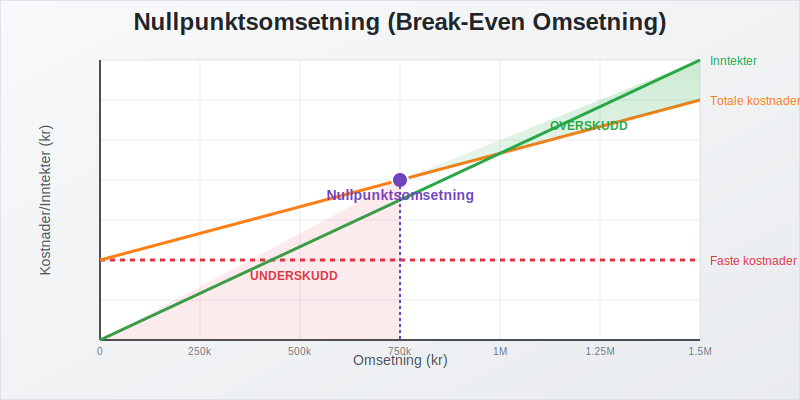
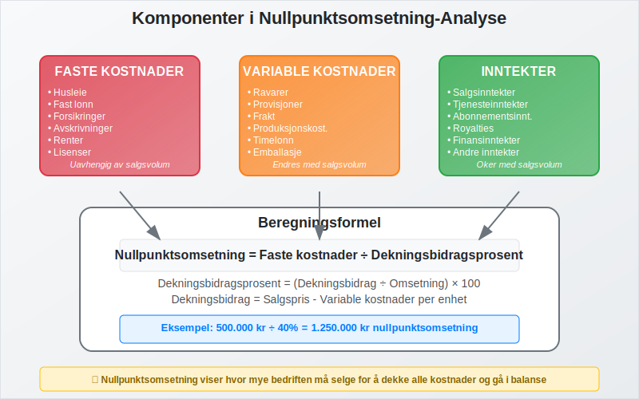
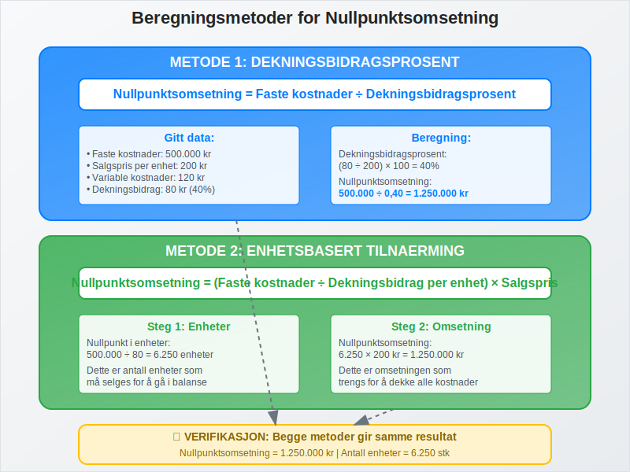
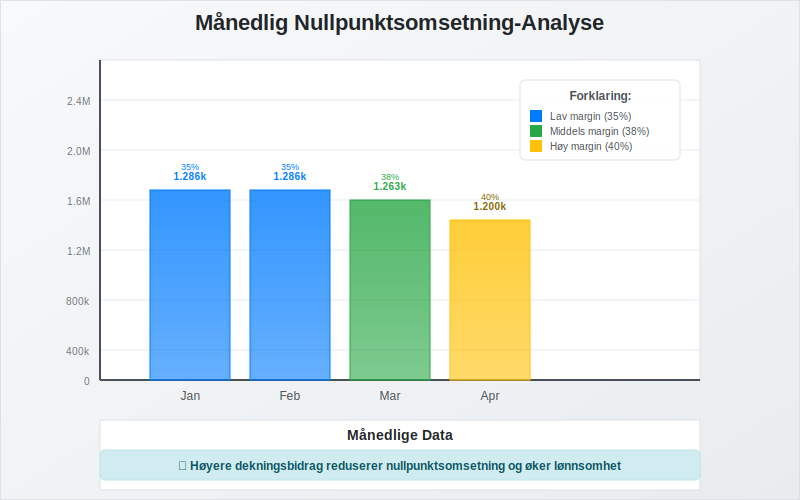
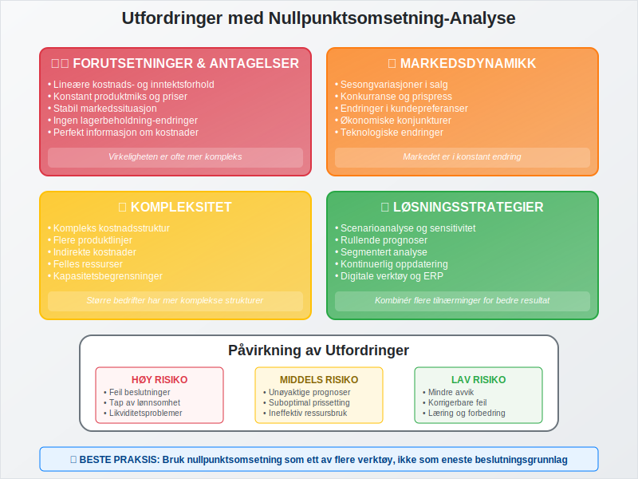
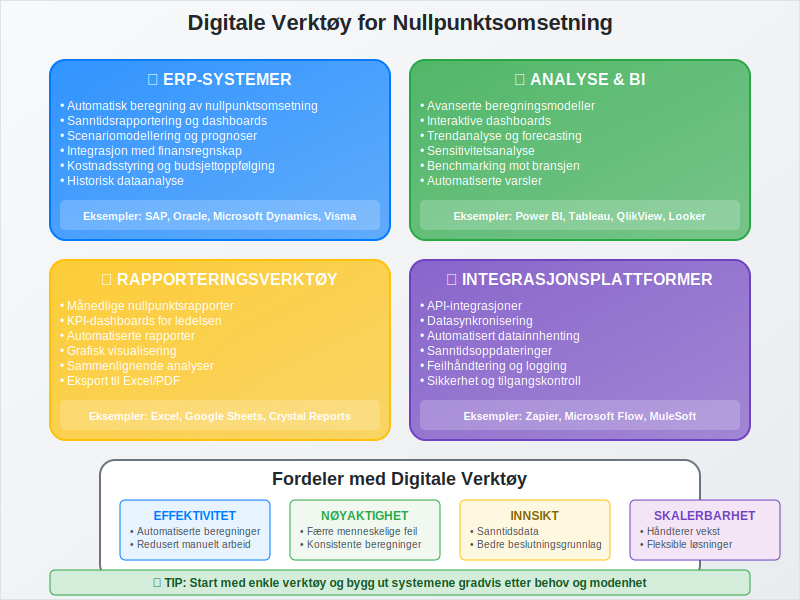

---
title: "Hva er Nullpunktsomsetning (Break-Even Omsetning)?"
seoTitle: "Hva er nullpunktsomsetning? | Break-even omsetning forklart"
description: "Nullpunktsomsetning er omsetningsnivået i kroner som må til for å dekke faste og variable kostnader slik at resultatet er null."
summary: "Lær å beregne nullpunktsomsetning med dekningsbidragsprosent og enhetsmetode, og se hvilke kostnads- og prisfaktorer som påvirker break-even."
---

**Nullpunktsomsetning** er den kritiske [omsetningen](/blogs/regnskap/hva-er-omsetning "Hva er Omsetning? Komplett Guide til Omsetning i Regnskap og Skatt") (salgsvolum i kroner) som en bedrift må oppnå for å dekke alle sine kostnader og gå i balanse. Dette er et fundamentalt konsept innen [regnskap](/blogs/regnskap/hva-er-regnskap "Hva er Regnskap? Komplett Guide til Regnskapsføring og Bokføring") og **økonomisk planlegging** som hjelper bedrifter med å forstå hvor mye de må selge for å unngå tap og begynne å generere overskudd.



## Hva er Nullpunktsomsetning?

Nullpunktsomsetning, også kjent som **break-even omsetning**, er det eksakte [omsetningsnivået](/blogs/regnskap/hva-er-omsetning "Hva er Omsetning? Komplett Guide til Omsetning i Regnskap og Skatt") hvor:

* **Totale inntekter** = **Totale kostnader**
* **Resultat** = 0 (verken overskudd eller underskudd)
* Bedriften har dekket alle sine **faste** og **variable kostnader**
* Grunnlaget for **lønnsomhetsvurdering** og videre vekst er etablert

Dette skiller seg fra [nullpunkt-analyse](/blogs/regnskap/hva-er-nullpunkt "Hva er Nullpunkt (Break-Even) i Regnskap?") ved at det fokuserer spesifikt på **omsetningsvolum i kroner** fremfor antall enheter.

### Betydning for Bedriftsledelse

Nullpunktsomsetning er kritisk for:

* **Salgsplanlegging** og målsetting
* **Budsjettering** og [finansiering](/blogs/regnskap/hva-er-finansiering "Hva er Finansiering? Typer, Metoder og Strategier for Bedrifter")
* **Prisstrategier** og markedsposisjonering
* **Investeringsbeslutninger** og [arbeidskapital](/blogs/regnskap/hva-er-arbeidskapital "Hva er Arbeidskapital? Beregning, Analyse og Optimalisering")-styring
* **Risikovurdering** og [likviditetsstyring](/blogs/regnskap/hva-er-likviditetsstyring "Hva er Likviditetsstyring? Metoder, Verktøy og Best Practices")



## Beregning av Nullpunktsomsetning

Det finnes flere metoder for å beregne nullpunktsomsetning, avhengig av tilgjengelig informasjon og bedriftens struktur.

### Metode 1: Dekningsbidragsprosent

**Formel:**
```
Nullpunktsomsetning = Faste kostnader ÷ Dekningsbidragsprosent
```

**Hvor:**
- **Dekningsbidragsprosent** = ([Dekningsbidrag](/blogs/regnskap/hva-er-dekningsbidrag "Hva er Dekningsbidrag? Beregning, Analyse og Optimalisering") ÷ Omsetning) × 100

**Praktisk eksempel:**

| Parameter | Verdi |
|-----------|-------|
| Totale faste kostnader | 500.000 kr |
| Gjennomsnittlig salgspris per enhet | 200 kr |
| Variable kostnader per enhet | 120 kr |
| Dekningsbidrag per enhet | 80 kr |
| Dekningsbidragsprosent | 40% |

**Beregning:**
- Nullpunktsomsetning = 500.000 ÷ 0,40 = **1.250.000 kr**
- Antall enheter som må selges = 1.250.000 ÷ 200 = **6.250 enheter**

### Metode 2: Enhetsbasert Tilnærming

**Formel:**
```
Nullpunktsomsetning = (Faste kostnader ÷ Dekningsbidrag per enhet) × Salgspris per enhet
```

**Fortsettelse av eksemplet:**
- Nullpunkt i enheter = 500.000 ÷ 80 = 6.250 enheter
- Nullpunktsomsetning = 6.250 × 200 = **1.250.000 kr**



## Faktorer som Påvirker Nullpunktsomsetning

### Kostnadsstruktur

**Faste kostnader** som påvirker nullpunktsomsetning:

* **Husleie** og eiendomskostnader
* **Lønn** til fast ansatte
* **Forsikringer** og avgifter
* **[Avskrivninger](/blogs/regnskap/hva-er-avskrivning "Hva er Avskrivning i Regnskap? Metoder, Beregning og Praktiske Eksempler")** på [anleggsmidler](/blogs/regnskap/hva-er-anleggsmidler "Hva er Anleggsmidler? Materielle, Immaterielle og Finansielle Eiendeler")
* **Renter** på lån og [leverandørgjeld](/blogs/regnskap/hva-er-leverandorgjeld "Hva er Leverandørgjeld? Håndtering, Betaling og Regnskapsføring")

**Variable kostnader** som påvirker dekningsbidraget:

* **Råvarer** og materialkostnader
* **Provisjoner** og salgskostnader
* **Frakt** og logistikk
* **Produksjonskostnader** knyttet til volum

### Prissetting og Markedsforhold

Nullpunktsomsetning påvirkes direkte av:

* **Salgspriser** og prisstrategier
* **Markedskonkurranse** og prispress
* **Produktmiks** og [avanse](/blogs/regnskap/hva-er-avanse "Hva er Avanse? Beregning, Typer og Optimalisering av Fortjenestemargin")
* **Sesongvariasjoner** i salg
* **Kundesegmentering** og betalingsevne

## Praktiske Anvendelser

### Salgsplanlegging og Målsetting

Nullpunktsomsetning brukes til å:

* **Sette realistiske salgsmål** for salgsorganisasjonen
* **Planlegge markedsføringsinvesteringer** og kampanjer
* **Vurdere nye markeder** og kundesegmenter
* **Optimalisere produktporteføljen** basert på [dekningsbidrag](/blogs/regnskap/hva-er-dekningsbidrag "Hva er Dekningsbidrag? Beregning, Analyse og Optimalisering")

### Budsjettering og Prognoser

**Månedlig nullpunktsomsetning:**

| Måned | Faste kostnader | Dekningsbidrag% | Nullpunktsomsetning |
|-------|----------------|-----------------|-------------------|
| Januar | 450.000 kr | 35% | 1.285.714 kr |
| Februar | 450.000 kr | 35% | 1.285.714 kr |
| Mars | 480.000 kr | 38% | 1.263.158 kr |
| April | 480.000 kr | 40% | 1.200.000 kr |



### Scenarioanalyse

**Påvirkning av endringer:**

| Scenario | Endring | Ny nullpunktsomsetning | Effekt |
|----------|---------|----------------------|--------|
| Basis | - | 1.250.000 kr | - |
| Prisøkning 10% | +10% salgspris | 1.136.364 kr | -9,1% |
| Kostnadsreduksjon | -50.000 kr faste kostnader | 1.125.000 kr | -10,0% |
| Effektivisering | +5% dekningsbidrag% | 1.111.111 kr | -11,1% |

## Begrensninger og Utfordringer

### Forutsetninger og Antagelser

Nullpunktsomsetning-analyse baserer seg på flere forutsetninger:

* **Lineære kostnads- og inntektsforhold**
* **Konstant produktmiks** og priser
* **Stabil markedssituasjon**
* **Ingen [lagerbeholdning](/blogs/regnskap/hva-er-lagerbeholdning "Hva er Lagerbeholdning? Verdsetting, Styring og Regnskapsføring")-endringer**

### Praktiske Utfordringer

* **Kompleks kostnadsstruktur** i større bedrifter
* **Sesongvariasjoner** og markedssvingninger
* **Produktmiks-endringer** over tid
* **Konkurranse** og prispress



## Optimalisering av Nullpunktsomsetning

### Strategier for Reduksjon

**Redusere faste kostnader:**

* **Reforhandle leieavtaler** og leverandørkontrakter
* **Automatisering** og effektivisering av prosesser
* **Outsourcing** av ikke-kritiske funksjoner
* **Optimalisering** av [anleggsmidler](/blogs/regnskap/hva-er-anleggsmidler "Hva er Anleggsmidler? Materielle, Immaterielle og Finansielle Eiendeler")

**Øke dekningsbidraget:**

* **Prisoptimalisering** basert på verdi
* **Produktutvikling** med høyere marginer
* **Kostnadsreduksjon** i produksjon og innkjøp
* **Forbedret [leverandørreskontro](/blogs/regnskap/hva-er-leverandorreskontro "Hva er Leverandørreskontro? Håndtering og Optimalisering")**

### Langsiktige Strategier

* **Investering** i teknologi og innovasjon
* **Markedsutvikling** og kundelojalitet
* **Skalering** av forretningsmodellen
* **Diversifisering** av inntektsstrømmer

## Sammenheng med Andre Nøkkeltall

### Lønnsomhetsanalyse

Nullpunktsomsetning er grunnlaget for:

* **[Bruttofortjeneste](/blogs/regnskap/hva-er-bruttofortjeneste "Hva er Bruttofortjeneste? Beregning, Analyse og Optimalisering")-analyse**
* **[Driftsresultat](/blogs/regnskap/hva-er-driftsresultat "Hva er Driftsresultat? Beregning, Analyse og Forbedring")-vurdering**
* **[Avkastning](/blogs/regnskap/hva-er-avkastning "Hva er Avkastning? Beregning, Typer og Analyse av Investeringsavkastning")-beregninger**
* **[Egenkapitalrentabilitet](/blogs/regnskap/hva-er-egenkapitalrentabilitet "Hva er Egenkapitalrentabilitet? Beregning, Analyse og Forbedring")**

### Finansiell Planlegging

Integrering med:

* **[Likviditetsbudsjett](/blogs/regnskap/likviditetsbudsjett "Likviditetsbudsjett - Planlegging og Styring av Kontantstrøm")**
* **[Kontantstrømanalyse](/blogs/regnskap/hva-er-kontantstromanalyse "Hva er Kontantstrømanalyse? Metoder, Beregning og Praktisk Anvendelse")**
* **[Finansregnskap](/blogs/regnskap/hva-er-finansregnskap "Hva er Finansregnskap? Oppbygging, Prinsipper og Rapportering")**
* **[Budsjettering](/blogs/regnskap/hva-er-budsjettering "Hva er Budsjettering? Prosess, Metoder og Best Practices")**

## Digitale Verktøy og Systemer

### ERP-Integrasjon

Moderne [ERP-systemer](/blogs/regnskap/hva-er-erp-system "Hva er ERP-system? Fordeler, Implementering og Valg av Løsning") tilbyr:

* **Automatisk beregning** av nullpunktsomsetning
* **Sanntidsrapportering** og dashboards
* **Scenariomodellering** og prognoser
* **Integrasjon** med [finansregnskap](/blogs/regnskap/hva-er-finansregnskap "Hva er Finansregnskap? Oppbygging, Prinsipper og Rapportering")

### Rapportering og Analyse

* **Månedlige nullpunktsrapporter**
* **Trendanalyse** og historiske data
* **Benchmarking** mot bransjen
* **KPI-dashboards** for ledelsen



## Juridiske og Regnskapsmessige Aspekter

### Regnskapsstandarder

Nullpunktsomsetning-analyse må følge:

* **[Bokføringsloven](/blogs/regnskap/hva-er-bokforingsloven "Hva er Bokføringsloven? Krav, Regler og Praktisk Anvendelse")**
* **[God regnskapsskikk](/blogs/regnskap/god-regnskapsskikk "God Regnskapsskikk - Prinsipper, Regler og Praktisk Anvendelse")**
* **[Norsk RegnskapsStandard (NRS)](/blogs/regnskap/norsk-regnskapsstandard-nrs "Norsk RegnskapsStandard (NRS) - Oversikt og Praktisk Anvendelse")**
* **Internasjonale standarder** for større selskaper

### Dokumentasjon og Revisjon

* **[Dokumentasjon](/blogs/regnskap/hva-er-dokumentasjon-regnskap-bokforing "Hva er Dokumentasjon i Regnskap og Bokføring? Krav og Best Practices")** av beregningsmetoder
* **[Attestering](/blogs/regnskap/hva-er-attestering "Hva er Attestering i Regnskap? Prosess, Ansvar og Best Practices")** av forutsetninger
* **Revisjonsbevis** og kontrollspor
* **Intern kontroll** og kvalitetssikring

## Konklusjon

**Nullpunktsomsetning** er et kritisk verktøy for enhver bedrift som ønsker å forstå sin **lønnsomhetsterskel** og planlegge for bærekraftig vekst. Ved å beherske beregning og analyse av nullpunktsomsetning kan bedrifter:

* **Sette realistiske salgsmål** og budsjetter
* **Optimalisere kostnadsstrukturen** for bedre lønnsomhet
* **Ta informerte beslutninger** om prissetting og investeringer
* **Redusere finansiell risiko** gjennom bedre planlegging

Kombinert med andre regnskapsverktøy som [dekningsbidrag-analyse](/blogs/regnskap/hva-er-dekningsbidrag "Hva er Dekningsbidrag? Beregning, Analyse og Optimalisering"), [kontantstrømanalyse](/blogs/regnskap/hva-er-kontantstromanalyse "Hva er Kontantstrømanalyse? Metoder, Beregning og Praktisk Anvendelse") og [likviditetsstyring](/blogs/regnskap/hva-er-likviditetsstyring "Hva er Likviditetsstyring? Metoder, Verktøy og Best Practices"), gir nullpunktsomsetning-analyse et solid grunnlag for **strategisk bedriftsledelse** og **finansiell planlegging**.

For bedrifter som ønsker å implementere systematisk nullpunktsomsetning-analyse, anbefales det å starte med enkle beregninger og gradvis bygge ut med mer sofistikerte verktøy og [ERP-integrasjon](/blogs/regnskap/hva-er-erp-system "Hva er ERP-system? Fordeler, Implementering og Valg av Løsning") etter hvert som organisasjonen modnes.


