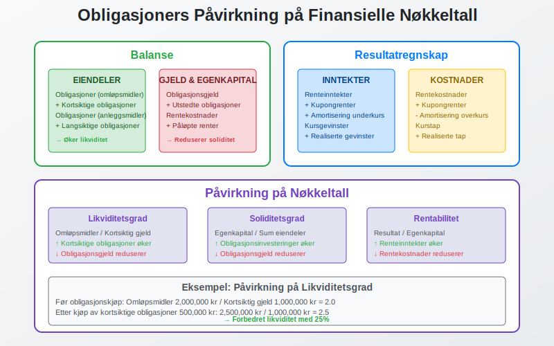

En **obligasjon** er et gjeldsinstrument som representerer et lån mellom en låntaker (utsteder) og en långiver (obligasjonseier). I regnskapssammenheng er obligasjoner viktige finansielle instrumenter som krever spesiell behandling og forståelse av deres påvirkning på bedriftens finansielle stilling.

For entydig identifikasjon av verdipapirer, se [Hva er ISIN-nummer?](/blogs/regnskap/hva-er-isin-nummer "Hva er ISIN-nummer? Internasjonal Verdipapirkode i Norge").

For informasjon om emisjonsrabatt ved utstedelse av obligasjoner, se [Hva er Disagio?](/blogs/regnskap/disagio "Hva er Disagio? Emisjonsrabatt på lån og obligasjoner").

For mer informasjon om fond som investerer i obligasjoner, se [Hva er Obligasjonsfond?](/blogs/regnskap/hva-er-obligasjonsfond "Hva er Obligasjonsfond? Guide til Obligasjonsfond").


## Definisjon av Obligasjon

En **obligasjon** er et verdipapir som dokumenterer en gjeldsforpliktelse. Når en bedrift eller offentlig myndighet utsteder en obligasjon, låner de penger fra investorer mot å betale tilbake hovedstolen på et bestemt tidspunkt, samt betale renter underveis.

### Hovedkomponenter i en Obligasjon

* **Pålydende verdi** (nominell verdi) - det beløpet som skal tilbakebetales ved forfall
* **Kupongrente** - den årlige renten som betales til obligasjonseieren
* **Løpetid** - tiden fra utstedelse til forfall
* **Forfallsdato** - datoen når hovedstolen skal tilbakebetales
* **Utsteder** - den som låner pengene (bedrift, kommune, stat)


## Typer Obligasjoner

### Etter Utsteder

#### Statsobligasjoner
Utstedt av den norske stat og regnes som de sikreste obligasjonene:

* **Lav risiko** - staten har høy kredittverdighet
* **Lavere avkastning** - reflekterer den lave risikoen
* **Benchmark** for andre obligasjoner i markedet
* Ofte brukt som [sikre investeringer](/blogs/regnskap/hva-er-investere "Hva er å Investere? Guide til Investeringer og Kapitalplassering") i porteføljer

#### Kommuneobligasjoner
Utstedt av norske kommuner og fylkeskommuner:

* **Moderat risiko** - avhenger av kommunens økonomi
* **Skattefordeler** kan gjelde for enkelte investorer
* Finansierer offentlige prosjekter og infrastruktur

#### Bedriftsobligasjoner
Utstedt av private selskaper for å finansiere virksomheten:

* **Varierende risiko** - avhenger av selskapets finansielle stilling
* **Høyere avkastning** enn statsobligasjoner
* Krever grundig analyse av utsteders [kredittverdighet](/blogs/regnskap/hva-er-betalingsevne "Hva er Betalingsevne? Guide til Vurdering av Finansiell Soliditet")

### Etter Rentestruktur

#### Fastrenteobligasjoner
* **Fast kupongrente** gjennom hele løpetiden
* **Forutsigbare** kontantstrømmer
* **Renterisiko** - verdien påvirkes av renteendringer

#### Flytende renteobligasjoner
* **Variabel rente** som justeres periodisk
* **Mindre renterisiko** enn fastrenteobligasjoner
* Renten knyttes ofte til en referanserente som NIBOR


## Regnskapsmessig Behandling

### Klassifisering i Regnskapet

Obligasjoner klassifiseres forskjellig avhengig av om bedriften er utsteder eller eier:

#### Som Utsteder (Gjeld)
Når bedriften utsteder obligasjoner, klassifiseres de som [gjeld](/blogs/regnskap/hva-er-gjeld "Hva er Gjeld? Komplett Guide til Gjeldstyper og Regnskapsføring"):

* **Kortsiktig gjeld** - forfaller innen 12 måneder
* **Langsiktig gjeld** - forfaller etter 12 måneder
* Føres til [amortisert kost](/blogs/regnskap/hva-er-amortisering "Hva er Amortisering? Guide til Avskrivning av Immaterielle Eiendeler")

#### Som Investor (Eiendel)
Når bedriften eier obligasjoner, klassifiseres de som [finansielle eiendeler](/blogs/regnskap/hva-er-eiendel "Hva er en Eiendel? Komplett Guide til Eiendeler i Regnskap"):

* **Omløpsmidler** - kortsiktige investeringer
* **Anleggsmidler** - langsiktige investeringer
* Verdsettes etter formålet med investeringen

### Verdsettelsesmetoder

| Kategori | Verdsettelsesmetode | Verdiendringer |
|----------|-------------------|----------------|
| **Hold til forfall** | Amortisert kost | Ikke resultatført |
| **Handelsformål** | Virkelig verdi | Resultatført |
| **Tilgjengelig for salg** | Virkelig verdi | Egenkapital |


## Regnskapsføring av Obligasjoner

### Ved Kjøp av Obligasjoner

Når en bedrift kjøper obligasjoner, regnskapsføres transaksjonen slik:

```
Debet: Obligasjoner (eiendel)
Kredit: Bank/Kontanter
```

**Eksempel**: Kjøp av obligasjon pålydende 1 000 000 kr til kurs 102:
* Kostpris: 1 020 000 kr
* [Overkurs](/blogs/regnskap/hva-er-avanse "Hva er Avanse? Guide til Fortjeneste og Marginer"): 20 000 kr

### Renteberegning og Periodisering

Obligasjonsrenter må [periodiseres](/blogs/regnskap/hva-er-avstemming "Hva er Avstemming? Guide til Regnskapsmessig Avstemming") korrekt:

* **Påløpte renter** regnskapsføres som [inntekt](/blogs/regnskap/hva-er-inntekter "Hva er Inntekter? Komplett Guide til Inntektsføring") eller kostnad
* **Kupongrenter** regnskapsføres når de mottas/betales
* **Amortisering** av over-/underkurs fordeles over løpetiden


## Risikofaktorer ved Obligasjoner

### Kreditrisiko
Risikoen for at utsteder ikke kan oppfylle sine forpliktelser:

* **Vurdering** gjennom kredittvurderingsbyråer (Moody's, S&P, Fitch)
* **Overvåking** av utsteders finansielle utvikling
* **Diversifisering** for å redusere konsentrasjonsrisiko

### Renterisiko
Risikoen for verdiendringer ved renteendringer:

* **Durasjon** måler følsomheten for renteendringer
* **Lange obligasjoner** har høyere renterisiko
* **Fastrenteobligasjoner** påvirkes mer enn flytende

### Likviditetsrisiko
Risikoen for ikke å kunne selge obligasjonen raskt:

* **Markedsdybde** påvirker likviditeten
* **Bedriftsobligasjoner** ofte mindre likvide enn statsobligasjoner
* **Bid-ask spread** indikerer likviditetskostnader

## Obligasjoner i Finansiell Analyse

### Nøkkeltall for Obligasjoner

| Nøkkeltall | Formel | Betydning |
|------------|--------|-----------|
| **Løpende avkastning** | Årlig kupong / Markedspris | Årlig avkastning |
| **Avkastning til forfall** | IRR av alle kontantstrømmer | Total avkastning |
| **Durasjon** | Vektet gjennomsnitt av kontantstrømmer | Renterisiko |
| **Konveksitet** | Endring i durasjon | Ikke-lineær renterisiko |

### Påvirkning på Finansielle Nøkkeltall

Obligasjoner påvirker viktige finansielle nøkkeltall:

* **[Likviditetsgrad](/blogs/regnskap/hva-er-likviditetsgrad "Hva er Likviditetsgrad? Guide til Beregning og Analyse")** - kortsiktige obligasjoner øker likviditeten
* **[Soliditetsgrad](/blogs/regnskap/hva-er-egenkapital "Hva er Egenkapital? Komplett Guide til Egenkapital i Regnskap")** - obligasjonsgjeld reduserer soliditeten
* **Rentekostnader** - påvirker [driftsresultatet](/blogs/regnskap/hva-er-driftsresultat "Hva er Driftsresultat? Guide til Beregning og Analyse")



## Skattemessige Forhold

### For Obligasjonseiere

#### Renteinntekter
* **Skattepliktige** som [kapitalinntekt](/blogs/regnskap/hva-er-kapitalgevinst "Hva er Kapitalgevinst? Guide til Beskatning av Gevinst og Tap")
* **Periodiseres** etter opptjeningsprinsippet
* **Kildeskatt** kan gjelde for utenlandske obligasjoner

#### Kursgevinster og -tap
* **Realiserte** gevinster/tap er skattepliktige/fradragsberettigede
* **Urealiserte** verdiendringer ikke skattepliktige
* **Valutagevinster** på utenlandske obligasjoner beskattes

### For Obligasjonsutstedere

* **Rentekostnader** er fradragsberettigede
* **Emisjonskostnader** kan aktiveres og amortiseres
* **Innfrielse** over/under pålydende påvirker skattepliktig inntekt

## Internasjonale Regnskapsstandarder

### IFRS-krav
Under [IFRS](/blogs/regnskap/hva-er-ifrs "Hva er IFRS? Guide til Internasjonale Regnskapsstandarder") klassifiseres obligasjoner etter IFRS 9:

* **Amortisert kost** - hold til forfall
* **Virkelig verdi over resultat** - handelsformål
* **Virkelig verdi over totalresultat** - andre investeringer

### Norske Regnskapsstandarder
Under [norsk regnskapslov](/blogs/regnskap/norsk-regnskapsstandard-nrs "Norsk Regnskapsstandard (NRS) - Komplett Guide") gjelder enklere regler:

* **Kostpris** som hovedregel
* **Laveste verdis prinsipp** for omløpsmidler
* **Virkelig verdi** kun i spesielle tilfeller


## Praktiske Eksempler

### Eksempel 1: Kjøp av Statsobligasjon

**Situasjon**: Bedrift kjøper statsobligasjon pålydende 500 000 kr, kupongrente 3%, løpetid 5 år, til kurs 98.

**Regnskapsføring ved kjøp**:
```
Debet: Obligasjoner 490 000 kr
Kredit: Bank 490 000 kr
```

**Årlig renteberegning**:

* Kupongbetaling: 500 000 × 3% = 15 000 kr
* Amortisering av underkurs: (500 000 - 490 000) ÷ 5 = 2 000 kr
* Total renteinntekt: 15 000 + 2 000 = 17 000 kr

### Eksempel 2: Utstedelse av Bedriftsobligasjon

**Situasjon**: Bedrift utsteder obligasjon pålydende 2 000 000 kr, kupongrente 4%, løpetid 3 år, til kurs 101.

**Regnskapsføring ved utstedelse**:
```
Debet: Bank 2 020 000 kr
Kredit: Obligasjonsgjeld 2 020 000 kr
```

**Årlig kostnad**:

* Kupongbetaling: 2 000 000 × 4% = 80 000 kr
* Amortisering av [overkurs](/blogs/regnskap/hva-er-overkurs "Hva er Overkurs? En Guide til Overkurs i Regnskap"): (2 020 000 - 2 000 000) ÷ 3 = 6 667 kr
* Total rentekostnad: 80 000 - 6 667 = 73 333 kr

## Obligasjoner vs. Andre Finansieringsinstrumenter

### Sammenligning med Banklån

| Aspekt | Obligasjoner | Banklån |
|--------|-------------|---------|
| **Fleksibilitet** | Mindre fleksibel | Mer fleksibel |
| **Kostnad** | Ofte lavere rente | Høyere rente + gebyrer |
| **Sikkerhet** | Kan være usikret | Ofte sikret |
| **Omsettbarhet** | Kan omsettes | Ikke omsettbart |
| **Dokumentasjon** | Omfattende | Enklere |

### Sammenligning med Aksjer

| Aspekt | Obligasjoner | [Aksjer](/blogs/regnskap/hva-er-en-aksje "Hva er en Aksje? Komplett Guide til Aksjer og Eierskap") |
|--------|-------------|-------|
| **Eierskap** | Ingen eierrett | Eierrett |
| **Avkastning** | Fast/forutsigbar | Variabel |
| **Risiko** | Lavere | Høyere |
| **Prioritet** | Før aksjonærer | Etter kreditorer |
| **Løpetid** | Bestemt | Ubestemt |


## Obligasjonsmarkedet i Norge

### Markedsstruktur

Det norske obligasjonsmarkedet består av:

* **Primærmarked** - nyutstedelser
* **Sekundærmarked** - handel med eksisterende obligasjoner
* **Oslo Børs** - organisert markedsplass
* **OTC-markedet** - direkte handel mellom parter

### Viktige Aktører

* **Utstedere** - stat, kommuner, bedrifter
* **Investorer** - banker, forsikringsselskaper, pensjonsfond
* **Meglere** - formidler handel
* **Markedsmakere** - sørger for likviditet

### Regulering og Tilsyn

* **Finanstilsynet** - overvåker markedet
* **Verdipapirhandelloven** - regulerer handel
* **Prospektforskriften** - krav til informasjon
* **MiFID II** - europeiske regler

## Fremtidige Utviklingstrekk

### Grønne Obligasjoner

**Grønne obligasjoner** finansierer miljøvennlige prosjekter:

* **Økende popularitet** blant investorer
* **Spesielle rapporteringskrav** for bruk av midler
* **Lavere finansieringskostnader** for utstedere
* **ESG-fokus** driver etterspørselen

### Digitalisering

* **Blockchain-teknologi** for utstedelse og handel
* **Automatiserte** kuponbetalinger
* **Økt transparens** og effektivitet
* **Reduserte** transaksjonskostnader

### Bærekraftsrapportering

I tråd med [CSRD](/blogs/regnskap/hva-er-csrd "Hva er CSRD? Guide til Corporate Sustainability Reporting Directive") og [ESG](/blogs/regnskap/hva-er-esg "Hva er ESG? Guide til Environmental, Social og Governance"):

* **Bærekraftskrav** for obligasjonsutstedere
* **Klimarisiko** i verdsettelse
* **Grønn taksonomi** påvirker klassifisering


## Konklusjon

Obligasjoner er **fundamentale finansielle instrumenter** som spiller en viktig rolle i både bedrifters finansiering og investering. For regnskapsførere og finansielle analytikere er det essensielt å forstå:

* **Regnskapsmessig behandling** av obligasjoner som gjeld og eiendel
* **Verdsettelsesmetoder** og deres påvirkning på regnskapet
* **Risikofaktorer** og hvordan de håndteres
* **Skattemessige konsekvenser** av obligasjonsinvesteringer
* **Markedsdynamikk** og fremtidige utviklingstrekk

Korrekt håndtering av obligasjoner i regnskapet sikrer **nøyaktig finansiell rapportering** og gir grunnlag for gode finansielle beslutninger. Med økende fokus på bærekraft og digitalisering vil obligasjonsmarkedet fortsette å utvikle seg, noe som krever kontinuerlig oppdatering av kunnskap og praksis.

Ved å forstå obligasjoners kompleksitet kan bedrifter optimalisere sin [kapitalstruktur](/blogs/regnskap/hva-er-kapital "Hva er Kapital? Komplett Guide til Kapitaltyper og Kapitalforvaltning") og investorer kan ta informerte beslutninger om sine porteføljer.


