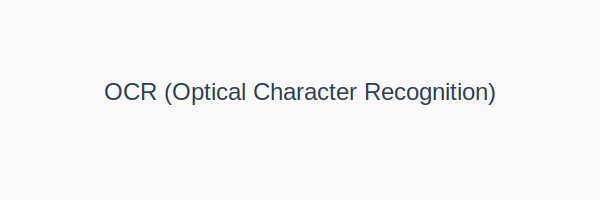
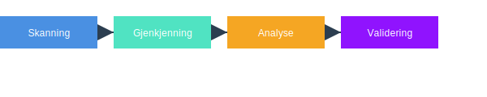

---
title: "Hva er OCR? Optical Character Recognition i Regnskap"
meta_title: "Hva er OCR? Optical Character Recognition i Regnskap"
meta_description: '**OCR (Optical Character Recognition)** er en teknologi som konverterer skannet tekst fra dokumenter, PDF-er og bilder til redigerbar data. I moderne [regnskaps...'
slug: hva-er-ocr
type: blog
layout: pages/single
---

**OCR (Optical Character Recognition)** er en teknologi som konverterer skannet tekst fra dokumenter, PDF-er og bilder til redigerbar data. I moderne [regnskapssystemer](/blogs/regnskap/hva-er-regnskap "Hva er Regnskap? En komplett guide") og [fakturabehandling](/blogs/regnskap/hva-er-fakturatolk "Hva er Fakturatolk? AI-drevet Fakturabehandling og Automatisering"), brukes OCR for å automatisere innsanking av bilagsdata, redusere manuelle feil og øke effektiviteten.

### Hvordan fungerer OCR?

OCR-prosessen kan deles i fire hovedtrinn:
1. **Skanning og bildebehandling:** Dokumenter skannes eller lastes opp som PDF/ bilde, deretter fjernes støy og kontrast justeres.
2. **Tegngjenkjenning (OCR):** Systemet identifiserer tegn ved hjelp av mønstergjenkjenning og maskinlæring.
3. **Ord- og setningsanalyse:** Gjenkjente tegn kobles sammen til ord og setninger, ofte med ordbokvalidering.
4. **Etterbehandling og validering:** Data valideres mot forretningsregler og kontrolleres for avvik.

### Bruksområder i regnskap

OCR-teknologi benyttes i flere deler av regnskapsarbeidet for å spare tid og redusere feil:
* **Automatisert bilagsregistrering:** Hent ut nøkkelinformasjon fra fakturaer, kvitteringer og andre bilag.
* **Fakturabehandling:** Se [Fakturabehandling](/blogs/regnskap/hva-er-fakturatolk "Hva er Fakturatolk? AI-drevet Fakturabehandling og Automatisering").
* **Bankavstemming:** Automatisk matching av transaksjoner med [bankavstemming](/blogs/regnskap/hva-er-bankavstemming "Hva er Bankavstemming? Komplett Guide til Bankavstemminger").
* **Periodisering:** Hjelp ved [periodisering](/blogs/regnskap/hva-er-periodisering "Hva er Periodisering? En komplett guide").
* **Regnskapsrapportering:** Rask tilgang på strukturert data for rapporter.

### Fordeler med OCR

OCR-teknologi gir flere viktige fordeler sammenlignet med manuell registrering:
* **Redusert manuell inntasting:** Opptil 90 % besparelse i tid.
* **Rask tilgang til data:** Umiddelbar konvertering fra dokument til regnskapssystem.
* **Færre feil:** Feilrate pÃ¥ 0,1“1 % versus 3“5 % manuelt.
* **Bedre sporbarhet:** Fullt audit trail med digitale bilag.
* **Skalerbarhet:** HÃ¥ndter store volum uten ekstra bemanning.

### Sammenligning: Manuell vs OCR

| Egenskap                | Manuell registrering | OCR-teknologi                              |
|-------------------------|----------------------|---------------------------------------------|
| **Hastighet**           | Lav                  | Høy (millisekunder per side)               |
| **Feilrate**            | 3“5 %                | 0,1“1 %                                    |
| **Kostnad per side**    | Ca. 2 NOK            | Ca. 0,2 NOK                                |
| **Skalerbarhet**        | Begrenset            | Svært god                                  |

For mer informasjon om praktisk bruk av OCR i fakturahåndtering, se [Fakturabehandling](/blogs/regnskap/hva-er-fakturatolk "Hva er Fakturatolk? AI-drevet Fakturabehandling og Automatisering").

Utforsk også [BankGiro](/blogs/regnskap/hva-er-bankgiro "Hva er BankGiro? Komplett Guide til Norsk Betalingssystem") for bruk av OCR-nummer i betalingsprosesser.

