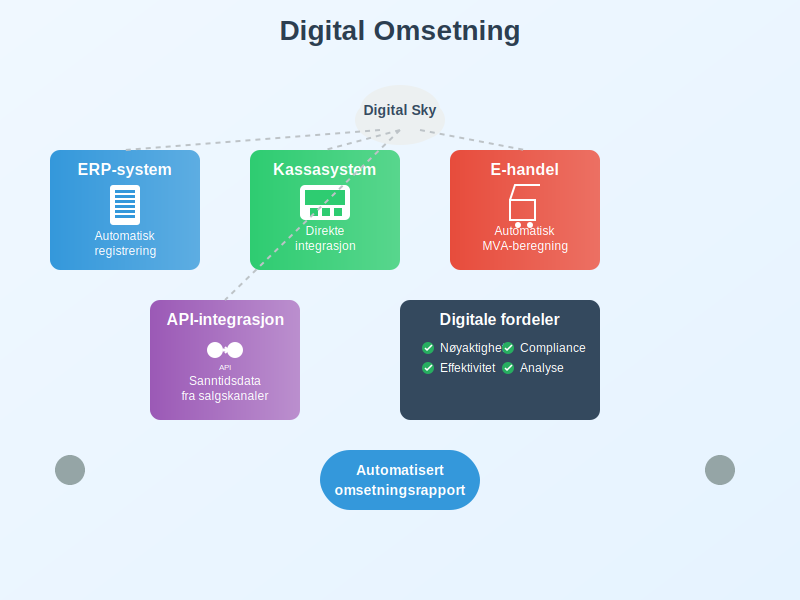

**Omsetning** er den totale verdien av alle varer og tjenester som et selskap selger i løpet av en bestemt periode, målt til salgspris inkludert merverdiavgift. Omsetning er et grunnleggende begrep i regnskap og skatt, og skiller seg fra [inntekter](/blogs/regnskap/hva-er-inntekter "Hva er Inntekter? Komplett Guide til Inntektstyper og Regnskapsføring") ved at den inkluderer MVA og måles til bruttoverdi før fradrag for kostnader.

## Definisjon og Grunnleggende Prinsipper

Omsetning defineres som **bruttoverdien** av alle salg av varer og tjenester som inngår i virksomhetens ordinære drift, inkludert merverdiavgift. Dette er et viktig skille fra [driftsinntekter](/blogs/regnskap/hva-er-driftsinntekter "Hva er Driftsinntekter? Komplett Guide til Driftsinntekter i Regnskap") som måles eksklusive MVA.


### Kjennetegn ved Omsetning:

* **Bruttoverdi:** Inkluderer merverdiavgift og andre avgifter
* **Salgspris:** Måles til den pris kunden betaler
* **Ordinær drift:** Kun salg som er del av normal forretningsvirksomhet
* **Periodisering:** Måles for en bestemt tidsperiode (måned, kvartal, år)

## Forskjellen mellom Omsetning og Inntekt

Det er viktig å forstå forskjellen mellom omsetning og inntekt, da disse begrepene ofte forveksles men har ulike betydninger i regnskapssammenheng.


### Sammenligning av Omsetning og Inntekt:

| Aspekt | Omsetning | Inntekt |
|--------|-----------|---------|
| **MVA-behandling** | Inkluderer MVA | Ekskluderer MVA |
| **Måling** | Bruttoverdi | Nettoverdi |
| **Formål** | MVA-beregning, statistikk | Regnskapsføring, resultatmåling |
| **Rapportering** | MVA-melding, årsrapport | [Resultatregnskap](/blogs/regnskap/hva-er-driftsregnskap "Hva er Driftsregnskap? Komplett Guide til Driftsregnskapet") |
| **Eksempel** | 125 000 kr (inkl. 25% MVA) | 100 000 kr (eks. MVA) |

### Praktisk Eksempel:

**Salg av varer for 100 000 kr + 25% MVA:**
* **Omsetning:** 125 000 kr (inkl. MVA)
* **Inntekt:** 100 000 kr (eks. MVA)
* **MVA-beløp:** 25 000 kr

## Beregning av Omsetning

Omsetning beregnes som summen av alle salg i en periode, inkludert merverdiavgift og andre relevante avgifter.


### Grunnleggende Formel:

**Omsetning = Antall solgte enheter × Salgspris (inkl. MVA)**

### Detaljert Beregningseksempel:

| Produkt | Antall | Pris eks. MVA | MVA (25%) | Pris inkl. MVA | Omsetning |
|---------|--------|---------------|-----------|----------------|-----------|
| Produkt A | 100 | 500 kr | 125 kr | 625 kr | 62 500 kr |
| Produkt B | 50 | 1 000 kr | 250 kr | 1 250 kr | 62 500 kr |
| Produkt C | 25 | 2 000 kr | 500 kr | 2 500 kr | 62 500 kr |
| **Total** | **175** | - | - | - | **187 500 kr** |

### Månedlig Omsetningsberegning:

```
Januar:    150 000 kr
Februar:   175 000 kr
Mars:      200 000 kr
Q1 Total:  525 000 kr
```

## MVA og Omsetningsgrenser

Omsetning er avgjørende for å bestemme [MVA-plikt](/blogs/regnskap/mva-plikt "MVA-plikt: Komplett Guide til Merverdiavgiftsplikt i Norge") og andre skattemessige forpliktelser.


### Viktige Omsetningsgrenser i Norge (2024):

| Grense | Beløp | Konsekvens |
|--------|-------|------------|
| **MVA-registrering** | 50 000 kr | Plikt til MVA-registrering |
| **Forenklingsregelen** | 140 000 kr | Kan bruke kontantprinsippet |
| **Regnskapsplikt** | 5 000 000 kr | Plikt til revidert regnskap |
| **Bokføringsplikt** | Alle med omsetning | Plikt til [bokføring](/blogs/regnskap/hva-er-bokforing "Hva er Bokføring? Komplett Guide til Regnskapsføring") |

### MVA-registrering og Omsetning:

**Når må du registrere deg for MVA?**

* **Omsetning over 50 000 kr** i løpet av 12 måneder
* **Forventet omsetning** over 50 000 kr neste 12 måneder
* **Import av varer** for videresalg

## Omsetning i Ulike Bransjer

Omsetning måles og rapporteres forskjellig avhengig av bransje og virksomhetstype.


### Omsetning etter Bransje:

| Bransje | Omsetningstype | Særlige Hensyn |
|---------|----------------|----------------|
| **Detaljhandel** | Varesalg | Inkluderer alle produktsalg ([B2C-handel](/blogs/regnskap/hva-er-b2c "Hva er B2C? Business-to-Consumer i Regnskap")) |
| **Tjenesteyting** | [Honorar](/blogs/regnskap/hva-er-honorar "Hva er Honorar i Regnskap? Komplett Guide til Honorarutbetalinger og Skattebehandling") og gebyrer | Kan ha ulik MVA-sats |
| **Produksjon** | Produserte varer | Inkluderer både B2B og [B2C](/blogs/regnskap/hva-er-b2c "Hva er B2C? Business-to-Consumer i Regnskap") |
| **Eiendom** | Leieinntekter | Kan være MVA-fritatt |
| **Digital** | Abonnementer, lisenser | Spesielle regler for digitale tjenester |

### Eksempel - Konsulentselskap:

**Månedlig omsetning:**
* Konsulenthonorar: 80 000 kr (eks. MVA)
* MVA (25%): 20 000 kr
* **Total omsetning:** 100 000 kr

## Regnskapsføring og Rapportering av Omsetning

Selv om omsetning inkluderer MVA, må den regnskapsføres korrekt for å skille mellom salgsinntekt og MVA-forpliktelse.


### Bokføringseksempel - Varesalg:

**Ved salg for 125 000 kr (inkl. 25% MVA):**
```
Debet: Kundefordringer     125 000
Kredit: Salgsinntekter     100 000
Kredit: Utgående MVA        25 000
```

**Ved mottak av betaling:**
```
Debet: Bank                125 000
Kredit: Kundefordringer    125 000
```

### MVA-melding og Omsetning:

I [MVA-meldingen](/blogs/regnskap/hva-er-mva-melding "Hva er MVA-melding? Komplett Guide til MVA-rapportering") rapporteres:
* **Omsetning høy sats (25%):** Salg med 25% MVA
* **Omsetning middels sats (15%):** Salg med 15% MVA  
* **Omsetning lav sats (11,11%):** Salg med redusert MVA-sats
* **Omsetning fritatt:** Salg uten MVA

## Omsetningsanalyse og Nøkkeltall

Omsetning brukes til å beregne viktige nøkkeltall for å vurdere virksomhetens prestasjoner og utvikling.


### Viktige Omsetningsnøkkeltall:

| Nøkkeltall | Formel | Formål |
|------------|--------|--------|
| **Omsetningsvekst** | (Ny omsetning - Gammel omsetning) / Gammel omsetning × 100% | Måle vekst |
| **Omsetning per ansatt** | Total omsetning / Antall ansatte | Produktivitetsmåling |
| **Omsetning per kunde** | Total omsetning / Antall kunder | Kundeverdimåling (viktig i [B2C](/blogs/regnskap/hva-er-b2c "Hva er B2C? Business-to-Consumer i Regnskap")) |
| **Månedlig gjennomsnitt** | Årsomsetning / 12 | Planlegging og budsjett |

### Eksempel på Omsetningsanalyse:

**Årlig utvikling:**
* 2022: 1 200 000 kr
* 2023: 1 440 000 kr
* **Vekst:** (1 440 000 - 1 200 000) / 1 200 000 × 100% = **20%**

## Omsetning og Skattemessige Konsekvenser

Omsetning påvirker flere skattemessige forhold og forpliktelser for virksomheten.


### Skattemessige Implikasjoner:

* **MVA-plikt:** Automatisk ved omsetning over 50 000 kr
* **Regnskapsplikt:** Påvirker krav til regnskapsføring
* **Revisjonsplikt:** Ved høy omsetning kreves revisor
* **Arbeidsgiveravgift:** Påvirkes av virksomhetens størrelse

### Omsetning og Selskapsform:

| Selskapsform | Omsetningsgrense | Konsekvens |
|--------------|------------------|------------|
| **[Enkeltpersonforetak](/blogs/regnskap/hva-er-enkeltpersonforetak "Hva er Enkeltpersonforetak? Komplett Guide til ENK")** | Ingen spesielle grenser | Standard MVA-regler |
| **[Aksjeselskap](/blogs/regnskap/hva-er-et-aksjeselskap "Hva er et Aksjeselskap? Komplett Guide til AS")** | 5 mill. kr | Revisjonsplikt |
| **Ansvarlig selskap** | Varierer | Avhenger av deltakere |

## Digitalisering og Omsetningsrapportering

Moderne teknologi har endret hvordan omsetning registreres og rapporteres.



### Digitale Løsninger:

* **[ERP-systemer](/blogs/regnskap/hva-er-erp-system "Hva er ERP-system? Komplett Guide til Enterprise Resource Planning"):** Automatisk omsetningsregistrering
* **Kassasystemer:** Direkteintegrasjon med regnskapssystem (kritisk for [B2C-virksomheter](/blogs/regnskap/hva-er-b2c "Hva er B2C? Business-to-Consumer i Regnskap"))
* **E-handel:** Automatisk MVA-beregning og rapportering
* **API-integrasjoner:** Sanntidsdata fra salgskanaler

### Fordeler med Digital Omsetningsregistrering:

* **Nøyaktighet:** Reduserer manuelle feil
* **Effektivitet:** Automatiserer rutineoppgaver
* **Compliance:** Sikrer korrekt MVA-rapportering
* **Analyse:** Bedre innsikt i omsetningsutvikling

## Internasjonale Aspekter ved Omsetning

For virksomheter med internasjonal aktivitet gjelder spesielle regler for omsetningsberegning.


### Spesielle Hensyn:

* **Eksport:** Ofte MVA-fritatt, påvirker omsetningsberegning
* **Import:** Kan påvirke MVA-registreringsplikt
* **Digitale tjenester:** Spesielle regler for grensekryssende salg
* **Valutaomregning:** Omsetning må omregnes til NOK

## Praktiske Tips for Omsetningsregistrering

For å sikre korrekt omsetningsregistrering og -rapportering bør virksomheter følge beste praksis.


### Anbefalinger:

* **Daglig registrering:** Registrer salg løpende
* **Dokumentasjon:** Oppbevar alle [fakturaer](/blogs/regnskap/hva-er-en-faktura "Hva er en Faktura? En Guide til Norske Fakturakrav") og kvitteringer
* **Avstemming:** Avstem omsetning mot bankinnskudd
* **Periodisk kontroll:** Gjennomgå omsetningsrapporter månedlig
* **Profesjonell hjelp:** Bruk regnskapsfører ved behov

### Vanlige Feil å Unngå:

* **Glemme MVA:** Ikke inkludere MVA i omsetningsberegning
* **Feil periodisering:** Føre omsetning i feil periode
* **Manglende dokumentasjon:** Ikke oppbevare salgsbilag
* **Feil klassifisering:** Blande omsetning med andre inntekter

## Omsetning og Fremtidige Trender

Omsetningsbegrepet utvikler seg med nye forretningsmodeller og teknologi.


### Nye Trender:

* **Abonnementsmodeller:** Endrer hvordan omsetning måles
* **Platform-økonomi:** Nye utfordringer for omsetningsberegning
* **Kryptovaluta:** Påvirker omsetningsregistrering
* **Bærekraft:** ESG-rapportering inkluderer omsetningsdata

### Regulatoriske Endringer:

* **Digitale kvitteringer:** Nye krav til dokumentasjon
* **Sanntidsrapportering:** Mulige fremtidige krav
* **Automatiserte systemer:** Økte krav til systemintegrasjon

## Konklusjon

Omsetning er et fundamentalt begrep i norsk regnskap og skatt som påvirker alt fra MVA-registrering til regnskapsplikt. Ved å forstå forskjellen mellom omsetning og [inntekt](/blogs/regnskap/hva-er-inntekter "Hva er Inntekter? Komplett Guide til Inntektstyper og Regnskapsføring"), korrekt beregning og rapportering, kan virksomheter sikre compliance og få bedre innsikt i sin økonomiske utvikling.

For virksomheter er det viktig å ha gode systemer for omsetningsregistrering og å forstå de skattemessige konsekvensene av ulike omsetningsnivåer. Med riktig kunnskap og verktøy blir omsetningsadministrasjon en verdifull del av virksomhetsstyringen.


