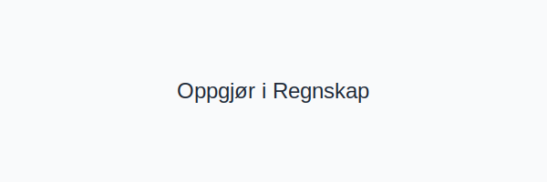

---
title: "Hva er Oppgjør i Regnskap?"
seoTitle: "Hva er Oppgjør i Regnskap?"
description: '(**Oppgjør i regnskap** er prosessen for å **avslutte** og **oppgjøre** regnskapsposter for å sikre at alle transaksjoner og periodiseringer er korrekt bokf...'
---

(**Oppgjør i regnskap** er prosessen for å **avslutte** og **oppgjøre** regnskapsposter for å sikre at alle transaksjoner og periodiseringer er korrekt bokført og rapportert.)

Se også [Hva er Oppgjør?](/blogs/regnskap/hva-er-oppgjor "Hva er Oppgjør i Regnskap? Komplett Guide til Oppgjør") for en oversikt over ulike oppgjørsprosesser i regnskap, som MVA-oppgjør, årsoppgjør og kasseoppgjør.



## Hva er Oppgjør?

Oppgjør innebærer å avslutte regnskapsperioder eller transaksjoner ved å gjøre opp alle føringer, avstemminger og periodiseringer slik at regnskapet gjenspeiler den faktiske økonomiske situasjonen.

## Typer Oppgjør

| Type oppgjør        | Beskrivelse                                                     | Eksempel                                   |
|---------------------|-----------------------------------------------------------------|--------------------------------------------|
| **MVA-oppgjør**     | Oppgjør av merverdiavgift via periodisk MVA-melding             | [MVA-melding](/blogs/regnskap/hva-er-mva-melding "Hva er MVA-melding? Komplett Guide til Merverdiavgiftsrapportering i Norge") |
| **Årsoppgjør**      | Avslutning av regnskapsåret med utarbeidelse av årsregnskap og [skatteoppgjør](/blogs/regnskap/skatteoppgjor "Skatteoppgjør Guide: Prosess, Tidslinje og Viktige Frister") | [Årsoppgave](/blogs/regnskap/hva-er-aarsoppgave "Hva er Årsoppgave i Regnskap?") |
| **Kasseoppgjør**    | Daglig oppgjør og avstemming av kontantbeholdning               | [Dagsoppgjør](/blogs/regnskap/hva-er-dagsoppgjor "Hva er Dagsoppgjør? Komplett Guide til Daglig Kasseoppgjør") |
| **Leverandøroppgjør** | Oppgjør av leverandørreskontro ved betaling og avstemming      | [Leverandørgjeld](/blogs/regnskap/hva-er-leverandorgjeld "Hva er Leverandørgjeld i Regnskap? Komplett Guide til Kreditorhåndtering og Regnskapsføring") |


## Prosess for Oppgjør

En typisk oppgjørsprosess involverer følgende trinn:


1. **Identifisering** av transaksjoner eller perioder som krever oppgjør
2. **Innsamling** av dokumentasjon (bilag, kontrakter, bankutskrifter)
3. **Avstemming** og kontroll av tall mot eksterne kilder
4. **Bokføring** av nødvendige justeringer og periodiseringer
5. **Rapportering** av oppgjørsresultater og avleggelse av regnskap

## Oppgjør i Kontoplan

| Konto | Beskrivelse                          | Formål                    |
|-------|--------------------------------------|---------------------------|
| [2740](/blogs/kontoplan/2740-skyldige-offentlige-avgifter "Konto 2740: Skyldige offentlige avgifter") | Skyldig MVA ved oppgjør  | MVA-oppgjør                |
| [1920](/blogs/kontoplan/1920-bankinnskudd "Konto 1920: Bankinnskudd")                                   | Innbetalinger etter oppgjør | Kasseoppgjør               |
| [2400](/blogs/kontoplan/2400-leverandorgjeld "Konto 2400: Leverandørgjeld" )                            | Leverandøravregning      | Leverandøroppgjør          |

## Vanlige Oppgjørseksempler

**Eksempel: MVA-oppgjør**

```
Utgående MVA: 250 000 kr
Inngående MVA: 180 000 kr
Til betaling: 70 000 kr

Debet: 2740 Skyldige offentlige avgifter 70 000
Kredit: 1920 Bankinnskudd                70 000
```

## Digitalisering av Oppgjør

Moderne [ERP-systemer](/blogs/regnskap/hva-er-erp-system "Hva er ERP-system? Komplett Guide til ERP-systemer for Norske Bedrifter") kan automatisere flere oppgjørsprosesser:

* **Bankintegrasjon:** Automatisk avstemming av inn- og utbetalinger
* **MVA-rapportering:** Direkte generering av MVA-melding
* **Automatiske kontroller:** Varsler ved avvik mellom budsjetter og faktiske tall

## Beste praksis for Oppgjør

* **Klare rutiner:** Dokumenterte prosesser for hver type oppgjør
* **Ansvarsdeling:** Skille mellom utfører og kontrollerende
* **Dokumentasjon:** Fullstendige bilag og avstemmingsrapporter

Oppgjør er en sentral del av **god regnskapsskikk** og bidrar til nøyaktig, pålitelig og transparent økonomistyring.


