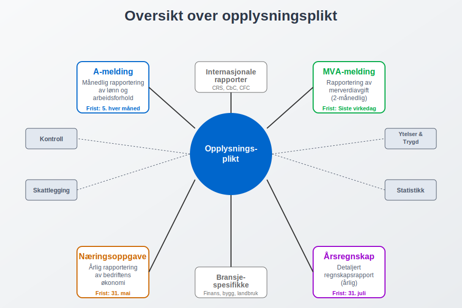
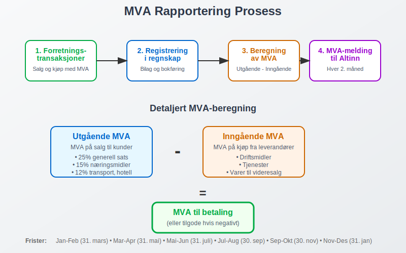
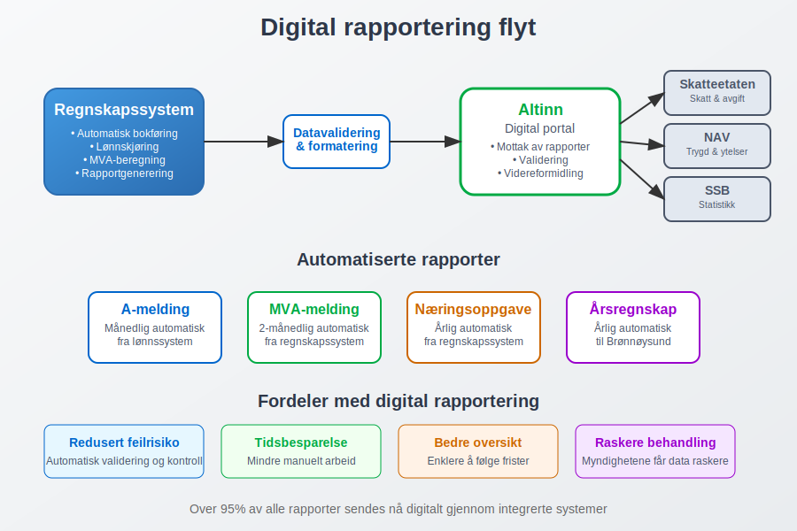
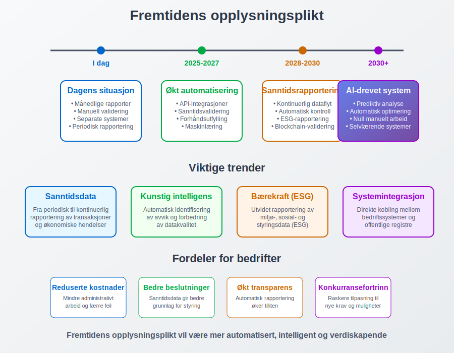

---
title: "Hva er opplysningsplikt?"
seoTitle: "Hva er opplysningsplikt?"
meta_description: '**Opplysningsplikt** er det lovpålagte ansvaret bedrifter og organisasjoner har for å rapportere økonomisk og administrativ informasjon til offentlige myndig...'
slug: hva-er-opplysningsplikt
type: blog
layout: pages/single
---

**Opplysningsplikt** er det lovpålagte ansvaret bedrifter og organisasjoner har for å rapportere økonomisk og administrativ informasjon til offentlige myndigheter. Dette omfatter en rekke rapporteringsordninger som sikrer at staten har nødvendig informasjon for skattlegging, statistikk, kontroll og utbetaling av offentlige ytelser. Den mest kjente formen for opplysningsplikt er **[a-meldingen](/blogs/regnskap/hva-er-a-melding "Hva er a-melding? En komplett guide")**, men det finnes mange andre rapporteringskrav som bedrifter må forholde seg til.

Opplysningsplikten er hjemlet i flere lover og forskrifter, og er en grunnleggende del av det norske skatte- og avgiftssystemet. Den sikrer at myndighetene har tilgang til korrekt og oppdatert informasjon som er nødvendig for å administrere offentlige ordninger effektivt.

## Hovedformål med opplysningsplikt

Opplysningsplikten tjener flere viktige formål i det norske samfunnet:

* **Skattlegging:** Sikrer at alle betaler riktig skatt basert på faktiske inntekter og økonomiske forhold
* **Statistikk:** Gir grunnlag for offisiell statistikk om økonomi, sysselsetting og samfunnsutvikling
* **Kontroll:** Muliggjør kontroll av at bedrifter følger gjeldende lover og regler
* **Ytelsesutbetaling:** Sikrer korrekt beregning og utbetaling av offentlige ytelser som sykepenger og dagpenger
* **Samfunnsplanlegging:** Gir myndighetene data for å planlegge og utvikle offentlige tjenester

## Hovedtyper av opplysningsplikt

### A-ordningen og a-melding

**[A-ordningen](/blogs/regnskap/hva-er-a-ordningen "Hva er A-ordningen?")** er den mest omfattende rapporteringsordningen for arbeidsgivere. Gjennom **[a-meldingen](/blogs/regnskap/hva-er-a-melding "Hva er a-melding? En komplett guide")** rapporterer arbeidsgivere månedlig om:

* Arbeidsforhold og ansettelsesdetaljer
* **[Lønn](/blogs/regnskap/hva-er-lonn "Hva er Lønn? Komplett Guide til Lønnsutbetaling og Regnskapsføring")** og andre inntekter
* **[Forskuddstrekk](/blogs/regnskap/hva-er-forskuddstrekk "Hva er Forskuddstrekk? Komplett Guide til Skattetrekk i Lønn")** og **[arbeidsgiveravgift](/blogs/regnskap/hva-er-arbeidsgiveravgift "Hva er Arbeidsgiveravgift? En Komplett Guide til Norges Lønnsavgift")**
* Feriepenger og andre ytelser

### Skattemeldingen og næringsoppgaven

For bedrifter er **[næringsoppgaven](/blogs/regnskap/hva-er-naeringsoppgave "Hva er Næringsoppgave? Komplett Guide til Selvangivelse for Næringsdrivende")** en sentral del av opplysningsplikten. Den inneholder detaljert informasjon om:

* Driftsinntekter og -kostnader
* **[Balanse](/blogs/regnskap/hva-er-balanse "Hva er Balanse? En Enkel Forklaring av Balanseregnskap")** og **[egenkapital](/blogs/regnskap/hva-er-egenkapital "Hva er Egenkapital? En Komplett Guide til Bedriftens Egenkapital")**
* **[Avskrivninger](/blogs/regnskap/hva-er-avskrivning "Hva er Avskrivning? Komplett Guide til Avskrivning av Driftsmidler")** og investeringer
* Særskilte fradrag og tillegg

### MVA-meldingen

**[MVA-meldingen](/blogs/regnskap/hva-er-mva-melding "Hva er MVA-melding? Komplett Guide til Merverdiavgift Rapportering")** er en annen viktig del av opplysningsplikten for **[MVA-registrerte](/blogs/regnskap/hva-er-mva-registeret "Hva er MVA-registeret? Guide til Merverdiavgift Registrering")** virksomheter:

* Utgående MVA på salg
* Inngående MVA på kjøp
* Spesielle MVA-regler og unntak
* **[Omvendt avgiftsplikt](/blogs/regnskap/omvendt-avgiftsplikt "Omvendt Avgiftsplikt - Komplett Guide til Reverse Charge MVA")**

## Rapporteringsfrister og sanksjoner

Opplysningsplikten er knyttet til strenge frister som varierer avhengig av rapporteringstype:

| Rapporteringstype | Frist | Frekvens |
|-------------------|-------|----------|
| **[A-melding](/blogs/regnskap/hva-er-a-melding "Hva er a-melding? En komplett guide")** | 5. i måneden etter | Månedlig |
| **[MVA-melding](/blogs/regnskap/hva-er-mva-melding "Hva er MVA-melding? Komplett Guide til Merverdiavgift Rapportering")** | [Siste virkedag](/blogs/regnskap/virkedager "Virkedager") i måneden etter | Hver 2. måned |
| **[Næringsoppgave](/blogs/regnskap/hva-er-naeringsoppgave "Hva er Næringsoppgave? Komplett Guide til Selvangivelse for Næringsdrivende")** | 31. mai | Årlig |
| Årsregnskap | 31. juli | Årlig |

### Konsekvenser ved brudd på opplysningsplikten

Brudd på opplysningsplikten kan få alvorlige konsekvenser:

* **Tvangsmulkt:** Daglige mulkter for forsinket levering
* **Tilleggsskatt:** Ved feilaktige eller manglende opplysninger
* **Anmeldelse:** I alvorlige tilfeller kan det føre til straffeforfølgelse
* **Tap av fradragsrett:** For eksempel ved manglende **[bilag](/blogs/regnskap/hva-er-bilag "Hva er Bilag? Komplett Guide til Regnskapsbilag og Dokumentasjon")**

## Digitalisering og automatisering

Den norske opplysningsplikten har gjennomgått en omfattende digitalisering de siste årene. **[Altinn](/blogs/regnskap/hva-er-altinn "Hva er Altinn? Norges Digitale Portal for Næringsliv og Privatpersoner")** er den sentrale plattformen for digital rapportering, og de fleste moderne **[regnskapssystemer](/blogs/regnskap/hva-er-regnskap "Hva er Regnskap? En Enkel Forklaring")** har integrert funksjonalitet for automatisk rapportering.

### Fordeler med digital rapportering

* **Redusert feilrisiko:** Automatisk validering og kontroll
* **Tidsbesparelse:** Mindre manuelt arbeid
* **Bedre oversikt:** Enklere å holde oversikt over frister og krav
* **Raskere behandling:** Myndighetene kan behandle rapportene mer effektivt

## Spesielle opplysningspliktregler

### Internasjonale forhold

Bedrifter med internasjonale aktiviteter har utvidede opplysningspliktregler:

* **CRS-rapportering:** For finansinstitusjoner
* **Country-by-Country rapportering:** For store multinasjonale konsern
* **Kontrollert utenlandsk selskap (CFC):** Særskilte regler for utenlandske datterselskap

### Særskilte bransjer

Enkelte bransjer har spesielle opplysningspliktregler:

* **Finanssektoren:** Utvidede rapporteringskrav til Finanstilsynet
* **Byggebransjen:** Særskilte krav til **[HMS-rapportering](/blogs/regnskap/hva-er-internkontroll "Hva er Internkontroll? Guide til Internkontrollsystemer i Bedrifter")**
* **Landbruk:** Spesielle regler for **[jordbruksfradrag](/blogs/regnskap/hva-er-jordbruksfradrag "Hva er Jordbruksfradrag? Komplett Guide til Skattefradrag i Landbruket")**

## Praktiske råd for å oppfylle opplysningsplikten

### Etabler gode rutiner

* **Månedlige kontroller:** Gjennomgå alle rapporteringskrav hver måned
* **Dokumentasjon:** Sørg for god **[dokumentasjon](/blogs/regnskap/hva-er-dokumentasjon-regnskap-bokforing "Hva er Dokumentasjon (regnskap, bokføring)? Komplett Guide til Regnskapsdokumentasjon")** av alle transaksjoner
* **Backup-systemer:** Ha reserveløsninger hvis hovedsystemet svikter
* **Kompetanse:** Sørg for at ansvarlige har nødvendig kunnskap

### Bruk av profesjonelle tjenester

Mange bedrifter velger å bruke **[regnskapsførere](/blogs/regnskap/hva-er-en-regnskapsforer "Hva er en Regnskapsfører? Komplett Guide til Regnskapsføring")** eller revisorer for å sikre korrekt oppfyllelse av opplysningsplikten. Dette kan være særlig viktig for:

* Komplekse virksomheter med mange ansatte
* Bedrifter med internasjonale aktiviteter
* Virksomheter i regulerte bransjer

## Fremtidige utviklinger

Opplysningsplikten er i kontinuerlig utvikling, med flere viktige trender:

* **Økt automatisering:** Mer direkte integrasjon mellom bedriftssystemer og offentlige registre
* **Sanntidsrapportering:** Bevegelse mot kontinuerlig rapportering i stedet for periodiske rapporter
* **Utvidet datainnsamling:** Nye krav til rapportering av bærekraftsinformasjon og **[ESG-data](/blogs/regnskap/hva-er-esg "Hva er ESG? Komplett Guide til Environmental, Social og Governance")**
* **Kunstig intelligens:** Bruk av AI for å identifisere avvik og forbedre datakvalitet

## Konklusjon

Opplysningsplikten er en fundamental del av det norske skatte- og avgiftssystemet som sikrer at myndighetene har nødvendig informasjon for å administrere offentlige ordninger effektivt. For bedrifter er det avgjørende å ha gode systemer og rutiner for å oppfylle disse kravene korrekt og i tide.

Ved å forstå de ulike typene opplysningsplikt og etablere robuste rapporteringsprosesser, kan bedrifter unngå sanksjoner og bidra til et velfungerende samfunnssystem. Den pågående digitaliseringen gjør det enklere enn noen gang å oppfylle disse kravene, men krever samtidig at bedrifter holder seg oppdatert på nye krav og muligheter.

Les også: [Hva er Bokføringsplikt i Norge?](/blogs/regnskap/hva-er-bokforingsplikt "Hva er Bokføringsplikt i Norge?")

## Relaterte ord

* A-melding
* A-ordningen
* Altinn
* Arbeidsgiveravgift
* [Bokføringsplikt](/blogs/regnskap/hva-er-bokforingsplikt "Hva er Bokføringsplikt i Norge?")
* Forskuddstrekk
* MVA-melding
* Næringsoppgave
* Rapporteringsplikt
* Skattemelding

