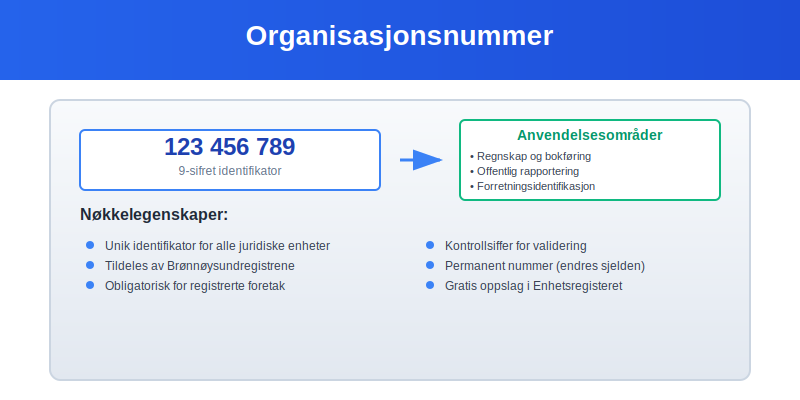
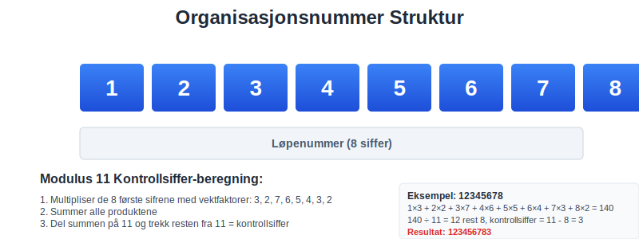
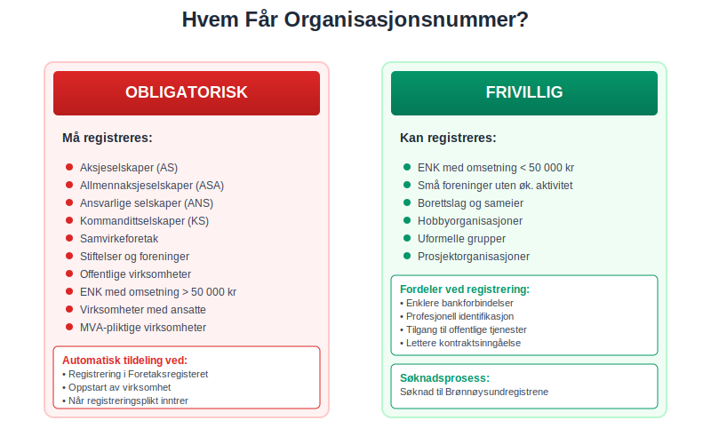
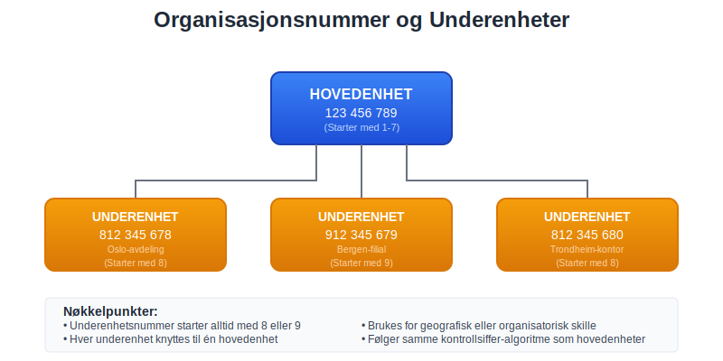
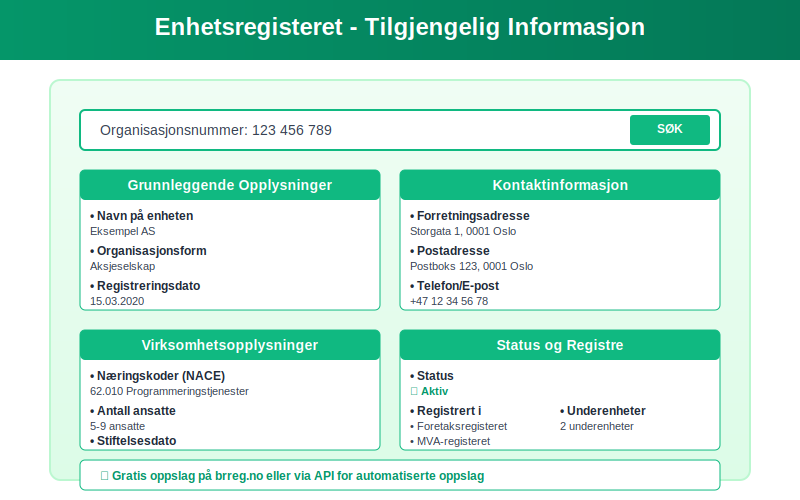
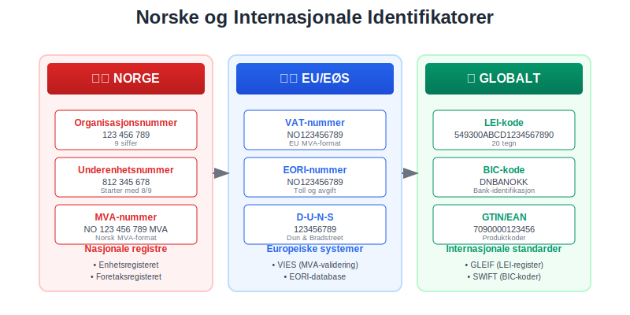
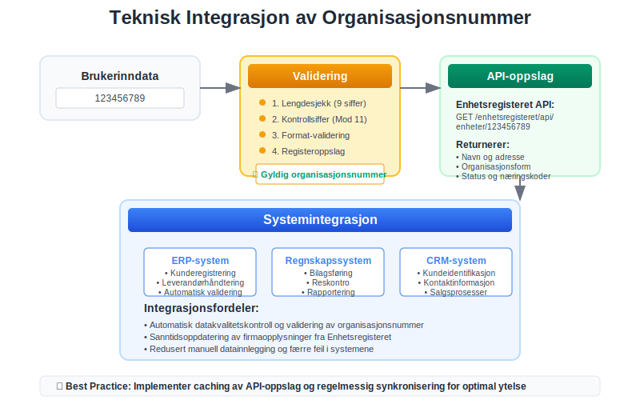

---
title: "hva-er-organisasjonsnummer"
meta_title: "hva-er-organisasjonsnummer"
meta_description: 'Et **organisasjonsnummer** er en unik ni-sifret identifikator som tildeles alle juridiske enheter i Norge. Dette nummeret er fundamentalt for norsk regnskap og ...'
slug: hva-er-organisasjonsnummer
type: blog
layout: pages/single
---

Et **organisasjonsnummer** er en unik ni-sifret identifikator som tildeles alle juridiske enheter i Norge. Dette nummeret er fundamentalt for norsk regnskap og forretningsvirksomhet, da det sikrer entydig identifikasjon av [foretak](/blogs/regnskap/hva-er-foretak "Hva er et Foretak? Komplett Guide til Foretaksformer i Norge") og organisasjoner i alle offentlige registre.

I tillegg til organisasjonsnummer kan logistikk- og lagringssteder identifiseres med [GLN-nummer](/blogs/regnskap/hva-er-gln-nummer "Hva er GLN-nummer? Komplett Guide til Global Location Number i Norge"), som er en global standard for lokasjonsidentifikasjon.

## Hva er et Organisasjonsnummer?

Et organisasjonsnummer er en **ni-sifret kode** som fungerer som en digital identitet for juridiske enheter i Norge. Nummeret tildeles av [**Brønnøysundregistrene**](/blogs/regnskap/bronnoysundregistrene "Hva er Brønnøysundregistrene? En Guide til Norges Registerforvalter") og er obligatorisk for alle enheter som registreres i Enhetsregisteret.

### Struktur og Oppbygning

Organisasjonsnummeret består av **ni siffer** organisert som følger:

* **De første åtte sifrene**: Løpenummer tildelt av registermyndigheten
* **Det niende sifferet**: Kontrollsiffer beregnet etter Modulus 11-algoritmen

### Kontrollsiffer-beregning

Kontrollsifferet beregnes ved hjelp av **Modulus 11-algoritmen**:

1. De åtte første sifrene multipliseres med vektfaktorene 3, 2, 7, 6, 5, 4, 3, 2
2. Produktene summeres
3. Summen deles på 11, og resten trekkes fra 11
4. Resultatet er kontrollsifferet (hvis resultatet er 11, blir kontrollsifferet 0)

## Hvem FÃ¥r Organisasjonsnummer?

Alle **juridiske personer** og **enheter** som registreres i Norge får tildelt organisasjonsnummer:

### Obligatorisk Registrering

* [Aksjeselskaper (AS)](/blogs/regnskap/hva-er-et-aksjeselskap "Hva er et Aksjeselskap (AS)? Komplett Guide til Selskapsformen")
* Allmennaksjeselskaper (ASA)
* [Ansvarlige selskaper (ANS)](/blogs/regnskap/ansvarlig-selskap "Ansvarlig Selskap (ANS): Komplett Guide til Norsk Regnskap og Ansvarsstruktur")
* Kommandittselskaper (KS)
* Samvirkeforetak
* Stiftelser og foreninger
* Offentlige virksomheter

### Frivillig Registrering

* [Enkeltpersonforetak](/blogs/regnskap/hva-er-enkeltpersonforetak "Hva er et Enkeltpersonforetak? Komplett Guide til Selskapsformen") med omsetning under 50 000 kr
* Små foreninger uten økonomisk aktivitet
* Borettslag og sameier

## Organisasjonsnummer i Regnskap og Bokføring

Organisasjonsnummeret er **sentralt** i norsk regnskap og har flere viktige funksjoner:

### Identifikasjon i Regnskapsrapporter

* **Ã…rsregnskap**: MÃ¥ inneholde organisasjonsnummer
* **MVA-meldinger**: Identifiserer avgiftspliktig enhet
* **A-meldinger**: Kobler lønnsopplysninger til riktig arbeidsgiver
* **Skattemeldinger**: Sikrer korrekt skattebehandling

### Elektronisk Rapportering

Organisasjonsnummeret brukes i alle **digitale tjenester**:

* [Altinn](/blogs/regnskap/hva-er-altinn "Hva er Altinn? Komplett Guide til Norges Digitale Offentlige Tjenester") - for offentlig rapportering
* Regnskapsføring og [ERP-systemer](/blogs/regnskap/hva-er-erp-system "Hva er ERP-system? Komplett Guide til Enterprise Resource Planning")
* Bankforbindelser og betalingsløsninger
* [Elektronisk fakturering](/blogs/regnskap/hva-er-elektronisk-fakturering "Hva er Elektronisk Fakturering? Komplett Guide til E-faktura")

## Organisasjonsnummer vs. Andre Identifikatorer

| Identifikator | Formål | Hvem får det | Antall siffer |
|---------------|--------|--------------|---------------|
| **Organisasjonsnummer** | Juridiske enheter | Alle registrerte enheter | 9 |
| **Fødselsnummer** | Fysiske personer | Alle personer | 11 |
| **D-nummer** | Utenlandske personer | Ikke-bosatte | 11 |
| **Underenhetsnummer** | Avdelinger/filialer | Underenheter av hovedenhet | 9 |

### Underenhetsnummer

**Underenheter** som avdelinger, filialer eller andre organisatoriske enheter får eget ni-sifret nummer:

* Starter alltid med sifrene **8** eller **9**
* Følger samme kontrollsiffer-algoritme
* Knyttes til hovedenhetens organisasjonsnummer
* Brukes for geografisk eller organisatorisk skille

## Praktisk Bruk av Organisasjonsnummer

### I Forretningssammenheng

Organisasjonsnummeret brukes daglig i:

* **Kontraktsinngåelse**: Identifiserer kontraktspartene
* **Fakturering**: Påkrevd på alle [fakturaer](/blogs/regnskap/hva-er-en-faktura "Hva er en Faktura? En Guide til Norske Fakturakrav")
* **Bankforbindelser**: Ã…pning av bedriftskontoer
* **Forsikring**: Identifikasjon av forsikringstaker
* **Offentlige anbud**: Kvalifikasjon og identifikasjon

### I Regnskapssammenheng

* **Bilagsføring**: Identifiserer [leverandører](/blogs/regnskap/hva-er-leverandor "Hva er en Leverandør? Komplett Guide til Leverandørhåndtering") og [kunder](/blogs/regnskap/hva-er-kunde "Hva er en Kunde? Komplett Guide til Kundehåndtering")
* **Reskontroføring**: Kobler transaksjoner til riktig part
* **Rapportering**: Sikrer korrekt rapportering til myndigheter
* **Revisjon**: Verifisering av motparters identitet

## Oppslag og Verifikasjon

### Enhetsregisteret

Se vår fulle guide til [Enhetsregisteret](/blogs/regnskap/hva-er-enhetsregisteret "Hva er Enhetsregisteret?") for detaljert informasjon om registerets formål, innhold og bruk.

Alle organisasjonsnummer kan slås opp i **Enhetsregisteret**:

* **Gratis oppslag** på Brønnøysundregistrenes nettsider
* **API-tjenester** for automatiserte oppslag
* **Historiske data** om endringer og status
* **Kontaktinformasjon** og organisasjonsstruktur

### Viktige Opplysninger i Registeret

* **Navn** på enheten
* **Organisasjonsform** og juridisk status
* **Adresse** og kontaktinformasjon
* **[Næringskoder](/blogs/regnskap/naringsspesifikasjon "Hva er Næringsspesifikasjon? Komplett Guide til Næringsklassifisering og Rapportering")** (NACE-koder)
* **Registreringsdato** og eventuelle endringer
* **Status** (aktiv, under avvikling, slettet)

## Endringer og Oppdateringer

### NÃ¥r Endres Organisasjonsnummer?

Organisasjonsnummeret er **permanent** og endres normalt ikke. Unntak:

* **Fusjon**: Det overlevende selskapet beholder sitt nummer
* **Fisjon**: Nye enheter får nye organisasjonsnummer
* **Omorganisering**: Kan medføre nye nummer ved store endringer
* **Gjenopprettelse**: Slettede enheter kan få nytt nummer ved gjenopprettelse

### Oppdatering av Opplysninger

Enheter må **melde endringer** til Enhetsregisteret:

* **Navneendring**: Innen en måned
* **Adresseendring**: Umiddelbart
* **Organisasjonsform**: Ved selskapsrettslige endringer
* **Næringskoder**: Ved endring av virksomhetsområde

## Internasjonale Forhold

### Utenlandske Enheter

**Utenlandske selskaper** som driver virksomhet i Norge:

* **NUF (Norskregistrert Utenlandsk Foretak)**: FÃ¥r norsk organisasjonsnummer
* **Filial**: Registreres med eget organisasjonsnummer
* **Direkte virksomhet**: Kan få organisasjonsnummer ved registreringsplikt

### Internasjonale Standarder

Norge følger **internasjonale standarder** for enhetsidentifikasjon:

* [**LEI (Legal Entity Identifier)**](/blogs/regnskap/lei-nummer "LEI-nummer - Komplett Guide til Legal Entity Identifier for Norske Selskaper"): For finansielle rapporteringsformål
* **EORI-nummer**: For toll- og avgiftsformål i EU/EØS
* **VAT-nummer**: For merverdiavgiftsformål i EU/EØS

## Juridiske Konsekvenser

### Feil Bruk av Organisasjonsnummer

**Misbruk** av organisasjonsnummer kan få alvorlige konsekvenser:

* **Identitetstyveri**: Straffbart etter straffeloven
* **Svindel**: Bruk av andres nummer i forretningssammenheng
* **Regnskapsbrudd**: Feil identifikasjon i regnskapsrapporter
* **Skatteunndragelse**: Feilaktig rapportering til skattemyndighetene

### Ansvar for Korrekt Bruk

**Enheter** har ansvar for:

* **Korrekt oppgivelse** av eget organisasjonsnummer
* **Verifisering** av motparters organisasjonsnummer
* **Oppdatering** av endringer i registeret
* **Sikker håndtering** av organisasjonsnummer i IT-systemer

## Tekniske Aspekter

### Validering av Organisasjonsnummer

**Automatisk validering** kan gjøres ved:

1. **Lengdesjekk**: Må være nøyaktig 9 siffer
2. **Kontrollsiffer-validering**: Modulus 11-algoritme
3. **Registeroppslag**: Verifisering mot Enhetsregisteret
4. **Statussjekk**: Kontroll av aktiv/inaktiv status

### Integrasjon i IT-systemer

**Regnskapssystemer** bør:

* **Automatisk validere** organisasjonsnummer ved innlegging
* **Hente opplysninger** fra Enhetsregisteret via API
* **Oppdatere automatisk** ved endringer i registeret
* **Sikre datakvalitet** gjennom regelmessige kontroller

## Fremtidige Utviklinger

### Digitalisering og Automatisering

**Fremtidige forbedringer** inkluderer:

* **Sanntidsoppdateringer**: Automatisk synkronisering mellom registre
* **Kunstig intelligens**: Automatisk deteksjon av feil og avvik
* **Blockchain-teknologi**: Sikker og transparent registrering
* **API-forbedringer**: Bedre integrasjonsmuligheter

### Europeisk Harmonisering

**EU-initiativ** for bedre samordning:

* **Felles identifikatorer**: Standardisering på tvers av land
* **Automatisk utveksling**: Informasjonsdeling mellom myndigheter
* **Digitale tjenester**: Grenseløse digitale tjenester

## Sammendrag

Organisasjonsnummeret er **fundamentalt** for norsk næringsliv og regnskap. Det sikrer:

* **Entydig identifikasjon** av alle juridiske enheter
* **Effektiv administrasjon** av offentlige registre
* **Sikker forretningsførsel** mellom parter
* **Korrekt regnskapsrapportering** til myndigheter

For **regnskapsførere** og **bedriftseiere** er det essensielt å:

* **Forstå** organisasjonsnummerets rolle og betydning
* **Bruke** nummeret korrekt i alle sammenhenger
* **Validere** motparters organisasjonsnummer
* **Holde** egne opplysninger oppdatert i registeret

Ved å følge disse prinsippene sikrer man **korrekt** og **lovlig** bruk av organisasjonsnummeret i all forretningsvirksomhet og regnskapsføring.

