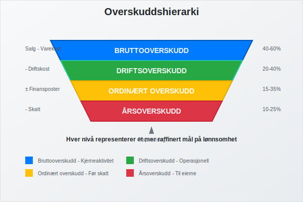
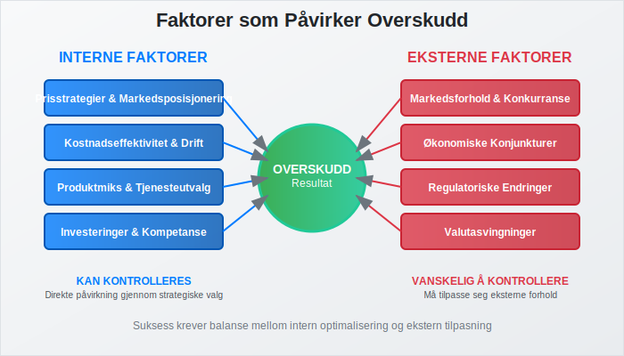

**Overskudd** er et sentralt begrep i regnskap og økonomi som beskriver det positive resultatet når [inntekter](/blogs/regnskap/hva-er-inntekter "Hva er Inntekter? Komplett Guide til Inntektsføring og Regnskapsregler") overstiger [kostnader](/blogs/regnskap/hva-er-kostnader "Hva er Kostnader? Komplett Guide til Kostnadsføring og Regnskapsregler") i en gitt periode. For norske bedrifter er forståelse av overskudd avgjørende for både **regnskapsføring**, **[skatteplanlegging](/blogs/regnskap/hva-er-skatt "Hva er Skatt? Komplett Guide til Bedriftsskatt, MVA og Skatteplanlegging")** og **strategiske beslutninger**.

Overskudd omtales også ofte som **bunnlinje**, ettersom det fremgår som det nederste resultatet i resultatregnskapet. Les mer om [Bunnlinje](/blogs/regnskap/bunnlinje "Bunnlinje i Norsk Regnskap: Definisjon, Beregning og Eksempler").


## Definisjon av Overskudd

Overskudd oppstår når en virksomhets **totale inntekter** er større enn de **totale kostnadene** i en bestemt regnskapsperiode. Dette representerer den **økonomiske verdiskapingen** som virksomheten har oppnådd gjennom sin drift.

### Grunnleggende Formel

```
Overskudd = Totale Inntekter - Totale Kostnader
```

Overskuddet kan også beregnes på flere nivåer i [resultatregnskapet](/blogs/regnskap/hva-er-driftsregnskap "Hva er Driftsregnskap? Komplett Guide til Resultatregnskap"):

* **Bruttooverskudd** = Salgsinntekter - Varekostnader
* **Driftsoverskudd** = Bruttooverskudd - Driftskostnader
* **Ordinært overskudd** = Driftsoverskudd + Finansinntekter - Finanskostnader
* **Årsoverskudd** = Ordinært overskudd - [Skattekostnad](/blogs/regnskap/hva-er-skatt "Hva er Skatt? Komplett Guide til Bedriftsskatt, MVA og Skatteplanlegging")


## Typer Overskudd

### Bruttooverskudd (Bruttofortjeneste)

[Bruttofortjenesten](/blogs/regnskap/hva-er-bruttofortjeneste "Hva er Bruttofortjeneste? Guide til Beregning og Analyse") viser hvor mye virksomheten tjener på sine **kjerneaktiviteter** før andre kostnader:

* Beregnes som salgsinntekter minus direkte kostnader
* Viser **lønnsomheten** i selve produksjonen eller salget
* Viktig for å vurdere **prisstrategier** og **kostnadseffektivitet**

### Driftsoverskudd (EBIT)

**Driftsoverskuddet** viser resultatet fra den **ordinære driften**:

* Inkluderer alle driftsinntekter og driftskostnader
* Ekskluderer finansielle poster og skatt
* Brukes for å sammenligne **operasjonell lønnsomhet** mellom selskaper
* Også kalt EBIT (Earnings Before Interest and Taxes)

### Ordinært Overskudd (EBT)

Det **ordinære overskuddet** inkluderer finansielle poster:

* Driftsoverskudd pluss finansinntekter
* Minus finanskostnader som [renter](/blogs/regnskap/hva-er-morarente "Hva er Morarente? Regler og Beregning av Forsinkelsesrenter")
* Viser totalresultatet før skatt
* Også kalt EBT (Earnings Before Tax)

### Årsoverskudd (Nettoresultat)

**Årsoverskuddet** er det endelige resultatet etter alle kostnader:

* Ordinært overskudd minus skattekostnad
* Det som kan **utdeles til eierne** eller **tilbakeholdes** i virksomheten
* Grunnlag for beregning av [utbytte](/blogs/regnskap/maskimalt-utbytte "Maksimalt Utbytte: Regler og Beregning for AS") i [aksjeselskap](/blogs/regnskap/hva-er-et-aksjeselskap "Hva er et Aksjeselskap (AS)? Komplett Guide til Selskapsformen")



## Sammenligning av Overskuddstyper

| Overskuddstype | Beregning | Formål | Bruksområde |
|----------------|-----------|--------|-------------|
| **Bruttooverskudd** | Salgsinntekter - Varekostnader | Måle kjerneaktivitetens lønnsomhet | Prisstrategier, kostnadsanalyse |
| **Driftsoverskudd** | Bruttooverskudd - Driftskostnader | Vurdere operasjonell effektivitet | Sammenligning mellom selskaper |
| **Ordinært overskudd** | Driftsoverskudd ± Finansposter | Totalt resultat før skatt | Skatteplanlegging, finansanalyse |
| **Årsoverskudd** | Ordinært overskudd - Skatt | Endelig resultat til eierne | Utbyttepolitikk, reinvestering |

## Regnskapsføring av Overskudd

### Bokføringsregler

Overskudd bokføres i henhold til [god regnskapsskikk](/blogs/regnskap/god-regnskapsskikk "God Regnskapsskikk: Prinsipper og Regler for Norsk Regnskap") og [bokføringsloven](/blogs/regnskap/hva-er-bokforingsloven "Hva er Bokføringsloven? Komplett Guide til Norske Bokføringsregler"):

* **Periodisering** - overskudd føres i den perioden det er opptjent
* **Forsiktighetsprinsippet** - ikke regn med usikre inntekter
* **Sammenstilling** - inntekter og kostnader skal sammenstilles

### Disponering av Overskudd

For [aksjeselskap](/blogs/regnskap/hva-er-et-aksjeselskap "Hva er et Aksjeselskap (AS)? Komplett Guide til Selskapsformen") må overskuddet disponeres:

* **Utbytte** til aksjonærene
* **Overføring til egenkapital** for fremtidig bruk ([selvfinansiering](/blogs/regnskap/hva-er-selvfinansiering "Hva er Selvfinansiering? Komplett Guide til Intern Finansiering og Kapitaloppbygging"))
* **Avsetninger** til spesielle formål
* **Reservefond** som sikkerhet


## Skattemessige Konsekvenser

### Skatt på Overskudd

Overskudd beskattes forskjellig avhengig av [foretaksform](/blogs/regnskap/hva-er-foretak "Hva er et Foretak? Komplett Guide til Foretaksformer i Norge"):

#### Enkeltpersonforetak
* Overskudd beskattes som **personinntekt**
* Inngår i [næringsspesifikasjonen](/blogs/regnskap/naringsspesifikasjon "Næringsspesifikasjon: Guide til Utfylling og Regler")
* Kan få [minstefradrag](/blogs/regnskap/hva-er-minstefradrag "Hva er Minstefradrag? Regler og Beregning av Skattefradrag")

#### Aksjeselskap
* **Selskapsskatt** på 22% av overskuddet
* Utbytte til aksjonærer beskattes separat
* Mulighet for **skatteoptimalisering** gjennom timing

### Skatteplanlegging

**Strategisk skatteplanlegging** kan optimalisere skattebyrden:

* **Timing av inntekter** og kostnader
* **Investeringer** som gir skattemessige [fradrag](/blogs/regnskap/hva-er-fradrag "Hva er Fradrag? Komplett Guide til Skattefradrag for Bedrifter")
* **Avskrivninger** av [anleggsmidler](/blogs/regnskap/hva-er-anleggsmidler "Hva er Anleggsmidler? Komplett Guide til Varige Driftsmidler")

## Analyse av Overskudd

### Lønnsomhetsanalyse

Overskuddet analyseres gjennom flere **nøkkeltall**:

#### Overskuddsmargin
```
Overskuddsmargin = (Overskudd / Omsetning) × 100%
```

#### Egenkapitalrentabilitet
```
Egenkapitalrentabilitet = (Årsoverskudd / Gjennomsnittlig egenkapital) × 100%
```

#### Totalkapitalrentabilitet
```
Totalkapitalrentabilitet = (Driftsoverskudd / Gjennomsnittlig totalkapital) × 100%
```


### Benchmarking

Sammenligning med **bransjegjennomsnitt** og **konkurrenter**:

* Identifiser styrker og svakheter
* Sett realistiske **resultatmål**
* Vurder **konkurranseposisjon**

## Faktorer som Påvirker Overskudd

### Interne Faktorer

* **Prisstrategier** og markedsposisjonering
* **Kostnadseffektivitet** og operasjonell drift
* **Produktmiks** og tjenesteutvalg
* **Investeringer** i teknologi og kompetanse

### Eksterne Faktorer

* **Markedsforhold** og konkurranse
* **Økonomiske konjunkturer**
* **Regulatoriske endringer**
* **Valutasvingninger** for internasjonale virksomheter



## Overskudd vs. Kontantstrøm

Det er viktig å skille mellom **overskudd** og [kontantstrøm](/blogs/regnskap/hva-er-kontantstrom "Hva er Kontantstrøm? Komplett Guide til Kontantstrømanalyse"):

### Forskjeller

| Aspekt | Overskudd | Kontantstrøm |
|--------|-----------|--------------|
| **Grunnlag** | Periodisering | Kontantprinsipp |
| **Timing** | Når opptjent/påløpt | Når betalt/mottatt |
| **Inkluderer** | Alle inntekter/kostnader | Kun kontanttransaksjoner |
| **Bruk** | Lønnsomhetsmåling | Likviditetsvurdering |

### Hvorfor Forskjellen Oppstår

* **Kundefordringer** - salg som ikke er betalt
* **Leverandørgjeld** - kostnader som ikke er betalt
* **Avskrivninger** - kostnader uten kontantutgang
* **Investeringer** - kontantutgang uten kostnadsføring

## Strategier for Overskuddsoptimalisering

### Inntektsoptimalisering

* **Prissetting** basert på verdi og marked
* **Produktutvikling** og innovasjon
* **Markedsekspansjon** og nye kundesegmenter
* **Krysssalg** og mersalg til eksisterende kunder

### Kostnadsoptimalisering

* **Prosessforbedring** og automatisering
* **Leverandørforhandlinger** og innkjøpsoptimalisering
* **Energieffektivisering** og bærekraftige løsninger
* **Organisasjonsutvikling** og kompetanseheving


## Overskudd i Ulike Bransjer

### Handelsbedrifter

* Fokus på **bruttomargin** og **lageromløp**
* Viktighet av **innkjøpspriser** og **salgsvolum**
* Sesongvariasjoner og **lagerstyring**

### Tjenestebedrifter

* Høy andel **personalkostnader**
* Fokus på **timepriser** og **kapasitetsutnyttelse**
* Mindre [kapitalbinding](/blogs/regnskap/hva-er-arbeidskapital "Hva er Arbeidskapital? Guide til Beregning og Styring") i varelager

### Produksjonsbedrifter

* Kompleks **kostnadskalkyle**
* Viktighet av **produksjonseffektivitet**
* Store investeringer i **produksjonsutstyr**

## Rapportering og Oppfølging

### Månedlig Oppfølging

* **Månedlige resultatrapporter**
* Sammenligning med **budsjett** og **foregående år**
* Identifisering av **avvik** og **trender**

### Kvartalsrapportering

For større selskaper kreves [kvartalsrapporter](/blogs/regnskap/hva-er-kvartalsrapport "Hva er Kvartalsrapport? Krav og Innhold for Børsnoterte Selskaper"):

* Detaljert analyse av **utviklingen**
* **Prognoser** for resten av året
* **Strategiske tiltak** basert på resultater

### Årsrapportering

* Fullstendig [årsregnskap](/blogs/regnskap/hva-er-regnskap "Hva er Regnskap? Komplett Guide til Regnskapsføring og Regnskapsregler") med **noter**
* **Styrets beretning** om virksomhetens utvikling
* **Revisjonsberetning** for større selskaper


## Juridiske Aspekter

### Bokføringsplikt

Alle virksomheter med overskudd har [bokføringsplikt](/blogs/regnskap/hva-er-bokforingsplikt "Hva er Bokføringsplikt i Norge? Hvem, Når og Hvordan?") når:

* Årlig [omsetning](/blogs/regnskap/hva-er-omsetning "Hva er Omsetning? Komplett Guide til Omsetningsbegrepet") overstiger 50 000 kr
* Virksomheten har ansatte
* Virksomheten er [merverdiavgiftspliktig](/blogs/regnskap/hva-er-moms-mva "Hva er Moms (MVA)? Komplett Guide til Merverdiavgift")

### Oppbevaringsplikt

[Regnskapsmateriale](/blogs/regnskap/oppbevaring-av-regnskapsmateriale "Oppbevaring av Regnskapsmateriale: Regler og Krav") må oppbevares i **5 år**:

* Alle [bilag](/blogs/regnskap/hva-er-bilag "Hva er Bilag? Komplett Guide til Regnskapsbilag") og dokumentasjon
* **Hovedbok** og **reskontro**
* **Årsregnskap** og **årsberetning**

## Internasjonale Regnskapsstandarder

### IFRS vs. Norske Regler

For større selskaper kan [IFRS](/blogs/regnskap/hva-er-ifrs "Hva er IFRS? Internasjonale Regnskapsstandarder Forklart") være aktuelt:

* **Mer detaljerte** regler for inntektsføring
* **Komplekse** regler for finansielle instrumenter
* **Økt fokus** på virkelig verdi

### Sammenlignbarhet

Internasjonale standarder gir:

* **Bedre sammenlignbarhet** med utenlandske selskaper
* **Enklere tilgang** til internasjonale kapitalmarkeder
* **Økte krav** til rapportering og dokumentasjon

## Digitalisering og Overskuddsoppfølging

### Moderne Regnskapssystemer

[ERP-systemer](/blogs/regnskap/hva-er-erp-system "Hva er ERP-system? Komplett Guide til Enterprise Resource Planning") gir:

* **Sanntidsrapportering** av overskudd
* **Automatisk sammenstilling** av data
* **Prognoser** basert på historiske data

### Kunstig Intelligens

AI kan bidra til:

* **Prediktiv analyse** av overskuddsutvikling
* **Automatisk kategorisering** av transaksjoner
* **Identifisering** av avvik og muligheter


## Konklusjon

Overskudd er et **fundamentalt mål** på virksomhetens suksess og bærekraft. For norske bedrifter er det avgjørende å:

* **Forstå** de ulike typene overskudd og deres betydning
* **Implementere** systemer for løpende oppfølging og analyse
* **Optimalisere** både inntekter og kostnader strategisk
* **Overholde** alle juridiske krav til rapportering og dokumentasjon

Ved å ha god kontroll på overskuddet kan virksomheter ta **informerte beslutninger**, planlegge for **fremtidig vekst** og sikre **langsiktig lønnsomhet**. Dette krever både **faglig kompetanse** og **gode systemer** for regnskapsføring og analyse.

Overskudd er ikke bare et tall i regnskapet - det er et **strategisk verktøy** som kan drive virksomheten fremover og skape verdi for alle interessenter.


