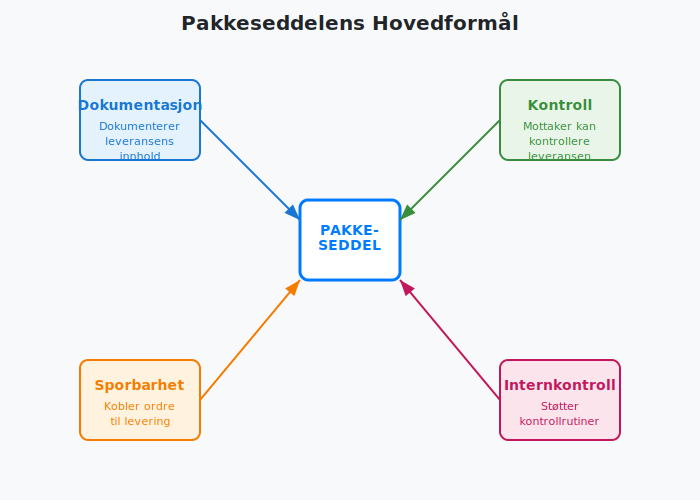

En **pakkeseddel** er et leveringsdokument som følger med vareleveranser og inneholder detaljert informasjon om varene som sendes, mottaker, avsender og leveringsinformasjon. Dette dokumentet spiller en viktig rolle i varehandel, [internkontroll](/blogs/regnskap/hva-er-internkontroll "Hva er Internkontroll? Komplett Guide til Internkontrollsystem") og regnskapsføring for både [aksjeselskap](/blogs/regnskap/hva-er-et-aksjeselskap "Hva er et Aksjeselskap? Komplett Guide til Selskapsformen") og andre virksomheter.

## Hva er en Pakkeseddel?

En **pakkeseddel** er et dokument som dokumenterer innholdet i en vareforsendelse og tjener som bevis for hva som er sendt fra leverandør til kunde. Pakkeseddelen er ikke et [fakturadokument](/blogs/regnskap/hva-er-en-faktura "Hva er en Faktura? En Guide til Norske Fakturakrav"), men et rent leveringsdokument som bekrefter at varene er pakket og klar for levering.

### Hovedformål med Pakkeseddel

* **Dokumentasjon:** Dokumenterer hva som faktisk er sendt
* **Kontroll:** Gjør det mulig for mottaker å kontrollere leveransen
* **Sporbarhet:** Skaper en sporbar kobling mellom ordre og levering
* **Internkontroll:** Støtter opp under bedriftens kontrollrutiner

## Innhold i en Pakkeseddel

### Obligatorisk Informasjon

En **pakkeseddel** bør inneholde følgende grunnleggende informasjon:

| **Informasjonselement** | **Beskrivelse** | **Hvorfor viktig** |
|---|---|---|
| **Leverandørinfo** | Navn, adresse, organisasjonsnummer | Identifiserer avsender |
| **Mottakerinfo** | Navn, leveringsadresse | Sikrer korrekt levering |
| **Ordrenummer** | Referanse til opprinnelig ordre | Kobler levering til bestilling |
| **Dato** | Pakkedato og forventet leveringsdato | Tidsstempling av leveranse |
| **Varelinjer** | Detaljert liste over varer | Kontroll av leveringsinnhold |
| **Antall** | Antall enheter per vare | Kvantitetskontroll |
| **Varenummer/SKU** | Unik produktidentifikator | Presis vareidentifikasjon |

### Tilleggsinformasjon

Avhengig av bransje og leveranse kan pakkeseddelen også inneholde:

* **Serienumre** for sporbarhet
* **Utløpsdatoer** for holdbare varer
* **Spesielle instruksjoner** for håndtering
* **Fraktinformasjon** og sporingsnummer
* **Returinstruksjoner**

## Pakkeseddel vs. Andre Dokumenter

### Pakkeseddel vs. Faktura

Det er viktig å skille mellom **pakkeseddel** og [faktura](/blogs/regnskap/hva-er-en-faktura "Hva er en Faktura? En Guide til Norske Fakturakrav"):

| **Aspekt** | **Pakkeseddel** | **Faktura** |
|---|---|---|
| **Formål** | Dokumenterer levering | Krever betaling |
| **Priser** | Viser ofte ikke priser | Inneholder alltid priser |
| **MVA** | Ikke relevant | MÃ¥ inneholde [MVA-informasjon](/blogs/regnskap/hva-er-moms-mva "Hva er Moms/MVA? Komplett Guide til Merverdiavgift") |
| **Regnskapsføring** | Ikke grunnlag for bokføring | Grunnlag for regnskapsføring |
| **Tidspunkt** | Følger med leveransen | Kan sendes separat |

For sluttavregning av leveranser og tjenester kan du se [Sluttseddel](/blogs/regnskap/sluttseddel "Sluttseddel i regnskap").

### Pakkeseddel vs. Leveringsbekreftelse

* **Pakkeseddel:** Sendes med varene
* **Leveringsbekreftelse:** Bekrefter at levering er mottatt

## Juridiske Krav og Regelverk

### Bokføringsloven og Pakkesedler

Selv om **pakkesedler** ikke er direkte regulert av [bokføringsloven](/blogs/regnskap/hva-er-bokforingsloven "Hva er Bokføringsloven? Komplett Guide til Lovkrav og Regnskapsføring"), er de viktige for:

* **Dokumentasjon** av varetransaksjoner
* **Internkontroll** og sporingssystemer
* **Støtte** for regnskapsføring når de kobles med fakturaer

### Forbrukerrettigheter

For **forhandlere** som selger til forbrukere må pakkeseddelen støtte opp under:

* **Angrerett** - dokumentasjon av leveringsdato
* **Reklamasjonsrett** - bevis for hva som ble levert
* **Garantirettigheter** - sporbarhet av produkter

### Bransjespesifikke Krav

Enkelte bransjer har **spesifikke krav** til pakkesedler:

* **Medisiner:** Batch-numre og utløpsdatoer
* **Elektronikk:** Serienumre for garantier
* **Matvarer:** Sporingsinformasjon for mattrygghet

## Regnskapsføring og Pakkesedler

### Rolle i Regnskapsprosessen

**Pakkesedler** spiller en viktig støtterolle i regnskapsføringen:

* **Internkontroll:** Bekrefter at [varelager](/blogs/regnskap/hva-er-varelager "Hva er Varelager? Komplett Guide til Lagerstyring og Verdivurdering") stemmer
* **Periodisering:** Hjelper med korrekt [periodisering](/blogs/regnskap/hva-er-periodisering "Hva er Periodisering? Komplett Guide til Regnskapsprinsipper") av inntekter
* **Avstemming:** Støtter avstemming mellom ordre, levering og faktura

### Kobling til Regnskapskonti

Når pakkesedler brukes sammen med fakturaer påvirker de:

* **Kundefordringer:** Når varer leveres før fakturering
* **Varelager:** Reduksjon ved utlevering
* **Salg:** Inntektsføring ved levering (enkelte tilfeller)

### Internkontroll og Pakkesedler

En god **internkontrollrutine** for pakkesedler inkluderer:

1. **Matching:** Sammenlign pakkeseddel med opprinnelig ordre
2. **Autorisasjon:** Sikre at leveranser er godkjent
3. **Dokumentasjon:** Arkiver pakkesedler systematisk
4. **Oppfølging:** Kontroller at faktura samsvarer med pakkeseddel

## Digitale Pakkesedler

### Fordeler med Digital Pakkeseddel

**Digitalisering** av pakkesedler gir flere fordeler:

* **Miljøbesparelser:** Redusert papirforbruk
* **Effektivitet:** Raskere behandling og arkivering
* **Sporbarhet:** Bedre sporingsmuligheter
* **Integrasjon:** Automatisk kobling til [ERP-systemer](/blogs/regnskap/hva-er-erp-system "Hva er ERP-system? Komplett Guide til Forretningsmessig Integrasjon")
* **Kostnadsbesparelser:** Lavere porto- og papirutgifter

### Implementering av Digital Løsning

Overgang til **digitale pakkesedler** krever:

* **Systemintegrering** mellom salgs- og logistikksystemer
* **Kundekommunikasjon** om ny ordning
* **Backup-rutiner** for tekniske problemer
* **Opplæring** av personalet

### Tekniske Løsninger

Vanlige **tekniske implementeringer** inkluderer:

* **E-post** med PDF-vedlegg
* **SMS** med lenke til digital pakkeseddel
* **App-integrasjon** for sanntidsoppdateringer
* **QR-koder** for rask tilgang til informasjon

## Beste Praksis for Pakkesedler

### Design og Layout

En **godt utformet pakkeseddel** bør:

* **Være oversiktlig** med klar struktur
* **Bruke tydelige fonter** og tilstrekkelig skriftstørrelse
* **Gruppere relatert informasjon** logisk
* **Inkludere firmaets logo** for profesjonalitet
* **Ha konsistent formatering** på tvers av leveranser

### Kvalitetskontroll

Implementer **rutiner** for å sikre kvalitet:

* **Dobbeltsjekk** varelinjer mot ordre
* **Verifiser** mottakerinformasjon
* **Kontroller** at alle obligatoriske felt er utfylt
* **Test** integrasjoner regelmessig

### Arkivering og Oppbevaring

For **forsvarlig arkivering**:

* **Digitaliser** papirdokumenter hvis mulig
* **Organiser** etter dato eller kunde
* **Sikre backup** av digitale filer
* **Følg** oppbevaringskrav i [bokføringsloven](/blogs/regnskap/hva-er-bokforingsloven "Hva er Bokføringsloven? Komplett Guide til Lovkrav og Regnskapsføring")

## Pakkesedler i Ulike Bransjer

### E-handel og Nettbutikker

For **nettbutikker** er pakkesedler spesielt viktige for:

* **Kundeopplevelse:** Profesjonelt førsteinntrykk
* **Returhåndtering:** Enkel identifikasjon av ordre
* **Reklamasjoner:** Dokumentasjon av leveransens innhold
* **Cross-selling:** Informasjon om andre produkter

### B2B- og B2C-handel ([Hva er B2B?](/blogs/regnskap/hva-er-b2b "Hva er B2B? Business-to-Business i Regnskap") og [Hva er B2C?](/blogs/regnskap/hva-er-b2c "Hva er B2C? Business-to-Consumer i Regnskap"))

I **B2B-sammenheng** fokuserer pakkesedler på:

* **Leveringsnøyaktighet:** Kritisk for produksjon
* **Sporbarhet:** Viktig for [kvalitetssikring](/blogs/regnskap/hva-er-kvalitetssikring "Hva er Kvalitetssikring? Komplett Guide til Kvalitetssystemer")
* **Internkontroll:** Støtter innkjøpsprosesser
* **Automatisering:** Integrasjon med kundens systemer

### Produksjonsbedrifter

**Produsenter** bruker pakkesedler til:

* **Batch-sporing:** Viktig for tilbakekalling
* **Kvalitetsdokumentasjon:** Kobling til [kvalitetskontroll](/blogs/regnskap/hva-er-kvalitetskontroll "Hva er Kvalitetskontroll? Prinsipper og Implementering")
* **Leverandørstyring:** Sporbarhet i forsyningskjeden
* **Regnskapsstøtte:** Grunnlag for [kostnadskalkulus](/blogs/regnskap/hva-er-kostnadskalkulus "Hva er Kostnadskalkulus? Komplett Guide til Kostnadsberegning")

## Vanlige Utfordringer og Løsninger

### Manglende Pakkesedler

**Problem:** Leveranser som ankommer uten pakkeseddel

**Løsninger:**
* Implementer **digital levering** av pakkesedler
* Lag **standardrutiner** for håndtering av manglende dokumenter
* Opprett **intern pakkeseddel** basert på mottatt vare
* Kontakt **leverandør** for å få dokumentasjonen ettersendt

### Feil i Pakkesedler

**Problem:** Avvik mellom pakkeseddel og faktisk levering

**Løsninger:**
* Implementer **kvalitetskontroll** ved pakking
* Bruk **strekkoder** eller RFID for redusert feilrisiko
* Opprett **avviksrapporter** for systematisk oppfølging
* Tren **personalet** i viktigheten av nøyaktighet

### Integrasjonsutfordringer

**Problem:** Manglende integrasjon mellom systemer

**Løsninger:**
* Invester i **ERP-system** med god integrasjon
* Bruk **API-er** for systemkommunikasjon
* Implementer **middleware** for datatransformering
* Vurder **standardiserte formater** som EDI

## Automatisering og Teknologi

### Automatisk Generering

Moderne **ERP-systemer** kan automatisk generere pakkesedler basert på:

* **Salgsordre** og kunde-informasjon
* **Lagerstatus** og tilgjengelighet
* **Leveringsruter** og transportører
* **Kundepreferanser** for leveringsformat

### Integrasjon med Logistikk

**Logistikkintegrasjon** gir fordeler som:

* **Automatisk sporingsinformasjon** på pakkeseddel
* **Optimerte leveringsruter** basert på destinasjon
* **Sanntidsoppdateringer** til kunde
* **Kostnadsoptimalisering** gjennom bedre planlegging

### Kunstig Intelligens og ML

**AI-teknologi** kan forbedre pakkesedler gjennom:

* **Prediktiv pakking** basert på historiske data
* **Automatisk kvalitetskontroll** ved hjelp av bildegjenkjenning
* **Intelligent routing** for optimal leveringseffektivitet
* **Personaliserte leveringsopsjoner** basert på kundedata

## Miljømessige Hensyn

### Bærekraftige Pakkesedler

**Miljøvennlige alternativer** inkluderer:

* **Digitale løsninger** som erstatter papir
* **Resirkulert papir** for fysiske pakkesedler
* **Kombinerte etiketter** som reduserer materialforbruk
* **QR-koder** som erstatter detaljert tekstinformasjon

### Sirkulær Økonomi

Pakkesedler kan støtte **sirkulær økonomi** gjennom:

* **Returinstruksjoner** for gjenbruk av emballasje
* **Informasjon** om resirkulering av produkter
* **Sporbarhet** for bedre livsløpsanalyse
* **Digitalisering** som reduserer papirforbruk

## Fremtiden for Pakkesedler

### Teknologiske Trender

**Fremtidige utviklingstrekk** inkluderer:

* **Blockchain** for sporbarhet og autentisitet
* **IoT-sensorer** for sanntidsmonitorering av leveranser
* **Augmented Reality** for interaktive pakkesedler
* **Voice-aktiverte** systemer for enklere håndtering

### Regulatoriske Endringer

Forventede **regelverksendringer**:

* **Strengere miljøkrav** til dokumentasjon
* **Økte krav** til digital sporbarhet
* **Harmonisering** av europeiske standarder
* **GDPR-tilpasninger** for personvernhensyn

### Bransjeutvikling

**Bransjespesifikke trender**:

* **Farmasøytisk:** Økt fokus på sporbarhet
* **Matvarer:** Strengere krav til mattrygghet
* **E-handel:** Mer personaliserte leveringsopplevelser
* **B2B:** Økt automatisering og systemintegrasjon

## Konklusjon

**Pakkeseddel** er et fundamentalt dokument i varehandel som går langt utover bare å liste opp leveransens innhold. Den spiller en kritisk rolle i:

* **Kvalitetssikring** og kundeservice
* **Internkontroll** og regnskapsføring
* **Juridisk dokumentasjon** og sporbarhet
* **Operasjonell effektivitet** og automatisering

### Viktige Suksessfaktorer

For å få maksimal nytte av pakkesedler bør bedrifter:

* **Standardisere** format og innhold
* **Digitalisere** prosessen hvor mulig
* **Integrere** med andre forretningssystemer
* **Fokusere** på kundeopplevelsen
* **Følge** relevante juridiske krav

### Fremtidens Muligheter

Teknologisk utvikling åpner for **nye muligheter** som digitale løsninger, bedre sporbarhet og økt automatisering. Bedrifter som investerer i moderne pakkeseddelløsninger vil kunne oppnå konkurransefortrinn gjennom bedre kundeservice, lavere kostnader og økt operasjonell effektivitet.

Enten du driver [e-handel](/blogs/regnskap/hva-er-e-handel "Hva er E-handel? Komplett Guide til Netthandel og Regnskap"), [produksjon](/blogs/regnskap/hva-er-produksjon "Hva er Produksjon? Regnskap og Kalkulation for Produksjonsbedrifter") eller [grossistvirksomhet](/blogs/regnskap/hva-er-grossist "Hva er Grossist? Rolle og Regnskapsføring i Handelskjeden"), er en godt gjennomtenkt tilnærming til pakkesedler en investering som vil lønne seg både på kort og lang sikt.

Husk at **kvaliteten på pakkeseddelen** ofte reflekterer profesjonaliteten til hele virksomheten, og kan være avgjørende for kundeforholdet og fremtidig [omsetning](/blogs/regnskap/hva-er-omsetning "Hva er Omsetning? Komplett Guide til Inntektsføring og Regnskapsføring").
