---
title: "Hva er Passiva? En Guide til Gjeld og Egenkapital i Regnskap"
seoTitle: "Hva er Passiva? En Guide til Gjeld og Egenkapital i Regnskap"
description: "Passiva er gjeld og egenkapital i balansen. Denne guiden forklarer struktur, klassifisering, forskjellen mellom kortsiktig og langsiktig gjeld, egenkapital, nøkkeltall og praktiske råd for optimal kapitalstruktur i norske regnskap."
summary: "Kort guide til passiva i regnskapet med fokus på gjeld, egenkapital, klassifisering og sentrale nøkkeltall i balansen."
---

**Passiva** er alle forpliktelser og egenkapital som et selskap har på et gitt tidspunkt. I enkel forstand representerer passiva "hvor pengene kommer fra" i en bedrift, mens [aktiva](/blogs/regnskap/hva-er-aktiva "Hva er Aktiva? En Guide til Bedriftens Eiendeler") viser "hvor pengene er plassert". Sammen utgjør disse to sidene av [balansen](/blogs/regnskap/hva-er-balanse "Hva er Balanse? En Guide til Balansen i Regnskap") som alltid må være i likevekt.

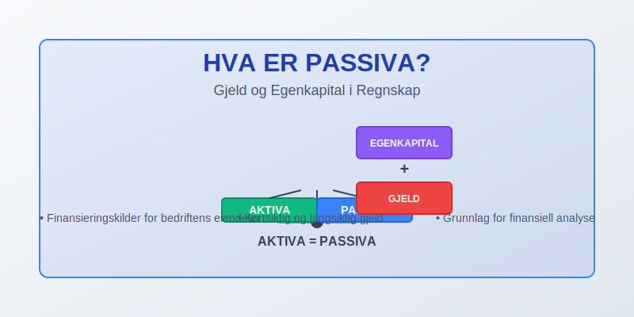

## Hva er Passiva i Regnskap?

Passiva, også kalt **gjeld og egenkapital**, omfatter alle finansieringskilder som et selskap benytter for å finansiere sine eiendeler. Dette inkluderer både midlertidige forpliktelser som skal betales på kort sikt, langsiktige lån og egenkapitalen som eierne har investert i selskapet.

Passiva-siden av balansen viser **kapitalkildene** og består av to hovedkategorier:

* **Egenkapital** - Eiernes investering og opptjent overskudd
* **Gjeld** - Forpliktelser overfor kreditorer og leverandører

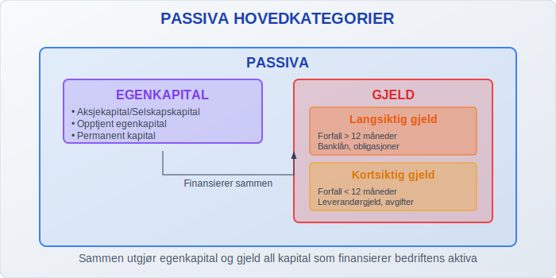

## Passiva i Balansen

Passiva utgjør høyre side av [balansen](/blogs/regnskap/hva-er-balanse "Hva er Balanse? En Guide til Balansen i Regnskap") og må alltid være lik summen av aktiva. Dette kalles **regnskapslikningen**:

**Aktiva = Passiva (Egenkapital + Gjeld)**

Passiva-siden er strukturert hierarkisk, hvor egenkapital kommer øverst, fulgt av langsiktig gjeld og til slutt kortsiktig gjeld:

| Passiva-kategori | Beskrivelse | Tidsperspektiv |
|------------------|-------------|----------------|
| **Egenkapital** | Eiernes investering og overskudd | Permanent kapital |
| **Langsiktig gjeld** | Forpliktelser over 1 år | Over 12 måneder |
| **Kortsiktig gjeld** | Forpliktelser under 1 år | Under 12 måneder |

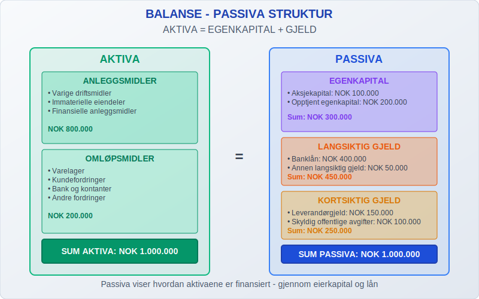

## Egenkapital

**Egenkapital** representerer eiernes eierandel i selskapet og består av investert kapital pluss akkumulert overskudd som ikke er utdelt som utbytte.

### Komponenter i Egenkapital

* **Aksjekapital/Selskapskapital** - Innbetalt kapital fra eierne
* **Overkurs** - Beløp betalt utover pålydende ved aksjesalg
* **Opptjent egenkapital** - Akkumulert overskudd som ikke er utdelt
* **Annen egenkapital** - Andre former for egenkapital

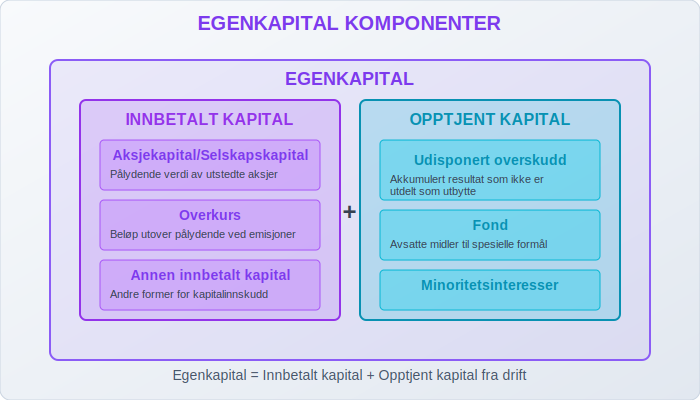

### Egenkapitalens Rolle

Egenkapitalen fungerer som en **buffer** mot tap og gir selskapet finansiell fleksibilitet. Høy egenkapitalandel indikerer:

* Sterk finansiell posisjon
* Lav finansiell risiko
* Større handlingsrom ved investeringer
* Bedre muligheter for å tåle økonomiske nedgangstider

## Gjeld (Forpliktelser)

**Gjeld** representerer alle forpliktelser selskapet har overfor eksterne parter. Gjelden deles inn i kortsiktig og langsiktig basert på forfallstidspunkt.

### Kortsiktig Gjeld

Kortsiktig gjeld er forpliktelser som forfaller innen 12 måneder:

* **Leverandørgjeld** - Ubetalt til leverandører av varer og tjenester
* **Skyldig offentlige avgifter** - MVA, arbeidsgiveravgift, forskuddstrekk
* **Annen kortsiktig gjeld** - Påløpte kostnader, forskudd fra kunder
* **Kortsiktig del av langsiktig gjeld** - Avdrag på lån som forfaller innen ett år

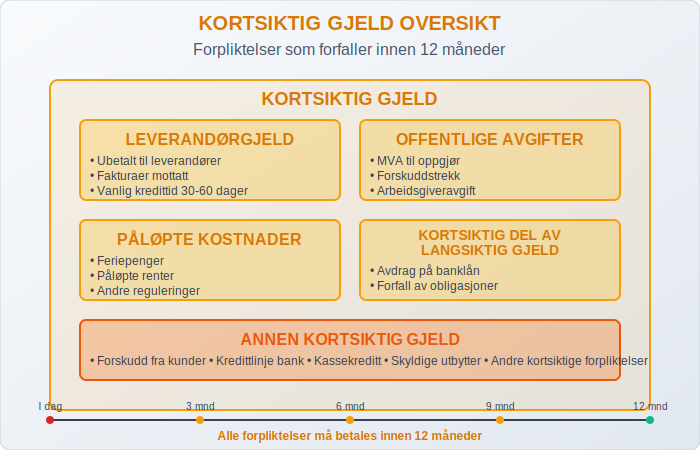

### Langsiktig Gjeld

Langsiktig gjeld er forpliktelser med forfall over 12 måneder:

* **Pantelån** - Lån sikret med pant i eiendeler
* **Fantegang** - Sikringsrett der kreditor tar besittelse av eiendeler fra debitor for å sikre betaling. Se [Fantegang](/blogs/regnskap/hva-er-fantegang "Hva er Fantegang? En Komplett Guide til Sikringsrettigheter i Norsk Regnskap").
* **Obligasjonslån** - Verdipapirgjeld utstedt av selskapet
* **Annen langsiktig gjeld** - Andre lån og forpliktelser over ett år
* **[Pensjonsforpliktelser](/blogs/regnskap/hva-er-pensjon "Hva er Pensjon? Komplett Guide til Norsk Pensjonssystem")** - Forpliktelser knyttet til ansattes pensjoner

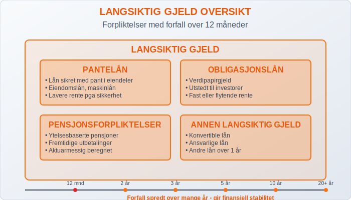

## Passiva og Likviditet

Passiva-strukturen påvirker selskapets **likviditet** og finansielle fleksibilitet betydelig. En sunn passiva-struktur kjennetegnes av:

### Optimal Kapitalstruktur

| Aspekt | Anbefaling | Begrunnelse |
|--------|------------|-------------|
| **Egenkapitalandel** | Minimum 20-30% | Tilstrekkelig buffer mot tap |
| **Kortsiktig vs. langsiktig gjeld** | Balansert fordeling | Unngå likviditetsproblemer |
| **Gjeldsgrad** | Under 70-80% | Akseptabel finansiell risiko |

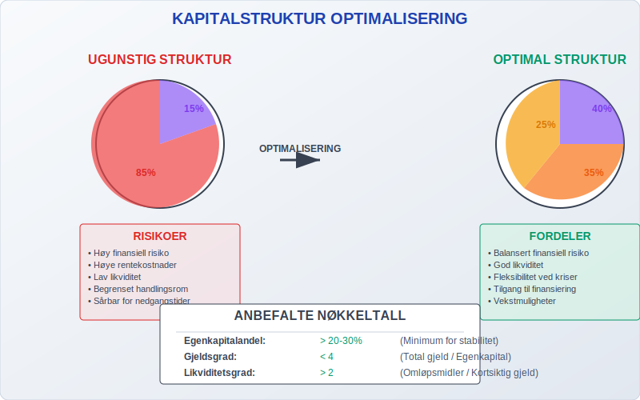

### Likviditetsanalyse

For å vurdere selskapets evne til å møte sine forpliktelser, analyseres forholdet mellom:

* **Arbeidskapital** = Omløpsmidler - Kortsiktig gjeld
* **Likviditetsgrad 1** = Omløpsmidler / Kortsiktig gjeld
* **Likviditetsgrad 2** = (Omløpsmidler - Varelager) / Kortsiktig gjeld

## Passiva i Forskjellige Selskapsformer

Passiva-strukturen varierer mellom ulike selskapsformer og må tilpasses gjeldende regelverk:

### Aksjeselskap (AS)

* Minimum aksjekapital: **NOK 30 000**
* Krav til [balanse](/blogs/regnskap/hva-er-balanse "Hva er Balanse? En Guide til Balansen i Regnskap") og resultatregnskap
* Særlige regler for utbytte og kapitalforvaltning

### Allmennaksjeselskap (ASA)

* Minimum aksjekapital: **NOK 1 000 000**
* Strengere rapporteringskrav
* Offentlig tilgjengelig informasjon

### Enkeltpersonforetak og ANS

* Ingen minstekrav til egenkapital
* Ubegrenset ansvar for eier
* Enklere rapportering

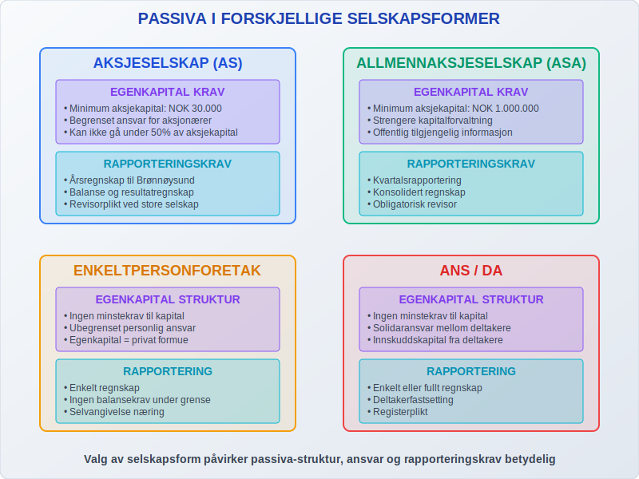

## Lovkrav og Regulering

Passiva-rapportering er strengt regulert gjennom [bokføringsloven](/blogs/regnskap/bokforingsloven "Bokføringsloven - En Guide til Norske Regnskapsregler") og regnskapsloven:

### Sentrale Bestemmelser

* **Regnskapsloven § 6-1** - Krav til balanseoppsett
* **Regnskapsloven § 6-2** - Klassifisering av gjeld
* **Bokføringsloven § 4** - Krav til løpende bokføring

### Rapporteringsfrister

* **Årsregnskap** - Innen 5 måneder etter regnskapsårets slutt
* **Årsberetning** - Sammen med årsregnskapet
* **Innlevering til Brønnøysundregistrene** - Innen 7 måneder

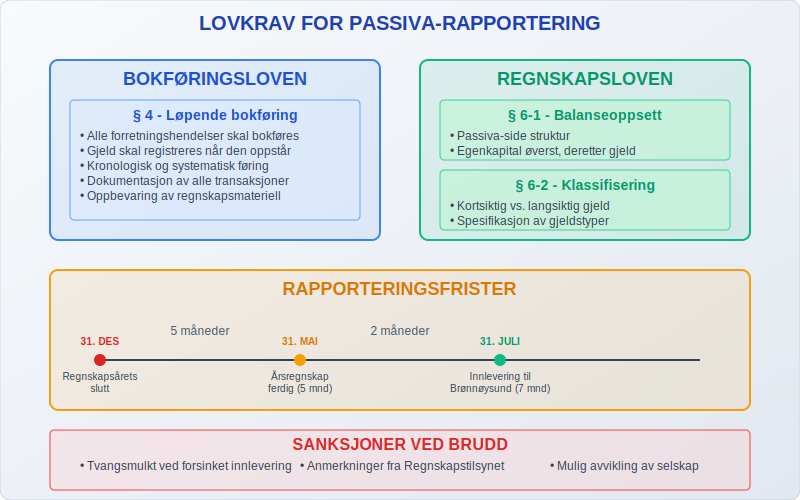

## Passiva-forvaltning i Praksis

Effektiv forvaltning av passiva krever kontinuerlig oppfølging og strategisk planlegging:

### Gjeldsstyring

* **Refinansiering** - Planlegging av lånefornyelser
* **Rentebinding** - Håndtering av renterisiko
* **Forfallsstruktur** - Spredning av forfall over tid

### Egenkapitaloptimalisering

* **Tilbakeholdt overskudd** - Styrking av egenkapitalen
* **Kapitalutvidelser** - Emisjoner ved kapitalbehov
* **Utbyttepolitikk** - Balanse mellom utdeling og kapitaloppbygging

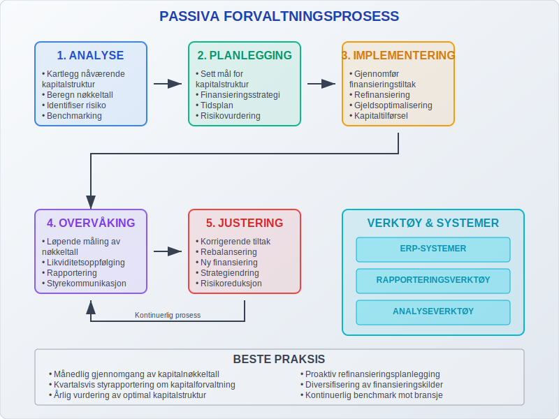

## Passiva og Kredittvurdering

Passiva-strukturen er avgjørende for selskapets **kredittverdighet** og påvirker:

### Finansieringsbetingelser

* **Rente** - Lavere rente ved god kapitalstruktur
* **Sikkerhetskrav** - Mindre sikkerhet ved høy egenkapitalandel
* **Lånegrenser** - Høyere lånekapasitet ved sunn passiva-struktur

### Nøkkeltall for Kredittvurdering

| Nøkkeltall | Beregning | Ønsket nivå |
|------------|-----------|-------------|
| **Egenkapitalandel** | Egenkapital / Total kapital | > 20% |
| **Gjeldsgrad** | Total gjeld / Egenkapital | < 4 |
| **Rentedekningsgrad** | EBIT / Rentekostnader | > 2 |

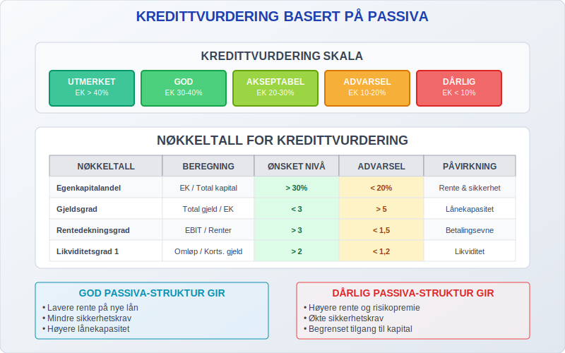

## Digitalisering av Passiva-håndtering

Moderne regnskapssystemer og [ERP-systemer](/blogs/regnskap/hva-er-erp-system "Hva er ERP-system? En Guide til Bedriftsstyringssystemer") har revolutjonert passiva-forvaltningen:

### Automatiserte Funksjoner

* **Automatisk kontering** av leverandørfakturaer
* **Forfallsovervåking** for alle forpliktelser
* **Likviditetsprognosen** basert på forfallskalender
* **Integrert rapportering** til myndigheter

### Sanntidsovervåking

Moderne systemer gir kontinuerlig innsikt i:

* Aktuell gjeldsposisjon
* Kommende forfall
* Likviditetsbehov
* Kredittutnyttelse

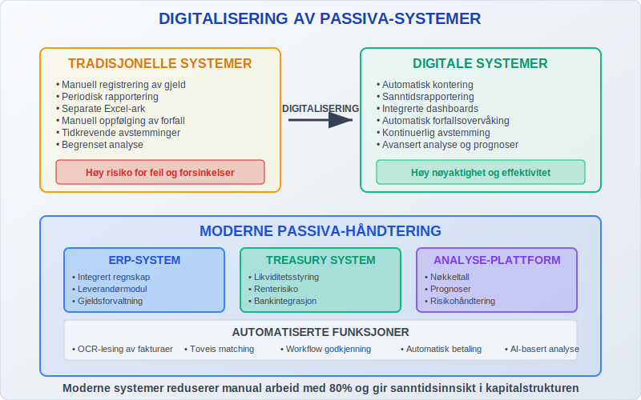

## Utfordringer og Løsninger

### Vanlige Utfordringer

1. **Likviditetsstyring** - Balansere kortsiktige og langsiktige behov
2. **Refinansieringsrisiko** - Sikre tilgang på kapital ved forfall
3. **Renterisiko** - Håndtere svingninger i rentekostnader
4. **Valutarisiko** - Administrere gjeld i utenlandsk valuta

### Beste Praksis

* **Diversifisering** av finansieringskilder
* **Langsiktig planlegging** av kapitalstruktur
* **Kontinuerlig overvåking** av finansielle nøkkeltall
* **Proaktiv kommunikasjon** med långivere

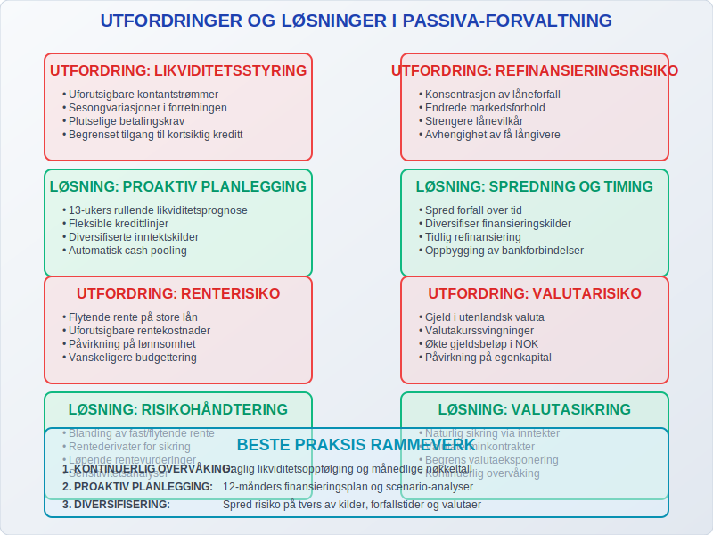

## Fremtiden for Passiva-rapportering

Utviklingen innen regnskapsteknologi og regulering påvirker hvordan passiva håndteres:

### Teknologiske Trender

* **Kunstig intelligens** for risikohåndtering
* **Blockchain** for transparent gjeldsregistrering
* **Sanntidsrapportering** til myndigheter
* **Integrerte ESG-vurderinger** i kredittvurdering

### Regulatoriske Endringer

* Økt fokus på **bærekraftsrapportering**
* Strengere krav til **risikohåndtering**
* Harmonisering av **internasjonale standarder**

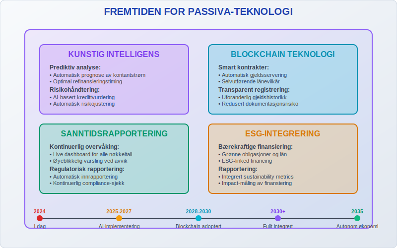

## Konklusjon

Passiva er en fundamental del av enhver bedrifts økonomi og representerer alle kapitalkildene som finansierer selskapets virksomhet. En sunn passiva-struktur med riktig balanse mellom egenkapital og gjeld er avgjørende for:

* **Finansiell stabilitet** og evne til å møte forpliktelser
* **Tilgang til finansiering** på konkurransedyktige vilkår
* **Fleksibilitet** til å utnytte forretningsmuligheter
* **Langsiktig bærekraft** og vekstpotensial

Ved å forstå og aktivt forvalte passiva-strukturen kan bedrifter styrke sin finansielle posisjon og skape grunnlag for lønnsom drift og vekst. Moderne teknologi gjør det enklere enn noen gang å overvåke og optimalisere passivaen, mens endringer i regelverk krever kontinuerlig oppmerksomhet og tilpasning.

For bedrifter som ønsker å forbedre sin passiva-forvaltning, anbefales det å implementere systemer for løpende overvåking, utvikle klare retningslinjer for kapitalstruktur og sikre kompetanse på relevante regelverk og beste praksis.

