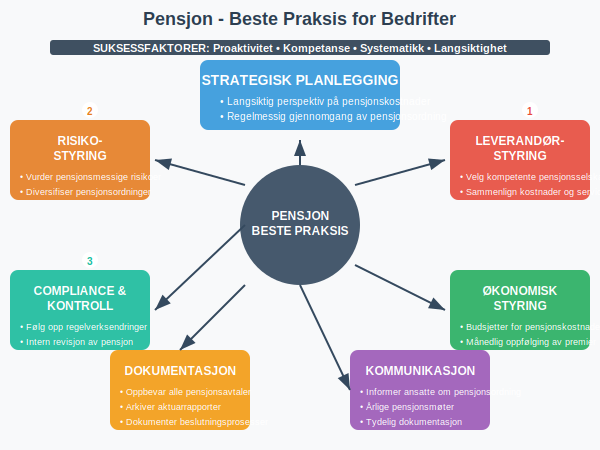

**Pensjon** er et system designet for å sikre økonomisk trygghet i alderdommen. I Norge består pensjonssystemet av flere lag, og for bedrifter representerer pensjon både en sentral del av [lønnskostnadene](/blogs/regnskap/hva-er-lonnskostnader "Hva er Lønnskostnader? Komplett Guide til Lønnskostnader i Regnskap") og en viktig [langsiktig forpliktelse](/blogs/regnskap/hva-er-langsiktig-gjeld "Hva er Langsiktig Gjeld? Definisjon og Regnskapsføring"). Pensjonsordninger påvirker både selskapets [kontantstrøm](/blogs/regnskap/hva-er-kontantstrom "Hva er Kontantstrøm? Betydning og Analyse i Regnskap") og [balanse](/blogs/regnskap/hva-er-balanse "Hva er Balanse? Struktur og Innhold i Balanseregnskap").

Skattetrekk for pensjons- og trygdeutbetalinger beregnes iht. [Tabell 7100](/blogs/regnskap/tabell-7100 "Tabell 7100: Skattetabell for Pensjon og Trygdeutbetalinger"), som gir oversikt over trekkprosent for ulike utbetalingstyper og inntektsnivåer.

## Det Norske Pensjonssystemet

Det norske pensjonssystemet består av **tre hovedsøyler** som til sammen skal sikre pensjonistene en trygg økonomisk tilværelse:

### 1. Folketrygden (Første Søyle)

**Folketrygden** er det offentlige, obligatoriske pensjonssystemet som administreres av NAV. Alle som har bodd eller arbeidet i Norge, opptjener rettigheter i folketrygden. Systemet finansieres gjennom [arbeidsgiveravgift](/blogs/regnskap/hva-er-arbeidsgiveravgift "Hva er Arbeidsgiveravgift? Satser, Beregning og Regnskapsføring") og skatter.

Folketrygden består av:

* **[Garantipensjon og minstepensjon](/blogs/regnskap/minstepensjon "Garantipensjon og Minstepensjon: Hva er minstepensjon?"):** Sikrer alle en minstepensjon
* **Inntektspensjon:** Basert på opptjente pensjonspoeng gjennom arbeidslivet
* **Uførepensjon:** For personer som blir varig arbeidsufør

### 2. Tjenestepensjon (Andre Søyle)

**Tjenestepensjon** er arbeidsgiver-finansierte pensjonsordninger som er lovpålagt for alle virksomheter med ansatte. Fra 2006 har alle arbeidsgivere plikt til å etablere en [obligatorisk tjenestepensjon (OTP)](/blogs/regnskap/hva-er-otp "Hva er OTP? Obligatorisk Tjenestepensjon for Bedrifter") for sine ansatte.

Tjenestepensjon kan organiseres som:

* **Innskuddspensjon:** Arbeidsgiveren betaler faste innskudd til pensjonsselskap
* **Ytelsespensjon:** Arbeidsgiveren garanterer en bestemt pensjonsytelse
* **Hybridpensjon:** Kombinasjon av innskudd og ytelse

### 3. Individuell Pensjonssparing (Tredje Søyle)

Den tredje søylen består av **frivillig pensjonssparing** som individer etablerer selv. Dette inkluderer:

* **[IPS (Individuell Pensjonssparing)](/blogs/regnskap/hva-er-individuell-pensjonssparing "Hva er individuell pensjonssparing? IPS og andre spareformer"):** Med skattefradrag
* **BSU (Boligsparing for ungdom):** Kan brukes til pensjon
* **Aksjesparekonto:** For langsiktig sparing
* **Andre spareprodukter:** Fond, bank og forsikring

## Regnskapsføring av Pensjon

For bedrifter krever pensjonshåndtering grundig forståelse av regnskapsprinsipper og [regnskapsstandarder](/blogs/regnskap/hva-er-regnskapsstandarder "Hva er Regnskapsstandarder? NRS, IFRS og Regnskapsregler"). [Pensjonsrapportering](/blogs/regnskap/hva-er-pensjonsrapportering "Hva er Pensjonsrapportering? Komplett Guide til Pensjon i Regnskap") er en kritisk del av dette arbeidet.

### Innskuddspensjon - Regnskapsføring

Innskuddspensjon er regnskapsmessig enklest å håndtere:

* **Månedlig kostnad:** Innskuddet føres som [lønnskostnad](/blogs/regnskap/hva-er-lonnskostnader "Hva er Lønnskostnader? Komplett Guide til Lønnskostnader i Regnskap") når det påløper
* **Betalingsplikt:** Skyldige innskudd føres som [kortsiktig gjeld](/blogs/regnskap/hva-er-kortsiktig-gjeld "Hva er Kortsiktig Gjeld? Definisjon og Regnskapsføring")
* **Ingen langsiktige forpliktelser:** Arbeidsgiveren har bare plikt til å betale løpende innskudd

| Konto | Debet | Kredit |
|-------|-------|--------|
| Lønnskostnad | X |        |
| Skyldig pensjonspremie |   | X      |

### Ytelsespensjon - Regnskapsføring

Ytelsespensjon krever mer kompleks regnskapsbehandling siden arbeidsgiveren garanterer fremtidige ytelser:

**Sentrale elementer:**

* **Pensjonsforpliktelse:** Nåverdien av fremtidige pensjonsutbetalinger
* **Pensjonsmidler:** Verdien av midler satt av til å dekke forpliktelsen  
* **Netto pensjonsforpliktelse:** Differansen mellom forpliktelse og midler
* **Pensjonskostnad:** Årlig kostnad som påvirker [resultatregnskapet](/blogs/regnskap/hva-er-resultatregnskap "Hva er Resultatregnskap? Oppbygning og Analyse")

**Beregningsgrunnlag for ytelsespensjon:**

* Antatt lønnsvekst
* Avkastning på pensjonsmidler
* Dødelighet og utgangsalder
* Inflasjon og G-regulering

### Aktuarberegninger

**Aktuarberegninger** er faglige vurderinger utført av autoriserte aktuarer som beregner:

* Fremtidige pensjonsforpliktelser
* Pensjonskostnader for regnskapsperioden  
* Demografiske og økonomiske forutsetninger

Disse beregningene må oppdateres årlig og danner grunnlag for regnskapsføringen.

## Pensjonskostnader og Kontantstrøm

Pensjon påvirker bedriftens økonomi på flere måter:

### Løpende Pensjonskostnader

* **Innskuddspensjon:** Faste årlige kostnader basert på lønn
* **Ytelsespensjon:** Varierende kostnader basert på aktuarberegninger
* **Administrasjonskostnader:** Kostnader til pensjonsforvaltning

### Kontantstrømeffekter

* **Direkte utbetalinger:** Pensjonspremier og innskudd
* **Skatteeffekter:** Fradrag for pensjonskostnader
* **Likviditetsplanlegging:** Planlegging av fremtidige pensjonsutbetalinger

## Pensjon i Årsrapporten

Pensjonsopplysninger må presenteres i [årsrapporten](/blogs/regnskap/hva-er-arsrapport "Hva er Årsrapport? Innhold, Krav og Praktisk Veiledning") gjennom:

### Noter til Regnskapet

**Note om pensjoner** må inneholde:

* Beskrivelse av pensjonsordningene
* Aktuarmessige forutsetninger for ytelsespensjon
* Specifikasjon av pensjonsforpliktelser og pensjonsmidler
* Endringer i pensjonsforpliktelsen i regnskapsåret
* Følsomhetsanalyser for sentrale forutsetninger

### Regnskapsprinsipper

Valgte regnskapsprinsipper for pensjon må beskrives, inkludert:

* Metode for regnskapsføring av ytelsespensjon
* Behandling av aktuarmessige gevinster og tap
* Amortisering av ikke resultatførte elementer

## Skatteregler for Pensjon

Pensjon har omfattende skattemessige implikasjoner:

### Bedriftsperspektiv

* **Fradragsrett:** Pensjonskostnader er fradragsberettiget
* **Tidspunkt:** Fradrag følger regnskapsmessig periodisering
* **Begrensninger:** Maksimale fradrag for enkelte pensjonsordninger

### Arbeidstakerperspektiv  

* **Innskuddspensjon:** Ikke skattepliktig for mottakeren ved innbetaling
* **Pensjonsutbetalinger:** Skattepliktige som pensjonsinntekt
* **Særordninger:** Spesielle regler for enkelte yrkesgrupper

## Pensjon og Virksomhetsoverdragelse

Ved [virksomhetsoverdragelse](/blogs/regnskap/hva-er-virksomhetsoverdragelse "Hva er Virksomhetsoverdragelse? Juridiske og Regnskapsmessige Aspekter") må pensjonsrettigheter håndteres spesielt:

### Innskuddspensjon

* Midler overføres normalt til ny ordning
* Opptjente rettigheter følger arbeidstakeren
* Enkel overgangsordning

### Ytelsespensjon

* Kompleks overføringsprosess
* Vurdering av pensjonsforpliktelser
* Avtaler om ansvarsfordeling

## Fremtidens Pensjonssystem

Det norske pensjonssystemet er i stadig utvikling:

### Demografiske Utfordringer

* **Aldrende befolkning:** Flere pensjonister per arbeidstaker
* **Lengre levealder:** Økte pensjonskostnader
* **Lavere fødselstall:** Færre til å finansiere pensjonene

### Politiske Endringer

* **Pensjonsreformer:** Kontinuerlige justeringer av folketrygden
* **Nye regler:** Endringer i tjenestepensjonsloven
* **EU-regulering:** Påvirkning fra europeiske direktiver

### Teknologiske Muligheter

* **Digital forvaltning:** Mer effektiv administrasjon
* **Automatisering:** Reduserte administrative kostnader
* **Nye produkter:** Innovative spareprodukter

## Pensjon og Internkontroll

Effektiv pensjonshåndtering krever solid [internkontroll](/blogs/regnskap/hva-er-internkontroll "Hva er Internkontroll? Systemer og Prosedyrer for Bedre Risikostyring"):

### Kontrollrutiner

* **Månedlig avstemming:** Kontroll av pensjonspremier og innskudd
* **Årlig gjennomgang:** Vurdering av aktuarmessige forutsetninger
* **Compliance:** Sikre etterlevelse av lovkrav

### Risikoområder

* **Aktuarmessige feil:** Feilberegninger av pensjonsforpliktelser
* **Regelverksendringer:** Manglende oppfølging av nye regler
* **Systemrisiko:** Tekniske feil i pensjonssystemene

### Dokumentasjon

* **Avtaler:** Oppbevaring av pensjonsavtaler og regelverksdokumenter
* **Beregninger:** Dokumentasjon av aktuarberegninger
* **Beslutninger:** Protokoller fra pensjonsrelaterte beslutninger

## Praktiske Råd for Bedrifter

For bedrifter som skal etablere eller forvalte pensjonsordninger:

### Valg av Pensjonsordning

* **Vurder kostnadene:** Sammenlign innskudd vs. ytelse
* **Analysér risiko:** Forstå langsiktige forpliktelser
* **Involvér ansatte:** Kommuniser pensjonsmuligheter

### Leverandørvalg

* **Pensjonsselskap:** Vurder service og kostnader
* **Aktuarkonsulent:** Velg kompetent og erfaren aktuar
* **Regnskapsfører:** Sikre korrekt regnskapsbehandling

### Løpende Forvaltning

* **Årlig gjennomgang:** Evaluer pensjonsordningen
* **Markedsovervåking:** Følg utviklingen i pensjonsbransjen
* **Compliance:** Hold deg oppdatert på regelverksendringer

Pensjon er et komplekst område som krever grundig forståelse av både juridiske, regnskapsmessige og skattemessige forhold. For bedrifter er det essensielt å etablere gode rutiner for håndtering av pensjonsforpliktelser og sikre korrekt regnskapsføring av pensjonskostnader.

