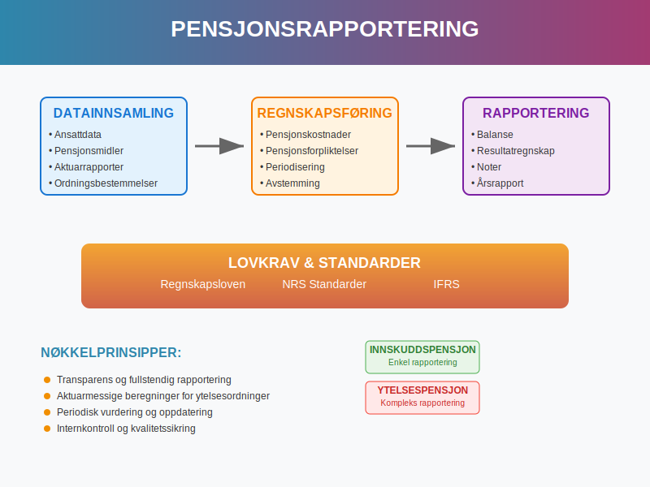
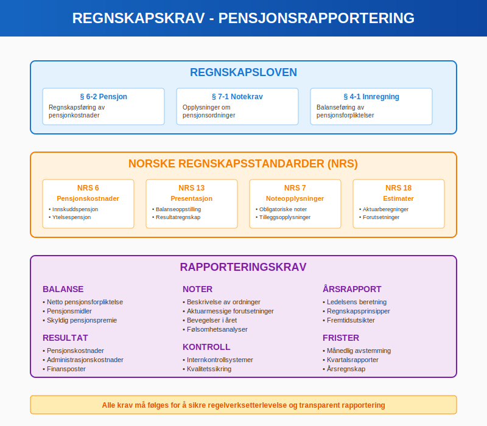
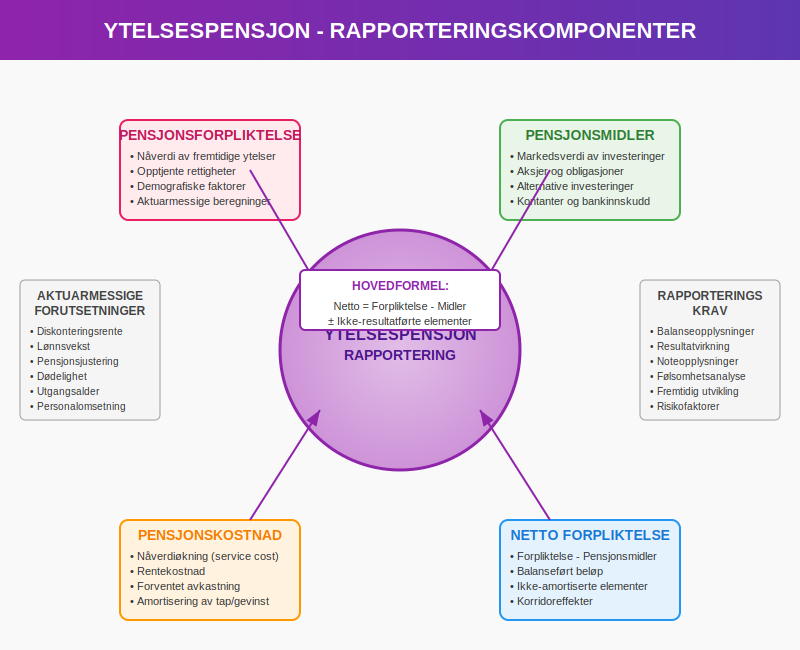
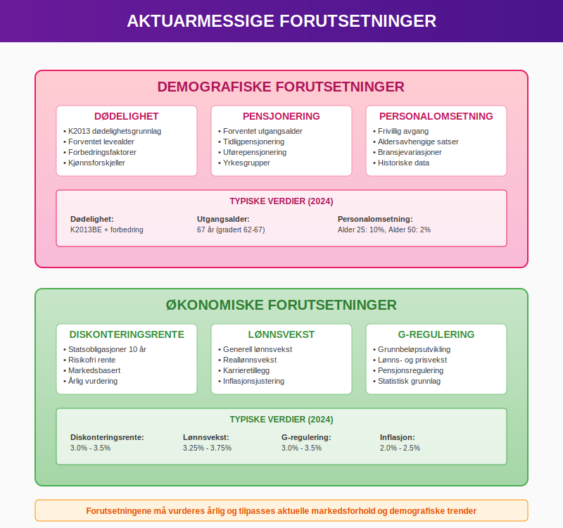
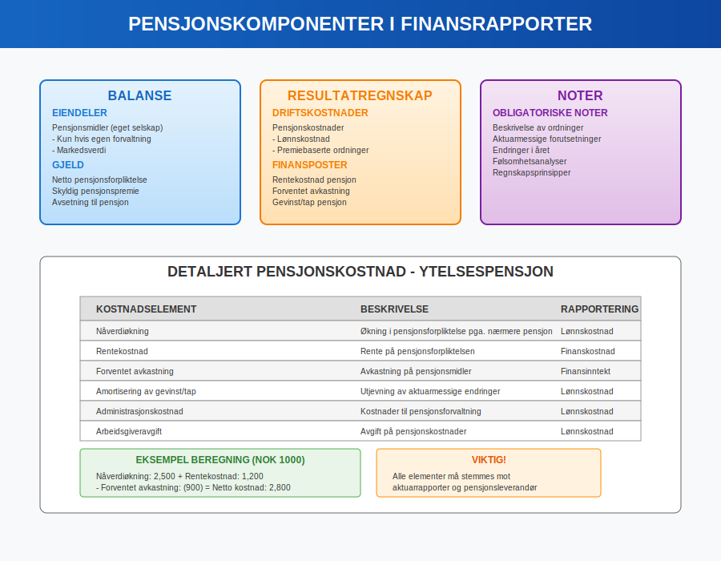
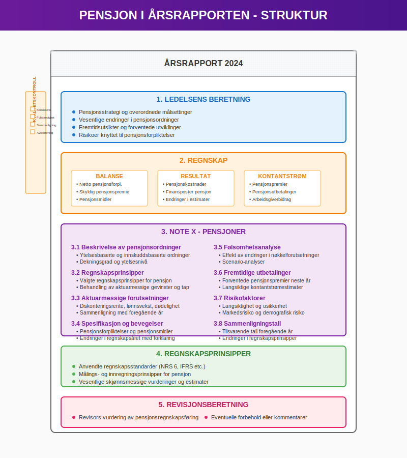
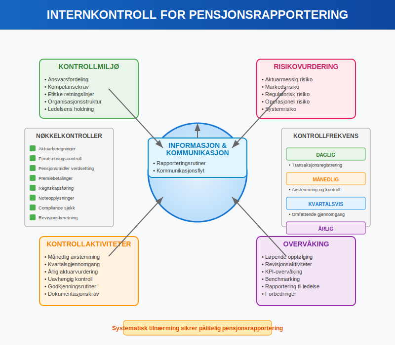
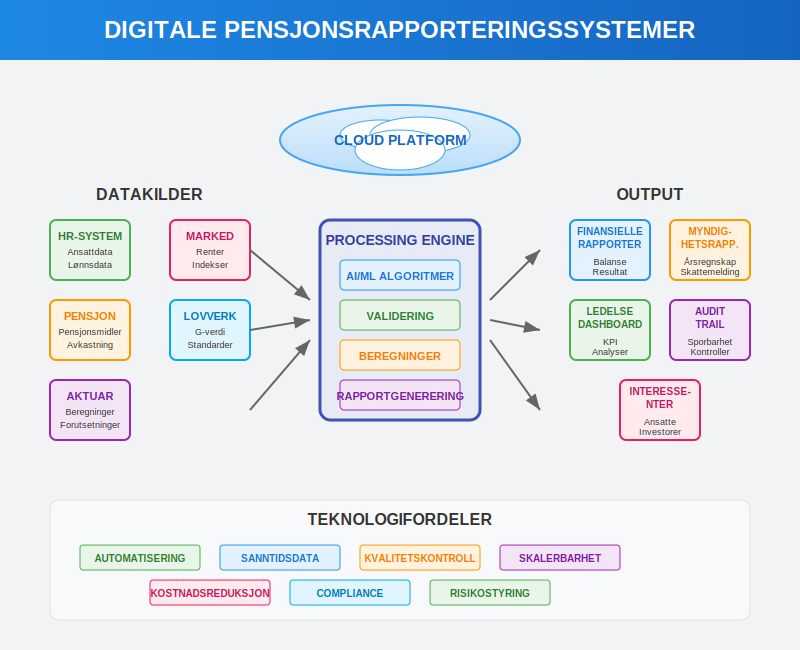
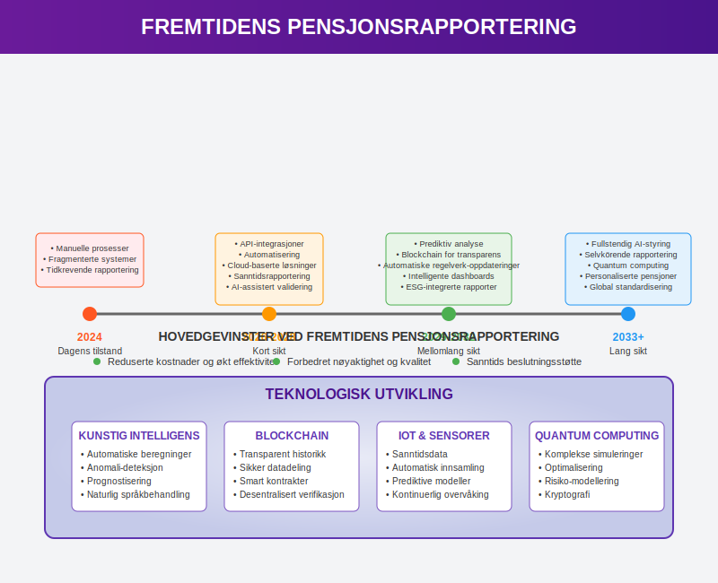
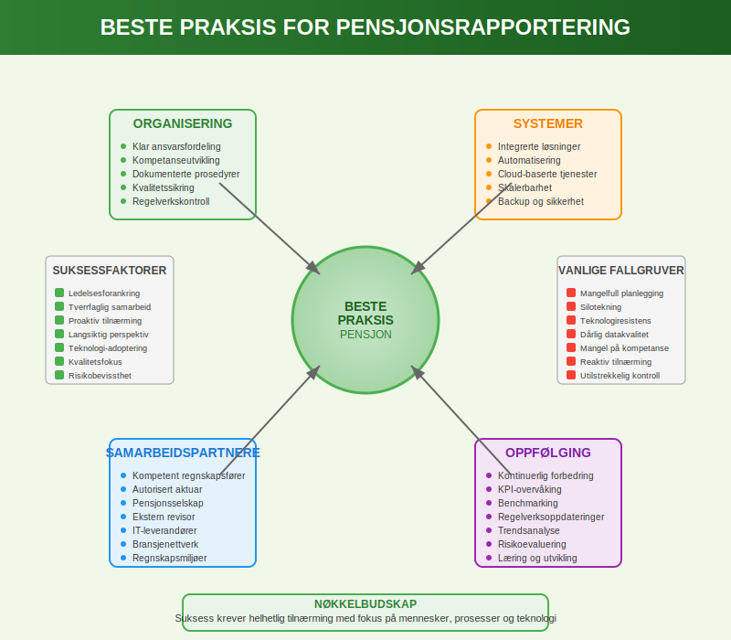

---
title: "Hva er Pensjonsrapportering?"
meta_title: "Hva er Pensjonsrapportering?"
meta_description: '**Pensjonsrapportering** er en kritisk del av norsk regnskapsføring som sikrer korrekt og transparent presentasjon av bedriftens [pensjonsforpliktelser](/blogs...'
slug: hva-er-pensjonsrapportering
type: blog
layout: pages/single
---

**Pensjonsrapportering** er en kritisk del av norsk regnskapsføring som sikrer korrekt og transparent presentasjon av bedriftens [pensjonsforpliktelser](/blogs/regnskap/hva-er-pensjon "Hva er Pensjon? Komplett Guide til Norsk Pensjonssystem") og pensjonskostnader. Dette omfatter både [lovpålagte krav](/blogs/regnskap/hva-er-bokforingsloven "Hva er Bokføringsloven? Regler og Krav til Norsk Regnskap") til regnskapsføring og utvidet rapportering for interessenter.



## Hva er Pensjonsrapportering?

**Pensjonsrapportering** refererer til den systematiske prosessen med å måle, registrere og rapportere alle aspekter av bedriftens pensjonsordninger i regnskapet og tilhørende dokumentasjon. Dette inkluderer både **innskuddsbaserte** og **ytelsesbaserte** pensjonsordninger som påvirker selskapets finansielle stilling.

### Formål med Pensjonsrapportering

Pensjonsrapportering har flere kritiske formål:

* **Transparens:** Gi interessenter fullstendig innsikt i pensjonskostnader og -forpliktelser
* **Compliance:** Sikre etterlevelse av [regnskapsstandarder](/blogs/regnskap/hva-er-regnskapsstandarder "Hva er Regnskapsstandarder? NRS, IFRS og Regnskapsregler") og lovkrav
* **Beslutningsgrunnlag:** Understøtte strategiske beslutninger om pensjonsordninger
* **Risikostyring:** Identifisere og kvantifisere pensjonsmessige risikoer

## Lovkrav til Pensjonsrapportering

Norske bedrifter må følge strenge krav til pensjonsrapportering etablert gjennom flere regelverk:

### Regnskapsloven og NRS Standarder

**Regnskapsloven** og tilhørende [Norske Regnskapsstandarder (NRS)](/blogs/regnskap/hva-er-regnskapsstandarder "Hva er Regnskapsstandarder? NRS, IFRS og Regnskapsregler") krever:

* Korrekt regnskapsføring av pensjonskostnader
* Fullstendig opplysning om pensjonsordninger i noter
* Aktuarmessige beregninger for ytelsesordninger
* Ã…rlig vurdering av pensjonsmidler og -forpliktelser



### Regnskapsføringsmetoder

Pensjonsrapportering varierer betydelig basert på type pensjonsordning:

#### Innskuddspensjon

**Innskuddspensjoner** har relativt enkel rapporteringsstruktur:

| Element | Regnskapsbehandling | Rapporteringskrav |
|---------|---------------------|-------------------|
| Løpende innskudd | [Lønnskostnad](/blogs/regnskap/hva-er-lonnskostnader "Hva er Lønnskostnader? Komplett Guide til Lønnskostnader i Regnskap") når påløpt | Spesifikasjon i noter |
| Skyldige innskudd | [Kortsiktig gjeld](/blogs/regnskap/hva-er-kortsiktig-gjeld "Hva er Kortsiktig Gjeld? Definisjon og Regnskapsføring") | Presentasjon i [balanse](/blogs/regnskap/hva-er-balanse "Hva er Balanse? Struktur og Innhold i Balanseregnskap") |
| Administrasjonskostnader | Driftskostnad | Separat rapportering |

#### Ytelsespensjon

**Ytelsespensjoner** krever omfattende rapportering:

* **Pensjonsforpliktelse:** NÃ¥verdi av fremtidige pensjonsytelser
* **Pensjonsmidler:** Markedsverdi av investerte midler
* **Netto pensjonsforpliktelse:** Differanse mellom forpliktelse og midler
* **Pensjonskostnad:** Periodisert kostnad i [resultatregnskapet](/blogs/regnskap/hva-er-resultatregnskap "Hva er Resultatregnskap? Oppbygning og Analyse")



## Aktuarmessige Beregninger

**Aktuarberegninger** danner kjernen i pensjonsrapportering for ytelsesordninger:

### Sentrale Forutsetninger

Aktuarmessige beregninger baseres på flere kritiske forutsetninger:

* **Demografiske antagelser:**
  - Dødelighet og forventet levealder
  - Utgangsalder og pensjoneringsmønster
  - Personalomsetning og avgangsmønster

* **Økonomiske antagelser:**
  - Diskonteringsrente
  - Lønnsvekst og inflasjon
  - Pensjonsregulering (G-verdi utvikling)
  - Forventet avkastning på pensjonsmidler



### Beregningsprosess

Den aktuarmessige prosessen involverer:

1. **Datainnsamling:** Ansattinformasjon og ordningsbestemmelser
2. **Forutsetningssetting:** Fastsettelse av demografiske og økonomiske antagelser
3. **Beregning:** NÃ¥verdiberegning av fremtidige pensjonsytelser
4. **Rapportering:** Presentasjon av resultater for regnskapsformål

## Komponenter i Pensjonsrapportering

Omfattende pensjonsrapportering inkluderer flere sentrale komponenter:

### Balanseopplysninger

**Balansen** må vise:

* Netto pensjonsforpliktelse som [langsiktig gjeld](/blogs/regnskap/hva-er-langsiktig-gjeld "Hva er Langsiktig Gjeld? Definisjon og Regnskapsføring")
* Pensjonsmidler (hvis relevant)
* Skyldige pensjonspremier som kortsiktig gjeld

### Resultatopplysninger

**Resultatregnskapet** skal inkludere:

* Periodiserte pensjonskostnader som lønnskostnad
* Finansposter relatert til pensjon
* Aktuarmessige gevinster/tap (når det gjelder)



### Noteopplysninger

**Noter til regnskapet** må inneholde omfattende pensjonsopplysninger:

#### Obligatoriske Noteopplysninger

* **Beskrivelse av ordninger:** Detaljert beskrivelse av alle pensjonsordninger
* **Regnskapsprinsipper:** Valgte prinsipper for pensjonsregnskapsføring
* **Aktuarmessige forutsetninger:** Oversikt over alle sentrale antagelser
* **Bevegelser:** Endringer i pensjonsforpliktelser og pensjonsmidler
* **Følsomhetsanalyse:** Effekter av endringer i nøkkelforutsetninger

## Ã…rsrapportens Pensjonsdel

Pensjonsrapportering i [Ã¥rsrapporten](/blogs/regnskap/hva-er-arsrapport "Hva er Ã…rsrapport? Innhold, Krav og Praktisk Veiledning") krever strukturert presentasjon:

### Ledelsens Beretning

Ledelsens beretning bør adressere:

* **Pensjonsstrategi:** Overordnet strategi for pensjonsordninger
* **Endringer:** Vesentlige endringer i pensjonsordninger
* **Fremtidsutsikter:** Forventede utviklinger i pensjonskostnader
* **Risikoer:** Identifiserte risikoer knyttet til pensjonsforpliktelser

### Detaljerte Notekrav

Pensjonsnoten må være **komplett og forståelig**:

```
Note X - Pensjoner

1. Beskrivelse av pensjonsordninger
2. Regnskapsprinsipper
3. Aktuarmessige forutsetninger
4. Pensjonsforpliktelser og pensjonsmidler
5. Bevegelser i regnskapsåret
6. Pensjonskostnader
7. Følsomhetsanalyser
8. Fremtidige premiebetalinger
```



## Internkontroll for Pensjonsrapportering

Effektiv pensjonsrapportering krever robust [internkontroll](/blogs/regnskap/hva-er-internkontroll "Hva er Internkontroll? Systemer og Prosedyrer for Bedre Risikostyring"):

### Kontrollmiljø

**Kontrollmiljøet** for pensjon bør omfatte:

* **Ansvarsfordeling:** Klar fordeling av ansvar for pensjonsrapportering
* **Kompetanse:** Sikre tilstrekkelig fagkompetanse
* **Dokumentasjon:** Fullstendig dokumentasjon av prosesser og beslutninger
* **Godkjenning:** Klare godkjenningslinjer for pensjonsbeslutninger

### Kontrollaktiviteter

**Sentrale kontrollaktiviteter** inkluderer:

* **Månedlig avstemming:** Kontroll av premiebetalinger og regnskapsføring
* **Kvartalsvis gjennomgang:** Vurdering av pensjonsforpliktelser
* **Ã…rlig aktuarvurdering:** Gjennomgang av aktuarmessige forutsetninger
* **Regelverkskontroll:** Sikre etterlevelse av endrede regelverk



### Risikostyring

**Pensjonsmessige risikoer** som må styres:

* **Aktuarmessig risiko:** Feil i forutsetninger og beregninger
* **Markedsrisiko:** Svingninger i pensjonsmidlers verdi
* **Regulatorisk risiko:** Endringer i lovkrav og standarder
* **Operasjonell risiko:** Feil i systemer og prosesser

## Digitalisering av Pensjonsrapportering

Moderne pensjonsrapportering drar nytte av digital teknologi:

### Automatiserte Systemer

**Digitale pensjonssystemer** muliggjør:

* **Sanntidsrapportering:** Løpende oppdatering av pensjonsdata
* **Integrerte beregninger:** Automatiserte aktuarmessige beregninger
* **Compliance-overvåking:** Automatisk kontroll av regelverksetterlevelse
* **Scenariomodellering:** Avanserte analyser av fremtidige utviklinger

### API-integrasjoner

**API-tilkoblinger** til:

* Pensjonsselskaper for pensjonsmiddeldata
* Aktuarkonsulenter for beregningsresultater
* [Regnskapssystemer](/blogs/regnskap/hva-er-regnskapssystem "Hva er Regnskapssystem? Digital Bokføring og Rapportering") for automatisk føring



## Internasjonale Standarder

For selskaper som rapporterer etter **IFRS** gjelder spesielle krav:

### IAS 19 - Employee Benefits

**IAS 19** krever:

* **Detaljert aktuarmessig verdsetting** av ytelsesbaserte ordninger
* **Korridor-tilnærming** eller direkte resultatføring av aktuarmessige gevinster/tap
* **Omfattende noteopplysninger** om pensjonsordninger
* **Ã…rlig aktuarvurdering** av alle vesentlige ordninger

### Forskjeller fra Norske Standarder

Hovedforskjeller mellom IFRS og norske regler:

| Aspekt | IFRS (IAS 19) | Norske standarder |
|--------|---------------|-------------------|
| Aktuarmessige gevinster/tap | Direkte i totalresultat | Korridor eller direkte |
| Ikke-opptjente rettigheter | Øyeblikkelig kostnadsføring | Amortisering |
| Diskonteringsrente | Høykvalitets selskapsobligasjoner | Statsobligasjoner |
| Notekrav | Svært detaljerte | Moderat detaljerte |

## Sektorspesifikke Pensjonsutfordringer

Ulike sektorer har spesielle pensjonsrapporteringsutfordringer:

### Offentlig Sektor

**Offentlige virksomheter** møter unike utfordringer:

* **Statens Pensjonskasse (SPK):** Spesielle regler for offentlig ansatte
* **Kommunal sektor:** Varierte pensjonsordninger på kommunalt nivå
* **Helseforetak:** Komplekse ordninger for helsepersonell

### Privat Sektor

**Private bedrifter** har andre fokusområder:

* **Konkurransedyktige ordninger:** Balanse mellom kostnader og ansattfordeler
* **Fleksibilitet:** Tilpasning til virksomhetens utviklingsfaser
* **Kostnadseffektivitet:** Optimalisering av pensjonskostnader


## Fremtidens Pensjonsrapportering

Pensjonsrapportering vil fortsette å utvikle seg:

### Teknologiske Innovasjoner

**Nye teknologier** vil påvirke rapportering:

* **Kunstig intelligens:** Automatiserte aktuarmessige beregninger og prognoser
* **Blockchain:** Sikker og transparent registrering av pensjonsrettigheter
* **Cloud-computing:** Skalerbare løsninger for små og mellomstore bedrifter
* **Data analytics:** Dypere innsikt i pensjonsmessige risikomønstre

### Regulatoriske Endringer

**Forventede regelverksendringer:**

* **Nye IFRS-standarder:** Fortsatt utvikling av internasjonale standarder
* **ESG-rapportering:** Bærekraftshensyn i pensjonsforvaltning
* **Digital rapportering:** Standardiserte digitale rapporteringsformater
* **Realtidsrapportering:** Krav til raskere og mer oppdatert rapportering



## Praktiske Anbefalinger

For bedrifter som ønsker å forbedre sin pensjonsrapportering:

### Organisering

**Effektiv organisering** krever:

* **Tydelig ansvarsfordeling:** Klargjøring av roller og ansvar
* **Kompetanseutvikling:** Sikre tilstrekkelig fagkompetanse
* **Dokumenterte prosedyrer:** Skriftlige rutiner for alle prosesser
* **Kvalitetssikring:** Systematisk kontroll og verifisering

### Systemvalg

**Ved valg av systemer** bør man vurdere:

* **Funksjonalitet:** Dekker systemet alle rapporteringsbehov?
* **Integrasjon:** Kan systemet integreres med eksisterende løsninger?
* **Skalerbarhet:** Kan systemet vokse med virksomheten?
* **Support:** Er leverandøren dyktig på pensjonsrapportering?

### Samarbeidspartnere

**Viktige samarbeidspartnere:**

* **Autorisert regnskapsfører:** Sikre korrekt regnskapsbehandling
* **Aktuarkonsulent:** Profesjonelle aktuarmessige beregninger
* **Pensjonsselskap:** Kompetent leverandør av pensjonstjenester
* **Revisor:** Ekstern kvalitetssikring av rapportering



## Konklusjon

**Pensjonsrapportering** er en kompleks og kritisk del av moderne regnskapsføring som krever grundig forståelse av både regnskapstekniske og aktuarmessige aspekter. Bedrifter må etablere robuste systemer og prosesser for å sikre korrekt og transparent rapportering av pensjonsforpliktelser.

Effektiv pensjonsrapportering støtter ikke bare **lovpålagt compliance**, men gir også verdifull innsikt for strategisk beslutningstakning og [risikostyring](/blogs/regnskap/hva-er-risikostyring "Hva er Risikostyring? Prinsipper og Metoder i Regnskapssammenheng"). Med den pågående digitaliseringen og regulatoriske utviklingen, vil pensjonsrapportering fortsette å utvikle seg som et sentralt element i finansiell rapportering.

For bedrifter som ønsker å mestre pensjonsrapportering, er det essensielt å investere i **kompetanse, systemer og prosesser** som sikrer både dagens krav og fremtidens utfordringer.


