---
title: "Hva er Periodisering i Regnskap?"
meta_title: "Hva er Periodisering i Regnskap?"
meta_description: '**Periodisering** er et av de mest fundamentale prinsippene i regnskapsføring som sikrer at alle inntekter og utgifter blir regnskapsført i riktig [termin](/b...'
slug: hva-er-periodisering
type: blog
layout: pages/single
---

**Periodisering** er et av de mest fundamentale prinsippene i regnskapsføring som sikrer at alle inntekter og utgifter blir regnskapsført i riktig [termin](/blogs/regnskap/hva-er-termin "Hva er Termin? Regnskapsperioder og Terminplanlegging"), uavhengig av når betalingen faktisk skjer. Dette prinsippet er hjørnesteinen i moderne regnskap og skiller seg fra [kontantprinsippet](/blogs/regnskap/kontantprinsippet "Kontantprinsippet: Guide til kontantregnskap i Norge") ved å fokusere på når den økonomiske hendelsen oppstår, ikke når pengene skifter hender. Forståelse av korrekt terminplassering er essensielt for å anvende periodiseringsprinsippet på en måte som gir nøyaktige og sammenlignbare finansielle rapporter. Denne artikkelen gir en omfattende gjennomgang av periodiseringsprinsippet, dets praktiske anvendelse og betydning for nøyaktig finansiell rapportering.

For mer om avsetninger, se [Avsetning](/blogs/regnskap/avsetning "Hva er Avsetning i Regnskap? Komplett Guide til Avsetninger og Estimater").

For mer om hvordan feil periodisering og utilstrekkelige avsetninger kan føre til **baksmell**, se [Baksmell](/blogs/regnskap/baksmell "Baksmell i Regnskap og Skatt: Årsaker, Eksempler og Behandling").

## Seksjon 1: Periodiseringsprinsippets Grunnlag

### 1.1 Definisjon og Kjernekonsept

**Periodisering** betyr at inntekter og utgifter skal regnskapsføres i den perioden de **økonomisk tilhører**, ikke nødvendigvis når betalingen skjer. Dette skaper et mer nøyaktig bilde av virksomhetens økonomiske prestasjon i hver periode.

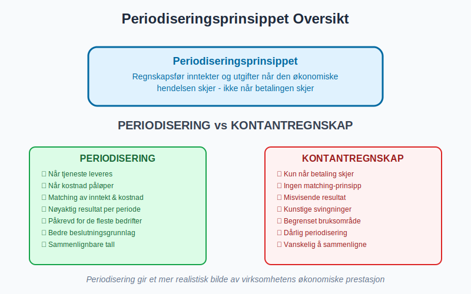

### 1.2 De Fire Hovedkategoriene

Periodisering omfatter fire hovedtyper justeringer:

* **Periodiserte inntekter:** Inntekt opptjent men ikke mottatt
* **Periodiserte kostnader:** Kostnader påløpt men ikke betalt
* **Forhåndsbetalte inntekter:** Mottatt betaling for fremtidig levering
* **Forhåndsbetalte kostnader:** Betalt for fremtidige tjenester/varer

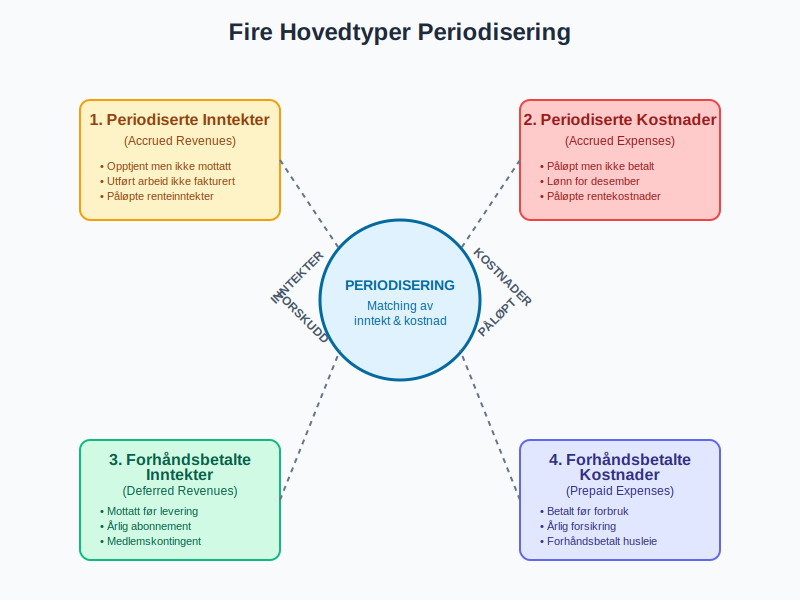

### 1.3 Periodisering vs. Kontantregnskap

| **Aspekt** | **Periodiseringsregnskap** | **Kontantregnskap** |
|-----------|---------------------------|-------------------|
| **Registreringstidspunkt** | Når økonomisk hendelse skjer | Når betaling skjer |
| **Resultatmåling** | Mer nøyaktig per periode | Kan være misvisende |
| **Kompleksitet** | Høyere | Lavere |
| **Lovkrav** | Påkrevd for de fleste bedrifter | Tillatt for små bedrifter |
| **Finansiell innsikt** | Bedre periodisering | Begrenset periodisering |

## Seksjon 2: Periodiserte Inntekter (Accrued Revenues)

### 2.1 Konsept og Identifikasjon

Periodiserte inntekter oppstår når virksomheten har **opptjent inntekt** gjennom å levere varer eller tjenester, men ennå ikke har mottatt betaling eller sendt [faktura](/blogs/regnskap/hva-er-faktura "Hva er Faktura? Komplett Guide til Fakturering og Fakturakrav").

### 2.2 Vanlige Eksempler

* **Renteinntekter:** Renter opptjent på bankinnskudd som ikke er utbetalt
* **Tjenesteinntekter:** Utført arbeid som ikke er fakturert ennå
* **Leieinntekter:** Opptjent husleie for desember som betales i januar
* **Bonusavtaler:** Opptjente bonuser basert på årets prestasjon

### 2.3 Regnskapsføring av Periodiserte Inntekter

```
Periodisert inntekt (balansepost)     DEBET
    Inntektskonto (resultatpost)          KREDIT
```

**Eksempel:** Et konsulentfirma har utført tjenester for kr 50.000 i desember som faktureres i januar:

```
Debet: Periodisert inntekt        50.000
Kredit: Konsulentinntekt             50.000
```

### 2.4 Oppfølging i Neste Periode

NÃ¥r fakturaen sendes og betalingen mottas:

```
Debet: [Kundefordringer](/blogs/regnskap/hva-er-debitor "Hva er Debitor i Regnskap? Komplett Guide til Kundefordringer")    50.000
Kredit: Periodisert inntekt              50.000

Debet: Bank                        50.000
Kredit: [Kundefordringer](/blogs/regnskap/hva-er-debitor "Hva er Debitor i Regnskap? Komplett Guide til Kundefordringer")           50.000
```

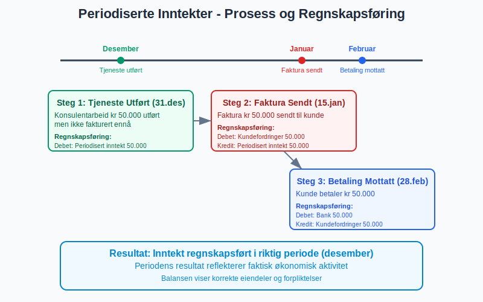

## Seksjon 3: Periodiserte Kostnader (Accrued Expenses)

### 3.1 Definisjon og Anvendelse

Periodiserte kostnader er utgifter som virksomheten har **pådratt seg** men ennå ikke har mottatt [faktura](/blogs/regnskap/hva-er-faktura "Hva er Faktura? Komplett Guide til Fakturering og Fakturakrav") eller betalt for.

### 3.2 Typiske Periodiserte Kostnader

* **[Lønn og feriepenger](/blogs/regnskap/lonnskostnad "Lønn og Lønnskostnad - Komplett Guide til Lønnsregnskapet"):** Opptjent lønn for desember utbetalt i januar
* **[Rentekostnader: Påløpte renter på lån](/blogs/kontoplan/2950-palopte-renter "Konto 2950 - Påløpte renter: Regnskapsføring av påløpte renteutgifter")**
* **Leverandørfakturaer:** Mottatte varer/tjenester uten faktura
* **Bonuser og overtidsgodtgjørelse**
* **Revisjonshonorar:** Opptjent revisjon som faktureres senere

### 3.3 Regnskapsbehandling

```
Kostnadskonto (resultatpost)      DEBET
    Periodisert kostnad (balansepost)    KREDIT
```

**Eksempel:** Påløpte rentekostnader på lån kr 15.000:

```
Debet: Rentekostnader            15.000
Kredit: Periodisert rentekostnad     15.000
```

### 3.4 Lønnsperiodisering - Spesielt Viktig

For virksomheter med månedlig lønnsutbetaling er lønnsperiodisering kritisk:

| **Scenario** | **Desember Arbeid** | **Utbetaling** | **Periodisering** |
|-------------|-------------------|---------------|------------------|
| Normal månedslønn | 20 arbeidsdager | Januar | Periodiser hele desember |
| Feriepenger | Opptjent gjennom året | Juni neste år | Periodiser årlig opptjening |
| [Pensjonskostnader](/blogs/regnskap/hva-er-pensjon "Hva er Pensjon? Komplett Guide til Norsk Pensjonssystem") | MÃ¥nedlig opptjening | Varierende | MÃ¥nedlig periodisering |

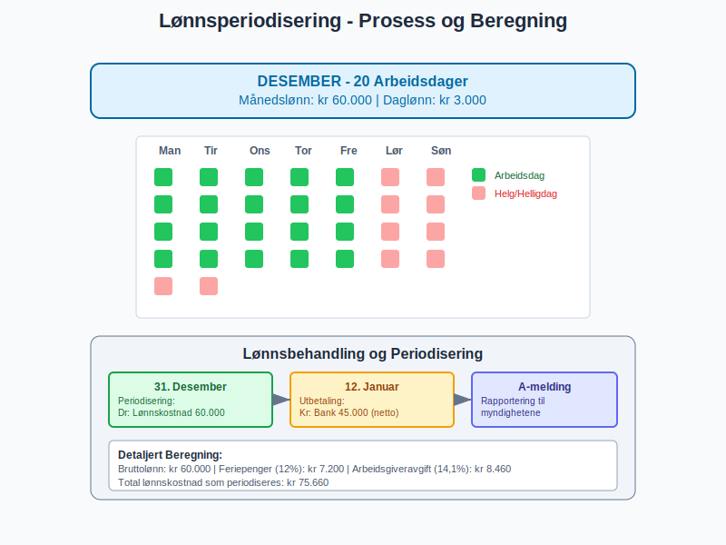

## Seksjon 4: Forhåndsbetalte Inntekter (Deferred Revenues)

### 4.1 Begrepet Forskuddsinnbetaling

Forhåndsbetalte inntekter oppstår når virksomheten **mottar betaling** før varen eller tjenesten er levert. Dette skaper en forpliktelse til å levere i fremtiden.

### 4.2 Vanlige Eksempler

* **Abonnementsinntekter:** Årlig betaling for månedlig tjeneste
* **Medlemskontingent:** Forskuddsbetaling for neste års medlemskap
* **Depositum:** Forskuddsbetaling på fremtidig levering
* **Gavekort:** Forhåndsbetaling for fremtidige kjøp
* **Forsikringspremier:** Årlig premie for månedlig dekning

### 4.3 Regnskapsbehandling ved Mottak

```
Bank/Kontanter (aktivapost)        DEBET
    Forhåndsbetalt inntekt (gjeldspost)    KREDIT
```

**Eksempel:** Mottatt kr 120.000 for 12 måneders tjeneste:

```
Debet: Bank                      120.000
Kredit: Forhåndsbetalt inntekt      120.000
```

### 4.4 Løpende Inntektsførsel

Hver måned når tjenesten leveres:

```
Forhåndsbetalt inntekt (gjeldspost)    DEBET
    Tjenesteinntekt (inntektspost)         KREDIT
```

Månedlig postering: kr 120.000 ÷ 12 = kr 10.000

```
Debet: Forhåndsbetalt inntekt    10.000
Kredit: Tjenesteinntekt             10.000
```

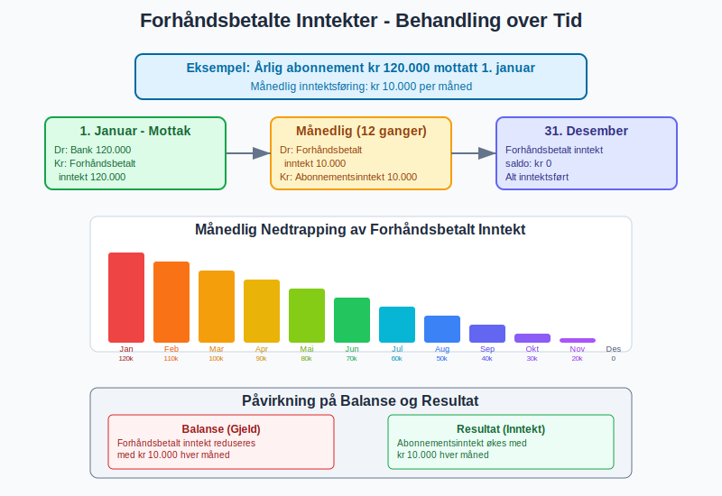

## Seksjon 5: Forhåndsbetalte Kostnader (Prepaid Expenses)

### 5.1 Konsept og Anvendelse

Forhåndsbetalte kostnader er utgifter betalt **på forhånd** for varer eller tjenester som vil konsumeres over flere perioder.

### 5.2 Typiske Forhåndsbetalte Kostnader

* **Forsikringspremier:** Årlig betaling for månedlig dekning
* **Husleie:** Betalt husleie for fremtidige måneder
* **Kontorrekvisita:** Store innkjøp brukt over tid
* **Programvarelisenser:** Årlige lisenser med månedlig forbruk
* **Markedsføringskampanjer:** Forhåndsbetaling for fremtidig annonsering

### 5.3 Regnskapsbehandling ved Betaling

```
Forhåndsbetalt kostnad (aktivapost)    DEBET
    Bank/Kontanter (aktivapost)            KREDIT
```

**Eksempel:** Betalt årlig forsikringspremie kr 60.000:

```
Debet: Forhåndsbetalt forsikring   60.000
Kredit: Bank                          60.000
```

### 5.4 Månedlig Kostnadsførsel

```
Kostnadskonto (kostnadspost)        DEBET
    Forhåndsbetalt kostnad (aktivapost)    KREDIT
```

Månedlig fordeling: kr 60.000 ÷ 12 = kr 5.000

```
Debet: Forsikringskostnad         5.000
Kredit: Forhåndsbetalt forsikring    5.000
```

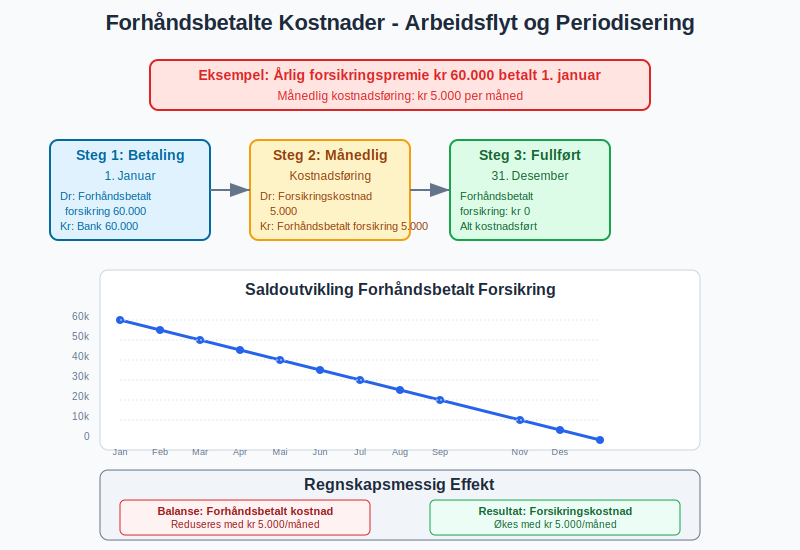

## Seksjon 6: Praktisk Implementering av Periodisering

### 6.1 MÃ¥nedlig Periodiseringsprosess

En systematisk tilnærming til periodisering:

1. **Identifikasjon:** Gjennomgå alle transaksjoner for å identifisere periodiseringsbehov
2. **Beregning:** Bestem beløp som skal periodiseres
3. **Dokumentasjon:** Lag klare beviser for alle periodiseringer
4. **Postering:** Utfør regnskapspostene i systemet
5. **Oppfølging:** Reverser eller juster i neste periode, som påvirker [utgående balanse](/blogs/regnskap/hva-er-utgaaende-balanse "Hva er Utgående Balanse (UB)? Komplett Guide til Saldooverføring")

### 6.2 Periodiseringssjekkliste

| **Område** | **Sjekkliste** |
|-----------|---------------|
| **Inntekter** | ☐ Utført arbeid ikke fakturert<br>☐ Opptjente renter<br>☐ Forskuddsbetalt fra kunder |
| **Kostnader** | ☐ Mottatte varer/tjenester uten faktura<br>☐ Påløpte lønnskostnader<br>☐ Rentebelastninger |
| **Forskudd** | ☐ Forhåndsbetalte forsikringer<br>☐ Forskuddsbetalt husleie<br>☐ Programvarelisenser |

### 6.3 Systemstøtte og Automatisering

Moderne regnskapssystemer tilbyr:

* **Automatiske periodiseringer:** Gjentakende månedlige posteringer
* **Periodiseringsmaler:** Standardiserte posteringer for vanlige situasjoner
* **Varslinger:** Påminnelser om nødvendige periodiseringer
* **Rapporter:** Oversikt over alle aktive periodiseringer

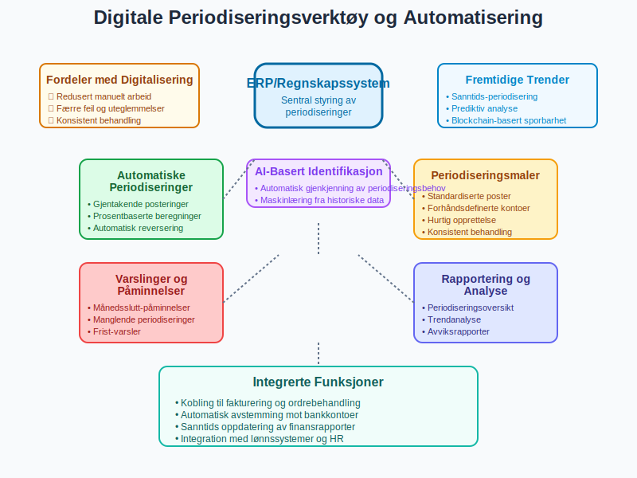

## Seksjon 7: Periodisering og [Kontantstrøm](/blogs/regnskap/hva-er-kontantstrom "Hva er Kontantstrøm? Komplett Guide til Cash Flow Analyse og Styring")

### 7.1 Forskjellen Mellom Resultat og Kontantstrøm

Periodisering skaper forskjell mellom **regnskapsmessig resultat** og **faktisk [kontantstrøm](/blogs/regnskap/hva-er-kontantstrom "Hva er Kontantstrøm? Komplett Guide til Cash Flow Analyse og Styring")**:

| **Poster** | **Påvirkning Resultat** | **Påvirkning [Kontantstrøm](/blogs/regnskap/hva-er-kontantstrom "Hva er Kontantstrøm? Komplett Guide til Cash Flow Analyse og Styring")** |
|-----------|------------------------|------------------------|
| Periodiserte inntekter | Øker resultat | Ingen endring |
| Periodiserte kostnader | Reduserer resultat | Ingen endring |
| Forhåndsbetalte inntekter | Ingen endring | Øker [kontantstrøm](/blogs/regnskap/hva-er-kontantstrom "Hva er Kontantstrøm? Komplett Guide til Cash Flow Analyse og Styring") |
| Forhåndsbetalte kostnader | Ingen endring | Reduserer [kontantstrøm](/blogs/regnskap/hva-er-kontantstrom "Hva er Kontantstrøm? Komplett Guide til Cash Flow Analyse og Styring") |

### 7.2 Betydning for [Arbeidskapital](/blogs/regnskap/hva-er-arbeidskapital "Hva er Arbeidskapital? En Komplett Guide til Working Capital")

Periodiseringer påvirker [arbeidskapitalen](/blogs/regnskap/hva-er-arbeidskapital "Hva er Arbeidskapital? En Komplett Guide til Working Capital") direkte:

* **Økning i periodiserte inntekter** = Økning i omløpsmidler
* **Økning i periodiserte kostnader** = Økning i kortsiktig gjeld
* **Forhåndsbetalte poster** = Midlertidige endringer i [arbeidskapital](/blogs/regnskap/hva-er-arbeidskapital "Hva er Arbeidskapital? En Komplett Guide til Working Capital")

### 7.3 Kontantstrømanalyse med Periodiseringer

For å forstå faktisk [likviditet](/blogs/regnskap/hva-er-betalingsevne "Hva er Betalingsevne? Analyse, Nøkkeltall og Vurdering av Likviditet"), må periodiseringer justeres ut av resultatet:

**Justert [Kontantstrøm](/blogs/regnskap/hva-er-kontantstrom "Hva er Kontantstrøm? Komplett Guide til Cash Flow Analyse og Styring") fra Drift:**
```
Nettoresultat
- Økning i periodiserte inntekter
+ Økning i periodiserte kostnader
+ Økning i forhåndsbetalte inntekter
- Økning i forhåndsbetalte kostnader
= Kontantstrøm fra driftsaktiviteter
```

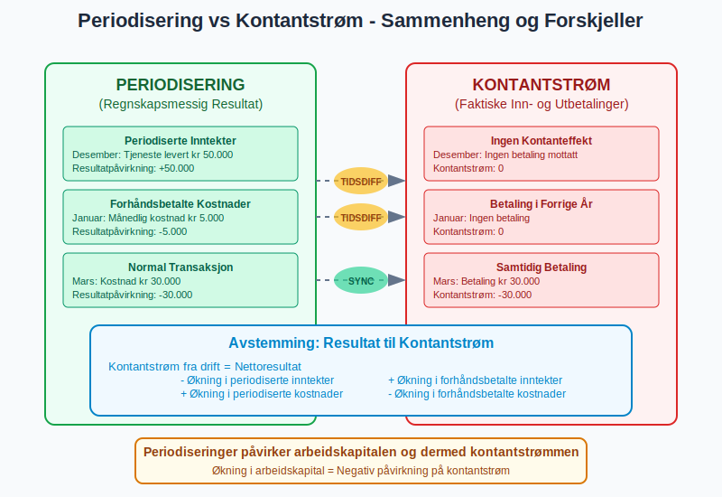

## Seksjon 8: Spesielle Periodiseringsområder

### 8.1 [Avskrivninger](/blogs/regnskap/hva-er-avskrivning "Hva er Avskrivning? Komplett Guide til Avskrivningsmetoder") som Periodisering

[Avskrivninger](/blogs/regnskap/hva-er-avskrivning "Hva er Avskrivning? Komplett Guide til Avskrivningsmetoder") er en form for periodisering av store investeringer:

* **Anskaffelseskost** fordeles over [anleggsmidlets](/blogs/regnskap/hva-er-anleggsmidler "Hva er Anleggsmidler? Komplett Guide til Faste Eiendeler") brukstid
* **MÃ¥nedlige avskrivninger** sikrer jevn kostnadsbelastning
* **Skattemessige avskrivninger** kan avvike fra regnskapsmessige

### 8.2 Renteperiodisering

Kompleks renteberegning krever nøye periodisering:

* **Daglig renteberegning** for nøyaktige tall
* **Sammensatte renter** må håndteres korrekt
* **Valutakursendringer** på utenlandske lån

### 8.3 Byggekontrakter og Langsiktige Prosjekter

For store prosjekter brukes **prosentsvis ferdigstillelse**:

* Inntekt regnskapsføres basert på ferdigstillingsgrad
* Kostnader periodiseres løpende
* Forhåndsbetalinger fra kunder håndteres særskilt

### 8.4 Pensjonskostnader

[Pensjonskostnader](/blogs/regnskap/hva-er-pensjon "Hva er Pensjon? Komplett Guide til Norsk Pensjonssystem") krever sofistikert periodisering:

* **Aktuarmessige beregninger** av fremtidige forpliktelser
* **Arbeidsgiveravgift** på pensjonskostnader
* **Tjenestepensjon vs. folketrygd** behandles forskjellig

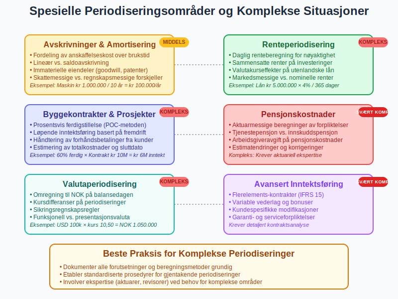

## Seksjon 9: Juridiske og Regulatoriske Aspekter

### 9.1 Bokføringsloven og Periodisering

Norsk [bokføringslov](/blogs/regnskap/hva-er-bokforingsloven "Hva er Bokføringsloven? Komplett Guide til Norsk Bokføringsregulering") krever:

* **Periodisering av alle vesentlige poster**
* **Dokumentasjon** av alle periodiseringer
* **Konsistent anvendelse** av periodiseringsprinsipper
* **Tilstrekkelig bilagsdokumentasjon**

### 9.2 Regnskapsstandarder (NGRS)

Norske regnskapsstandarder gir detaljerte retningslinjer:

* **NRS 1:** Oppstilling av regnskap - periodiseringskrav
* **NRS 15:** Anleggskontrakter - spesiell periodisering
* **NRS 8:** Goodwill og immaterielle eiendeler - amortisering

### 9.3 Revisorenes Rolle

Revisorer har spesiell fokus på periodiseringer:

* **Substansielle tester** av periodiseringsberegninger
* **Analytiske gjennomganger** av periodiseringstrender
* **Kontroll av [avstemminger](/blogs/regnskap/hva-er-avstemming "Hva er Avstemming i Regnskap? Komplett Guide til Regnskapsavstemming")** og dokumentasjon

### 9.4 Skattemessige Konsekvenser

Periodiseringer påvirker skatteberegningen:

* **Fradragstidspunkt** følger ofte regnskapsmessig periodisering
* **Forskjeller** mellom regnskaps- og skattemessig behandling
* **Utsatt skatt** på midlertidige forskjeller

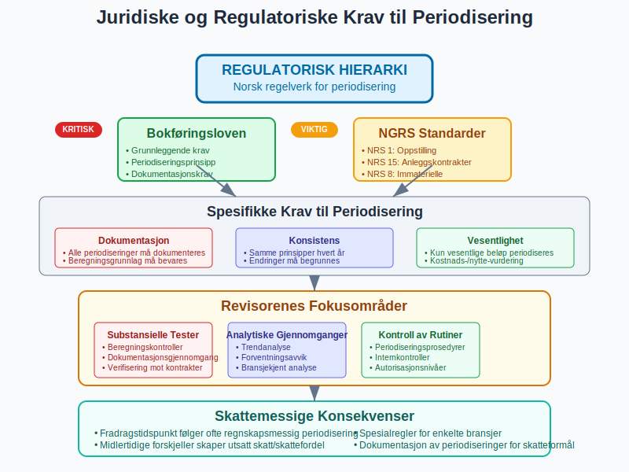

## Seksjon 10: Vanlige Feil og Utfordringer

### 10.1 Typiske Periodiseringsfeil

| **Feiltype** | **Beskrivelse** | **Konsekvens** |
|-------------|---------------|---------------|
| **Glemte periodiseringer** | Ikke identifisert periodiseringsbehov | Feil resultat og [balanse](/blogs/regnskap/hva-er-balanse "Hva er Balanse i Regnskap? Komplett Guide til Balansens Oppbygging og Funksjon") |
| **Feil beløp** | Beregningsfeil i periodisering | Unøyaktige finanstall |
| **Feil periode** | Periodisering i feil måned/år | Tidsforskjøvet resultatrapportering |
| **Manglende reversering** | Ikke reversert forrige periods periodisering | Dobbelt regnskapsføring |
| **DÃ¥rlig dokumentasjon** | Mangelfull begrunnelse | Revisjonsmerknader |

### 10.2 Kontrollrutiner for Periodisering

**MÃ¥nedlige kontroller:**
* Gjennomgang av alle periodiseringskontroer
* Sammenligning med budsjett og tidligere perioder
* Kontroll av beregningsgrunnlag og satser

**Ã…rlige kontroller:**
* Fullstendig gjennomgang av alle periodiseringer
* Vurdering av materialitet og vesentlighet
* Oppfølging av revisorenes merknader

### 10.3 Systembegrensninger og Løsninger

**Vanlige utfordringer:**
* Mangel på systemstøtte for komplekse periodiseringer
* Begrenset rapportering av periodiseringsdetaljer
* Vanskelig å spore historikk på periodiseringer

**Anbefalte løsninger:**
* Bruk av regneark som støttedokumentasjon
* Standardiserte periodiseringsmaler
* Kvartalsvis gjennomgang av alle periodiseringer

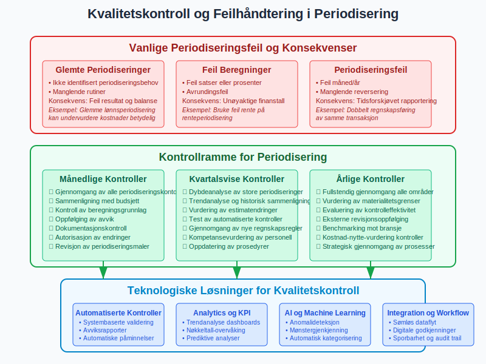

## Seksjon 11: Avanserte Periodiseringsteknikker

### 11.1 Automatiserte Periodiseringer

Moderne systemer tilbyr sofistikerte løsninger:

* **Gjentakende posteringer** for faste månedlige beløp
* **Prosent-baserte periodiseringer** for variable kostnader
* **Dato-drevne reverseringer** for midlertidige poster

### 11.2 Periodisering i Konsernregnskap

For konsern kreves koordinert periodisering:

* **Konsistente prinsipper** på tvers av selskaper
* **Elimineringseffekter** av interne periodiseringer
* **Valutaomregning** av utenlandske periodiseringer

### 11.3 Justering for Prisendringer

Ved betydelige prisendringer:

* **Indeksregulering** av langsiktige kontrakter
* **Valutakursjusteringer** på utenlandske poster
* **Renteendringer** påvirker periodiseringsberegninger

### 11.4 Framtidig Utvikling

Kommende trender innen periodisering:

* **AI-basert identifikasjon** av periodiseringsbehov
* **Sanntids-periodisering** i regnskapssystemer
* **Integrert [kontantstrøm](/blogs/regnskap/hva-er-kontantstrom "Hva er Kontantstrøm? Komplett Guide til Cash Flow Analyse og Styring")** og periodiseringsrapportering

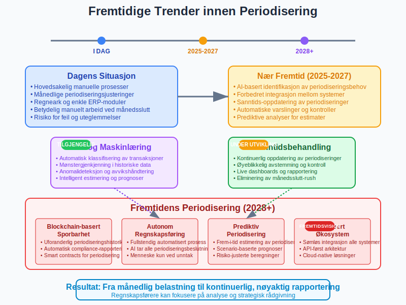

## Seksjon 12: Bransjespesifikke Periodiseringer

### 12.1 Tjenesteytende Bedrifter

Periodisering i tjenestebransjen:

* **Timebaserte tjenester:** Periodisering av ikke-fakturerte timer
* **Prosjektarbeid:** Løpende inntektsføring basert på fremdrift
* **Vedlikeholdskontrakter:** Fordeling over kontraktsperioden

### 12.2 Produksjonsbedrifter

Spesielle utfordringer i produksjon:

* **[Varelager](/blogs/regnskap/hva-er-varelager "Hva er Varelager? Komplett Guide til Lagerstyring og Verdivurdering")** og produksjon i arbeid
* **Råvarekostnader** og leverandørperiodiseringer
* **Produktgarantier** og fremtidige servicekostnader

### 12.3 Eiendomsbransjen

Periodisering av eiendomstransaksjoner:

* **Leieinntekter** og deposita
* **Vedlikeholdskostnader** spredt over året
* **Verdiendringer** på investeringseiendom

### 12.4 Finansielle Tjenester

Kompleks periodisering i finanssektoren:

* **Rentemargin** på utlån og innskudd
* **Provisjonsinntekter** fra ulike tjenester
* **Tapsavsetninger** på utlån

### 12.5 [Primærnæringer](/blogs/regnskap/primarnaring "Hva er primærnæring? Komplett Guide til Primærnæring i Regnskap") og Naturressurser

Spesielle periodiseringsutfordringer i naturressurssektoren:

* **Skogbruk:** Lange produksjonssykluser og [tømmerkonto](/blogs/regnskap/hva-er-tommerkonto "Hva er Tømmerkonto? Inntektsutjevning i Skogbruk") for inntektsutjevning
* **Landbruk:** Sesongmessige inntekter og avlingsprosesser
* **Fiskeri:** Varierende fangstresultater og markedspriser

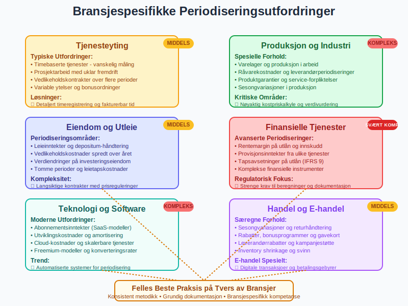

## Konklusjon

Periodisering er fundamentet for nøyaktig og pålitelig regnskapsføring som sikrer at finansielle rapporter gir et riktig bilde av virksomhetens økonomiske prestasjon og posisjon. Ved å skille mellom når økonomiske hendelser oppstår og når betalinger skjer, gir periodiseringsprinsippet en mer presis forståelse av virksomhetens faktiske lønnsomhet og finansielle helse.

Mastering av periodisering krever:

* **Systematisk tilnærming** til identifikasjon og beregning
* **Grundig dokumentasjon** av alle periodiseringsbeslutninger
* **Konsistent anvendelse** av prinsipper over tid
* **Løpende kvalitetskontroll** og oppfølging

For regnskapspersonell er periodisering ikke bare en teknisk øvelse, men et verktøy for å:

* **Forbedre beslutningsgrunnlaget** for ledelsen
* **Sikre compliance** med regelverk og standarder
* **Bygge tillit** hos investorer og kreditorer
* **Støtte strategisk planlegging** og budsjetting

Moderne teknologi gjør periodisering mer effektiv gjennom automatisering og systemstøtte, men den menneskelige vurderingen og profesjonelle skjønnet forblir essensielt for korrekt anvendelse av prinsippet.

Periodiseringer er spesielt kritiske under [årsavslutning](/blogs/regnskap/hva-er-aarsavslutning "Hva er Årsavslutning i Regnskap? Komplett Guide til Årsoppgjør og Regnskapsavslutning"), hvor alle justeringsposter må være korrekt registrert for å sikre nøyaktige årsregnskap og overholdelse av regnskapsstandarder.

Periodisering er ikke bare et regnskapsteknisk krav, men en kritisk komponent for å forstå virksomhetens økonomiske rytme og sikre at alle interessenter får et korrekt og komplett bilde av virksomhetens finansielle status og utvikling over tid.


