---
title: "Hva er Personalkostnad?"
seoTitle: "Hva er Personalkostnad?"
meta_description: '**Personalkostnad** omfatter alle kostnader en bedrift har knyttet til sine ansatte. Dette inkluderer ikke bare grunnlønn, men også feriepenger, [arbeidsgiver...'
slug: hva-er-personalkostnad
type: blog
layout: pages/single
---

**Personalkostnad** omfatter alle kostnader en bedrift har knyttet til sine ansatte. Dette inkluderer ikke bare grunnlønn, men også feriepenger, [arbeidsgiveravgift](/blogs/regnskap/hva-er-arbeidsgiveravgift "Hva er Arbeidsgiveravgift? Satser, Beregning og Regnskapsføring") som del av [trygdeavgiften](/blogs/regnskap/hva-er-trygdeavgift "Hva er Trygdeavgift? Komplett Guide til Beregning og Regnskapsføring"), [pensjonskostnader](/blogs/regnskap/hva-er-pensjon "Hva er Pensjon? Komplett Guide til Norsk Pensjonssystem"), forsikringer og andre ytelser. Personalkostnad representerer ofte den største kostnadsposten for mange bedrifter og påvirker direkte [lønnsomheten](/blogs/regnskap/hva-er-lonnsomhet "Hva er Lønnsomhet? Nøkkeltall og Analyse for Bedrifter") og [kontantstrømmen](/blogs/regnskap/hva-er-kontantstrom "Hva er Kontantstrøm? Betydning og Analyse i Regnskap").

I tillegg til disse kostnadene inngår egne poster under **sosiale kostnader**. Les mer i [Sosiale kostnader](/blogs/regnskap/sosiale-kostnader "Sosiale kostnader “ Definisjon, Eksempler og Regnskapsføring i Norge").

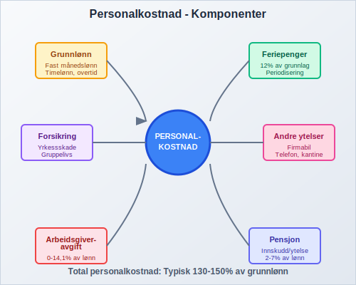

## Komponenter i Personalkostnad

Personalkostnad består av flere ulike elementer som sammen utgjør den totale kostnaden ved å ha ansatte:

### 1. Lønnkostnader

**Grunnlønn** er den faste måneds- eller timelønn som utbetales til den ansatte. Dette danner grunnlaget for beregning av andre personalkostnader:

* **Fast månedslønn:** For heltidsansatte og ansatte i faste stillinger
* **Timelønn:** For deltidsansatte og vikarer
* **[Akkordlønn](/blogs/regnskap/hva-er-akkordlonn "Hva er Akkordlønn? Beregning og Regnskapsføring av Prestasjonsbetaling"):** Prestasjonsbasert lønn
* **[Provisjon](/blogs/regnskap/hva-er-provisjon "Hva er Provisjon? Komplett Guide til Provisjon i Regnskap og Lønn"):** Salgsbasert lønn
* **Overtidslønn:** Tillegg for arbeid utover normalarbeidstime

### 2. Feriepenger og Feriedager

**Feriepenger** beregnes som 12% av grunnlaget for ansatte og må [periodiseres](/blogs/regnskap/hva-er-periodisering "Hva er Periodisering? Prinsipp og Praktisk Anvendelse i Regnskap") korrekt:

* **Opptjeningsår:** Feriepenger opptjenes i ett år
* **Utbetalingsår:** Utbetales påfølgende år
* **Avsetning:** Må føres som [kortsiktig gjeld](/blogs/regnskap/hva-er-kortsiktig-gjeld "Hva er Kortsiktig Gjeld? Definisjon og Regnskapsføring") i balansen

### 3. Arbeidsgiveravgift

[Arbeidsgiveravgift](/blogs/regnskap/hva-er-arbeidsgiveravgift "Hva er Arbeidsgiveravgift? Satser, Beregning og Regnskapsføring") beregnes av lønn og andre ytelser og varierer med bedriftens geografiske lokalisering:

* **Sone I:** 14,1% (Oslo og omegn)
* **Sone II:** 10,6% (andre byer)
* **Sone III:** 6,4% (distrikter)
* **Sone IV og V:** 5,1% og 0% (Nord-Norge og Finnmark)

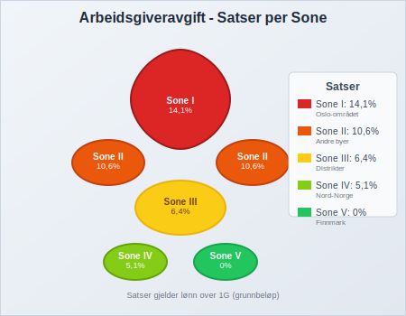

### 4. Pensjonskostnader

**Pensjonskostnader** er lovpålagte kostnader som varierer avhengig av [tjenestepensjon](/blogs/regnskap/hva-er-tjenestepensjon "Hva er Tjenestepensjon? Komplett Guide til Bedriftspensjon og Regnskapsføring"):

* **Innskuddspensjon:** 2-7% av lønn mellom 1G og 12G
* **Ytelsespensjon:** Kostnad basert på aktuarberegninger
* **AFP-ordninger:** Tilleggspensjon for enkelte sektorer

### 5. Forsikringer og Trygder

Arbeidsgivere må dekke ulike forsikringskostnader:

* **Yrkesskadeforsikring:** Lovpålagt for alle ansatte
* **Gruppelivsforsikring:** Ofte inkludert i kollektivavtaler
* **Behandlingsforsikring:** Tilleggsforsikring for helsetjenester
* **Reiseforsikring:** For ansatte på tjenestereiser

### 6. Andre Personalytelser

**Naturalytelser** og andre fordeler som inngår i personalkostnaden:

* **Firmabil:** Verdi av fri bil til privat bruk
* **Telefon:** Fri mobiltelefon eller tilskudd
* **Internett:** Hjemmekontor tilrettelegging
* **Kantineordninger:** Subsidierte måltider
* **Opplæring:** Kurs og kompetanseutvikling
* **[Utlegg](/blogs/regnskap/hva-er-utlegg "Hva er Utlegg? Komplett Guide til Utleggsregnskap og Refusjon"):** Refusjon av utgifter ansatte legger ut på vegne av bedriften

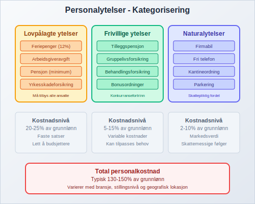

## Regnskapsføring av Personalkostnad

Korrekt regnskapsføring av personalkostnad følger [regnskapsprinsipper](/blogs/regnskap/hva-er-regnskapsprinsipper "Hva er Regnskapsprinsipper? Grunnleggende Prinsipper for Regnskap") og krever systematisk behandling:

### Månedlig Lønnskjøring

Ved hver lønnskjøring skal følgende poster bokføres:

| Beskrivelse | Debet | Kredit |
|-------------|-------|--------|
| Lønn | X |        |
| Feriepenger (opptjent) | X |        |
| Pensjonskostnad | X |        |
| Arbeidsgiveravgift | X |        |
| Skyldig lønn |   | X      |
| Skyldig feriepengeravsetning |   | X      |
| Skyldig pensjonspremie |   | X      |
| Skyldig arbeidsgiveravgift |   | X      |
| Skyldig skatt/folketrygd |   | X      |

### Periodisering og Avsetninger

**Periodisering** er kritisk for korrekt kostnadsføring:

* **Opptjent ikke utbetalt lønn:** Ved månedslutt
* **Feriepengeravsetning:** Løpende opptjening
* **Bonusavsetninger:** Estimerte bonusutbetalinger
* **Overtidskompensasjon:** Avvikende arbeidsperioder

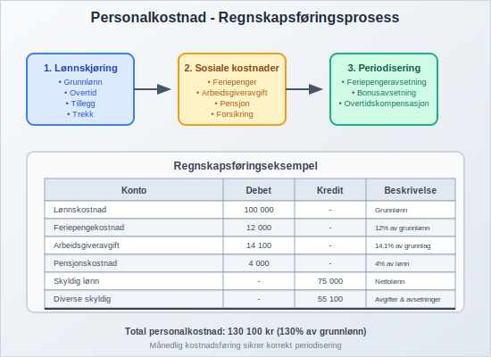

### Skatterapportering

Personalkostnad må rapporteres korrekt til skattemyndighetene:

* **[A-melding](/blogs/regnskap/hva-er-a-melding "Hva er A-melding? Rapportering til Skatteetaten og NAV"):** Månedlig rapportering av lønn og trekk
* **Årsoppgave:** Årlig sammendrag av utbetalinger
* **Kontroll:** Avstemming mot skattetrekk og avgifter

## Personalkostnad i Ulike Bransjer

Personalkostnadenes andel av totale kostnader varierer betydelig mellom bransjer:

### Tjenesteytende Sektorer

* **Konsulentbransjen:** 70-80% av omsetningen
* **IT-tjenester:** 60-75% av omsetningen  
* **Rådgivning:** 65-80% av omsetningen

### Handels- og Servicebedrifter

* **Detaljhandel:** 15-25% av omsetningen
* **Restaurantbransjen:** 25-35% av omsetningen
* **Hotellbransjen:** 30-40% av omsetningen

### Industri og Produksjon

* **Tradisjonell industri:** 20-30% av omsetningen
* **Høyteknologi:** 40-60% av omsetningen
* **Bygg og anlegg:** 35-50% av omsetningen

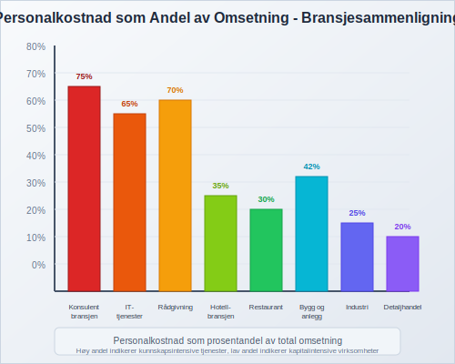

## Analyse og Styring av Personalkostnad

Effektiv styring av personalkostnad krever kontinuerlig oppfølging og analyse:

### Nøkkeltall for Personalkostnad

**Produktivitetsmål:**
* **Omsetning per ansatt:** Måler effektivitet
* **Resultat per ansatt:** Profitabilitet per arbeider
* **Personalkostnad som andel av omsetning:** Kostnadseffektivitet

**Kvalitetsmål:**
* **Turnover rate:** Andel ansatte som slutter
* **Sykefravær:** Prosentvis fravær grunnet sykdom
* **Overtidsandel:** Andel overtid av total arbeidstid

### Benchmarking og Sammenligning

* **Bransjesammenligning:** Sammenligne med konkurrenter
* **Historisk utvikling:** Analyse av kostnadsutvikling
* **Regionale forskjeller:** Lønns- og kostnadsnivå per region

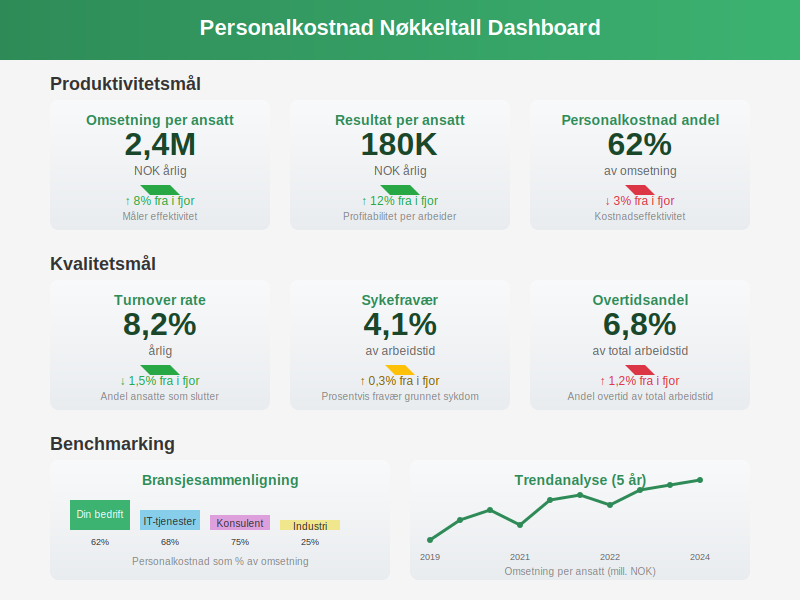

### Budsjett og Prognose

**Personalkostnadsbudsjett** må inkludere:

* **Lønnsøkning:** Forventet lønnsvekst
* **Nye ansettelser:** Planlagte utvidelser
* **Turnover:** Forventet utskifting av personale
* **Overtidskostnader:** Sesongvariasjoner og prosjekter

## Optimalisering av Personalkostnad

Bedrifter kan optimalisere personalkostnader gjennom ulike tiltak:

### Teknologi og Automatisering

* **Digital lønnssystem:** Redusere administrative kostnader
* **Selvbetjeningsportaler:** La ansatte håndtere egne data
* **Automatiserte prosesser:** Redusere manuelt arbeid

### Organisatoriske Tiltak

* **Fleksible arbeidsordninger:** Redusere kontorkostnader
* **Kompetanseutvikling:** Øke produktivitet
* **Performance management:** Målrettet belønning

### Outsourcing og Alternative Løsninger

* **[Konsulenter](/blogs/regnskap/hva-er-konsulenthonorar "Hva er Konsulenthonorar? Regnskapsføring og Skattemessig Behandling"):** For spesialistoppgaver, inkludert **[tungt salær](/blogs/regnskap/hva-er-tungt-salaer "Hva er Tungt Salær? Guide til Betydelige Honorarer og Vederlag")** for særlig komplekse eller omfattende konsulentoppdrag
* **Innleie:** Fleksibilitet i kapasitet
* **Automatisering:** Erstatte rutinearbeid

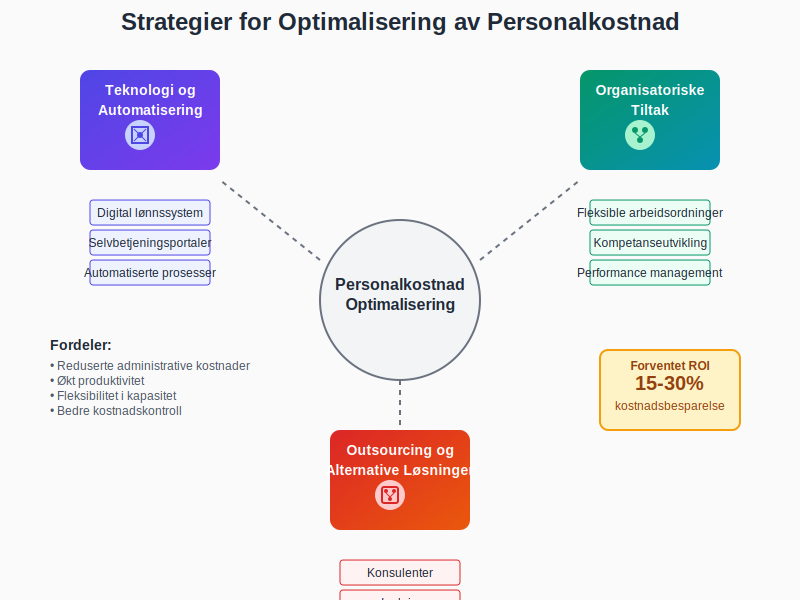

## Juridiske Aspekter ved Personalkostnad

Personalkostnad er regulert av omfattende lovverk:

### Arbeidsmiljøloven

* **Arbeidstidens lengde:** Maksimal arbeidsuke
* **Overtidskompensasjon:** Regler for overtidsbetaling
* **Pauseregler:** Hvileperioder og pauser

### Ferieloven

* **Feriedager:** Rett til ferie og feriepenger
* **Opptjeningsregler:** Når rettigheter oppstår
* **Utbetalingsregler:** Tidspunkt for utbetaling

### Skatteloven

* **Trekkplikt:** Arbeidsgivers ansvar for skattetrekk
* **Naturalytelser:** Skattlegging av fordeler
* **Rapportering:** Krav til dokumentasjon

## Personalkostnad og Merverdifferansebestemmelse

Når [mva](/blogs/regnskap/hva-er-mva "Hva er Mva? Merverdiavgift - Regler, Satser og Regnskapsføring") skal beregnes, påvirker personalydeser behandlingen:

### Fradragsføre Personalkostnader

* **Ikke fradragsberettiget [inngående mva](/blogs/regnskap/inngaaende-mva "Inngående mva: Fradragsføres i regnskapet")**: På personalrelaterte tjenester
* **Blandet bruk:** Ved personlig og bedriftsmessig bruk
* **Dokumentasjon:** Krav til bilagføring

### Mva på Naturalytelser

* **Firmabil:** Mva-behandling av privatbruk
* **Andre ytelser:** Telefon, internett og liknende
* **Verdsetting:** Prinsipper for verdsetting av ytelser

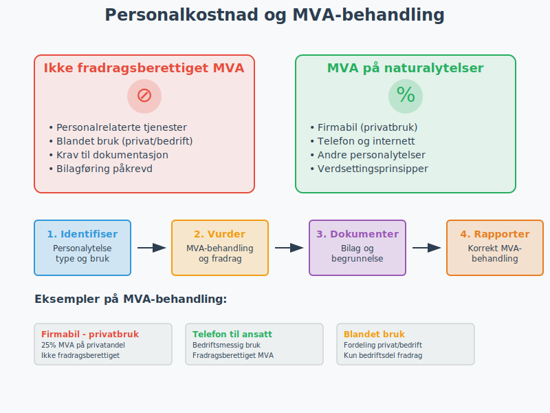

## Internkontroll for Personalkostnad

Solid [internkontroll](/blogs/regnskap/hva-er-internkontroll "Hva er Internkontroll? Systemer og Prosedyrer for Bedre Risikostyring") er kritisk for personalkostnadsområdet:

### Autorisasjon og Godkjenning

* **Ansettelseskontrakter:** Godkjenning av lønnsvilkår
* **Lønnsendringer:** Dokumentert godkjenning
* **Overtid:** Forhåndsgodkjenning av ekstraarbeid

### Kontrollrutiner

* **Månedlig avstemming:** Lønnssystem mot hovedbok
* **Feriepengeravsetning:** Beregning og kontroll
* **Personelliste:** Oppdatering ved ansettelser/oppsigelser

### Risikoområder

* **Fiktive ansatte:** Risiko for svindel
* **Feil satser:** Arbeidsgiveravgift og pensjon
* **Periodiseringsfeil:** Manglende avsetninger

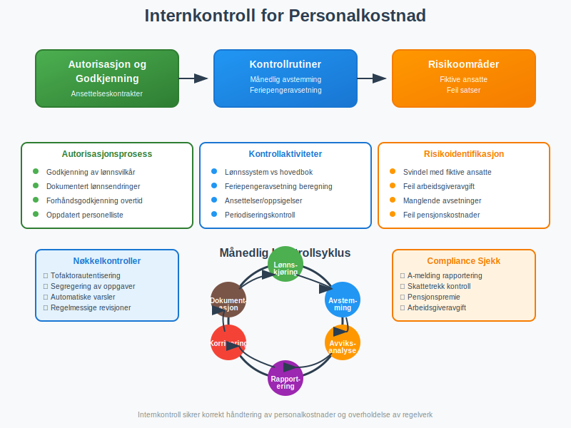

## Rapportering og Analyse av Personalkostnad

Effektiv rapportering gir ledelsen beslutningsgrunnlag:

### Månedlige Rapporter

* **Lønnskostnadsrapport:** Detaljert kostnadssammensetning
* **Avviksanalyse:** Sammenligning med budsjett
* **Prognoseoppdate:** Reviderte årsestimater

### Kvartalsvise Analyser

* **Produktivitetsanalyse:** Omsetning per ansatt
* **Kostnadseffektivitet:** Benchmarking mot mål
* **Trendanalyse:** Utvikling over tid

### Årsrapportering

* **Personalkostnad i [årsregnskap](/blogs/regnskap/hva-er-arsregnskap "Hva er Årsregnskap? Oppbygning, Innhold og Formelle Krav"):** Note om personalkostnader
* **Nøkkeltallsanalyse:** Sammenligning med tidligere år
* **Prognose:** Forventet utvikling neste år

## Personalkostnad og Korona-Pandemien

COVID-19 pandemien påvirket personalkostnader betydelig:

### Statlige Støtteordninger

* **Kompensasjonsordning:** Dekning av lønnskostnader ved nedstenging
* **Permitteringsordninger:** Reduserte kostnader ved permittering
* **Lærlingtilskudd:** Støtte til lærlinger

### Endrete Kostnadsstrukturer

* **Hjemmekontor:** Reduserte kontorkostnader, økte IT-kostnader
* **Digitalisering:** Investering i teknologi og opplæring
* **Helse og sikkerhet:** Økte kostnader til smittevern

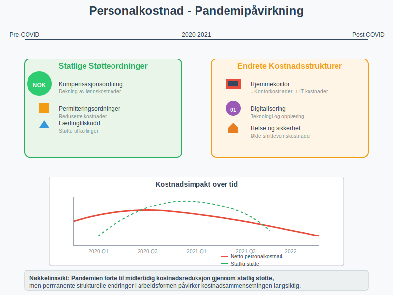

## Fremtidens Personalkostnad

Flere trender vil påvirke fremtidens personalkostnader:

### Teknologisk Utvikling

* **Kunstig intelligens:** Automatisering av HR-prosesser
* **Digital HR:** Selvbetjeningsløsninger for ansatte
* **Dataanalyse:** Prediktiv analyse av personalkostnader

### Arbeidsliv i Endring

* **Fleksibelt arbeid:** Hybride arbeidsmodeller
* **Kompetanseskiftet:** Økt behov for digital kompetanse
* **Generasjonsskiftet:** Ulike forventninger til arbeidsvilkår

### Regulatoriske Endringer

* **EU-direktiver:** Nye regler for arbeidsrettigheter
* **Skatteendringer:** Potensielle endringer i arbeidsgiveroppgaver
* **Miljøhensyn:** Grønne arbeidsplasser og bærekraft

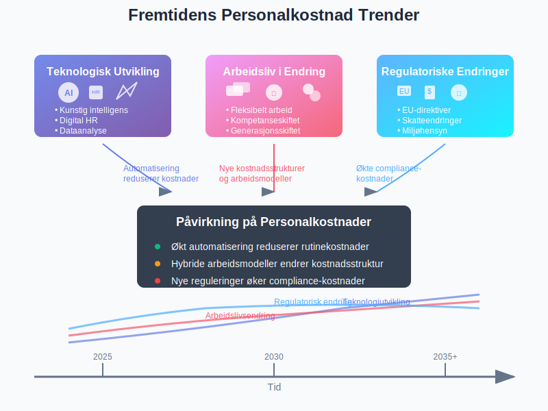

## Praktiske Tips for Personalkostnadsstyring

For bedrifter som ønsker å optimalisere personalkostnadstyringen:

### Systemvalg

* **Integrerte løsninger:** Lønn, HR og økonomi i samme system
* **Skybaserte tjenester:** Reduserte IT-kostnader
* **Mobile løsninger:** Fleksibilitet for ansatte og ledere

### Organisering

* **Tydelige rutiner:** Dokumenterte prosesser for lønnskjøring
* **Rolleavklaring:** Klar ansvarsfordeling
* **Kontinuerlig opplæring:** Oppdatert kompetanse på regelverk

### Oppfølging

* **Regelmessig analyse:** Månedlig gjennomgang av tall
* **Benchmarking:** Sammenligning med bransje og konkurrenter
* **Prognoseoppdateringer:** Løpende revideringer av budsjett

Personalkostnad er et komplekst område som krever både regnskapsmessig, juridisk og strategisk kompetanse. Ved å etablere gode rutiner for regnskapsføring, kontroll og analyse kan bedrifter både sikre compliance og optimalisere kostnadsnivået for økt lønnsomhet.

