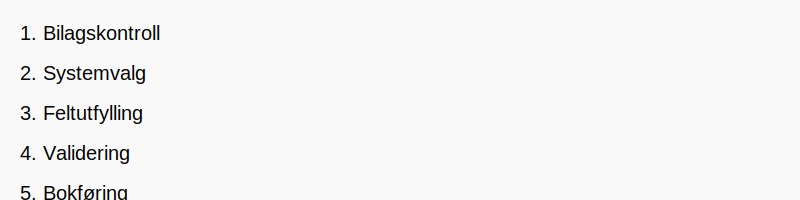

---
title: "Hva er postering?"
seoTitle: "Hva er postering?"
description: '**Postering** er handlingen med å registrere **konterte transaksjoner** i regnskapssystemets [hovedbok](/blogs/regnskap/hva-er-hovedbok "Hva er Hovedbok? En Gu...'
---

**Postering** er handlingen med å registrere **konterte transaksjoner** i regnskapssystemets [hovedbok](/blogs/regnskap/hva-er-hovedbok "Hva er Hovedbok? En Guide til Regnskapets Sentrale Register") og tilhørende underbøker etter at transaksjonsdata er kodet gjennom [kontering](/blogs/regnskap/hva-er-kontering "Hva er Kontering? En Komplett Guide til Kontokoding i Regnskap"). Postering sikrer at alle økonomiske hendelser dokumenteres i bokføringen i samsvar med [bokføringsloven](/blogs/regnskap/hva-er-bokforingsloven "Hva er Bokføringsloven? Regler og Krav til Norsk Bokføring") og gir et nøyaktig grunnlag for finansrapportering.


## Hva Betyr Postering?

*Definisjon:* **Postering** er det praktiske steget hvor konterte bilag føres inn i regnskapssystemet med riktig beløp, dato og referanser.

## Posteringsprosessen Steg for Steg



1. **Bilagskontroll:** Verifiser at bilaget er fullstendig og korrekt kontert.
2. **Systemvalg:** Velg korrekt regnskapssystem eller modul for postering.
3. **Feltutfylling:** Angi bilagsreferanse, dato, beløp, konto(er), og eventuell MVA-behandling.
4. **Validering:** Sørg for at debet og kredit balanserer og at dataene er konsistente.
5. **Bokføring:** Fullfør posteringen slik at posten låses og blir del av den permanente regnskapsloggen (revisjonsspor).

## Typer Posteringer

| Type postering          | Beskrivelse                                                                                       |
|--------------------------|---------------------------------------------------------------------------------------------------|
| **Manuell postering**    | Registrering av transaksjoner direkte i systemet via skjermbilde eller maske.                      |
| **Automatisk postering** | Systemgenererte føringer basert på forhåndsdefinerte regler eller integrasjoner (f.eks. bankimport). |
| **Korrigeringspostering**| Justering av tidligere posteringer for å rette feil eller foreta periodisering.                     |

## Praktiske Eksempler

```text
# Eksempel 1: Innkjøp av varer, 12 500 kr inkl. MVA
Debet: 1460 Innkjøp av varer for videresalg          10 000 kr
Debet: 2700 Inngående MVA (25 %)                     2 500 kr
Kredit: 2400 Leverandørgjeld                        12 500 kr
```

```text
# Eksempel 2: Salg på kreditt, 15 000 kr ekskl. MVA
Debet: 1500 Kundefordringer                         18 750 kr
Kredit: 3000 Salgsinntekt                           15 000 kr
Kredit: 2700 Utgående MVA (25 %)                    3 750 kr
```

## Vanlige Feil ved Postering

| Feiltype               | Beskrivelse                                           | Konsekvens       |
|------------------------|-------------------------------------------------------|------------------|
| **Feil konto**         | Postering på feil kontonummer                         | Feil rapporter   |
| **Ubalansert føring**  | Debet og kredit stemmer ikke                          | Avstemmingsavvik |
| **Feil beløp**         | Manuelt inntastingsfeil                               | Økonomisk avvik  |
| **Manglende referanse**| Utilstrekkelig beskrivelse eller bilagsnummer          | Dårlig sporbarhet|

## Digitale Verktøy for Postering

* **Regnskapssystemer med bankintegrasjon:** Automatiske forslag til postering av banktransaksjoner.
* **OCR-basert fakturahåndtering:** Leser inn faktura og foreslår postering.
* **Malkonteringsregler:** Standardiserte maler for hyppige transaksjoner.
* **API-integrasjoner:** Kobling mot ERP og fakturaportal for sanntidsføring.

## Postering og Internkontroll

Korrekt postering er grunnlaget for en solid internkontroll og tydelig revisjonsspor:

**Nøkkelkomponenter i internkontroll:**

* *Arbeidsdeling* mellom den som konterer og den som godkjenner.
* *Autorisasjonskontroller* for hvem som kan poste hvilke typer transaksjoner.
* *Revisjonsspor* som dokumenterer alle endringer og godkjenninger.

## Postering i Ulike Bransjer

Postering kan variere avhengig av bransje- og virksomhetstype:

* **Handelsbedrifter:** Fokus på varelagerstyring og kundefordringer.
* **Tjenesteytende næring:** Detaljert time- og kostnadsføring.
* **Produksjonsbedrifter:** Periodiske lager- og produksjonskostposteringer.
* **Offentlig sektor:** Strenge krav til dokumentasjon og budsjettskontroll.


