---
title: "Hva er Produksjonslønn i Regnskap?"
seoTitle: "Hva er Produksjonslønn i Regnskap?"
description: "Produksjonslønn knytter lønn til produksjonsmengde eller verdi. Artikkelen forklarer stykkelønn, akkord, provisjon, regnskapsføring, periodisering, beregningseksempler, fordeler, ulemper og juridiske rammer."
summary: "Hva er produksjonslønn? Typer, regnskapsføring, periodisering og praktiske eksempler for norske virksomheter."
---

**Produksjonslønn** er en lønnsform som kobler ansattes lønn direkte til **produksjonsmengde** eller **produksjonsverdi**. I motsetning til [fastlønn](/blogs/regnskap/hva-er-fastlonn "Hva er Fastlønn i Regnskap?"), varierer produksjonslønn med hvor mye den ansatte produserer, noe som skaper et direkte insentiv for økt produktivitet. Denne lønnsformen er vanlig i produksjonsbedrifter, håndverksfag og servicetjenester hvor det er mulig å måle individuell eller gruppebasert produksjon.

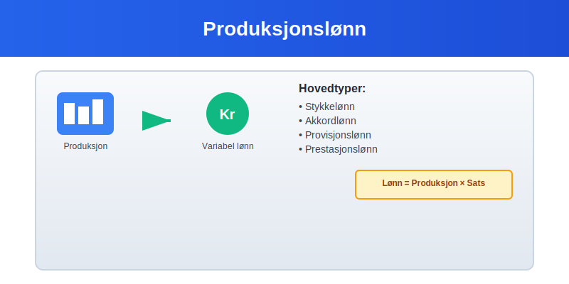

## Typer Produksjonslønn

### Stykkelønn
Stykkelønn er den mest direkte formen for produksjonslønn, hvor ansatte får betalt per produserte enhet:

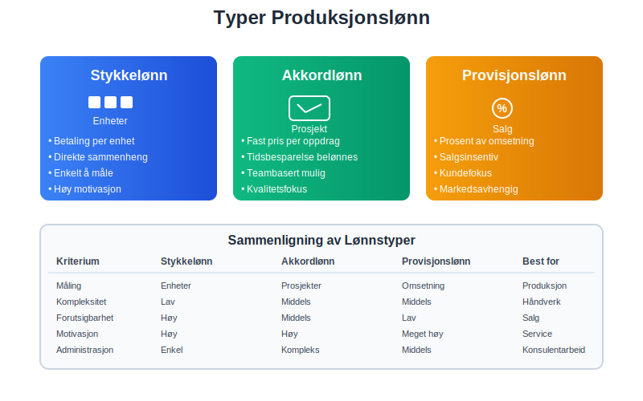

* **Ren stykkelønn** - kun betaling per produserte enhet
* **Kombinert stykkelønn** - fastlønn pluss stykkelønn-tillegg
* **Garantert stykkelønn** - minimum garantilønn uavhengig av produksjon
* **Progressiv stykkelønn** - økende betaling per stykke ved høyere volum

### Akkordlønn
[Akkordlønn](/blogs/regnskap/hva-er-akkordlonn "Hva er Akkordlønn? Komplett Guide til Akkord og Produksjonslønn") er en form for produksjonslønn basert på avtalt pris for et bestemt arbeidsoppdrag:

* **Tidsakkord** - basert på normaltid for oppgaven
* **Prestasjonsakkord** - inkluderer bonuskomponent ved rask gjennomføring
* **Gruppeakkord** - delt blant teammedlemmer

### Provisjonslønn
I servicebransjer brukes ofte provisjonslønn som form for produksjonslønn:

* **Ren provisjon** - kun basert på salg eller omsetning
* **Provisjon pluss fastlønn** - kombinert modell
* **Trappeprovisjoner** - økende prosentsats ved høyere volum

## Regnskapsmessig Behandling

### Klassifisering i Regnskapet

Produksjonslønn klassifiseres som **[lønnskostnader](/blogs/regnskap/lonnskostnad "Hva er Lønnskostnad? Komplett Guide til Lønnskostnader i Regnskap")** og behandles forskjellig avhengig av type:

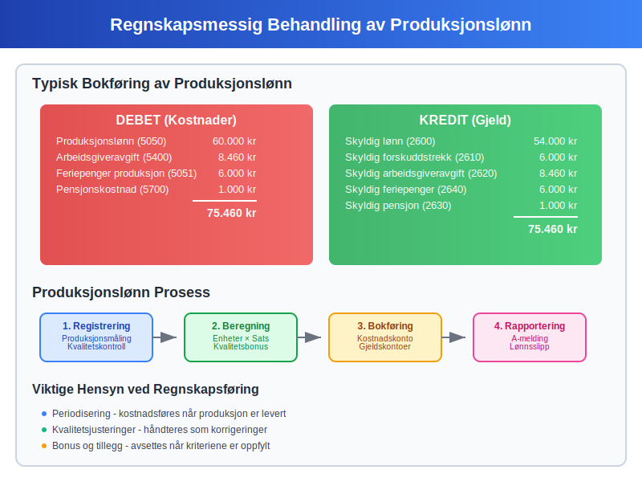

| Lønnstype | Kontoklasse | Behandling | Periodisering |
|-----------|-------------|------------|---------------|
| **Direkte produksjonslønn** | 5000-5099 | Direkte kostnad | Månedlig |
| **Indirekte produksjonslønn** | 5100-5199 | Overheadkostnad | Månedlig |
| **Provisjonslønn** | 5200-5299 | Salgskostnad | Når opptjent |
| **Akkordlønn** | 5000-5099 | Prosjektkostnad | Etter fremdrift |

### Bokføring av Produksjonslønn

Månedlig bokføring av produksjonslønn følger samme prinsipper som for [lønnskostnader](/blogs/regnskap/lonnskostnad "Hva er Lønnskostnad? Komplett Guide til Lønnskostnader i Regnskap"):

```
Debet: Produksjonslønn (5050)               60.000 kr
Debet: Arbeidsgiveravgift (5400)             8.460 kr
Debet: Feriepenger produksjon (5051)         6.000 kr
    Kredit: Skyldig lønn (2600)                     54.000 kr
    Kredit: Skyldig forskuddstrekk (2610)           6.000 kr
    Kredit: Skyldig arbeidsgiveravgift (2620)       8.460 kr
    Kredit: Skyldig feriepenger (2640)              6.000 kr
```

### Periodisering og Avsetninger

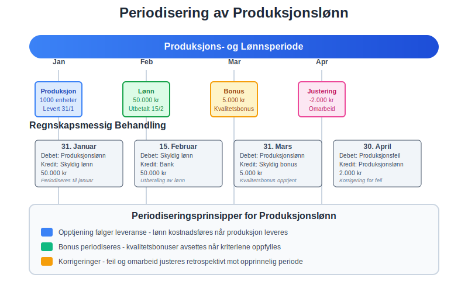

Produksjonslønn krever spesiell oppmerksomhet ved [periodisering](/blogs/regnskap/hva-er-periodisering "Hva er Periodisering i Regnskap? Komplett Guide til Periodiseringsprinsippet"):

* **Opptjent produksjonslønn** - avsettes når produksjon er levert
* **Ubetalte bonuser** - periodiseres månedlig
* **Sesongvariasjoner** - jevnes ut over året
* **Kvalitetsjusteringer** - justeres retrospektivt

## Beregning og Måling

### Produksjonsmåling

For å beregne produksjonslønn må produksjonen måles nøyaktig:

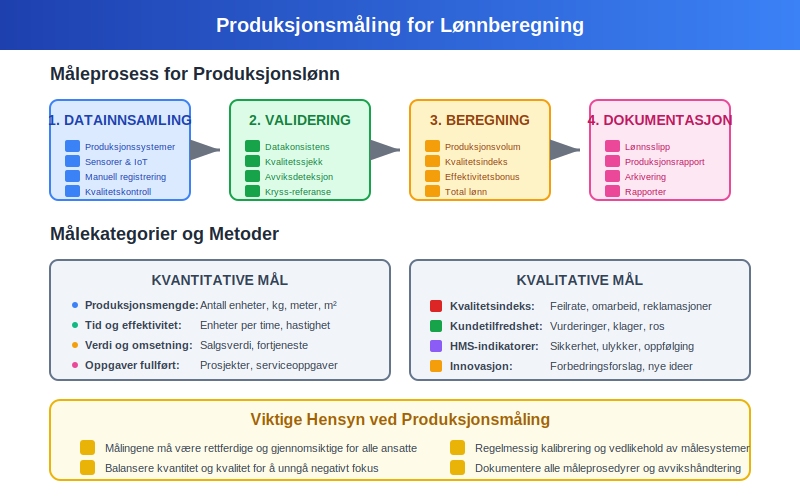

**Kvantitative mål:**
* **Antall enheter** produsert per time/dag/måned
* **Vekt** eller **volum** av produksjon
* **Kompletterte oppgaver** eller prosjekter
* **Salgsinntekter** generert (for provisjonslønn)

**Kvalitative mål:**
* **Kvalitetsindeks** - feilrate og omarbeid
* **Kundetilfredshet** - service og leveringskvalitet
* **Effektivitet** - ressursbruk og sløsing
* **Sikkerhet** - HMS-indikatorer

### Beregningseksempel

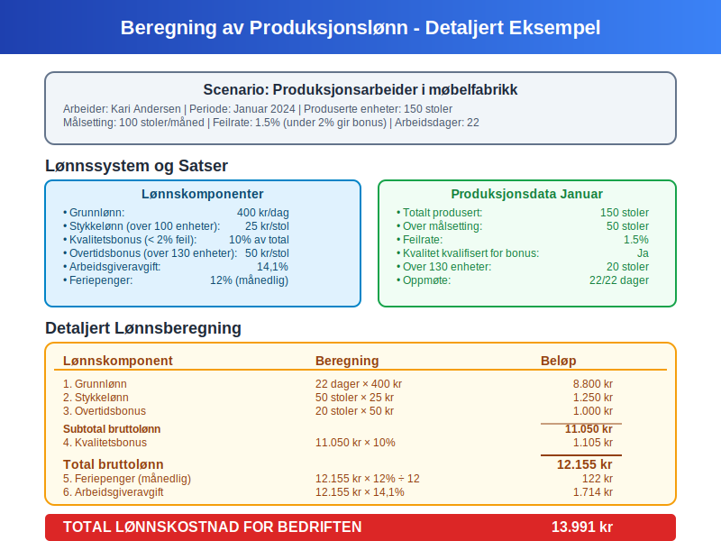

**Eksempel: Stykkelønn i produksjonsbedrift**

En arbeider produserer 150 enheter per dag med følgende satser:
- Grunnlønn: 200 kr per dag
- Stykkelønn: 5 kr per enhet over 100 enheter
- Kvalitetsbonus: 10% ved under 2% feilrate

| Beregningskomponent | Utregning | Beløp |
|---------------------|-----------|-------|
| **Grunnlønn** | Fast dagslønn | 200 kr |
| **Stykkelønn** | (150-100) × 5 kr | 250 kr |
| **Kvalitetsbonus** | 450 kr × 10% | 45 kr |
| **Total daglønn** | | **495 kr** |

## Fordeler og Ulemper

### Fordeler for Bedriften

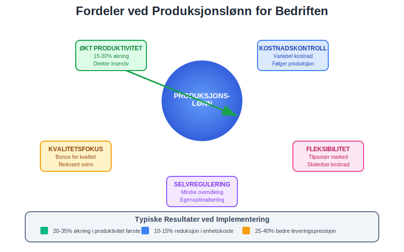

* **Økt produktivitet** - direkte insentiv for høyere produksjon
* **Kostnadskontroll** - lønn følger produksjonsvolum
* **Selvregulering** - ansatte motiveres til å optimalisere arbeid
* **Kvalitetsfokus** - belønning for feilfri produksjon
* **Fleksibilitet** - kostnader tilpasses markedssvingninger

### Fordeler for Ansatte

* **Høyere inntektspotensial** - belønning for høy innsats
* **Kontroll over egen lønn** - påvirke inntekt gjennom arbeidsinnsats
* **Anerkjennelse** - direkte verdsetting av prestasjoner
* **Karriereutvikling** - synliggjøring av ferdigheter

### Utfordringer og Ulemper

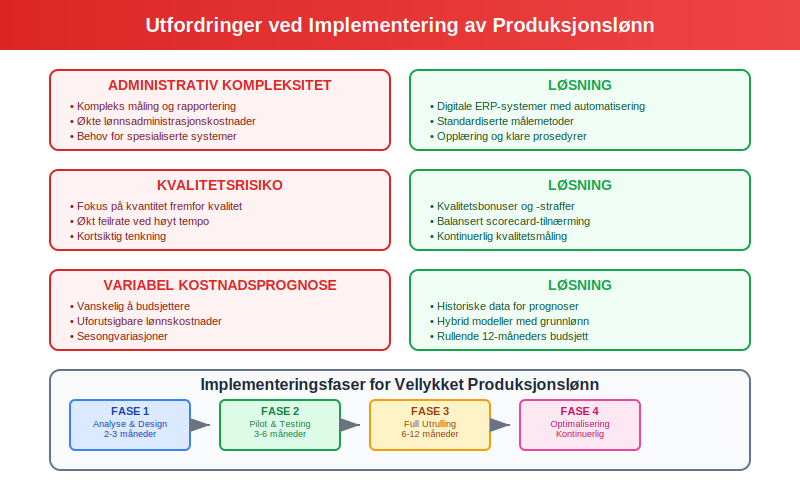

**For bedriften:**
* **Administrativ kompleksitet** - måling og rapportering
* **Kvalitetsrisiko** - fokus på kvantitet fremfor kvalitet
* **Variabel kostnadsprognose** - vanskelig å budsjettere
* **Motivasjonsutfordringer** - kan skape intern konkurranse

**For ansatte:**
* **Inntektusikkerhet** - variabel månedslønn
* **Arbeidspress** - konstant fokus på produksjon
* **Begrenset samarbeid** - individuelt fokus kan hemme teamarbeid
* **Slitasjerisiko** - risiko for overbelastning

## Juridiske Rammer

### Tariffavtaler og Lovgivning

Produksjonslønn må følge **arbeidsmiljøloven** og relevante [tariffavtaler](/blogs/regnskap/tariff "Tariff i Norsk Regnskap"):

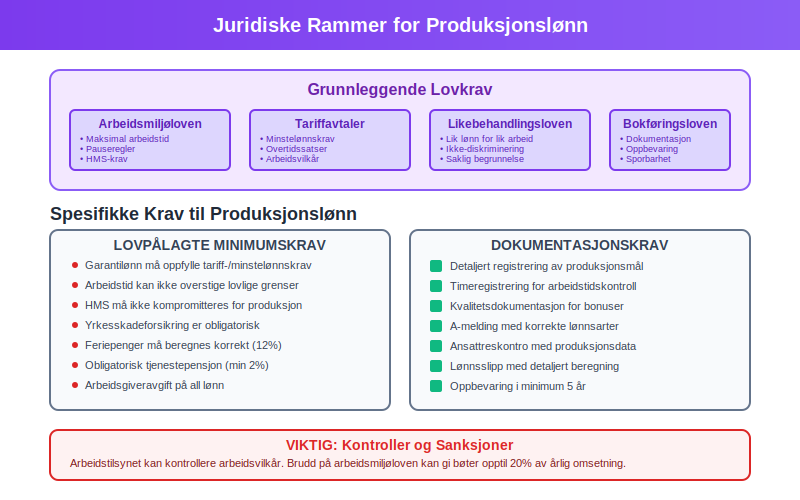

* **Minstelønnskrav** - garantilønn må oppfylle minimumskrav
* **Arbeidstidsregulering** - maksimal daglig og ukentlig arbeidstid
* **Pauseregler** - rett til hvile og fridager
* **HMS-krav** - sikkerhet må ikke kompromitteres for produksjon
* **Likebehandling** - lik lønn for lik arbeid

### Rapportering og Dokumentasjon

Produksjonslønn må dokumenteres i **[A-meldingen](/blogs/regnskap/hva-er-a-melding "Hva er A-melding? En Komplett Guide til Rapportering")** og **[ansattreskontro](/blogs/regnskap/hva-er-ansattreskontro "Hva er Ansattreskontro? En Guide til Ansattkontoer i Regnskap")**:

* **Detaljert registrering** av produksjonsmål og oppnådde resultater
* **Timeregistrering** for å sikre lovlig arbeidstid
* **Kvalitetsdokumentasjon** for bonusutbetalinger
* **Tariffbestemmelser** og avtalevilkår

## Implementering og Best Practices

### Planlegging og Design

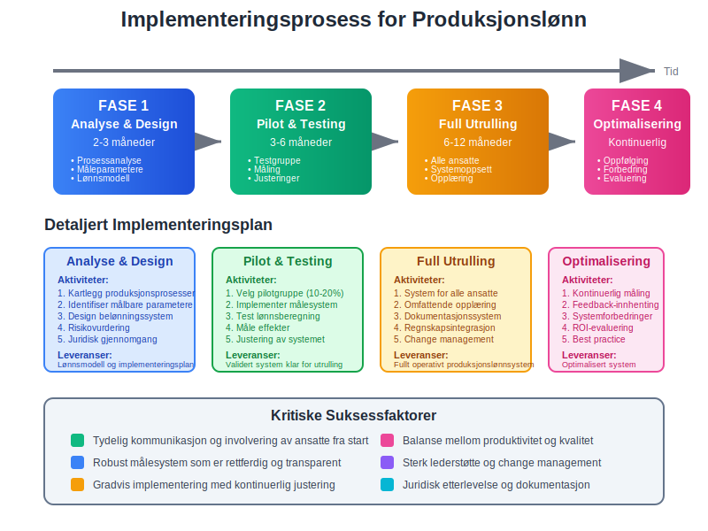

**Fase 1: Analyse og design**
* **Kartlegging** av produksjonsprosesser
* **Identifisering** av målbare parametere
* **Utvikling** av belønningssystem
* **Risikovurdering** av implementering

**Fase 2: Testing og tilpasning**
* **Pilotprosjekt** med utvalgte ansatte
* **Måling** av effekter på produktivitet og kvalitet
* **Justering** av satser og måleparametere
* **Opplæring** av ansatte og ledere

**Fase 3: Full implementering**
* **Utrulling** til alle relevante stillinger
* **Oppfølging** og kontinuerlig forbedring
* **Rapportering** og evaluering
* **Vedlikehold** av system og prosesser

### Digitale Verktøy og Systemer

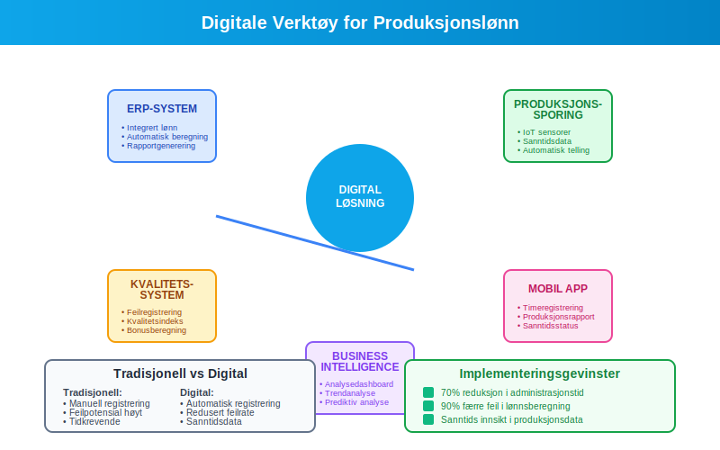

Moderne bedrifter bruker digitale systemer for å håndtere produksjonslønn:

* **ERP-systemer** - integrert håndtering av produksjon og lønn
* **Tidsregistrering** - automatisk registrering av arbeidstid og produksjon
* **Kvalitetssystemer** - måling av feilrater og kundeklager
* **Business Intelligence** - analyse av produktivitet og kostnader
* **Mobile apper** - sanntidsrapportering fra produksjonsgulvet

## Bransjespesifikke Anvendelser

### Produksjonsindustri

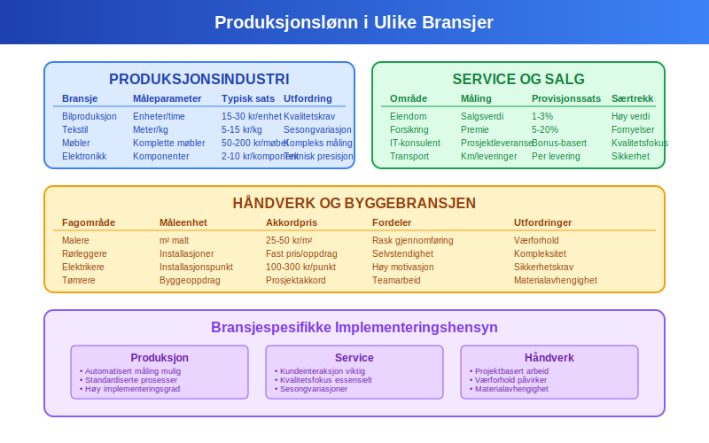

| Bransje | Vanlige måleparametere | Typiske satser | Utfordringer |
|---------|------------------------|----------------|--------------|
| **Bilproduksjon** | Enheter per time | 15-30 kr/enhet | Kvalitetskrav |
| **Tekstilproduksjon** | Meter/kg produsert | 5-15 kr/kg | Sesongvariasjoner |
| **Møbelproduksjon** | Komplette møbler | 50-200 kr/møbel | Kompleks måling |
| **Elektronikk** | Komponenter montert | 2-10 kr/komponent | Teknisk presisjon |

### Service og Salg

* **Eiendomsmegling** - provisjon av salgsverdi (1-3%)
* **Forsikringssalg** - provisjon av premie (5-20%)
* **IT-konsulentvirksomhet** - bonus ved prosjektleveranser
* **Transport** - betaling per kjørte kilometer eller leveringer

### Håndverk og Byggebransjen

* **Malere** - betaling per kvadratmeter malt
* **Rørleggere** - akkordarbeid på installasjoner
* **Elektrikere** - fast pris per installasjonspunkt
* **Tømrere** - akkord på byggeoppdrag

## Fremtidige Trender

### Teknologisk Utvikling

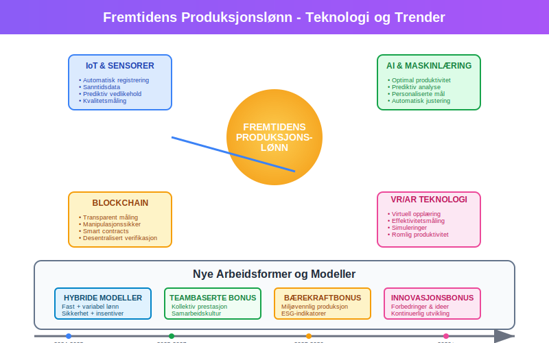

* **IoT og sensorer** - automatisk registrering av produksjon
* **AI-basert optimalisering** - prediktiv analyse av produktivitet
* **Blockchain** - transparent og manipulasjonssikker måling
* **Virtuell virkelighet** - opplæring og kompetanseutvikling

### Nye Arbeidsformer

* **Hybride modeller** - kombinasjon av fast og variabel lønn
* **Teambaserte bonuser** - fokus på kollektiv prestasjon
* **Bærekraftsbonus** - belønning for miljøvennlig produksjon
* **Innovasjonsbonus** - betaling for forbedringer og ideer

## Kostnadsanalyse og Lønnsomhet

### Sammenligning med Fastlønn

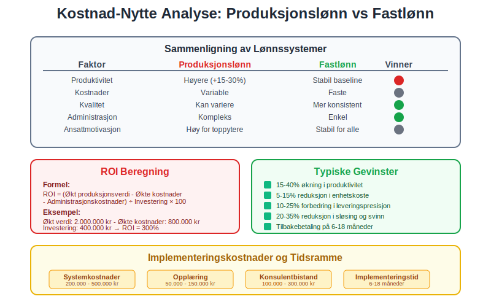

**Produksjonslønn vs [fastlønn](/blogs/regnskap/hva-er-fastlonn "Hva er Fastlønn i Regnskap?"):**

| Faktor | Produksjonslønn | Fastlønn |
|--------|----------------|----------|
| **Produktivitet** | Høyere (+15-30%) | Stabil baseline |
| **Kostnader** | Variable | Faste |
| **Kvalitet** | Kan variere | Mer konsistent |
| **Administrasjon** | Kompleks | Enkel |
| **Ansattmotivasjon** | Høy for toppytere | Stabil for alle |

### ROI-beregning

For å vurdere lønnsomheten av produksjonslønn:

```
ROI = (Økt produksjonsverdi - Økte lønnskostnader - Administrasjonskostnader) 
      ÷ Investering i system og opplæring × 100
```

**Typiske gevinster:**
* **15-40%** økning i produktivitet
* **5-15%** reduksjon i enhetskoste
* **10-25%** forbedring i leveringspresisjon
* **20-35%** reduksjon i sløsing og svinn

## Konklusjon

Produksjonslønn er et kraftfullt verktøy for å øke produktivitet og koble ansattes innsats direkte til bedriftens resultater. For å lykkes med implementering må bedrifter:

* **Planlegge grundig** - analysere prosesser og definere målbare parametere
* **Involvere ansatte** - sikre forståelse og støtte for systemet
* **Implementere gradvis** - teste og justere før full utrulling
* **Følge opp kontinuerlig** - måle effekter og justere ved behov
* **Overholde juridiske krav** - sikre etterlevelse av lover og avtaler

Ved riktig implementering kan produksjonslønn bidra til økt **lønnsomhet**, **konkurranseevne** og **ansattmotivasjon**, samtidig som det gir bedre kostnadskontroll og fleksibilitet i produksjonen.

## Relaterte Artikler

* [Hva er Akkordlønn?](/blogs/regnskap/hva-er-akkordlonn "Hva er Akkordlønn? Komplett Guide til Akkord og Produksjonslønn")
* [Hva er Fastlønn i Regnskap?](/blogs/regnskap/hva-er-fastlonn "Hva er Fastlønn i Regnskap?")
* [Hva er Lønnskostnad?](/blogs/regnskap/lonnskostnad "Hva er Lønnskostnad? Komplett Guide til Lønnskostnader i Regnskap")
* [Hva er Arbeidsgiveravgift?](/blogs/regnskap/hva-er-arbeidsgiveravgift "Hva er Arbeidsgiveravgift? Satser og Beregning")
* [Hva er A-melding?](/blogs/regnskap/hva-er-a-melding "Hva er A-melding? En Komplett Guide til Rapportering")
* [Hva er Ansattreskontro?](/blogs/regnskap/hva-er-ansattreskontro "Hva er Ansattreskontro? En Guide til Ansattkontoer i Regnskap")


