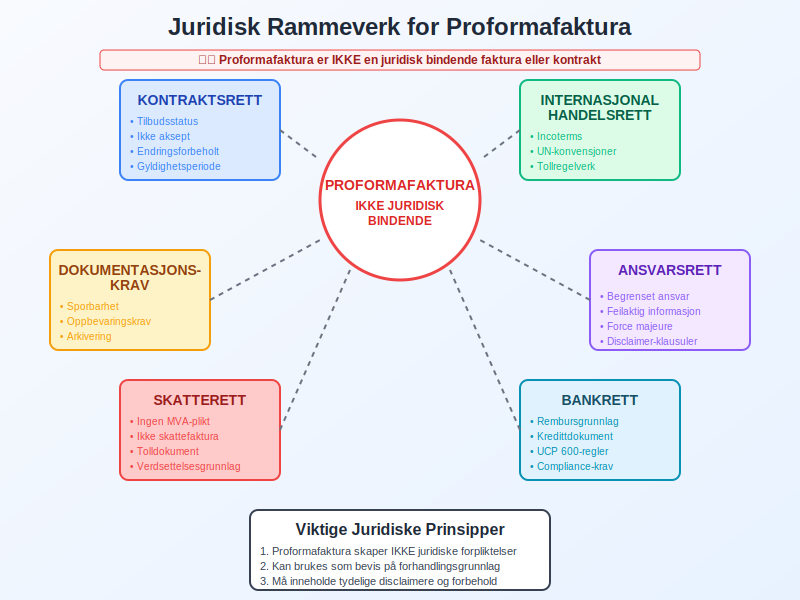

En **proformafaktura** er et foreløpig regnskapsdokument som utstedes før levering av varer eller tjenester, og fungerer som et estimat eller tilbud på fremtidige transaksjoner. Proformafakturaer brukes hovedsakelig i [internasjonal handel](/blogs/regnskap/hva-er-internasjonal-handel "Hva er Internasjonal Handel? Guide til Eksport og Import") for å gi [tollmyndigheter](/blogs/regnskap/hva-er-toll "Hva er Toll? Regnskapsføring og Praktisk Veiledning") og kjøpere informasjon om planlagte leveranser før den faktiske handelen finner sted.

## Hva er en Proformafaktura?

En **proformafaktura** er et dokument som ligner en vanlig [faktura](/blogs/regnskap/hva-er-faktura "Hva er en Faktura? En Guide til Norske Fakturakrav"), men som ikke representerer en faktisk salgsavtale eller krav om betaling. I stedet fungerer den som:

* **Informasjonsdokument:** Gir detaljert informasjon om varer, priser og leveringsbetingelser
* **Planleggingsverktøy:** Hjelper kjøpere med [budsjettplanlegging](/blogs/regnskap/hva-er-budsjett "Hva er Budsjett? Planlegging og Oppfølging av Bedriftens Økonomi") og [kontantstrømstyring](/blogs/regnskap/hva-er-kontantstromstyring "Hva er Kontantstrømstyring? Teknikker for Optimal Likviditet")
* **Tolldokument:** Brukes av tollmyndigheter for å vurdere avgifter og behandle importlisenser
* **Kredittvurdering:** Gir banker og finansinstitusjoner grunnlag for å vurdere [remburs](/blogs/regnskap/hva-er-remburs "Hva er Remburs? Sikker Betalingsmetode i Internasjonal Handel") og andre finansieringsløsninger

### Forskjell fra Vanlig Faktura

| Aspekt | Proformafaktura | Vanlig Faktura |
|--------|-----------------|----------------|
| **Juridisk status** | Ikke bindende | Juridisk dokument |
| **Betalingskrav** | Nei | Ja |
| **Regnskapsføring** | Ingen bokføring | [Bokføres](/blogs/regnskap/hva-er-bokforing "Hva er Bokføring? Grunnleggende Prinsipper og Praksis") som salg |
| **MVA-behandling** | Ingen MVA | [Merverdiavgift](/blogs/regnskap/hva-er-mva "Hva er MVA? Merverdiavgift i Norge") påløper |
| **Formål** | Informasjon og planlegging | Fakturering og oppgjør |

## Når Brukes Proformafakturaer?

Proformafakturaer har flere viktige anvendelsesområder i moderne forretningsdrift:

### 1. Internasjonal Handel

I [eksport](/blogs/regnskap/hva-er-eksport "Hva er Eksport? Regnskapsføring og Praktisk Veiledning") og [import](/blogs/regnskap/hva-er-import "Hva er Import? Toll, MVA og Regnskapsbehandling") brukes proformafakturaer til:

* **Tolldeklarasjon:** Grunnlag for beregning av toll og avgifter
* **Importlisenser:** Søknad om nødvendige tillatelser
* **Valutakontroll:** Dokumentasjon overfor myndighetene
* **Forsikring:** Grunnlag for transportforsikring

### 2. Tilbudsgivning

* **Detaljerte pristilbud:** Spesifiserer nøyaktig hva som leveres som del av [tilbudsprosessen](/blogs/regnskap/hva-er-tilbud "Hva er Tilbud? Komplett Guide til Tilbudsprosess og Regnskapsmessig Behandling")
* **Langsiktige avtaler:** Grunnlag for forhandlinger om rammeavtaler
* **Komplekse prosjekter:** Oversikt over kostnader og leveranser

### 3. Finansiering og Kreditt

* **Rembursopprettelse:** Grunnlag for å etablere [remburs](/blogs/regnskap/hva-er-remburs "Hva er Remburs? Sikker Betalingsmetode i Internasjonal Handel")
* **Bankgarantier:** Dokumentasjon for garantiutstedelse
* **Kredittforsikring:** Vurdering av handelsrisiko
* **Finansieringsløsninger:** Grunnlag for [eksportfinansiering](/blogs/regnskap/hva-er-eksportfinansiering "Hva er Eksportfinansiering? Finansielle Løsninger for Eksportører")

## Innhold i en Proformafaktura

En profesjonell proformafaktura bør inneholde følgende informasjoner:

### Grunnleggende Informasjon

* **Selgeropplysninger:** Firmanavn, adresse, [organisasjonsnummer](/blogs/regnskap/hva-er-organisasjonsnummer "Hva er Organisasjonsnummer? Betydning og Bruk i Regnskap")
* **Kjøperopplysninger:** Kundens navn og adresse
* **Dokumentnummer:** Unik referanse for sporing
* **Utstedelsesdato:** Når proformafakturaen ble laget
* **Gyldighetsdato:** Hvor lenge tilbudet er gyldig

### Vareopplysninger

* **Detaljert varebeskrivelse:** Spesifikasjoner, kvalitet, standard
* **HS-koder:** Harmonized System-koder for tollformål
* **Mengde og enhet:** Antall, vekt, volum
* **Enhetspris og totalpris:** I relevant valuta
* **Opprinnelsesland:** Hvor varene produseres eller kommer fra

### Leveringsinformasjon

* **Leveringsbetingelser:** [Incoterms](/blogs/regnskap/hva-er-incoterms "Hva er Incoterms? Internasjonale Leveringsbetingelser") (FOB, CIF, DDP, etc.)
* **Leveringssted:** Destinasjon for leveransen
* **Leveringstid:** Estimert leveringsdato
* **Pakking og merking:** Spesifikasjoner for emballasje
* **Transportmåte:** Skip, fly, lastebil, tog

### Betalingsinformasjon

* **Betalingsbetingelser:** Betalingsmåte og frister
* **Valuta:** Hvilken valuta som brukes
* **Bankopplysninger:** For internasjonale overføringer
* **Forsikring:** Dekning av transport og varer

## Regnskapsbehandling av Proformafakturaer

### For Selgeren

Proformafakturaer har **ingen direkte regnskapseffekt** siden de ikke representerer faktiske salg:

* **Ingen [omsetning](/blogs/regnskap/hva-er-omsetning "Hva er Omsetning? Beregning og Regnskapsføring"):** Ikke bokført som salg
* **Ingen MVA:** Merverdiavgift påløper ikke
* **Ingen [kundefordring](/blogs/regnskap/hva-er-kundefordringer "Hva er Kundefordringer? Styring og Regnskapsføring"):** Skaper ikke fordring på kunden

### Oppfølging og Konvertering

Når proformafakturaen konverteres til en faktisk salgsordre:

| Aktivitet | Regnskapseffekt |
|-----------|-----------------|
| **Ordrebekreftelse** | Ingen bokføring |
| **Leveranse** | [Salg bokføres](/blogs/regnskap/hva-er-salgsbokforing "Hva er Salgsbokføring? Prinsipper og Praktisk Gjennomføring") |
| **Fakturering** | Kundefordring opprettes |
| **Betaling** | [Innbetaling](/blogs/regnskap/hva-er-innbetaling "Hva er Innbetaling? Registrering og Oppfølging") registreres |

### For Kjøperen

Proformafakturaer kan brukes til:

* **Budsjettplanlegging:** Estimere fremtidige [innkjøpskostnader](/blogs/regnskap/hva-er-innkjopskostnader "Hva er Innkjøpskostnader? Beregning og Regnskapsføring")
* **Kassaflytplanlegging:** Planlegge [betalingsforpliktelser](/blogs/regnskap/hva-er-betalingsforpliktelser "Hva er Betalingsforpliktelser? Styring av Leverandørgjeld")
* **Tollforberedelser:** Grunnlag for importberegninger
* **Kredittsøknader:** Dokumentasjon av planlagte kjøp

## Digitalisering av Proformafakturaer

Moderne teknologi har transformert håndteringen av proformafakturaer:

### Elektroniske Løsninger

* **Automatisk generering:** Fra tilbudssystemer til proformafaktura
* **Integrasjon:** Kobling med [ERP-systemer](/blogs/regnskap/hva-er-erp "Hva er ERP? Enterprise Resource Planning for Bedrifter")
* **Sporbarhet:** Digital sporing av dokumenter
* **Godkjenningsrutiner:** Elektroniske arbeidsflyter

### Fordeler med Digital Håndtering

* **Reduserte kostnader:** Mindre papirarbeid og porto
* **Raskere behandling:** Øyeblikkelig utsendelse og mottak
* **Bedre nøyaktighet:** Automatisert datautfylling
* **Miljøvennlig:** Redusert papirforbruk
* **Enklere arkivering:** Digital oppbevaring og søk

### API-integrasjoner

Moderne bedrifter bruker [API-integrasjoner](/blogs/regnskap/hva-er-api-integrasjon "Hva er API-integrasjon? Automatisering av Regnskapsprosesser") for:

* **Automatisk datauthenting:** Fra produktkataloger og prislister
* **Valutaoppdateringer:** Sanntids valutakurser
* **Kundedata:** Automatisk utfylling av kundedetaljer
* **Leveringsberegninger:** Dynamiske fraktkostnader

## Juridiske Aspekter

### Kontraktsmessig Status

**Proformafakturaer er ikke juridisk bindende** med mindre eksplisitt angitt:

* **Tilbudsstatus:** Betraktes som tilbud, ikke aksept
* **Endringsforbeholt:** Priser og betingelser kan endres
* **Gyldighetsperiode:** Tidsbegrenset tilbud
* **Ansvarsbegrensning:** Normalt ingen erstatningsansvar

### Juridisk Dokumentasjon

Ved tvister eller misforståelser kan proformafakturaer brukes som:

* **Intensjonsdokument:** Bevis på forhandlingsgrunnlag
* **Kommunikasjon:** Dokumenter utveksling av informasjon
* **Referansedokument:** Grunnlag for senere avtaler
* **Kvalitetsspesifikasjon:** Detaljert beskrivelse av produkter

## Internkontroll og Rutiner

### Godkjenningsprosess

Etabler klare rutiner for utstedelse av proformafakturaer:

* **Autorisasjon:** Hvem kan utstede proformafakturaer
* **Innholdskontroll:** Sjekkliste for nødvendig informasjon
* **Prisgodkjenning:** Kontroll av priser og rabatter
* **Gyldighetskontroll:** Vurdering av tilbudsperiode

### Oppfølgingsrutiner

* **Statussporing:** Følge opp kunderespons
* **Konverteringsovervåking:** Måle hvor mange som blir faktiske ordrer
* **Revisjoner:** Oppdatere priser og betingelser ved behov
* **Arkivering:** Systematisk oppbevaring av dokumenter

### Kvalitetssikring

* **Standardmaler:** Bruk forhåndsdefinerte maler
* **Datavalidering:** Automatisk kontroll av tall og beregninger
* **Språkkontroll:** Sikre korrekt terminologi og oversettelser
* **Lovlighetssjekk:** Kontrollere at informasjonen er korrekt

## Internasjonale Standarder og Praksis

### WTO og Handelsfasilitering

**Verdens Handelsorganisasjon (WTO)** anbefaler standardisering av proformafakturaer for å:

* **Redusere handelshindringer:** Enklere grensepassering
* **Øke transparens:** Tydelige og enhetlige dokumenter
* **Fremme digitalisering:** Elektronisk dokumentutveksling
* **Støtte utviklingsland:** Kapasitetsbygging innen handelsdokumentasjon

### UNCITRAL-standarder

**FNs Kommisjon for Internasjonal Handelsrett** har utviklet retningslinjer for:

* **Elektronisk handel:** Digitale signaturer og autentisering
* **Dokumentstandarder:** Enhetlige krav til innhold
* **Tverrgrensing:** Harmonisering av nasjonale regelverk
* **Konfliktløsning:** Mekanismer for handelsconflictes

## Bransjespesifikke Anvendelser

### Produksjonsbedrifter

I [produksjonsbedrifter](/blogs/regnskap/hva-er-produksjonsbedrift "Hva er Produksjonsbedrift? Kalkulasjon og Regnskapsføring") brukes proformafakturaer til:

* **Tilpassede produkter:** Spesifikasjoner for skreddersydde løsninger
* **Lange produksjonstider:** Prisgaranti over produksjonsperioden
* **Komplekse komponenter:** Detaljerte tekniske beskrivelser
* **Kvalitetsstandarder:** Spesifikasjoner for testing og sertifisering

### Servicebedrifter

For [servicebedrifter](/blogs/regnskap/hva-er-servicebedrift "Hva er Servicebedrift? Kostnadsberegning og Prissetting") inkluderer proformafakturaer:

* **Arbeidstimer:** Estimerte timer for prosjektgjennomføring
* **Ressursbruk:** Materiale og utstyr som kreves
* **Milepæler:** Delleveranser og betalingsplan
* **Endringshåndtering:** Prosedyrer for scope-endringer

### Handelsbedrifter

I [handel](/blogs/regnskap/hva-er-handelsbedrift "Hva er Handelsbedrift? Varestrøm og Marginstyring") fokuserer proformafakturaer på:

* **Leveringskapasitet:** Tilgjengelighet og lagerstatus
* **Sesongvariasjoner:** Priser og tilgjengelighet over tid
* **Volumrabatter:** Pristrapper basert på kvantum
* **Markedsvolatilitet:** Prisgarantier og justeringsmekanismer

## Fremtidige Trender

### Blockchain og Smart Contracts

Nye teknologier vil påvirke proformafakturaer:

* **Blockchain-dokumentasjon:** Uforanderlig sporing av dokumenter
* **Smart contracts:** Automatisk konvertering til bindende avtaler
* **IoT-integrasjon:** Sanntidsdata fra produkter og leveranser
* **AI-optimalisering:** Intelligent prisberegning og risikovurdering

### Bærekraft og ESG

Økende fokus på **miljø, samfunn og styring (ESG)** påvirker:

* **Karbonfotavtrykk:** Inkludering av miljødata i dokumenter
* **Leverandørkjeden:** Transparens om produksjonsbetingelser
* **Sosiale standarder:** Dokumentasjon av arbeidsforhold
* **Sirkulær økonomi:** Informasjon om gjenbruk og resirkulering

## Beste Praksis for Proformafakturaer

### Design og Layout

* **Tydelig merking:** Marker dokumentet som "PROFORMA INVOICE"
* **Profesjonelt utseende:** Konsistent branding og layout
* **Strukturert informasjon:** Logisk oppbygging av data
* **Flere språk:** Oversettelser for internasjonale kunder

### Risikohåndtering

* **Disclaimere:** Tydelige forbehold om endringer
* **Gyldighetsperioder:** Klare tidsfrister for tilbud
* **Prisvolatilitet:** Mekanismer for prisjusteringer
* **Force majeure:** Klausuler om uforutsette hendelser

### Kundeopplevelse

* **Rask respons:** Kort tid fra forespørsel til proformafaktura
* **Personalisering:** Tilpasset kundens behov og marked
* **Oppfølging:** Proaktiv kommunikasjon om status
* **Rådgivning:** Hjelp med tollprosedyrer og finansiering

En godt utformet proformafaktura er et kraftfullt verktøy for å bygge tillit, legge til rette for internasjonal handel og sikre smidig behandling av komplekse transaksjoner. Ved å følge beste praksis og holde seg oppdatert på teknologiske utviklinger kan bedrifter maksimere verdien av dette viktige handelsdokumentet.

