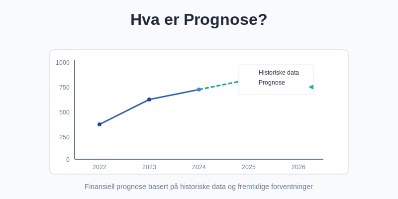
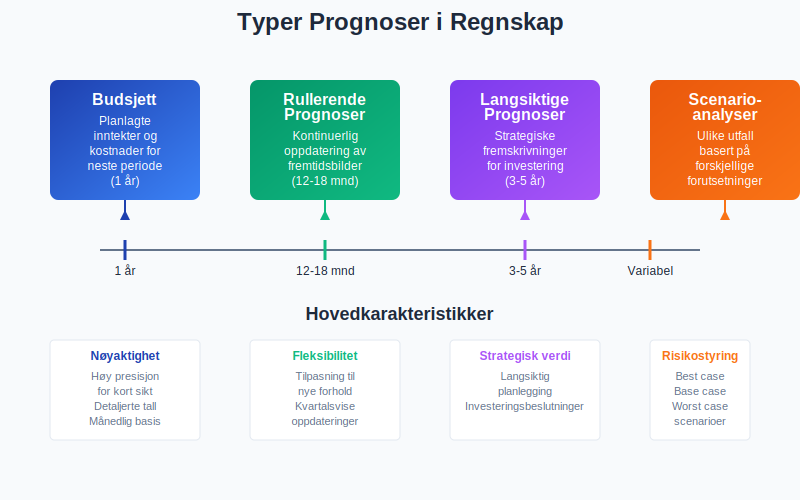
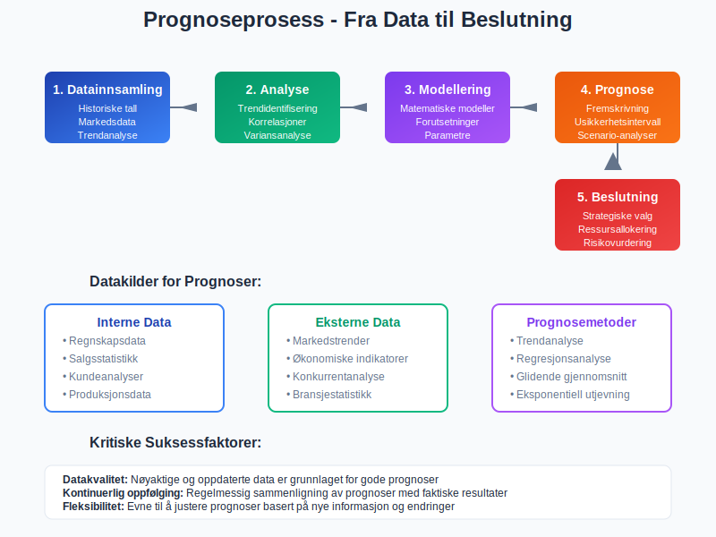
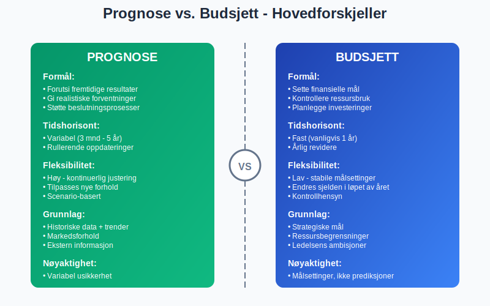
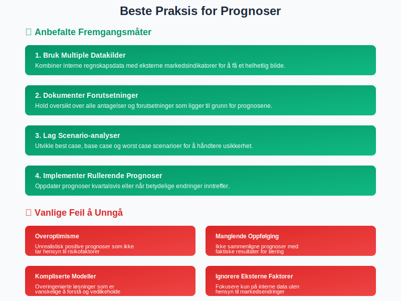

---
title: "Hva er Prognose?"
meta_title: "Hva er Prognose?"
meta_description: 'En **prognose** er en beregnet fremskriving av fremtidige økonomiske forhold basert på historiske data, markedstrender og forventninger. I regnskapssammenheng...'
slug: hva-er-prognose
type: blog
layout: pages/single
---

En **prognose** er en beregnet fremskriving av fremtidige økonomiske forhold basert på historiske data, markedstrender og forventninger. I regnskapssammenheng brukes prognoser til å forutsi inntekter, kostnader, kontantstrøm og andre finansielle nøkkeltall for å støtte strategisk planlegging og beslutningsprosesser.

Prognoser skiller seg fra [budsjetter](/blogs/regnskap/hva-er-balanse "Hva er Balanse? Struktur og Innhold i Balanseregnskap") ved at de fokuserer på **realistiske forventninger** fremfor målsettinger, og oppdateres kontinuerlig basert på nye informasjon og endrede markedsforhold.

## Typer Prognoser i Regnskap

### Kortsiktige Prognoser (Budsjetter)
**Kortsiktige prognoser** dekker vanligvis 12 måneder og fokuserer på detaljerte månedlige eller [kvartalsvise](/blogs/regnskap/regnskapskvartaler-q1-q4 "Q1-Q4 Regnskapskvartaler - Komplett Guide til Kvartalsstyring") fremskrivninger av:

* Inntekter og salgsvolum
* Driftskostnader og [lønnskostnader](/blogs/regnskap/lonnskostnad "Lønnskostnad - Komplett Guide til Lønnskostnader i Regnskap")
* Kontantstrøm og likviditetsbehov
* Investeringer og finansieringsbehov

### Rullerende Prognoser
**Rullerende prognoser** oppdateres [kvartalsvis](/blogs/regnskap/regnskapskvartaler-q1-q4 "Q1-Q4 Regnskapskvartaler - Komplett Guide til Kvartalsstyring") og gir et kontinuerlig 12-18 måneders fremtidsbilde. Dette gjør det mulig å:

* Justere for sesongvariasjoner
* Inkorporere nye markedsforhold
* Tilpasse seg endringer i forretningsmodellen
* Gi mer nøyaktige kortsiktige estimater

### Langsiktige Prognoser
**Langsiktige prognoser** strekker seg over 3-5 år og brukes til:

* Strategisk planlegging og investeringsbeslutninger
* Analyse av [avkastning](/blogs/regnskap/hva-er-avkastning "Hva er Avkastning? Beregning og Analyse av Avkastning") på større investeringer
* Beregning av forventet vekst med [sammensatt årlig vekstrate (CAGR)](/blogs/regnskap/hva-er-avkastning#sammensatt-%C3%A5rlig-vekstrate-cagr "Sammensatt årlig vekstrate (CAGR)")
* Finansieringsplanlegging
* Verdivurdering av selskapet

### Scenario-analyser
**Scenario-analyser** utvikler flere mulige utfall basert på ulike forutsetninger:

| Scenario | Beskrivelse | Bruksområde |
|----------|-------------|-------------|
| Best Case | Optimistisk utvikling | Identifisere potensial |
| Base Case | Mest sannsynlig utfall | Hovedplanlegging |
| Worst Case | Pessimistisk scenario | Risikostyring |

## Prognoseprosess og Metodikk

### 1. Datainnsamling og Analyse
Grunnlaget for gode prognoser bygger på **kvalitative og kvantitative data**:

**Interne datakilder:**
* Historiske regnskapsdata og [balanse](/blogs/regnskap/hva-er-balanse "Hva er Balanse? Struktur og Innhold i Balanseregnskap")
* Salgsstatistikk og kundeanalyser
* Produksjonsdata og kapasitetsutnyttelse
* [Driftsregnskap](/blogs/regnskap/hva-er-driftsregnskap "Hva er Driftsregnskap? Struktur og Komponenter") og kostnadstrends

**Eksterne datakilder:**
* Markedstrender og bransjestatistikk
* Økonomiske indikatorer og renteutvikling
* Konkurrentanalyse og markedsandeler
* Regulatoriske endringer

### 2. Prognosemetoder
Ulike **prognosemetoder** egner seg for forskjellige situasjoner:

#### Kvantitative Metoder
* **Trendanalyse:** Fremskriving av historiske mønstre
* **Regresjonsanalyse:** Sammenheng mellom variabler
* **Glidende gjennomsnitt:** Utjevning av svingninger
* **Eksponentiell utjevning:** Vekting av nyere data

#### Kvalitative Metoder
* **Ekspertvurderinger:** Faglig skjønn og erfaring
* **Markedsundersøkelser:** Kundeintervjuer og spørreundersøkelser
* **Delphi-metoden:** Strukturert ekspertpanel
* **Scenario-planlegging:** "Hva-hvis" analyser

### 3. Validering og Justering
**Kontinuerlig forbedring** av prognoser krever:

* Sammenligning med faktiske resultater
* Analyse av avvik og årsaker
* Justering av modeller og forutsetninger
* Dokumentasjon av læringspunkter

## Forskjell Mellom Prognose og Budsjett

| Aspekt | Prognose | Budsjett |
|--------|----------|----------|
| **Formål** | Forutsi fremtiden | Sette mål og kontrollere |
| **Fleksibilitet** | Høy - kontinuerlig oppdatering | Lav - stabile målsettinger |
| **Tidshorisont** | Variabel (3 mnd - 5 år) | Fast (vanligvis 1 år) |
| **Grunnlag** | Historiske data + markedstrends | Strategiske mål + ressurser |
| **Oppdatering** | Kvartalsvis eller oftere | Årlig |
| **Nøyaktighet** | Avhenger av usikkerhet | Målsettinger, ikke prediksjoner |

## Regnskapsføring av Prognoser

**Prognoser påvirker regnskapsføring** på flere måter:

### Periodisering og Avsetninger
* Estimering av [fakturaer](/blogs/regnskap/hva-er-en-faktura "Hva er en Faktura? En Guide til Norske Fakturakrav") som ikke er mottatt
* Beregning av [avsetninger](/blogs/regnskap/avsetning "Avsetning i Regnskap - Komplett Guide til Avsetninger og Estimater") for garantiforpliktelser
* Periodisering av kostnader og inntekter

### Nedskrivninger og Verdifall
* Vurdering av kundefordringer og tap
* Nedskrivning av varelager
* Verdifall på anleggsmidler

### Pensjonsforpliktelser
Ved regnskapsføring av [pensjoner](/blogs/regnskap/hva-er-pensjon "Hva er Pensjon? Komplett Guide til Pensjonsregnskapet") brukes aktuarielle prognoser for:

* Fremtidige lønnsnivåer
* Avkastning på pensjonsmidler
* Levealder og andre demografiske faktorer
* Diskonteringsrenter

## Bruk av Prognoser i Finansiell Rapportering

### Årsregnskap og Noter
**Prognoser** må dokumenteres i årsregnskapet når de påvirker:

* [Avslutningsbalanse](/blogs/regnskap/hva-er-avslutningsbalanse "Hva er Avslutningsbalanse? Struktur og Innhold") og verdivurderinger
* Avsetninger for fremtidige forpliktelser
* Vurdering av going concern-forutsetningen

### Ledelsesrapportering
**Månedlig og kvartalsvis rapportering** inkluderer:

* Sammenligning av prognoser med faktiske tall
* Analyse av avvik og trendutvikling
* Oppdaterte prognoser for resterende periode
* Prognose for [bruttofortjeneste](/blogs/regnskap/hva-er-bruttofortjeneste "Hva er Bruttofortjeneste? Beregning og Analyse av Bruttofortjeneste") og lønnsomhet

## Beste Praksis for Prognoser

### Kvalitetssikring
* **Datakvalitet:** Sikre nøyaktige og oppdaterte grunnlagsdata
* **Dokumentasjon:** Tydelige forutsetninger og beregningsmetoder
* **Validering:** Regelmessig sammenligning med faktiske resultater
* **Responsibilitet:** Klare roller for prognoseprosessen

### Kommunikasjon og Bruk
* **Transparens:** Åpen kommunikasjon om usikkerhet og forutsetninger
* **Timing:** Pravtidig levering til beslutningsprosesser
* **Formatering:** Tydelige rapporter tilpasset mottakere
* **Oppfølging:** Kontinuerlig forbedring basert på erfaringer

### Teknologi og Verktøy
Moderne **prognoseverktøy** kan forbedre nøyaktighet og effektivitet:

* Integrerte [ERP-systemer](/blogs/regnskap/hva-er-erp-system "Hva er ERP-system? Komplett Guide til Enterprise Resource Planning") for datainnsamling
* Statistiske analyseprogrammer
* Dashboard og visualiseringsverktøy
* Automatiserte varslinger og oppdateringer

## Utfordringer og Begrensninger

### Usikkerhet og Risiko
**Prognoser** har iboende **usikkerhet** som må håndteres:

* Markedsvolatilitet og konjunktursvingninger
* Teknologiske endringer og disrupsjon
* Regulatoriske endringer
* Force majeure-hendelser

### Menneskelige Faktorer
* **Kognitiv bias:** Tendenser som påvirker objektiviteten
* **Organisatorisk press:** Ønske om optimistiske prognoser
* **Kompetanse:** Behov for statistisk og analytisk kunnskap
* **Ressurser:** Balanse mellom presisjon og kostnad

## Prognoser i Ulike Bransjer

### Detaljhandel
* Sesongvariasjoner og trendprognoser
* Lageroptimereing og innkjøpsplanlegging
* Kundelojalitet og markedsandeler

### Produksjon
* Råvarekostnader og leverandørforhold
* Kapasitetsutnyttelse og investeringsbehov
* Kvalitetskostnader og garantiavsetninger

### Tjenesteyting
* Personalkostnader og kapasitetsstyring
* Kundetilfredshet og gjentakskjøp
* Teknologiinvesteringer og digitalisering

Prognoser er et **kritisk verktøy** for moderne bedriftsledelse og regnskapsføring. Ved å kombinere solid metodikk med kontinuerlig forbedring, kan organisasjoner ta bedre beslutninger og redusere finansiell risiko. Nøkkelen til suksess ligger i å **balansere presisjon med praktisk anvendelighet**, samtidig som man anerkjenner prognosers iboende usikkerhet.

