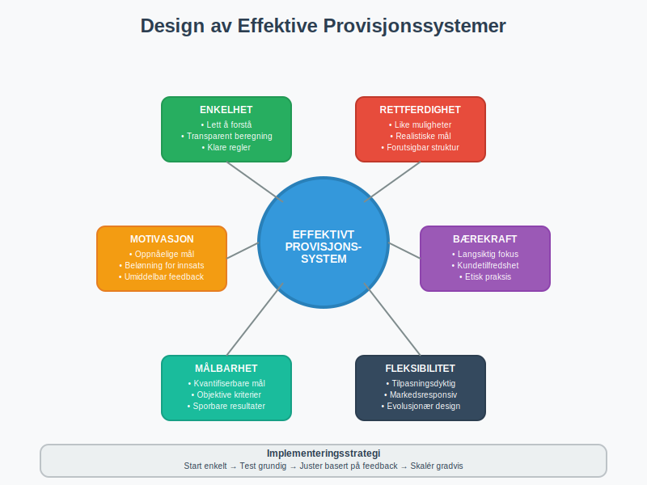

**Provisjon** er en prestasjonsbasert form for [lønn](/blogs/regnskap/hva-er-lonnskostnader "Hva er Lønnskostnader? Komplett Guide til Lønnskostnader i Regnskap") der ansatte mottar en del av verdien av det de selger eller produserer. Dette kompensasjonssystemet kobler direkte sammenheng mellom innsats og belønning, og utgjør en viktig del av [lønnskostnadene](/blogs/regnskap/lonnskostnad "Lønnskostnad: Alt du Trenger å Vite om Regnskapsføring og Beregning") for mange bedrifter.


## Hva er Provisjon?

**Provisjon** er en variabel lønn som beregnes som en prosentandel av salgsverdi, fortjeneste eller andre prestasjonsbaserte måltall. Provisjonssystemet brukes hovedsakelig innenfor salg, men kan også anvendes i andre virksomhetsområder der individuell prestasjon kan måles og belønnes direkte.

### Provisjonsmodeller

Det finnes flere hovedtyper provisjonsordninger som benyttes i norsk næringsliv:

#### 1. Ren Provisjon
* **Kun provisjonsbasert lønn** uten fast grunnlønn
* Høy risiko og høy belønning for den ansatte
* Vanlig i eiendomsmegling og forsikringssalg

#### 2. Fastlønn pluss Provisjon
* **Kombinasjon** av fast grunnlønn og provisjonsbasert tillegg
* Gir økonomisk trygghet samtidig som det motiverer til prestasjon
* Mest utbredt i moderne norske bedrifter

#### 3. Trappeprovisjoner
* **Økende provisjonssatser** ved høyere salgsvolum
* Motiverer til å overgå salgsmål
* Kompleks beregning men høy motivasjonseffekt


## Provisjon i Regnskapet

Regnskapsføring av provisjon krever **nøye periodisering** og korrekt klassifisering som del av [personalkostnadene](/blogs/regnskap/hva-er-personalkostnad "Hva er Personalkostnad? Komplett Oversikt over Personalkostnader").

### Grunnleggende Regnskapsføring

Provisjoner regnskapsføres når de **påløper**, ikke nødvendigvis når de utbetales:

| Konto | Debet | Kredit |
|-------|-------|--------|
| Lønnskostnad - Provisjon | X |        |
| Skyldig lønn |   | X      |

### Periodisering av Provisjoner

**Periodiseringsprinsippet** krever at provisjoner føres i samme periode som det underliggende salget:

* **Salgsmåned:** Provisjon påløper
* **Utbetalingsmåned:** Kontant utbetaling
* **Mellomperiode:** Påløpt, ikke betalt provisjon


### Avsetninger for Variable Provisjoner

For komplekse provisjonsordninger kan det være nødvendig med **avsetninger**:

```
Eksempel: Årlig bonusprovisjoner
- Månedlig avsetning basert på foreløpig beregning
- Justering ved årets slutt bason endelig resultat
```

## Juridiske Rammer for Provisjon

Provisjonsordninger er regulert gjennom **Arbeidsmiljøloven** og **kontraktsrett**, som setter viktige rammer for how provisjon kan struktureres.

### Arbeidsmiljølovens Bestemmelser

* **Skriftlig avtale:** Provisjonsvilkår må være klart definert
* **Minstelønn:** Må ikke føre til lønn under lovens minimumsbestemmelser
* **Ferierettigheter:** Provisjon skal inkluderes i feriepengeberegningen

### Kontraktuelle Forhold

Provisjonsavtaler må spesifisere:

* **Beregningsgrunnlag:** Hva provisjon beregnes av
* **Provisjonssats:** Prosentandel eller beløp
* **Utbetalingsvilkår:** Når og hvordan provisjon utbetales
* **Oppsigelsesvilkår:** Rettigheter ved opphør av arbeidsforhold


## Skatteregler og Arbeidsgiveravgift

Provisjon behandles **likt med ordinær lønn** when det gjelder skatter og avgifter.

### Skattemessig Behandling

For **arbeidstakeren**:

* Provisjon er fullt skattepliktig som lønnsinntekt
* Skatteres som vanlig lønn med samme satser
* Må oppgis på selvangivelsen som lønn

For **arbeidsgiveren**:

* Provisjon er fradragsberettiget som lønnskostnad
* Samme tidspunkt for fradrag som regnskapsmessig kostnadsføring

### Arbeidsgiveravgift på Provisjon

[Arbeidsgiveravgift](/blogs/regnskap/hva-er-arbeidsgiveravgift "Hva er Arbeidsgiveravgift? Satser, Beregning og Regnskapsføring") beregnes på samme måte som for ordinær lønn:

| Avgiftsgrunnlag | Provisjon + Andre Lønnskostnader |
|-----------------|----------------------------------|
| Avgiftssats | Som for ordinær lønn i samme sone |
| Beregningsperiode | Samme som for øvrig lønn |


## Feriepenger og Provisjon

**Feriepenger** skal beregnes av provisjon etter samme regler som for ordinær lønn.

### Beregningsgrunnlag

* **Alle provisjoner** inngår i feriepengeberegningen
* **10,2% feriepenger** på provisjon opptjent i ferieåret
* **Utbetaling** sammen med ordinære feriepenger

### Regnskapsføring av Feriepenger på Provisjon

```
Når provisjon påløper:
Debet: Lønnskostnad - Provisjon
Kredit: Skyldig lønn

Samtidig avsettes feriepenger:
Debet: Lønnskostnad - Feriepenger
Kredit: Avsetning feriepenger
```


## Provisjon i Forskjellige Bransjer

Provisjonssystemer varierer significantly mellom bransjer, med ulike modeller tilpasset specific business needs.

### Eiendomsmegling

* **Ren provisjon** basert på salgspris
* Typisk **1-3%** av omsetning
* Lang salgssyklus krever finansiell planlegging

### Forsikring

* **Førsteårsprovisjoner** ved nysalg
* **Fornyelseспровисjon** på eksisterende kunder
* Kompleks provisjonsstruktur med ulike satser

### Teknologisalg

* **Kvartalsbaserte** provisjoner
* **Team-provisjoner** i tillegg til individuelle
* **Recurring revenue** gir kontinuerlige provisjoner


## Motivasjon og Provisjonssystemer

Provisjon fungerer som en powerful **motivasjonsfaktor**, men krever careful design for å oppnå optimale resultater.

### Motivasjonseffekter

**Positive effekter:**
* Økt salgsprestasjoner og produktivitet
* Selvmotivasjon og entrepreneurskap
* Direkte kobling mellom innsats og belønning

**Potensielle utfordringer:**
* Focus kun på kortsiktige resultater
* Risk for uetisk salesoppførsel
* Høy stress og press på ansatte

### Design av Effektive Provisjonssystemer

For å create effective provisjonssystemer bør bedrifter consider:

* **Balanserte måltall:** Ikke kun salgstall, men også kundetilfredshet
* **Team-elementer:** Kombinere individuelle og kollektive incentiver
* **Sustainable praksis:** Avoid å promote shortsighted behavior



## Digitaliseringsvirkningen på Provisjon

Modern teknologi har transformert how provisjoner beregnes, tracks og utbetales.

### Automatiserte Provisjonssystemer

* **Real-time tracking** av salgsprestasjoner
* **Automatisk beregning** basert på predefinerte regler
* **Integrated rapportering** med regnskapssystemet

### CRM-Integration

Customer Relationship Management (CRM) systems now provide:
* **Detaljert salgssporing** per kunde og product
* **Advanced analytics** for provisjonsoptimalisering
* **Transparency** for ansatte om earnings potential

### Data Analytics og Provisjon

* **Predictive modeling** for optimalisering av provisjonssatser
* **Performance benchmarking** against industry standards
* **Sentiment analysis** av customer satisfaction connected til provisjoner


## Internkontroll og Provisjonssystemer

Effective [internkontroll](/blogs/regnskap/hva-er-internkontroll "Hva er Internkontroll? Systemer og Prosedyrer for Bedre Risikostyring") er essential for å sikre korrekt håndtering av provisjoner.

### Kontrollaktiviteter

**Månedlige kontroller:**
* Verifikasjon av salgsdata som grunnlag for provisjon
* Gjennomgang av beregninger og ratios
* Cross-checking between sales og accounting systems

**Årlige revisjoner:**
* Comprehensive review av provisjonsavtaler
* Assessment av goal achievement og payout accuracy
* Evaluation av system controls og autorizations

### Segregering av Oppgaver

* **Sales team** registrerer salg
* **HR department** maintainer provisjonsavtaler
* **Accounting** beregner og utbetaler provisjoner
* **Management** approver exceptional payments


## Provisjon og Kontantstrøm

Provisjonsordninger har significant impact på bedriftens [kontantstrøm](/blogs/regnskap/hva-er-kontantstrom "Hva er Kontantstrøm? Betydning og Analyse i Regnskap").

### Kontantstrømeffekter

**Positive effekter:**
* **Variable kostnader** som følger revenue
* **Reduced fixed costs** sammenlignet med fast lønn
* **Aligned incentives** mellom ansatte og business success

**Cash flow challenges:**
* **Lumpsum payments** ved store salg
* **Seasonal variations** i provisjonsutbetalinger  
* **Delayed collections** vs. immediate provisjon liability

### Likviditetsplanlegging

Bedrifter must carefully plan for:
* **Maximum potential provisjoner** i gode perioder
* **Minimum cash requirements** for provisjonsutbetalinger
* **Credit facilities** for å handle timing mismatches


## Internasjonale Forhold

For **multinasjonale bedrifter** kommer additional complexity omkring provisjon.

### Valutaeksponering

* **Provisjoner i foreign currency** creates exchange rate risk
* **Hedging strategies** may be needed
* **Accounting treatment** av currency gains/losses

### Skattemessige Implikasjoner

* **Transfer pricing** regulations when provisjoner cross borders
* **Withholding taxes** på provisjonsutbetalinger
* **Double taxation** issues og treaty benefits

### Regulatory Compliance

* **Local labor laws** governing provisjon structures
* **Financial reporting standards** in different jurisdictions
* **Anti-corruption** og bribery considerations


## Fremtidstrender innen Provisjon

Provisjonssystemer evolves continuously som response til changing business environments.

### Teknologiske Utviklinger

* **AI-drevne** provisjonsoptimaliseringer
* **Blockchain** for transparent og tamper-proof provisjonsrecords
* **Real-time payments** via digital platforms

### Nye Kompensasjonsmodeller

* **Subscription-based** provisjoner for recurring revenue models
* **Team-centric** provisjoner rather than pure individual focus
* **ESG-linked** provisjoner connected til sustainability goals

### Regulatory Evolution

* **Increased transparency** requirements
* **Pay equity** regulations affecting provisjon design
* **Data protection** laws impacting provisjon record keeping


## Praktiske Tips for Bedrifter

For bedrifter som ønsker å implementere eller optimalisere provisjonssystemer:

### Implementering

1. **Start enkelt:** Begin med straightforward commission structures
2. **Communicate clearly:** Ensure alle ansatte understands hvordan provisjon beregnes
3. **Test og adjust:** Regularly review og refine provisjon programs

### Juridisk Compliance

* **Legal review** av alle provisjonsavtaler
* **Regular updates** på changing labor regulations
* **Documentation** av all provisjonsrelated decisions

### Regnskapsmessig Håndtering

* **Implement robust systems** for provisjonsberegning og -rapportering
* **Regular reconciliation** between sales data og accounting records
* **Clear policies** for provisjonsrelaterte accounting treatments


## Vanlige Feil og Hvordan Unngå Dem

### Regnskapsføringsfeil

**Feil:** Ikke periodisere provisjoner korrekt
**Løsning:** Implement monthly accrual procedures

**Feil:** Confusion omkring skatteregler
**Løsning:** Regular consultation med accounting professionals

### Juridiske Fallgruver

**Feil:** Unclear provisjonsavtaler
**Løsning:** Detailed, written agreements reviewed av legal counsel

**Feil:** Failure to comply med minimum wage requirements
**Løsning:** Regular monitoring av total compensation levels

### Operasjonelle Utfordringer

**Feil:** Complex provisjonssystemer som ansatte ikke forstår
**Løsning:** Simplicity og transparency i commission structures

**Feil:** Inadequate systems for tracking sales og calculating commissions
**Løsning:** Investment i robust technology platforms


Provisjon remainS en powerful tool for motivating salgsprestasjoner og linking compensation til business results. Success requires careful attention til legal compliance, proper accounting treatment, og thoughtful system design som balances motivation med organizational sustainability.


