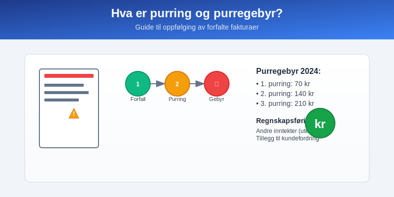
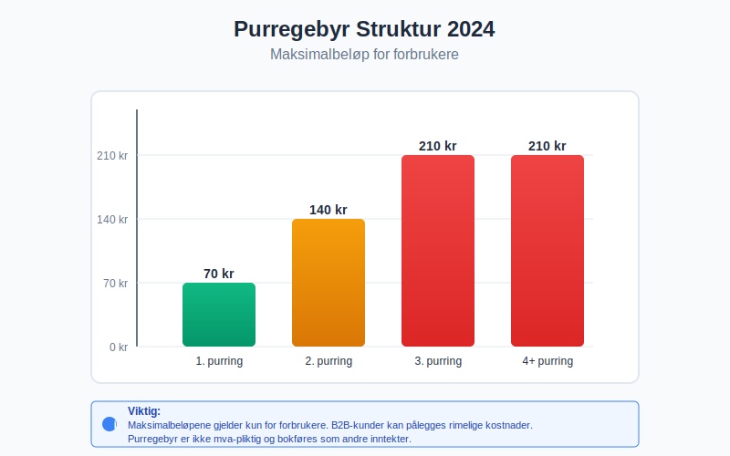
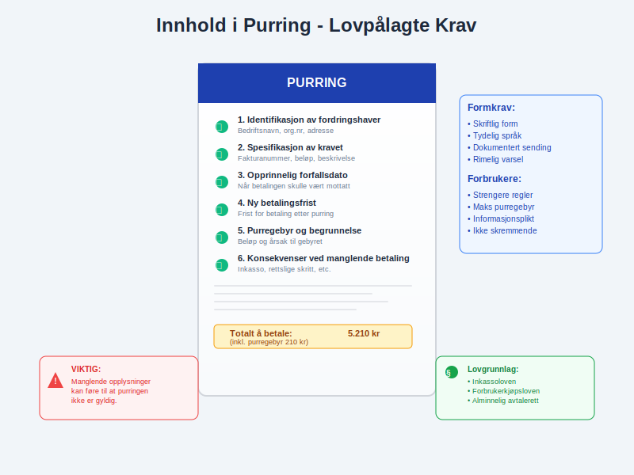
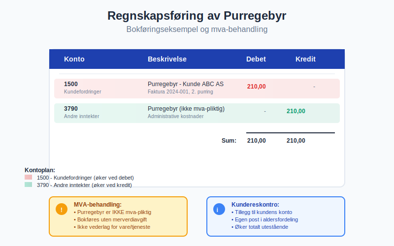
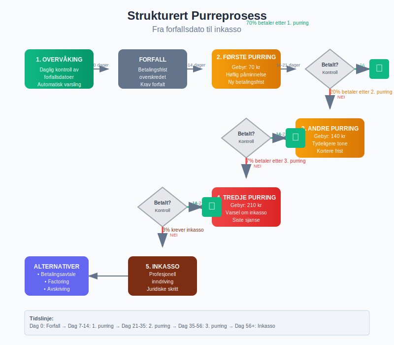
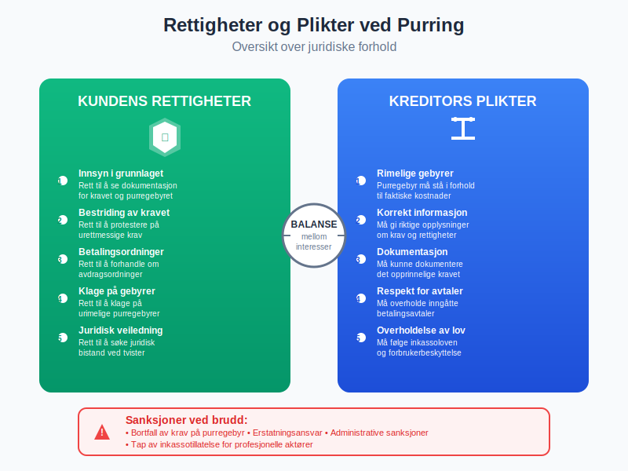
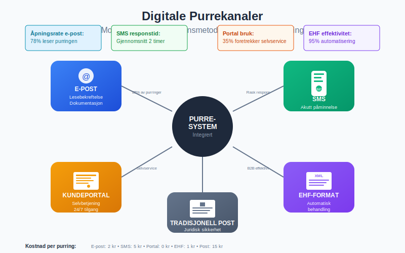
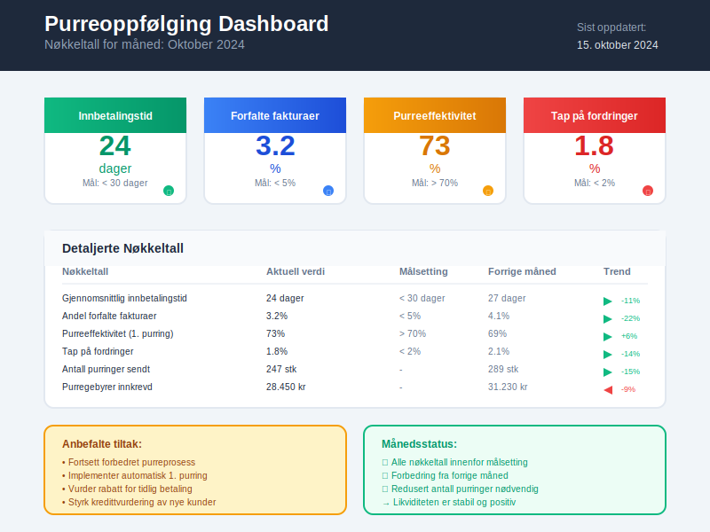

---
title: "Hva er purring og purregebyr?"
seoTitle: "Hva er purring og purregebyr?"
description: "Purring og purregebyr hjelper bedrifter å sikre betaling av forfalte fakturaer. Artikkelen dekker regler, maksimalbeløp, innholdskrav, regnskapsføring, prosess og beste praksis for effektiv oppfølging."
summary: "Purring og purregebyr forklart: regler, satser, innholdskrav og regnskapsføring."
---

**Purring og purregebyr** er viktige virkemidler for bedrifter som ønsker å sikre betaling av forfalte [fakturaer](/blogs/regnskap/hva-er-en-faktura "Hva er en Faktura? En Guide til Norske Fakturakrav"). Når kunder ikke betaler innen betalingsfristen, kan du sende purring med tilhørende gebyr for å dekke administrative kostnader og motivere til rask betaling.



## Seksjon 1: Hva er purring?

En **purring** er en formell oppfordring til betaling som sendes til kunder som ikke har betalt sine [kundefordringer](/blogs/regnskap/hva-er-kundefordring "Hva er Kundefordring? Guide til Håndtering av Kundegjeld") innen forfallsdato. Purringen fungerer som en påminnelse og dokumentasjon av at betalingen er forsinket.

### Juridisk grunnlag for purring

Purring er regulert i **inkassoloven** (lov om inkassovirksomhet og annen inndriving av forfalte pengekrav) og **forbrukerkjøpsloven**. Loven gir bedrifter rett til å kreve dekning for rimelige kostnader ved oppfølging av forfalte krav.

### Når kan du sende purring?

* **Umiddelbart** etter forfallsdato dersom det ikke er avtalt betalingsfrist
* **Etter utløpt betalingsfrist** når det er avtalt lengre betalingstid
* **Kun for forfalte krav** - fremtidige betalinger kan ikke purres

## Seksjon 2: Hva er purregebyr?

**Purregebyr** er et gebyr som kreves for å dekke administrative kostnader ved å sende purring til kunder med forsinket betaling. Gebyret skal være rimelig og stå i forhold til kostnadene ved purrearbeidet.



### Maksimalbeløp for purregebyr 2024

Forbrukerombudet har fastsatt følgende **maksimalbeløp** for purregebyr til forbrukere:

| Purrenummer | Maksimalbeløp | Merknad |
|-------------|---------------|----------|
| 1. purring | 70 kr | Første påminnelse |
| 2. purring | 140 kr | Andre påminnelse |
| 3. purring | 210 kr | Tredje påminnelse |
| Senere purringer | 210 kr | Samme som 3. purring |

### Purregebyr til bedriftskunder

For **bedrift-til-bedrift transaksjoner** (B2B) gjelder ikke de samme maksimalbeløpene. Her kan du kreve:

* **Rimelige kostnader** for purrearbeid
* **Faktiske kostnader** ved oppfølging
* **Avtalt purregebyr** dersom dette er regulert i kontrakten

## Seksjon 3: Regler og krav til purring

### Innhold i purringen

En gyldig purring må inneholde:

* **Tydelig identifikasjon** av fordringshaveren
* **Spesifikasjon** av det opprinnelige kravet
* **Forfallsdato** for den opprinnelige fakturaen
* **Nytt forfallsdato** for betaling
* **Purregebyr** og begrunnelse for dette
* **Konsekvenser** ved manglende betaling



### Formkrav til purring

* **Skriftlig form** (brev, e-post eller SMS)
* **Tydelig språk** som kunden forstår
* **Dokumentasjon** av at purringen er sendt
* **Rimelig varsel** før ytterligere tiltak

### Særlige regler for forbrukere

Ved purring av **forbrukere** gjelder strengere regler:

* Purregebyr må være **rimelig** og ikke overstige maksimalbeløpene
* **Trusler** om inkasso må være saklige og ikke skremmende
* **Renteberegning** må følge gjeldende renteregler
* **Informasjonsplikt** om kundens rettigheter

## Seksjon 4: Regnskapsføring av purregebyr

### Bokføring av purregebyr

Purregebyr skal [bokføres](/blogs/regnskap/hva-er-bokforingsregler "Hva er Bokføringsregler? Guide til Norsk Bokføringspraksis") som **andre inntekter** i regnskapet:

```
Debet: Kundefordringer (konto 1500)     210 kr
Kredit: Andre inntekter (konto 3790)    210 kr
```

### Mva-behandling av purregebyr

**Purregebyr er ikke mva-pliktig** da det ikke anses som vederlag for levering av varer eller tjenester. Gebyret skal bokføres uten merverdiavgift.



### Oppfølging i kundereskontro

Purregebyr skal registreres i [kundereskontro](/blogs/regnskap/hva-er-kundereskontro "Hva er Kundereskontro? Guide til Kundehåndtering") som en tilleggspost på kundens konto:

* **Opprinnelig faktura** forblir uendret
* **Purregebyr** legges til som egen post
* **Samlet utestående** blir opprinnelig beløp pluss purregebyr
* **Aldersfordeling** viser både hovedkrav og tilleggsgebyrer

## Seksjon 5: Purreprosess og beste praksis

### Strukturert purreprosess

En effektiv purreprosess følger denne strukturen:

1. **Overvåking** av forfallsdatoer
2. **Automatisk 1. purring** 7-14 dager etter forfall
3. **2. purring** 14-21 dager etter første purring
4. **3. purring** med varsel om [inkasso](/blogs/regnskap/hva-er-inkasso "Hva er Inkasso? Guide til Inndriving av Forfalte Krav")
5. **Vurdering** av videre tiltak



### Kommunikasjonsstrategi

* **Profesjonell tone** i all kommunikasjon
* **Tydelige frister** for betaling
* **Fleksibilitet** ved betalingsproblemer
* **Dokumentasjon** av all kontakt
* **Oppfølging** av avtalte betalingsordninger

### Tekniske løsninger

Moderne [fakturasystemer](/blogs/regnskap/hva-er-efaktura "Hva er EFaktura? Guide til Elektronisk Fakturering") tilbyr:

* **Automatisk purring** basert på forfallsdatoer
* **Integrert purregebyr** beregning
* **E-post utsendelse** av purringer
* **Rapportering** av utestående fordringer
* **Kobling** til regnskapssystem

## Seksjon 6: Juridiske forhold og rettigheter

### Kundens rettigheter

Kunder som mottar purring har rett til:

* **Innsyn** i grunnlaget for kravet
* **Bestriding** av urettmessige krav
* **Betalingsordninger** ved betalingsproblemer
* **Klage** på urimelige purregebyrer
* **Juridisk veiledning** ved tvister

### Kreditors plikter

Som kreditor har du plikt til:

* **Rimelige purregebyrer** som står i forhold til kostnadene
* **Korrekt informasjon** om krav og rettigheter
* **Dokumentasjon** av det opprinnelige kravet
* **Respekt** for betalingsavtaler
* **Overholdelse** av inkassoloven



### Sanksjoner ved brudd

Brudd på inkassoreglene kan medføre:

* **Bortfall** av krav på purregebyr
* **Erstatningsansvar** overfor debitor
* **Administrative sanksjoner** fra tilsynsmyndighetene
* **Tap av inkassotillatelse** for profesjonelle aktører

## Seksjon 7: Automatisering og systemer

### Integrerte løsninger

Moderne regnskapssystemer tilbyr integrert purrefunksjonalitet:

* **Automatisk generering** av purringer
* **Regelbasert oppfølging** etter forfallsdatoer
* **Gebyrberegning** i henhold til gjeldende satser
* **Rapportering** av purreaktivitet
* **Kobling** til [betalingsløsninger](/blogs/regnskap/hva-er-avtalegiro "Hva er AvtaleGiro? Guide til Automatiske Betalinger")

### Digitale kanaler

Purring kan sendes gjennom:

* **E-post** med lesebekreftelse
* **SMS** for akutte påminnelser
* **Kundeportaler** med selvbetjening
* **[EHF-format](/blogs/regnskap/hva-er-efaktura "Hva er EFaktura? Guide til Elektronisk Fakturering")** for automatisk behandling
* **Tradisjonell post** ved krav til skriftlighet



## Seksjon 8: Skattemessige forhold

### Inntektsføring av purregebyr

Purregebyr skal **inntektsføres** når gebyret påløper, ikke når det betales. Dette følger regnskapsloven og god regnskapsskikk.

### Fradragsrett for tap

Dersom purregebyrer må **avskrives som tap**, kan dette trekkes fra som kostnad:

```
Debet: Tap på fordringer (konto 6700)   210 kr
Kredit: Kundefordringer (konto 1500)   210 kr
```

### Mva-konsekvenser

* **Purregebyr** er ikke mva-pliktig
* **Tap på purregebyr** påvirker ikke mva-grunnlaget
* **Innbetalt purregebyr** skal ikke føres som mva-inntekt

## Seksjon 9: Internkontroll og oppfølging

### Rutiner for purreoppfølging

Etabler faste rutiner for:

* **Daglig overvåking** av forfallsdatoer
* **Ukentlig rapportering** av utestående fordringer
* **Månedlig gjennomgang** av purreeffektivitet
* **Kvartalsvise analyser** av kundebetalingsatferd
* **Årlig vurdering** av purregebyrsatser

### Nøkkeltall for oppfølging

Viktige måltall for purreaktivitet:

| Nøkkeltall | Beskrivelse | Målsetting |
|------------|-------------|------------|
| **Gjennomsnittlig innbetalingstid** | Dager fra faktura til betaling | < 30 dager |
| **Andel forfalte fakturaer** | Prosent av omsetning forfalt | < 5% |
| **Purreeffektivitet** | Betaling etter 1. purring | > 70% |
| **Tap på fordringer** | Avskrevne krav i prosent | < 2% |



## Seksjon 10: Alternativer til purring

### Forebyggende tiltak

For å redusere behov for purring:

* **[Kredittvurdering](/blogs/regnskap/hva-er-kredittsjekk "Hva er Kredittsjekk? Guide til Kundevurdering")** av nye kunder
* **Forskuddsbetaling** for risikokunder
* **Kortere betalingsfrister** ved usikkerhet
* **[Fakturagebyr](/blogs/regnskap/hva-er-fakturagebyr "Hva er Fakturagebyr? Guide til Kostnadsdekning")** for å dekke risiko
* **Betalingsgarantier** ved store leveranser

### Alternative innkrevingsmetoder

Ved gjentatte betalingsproblemer:

* **[Factoring](/blogs/regnskap/hva-er-factoring "Hva er Factoring? Guide til Salg av Kundefordringer")** - salg av fordringer
* **Inkassoselskap** for profesjonell oppfølging
* **Rettslig inkasso** ved store beløp
* **Forliksrådet** for mindre tvister
* **Konkursbegjæring** ved insolvens

## Sammendrag

Purring og purregebyr er **lovregulerte virkemidler** for oppfølging av forfalte kundefordringer. Nøkkelpunktene er:

* **Maksimalbeløp** gjelder kun for forbrukere (70-210 kr i 2024)
* **B2B-kunder** kan pålegges rimelige kostnader
* **Regnskapsføring** som andre inntekter uten mva
* **Juridiske krav** til innhold og form
* **Dokumentasjon** og oppfølging er essensielt

En **strukturert purreprosess** med moderne systemer og tydelige rutiner sikrer effektiv oppfølging og bedre [likviditet](/blogs/regnskap/hva-er-arbeidskapital "Hva er Arbeidskapital? Guide til Likviditetsstyring") for bedriften.


