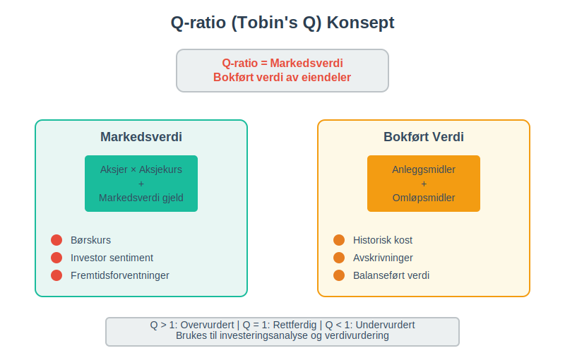
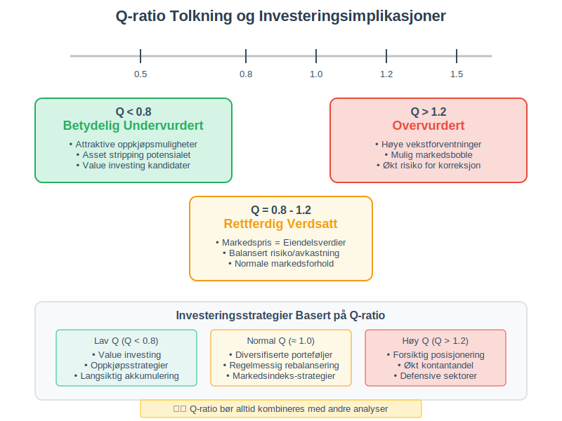
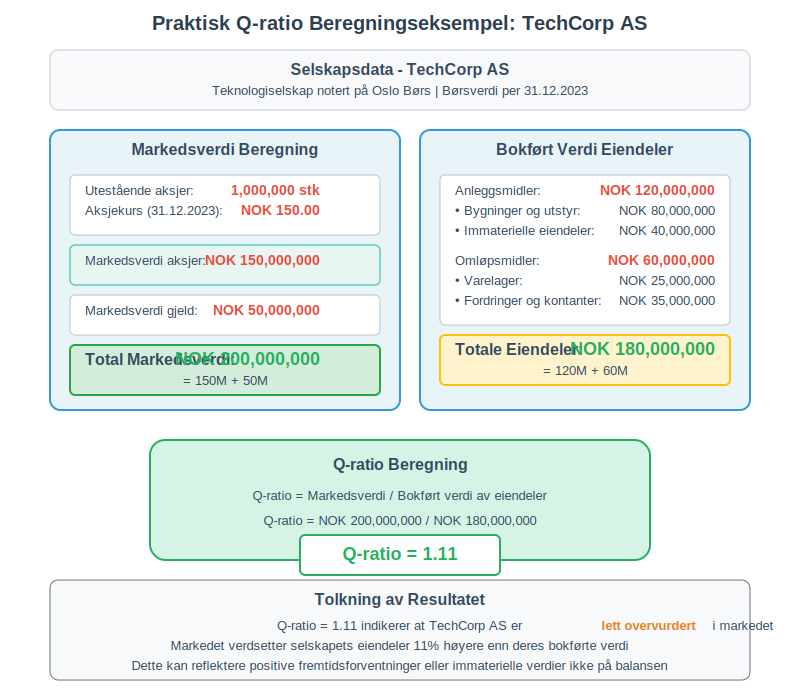
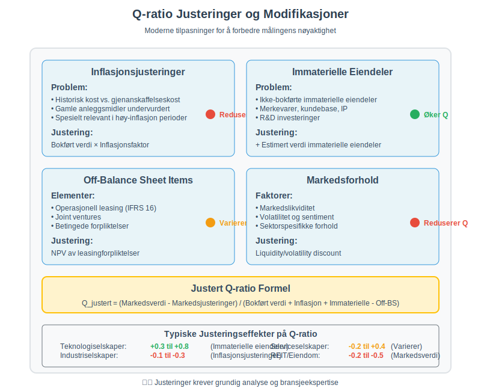
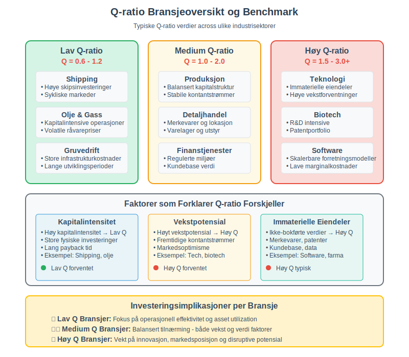
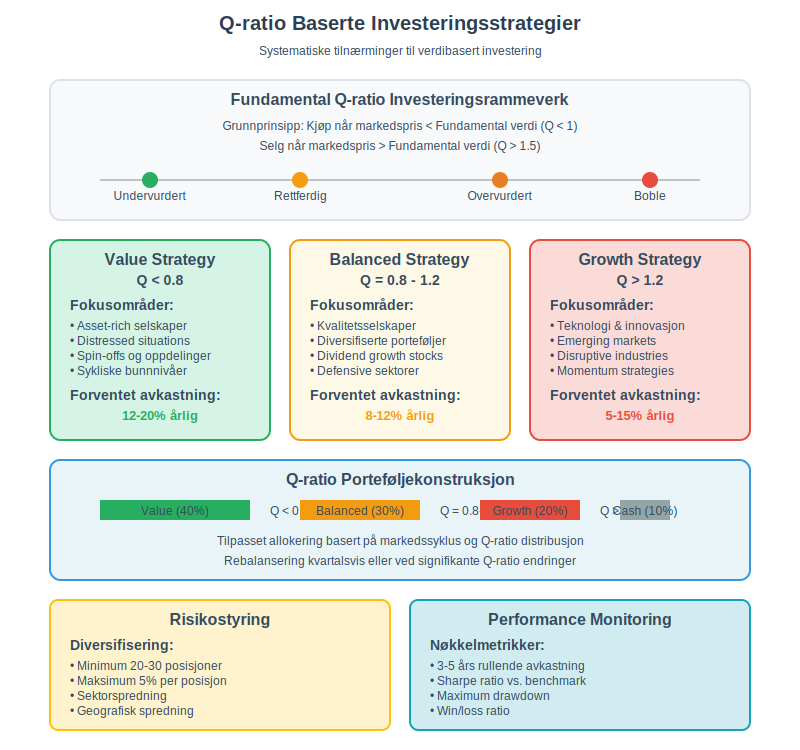
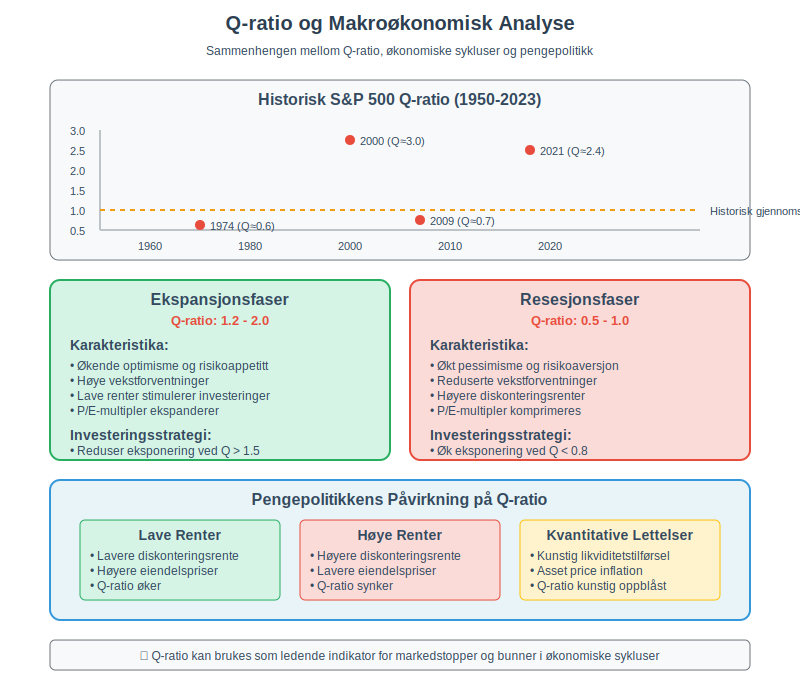
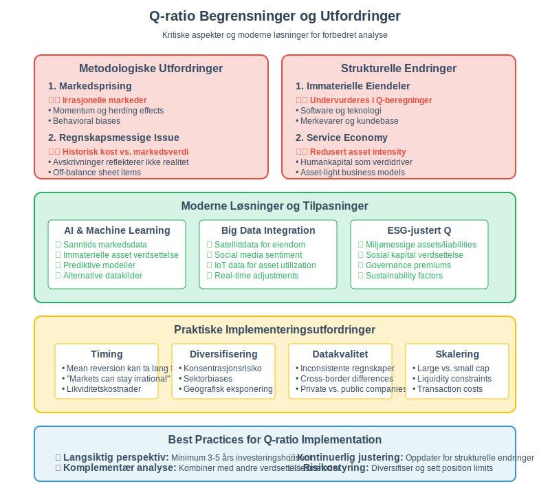
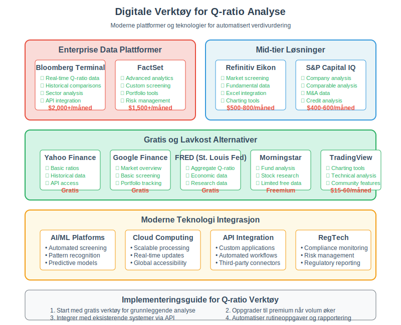

---
title: "Hva er Q-ratio (Tobin's Q)?"
seoTitle: "Hva er Q-ratio (Tobin's Q)?"
description: '**Q-ratio**, også kjent som **Tobins Q**, er et av de mest verdifulle verktøyene innen finansiell analyse og verdivurdering. Dette nøkkeltallet sammenligner...'
---

**Q-ratio**, også kjent som **Tobin's Q**, er et av de mest verdifulle verktøyene innen finansiell analyse og verdivurdering. Dette nøkkeltallet sammenligner et selskaps markedsverdi med den bokførte verdien av dets [eiendeler](/blogs/regnskap/hva-er-eiendel "Hva er Eiendel i Regnskap? Komplett Guide til Eiendom og Verdier"), og gir viktig innsikt i om selskapet er over- eller undervurdert i markedet. Utviklet av den nobelprisvinnende økonomen James Tobin, har dette målet blitt et fundamentalt verktøy for investorer, analytikere og ledelse.

## Seksjon 1: Q-ratioens Grunnleggende Konsept

Q-ratio uttrykker forholdet mellom markedsverdien av et selskap og **gjenanskaffelseskostnaden** av dets fysiske [eiendeler](/blogs/regnskap/hva-er-eiendel "Hva er Eiendel i Regnskap? Komplett Guide til Eiendom og Verdier"). Den grunnleggende formelen er:

**Q-ratio = Markedsverdi av selskapet / Bokført verdi av eiendeler**

### 1.1 Teoretisk Fundament

James Tobin introduserte dette konseptet i 1969 med følgende logikk:
- Hvis Q > 1: Selskapet er **overvurdert** - markedet verdsetter selskapets [eiendeler](/blogs/regnskap/hva-er-eiendel "Hva er Eiendel i Regnskap? Komplett Guide til Eiendom og Verdier") høyere enn hva det ville koste å erstatte dem
- Hvis Q < 1: Selskapet er **undervurdert** - det ville være billigere å kjøpe selskapet enn å bygge opp tilsvarende [eiendeler](/blogs/regnskap/hva-er-eiendel "Hva er Eiendel i Regnskap? Komplett Guide til Eiendom og Verdier") fra bunnen av
- Hvis Q = 1: Selskapet er **rettferdig verdsatt** - markedsverdien reflekterer den reelle verdien av [eiendelene](/blogs/regnskap/hva-er-eiendel "Hva er Eiendel i Regnskap? Komplett Guide til Eiendom og Verdier")

### 1.2 Q-ratioens Praktiske Betydning

Q-ratio fungerer som en **verdimåler** som hjelper til med:
- Identifisering av investerings- og oppkjøpsmuligheter
- Vurdering av selskapets strategiske posisjoner
- Analyse av markedseffektivitet og bobler
- Beslutninger om [kapitalallokering](/blogs/regnskap/hva-er-kapital "Hva er Kapital? Komplett Guide til Kapitalformer og Kapitalforvaltning")

## Seksjon 2: Detaljert Beregning av Q-ratio

### 2.1 Beregning av Markedsverdi

**Markedsverdien** av selskapet beregnes som:

Markedsverdi = (Antall aksjer × Aksjekurs) + Markedsverdi av gjeld

For børsnoterte selskaper:
- **Aksjenes markedsverdi:** Antall utestående aksjer multiplisert med gjeldende aksjekurs
- **Gjeldens markedsverdi:** For likvide obligasjoner brukes markedspris, for annen gjeld brukes ofte [bokført verdi](/blogs/regnskap/hva-er-bokfort-verdi "Hva er Bokført Verdi? Komplett Guide til Verdsettelse i Regnskap")

### 2.2 Beregning av Bokført Verdi av Eiendeler

Den **bokførte verdien av [eiendeler](/blogs/regnskap/hva-er-eiendel "Hva er Eiendel i Regnskap? Komplett Guide til Eiendom og Verdier")** hentes fra [balansen](/blogs/regnskap/hva-er-balanse "Hva er Balanse i Regnskap? Komplett Guide til Balansens Oppbygging og Funksjon") og inkluderer:

| **Eiendelstype** | **Inkludert i Q-ratio** | **Kommentarer** |
|------------------|-------------------------|-----------------|
| [Anleggsmidler](/blogs/regnskap/hva-er-anleggsmidler "Hva er Anleggsmidler? Komplett Guide til Faste Eiendeler") | ✓ | Bygninger, maskiner, utstyr |
| Immaterielle eiendeler | ✓ | Patenter, varemerker, [goodwill](/blogs/regnskap/hva-er-goodwill "Hva er Goodwill? Komplett Guide til Immaterielle Eiendeler") |
| [Varelager](/blogs/regnskap/hva-er-varelager "Hva er Varelager? En Komplett Guide til Lagerføring og Verdivurdering") | ✓ | Råvarer, ferdigvarer |
| [Fordringer](/blogs/regnskap/hva-er-fordringer "Hva er Fordringer? Komplett Guide til Kundefordringer og Andre Fordringer") | ✓ | [Kundefordringer](/blogs/regnskap/hva-er-debitor "Hva er Debitor i Regnskap? Komplett Guide til Kundefordringer og Debitorhåndtering"), andre fordringer |
| Kontanter | ✓ | [Bankinnskudd](/blogs/regnskap/hva-er-bankinnskudd "Hva er Bankinnskudd? Komplett Guide til Bankinnskudd i Regnskap"), likvide midler |

### 2.3 Praktisk Beregningseksempel

La oss se på et praktisk eksempel for selskapet "TechCorp AS":

**Markedsdata:**
- Antall utestående aksjer: 1.000.000
- Aksjekurs: NOK 150
- Markedsverdi gjeld: NOK 50.000.000

**Balansedata:**
- Totale [eiendeler](/blogs/regnskap/hva-er-eiendel "Hva er Eiendel i Regnskap? Komplett Guide til Eiendom og Verdier"): NOK 180.000.000

**Beregning:**
- Markedsverdi aksjer: 1.000.000 × NOK 150 = NOK 150.000.000
- Total markedsverdi: NOK 150.000.000 + NOK 50.000.000 = NOK 200.000.000
- **Q-ratio = NOK 200.000.000 / NOK 180.000.000 = 1,11**

Dette indikerer at selskapet er lett **overvurdert** i markedet.

## Seksjon 3: Q-ratioens Varianter og Justeringer

### 3.1 Simple Q vs. Marginal Q

**Simple Q** (som vi har diskutert):
- Bruker total markedsverdi og total [eiendelsverdi](/blogs/regnskap/hva-er-eiendel "Hva er Eiendel i Regnskap? Komplett Guide til Eiendom og Verdier")
- Enklere å beregne og mest brukt i praksis

**Marginal Q**:

- Fokuserer på verdiskapning av nye investeringer
- Teoretisk mer korrekt, men vanskelig å beregne

### 3.2 Justert Q-ratio

Moderne analytikere foretar ofte justeringer for:

#### Immaterielle Eiendeler
- Mange selskaper har betydelige **immaterielle [eiendeler](/blogs/regnskap/hva-er-eiendel "Hva er Eiendel i Regnskap? Komplett Guide til Eiendom og Verdier")** som ikke er fullstendig reflektert i [balansen](/blogs/regnskap/hva-er-balanse "Hva er Balanse i Regnskap? Komplett Guide til Balansens Oppbygging og Funksjon")
- F.eks. merkevare, kundebase, proprietary teknologi

#### Inflasjonsjusteringer
- **Historisk kost** vs. **gjenanskaffelseskost**
- Spesielt relevant for selskaper med gamle [anleggsmidler](/blogs/regnskap/hva-er-anleggsmidler "Hva er Anleggsmidler? Komplett Guide til Faste Eiendeler")

| **Justeringstype** | **Påvirkning på Q** | **Når relevant** |
|-------------------|-------------------|------------------|
| Inflasjonsjustering | Reduserer Q | Høy inflasjon, gamle eiendeler |
| Immaterielle eiendeler | Øker Q | Teknologi-, service-selskaper |
| Off-balance sheet items | Varierer | Operasjonell leasing, JV |

## Seksjon 4: Tolkning og Analyse av Q-ratio

### 4.1 Q-ratio Nivåer og Betydning

**Q > 1,5:** **Betydelig overvurdert**
- Kan indikere markedsboble eller ekstraordinære vekstforventninger
- Risiko for kurskorreksjon
- Mulighet for å selge [eiendeler](/blogs/regnskap/hva-er-eiendel "Hva er Eiendel i Regnskap? Komplett Guide til Eiendom og Verdier") med fortjeneste

**Q = 1,2-1,5:** **Moderat overvurdert**
- Normale forhold for vekstselskaper
- Markedet priser inn fremtidig verdiskapning
- Fortsatt rom for verdistigning

**Q = 0,8-1,2:** **Rettferdig verdsatt**
- Markedspris reflekterer [eiendelenes](/blogs/regnskap/hva-er-eiendel "Hva er Eiendel i Regnskap? Komplett Guide til Eiendom og Verdier") reelle verdi
- Balansert risiko/avkastning-profil

**Q < 0,8:** **Undervurdert**
- Potensielle oppkjøpskandidater
- Mulighet for aktivistinvestorer
- [Asset stripping](/blogs/regnskap/hva-er-salg-av-eiendeler "Hva er Salg av Eiendeler? Regnskapsføring og Skattemessige Konsekvenser") kan være lønnsomt

### 4.2 Bransjespesifikke Faktorer

Q-ratio må tolkes i **bransjekontekst**:

#### Kapitalintensive Bransjer (Q = 0,6-1,2)
- Olje & gass, gruvedrift, shipping
- Høye infrastrukturinvesteringer
- Sykliske markedsforhold

#### Teknologibransjer (Q = 1,5-3,0)
- Software, biotech, fintech
- Høy andel immaterielle [eiendeler](/blogs/regnskap/hva-er-eiendel "Hva er Eiendel i Regnskap? Komplett Guide til Eiendom og Verdier")
- Vekstpremium i markedet

#### Servicebransjer (Q = 1,0-2,0)
- Konsulentvirksomhet, finans
- Lav [eiendelsintensitet](/blogs/regnskap/hva-er-anleggsmidler "Hva er Anleggsmidler? Komplett Guide til Faste Eiendeler")
- Humankapital som verdidriver

## Seksjon 5: Q-ratio som Investeringsstrategi

### 5.1 Value Investing med Q-ratio

**Benjamin Graham** og **Warren Buffett** har brukt Q-lignende prinsipper:

* **"Cigar butt" investeringer:** Selskaper som handles under [eiendelsverdien](/blogs/regnskap/hva-er-eiendel "Hva er Eiendel i Regnskap? Komplett Guide til Eiendom og Verdier")
* **Asset play:** Kjøp selskaper med Q < 1 for å realisere skjult verdi
* **Margin of safety:** Q-ratio som risikojustering

### 5.2 Oppkjøpsstrategier

Q-ratio brukes aktivt i **M&A-analyser**:

#### Strategiske Oppkjøp
- Kjøp av konkurrenter med Q < 1
- Synergieffekter kan øke verdien
- Konsolidering av fragmenterte bransjer

#### Finansielle Oppkjøp (Private Equity)
- **Leveraged buyouts** av undervurderte selskaper
- [Eiendelsalg](/blogs/regnskap/hva-er-salg-av-eiendeler "Hva er Salg av Eiendeler? Regnskapsføring og Skattemessige Konsekvenser") for å finansiere oppkjøpet
- Operasjonelle forbedringer for verdiskaping

| **Q-ratio Range** | **Oppkjøpsstrategi** | **Forventet Avkastning** |
|------------------|---------------------|------------------------|
| Q < 0,6 | Asset stripping | 15-25% |
| Q = 0,6-0,8 | Operasjonell forbedring | 10-18% |
| Q = 0,8-1,0 | Strategiske synergi | 8-15% |
| Q > 1,0 | Premium for kontroll | 5-12% |

### 5.3 Porteføljekonstruksjon

**Akademisk forskning** viser at Q-baserte strategier kan gi **meravkastning**:

* **Lav-Q porteføljer** har historisk outperformed høy-Q porteføljer
* **Mean reversion:** Q-ratioer tenderer mot 1 over tid
* **Risikojustert avkastning** er ofte bedre for lav-Q strategier

## Seksjon 6: Q-ratio og Makroøkonomisk Analyse

### 6.1 Markedsverdsettelse

Q-ratio brukes til å vurdere **hele markeders** verdsettelse:

**USA S&P 500 Q-ratio:**
- Historisk gjennomsnitt: ~1,0
- Toppnivåer (2000, 2021): >2,0
- Bunnivåer (1974, 2009): <0,6

### 6.2 Økonomiske Sykluser

Q-ratio følger **økonomiske sykluser**:

#### Ekspansjonsfaser
- Q-ratio stiger over 1
- Optimisme og høye vekstforventninger
- [Kapitalallokering](/blogs/regnskap/hva-er-kapital "Hva er Kapital? Komplett Guide til Kapitalformer og Kapitalforvaltning") til nye investeringer

#### Resesjonsfaser  
- Q-ratio faller under 1
- Pessimisme og reduserte vekstforventninger
- **Verdiskapningsmuligheter** for langsiktige investorer

### 6.3 Pengepolitikk og Q-ratio

**Sentralbankpolitikk** påvirker Q-ratio gjennom:

* **Lave renter:** Øker Q-ratio (lavere diskonteringsrente)
* **Høye renter:** Reduserer Q-ratio (høyere diskonteringsrente)
* **Kvantitative lettelser:** Kunstig oppblåst Q-ratio

## Seksjon 7: Begrensninger og Kritikk av Q-ratio

### 7.1 Metodologiske Utfordringer

#### Markedspriseffektivitet
- **Irrasjonelle markeder** kan gi feilaktige Q-ratioer
- **Momentum** og trendeffekter påvirker verdier
- **Likviditetspremier** i små markeder

#### Regnskapsmessige Begrensninger
- **Historisk kost** vs. markedsverdi av [eiendeler](/blogs/regnskap/hva-er-eiendel "Hva er Eiendel i Regnskap? Komplett Guide til Eiendom og Verdier")
- **Avskrivninger** reflekterer ikke alltid reell verdireduksjon
- **Off-balance sheet items** ikke inkludert

### 7.2 Strukturelle Endringer i Økonomien

#### Immaterielle Eiendeler
Moderne økonomi er dominert av **immaterielle [eiendeler](/blogs/regnskap/hva-er-eiendel "Hva er Eiendel i Regnskap? Komplett Guide til Eiendom og Verdier")**:

- Software og teknologi
- Merkevarer og kundebase  
- Forskning og utvikling
- Organisasjonskapital

Disse **undervurderes** ofte i tradisjonelle Q-ratio beregninger.

#### Servicetunge Økonomier
- Redusert [eiendelsintensitet](/blogs/regnskap/hva-er-anleggsmidler "Hva er Anleggsmidler? Komplett Guide til Faste Eiendeler")
- **Humankapital** som hovedverdidriver
- Sharing economy og asset-light modeller

### 7.3 Timing og Implementering

| **Utfordring** | **Løsning** | **Implementering** |
|---------------|------------|-------------------|
| Markedstiming | Langsiktig perspektiv | 3-5 års horisont |
| Likviditetskostnader | Gradvis posisjonering | Dollar cost averaging |
| Konsentrasjonsrisiko | Diversifisering | Sektorspredning |

## Seksjon 8: Q-ratio i Praksis: Case Studies

### 8.1 Case 1: Japanske Boble (1989)

**Situasjon:**
- Nikkei Q-ratio på ~4,0
- Ekstrem overvurdering av eiendom og aksjer

**Resultat:**
- 80% kursfall over neste tiår
- Mean reversion til Q ≈ 1,0

### 8.2 Case 2: Dotcom-boblen (2000)

**Teknologisektoren:**
- Q-ratioer på 10-50 for vekstselskaper
- Irrasjonell optimisme om internett-ødegard

**Lærdom:**
- Selv [immaterielle eiendeler](/blogs/regnskap/hva-er-goodwill "Hva er Goodwill? Komplett Guide til Immaterielle Eiendeler") har grenser
- **Fundamentalanalyse** bør komplettere Q-ratio

### 8.3 Case 3: Finanskrisen (2008-2009)

**Banksektoren:**
- Q-ratioer under 0,5
- Markedet priset inn systemrisiko

**Opportuniteter:**
- Langsiktige investorer som kjøpte ved Q < 0,6 så betydelig [avkastning](/blogs/regnskap/hva-er-avkastning "Hva er Avkastning på Investering? Beregning og Analyse av ROI")

## Seksjon 9: Moderne Anvendelser og Digitale Verktøy

### 9.1 Automatiserte Q-ratio Beregninger

**Finansielle databaser** tilbyr sanntids Q-ratio data:
- Bloomberg Terminal
- FactSet
- Thomson Reuters Eikon
- Gratis alternativer: Yahoo Finance, Google Finance

### 9.2 Integrering med Moderne Porteføljeteori

Q-ratio kombineres med:
- **Faktormodeller** (størrelse, verdi, kvalitet)
- **ESG-kriterier** for bærekraftig investering
- **Algoritmisk handel** og kvantitative strategier

### 9.3 RegTech og Compliance

**Regulatorisk rapportering** bruker Q-ratio for:
- Systemrisiko-overvåking
- **Makroprudensielle** tiltak
- Boble-deteksjon i finansmarkeder

## Seksjon 10: Fremtiden for Q-ratio

### 10.1 Evolusjon i Beregningsmetoder

**Kunstig intelligens** og maskinlæring brukes til:
- Forbedret verdsettelse av [immaterielle eiendeler](/blogs/regnskap/hva-er-goodwill "Hva er Goodwill? Komplett Guide til Immaterielle Eiendeler")  
- **Sanntids justering** for markedsforhold
- Prediktive modeller for Q-ratio utvikling

### 10.2 Alternative Datakilder

**Big data** utvider Q-ratio grunnlaget:
- Satellittdata for eiendomsverdier
- **Social media sentiment** for merkeverdier
- IoT-data for [anleggsmiddel](/blogs/regnskap/hva-er-anleggsmidler "Hva er Anleggsmidler? Komplett Guide til Faste Eiendeler") utnyttelse

### 10.3 ESG-justert Q-ratio

**Bærekraftige investeringer** krever utvidede målinger:
- Miljømessige [eiendeler](/blogs/regnskap/hva-er-eiendel "Hva er Eiendel i Regnskap? Komplett Guide til Eiendom og Verdier") og forpliktelser
- **Sosial kapital** og omdømme
- Governance-premiums i verdsettelsen

## Konklusjon

Q-ratio (Tobin's Q) forblir et av de mest verdifulle verktøyene for **finansiell analyse** og verdivurdering. Ved å sammenligne markedsverdi med [eiendelsverdier](/blogs/regnskap/hva-er-eiendel "Hva er Eiendel i Regnskap? Komplett Guide til Eiendom og Verdier"), gir det viktig innsikt i markedseffektivitet, investeringsmuligheter og økonomiske sykluser.

**Nøkkelinnsikter:**

* **Langsiktig perspektiv:** Q-ratio fungerer best over lengre tidshorisonter
* **Bransjekontekst:** Tolkning må skje i relevant bransjekontekst  
* **Komplementær analyse:** Bør kombineres med andre finansielle [nøkkeltall](/blogs/regnskap/hva-er-nokkeltall "Hva er Nøkkeltall? Komplett Guide til Finansielle Nøkkeltall i Regnskap")
* **Strukturell evolusjon:** Metoden må tilpasses moderne økonomi

**Praktisk anvendelse:**

For investorer, analytikere og bedriftsledere er Q-ratio et kraftfullt verktøy for:
- **Identifisering** av over- og undervurderte muligheter
- **Porteføljekonstruksjon** med langsiktig fokus
- **Risikostyring** gjennom markedssyklusene  
- **Strategisk planlegging** av [kapitalallokering](/blogs/regnskap/hva-er-kapital "Hva er Kapital? Komplett Guide til Kapitalformer og Kapitalforvaltning")

Som økonomen James Tobin selv påpekte, representerer Q-ratio et fundamentalt prinsipp i finansiell økonomi: på lang sikt vil markedskrefter drive verdier mot deres grunnleggende, økonomiske fundament. Ved å forstå og anvende dette prinsippet kan investorer og bedriftsledere ta mer informerte beslutninger i et stadig mer komplekst finansielt landskap.

Q-ratio er ikke bare et [nøkkeltall](/blogs/regnskap/hva-er-nokkeltall "Hva er Nøkkeltall? Komplett Guide til Finansielle Nøkkeltall i Regnskap") - det er en filosofi om verdivurdering som setter fokus på den grunnleggende sammenhengen mellom reelle [eiendeler](/blogs/regnskap/hva-er-eiendel "Hva er Eiendel i Regnskap? Komplett Guide til Eiendom og Verdier") og markedsprising. I en tid preget av volatile markeder og raske strukturelle endringer, forblir dette perspektivet mer relevant enn noensinne.

