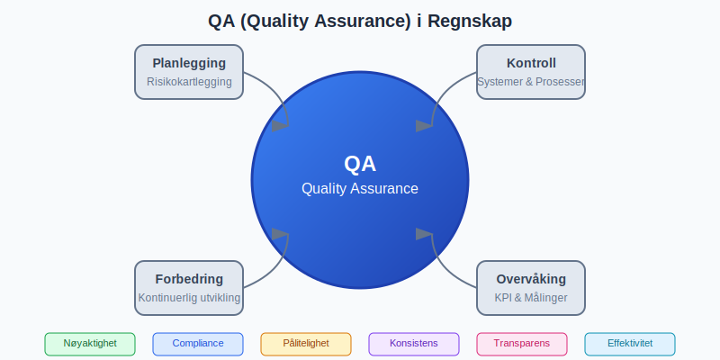
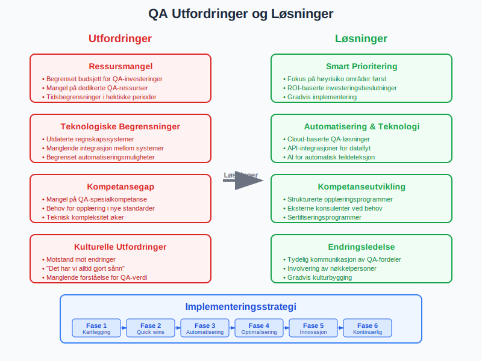

**QA (Quality Assurance)** i regnskap er en systematisk tilnærming til å sikre at regnskapsdata, prosesser og rapporter oppfyller høye standarder for nøyaktighet, compliance og pålitelighet. Dette omfatter kontrollsystemer, prosedyrer og verktøy som skal sikre at finansiell informasjon er korrekt, komplett og presentert i henhold til gjeldende regnskapsstandarder og juridiske krav.

## Seksjon 1: Grunnleggende om QA i Regnskap

### 1.1 Definisjon og Formål

**QA (Quality Assurance)** i regnskapssammenheng handler om å implementere systematiske kontroller og prosedyrer som sikrer:

* **Nøyaktighet** i regnskapsdata og rapporter
* **Compliance** med regnskapsstandarder og lovgivning
* **Konsistens** i regnskapsbehandling over tid
* **PÃ¥litelighet** i finansiell rapportering
* **Transparens** overfor interessenter

### 1.2 QA vs. QC (Quality Control)

Det er viktig å skille mellom QA og QC:

* **Quality Assurance (QA):** Forebyggende tiltak og systemorienterte prosesser
* **Quality Control (QC):** Deteksjonsbaserte kontroller og korrigerende tiltak
* **Sammen:** Skaper et helhetlig kvalitetssystem

## Seksjon 2: Komponenter i QA-systemet

### 2.1 Interne Kontroller

[Internkontroll](/blogs/regnskap/hva-er-internkontroll "Hva er Internkontroll? Komplett Guide til Interne Kontrollsystemer") utgjør grunnmuren i QA:

* **Segregering av arbeidsoppgaver**
* **Autorisasjonshierarkier** og [attestering](/blogs/regnskap/hva-er-attestering "Hva er Attestering? Komplett Guide til Attestasjonsprosesser")
* **Dokumentasjonskrav** for alle transaksjoner
* **Periodiske avstemminger** og kontroller

### 2.2 Prosesstyring og Standardisering

Standardiserte prosesser sikrer konsistent kvalitet:

* **Standardiserte arbeidsflyter** for regnskapsføring
* **Klare ansvarsfordelinger** og roller
* **Dokumenterte prosedyrer** og rutiner
* **Kvalitetsmanualer** og retningslinjer

### 2.3 Kontrollpunkter og Milepæler

Strategisk plasserte kontrollpunkter sikrer kvalitet:

| **Kontrollpunkt** | **Tidspunkt** | **Ansvarlig** | **Formål** |
|-------------------|---------------|---------------|------------|
| Bilagsregistrering | Ved mottak | Regnskapsmedarbeider | Kontroll av fullstendighet |
| MÃ¥nedsavslutning | MÃ¥nedsslutt | Regnskapsansvarlig | [Avstemming](/blogs/regnskap/hva-er-avstemming "Hva er Avstemming i Regnskap? Komplett Guide til Regnskapsavstemming") og kontroll |
| Kvartalsrapport | Kvartalsvis | Regnskapssjef | Analyser og nøkkeltall |
| Årsavslutning | Årsslutt | Autorisert regnskapsfører | Komplett gjennomgang |

## Seksjon 3: QA-prosessen i Praksis

### 3.1 Planlegging og Risikovurdering

Effektiv QA starter med grundig planlegging:

* **Identifikasjon** av kritiske områder og risikoer
* **Kartlegging** av regnskapsprosesser
* **Vurdering** av eksisterende kontroller
* **Prioritering** av QA-tiltak

### 3.2 Implementering av Kontroller

Systematisk implementering sikrer dekning:

* **Preventive kontroller:** Forhindrer feil før de oppstår
* **Detektive kontroller:** Oppdager feil som har oppstått
* **Korrigerende kontroller:** Retter opp identifiserte feil
* **Kompenserende kontroller:** Erstatter manglende kontroller

### 3.3 Overvåking og Oppfølging

Kontinuerlig overvåking sikrer effektivitet:

* **Månedlige gjennomganger** av nøkkeltall
* **Kvartalsvise evalueringer** av kontrolleffektivitet
* **Ã…rlige gjennomganger** av QA-systemet
* **Kontinuerlig forbedring** basert på erfaringer

## Seksjon 4: Digitale Verktøy og Teknologi

### 4.1 Automatiserte Kontroller

Moderne regnskapssystemer tilbyr omfattende QA-funksjoner:

* **Automatisk [avstemming](/blogs/regnskap/hva-er-avstemming "Hva er Avstemming i Regnskap? Komplett Guide til Regnskapsavstemming")** av kontoer
* **Regelhåndtering** og validering
* **Avviksrapportering** i sanntid
* **Workflow-styring** og godkjenninger

### 4.2 Data Analytics og AI

Avanserte teknologier utvider QA-mulighetene:

* **Kontinuerlig overvåking** av transaksjoner
* **Anomalidetekning** ved hjelp av algoritmer
* **Prediktiv analyse** for risikostyring
* **Intelligent rapportering** og dashboards

### 4.3 Integrerte QA-systemer

Helhetlige løsninger kombinerer flere funksjoner:

* **ERP-integrerte** kvalitetsmoduler
* **Risikostyringsplattformer**
* **Compliance-verktøy**
* **Auditspor** og dokumentasjon

## Seksjon 5: Regelverk og Compliance

### 5.1 Juridiske Krav

QA må sikre overholdelse av relevante regelverk:

* **[Bokføringsloven](/blogs/regnskap/hva-er-bokforingsloven "Hva er Bokføringsloven? Komplett Guide til Norsk Bokføringsregelverk")** og forskrifter
* **[Regnskapsloven](/blogs/regnskap/hva-er-regnskapsloven "Hva er Regnskapsloven? Komplett Guide til Norsk Regnskapslovgivning")** og standarder
* **Bransjespesifikke** reguleringer
* **Internasjonale standarder** (IFRS, GAAP)

### 5.2 Revisjons- og Tilsynskrav

QA støtter eksterne kontroller:

* **[Revisjonssamarbeid](/blogs/regnskap/hva-er-revisor "Hva er Revisor? Komplett Guide til Revisjon og Revisorrolle")** og dokumentasjon
* **Tilsynsmyndigheters** krav og rapportering
* **Skattemyndigheters** kontroller
* **Finanstilsynets** reguleringer

### 5.3 Internasjonale Standarder

For multinasjonale selskaper:

* **SOX-compliance** (Sarbanes-Oxley)
* **IFRS-rapportering**
* **COSO-rammeverket**
* **ISO-standarder** for kvalitetsstyring

## Seksjon 6: QA-roller og Ansvarsområder

### 6.1 Organisering av QA-funksjonen

Effektiv QA krever klar ansvarsfordeling:

| **Rolle** | **Ansvar** | **Kompetansekrav** |
|-----------|------------|-------------------|
| QA-ansvarlig | Overordnet ansvar for kvalitetssystem | Regnskapsutdanning, QA-sertifisering |
| Regnskapsansvarlig | Daglig kvalitetskontroll | Autorisasjon, praktisk erfaring |
| Kontrollfunksjon | Uavhengig kontroll og testing | Revisjonsbakgrunn, analytiske ferdigheter |
| IT-ansvarlig | Systemkontroller og sikkerhet | IT-kompetanse, regnskapsforståelse |

### 6.2 Kompetanseutvikling

Kontinuerlig opplæring sikrer kvalitet:

* **Regelmessig oppdatering** på regelverk
* **Teknisk trening** på nye systemer
* **Kvalitetsledelse** og prosessforbedring
* **Bransjespesifikk** kompetanse

### 6.3 Eksterne Ressurser

NÃ¥r intern kapasitet ikke strekker til:

* **Konsulentbistand** for spesialistområder
* **Outsourcing** av QA-funksjoner
* **Samarbeid** med [autoriserte regnskapsførere](/blogs/regnskap/hva-er-ars "Hva er ARS? Komplett Guide til Autoriserte Regnskapsføreres Rolle")
* **Benchmarking** mot beste praksis

## Seksjon 7: MÃ¥linger og KPI-er

### 7.1 Kvalitetsindikatorer

Systematisk måling av QA-effektivitet:

* **Feilfrekvens** i regnskapsdata
* **Avvikshåndtering** og responstid
* **Compliance-score** og overholdelsesgrad
* **Kunde-/bruker-tilfredshet**

### 7.2 Finansielle MÃ¥linger

QA-investeringer må kunne rettferdiggjøres:

* **Kostnader** ved kvalitetsarbeid
* **Besparelser** fra feilreduksjon
* **Risikokostnader** og potensielle tap
* **ROI** på QA-investeringer

### 7.3 Kontinuerlig Forbedring

Brukar målinger til forbedring:

* **Trend-analyser** og utviklingsmønstre
* **Root cause analysis** av systemfeil
* **Benchmark-studier** mot andre organisasjoner
* **Innovasjon** og nye løsninger

## Seksjon 8: Utfordringer og Løsninger

### 8.1 Vanlige QA-utfordringer

Organisasjoner møter typiske hindringer:

* **Ressursmangel** og tidsbegrensninger
* **Teknologiske** begrensninger og systemproblemer
* **Kompetansegap** og opplæringsbehov
* **Kulturelle** motstandskrefter mot endring

### 8.2 Løsningsstrategier

Praktiske tilnærminger til utfordringer:

* **Prioritering** av kritiske områder
* **Automatisering** av rutineoppgaver
* **Kompetanseplanlegging** og rekruttering
* **Endrings-ledelse** og kulturbygging

### 8.3 Risikostyring

QA som del av helhetlig risikostyring:

* **Identifikasjon** av operasjonelle risikoer
* **Vurdering** av sannsynlighet og konsekvenser
* **Tiltak** for risikoreduksjon
* **Kontinuerlig overvåking** av risikoutvikling

## Seksjon 9: Bransjespesifikke Hensyn

### 9.1 Finansielle Institusjoner

Særlige krav for banker og forsikring:

* **Basel-rammeverket** og kapitaldekning
* **Solvens-reguleringer**
* **Stresstesting** og scenarioanalyser
* **Rapportering** til finansielle myndigheter

### 9.2 Børsnoterte Selskaper

Ekstra transparenskrav:

* **Kvartalsrapportering** og frister
* **Investor relations** og kommunikasjon
* **SOX-compliance** og internkontroll
* **[ESG-rapportering](/blogs/regnskap/hva-er-esg "Hva er ESG? Komplett Guide til Miljø, Samfunn og Selskapsstyring")** og bærekraft

### 9.3 SMB-tilpasninger

QA for små og mellomstore bedrifter:

* **Skalerbare** løsninger og prosesser
* **Kostnadseffektive** verktøy og metoder
* **Outsourcing-muligheter** og partnerskaper
* **Enkle** rapporteringsløsninger

## Seksjon 10: Fremtidens QA i Regnskap

### 10.1 Teknologiske Trender

Nye teknologier som påvirker QA:

* **Kunstig intelligens** og maskinlæring
* **Blockchain** og distributed ledgers
* **Cloud-baserte** løsninger og SaaS
* **Mobile** plattformer og sanntidsrapportering

### 10.2 Regulatoriske Utviklinger

Endringer i regelverk og standarder:

* **Digitalisering** av rapporteringskrav
* **Sanntidsrapportering** til myndigheter
* **Økt fokus** på cybersikkerhet
* **Miljø- og bærekraft** rapportering

### 10.3 Nye Forretningsmodeller

QA tilpasser seg endrede behov:

* **Subscription-baserte** tjenester
* **Platform-økonomi** og digitale markeder
* **Remote work** og distribuerte team
* **Agile** metodikker og kontinuerlig levering

## Seksjon 11: Implementering av QA-system

### 11.1 Faseinndeling

Strukturert tilnærming til implementering:

**Fase 1: Kartlegging og Analyse**
* NÃ¥situasjon-analyse
* Gap-identifikasjon
* Risikokartlegging
* Behovsanalyse

**Fase 2: Design og Planlegging**
* QA-systemdesign
* Prosessdokumentasjon
* Implementeringsplan
* Ressursallokering

**Fase 3: Implementering**
* Pilotprosjekter
* Gradvis utrulling
* Opplæring og endringsledelse
* Systemtesting

**Fase 4: Stabilisering**
* Overvåking og justering
* Kontinuerlig forbedring
* Erfaringsdeling
* Dokumentasjon av læring

### 11.2 Suksessfaktorer

Kritiske elementer for vellykket implementering:

* **Ledelsesforankring** og støtte
* **Brukerinvolvering** fra start
* **Realistiske** tidsrammer og forventninger
* **Tilstrekkelige** ressurser og kompetanse

### 11.3 Vanlige Fallgruver

Hva man bør unngå:

* **Overvurdere** teknologiens rolle
* **Undervurdere** kulturelle utfordringer
* **Mangelfull** kommunikasjon og opplæring
* **For ambisiøse** mål i første fase

## Konklusjon

**QA (Quality Assurance)** i regnskap er ikke bare en operasjonell nødvendighet, men en strategisk fordel som kan bidra til:

* **Økt tillit** fra interessenter og myndigheter
* **Reduserte kostnader** gjennom feilforebygging
* **Bedre beslutningsgrunnlag** basert på pålitelige data
* **Styrket konkurranseevne** gjennom effektive prosesser

En effektiv QA-tilnærming kombinerer:

* **Systematiske prosesser** og kontroller
* **Moderne teknologi** og verktøy
* **Kompetente medarbeidere** og klare ansvarsforhold
* **Kontinuerlig forbedring** og tilpasning

For å oppnå varig suksess med QA i regnskap, må organisasjoner fokusere på:

* **Holistisk tilnærming** som integrerer QA i alle prosesser
* **Proaktiv holdning** med fokus på forebygging fremfor reparasjon
* **Fleksibilitet** til å tilpasse seg endringer i regelverk og teknologi
* **Målorientert** arbeid med klare KPI-er og oppfølging

QA er en investering i organisasjonens troverdighet, effektivitet og fremtidige bærekraft. Ved å implementere robuste kvalitetssikringssystemer, legger organisasjoner grunnlaget for pålitelig finansiell rapportering og bedre [internkontroll](/blogs/regnskap/hva-er-internkontroll "Hva er Internkontroll? Komplett Guide til Interne Kontrollsystemer").

I en verden hvor digitalisering og automatisering endrer regnskapsbransjen, vil QA fortsette å være en kritisk suksessfaktor for organisasjoner som ønsker å opprettholde høy kvalitet og compliance i sin finansielle rapportering. Dette krever både teknologisk innovasjon og menneskelig ekspertise - en kombinasjon som vil definere fremtidens regnskapsføring.

