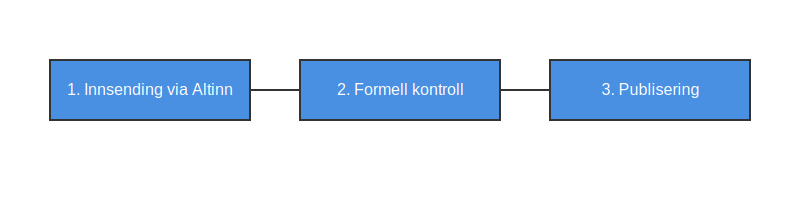

---
title: "Hva er Regnskapsregisteret?"
meta_title: "Hva er Regnskapsregisteret?"
meta_description: '**Regnskapsregisteret** er et offentlig register som administreres av [Brønnøysundregistrene](/blogs/regnskap/bronnoysundregistrene "Hva er Brønnøysundregis...'
slug: hva-er-regnskapsregisteret
type: blog
layout: pages/single
---

**Regnskapsregisteret** er et offentlig register som administreres av [Brønnøysundregistrene](/blogs/regnskap/bronnoysundregistrene "Hva er Brønnøysundregistrene? En Guide til Norges Registerforvalter"). Registeret samler inn og offentliggjør årsregnskap fra norske foretak, noe som sikrer **åpenhet** og tilgjengelighet for myndigheter, kreditorer og publikum.

## Formål med Regnskapsregisteret

Regnskapsregisteret har flere viktige formål:

* **Offentliggjøring** av årsregnskap for norske foretak.
* **Datakilde** for myndigheter, banker og andre som trenger oversikt over selskapers økonomiske situasjon.
* **Transparens** og tillit i næringslivet ved at regnskapsdata er tilgjengelig for alle.

## Registreringsprosess

| **Trinn**       | **Beskrivelse**                                                      |
|-----------------|----------------------------------------------------------------------|
| Innsending      | Foretak leverer årsregnskap elektronisk via Altinn.                  |
| Kontroll        | Brønnøysundregistrene utfører formelle kontroller og kvalitetssikring. |
| Publisering     | Godkjente regnskaper publiseres i registeret og blir offentlige.     |
| Søk og hentning | Alle kan søke opp og laste ned årsregnskap fra offentlige søketjenester. |

## Krav til innlevering av årsregnskap

Foretak må følge kravene i bokføringsloven og regnskapsforskriften ved innlevering:

1. **Frister:** Årsregnskapet må sendes innen 31. juli året etter regnskapsåret.
2. **Format:** Regnskapet skal leveres i XBRL-format for maskinell lesing.
3. **Signatur:** Regnskapet må være elektronisk signert av regnskapsfører og daglig leder.
4. **Dokumenter:** Inkluder balanse, resultatregnskap, noter og eventuelle tilleggsopplysninger.

## Søk i Regnskapsregisteret

Regnskapsregisteret kan søkes via offentlige tjenester som Proff, Brreg.no og andre portaler. For å finne regnskap for et spesifikt foretak, søk på [organisasjonsnummer](/blogs/regnskap/hva-er-virksomhetsnummer "Hva er Virksomhetsnummer? Komplett Guide til Norsk Virksomhetsidentifikasjon").

## Se også

* [Hva er Brønnøysundregistrene?](/blogs/regnskap/bronnoysundregistrene "Hva er Brønnøysundregistrene? En Guide til Norges Registerforvalter")
* [Hva er Foretaksregisteret?](/blogs/regnskap/hva-er-foretaksregisteret "Hva er Foretaksregisteret? Komplett Guide til Foretaksregisteret i Norge")
* [Hva er Enhetsregisteret?](/blogs/regnskap/hva-er-enhetsregisteret "Hva er Enhetsregisteret? En Komplett Guide til Enhetsregisteret i Norge")
* [Hva er MVA-registeret?](/blogs/regnskap/hva-er-mva-registeret "Hva er MVA-registeret? Registreringsplikt for Merverdiavgift")

