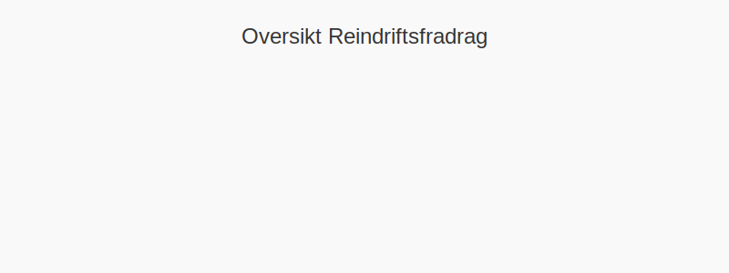

---
title: "Hva er reindriftsfradrag?"
meta_title: "Hva er reindriftsfradrag?"
meta_description: '**Reindriftsfradrag** er et særskilt **skattefradrag** for reindriftsnæringen i Norge. Denne artikkelen gir en detaljert gjennomgang av vilkår, beregning, do...'
slug: hva-er-reindriftsfradrag
type: blog
layout: pages/single
---

**Reindriftsfradrag** er et særskilt **skattefradrag** for reindriftsnæringen i Norge. Denne artikkelen gir en detaljert gjennomgang av vilkår, beregning, dokumentasjonskrav og regnskapsføring av reindriftsfradrag.

## Grunnleggende om Reindriftsfradrag

Reindriftsfradrag er regulert i skatteloven § 6-11 og skal kompensere for næringens sesongvariasjoner og driftskostnader.

## Vilkår for Reindriftsfradrag

For å ha rett til reindriftsfradrag må følgende vilkår være oppfylt:

* **Registrert reindriftsbruk** etter reindriftsloven
* **Dokumentert slakte- eller leverandørinntekt** fra rein
* **Godkjent driftsplan** av reindriftsmyndighetene

## Beregning av Reindriftsfradrag

Beregningsgrunnlaget for reindriftsfradrag tar utgangspunkt i slakteinntekter og dyretall. Følgende satser gjelder:

| Reindriftstype                       | Fradragssats | Maksimalt fradrag |
|--------------------------------------|--------------|-------------------|
| **Lav intensitet (< 100 dyr)**       | 30 %         | 150 000 kr        |
| **Middels intensitet (100“300 dyr)** | 25 %         | 250 000 kr        |
| **Høy intensitet (> 300 dyr)**       | 20 %         | Ingen øvre grense |

### Praktisk Beregningseksempel

**Eksempel “ Middels intensitet:**  
- Slakteinntekt: 400 000 kr  
- Fradrag: 400 000 × 25 % = **100 000 kr**

## Dokumentasjonskrav

Korrekt dokumentasjon er avgjørende for å få godkjent reindriftsfradrag:

* **Slakterabilag** som viser antall rein og inntekter
* **Driftsplan** godkjent av relevante myndigheter
* **Regnskapsbilag** for alle driftskostnader

## Regnskapsføring av Reindriftsfradrag

Reindriftsfradrag føres som et eget fradrag i resultatregnskapet, separat fra ordinære driftskostnader. Se også [Hva er Fradrag?](/blogs/regnskap/hva-er-fradrag "Hva er Fradrag i Regnskap? Komplett Guide til Skattefradrag og Regnskapsføring") for generell behandling av fradrag.

## Relaterte Artikler

* [Hva er jordbruksfradrag?](/blogs/regnskap/hva-er-jordbruksfradrag "Hva er Jordbruksfradrag? Komplett Guide til Landbruksfradrag og Skattefordeler")
* [Hva er skatt?](/blogs/regnskap/hva-er-skatt "Hva er Skatt? Komplett Guide til Skatteregler i Norge")

## Konklusjon

**Reindriftsfradrag** er et viktig virkemiddel for reindriftsnæringen for å sikre stabilitet og bærekraft. Ved å forstå regelverket, beregningsmetoder og dokumentasjonskrav kan reineiere optimalisere skatteposisjonen og investere i framtiden.

