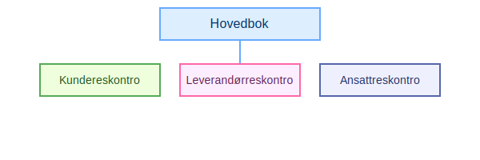
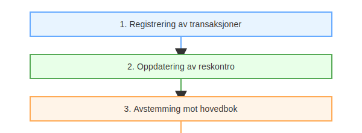

---
title: "Hva er reskontro?"
seoTitle: "Hva er reskontro?"
description: '**Reskontro** er et regnskapsmessig **underreskontro** til [hovedboken](/blogs/regnskap/hva-er-hovedbok "Hva er Hovedbok i Regnskap? Komplett Guide til Regnskap...'
summary: "Reskontro er en detaljert underkonto til hovedboken som sporer transaksjoner per kunde, leverandør og ansatt for bedre kontroll og avstemming."
---

**Reskontro** er et regnskapsmessig **underreskontro** til [hovedboken](/blogs/regnskap/hva-er-hovedbok "Hva er Hovedbok i Regnskap? Komplett Guide til Regnskapsføring") som gir en detaljert oversikt over transaksjoner for spesifikke grupper av kontoer. Ved å bruke reskontro kan du spore økonomiske forhold med **kunder**, **leverandører** og **ansatte** individuelt, noe som gir bedre kontroll og oppfølging enn hovedboken alene.

## Typer reskontro

| **Type** | **Beskrivelse** |
|---|---|
| [Kundereskontro](/blogs/regnskap/hva-er-kundereskontro "Hva er Kundereskontro? Komplett Guide til Kundeledger og Fordringsstyring") | Sporer alle fordringer og betalinger for hver kunde |
| [Leverandørreskontro](/blogs/regnskap/hva-er-leverandorreskontro "Hva er Leverandørreskontro? Komplett Guide til Leverandørgjeld og Betalingsoppfølging") | Registrerer gjeld og betalinger til hver leverandør |
| [Ansattreskontro](/blogs/regnskap/hva-er-ansattreskontro "Hva er Ansattreskontro? En Guide til Ansattkontoer i Regnskap") | Oversikt over lønns- og godtgjørelsestransaksjoner for hver ansatt |

## Oppbygging av reskontro

En reskontro består vanligvis av en serie transaksjonsposter med følgende hovedkomponenter:

* **Identifikasjon:** Navn og ID for kunde, leverandør eller ansatt
* **Transaksjonsdato:** Når faktura, betaling eller justering skjedde
* **Beløp:** Debet- og kreditbeløp knyttet til posteringen
* **Saldo:** Løpende saldo etter hver transaksjon
* **Beskrivelse:** Kort tekst om hva posten gjelder

## Reskontro i praksis

Reskontro oppdateres løpende og danner grunnlaget for avstemming mot hovedbok og rapportering.

## Fordeler med reskontro

| **Fordel** | **Beskrivelse** |
|---|---|
| Bedre kontroll | Gir detaljert innsikt i individuelle kontoer uten å overbelaste hovedboken |
| Effektiv avstemming | Forenkler avstemming mot hovedbok gjennom månedlige rapporter |
| Rask oppfølging | Muliggjør rask identifisering av utestående beløp og avvik |
| Fleksibilitet | Støtter ulike typer transaksjoner for kunder, leverandører og ansatte |

## Implementering og beste praksis

For å få mest mulig verdi av reskontro anbefales det å:

* Oppdatere posteringer jevnlig, minst månedlig
* Dokumentere alle bilag som støtter posteringene
* Bruke digitale systemer for automatisk import og rapportering
* Sørge for sikker oppbevaring og revisjonslogg for alle transaksjoner

## Konklusjon

Reskontro er et uunnværlig verktøy i norsk regnskap for å sikre nøyaktig sporing og oppfølging av økonomiske transaksjoner på individnivå, enten det gjelder kunder, leverandører eller ansatte. Ved å integrere reskontro i regnskapsprosessen oppnår bedrifter bedre kontroll, effektivitet og overholdelse av lovkrav.

