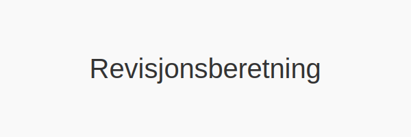
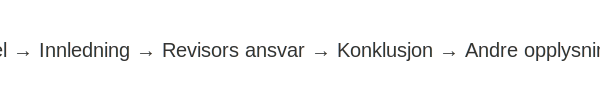

---
title: "Revisjonsberetning"
seoTitle: "Revisjonsberetning"
meta_description: '**Revisjonsberetning** er den offisielle rapporten som en revisor utarbeider etter fullført revisjon for å uttrykke sin mening om om årsregnskapet er utarbei...'
slug: hva-er-revisjonsberetning
type: blog
layout: pages/single
---

**Revisjonsberetning** er den offisielle rapporten som en revisor utarbeider etter fullført revisjon for å uttrykke sin mening om om årsregnskapet er utarbeidet i samsvar med gjeldende lover, forskrifter og god regnskapsskikk. Revisjonsberetningen er et viktig verktøy for brukerne av regnskapet, som eiere, långivere og andre interessenter, for å vurdere selskapets finansielle troverdighet.

En revisjonsberetning inngår som en del av [årsberetningen](/blogs/regnskap/arsberetning "Årsberetning: Innhold, Krav og Guide til Norsk Årsberetning"), sammen med ledelsesberetningen, regnskapsoppstillinger og noter.

## Hva er Revisjonsberetning?

En **revisjonsberetning** er dokumentet der revisoren redegjør for:

* Formålet med revisjonen og revisors ansvar
* Grunnlaget for revisjonsarbeidet, herunder standarder og lover
* Revisors konklusjon om regnskapet, med eventuelle forbehold eller avvik
* Andre opplysninger som er relevante for regnskapets brukere

Revisjonsberetningen er omtalt i [Revisorloven](/blogs/regnskap/hva-er-revisorloven "Hva er Revisorloven?") og i International Standards on Auditing (ISA), spesielt ISA 700“705. Les mer om revisjonsprosessen i artikkelen om [Revisjon](/blogs/regnskap/revisjon "Revisjon") og [Arbeidspapirer i revisjon](/blogs/regnskap/hva-er-arbeidspapirer-revisjon "Hva er Arbeidspapirer i revisjon?").

## Lovkrav for Revisjonsberetning i Norge

I Norge reguleres revisjonsberetningens krav av:

| Regelverk       | Hovedkrav                                                         |
|-----------------|-------------------------------------------------------------------|
| Revisorloven    | Krav til uavhengighet, ansvar og rapportering                     |
| Bokføringsloven | Krav til fullstendighet og krav til årsregnskapets form og innhold |
| ISA 700“705     | Standarder for revisjonsberetningens innhold og utforming         |

Se også artikkelen om [Revisjonsplikt](/blogs/regnskap/revisjonsplikt "Revisjonsplikt") for en oversikt over hvem som er revisjonspliktige og terskelverdier.

## Struktur og Innhold

En revisjonsberetning følger typisk denne strukturen:

1. **Tittel og adresse**
2. **Innledning**: Referanse til årsregnskapet og ansvarsforhold
3. **Revisors ansvar**: Beskrivelse av revisjonens omfang og standarder
4. **Konklusjon**: Revisorens mening om regnskapet
5. **Forbehold og presiseringer** (hvis aktuelt)
6. **Andre opplysninger**: Ytterligere informasjon ved behov

## Typer konklusjoner

| Type konklusjon           | Beskrivelse                                                                 |
|---------------------------|------------------------------------------------------------------------------|
| Ren konklusjon            | Ingen vesentlige feil eller avvik                                            |
| Konklusjon med forbehold  | Mindre avvik som ikke er vesentlige                                          |
| Avstått konklusjon        | Utilstrekkelig revisjonsbevis for å konkludere                               |
| Negativ konklusjon        | Vesentlige feil som påvirker regnskapet                                      |

## Formål og betydning

* **Økt tillit**: Gir brukerne tillit til at regnskapet er pålitelig
* **Transparens**: Avdekker vesentlige forhold og usikkerheter
* **Ansvarliggjøring**: Klargjør revisors rolle og ansvar

## Eksempel på revisjonsberetning

> *"Vi har revidert årsregnskapet for XYZ AS per 31. desember 2023, som omfatter balanse, resultatregnskap og noter. Etter vår mening er årsregnskapet avlagt i samsvar med gjeldende regelverk og gir et rettvisende bilde av selskapets finansielle stilling."*

## Se også

* [Revisjon](/blogs/regnskap/revisjon "Revisjon")
* [Arbeidspapirer i revisjon](/blogs/regnskap/hva-er-arbeidspapirer-revisjon "Hva er Arbeidspapirer i revisjon?")
* [Revisorloven](/blogs/regnskap/hva-er-revisorloven "Hva er Revisorloven?")

