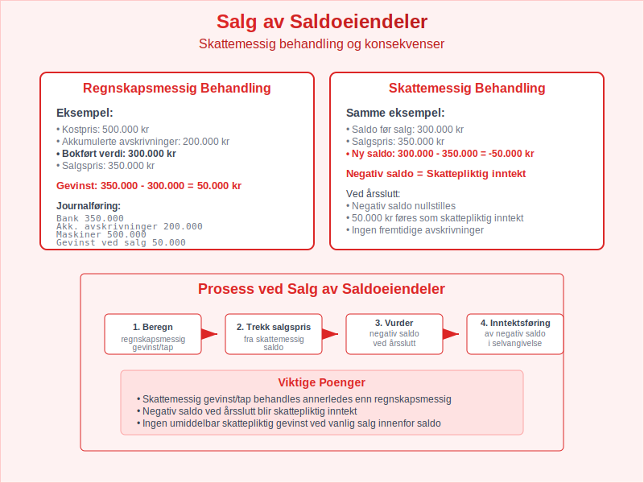

**Saldoavskrivning** er en av de mest brukte avskrivningsmetodene i norsk regnskap, hvor [anleggsmidler](/blogs/regnskap/hva-er-anleggsmidler "Hva er Anleggsmidler? Komplett Guide til Faste Eiendeler") avskrives med en fast prosentsats av den gjenstående bokførte verdien hvert år. Metoden brukes ofte for [varige driftsmidler](/blogs/regnskap/hva-er-varige-driftsmidler "Hva er Varige Driftsmidler? Komplett Guide til Avskrivbare Anleggsmidler") som maskiner, biler og IT-utstyr. Denne metoden gir høyere avskrivninger i de første årene og lavere avskrivninger senere, noe som gjenspeiler den typiske verdiforringelsen av mange [eiendeler](/blogs/regnskap/hva-er-eiendel "Hva er Eiendel i Regnskap? Komplett Guide til Eiendom og Verdier"). Denne artikkelen gir en grundig gjennomgang av saldoavskrivning, beregningsmetoder og praktisk anvendelse.

## Seksjon 1: Grunnleggende om Saldoavskrivning

### 1.1 Definisjon og Konsept

Saldoavskrivning er en **degressiv avskrivningsmetode** hvor avskrivningen beregnes som en fast prosentsats av den gjenstående [bokførte verdien](/blogs/regnskap/hva-er-bokfort-verdi "Hva er Bokført Verdi? Komplett Guide til Balanseførte Verdier") ved årets begynnelse. I motsetning til [lineær avskrivning](/blogs/regnskap/hva-er-avskrivning "Hva er Avskrivning? Komplett Guide til Avskrivningsmetoder") som gir like store avskrivninger hvert år, synker avskrivningsbeløpet hvert år med saldoavskrivning.


### 1.2 Formel for Saldoavskrivning

Den grunnleggende formelen for saldoavskrivning er:

**Årets avskrivning = Inngående saldo × Avskrivningssats**

Hvor:
* **Inngående saldo** = Bokført verdi ved årets begynnelse
* **Avskrivningssats** = Fast prosentsats fastsatt for eiendelsgruppen

### 1.3 Sammenligning med Andre Avskrivningsmetoder

| **Metode** | **Karakteristikk** | **Avskrivning år 1** | **Avskrivning år 5** |
|------------|---------------------|----------------------|----------------------|
| **Saldoavskrivning** | Degressiv, høy i starten | Høy | Lav |
| **[Lineær avskrivning](/blogs/regnskap/hva-er-avskrivning "Hva er Avskrivning? Komplett Guide til Avskrivningsmetoder")** | Konstant over tid | Middels | Middels |
| **Produksjonsavskrivning** | Basert på bruk | Variabel | Variabel |


## Seksjon 2: Saldoavskrivning i Norsk Skattelovgivning

### 2.1 Skattemessige Saldogrupper

Norsk skattelovgivning deler avskrivbare [eiendeler](/blogs/regnskap/hva-er-eiendel "Hva er Eiendel i Regnskap? Komplett Guide til Eiendom og Verdier") inn i forskjellige **[saldogrupper](/blogs/regnskap/saldogruppe "Hva er Saldogruppe? Guide til Skattemessige Avskrivningsgrupper")** med fastsatte maksimale avskrivningssatser:

| **Saldogruppe** | **Type Eiendeler** | **Maksimal Sats** |
|-----------------|--------------------|--------------------|
| **Saldogruppe a** | Kontormaskiner, EDB-utstyr | **30%** |
| **Saldogruppe c** | Traktorer, lastebiler, busser | **24%** |
| **Saldogruppe d** | Personbiler, varebiler | **20%** |
| **Saldogruppe e** | Skip, luftfartøy | **14%** |
| **Saldogruppe f** | Forretningsbygg, hoteller | **2%** |
| **Saldogruppe g** | Anlegg for teknisk installasjon | **10%** |
| **Saldogruppe h** | Ervervede immaterielle rettigheter | **20%** |
| **Saldogruppe i** | Husdyr, pelsdyr | **30%** |
| **Saldogruppe j** | Maskiner, redskap, inventar | **15%** |

### 2.2 Spesielle Regler

**Halvårsregelen:** Ved kjøp av [eiendeler](/blogs/regnskap/hva-er-eiendel "Hva er Eiendel i Regnskap? Komplett Guide til Eiendom og Verdier") i løpet av året kan kun halvparten av normalavskrivningen kreves første år.

**Skattereduktiv avskrivning:** Virksomheter kan velge lavere avskrivningssats enn maksimum, men ikke høyere.


## Seksjon 3: Beregning av Saldoavskrivning - Praktiske Eksempler

### 3.1 Enkelt Beregningseksempel

**Eksempel:** En virksomhet kjøper en maskin for 500.000 kr som tilhører saldogruppe j (15% avskrivning).

| **År** | **Inngående Saldo** | **Avskrivning (15%)** | **Utgående Saldo** |
|--------|--------------------|-----------------------|---------------------|
| **1** | 500.000 | 75.000 | 425.000 |
| **2** | 425.000 | 63.750 | 361.250 |
| **3** | 361.250 | 54.188 | 307.063 |
| **4** | 307.063 | 46.059 | 261.004 |
| **5** | 261.004 | 39.151 | 221.853 |

### 3.2 Beregning med Halvårsregel

**Eksempel:** Samme maskin kjøpt 15. juli (midt i året):

| **År** | **Beregning** | **Avskrivning** | **Bokført Verdi** |
|--------|---------------|-----------------|-------------------|
| **1** | 500.000 × 15% × 0,5 | 37.500 | 462.500 |
| **2** | 462.500 × 15% | 69.375 | 393.125 |
| **3** | 393.125 × 15% | 58.969 | 334.156 |


### 3.3 Flere Eiendeler i Samme Saldogruppe

Når virksomheten har flere [eiendeler](/blogs/regnskap/hva-er-eiendel "Hva er Eiendel i Regnskap? Komplett Guide til Eiendom og Verdier") i samme saldogruppe, behandles de samlet:

**Eksempel - Saldogruppe j:**
* Inngående saldo: 800.000 kr
* Kjøp i året: 200.000 kr
* Salg i året: 150.000 kr (salgspris)

**Beregning:**
1. **Ny saldo:** 800.000 + 200.000 - 150.000 = 850.000 kr
2. **Avskrivning:** 850.000 × 15% = 127.500 kr
3. **Utgående saldo:** 850.000 - 127.500 = 722.500 kr

## Seksjon 4: Regnskapsmessig Behandling

### 4.1 Journalføring av Saldoavskrivning

**Ved innkjøp av eiendel:**
```
Maskiner og utstyr          500.000
    Leverandørgjeld                 500.000
```

**Ved årlig avskrivning:**
```
Avskrivning maskiner         75.000
    Akkumulerte avskrivninger       75.000
```

### 4.2 Presentasjon i [Balansen](/blogs/regnskap/hva-er-balanse "Balanse i Regnskap - Komplett Guide til Balansens Oppbygging og Funksjon")

I [balansen](/blogs/regnskap/hva-er-balanse "Balanse i Regnskap - Komplett Guide til Balansens Oppbygging og Funksjon") presenteres [anleggsmidler](/blogs/regnskap/hva-er-anleggsmidler "Hva er Anleggsmidler? Komplett Guide til Faste Eiendeler") enten **netto** eller **brutto:**

**Netto presentasjon:**
* Maskiner og utstyr (netto): 425.000 kr

**Brutto presentasjon:**
* Maskiner og utstyr (kostpris): 500.000 kr
* Akkumulerte avskrivninger: (75.000) kr
* **Bokført verdi:** 425.000 kr


## Seksjon 5: Salg og Utrangering av Saldoeiendeler

### 5.1 Gevinst og Tap ved Salg

Ved salg av [eiendeler](/blogs/regnskap/hva-er-eiendel "Hva er Eiendel i Regnskap? Komplett Guide til Eiendom og Verdier") som inngår i saldoavskrivning:

**Gevinst oppstår når:** Salgspris > Bokført verdi
**Tap oppstår når:** Salgspris < Bokført verdi

### 5.2 Skattemessig Behandling av Salg

I skattemessig saldosystem:
* **Salgssummen trekkes fra saldoen** (ikke bokført verdi)
* **Ingen umiddelbar gevinst/tap** - effekten kommer via fremtidig avskrivning
* **Negativ saldo** ved årsskiftet behandles som skattepliktig inntekt

**Eksempel:**
* Saldo før salg: 300.000 kr
* Salgspris: 350.000 kr
* Saldo etter salg: 300.000 - 350.000 = -50.000 kr
* **Skattepliktig inntekt:** 50.000 kr



## Seksjon 6: Forskjeller Mellom Regnskapsmessig og Skattemessig Avskrivning

### 6.1 Ulike Prinsipper

| **Aspekt** | **Regnskapsmessig** | **Skattemessig** |
|------------|---------------------|------------------|
| **Formål** | Riktig resultatmåling | Skatteplanlegging |
| **Fleksibilitet** | Kan tilpasses | Faste regler |
| **Avskrivningssats** | Basert på brukstid | Lovbestemte satser |
| **Restverdi** | Kan inkluderes | Ignoreres |

### 6.2 Utsatt Skatt

Forskjeller mellom regnskaps- og skattemessige [avskrivninger](/blogs/regnskap/hva-er-avskrivning "Hva er Avskrivning? Komplett Guide til Avskrivningsmetoder") skaper **midlertidige forskjeller** som påvirker [utsatt skatt](/blogs/regnskap/hva-er-utsatt-skatt "Hva er Utsatt Skatt? Komplett Guide til Skattemessige Forskjeller"):

* **Høyere skattemessig avskrivning** †’ Utsatt skattefordel
* **Høyere regnskapsmessig avskrivning** †’ Utsatt skattegjeld


## Seksjon 7: Fordeler og Ulemper med Saldoavskrivning

### 7.1 Fordeler

* **Realistisk verdimåling:** Gjenspeiler typisk verdifall for mange [eiendeler](/blogs/regnskap/hva-er-eiendel "Hva er Eiendel i Regnskap? Komplett Guide til Eiendom og Verdier")
* **Skattemessige fordeler:** Høyere avskrivning tidlig gir bedre [kontantstrøm](/blogs/regnskap/hva-er-kontantstrom "Hva er Kontantstrøm? Komplett Guide til Cash Flow Analyse og Styring")
* **Enkel administrasjon:** Automatisk behandling i regnskapssystemer
* **Fleksibilitet:** Kan tilpasses forskjellige [eiendelstyper](/blogs/regnskap/hva-er-anleggsmidler "Hva er Anleggsmidler? Komplett Guide til Faste Eiendeler")

### 7.2 Ulemper

* **Kompleks sammenligning:** Vanskelig å sammenligne med lineær [avskrivning](/blogs/regnskap/hva-er-avskrivning "Hva er Avskrivning? Komplett Guide til Avskrivningsmetoder")
* **Aldri null verdi:** [Eiendeler](/blogs/regnskap/hva-er-eiendel "Hva er Eiendel i Regnskap? Komplett Guide til Eiendom og Verdier") får teoretisk aldri bokført verdi null
* **Resultatpåvirkning:** Varierende avskrivningskostnader over tid
* **Planleggingsutfordringer:** Mindre forutsigbare [kostnadsutviklinger](/blogs/regnskap/hva-er-kostnad "Hva er Kostnad? Komplett Guide til Kostnadstyper i Regnskap")


## Seksjon 8: Praktisk Implementering og Systemstøtte

### 8.1 Regnskapssystemenes Rolle

Moderne regnskapssystemer tilbyr:

* **Automatisk beregning** av saldoavskrivninger
* **Separate spor** for regnskaps- og skattemessige [avskrivninger](/blogs/regnskap/hva-er-avskrivning "Hva er Avskrivning? Komplett Guide til Avskrivningsmetoder")
* **Saldogruppestyring** med forhåndsdefinerte satser
* **Rapporter** for avskrivningsoversikter og prognoser

### 8.2 Månedlig vs. Årlig Avskrivning

**Månedlig avskrivning:**
* Månedlig sats = Årlig sats ÷ 12
* Bedre kostnadsfordeling gjennom året
* Mer kompleks administrasjon

**Årlig avskrivning:**
* Enklere administrasjon
* All avskrivning i desember
* Mindre presise periodiseringer

### 8.3 Dokumentasjon og Kontroll

**Viktige dokumenter:**
* Oversikt over saldogrupper og satser
* Eiendelsregister med klassifisering
* Månedlige avskrivningsrapporter
* Årlige avstemminger mot selvangivelse


## Seksjon 9: Saldoavskrivning og Finansiell Analyse

### 9.1 Påvirkning på [Nøkkeltall](/blogs/regnskap/hva-er-nokkeltall "Hva er Nøkkeltall? Komplett Guide til Finansielle Nøkkeltall i Regnskap")

Saldoavskrivning påvirker flere viktige finansielle nøkkeltall:

* **[Avkastning](/blogs/regnskap/hva-er-avkastning "Hva er Avkastning? Komplett Guide til ROI, ROE og Avkastningsanalyse") på [aktiva](/blogs/regnskap/hva-er-aktiva "Hva er Aktiva? En Komplett Guide til Eiendeler i Regnskap"):** Høyere i senere år
* **Bokført verdi [anleggsmidler](/blogs/regnskap/hva-er-anleggsmidler "Hva er Anleggsmidler? Komplett Guide til Faste Eiendeler"):** Raskere reduksjon
* **Resultatvolatilitet:** Varierende avskrivningskostnader
* **Sammenlignbarhet:** Utfordringer mellom virksomheter

### 9.2 Analyse av Avskrivningspolicy

Analytikere bør vurdere:
* **Valg av avskrivningsmetode** og begrunnelse
* **Konsistens** i anvendelse over tid
* **Påvirkning på resultatutvikling**
* **Sammenligning** med bransjestandard


## Seksjon 10: Fremtidige Utviklingstrekk

### 10.1 Teknologisk Utvikling

* **Kunstig intelligens** for optimal avskrivningsplanlegging
* **Automatisk klassifisering** av [eiendeler](/blogs/regnskap/hva-er-eiendel "Hva er Eiendel i Regnskap? Komplett Guide til Eiendom og Verdier") i saldogrupper
* **Prediktiv analyse** av verdiutvikling
* **Integrerte systemer** for regnskaps- og skattemessig behandling

### 10.2 Regulatoriske Endringer

Potensielle endringer kan omfatte:
* **Nye saldogrupper** for digital teknologi
* **Justerte avskrivningssatser** basert på teknologiutvikling
* **Harmonisering** mellom regnskaps- og skattestandard
* **Miljøhensyn** i avskrivningsregler

### 10.3 Bærekraft og Saldoavskrivning

Økende fokus på bærekraft påvirker:
* **Levetidsvurderinger** av [eiendeler](/blogs/regnskap/hva-er-eiendel "Hva er Eiendel i Regnskap? Komplett Guide til Eiendom og Verdier")
* **Miljømessige avskrivninger** for forurensende [aktiva](/blogs/regnskap/hva-er-aktiva "Hva er Aktiva? En Komplett Guide til Eiendeler i Regnskap")
* **Investering i grønn teknologi** og tilhørende avskrivningsregimer
* **Rapportering** av miljøpåvirkning fra [anleggsmidler](/blogs/regnskap/hva-er-anleggsmidler "Hva er Anleggsmidler? Komplett Guide til Faste Eiendeler")


## Konklusjon

Saldoavskrivning er en fundamental avskrivningsmetode som spiller en sentral rolle i både regnskapsmessig og skattemessig behandling av [anleggsmidler](/blogs/regnskap/hva-er-anleggsmidler "Hva er Anleggsmidler? Komplett Guide til Faste Eiendeler"). Metoden tilbyr en realistisk tilnærming til verdiregistrering som gjenspeiler den faktiske verdiforringelsen av mange [eiendelstyper](/blogs/regnskap/hva-er-eiendel "Hva er Eiendel i Regnskap? Komplett Guide til Eiendom og Verdier").

**Hovedfordelene med saldoavskrivning:**
* Realistisk verdimåling som følger typiske verdiforringelsesmønstre
* Skattemessige fordeler gjennom høyere tidlige [avskrivninger](/blogs/regnskap/hva-er-avskrivning "Hva er Avskrivning? Komplett Guide til Avskrivningsmetoder")
* Enkel implementering i moderne regnskapssystemer
* Fleksibilitet for ulike [eiendelstyper](/blogs/regnskap/hva-er-anleggsmidler "Hva er Anleggsmidler? Komplett Guide til Faste Eiendeler")

**Kritiske suksessfaktorer:**
* Korrekt klassifisering i riktig saldogruppe
* Konsistent anvendelse av avskrivningsprinsipper
* God systemstøtte for automatiserte beregninger
* Regelmessig [avstemming](/blogs/regnskap/hva-er-avstemming "Hva er Avstemming i Regnskap? Komplett Guide til Regnskapsavstemming") mellom regnskaps- og skattemessige tall

For virksomheter som arbeider med saldoavskrivning, er det essensielt å forstå både de regnskapsmessige og skattemessige implikasjonene. Dette sikrer korrekt finansiell rapportering, optimal [skatteplanlegging](/blogs/regnskap/hva-er-skatteplanlegging "Hva er Skatteplanlegging? Strategier for Optimal Skattebehandling") og pålitelig grunnlag for økonomiske beslutninger.

Saldoavskrivning vil fortsette å være en viktig komponent i norsk regnskapsføring, og med teknologisk utvikling og endrede [regulatoriske krav](/blogs/regnskap/hva-er-regnskapsloven "Hva er Regnskapsloven? Komplett Guide til Norsk Regnskapslovgivning") vil metoden trolig utvikle seg for å møte fremtidens behov for transparent og relevant finansiell rapportering.


