---
title: "Hva er Selvfinansiering?"
seoTitle: "Selvfinansiering | Definisjon, fordeler og eksempler"
description: "Selvfinansiering er finansiering av drift og vekst med egenkapital og tilbakeholdt overskudd. Artikkelen forklarer metoder, fordeler, beregning og praktiske eksempler for norske bedrifter."
summary: "Selvfinansiering er finansiering av drift og vekst med egenkapital og tilbakeholdt overskudd, som gir kontroll, lavere risiko og bedre fleksibilitet."
---

**Selvfinansiering** er en fundamental strategi for å finansiere bedriftens drift og vekst gjennom egen [kapitaltilførsel](/blogs/regnskap/hva-er-kapital "Hva er Kapital? Komplett Guide til Kapitalformer og Kapitalforvaltning") og [tilbakeholdt overskudd](/blogs/regnskap/hva-er-overskudd "Hva er Overskudd? Komplett Guide til Resultatet av Bedriftens Virksomhet"). Dette finansieringsverktøyet gir bedrifter større kontroll over sin økonomiske fremtid, reduserer avhengigheten av eksterne långivere og skaper et solid fundament for bærekraftig vekst. For norske bedrifter representerer selvfinansiering ofte den mest kostnadseffektive måten å finansiere utviklingen på, spesielt i lys av [SFDR-krav](/blogs/regnskap/hva-er-sfdr "Hva er SFDR? Guide til Sustainable Finance Disclosure Regulation") som påvirker tilgang til bærekraftig kapital.

## Seksjon 1: Selvfinansieringens Grunnleggende Konsept

**Selvfinansiering** omfatter alle finansieringskilder som kommer fra bedriftens egen virksomhet og egenkapital. Dette skiller seg fundamentalt fra ekstern finansiering gjennom [lån](/blogs/regnskap/hva-er-lan "Hva er Lån? Komplett Guide til Lånefinansiering og Regnskapsbehandling") eller nye investorer.

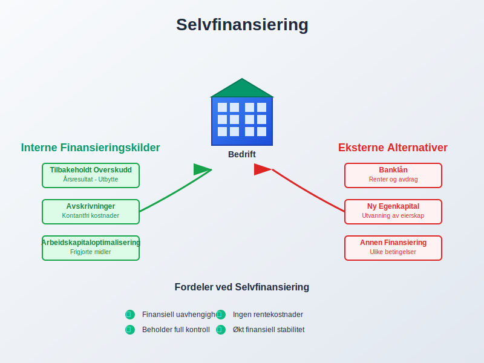

### 1.1 Definisjon og Kjernekomponenter

Selvfinansiering består av følgende hovedelementer:

* **[Tilbakeholdt overskudd](/blogs/regnskap/hva-er-overskudd "Hva er Overskudd? Komplett Guide til Resultatet av Bedriftens Virksomhet"):** Årsresultat som ikke utdeles som [utbytte](/blogs/regnskap/hva-er-utbytte "Hva er Utbytte? Regnskapsføring og Skattemessige Konsekvenser")
* **[Avskrivninger](/blogs/regnskap/hva-er-avskrivning "Hva er Avskrivning? Komplett Guide til Avskrivningsmetoder"):** Regnskapsmessige kostnader som ikke krever kontantutbetaling
* **Egenkapitalinnbetaling:** Nye innskudd fra eksisterende eiere
* **[Arbeidskapitaloptimalisering](/blogs/regnskap/hva-er-arbeidskapital "Hva er Arbeidskapital? Beregning og Styring av Arbeidskapital"):** Frigjøring av bundne midler

### 1.2 Selvfinansieringens Rolle i Bedriftsøkonomien

Selvfinansiering utgjør kjernen i **finansiell selvstendighet** og gir bedriften:

| **Fordel** | **Beskrivelse** | **Regnskapsmessig Effekt** |
|-----------|----------------|---------------------------|
| Finansiell fleksibilitet | Ingen rentekostnader eller avdrag | Reduserte [finanskostnader](/blogs/regnskap/hva-er-finanskostnader "Hva er Finanskostnader? Regnskapsføring og Skattemessige Konsekvenser") |
| Eierrådighet | Beholder kontroll over strategiske beslutninger | Økt [egenkapitalandel](/blogs/regnskap/hva-er-egenkapital "Hva er Egenkapital? Komplett Guide til Egenkapital i Regnskap") |
| Krisemotstand | Mindre sårbar for eksterne finansmarkedsendringer | Forbedret [soliditet](/blogs/regnskap/hva-er-soliditet "Hva er Soliditet? Beregning og Betydning for Bedriftens Stabilitet") |

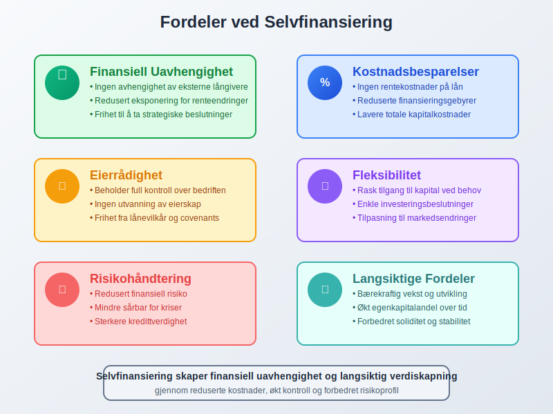

## Seksjon 2: Typer Selvfinansiering

### 2.1 Intern Selvfinansiering

**Intern selvfinansiering** omfatter midler som genereres gjennom bedriftens daglige drift:

#### Tilbakeholdt Overskudd
[Årsresultatet](/blogs/regnskap/hva-er-arsresultat "Hva er Årsresultat? Forståelse av Bedriftens Lønnsomhet") som ikke utdeles som utbytte til eierne:

* **Formål:** Finansiere fremtidig vekst og investeringer
* **Regnskapsføring:** Overføres til [opptjent egenkapital](/blogs/regnskap/hva-er-egenkapital "Hva er Egenkapital? Komplett Guide til Egenkapital i Regnskap")
* **Beslutningsprosess:** Krever vedtak på generalforsamling

#### Avskrivninger som Finansieringskilde
[Avskrivninger](/blogs/regnskap/hva-er-avskrivning "Hva er Avskrivning? Komplett Guide til Avskrivningsmetoder") frigjør kontanter for reinvestering:

* **Prinsipp:** Regnskapsmessig kostnad uten kontantstrøm
* **Finansieringseffekt:** Årlige avskrivninger blir tilgjengelig likviditet
* **Reinvesteringskrav:** Midlene må brukes til vedlikehold eller nye [anleggsmidler](/blogs/regnskap/hva-er-anleggsmidler "Hva er Anleggsmidler? Komplett Guide til Faste Eiendeler")

#### Avsetninger og Reservefond
Systematisk oppsparring til fremtidige behov:

* **[Vedlikeholdsavsetninger](/blogs/regnskap/avsetning "Avsetning i Regnskap - Komplett Guide til Avsetninger og Estimater"):** For planlagt vedlikehold av anleggsmidler
* **Ekspansjonsreserver:** Målrettet sparing til vekstinvesteringer
* **Beredskapsreserver:** Sikkerhetsnett for uforutsette hendelser

### 2.2 Ekstern Selvfinansiering

**Ekstern selvfinansiering** innebærer tilførsel av egenkapital fra eierne:

#### Kapitalinnbetaling fra Eksisterende Eiere
	* **[Aksjekapitalforhøyelse](/blogs/regnskap/kapitalforhoyelse "Kapitalforhøyelse: Metoder og Regnskapsføring"):** Utstedelse av nye aksjer til eksisterende aksjonærer
* **Overkursfondet:** Innbetaling utover pålydende verdi
	* **[Betinget kapitalforhøyelse](/blogs/regnskap/kapitalforhoyelse "Kapitalforhøyelse: Metoder og Regnskapsføring"):** Fremtidig kapitaltilførsel basert på resultater

#### Konvertibel Finansiering
* **[Konvertible lån](/blogs/kontoplan/2200-konvertible-lan "Konto 2200 - Konvertible lån i Norsk Standard Kontoplan"):** Gjeld som kan konverteres til egenkapital
* **Ansattes aksjeopsjoner:** Fremtidig egenkapitaltilførsel fra ansatte

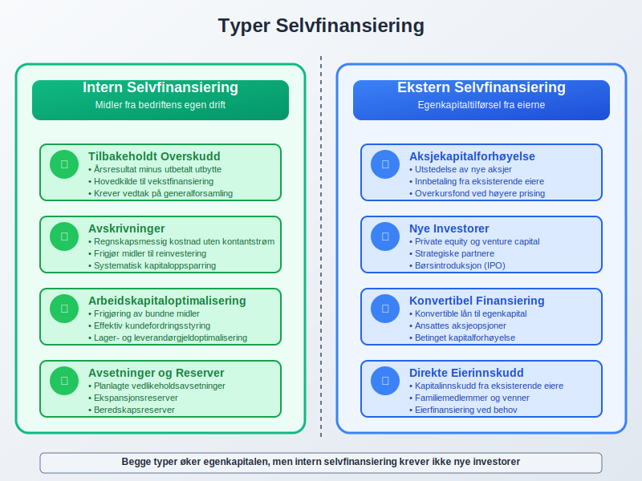

## Seksjon 3: Beregning og Måling av Selvfinansiering

### 3.1 Selvfinansieringsgrad

**Selvfinansieringsgraden** måler hvor stor andel av investeringene som finansieres internt:

**Selvfinansieringsgrad = (Internt finansierte investeringer / Totale investeringer) × 100%**

#### Praktisk Beregningseksempel

For selskapet "InnovCorp AS":

**Årsdata:**
* Årsresultat etter skatt: NOK 2.000.000
* Utbetalt utbytte: NOK 500.000
* Avskrivninger: NOK 800.000
* Totale investeringer: NOK 3.500.000

**Beregning:**
* Tilbakeholdt overskudd: NOK 2.000.000 - NOK 500.000 = NOK 1.500.000
* Intern finansiering: NOK 1.500.000 + NOK 800.000 = NOK 2.300.000
* **Selvfinansieringsgrad: (NOK 2.300.000 / NOK 3.500.000) × 100% = 65,7%**

### 3.2 Selvfinansieringsevne

**Selvfinansieringsevnen** viser bedriftens kapasitet til å generere interne finansieringsmidler:

**Selvfinansieringsevne = Årsresultat + Avskrivninger - Utbytte**

#### Nøkkeltall for Selvfinansiering

| **Nøkkeltall** | **Formel** | **Tolkning** |
|---------------|-----------|-------------|
| [Cash Flow](/blogs/regnskap/hva-er-cash-flow "Hva er Cash Flow? Kontantstrømanalyse og Likviditetsstyring") fra drift | Driftsresultat + Avskrivninger | Operasjonell selvfinansieringsevne |
| Retensionsgrad | (1 - Utbytte/Årsresultat) × 100% | Andel overskudd beholdt i bedriften |
| [ROE](/blogs/regnskap/hva-er-roe "Hva er ROE? Return on Equity og Egenkapitalrentabilitet") | Årsresultat / [Egenkapital](/blogs/regnskap/hva-er-egenkapital "Hva er Egenkapital? Komplett Guide til Egenkapital i Regnskap") | Avkastning på egenkapital |

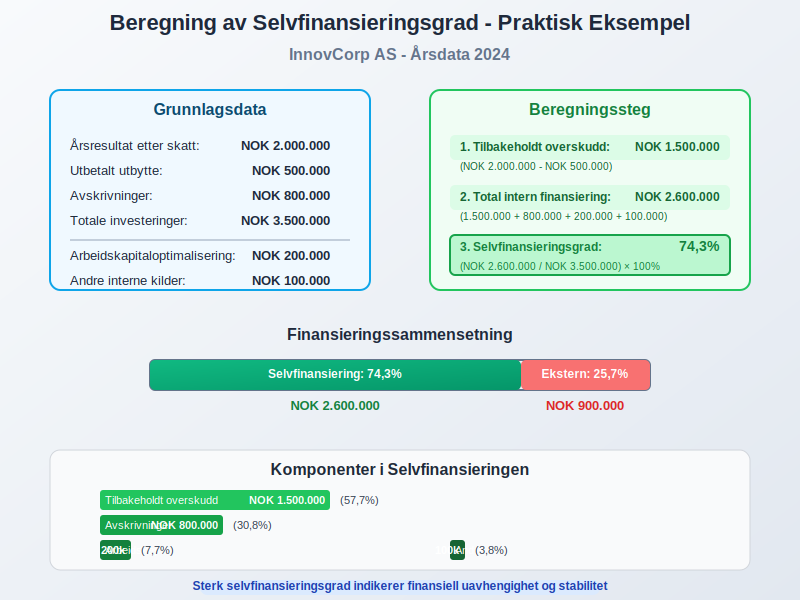

## Seksjon 4: Strategisk Planlegging av Selvfinansiering

### 4.1 Utbyttepolitikk og Selvfinansiering

**Utbyttepolitikken** er avgjørende for selvfinansieringskapasiteten:

#### Balansert Utbyttestrategi
* **Stabil utbyttepolitikk:** Forutsigbart utbytte med gradvis økning
* **Variabel utbyttepolitikk:** Utbytte basert på årets resultat og investeringsbehov
* **Nullutbyttepolitikk:** Alle overskudd beholdes for vekst

#### Regnskapsmessige Konsekvenser

```
Eksempel: Utbyttebeslutning
Årsresultat:                NOK 3.000.000
- Foreslått utbytte:        NOK 1.000.000
= Tilbakeholdt overskudd:   NOK 2.000.000

Regnskapsføring:
Debet: Foreslått utbytte    NOK 1.000.000
Kredit: Utbytteskyld            NOK 1.000.000
```

### 4.2 Investeringsplanlegging

**Systematisk investeringsplanlegging** optimaliserer selvfinansieringen:

#### Kort- og Langsiktig Planlegging
* **Ettårsbudsjett:** Detaljert planlegging av investeringer og finansieringsbehov
* **Femårsplan:** Strategisk planlegging av større investeringsprosjekter
* **Rullende prognoser:** Kontinuerlig oppdatering av finansieringsbehovet

#### Prioritering av Investeringer
| **Investeringstype** | **Prioritet** | **Finansieringsmåte** |
|---------------------|--------------|----------------------|
| Vedlikehold eksisterende [anleggsmidler](/blogs/regnskap/hva-er-anleggsmidler "Hva er Anleggsmidler? Komplett Guide til Faste Eiendeler") | Høy | Avskrivningsmidler |
| Kapasitetsutvidelse | Middels | Tilbakeholdt overskudd |
| Nye forretningsområder | Lav | Kombinert finansiering |

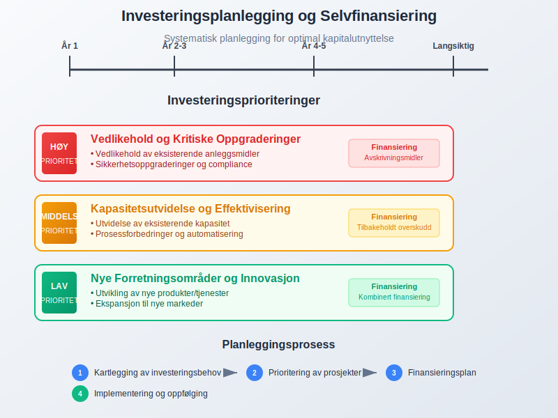

## Seksjon 5: Arbeidskapitaloptimalisering som Selvfinansiering

### 5.1 Frigjøring av Bundne Midler

**[Arbeidskapitaloptimalisering](/blogs/regnskap/hva-er-arbeidskapital "Hva er Arbeidskapital? Beregning og Styring av Arbeidskapital")** kan frigjøre betydelige finansieringsmidler:

#### Kundefordringsstyring
* **Effektiv [fakturarutiner](/blogs/regnskap/hva-er-faktura "Hva er en Faktura? Regnskapsføring og Krav til Fakturering"):** Rask utsendelse og oppfølging
* **Kredittider:** Forkorting av betalingsbetingelser
* **[Factoring](/blogs/regnskap/hva-er-factoring "Hva er Factoring? Finansiering Gjennom Salg av Fordringer"):** Salg av kundefordringer for økt likviditet

#### Lageroptimalisering
* **Just-in-time:** Redusert [lagerbinding](/blogs/regnskap/hva-er-varelager "Hva er Varelager? En Komplett Guide til Lagerføring og Verdivurdering")
* **ABC-analyse:** Fokus på høyverdi-artikler
* **Sesongplanlegging:** Tilpasning til etterspørselsmønster

### 5.2 Leverandørgjeldsstyring

**Strategisk bruk av [leverandørgjeld](/blogs/regnskap/hva-er-leverandorgjeld "Hva er Leverandørgjeld? Regnskapsføring og Styring av Leverandørgjeld"):**

* **Betalingsbetingelser:** Forhandling av lengre kredittider
* **Kontantrabatter:** Vurdering av kostnader vs. fordeler
* **Leverandørfinansiering:** Bruk av leverandørenes finansieringstilbud

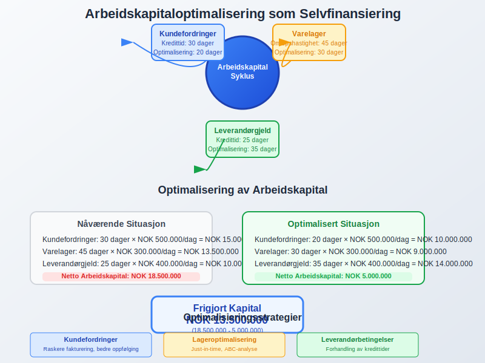

## Seksjon 6: Selvfinansiering vs. Ekstern Finansiering

### 6.1 Sammenligning av Finansieringsalternativer

| **Faktor** | **Selvfinansiering** | **[Lånefinansiering](/blogs/regnskap/hva-er-lan "Hva er Lån? Komplett Guide til Lånefinansiering og Regnskapsbehandling")** | **Egenkapitalinnhenting** |
|-----------|-------------------|----------------------|-------------------------|
| **Kostnad** | Alternativkostnad | [Rentekostnader](/blogs/regnskap/hva-er-renter "Hva er Renter? Regnskapsføring og Skattemessige Konsekvenser") | Utbytte/avkastningskrav |
| **Kontroll** | Beholder full kontroll | Lånevilkår og covenants | Deling av eierskap |
| **Risiko** | Lav finansiell risiko | Økt [gjeldsgrad](/blogs/regnskap/hva-er-gjeldsgrad "Hva er Gjeldsgrad? Beregning og Tolkning av Gjeldsgrad") | Utvanning av eierskap |
| **Fleksibilitet** | Høy fleksibilitet | Bindende avtaler | Komplekse prosesser |

### 6.2 Kostnads-Nytte Analyse

#### Kapitalkostnad ved Selvfinansiering
* **Alternativkostnad:** Avkastning eierne kunne oppnådd på alternative investeringer
* **Skatteskjold:** Ingen fradrag for finansieringskostnader (som ved [lån](/blogs/regnskap/hva-er-lan "Hva er Lån? Komplett Guide til Lånefinansiering og Regnskapsbehandling"))
* **Fleksibilitetspremie:** Verdien av finansiell uavhengighet

#### WACC-påvirkning
**Weighted Average Cost of Capital** påvirkes av finansieringssammensetningen:

* **Økt egenkapitalandel:** Kan redusere samlet kapitalkostnad
* **Optimal kapitalstruktur:** Balanse mellom egenkapital og gjeld
* **Bransjespesifikke faktorer:** Varierende optimale kapitalstrukturer

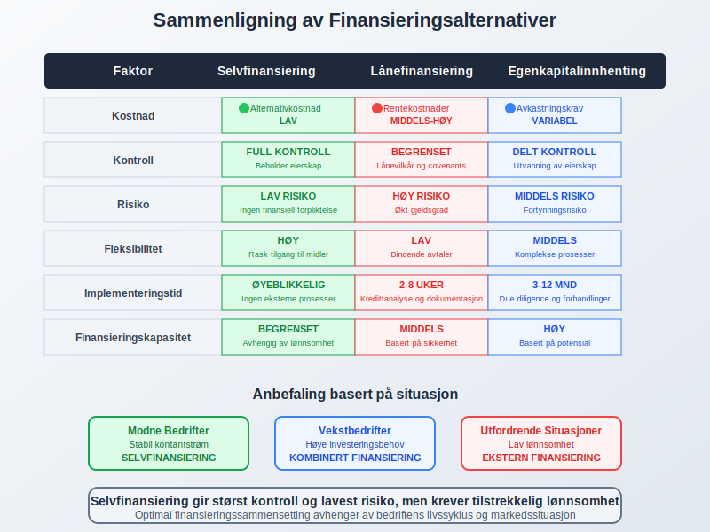

## Seksjon 7: Regnskapsmessig Behandling av Selvfinansiering

### 7.1 Regnskapsføring av Tilbakeholdt Overskudd

**Regnskapsmessig behandling** av selvfinansiering følger etablerte prinsipper:

#### Årsavslutningsprosess
```
Regnskapsføring ved årsavslutning:

1. Resultatdisponering:
   Debet: Årsresultat              NOK 2.500.000
   Kredit: Fri egenkapital             NOK 2.500.000

2. Utbyttevedtak:
   Debet: Fri egenkapital          NOK 800.000
   Kredit: Foreslått utbytte           NOK 800.000

3. Endelig tilbakeholdt overskudd:
   NOK 2.500.000 - NOK 800.000 = NOK 1.700.000
```

### 7.2 Balansepresentasjon

**Egenkapitaldelen av [balansen](/blogs/regnskap/hva-er-balanse "Hva er Balanse i Regnskap? Komplett Guide til Balansens Oppbygging og Funksjon")** viser selvfinansieringens effekt:

#### Egenkapitaloppstilling
* **[Aksjekapital](/blogs/regnskap/hva-er-aksjekapital "Hva er Aksjekapital? Betydning og Regnskapsføring"):** Innbetalt kapital fra eierne
* **Overkursfond:** Kapitalinnbetaling over pålydende
* **Annen egenkapital:** Tilbakeholdt overskudd og andre reserver
* **Årets resultat:** Løpende års resultat før disposisjon

### 7.3 Kontantstrømoppstilling

**[Kontantstrømoppstillingen](/blogs/regnskap/hva-er-kontantstrm "Hva er Kontantstrøm? Analyse og Styring av Kontantstrømmer")** viser selvfinansieringens kontanteffekt:

| **Kontantstrømkategori** | **Selvfinansieringselement** | **Effekt** |
|-------------------------|----------------------------|-----------|
| Drift | Årsresultat + Avskrivninger | Positiv kontantstrøm |
| Investering | Reinvestering av avskrivningsmidler | Negativ kontantstrøm |
| Finansiering | Utbytteutbetaling | Negativ kontantstrøm |

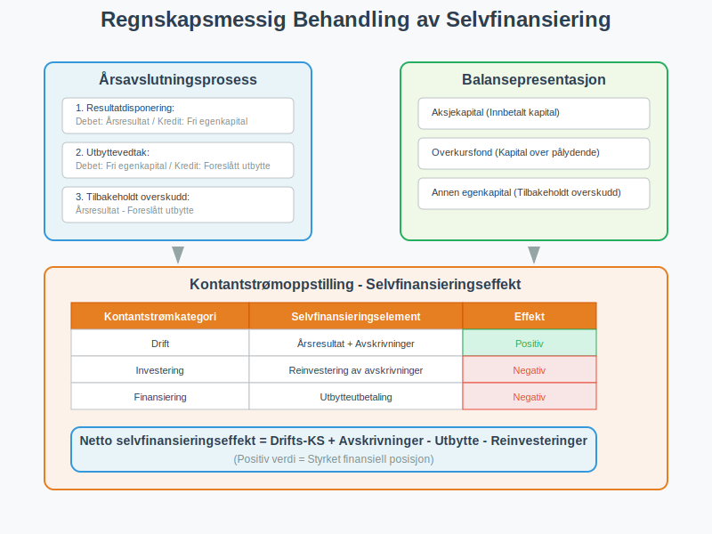

## Seksjon 8: Bransjespesifikke Selvfinansieringsstrategier

### 8.1 Kapitalintensive Bransjer

**Produksjonsbedrifter** og andre kapitalintensive virksomheter:

#### Utfordringer
* Høye [anleggsinvesteringer](/blogs/regnskap/hva-er-anleggsmidler "Hva er Anleggsmidler? Komplett Guide til Faste Eiendeler")
* Lange avskrivningsperioder
* Store vedlikeholdsbehov

#### Strategier
* **Aggressiv avskrivningspolitikk:** Raskere frigjøring av midler
* **Vedlikeholdsavsetninger:** Systematisk oppsparring
* **Kapasitetsutnyttelse:** Maksimering av inntjening fra eksisterende [eiendeler](/blogs/regnskap/hva-er-eiendeler "Hva er Eiendeler? Komplett Oversikt over Eiendelstyper")

### 8.2 Servicebransjer

**Kunnskapsintensive bedrifter** har andre finansieringsbehov:

#### Karakteristika
* Lav kapitalintensitet
* Høy personalkostnadsandel
* Immaterielle [eiendeler](/blogs/regnskap/hva-er-goodwill "Hva er Goodwill? Komplett Guide til Immaterielle Eiendeler")

#### Selvfinansieringsstrategier
* **Høy utbyttepolitikk:** Mindre behov for tilbakeholdt kapital
* **Menneskelege investeringer:** Kompetanseutvikling og rekruttering
* **Teknologiinvesteringer:** IT-systemer og digitalisering

### 8.3 Vekstbedrifter

**Oppstartsbedrifter** og vekstselskaper:

| **Vekstfase** | **Selvfinansieringsfokus** | **Prioritet** |
|--------------|---------------------------|---------------|
| Oppstart | Minimalt overskudd | Overlevel og vekst |
| Vekst | Reinvestering av alt overskudd | Markedsposisjon |
| Modning | Balansert tilnærming | Bærekraftig lønnsomhet |

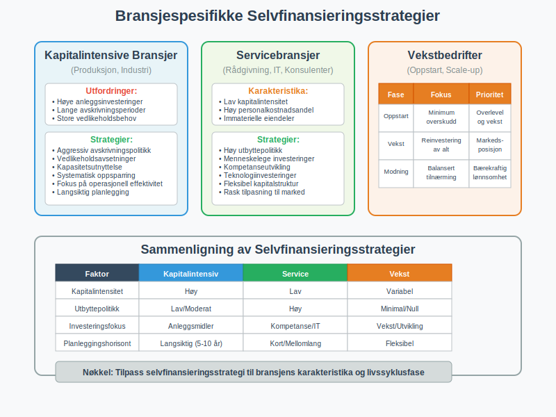

## Seksjon 9: Digitale Verktøy og Teknologi

### 9.1 Moderne ERP-systemer

**Enterprise Resource Planning** støtter selvfinansieringsplanlegging:

#### Integrerte Funksjoner
* **Budsjett og prognose:** Automatiserte prognoser for [kontantstrøm](/blogs/regnskap/hva-er-cash-flow "Hva er Cash Flow? Kontantstrømanalyse og Likviditetsstyring")
* **Investeringsplanlegging:** Systematisk planlegging av [anleggsinvesteringer](/blogs/regnskap/hva-er-anleggsmidler "Hva er Anleggsmidler? Komplett Guide til Faste Eiendeler")
* **Rapportering:** Sanntidsrapporter på selvfinansieringsgrad

#### Arbeidskapitaloptimalisering
* **Automatiserte [fakturarutiner](/blogs/regnskap/hva-er-faktura "Hva er en Faktura? Regnskapsføring og Krav til Fakturering"):** Raskere kontantinngang
* **Lageroptimalisering:** AI-baserte prognoser for [varelager](/blogs/regnskap/hva-er-varelager "Hva er Varelager? En Komplett Guide til Lagerføring og Verdivurdering")
* **Betalingsoptimalisering:** Intelligent timing av leverandørbetalinger

### 9.2 Business Intelligence og Analytics

**Avanserte analyseværktøy** gir dybdeinnsikt:

#### Prediktive Modeller
* **Kontantstrømprognoser:** Maskinlæring for bedre prognoser
* **Scenarioanalyser:** Simulering av ulike finansieringsstrategier
* **Risikostyring:** Identifisering av finansielle risikoer

#### Dashboard og KPI-er
* **Sanntidsmonitoring:** Kontinuerlig overvåking av nøkkeltall
* **Automatiske varsler:** Proaktiv identifisering av avvik
* **Benchmarking:** Sammenligning med bransjedata

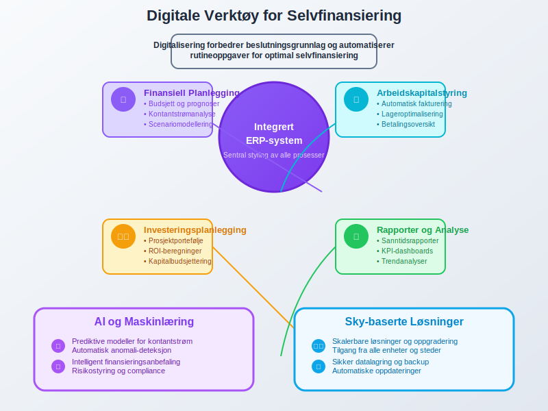

## Seksjon 10: Utfordringer og Risikofaktorer

### 10.1 Vanlige Utfordringer

#### Lav Lønnsomhet
* **Årsaker:** Høye driftskostnader, lav prising, ineffektive prosesser
* **Konsekvenser:** Begrenset selvfinansieringsevne
* **Løsninger:** Kostnadskutt, prisoptimalisering, prosessforbedringer

#### Høye Vekstambisjoner
* **Utfordring:** Selvfinansiering dekker ikke vekstbehovet
* **Konsekvenser:** Må ty til ekstern finansiering
* **Strategi:** Balansert vekst tilpasset selvfinansieringsevnen

### 10.2 Risikofaktorer

| **Risiko** | **Beskrivelse** | **Risikoreduserende tiltak** |
|-----------|----------------|----------------------------|
| Underinvestering | For konservativ investeringsstrategi | Regelmessig strategisk gjennomgang |
| Likviditetsmangel | Utilstrekkelig kontantbeholdning | [Likviditetsstyring](/blogs/regnskap/hva-er-likviditet "Hva er Likviditet? Måling og Styring av Bedriftens Likviditet") og kredittrammer |
| Konkurranseulempe | Langsom vekst sammenlignet med konkurrenter | Hybride finansieringsløsninger |

### 10.3 Regulatoriske Hensyn

#### Regnskapsmessige Begrensninger
* **Minimumskapitalkrav:** Lovpålagte krav til [egenkapital](/blogs/regnskap/hva-er-egenkapital "Hva er Egenkapital? Komplett Guide til Egenkapital i Regnskap")
* **Utbytterestriksjooner:** Begrensninger på utdeling ved lav egenkapital
* **Revisjonsplikt:** Økte kostander og kompleksitet

#### Skattehensyn
* **[Skattlegging av overskudd](/blogs/regnskap/hva-er-skatt "Hva er Skatt? Regnskapsføring og Skatteplanlegging"):** Reduserer tilgjengelige midler
* **Skatteoptimalisering:** Strategier for å maksimere etter-skatt finansiering
* **Konsernbidrag:** Interne finansieringsløsninger i konsern

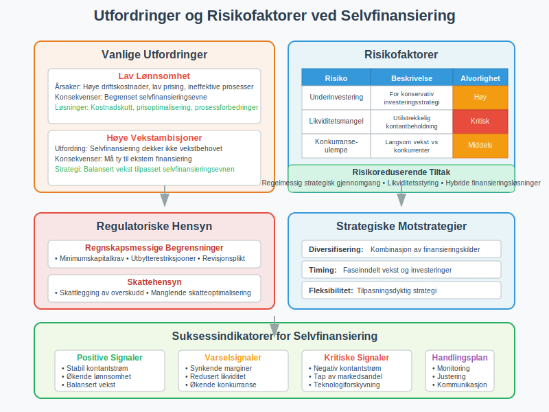

## Seksjon 11: Fremtidens Selvfinansiering

### 11.1 Teknologiske Innovasjoner

**Kunstig intelligens** og maskinlæring revolusjonerer finansieringsplanlegging:

#### AI-baserte Prognoser
* **Avanserte kontantstrømprognoser:** Høyere nøyaktighet i finansieringsplanlegging
* **Prediktive analyser:** Identifisering av optimale investeringstidspunkter
* **Risikostyring:** Automatisk identifisering av finansielle risikoer

#### Blockchain og Smart Contracts
* **Transparente transaksjoner:** Redusert behov for mellommenn
* **Automatiserte betalinger:** Forbedret [kontantstrømstyring](/blogs/regnskap/hva-er-cash-flow "Hva er Cash Flow? Kontantstrømanalyse og Likviditetsstyring")
* **Tokenisering:** Nye former for egenkapitalfinansiering

### 11.2 Bærekraftig Finansiering

**ESG-fokus** påvirker selvfinansieringsstrategier:

#### Grønne Investeringer
* **Miljøvennlige teknologier:** Prioritering av bærekraftige [anleggsinvesteringer](/blogs/regnskap/hva-er-anleggsmidler "Hva er Anleggsmidler? Komplett Guide til Faste Eiendeler")
* **Energieffektivisering:** Reduserte driftskostnader og økt lønnsomhet
* **Sirkulær økonomi:** Innovative forretningsmodeller

#### Sosial Ansvar
* **Ansattfokuserte investeringer:** Kompetanse og trivsel
* **Samfunnsengasjement:** Langsiktig verdiskapning
* **[Stakeholder-kapitalisme](/blogs/regnskap/kapitalisme "Hva er Kapitalisme? Komplett Guide til Kapitalisme i Økonomi og Regnskap"):** Bred verdi-definisjon

### 11.3 Regulatoriske Endringer

**Fremtidige regnskaps- og skatteregler** vil påvirke selvfinansiering:

* **IFRS-utvikling:** Endrede regnskapsregler for immaterielle [eiendeler](/blogs/regnskap/hva-er-goodwill "Hva er Goodwill? Komplett Guide til Immaterielle Eiendeler")
* **Skatteharmonisering:** EU-initiativer for selskapsbeskatning
* **Digitalisering:** Automatiserte rapporteringsløsninger

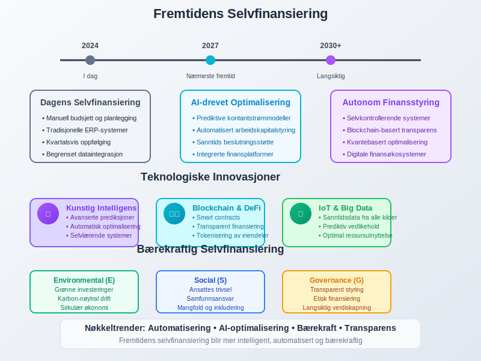

## Seksjon 12: Praktiske Implementeringsstrategier

### 12.1 Strategisk Implementering

#### Faseinndelt Tilnærming
1. **Kartleggingsfase:** Analyse av nåværende finansieringsstruktur
2. **Planleggingsfase:** Utvikling av selvfinansieringsstrategi
3. **Implementeringsfase:** Systematisk gjennomføring
4. **Oppfølgingsfase:** Kontinuerlig monitoring og justering

#### Organisatoriske Tiltak
* **Tverrfaglige team:** Økonomi, drift og strategi
* **Kompetanseutvikling:** Opplæring i finansieringsplanlegging
* **Insentivordninger:** Belønning for forbedret selvfinansieringsevne

### 12.2 Måling og Oppfølging

#### Nøkkeltall (KPI-er)
| **KPI** | **Målsetning** | **Rapporteringsfrekvens** |
|---------|---------------|-------------------------|
| Selvfinansieringsgrad | > 70% | Månedlig |
| [Cash conversion cycle](/blogs/regnskap/hva-er-arbeidskapital "Hva er Arbeidskapital? Beregning og Styring av Arbeidskapital") | < 45 dager | Månedlig |
| [Egenkapitalrentabilitet](/blogs/regnskap/hva-er-roe "Hva er ROE? Return on Equity og Egenkapitalrentabilitet") | > 15% | Kvartalsvis |

#### Rapporteringsrutiner
* **Månedlige rapporter:** Operative nøkkeltall og avvik
* **Kvartalsvise analyser:** Strategisk gjennomgang og justering
* **Årlige evalueringer:** Helhetlig vurdering av selvfinansieringsstrategi

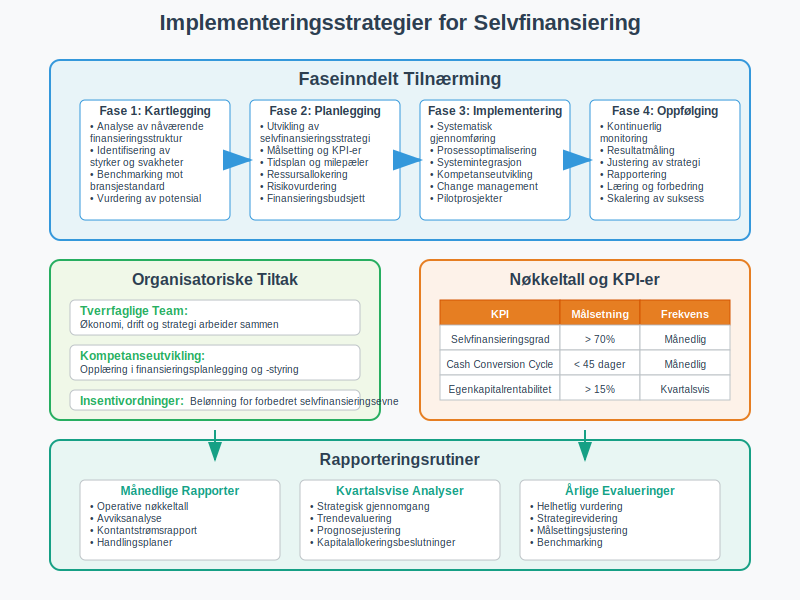

## Konklusjon

**Selvfinansiering** representerer en grunnleggende strategi for å skape finansiell uavhengighet og bærekraftig vekst. Ved å prioritere intern finansiering gjennom [tilbakeholdt overskudd](/blogs/regnskap/hva-er-overskudd "Hva er Overskudd? Komplett Guide til Resultatet av Bedriftens Virksomhet"), optimalisering av [arbeidskapital](/blogs/regnskap/hva-er-arbeidskapital "Hva er Arbeidskapital? Beregning og Styring av Arbeidskapital") og strategisk bruk av [avskrivninger](/blogs/regnskap/hva-er-avskrivning "Hva er Avskrivning? Komplett Guide til Avskrivningsmetoder"), kan bedrifter redusere sin avhengighet av ekstern finansiering og beholde full kontroll over sin strategiske utvikling.

**Nøkkelinnsikter for suksessfull selvfinansiering:**

* **Langsiktig perspektiv:** Selvfinansiering krever tålmodighet og disiplinert [kapitalallokering](/blogs/regnskap/hva-er-kapital "Hva er Kapital? Komplett Guide til Kapitalformer og Kapitalforvaltning")
* **Balansert tilnærming:** Optimalisering mellom vekstinvesteringer og utbytteutdelinger
* **Kontinuerlig optimalisering:** Systematisk forbedring av lønnsomhet og effektivitet
* **Teknologiutnyttelse:** Bruk av moderne verktøy for planlegging og oppfølging

**Strategiske fordeler:**

Selvfinansiering gir bedriften fundamentale fordeler som økt finansiell fleksibilitet, redusert risiko og mulighet for raskere strategiske beslutninger. Ved å bygge opp **finansiell selvstendighet** posisjonerer bedriften seg for å håndtere både utfordringer og muligheter i et dynamisk marked.

**Fremtidsrettet implementering:**

Moderne selvfinansieringsstrategier må integrere digital teknologi, bærekraftshensyn og endrede regulatoriske krav. Ved å kombinere tradisjonelle finansieringsprinsipper med innovative verktøy og metoder, kan bedrifter skape robuste og fleksible finansieringsløsninger som støtter langsiktig verdiskapning.

**Praktisk anvendelse:**

For norske bedrifter innebærer effektiv selvfinansiering en systematisk tilnærming til [resultatplanlegging](/blogs/regnskap/hva-er-budsjett "Hva er Budsjett? Planlegging og Styring av Bedriftens Økonomi"), [investeringsstrategi](/blogs/regnskap/hva-er-anleggsmidler "Hva er Anleggsmidler? Komplett Guide til Faste Eiendeler") og [likviditetsstyring](/blogs/regnskap/hva-er-likviditet "Hva er Likviditet? Måling og Styring av Bedriftens Likviditet"). Ved å etablere klare mål, implementere systematiske prosesser og kontinuerlig måle og forbedre selvfinansieringsevnen, kan bedrifter skape et solid fundament for bærekraftig vekst og verdiskapning.

Selvfinansiering er ikke bare en finansieringsstrategi - det er en grunnleggende tilnærming til bedriftsledelse som prioriterer finansiell ansvar, strategisk uavhengighet og langsiktig verdiskapning. I en tid preget av økonomisk usikkerhet og raske markedsendringer, gir sterk selvfinansieringsevne bedriften den fleksibiliteten og stabiliteten som kreves for å lykkes over tid.


